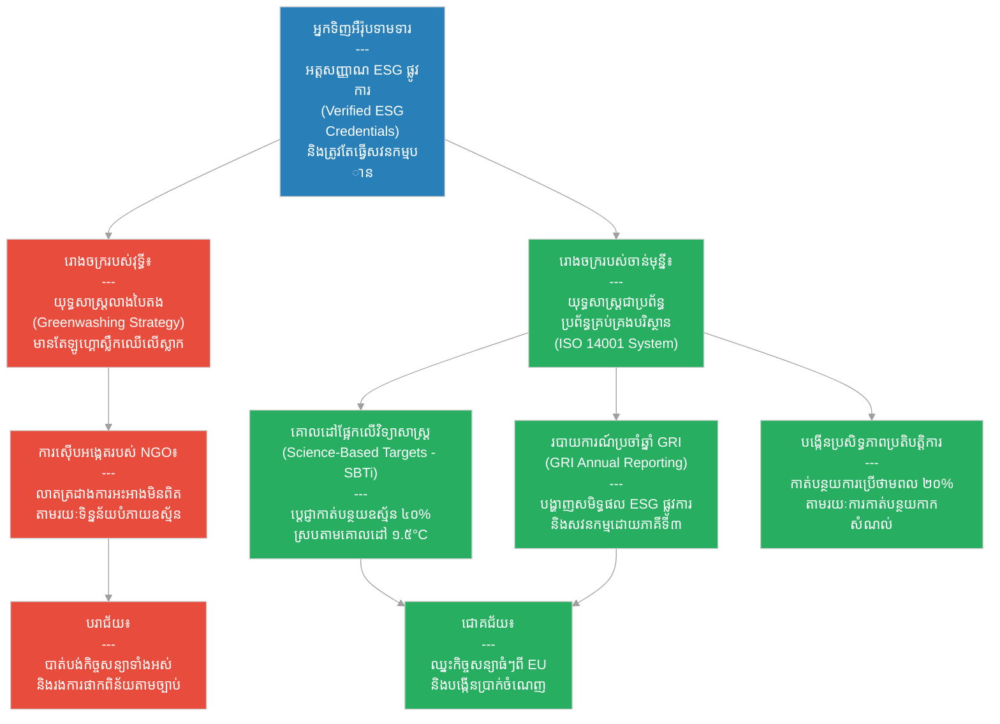

# ២៧៨ — រោងចក្រដែលដាំដើមឈើ (The Factory That Planted Trees)៖ ការអនុវត្តជាក់ស្តែងនៃស្តង់ដារនិរន្តរភាពសាជីវកម្ម
**Subject:** Corporate Sustainability Practices  
**Concept:** SBTi, ISO 14001, ESG integration into core strategy  
**Level:** Year 3  
**Author:** ichamrong  
**Date:** 2026-05-30  
**Tags:** #corporate-sustainability #iso-14001 #sbti #gri-standards #esg-integration #greenwashing #parables #business-sustainability #cambodian-context  
**Category:** Business Sustainability  
**Read Time:** ~4 min  

---

## 📌 មាតិកា (Table of Contents)
- [វិបត្តិធុរកិច្ច និងស្តង់ដារបរិស្ថាន (The Corporate Sustainability Dilemma)](#0)
- [១. រឿងនិទានប្រៀបធៀប៖ វុទ្ធី ចាន់មុន្នី និងរោងចក្រសូត្រទាំងពីរ (The Parable Story)](#1)
- [២. គំនូសតាងលំហូរការងារ (System Flowchart)](#2)
- [៣. មេរៀនពីរឿង (Lesson)](#3)
- [Related Posts](#4)

---

## វិបត្តិធុរកិច្ច និងស្តង់ដារបរិស្ថាន (The Corporate Sustainability Dilemma)

នៅក្នុងពិភពជំនួញសម័យទំនើប សហគ្រាសជាច្រើនតែងតែចង់បាន «កេរ្តិ៍ឈ្មោះបៃតង» ដើម្បីទាក់ទាញអតិថិជន និងដៃគូពាណិជ្ជកម្មអន្តរជាតិ។ ទោះជាយ៉ាងណាក៏ដោយ កំហុសឆ្គងដ៏ធំរបស់សាជីវកម្មមួយចំនួនគឺការប្រើប្រាស់ការផ្សព្វផ្សាយបៃតងតែសំបកក្រៅ ដោយគ្មានការផ្លាស់ប្តូរប្រព័ន្ធប្រតិបត្តិការផ្ទៃក្នុងពិតប្រាកដ។ នៅក្នុងទីផ្សារសកល ការលាងបៃតងគឺជាហានិភ័យដ៏ធ្ងន់ធ្ងរ។ គន្លឹះដើម្បីសម្រេចបាននូវការអភិវឌ្ឍប្រកបដោយចីរភាព និងប្រសិទ្ធភាពសេដ្ឋកិច្ចពិតប្រាកដ គឺការបញ្ចូលប្រព័ន្ធគ្រប់គ្រងបរិស្ថាន ISO 14001 គោលដៅផ្អែកលើវិទ្យាសាស្ត្រ SBTi និងស្តង់ដាររបាយការណ៍ GRI ទៅក្នុងយុទ្ធសាស្ត្រស្នូលរបស់ក្រុមហ៊ុន។

---

## ១. រឿងនិទានប្រៀបធៀប៖ វុទ្ធី ចាន់មុន្នី និងរោងចក្រសូត្រទាំងពីរ (The Parable Story)

រោងចក្រ (factories) ផលិតសូត្រពីរនាក់នៅក្នុងខេត្តតែមួយ បានស្វែងរកឱកាសនាំចេញសូត្រទៅកាន់បណ្តាក្រុមហ៊ុនជួញដូរអឺរ៉ុប ដែលទើបតែចាប់ផ្តើមតម្រូវឱ្យមានព័ត៌មានអត្តសញ្ញាណនិរន្តរភាពបរិស្ថាន និងសង្គម។

ម្ចាស់រោងចក្រទីមួយឈ្មោះ **វុទ្ធី (Vuthy)** បានឆ្លើយតបយ៉ាងលឿនបំផុត។ គាត់បានបោះពុម្ពពាក្យ «សូត្រអេកូឡូស៊ីបៃតង (Eco-friendly silk)» លើរាល់ថង់ច្រកទំនិញទាំងអស់ រចនាកញ្ចប់វេចខ្ចប់ថ្មីដោយមានរូបស្លឹកឈើពណ៌បៃតង រួចចេញផ្សាយសេចក្តីថ្លែងការណ៍ខ្លីមួយទំព័រថា៖ *«ពួកយើងយកចិត្តទុកដាក់ខ្ពស់ចំពោះបរិស្ថានធម្មជាតិ។»* ប៉ុន្តែគ្មានអ្វីនៅក្នុងប្រតិបត្តិការរោងចក្ររបស់គាត់ផ្លាស់ប្តូរឡើយ។ កាកសំណល់ពណ៌ជ្រលក់សូត្ររបស់គាត់នៅតែបង្ហូរចូលប្រឡាយទឹក ដង្ហើមភ្លើងរោងចក្ររបស់គាត់នៅតែដុតធ្យូងថ្មដដែល ហើយកម្មកររបស់គាត់នៅតែត្រូវប៉ះពាល់សារធាតុគីមីជ្រលក់ពណ៌ដោយគ្មានឧបករណ៍ការពារខ្លួនឡើយ។ នេះគឺជាទង្វើ **ការលាងបៃតង (Greenwashing)**។

ម្ចាស់រោងចក្រទីពីរឈ្មោះ **ចាន់មុន្នី (Chanmony)** បានសម្រេចចិត្តដើរតាមផ្លូវផ្សេង។ នាងបានជួលអ្នកពិគ្រោះយោបល់ផ្នែកបរិស្ថានដើម្បីជួយដំឡើង **ប្រព័ន្ធគ្រប់គ្រងបរិស្ថាន ISO 14001 (ISO 14001 Environmental Management System)** — ដែលជាក្របខ័ណ្ឌការងារជាប្រព័ន្ធសម្រាប់តាមដាន គ្រប់គ្រង និងកែលម្អជាប្រចាំនូវសមិទ្ធផលបរិស្ថានពេញមួយប្រតិបត្តិការទាំងមូលរបស់ក្រុមហ៊ុន។ 

បន្ទាប់មក នាងបានរៀបចំបង្កើត **គោលដៅផ្អែកលើវិទ្យាសាស្ត្រ (Science-Based Targets - SBTi)** — ដែលជាគោលដៅកាត់បន្ថយការបំភាយឧស្ម័នឱ្យស្របទៅតាមកម្រិតដែលវិទ្យាសាស្ត្រអាកាសធាតុបានបង្ហាញថ្វាយ ដើម្បីកម្រិតការឡើងកម្តៅភពផែនដីឱ្យនៅត្រឹម ១,៥ អង្សាសេ។ គោលដៅរបស់នាងបានប្តេជ្ញាចិត្តកាត់បន្ថយការបំភាយឧស្ម័នរបស់រោងចក្រឱ្យបានសែសិបភាគរយក្នុងរយៈពេលដប់ឆ្នាំ។ នាងក៏បានធ្វើរបាយការណ៍ប្រចាំឆ្នាំដោយប្រើប្រាស់ **ស្តង់ដាររបាយការណ៍ GRI (GRI Standards)** — ដែលជាក្របខ័ណ្ឌការងាររបស់គំនិតផ្តួចផ្តើមរបាយការណ៍សកល (Global Reporting Initiative) ដែលកំណត់ពីរបៀបដែលក្រុមហ៊ុននានាត្រូវបង្ហាញព័ត៌មានលម្អិតអំពីសមិទ្ធផលបរិស្ថាន សង្គម និងអភិបាលកិច្ច (ESG)។

បីឆ្នាំក្រោយមក រោងចក្ររបស់ចាន់មុន្នីទទួលបានកិច្ចសន្យាជួញដូរធំៗទាំងអស់ពីអឺរ៉ុបដែលបានចូលមកក្នុងខេត្ត។ ក្រុមអ្នកទិញបានតម្រូវឱ្យមាន **ព័ត៌មានអត្តសញ្ញាណ ESG (ESG Credentials)** ដែលអាចធ្វើសវនកម្មផ្ទៀងផ្ទាត់បាន — ពោលគឺមិនមែនជាការអះអាងលំម្អៀងលើស្លាកសញ្ញានោះទេ ប៉ុន្តែគឺជាប្រព័ន្ធប្រតិបត្តិការដែលបានផ្ទៀងផ្ទាត់ គោលដៅដែលបានវាស់វែងច្បាស់លាស់ និងរបាយការណ៍ដែលបានធ្វើសវនកម្មដោយភាគីទីបីឯករាជ្យ។

ចំណែកឯរោងចក្ររបស់វុទ្ធីវិញ ត្រូវបានស៊ើបអង្កេតដោយអង្គការសង្គមស៊ីវិលមួយ ដែលបានប្រៀបធៀបរាល់ការអះអាងពីសមិទ្ធផលបរិស្ថានជាសាធារណៈរបស់គាត់ ធៀបទៅនឹងទិន្នន័យបំភាយឧស្ម័នពិតប្រាកដដែលទទួលបានតាមរយៈការស្នើសុំបង្ហាញព័ត៌មានជាផ្លូវការរបស់រដ្ឋាភិបាល។ របាយការណ៍ស៊ើបអង្កេតនេះត្រូវបានបោះពុម្ពផ្សាយជាសាធារណៈ ធ្វើឱ្យដៃគូទិញយកអឺរ៉ុបធំបំផុតរបស់គាត់ផ្តាច់កិច្ចសន្យាភ្លាមៗ រួចគាត់ត្រូវប្រឈមមុខនឹងការផាកពិន័យយ៉ាងធ្ងន់ធ្ងរពីអាជ្ញាធរច្បាប់សម្រាប់ការផ្សព្វផ្សាយព័ត៌មានបរិស្ថានមិនពិត។

រោងចក្ររបស់ចាន់មុន្នីក៏បានរកឃើញអត្ថប្រយោជន៍ផ្ទៃក្នុងយ៉ាងច្រើនពីប្រព័ន្ធ ISO 14001 ផងដែរ៖ ការប្រើប្រាស់ថាមពលក្នុងរោងចក្របានធ្លាក់ចុះម្ភៃភាគរយនៅក្នុងឆ្នាំទីពីរ ព្រោះប្រព័ន្ធតាមដានទិន្នន័យបានបង្ហាញឱ្យឃើញនូវរាល់ចំណុចខ្ជះខ្ជាយថាមពលដែលគ្មាននរណាម្នាក់ធ្លាប់ចាប់អារម្មណ៍ពីមុនមក។ និរន្តរភាពដែលបង្កប់នៅក្នុងប្រព័ន្ធប្រតិបត្តិការ បានបង្កើតឱ្យមានប្រសិទ្ធភាពការងារ និងកាត់បន្ថយថ្លៃដើម — មិនមែនគ្រាន់តែជាការកសាងកេរ្តិ៍ឈ្មោះល្អនោះឡើយ។

មេរៀនដែលទទួលបានពីជំនួញវាយនភណ្ឌគឺ៖ **«ការអះអាងពីនិរន្តរភាពគ្រាន់តែនៅលើស្លាកសញ្ញា មិនអាចរស់រានបានឡើយនៅពេលជួបការធ្វើសវនកម្មពិតប្រាកដពីអ្នកទិញ។ មានតែសហគ្រាសណាដែលបានបំពេញការងារដ៏លំបាក — រួមមាន ការវាស់វែង ការប្តេជ្ញាចិត្ត ការរាយការណ៍ និងការកែលម្អជាប្រចាំ — ប៉ុណ្ណោះដែលអាចរក្សាបាននូវកិច្ចសន្យាពាណិជ្ជកម្ម និងទទួលបានផលត្រឡប់មកវិញសមស្របនឹងការវិនិយោគរបស់ខ្លួន។»**

---

## ២. គំនូសតាងលំហូរការងារ (System Flowchart)

---

## ៣. មេរៀនពីរឿង (Lesson)

ស្តង់ដារនិរន្តរភាពបរិស្ថាន (sustainability standards) — ដូចជា ISO 14001, SBTi, និង GRI — មិនមែនជាឧបករណ៍ទីផ្សារសម្រាប់ធ្វើការផ្សព្វផ្សាយនោះឡើយ ប៉ុន្តែពួកវាគឺជាក្របខ័ណ្ឌការងារគ្រប់គ្រងប្រតិបត្តិការដែលជួយបង្កើតប្រសិទ្ធភាពការងារ និងកាត់បន្ថយថ្លៃដើមពិតប្រាកដដែលអាចវាស់វែងបាន។ ការលាងបៃតង (Greenwashing) — ការអះអាងពីសមិទ្ធផលបរិស្ថានដោយគ្មានប្រព័ន្ធទ្រទ្រង់ផ្ទៃក្នុង — គឺមិនត្រឹមតែជាការខុសក្រមសីលធម៌ប៉ុណ្ណោះទេ ប៉ុន្តែវាគឺជាហានិភ័យអាជីវកម្មដ៏ធ្ងន់ធ្ងរ ព្រោះអ្នកទិញ អង្គការសង្គមស៊ីវិល និងអាជ្ញាធរច្បាប់កាន់តែមានលទ្ធភាពខ្ពស់ក្នុងការផ្ទៀងផ្ទាត់រាល់ការអះអាងធៀបនឹងភស្តុតាងជាក់ស្តែង។

---

## Related Posts

- **[Corporate Sustainability Practices](../05-corporate-sustainability-practices.md)** — Advanced corporate sustainability covering ISO 14001, science-based targets, GRI reporting, ESG integration, and strategic sustainability management.
