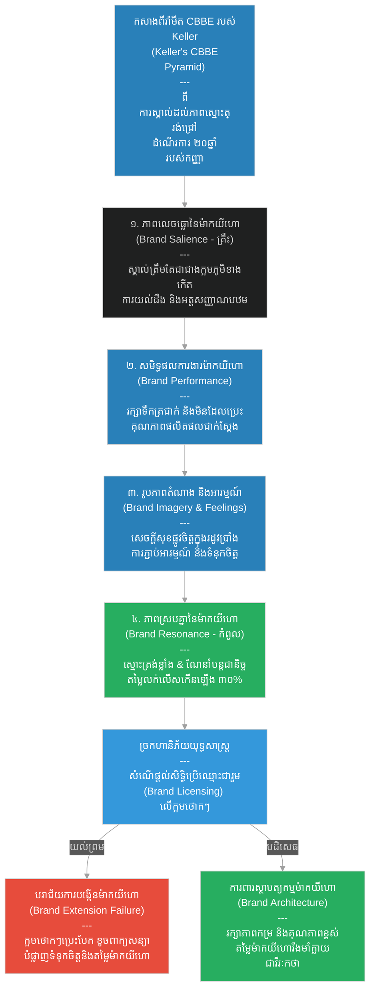

# ២៧៩ — ជាងក្អមដែលឈ្មោះរបស់នាងក្លាយជាវីរៈកថា (The Potter Whose Name Became a Legend)៖ យុទ្ធសាស្ត្រ និងការគ្រប់គ្រងម៉ាកយីហោ
**Subject:** Brand Strategy & Management  
**Concept:** Keller's CBBE pyramid, brand equity, brand architecture  
**Level:** Year 3  
**Author:** ichamrong  
**Date:** 2026-05-30  
**Tags:** #brand-strategy #brand-equity #cbbe-pyramid #brand-architecture #brand-resonance #parables #business-sustainability #cambodian-context  
**Category:** Business Sustainability  
**Read Time:** ~4 min  

---

## 📌 មាតិកា (Table of Contents)
- [វិបត្តិធុរកិច្ច និងយុទ្ធសាស្ត្រម៉ាកយីហោ (The Brand Strategy Dilemma)](#0)
- [១. រឿងនិទានប្រៀបធៀប៖ កញ្ញា និងក្អមដីដុតរស់រវើក (The Parable Story)](#1)
- [២. គំនូសតាងលំហូរការងារ (System Flowchart)](#2)
- [៣. មេរៀនពីរឿង (Lesson)](#3)
- [Related Posts](#4)

---

## វិបត្តិធុរកិច្ច និងយុទ្ធសាស្ត្រម៉ាកយីហោ (The Brand Strategy Dilemma)

នៅក្នុងយុទ្ធសាស្ត្រ និងការគ្រប់គ្រងម៉ាកយីហោ ទ្រព្យសម្បត្តិដ៏មានតម្លៃបំផុតរបស់សហគ្រាសគឺមិនមែនជាម៉ាស៊ីនផលិតកម្ម ឬអគាររោងចក្រឡើយ ប៉ុន្តែវាគឺ «តម្លៃម៉ាកយីហោ» នៅក្នុងចិត្តរបស់អ្នកប្រើប្រាស់។ ម៉ាកយីហោដ៏មានឥទ្ធិពលមួយត្រូវបានកសាងឡើងយ៉ាងយឺតៗតាមរយៈការផ្តល់នូវការសន្យាដ៏មានគុណភាពប្រកបដោយភាពស៊ីសង្វាក់គ្នា ប៉ុន្តែវាអាចត្រូវបានបំផ្លាញទៅវិញយ៉ាងលឿនបំផុតតាមរយៈការសម្រេចចិត្តពង្រីកម៉ាកយីហោខុសឆ្គង។ តាមរយៈការយល់ដឹងពី ពីរ៉ាមីត CBBE របស់ Keller ទ្រព្យសកម្មម៉ាកយីហោ និងស្ថាបត្យកម្មម៉ាកយីហោ អាជីវកម្មអាចការពារតម្លៃ និងកសាងទំនុកចិត្តប្រកបដោយចីរភាព។

---

## ១. រឿងនិទានប្រៀបធៀប៖ កញ្ញា និងក្អមដីដុតរស់រវើក (The Parable Story)

ជាងក្អម (potter) ម្នាក់ឈ្មោះ **កញ្ញា (Kanha)** បានផលិតក្អមទឹកដីឥដ្ឋនៅក្នុងសិប្បកម្មខ្នាតតូចមួយអស់រយៈពេលម្ភៃឆ្នាំមកហើយ។ ដំបូងឡើយ ប្រជាពលរដ្ឋនៅក្នុងទីផ្សារស្គាល់ឈ្មោះរបស់នាងត្រឹមតែជា *«ជាងក្អមមកពីភូមិខាងកើត»* ប៉ុណ្ណោះ — ដំណាក់កាលនេះហៅថា **ភាពលេចធ្លោនៃម៉ាកយីហោ (Brand Salience)**៖ ពោលគឺមនុស្សគ្រាន់តែដឹងថានាងមានវត្តមាន ឬមានអត្ថិភាព ប៉ុន្តែគ្មានព័ត៌មានអ្វីច្រើនជាងនេះឡើយ។ 

ក្នុងរយៈពេលប្រាំឆ្នាំក្រោយមក នាងបានកសាងកេរ្តិ៍ឈ្មោះល្អចំពោះក្អមទឹករបស់នាង ដែលអាចរក្សាទឹកឱ្យត្រជាក់ជានិច្ចនៅកំឡុងពេលកម្តៅថ្ងៃខ្លាំង និងមិនដែលប្រេះស្រុតឡើយក្នុងកំឡុងពេលរដូវវស្សា — ដំណាក់កាលនេះហៅថា **សមិទ្ធផលការងាររបស់ម៉ាកយីហោ (Brand Performance)**៖ ផលិតផលរបស់នាងបានបំពេញតម្រូវការជាក់ស្តែងរបស់អ្នកប្រើប្រាស់បានយ៉ាងល្អឥតខ្ចោះ និងប្រកបដោយភាពស៊ីសង្វាក់គ្នា។

អ្នកទិញចាប់ផ្តើមនិយាយតៗគ្នាថា ឈ្មោះកញ្ញាមានអារម្មណ៍ពិសេសមួយភ្ជាប់ជាមួយ៖ *«ក្អមទឹករបស់កញ្ញា មានន័យថាសេចក្តីសុខផ្លូវចិត្តសម្រាប់រដូវប្រាំងដ៏ក្តៅស្ងួត»* — នេះជាដំណាក់កាល **រូបភាពតំណាង និងអារម្មណ៍ចំពោះម៉ាកយីហោ (Brand Imagery & Feelings)** ដែលជាស្រទាប់កណ្តាលនៃ **ពីរ៉ាមីត CBBE របស់ Keller (Keller's CBBE Pyramid)**។

ដប់ឆ្នាំក្រោយមក អ្វីៗបានផ្លាស់ប្តូរយ៉ាងខ្លាំង។ អ្នកទិញមិនត្រឹមតែមកទិញក្អមរបស់នាងប៉ុណ្ណោះទេ — ពួកគេថែមទាំងបានណែនាំបន្តទៅកាន់កូនស្រីរបស់ពួកគេ យកវាទៅធ្វើជាកាដូដ៏មានតម្លៃ និងបដិសេធមិនព្រមប្រើប្រាស់ក្អមរបស់ជាងដទៃឡើយ។ នេះគឺជា **ភាពស្របគ្នា និងភាពស្មោះត្រង់នឹងម៉ាកយីហោ (Brand Resonance)** — ដែលជាចំណុចកំពូលនៃពីរ៉ាមីត CBBE — ជាកម្រិតនៃភាពស្មោះត្រង់ដ៏ជ្រាលជ្រៅ និងសកម្មបំផុត ដែលម៉ាកយីហោបានក្លាយជាចំណែកមួយនៃអត្តសញ្ញាណរបស់អ្នកប្រើប្រាស់។ 

**ទ្រព្យសកម្មម៉ាកយីហោ (Brand Equity)** បានកកកុញជាលំដាប់៖ អ្នកទិញមានឆន្ទៈបង់ថ្លៃលក់ខ្ពស់ជាងរហូតដល់សាមសិបភាគរយសម្រាប់ក្អមកញ្ញា បើធៀបនឹងក្អមធម្មតាដែលមានទម្រង់ដូចគ្នាទាំងស្រុងតែគ្មានឈ្មោះម៉ាកយីហោ។ ជាងក្អមគូប្រជែងម្នាក់បានលួចចម្លងរចនាបថរបស់នាងទាំងស្រុង — ប្រើប្រាស់ដីឥដ្ឋដូចគ្នា រូបរាងដូចគ្នា និងការដុតដូចគ្នា។ អតិថិជនបានដឹង ពួកគេបានមកប៉ះក្អមចម្លងនោះ ប៉ុន្តែបន្ទាប់មកនៅតែបន្តមកទិញក្អមរបស់កញ្ញាដដែល ព្រោះម៉ាកយីហោរបស់នាងផ្ទុកនូវអត្ថន័យ និងទំនុកចិត្តដែលក្អមចម្លងមិនអាចចម្លងតាមបានឡើយ។

បន្ទាប់មក ពាណិជ្ជករម្នាក់មកពីទីក្រុងដ៏ឆ្ងាយបានមកជួបកញ្ញា។ គាត់បានស្នើឡើងនូវ **កិច្ចព្រមព្រៀងផ្តល់សិទ្ធិប្រើប្រាស់ម៉ាកយីហោ (Brand Licensing Deal)**៖ គាត់នឹងផលិតក្អមដីឥដ្ឋខ្នាតធំដែលមានតម្លៃថោកដោយប្រើប្រាស់ឈ្មោះ និងនិមិត្តសញ្ញារបស់កញ្ញា រួចបង់ប្រាក់សេវាសិទ្ធិ (fee) ឱ្យនាងសម្រាប់រាល់ក្អមនីមួយៗដែលលក់ដាច់។ ក្អមទាំងនោះនឹងមិនត្រូវបានផលិតដោយដៃរបស់កញ្ញាផ្ទាល់ឡើយ ពួកគេនឹងប្រើប្រាស់ដីឥដ្ឋដែលមានតម្លៃថោក ហើយនឹងត្រូវប្រេះស្រុតនៅរដូវវស្សាទីបីជាក់ជាមិនខាន។ នេះជាហានិភ័យដ៏ធំធេងនៃ **ហានិភ័យពង្រីកម៉ាកយីហោ (Brand Extension Risk)**៖ ការពង្រីកម៉ាកយីហោទៅលើផលិតផលដែលមិនអាចផ្តល់នូវការសន្យាគុណភាពដូចមុន នឹងបំផ្លាញទ្រព្យសកម្មម៉ាកយីហោដែលធ្លាប់តែមានតម្លៃទាំងស្រុង។ កញ្ញាបានបដិសេធសំណើនោះភ្លាមៗ។

ការបដិសេធរបស់នាង គឺជាការសម្រេចចិត្តដ៏ឆ្លាតវៃលើ **ស្ថាបត្យកម្មម៉ាកយីហោ (Brand Architecture)** — ដែលជាជម្រើសកំណត់ពីរបៀបដែលឈ្មោះម៉ាកយីហោត្រូវបានបង្ហាញ និងអ្វីដែលវាសន្យាដល់អតិថិជន។ ឈ្មោះកញ្ញានឹងត្រូវលេចឡើងតែលើក្អមណាដែលត្រូវបានផលិតឡើងដោយដៃរបស់នាងផ្ទាល់ នៅក្នុងសិប្បកម្មរបស់នាងប៉ុណ្ណោះ។ នាងបានជ្រើសរើសការពារទ្រព្យសកម្មម៉ាកយីហោរយៈពេលវែង ជាជាងការយកប្រាក់ចំណូលរយៈពេលខ្លីពីការផ្តល់សិទ្ធិ។ ឈ្មោះរបស់នាងបានក្លាយជាវីរៈកថាដ៏ល្បីល្បាញ មិនមែនទោះបីជាមានដែនកំណត់នេះទេ ប៉ុន្តែគឺដោយសារតែដែនកំណត់នេះឯង៖ **«ភាពកម្រមាន និងភាពស៊ីសង្វាក់គ្នា គឺជាលក្ខខណ្ឌដែលជួយឱ្យទំនុកចិត្តកើនឡើងជាលំដាប់ជានិរន្តរភាព។»**

---

## ២. គំនូសតាងលំហូរការងារ (System Flowchart)

---

## ៣. មេរៀនពីរឿង (Lesson)

ពីរ៉ាមីត CBBE របស់ Keller (Keller's CBBE pyramid) ជួយពន្យល់ពីរបៀបដែលទ្រព្យសកម្មម៉ាកយីហោ (brand equity) ត្រូវបានកសាងឡើង៖ រាប់ចាប់ពីការយល់ដឹងជាគ្រឹះ ឆ្លងកាត់សមិទ្ធផលការងារ និងរូបភាពតំណាង រហូតដល់ភាពស្របគ្នា និងភាពស្មោះត្រង់នៅចំណុចកំពូល។ ទ្រព្យសកម្មម៉ាកយីហោត្រូវបានកសាងឡើងយ៉ាងយឺតៗតាមរយៈការផ្តល់នូវសមិទ្ធផលប្រកបដោយភាពស៊ីសង្វាក់គ្នា ប៉ុន្តែវាអាចត្រូវបានបំផ្លាញទៅវិញយ៉ាងលឿនតាមរយៈការលោភលន់ពង្រីកម៉ាកយីហោខុសផ្លូវ។ ការសម្រេចចិត្តលើស្ថាបត្យកម្មម៉ាកយីហោ (brand architecture) — ថាតើឈ្មោះគួរលេចឡើងលើផលិតផលណាខ្លះ និងសន្យាពីអ្វីខ្លះ — គឺជាជម្រើសយុទ្ធសាស្ត្រដ៏មានឥទ្ធិពលបំផុតដែលម្ចាស់អាជីវកម្មត្រូវតែការពារឱ្យបានត្រឹមត្រូវបំផុត។

---

## Related Posts

- **[Brand Strategy & Management](../06-brand-strategy-and-management.md)** — Brand strategy theory covering Keller's CBBE pyramid, brand equity measurement, brand architecture, and the risks of brand extension.
