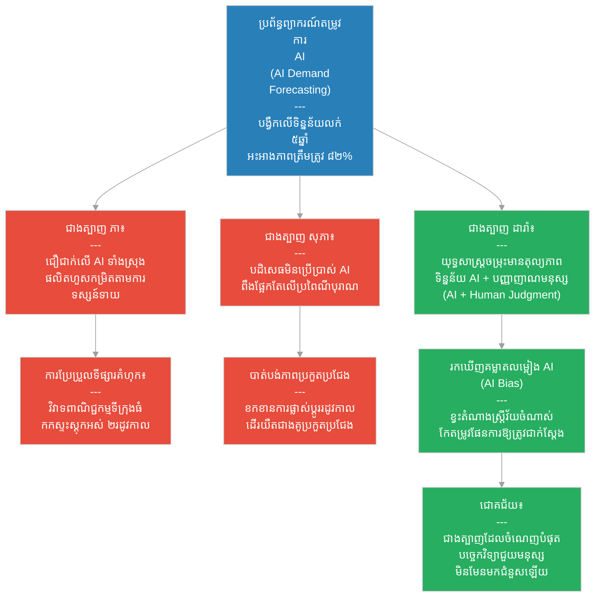

# ២៨០ — ម៉ាស៊ីនព្យាករណ៍ និងជាងត្បាញក្រណាត់ (The Oracle Machine and the Weaver)៖ បច្ចេកវិទ្យា និងបញ្ញាសិប្បនិម្មិតក្នុងធុរកិច្ច
**Subject:** Technology & AI in Business  
**Concept:** AI use cases in business, AI ethics, digital transformation  
**Level:** Year 3  
**Author:** ichamrong  
**Date:** 2026-05-30  
**Tags:** #technology-ai #ai-ethics #digital-transformation #demand-forecasting #ai-bias #parables #business-sustainability #cambodian-context  
**Category:** Business Sustainability  
**Read Time:** ~4 min  

---

## 📌 មាតិកា (Table of Contents)
- [វិបត្តិធុរកិច្ច និងការបំប្លែងខ្លួនទៅជាឌីជីថល (The Digital Transformation Dilemma)](#0)
- [១. រឿងនិទានប្រៀបធៀប៖ ជាងត្បាញទាំងបី និងម៉ាស៊ីនព្យាករណ៍ (The Parable Story)](#1)
- [២. គំនូសតាងលំហូរការងារ (System Flowchart)](#2)
- [៣. មេរៀនពីរឿង (Lesson)](#3)
- [Related Posts](#4)

---

## វិបត្តិធុរកិច្ច និងការបំប្លែងខ្លួនទៅជាឌីជីថល (The Digital Transformation Dilemma)

នៅក្នុងយុគសម័យនៃការបំប្លែងខ្លួនទៅជាឌីជីថល បច្ចេកវិទ្យាទំនើបៗ និងបញ្ញាសិប្បនិម្មិត (AI) បានក្លាយជាឧបករណ៍ដ៏មានឥទ្ធិពលបំផុតក្នុងការវិភាគទិន្នន័យ និងព្យាករណ៍និន្នាការទីផ្សារ។ ទោះជាយ៉ាងណាក៏ដោយ កំហុសឆ្គងដ៏ធំរបស់សហគ្រាសជាច្រើនគឺការផ្តល់ទំនុកចិត្តទាំងស្រុងទៅលើក្បួនដោះស្រាយរបស់ម៉ាស៊ីន ដោយមើលរំលងគម្លាតលម្អៀងនៃទិន្នន័យចាស់ៗ និងកាត់ចោលទាំងស្រុងនូវការវិនិច្ឆ័យរបស់មនុស្ស។ គន្លឹះជោគជ័យគឺការប្រើប្រាស់ AI ជាឧបករណ៍ជំនួយក្នុងការសម្រេចចិត្ត មិនមែនជាអាជ្ញាធរផ្តាច់ការឡើយ ដោយរួមបញ្ចូលគ្នារវាងសមត្ថភាពបច្ចេកវិទ្យា និងបញ្ញាញាណរបស់មនុស្សពិតប្រាកដ។

---

## ១. រឿងនិទានប្រៀបធៀប៖ ជាងត្បាញទាំងបី និងម៉ាស៊ីនព្យាករណ៍ (The Parable Story)

ភូមិត្បាញក្រណាត់ (weaving village) មួយបានត្បាញលំនាំក្រណាត់ដោយដៃអស់ជាច្រើនជំនាន់មកហើយ ដោយជាងត្បាញជាន់ខ្ពស់ម្នាក់ៗចងចាំក្នុងខួរក្បាលរបស់ខ្លួននូវលំនាំក្រណាត់ដែលលក់ដាច់បំផុតទៅតាមរដូវកាលនីមួយៗ។ 

ពាណិជ្ជករម្នាក់មកពីទីក្រុងធំបានធ្វើដំណើរមកដល់ភូមិជាមួយនឹងម៉ាស៊ីនព្យាករណ៍មួយ — ដែលជាប្រព័ន្ធ **ទស្សន៍ទាយតម្រូវការដោយបញ្ញាសិប្បនិម្មិត (AI Demand Forecasting)** ដែលត្រូវបានបង្វឹកបណ្តុះបណ្តាលលើទិន្នន័យនៃការលក់នៅលើទីផ្សាររយៈពេលប្រាំឆ្នាំកន្លងមកពីខេត្តចំនួនដប់។ វាអាចព្យាករណ៍បានថាលំនាំក្រណាត់ណាខ្លះនឹងត្រូវលក់ដាច់នៅក្នុងត្រីមាសបន្ទាប់ ជាមួយនឹងកម្រិតភាពត្រឹមត្រូវរហូតដល់ប៉ែតសិបពីរភាគរយ។ មេភូមិបានបែងចែកម៉ាស៊ីននេះទៅឱ្យជាងត្បាញទាំងអស់ រួចដាស់តឿនថា៖ *«ចូរធ្វើតាមអ្វីដែលម៉ាស៊ីននេះប្រាប់ចុះ។»*

ជាងត្បាញបីនាក់បានឆ្លើយតបទៅនឹងបច្ចេកវិទ្យានេះតាមរបៀបខុសៗគ្នា៖

**ជាងត្បាញទីមួយ៖** គឺស្រ្តីវ័យក្មេងម្នាក់ឈ្មោះ **ភា (Phea)** បានជឿទុកចិត្តលើម៉ាស៊ីនព្យាករណ៍ទាំងស្រុង រួចផលិតក្រណាត់តាមលំនាំដែលម៉ាស៊ីនបានទស្សន៍ទាយច្រើនជាងធម្មតារហូតដល់បីដង។ នៅពេលមានវិវាទពាណិជ្ជកម្មភ្លាមៗបានរំខានដល់ទីផ្សារទីក្រុងធំ (ដែលជាទីផ្សារផ្ទុកទិន្នន័យបណ្តុះបណ្តាលរបស់ម៉ាស៊ីន) តម្រូវការទីផ្សារក៏បានប្រែប្រួលភ្លាមៗ — លំនាំក្រណាត់ដែលម៉ាស៊ីនទស្សន៍ទាយលែងពេញនិយមទៀតហើយ ធ្វើឱ្យក្រណាត់កកកុញក្នុងស្តុករបស់នាងដោយលក់មិនដាច់សោះអស់រយៈពេលពីររដូវកាល។

**ជាងត្បាញទីពីរ៖** គឺចាស់ទុំម្នាក់ឈ្មោះ **សុភា (Sopha)** បានបដិសេធមិនព្រមប្រើប្រាស់ម៉ាស៊ីននោះទាល់តែសោះ ដោយនិយាយថាម៉ាស៊ីនមិនអាចយល់ពីព្រលឹងនៃសរសៃអំបោះ និងក្រណាត់ឡើយ។ នាងបន្តត្បាញក្រណាត់តាមលំនាំដែលនាងធ្លាប់ធ្វើតាំងពីមុនមក រួចសន្សឹមៗក៏ត្រូវដើរយឺតជាងជាងត្បាញផ្សេងទៀត ដែលអាចដឹងពីការផ្លាស់ប្តូរតម្រូវការទីផ្សារមុននាងរហូតដល់ពីរខែ។

**ជាងត្បាញទីបី៖** គឺស្រ្តីម្នាក់ឈ្មោះ **ដារ៉ា (Dara)** បានពិគ្រោះសួរទិន្នន័យពីម៉ាស៊ីនព្យាករណ៍ — រួចនាងបានបន្ថែមធាតុចូលសំខាន់ៗពីរទៀត៖ 
1. បញ្ញាញាណ និងការចងចាំនៃលំនាំក្រណាត់រយៈពេលសាមសិបឆ្នាំផ្ទាល់ខ្លួនរបស់នាង។
2. ការសង្កេតផ្ទាល់លើអ្វីដែលពាណិជ្ជករក្នុងស្រុកកំពុងតែកុម្ម៉ង់ទិញជាក់ស្តែងនៅក្នុងខែនោះ។

នៅពេលដែលម៉ាស៊ីនទស្សន៍ទាយនិយាយថា «ពណ៌ខៀវចាស់» ប៉ុន្តែពាណិជ្ជករកំពុងសួររក «ពណ៌ដីឥដ្ឋ» នាងបានសម្រេចចិត្តផលិតភាគច្រើនជាពណ៌ដីឥដ្ឋ រួចផលិតតែមួយចំណែកតូចសម្រាប់សាកល្បងទីផ្សារចំពោះពណ៌ខៀវចាស់។ នាងក៏បានចាប់អារម្មណ៍ឃើញចំណុចខុសឆ្គងមួយនៅក្នុងទិន្នន័យចេញរបស់ម៉ាស៊ីន៖ វាតែងតែវាយតម្លៃទាបជាងការពិតជានិច្ចចំពោះតម្រូវការរបស់អ្នកទិញដែលមានអាយុលើសពីហាសិបឆ្នាំ — ដែលជាក្រុមស្រ្តីវ័យចំណាស់ដែលទិញលំនាំក្រណាត់ខុសពីគេ។ តាមពិតទៅ ទិន្នន័យបណ្តុះបណ្តាលរបស់ម៉ាស៊ីនត្រូវបានប្រមូលផ្តុំតែពីទីផ្សារទីក្រុងទំនើបៗ ដែលគ្មានចំណែកនៃក្រុមអតិថិជនវ័យចំណាស់ឡើយ — នេះជា **គម្លាតលម្អៀងនៃបញ្ញាសិប្បនិម្មិត (AI Bias)** ដែលគ្មាននរណាម្នាក់ដទៃទៀតចាប់អារម្មណ៍ឃើញឡើយ។

ដារ៉ាបានរាយការណ៍ពីគម្លាតលម្អៀងនេះទៅកាន់ពាណិជ្ជករដែលជាម្ចាស់ម៉ាស៊ីន រួចបានកែតម្រូវទិន្នន័យនៅក្នុងផែនការផលិតកម្មផ្ទាល់ខ្លួនរបស់នាង។ ក្នុងរយៈពេលបីរដូវកាលក្រោយមក នាងបានក្លាយជាជាងត្បាញដែលទទួលបានផលចំណេញខ្ពស់បំផុតនៅក្នុងភូមិ — មិនមែនដោយសារនាងមានម៉ាស៊ីន AI ល្អជាងគេនោះទេ ប៉ុន្តែគឺដោយសារនាងយល់ច្បាស់ថា **បច្ចេកវិទ្យាជួយបង្កើនបញ្ញាញាណរបស់មនុស្ស មិនមែនមកជំនួសវាឡើយ**។ 

ម៉ាស៊ីនព្យាករណ៍គឺជាឧបករណ៍ដ៏មានឥទ្ធិពលក្នុងការស្វែងរកលំនាំឆ្លងកាត់សំណុំទិន្នន័យធំៗ ប៉ុន្តែវាមិនអាចសង្កេតឃើញនូវអ្វីដែលពាណិជ្ជករកំពុងនិយាយផ្ទាល់នៅព្រឹកនេះឡើយ វាមិនអាចដឹងថាទិន្នន័យបណ្តុះបណ្តាលរបស់វាខ្វះតំណាងក្រុមស្រ្តីវ័យចំណាស់ឡើយ ហើយវាក៏មិនអាចយកការវិនិច្ឆ័យនៃបទពិសោធន៍សាមសិបឆ្នាំទៅប្រៀបធៀបនឹងការទស្សន៍ទាយរបស់ក្បួនដោះស្រាយនោះឡើយ។ មានតែដារ៉ាម្នាក់គត់ដែលអាចធ្វើកិច្ចការទាំងបីនេះបានស្របពេលគ្នា។

---

## ២. គំនូសតាងលំហូរការងារ (System Flowchart)

---

## ៣. មេរៀនពីរឿង (Lesson)

បញ្ញាសិប្បនិម្មិត (AI) មានឥទ្ធិពលយ៉ាងខ្លាំងក្នុងការស្វែងរកលំនាំឆ្លងកាត់សំណុំទិន្នន័យធំៗ — ប៉ុន្តែវាអាចទទួលមរតកនូវគម្លាតលម្អៀង (biases) នៃសំណុំទិន្នន័យដែលវាត្រូវបានបង្វឹកបណ្តុះបណ្តាលពីមុនមក ហើយវាមិនអាចមកជំនួសឱ្យការសង្កេតផ្ទាល់ បទពិសោធន៍ឯកទេស ឬការវិនិច្ឆ័យផ្នែកសីលធម៌របស់មនុស្សឡើយ។ ការបំប្លែងខ្លួនទៅជាឌីជីថល (Digital transformation) ទទួលបានជោគជ័យនៅពេលដែលមនុស្សប្រើប្រាស់ AI ជាធាតុចូលមួយក្នុងចំណោមធាតុចូលជាច្រើន — មិនមែនជាអាជ្ញាធរផ្តាច់ការសម្រេចចិត្តឡើយ — ហើយនៅពេលដែលអ្នកអនុវត្តមានចំណេះដឹងគ្រប់គ្រាន់ដើម្បីកំណត់អត្តសញ្ញាណ និងរាយការណ៍ពីគម្លាតលម្អៀងនៅពេលពួកគេប្រទះឃើញវា។

---

## Related Posts

- **[Technology & AI in Business](../07-technology-and-ai-in-business.md)** — Applied technology and AI strategy covering demand forecasting, AI bias, digital transformation, and the integration of human judgment with algorithmic tools.
