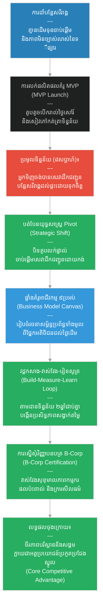

# ២៨១ — កសិករវ័យក្មេងដែលបង្កើតទីផ្សារបៃតង (The Young Farmer Who Built a Green Market)៖ សហគ្រិនភាពប្រកបដោយនិរន្តរភាព និងធុរកិច្ចបែបស្ដើង
**Subject:** Sustainable Entrepreneurship  
**Concept:** Lean startup, Business Model Canvas, B-Corp  
**Level:** Year 4  
**Author:** ichamrong  
**Date:** 2026-05-30  
**Tags:** #sustainable-entrepreneurship #lean-startup #mvp #pivot #business-model-canvas #b-corp #parables #business-sustainability #cambodian-context  
**Category:** Business Sustainability  
**Read Time:** ~4 min  

---

## 📌 មាតិកា (Table of Contents)
- [វិបត្តិធុរកិច្ច និងសហគ្រិនភាពបៃតង (The Sustainable Entrepreneurship Dilemma)](#0)
- [១. រឿងនិទានប្រៀបធៀប៖ សំរិទ្ធ និងបន្លែសរីរាង្គបត់បែន (The Parable Story)](#1)
- [２. គំនូសតាងលំហូរការងារ (System Flowchart)](#2)
- [៣. មេរៀនពីរឿង (Lesson)](#3)
- [Related Posts](#4)

---

## វិបត្តិធុរកិច្ច និងសហគ្រិនភាពបៃតង (The Sustainable Entrepreneurship Dilemma)

នៅក្នុងសហគ្រិនភាពប្រកបដោយចីរភាព បញ្ហាប្រឈមធំបំផុតរបស់សហគ្រិនថ្មីថ្មោង គឺការចំណាយប្រាក់សន្សំ និងពេលវេលាទាំងអស់ទៅលើការបង្កើតអាជីវកម្មខ្នាតធំភ្លាមៗ ដោយគ្មានការផ្ទៀងផ្ទាត់តម្រូវការទីផ្សារជាក់ស្តែង។ គន្លឹះដើម្បីជោគជ័យគឺការប្រើប្រាស់វិធីសាស្ត្រចាប់ផ្តើមធុរកិច្ចបែបស្ដើង ដើម្បីកាត់បន្ថយហានិភ័យ និងការខាតបង់ តាមរយៈការធ្វើតេស្តផលិតផលគំរូអប្បបរមា ការយល់ដឹងពីផ្ទាំងគំរូអាជីវកម្ម និងការអនុលោមតាមស្តង់ដារ B-Corp ដើម្បីកសាងទំនុកចិត្ត និងប្រសិទ្ធភាពសង្វាក់តម្លៃរយៈពេលវែង។

---

## ១. រឿងនិទានប្រៀបធៀប៖ សំរិទ្ធ និងបន្លែសរីរាង្គបត់បែន (The Parable Story)

កសិករវ័យក្មេង (young farmer) ម្នាក់ឈ្មោះ **សំរិទ្ធ (Samrith)** បានដាំបន្លែសរីរាង្គនៅលើដីឡូត៍ខ្នាតតូចមួយនៅជាយក្រុងភ្នំពេញ។ គាត់ជឿជាក់យ៉ាងមុតមាំថាមានទីផ្សារសម្រាប់បន្លែដែលគ្មានជាតិគីមីកសិកម្ម ប៉ុន្តែគាត់គ្មានដើមទុនគ្រប់គ្រាន់សម្រាប់បើកហាងលក់បន្លែផ្ទាល់ខ្លួនឡើយ ហើយក៏មិនច្បាស់លាស់ដែរថាតើអ្នកទិញមានឆន្ទៈបង់ប្រាក់ថ្លៃជាងទីផ្សារធម្មតាដែរឬទេ។ 

គ្រូបង្វឹកម្នាក់បានណែនាំគាត់ឱ្យស្គាល់ **វិធីសាស្ត្រចាប់ផ្តើមធុរកិច្ចបែបស្ដើង (Lean Startup)**៖ *កុំទាន់អាលសាងសង់អាជីវកម្មខ្នាតធំទាំងស្រុងតាំងពីដំបូង — ចូរសាកល្បងជាមួយនឹងកំណែទម្រង់ផលិតផលដែលមានទំហំតូចបំផុតដែលអាចឆ្លើយតបទៅនឹងសំណួរគន្លឹះរបស់ទីផ្សារបាន។*

**ផលិតផលគំរូអប្បបរមា (Minimum Viable Product - MVP)** របស់សំរិទ្ធ គឺគ្រាន់តែជាតូបតូចមួយដែលបើករៀងរាល់ថ្ងៃសៅរ៍ ដែលមានបន្លែចំនួនដប់ប្រភេទ ស្លាកសញ្ញាសរសេរដោយដៃ និងសៀវភៅកត់ត្រាមួយក្បាលសម្រាប់កត់ត្រាថាតើនរណាខ្លះជាអ្នកទិញ ទិញអ្វីខ្លះ និងហេតុអ្វីបានជាទិញ។

បន្ទាប់ពីរយៈពេលប្រាំបីសប្តាហ៍ ទិន្នន័យនៅក្នុងសៀវភៅកត់ត្រាបានបង្ហាញព័ត៌មានខុសប្លែកទាំងស្រុងពីអ្វីដែលគាត់ធ្លាប់បានរំពឹងទុក។ អតិថិជនចូលចិត្តបន្លែរបស់គាត់ខ្លាំងណាស់ ប៉ុន្តែភាគច្រើននៃពួកគេមិនបានធ្វើដំណើរមកកាន់តូបលក់ផ្ទាល់ឡើយ — ពួកគេបានទូរស័ព្ទមកសួរមុន និងសួរថាតើគាត់មានសេវាដឹកជញ្ជូនដល់ផ្ទះដែរឬទេ។ តូបលក់មិនមែនជាផលិតផលពិតប្រាកដនោះឡើយ ផលិតផលពិតប្រាកដដែលទីផ្សារត្រូវការ គឺសេវាដឹកជញ្ជូនបន្លែសរីរាង្គដល់ផ្ទះប្រកបដោយទំនុកចិត្ត និងតម្លៃសមរម្យ។

ទង្វើនេះនាំឱ្យមាន **ការបត់បែនយុទ្ធសាស្ត្រ (Pivot)** — ដែលជាពាក្យបច្ចេកទេសក្នុងធុរកិច្ចបែបស្ដើង សម្រាប់សម្គាល់ការផ្លាស់ប្តូរជាគ្រឹះនៃគំរូអាជីវកម្មផ្អែកលើភស្តុតាងទីផ្សារពិតប្រាកដ។ គាត់បានបិទតូបលក់ រួចចាប់ផ្តើមសេវាដឹកជញ្ជូនបន្លែដោយកង់នៅក្នុងសហគមន៍ចំនួនពីរ។ គាត់បានបំពេញព័ត៌មានទៅក្នុង **ផ្ទាំងគំរូអាជីវកម្ម (Business Model Canvas)** — ដែលជាក្របខ័ណ្ឌការងារមានប្រាំបួនប្រអប់ រួមមាន៖ ក្រុមអតិថិជនគោលដៅ គុណតម្លៃនៃផលិតផល ច្រកផ្លូវចែកចាយ ទំនាក់ទំនងអតិថិជន ប្រភពចំណូល ធនធានគន្លឹះ សកម្មភាពគន្លឹះ ដៃគូគន្លឹះ និងរចនាសម្ព័ន្ធថ្លៃដើម។ ផ្ទាំងគំរូនេះបានបង្ខំឱ្យគាត់គិតគូរពីប្រព័ន្ធអាជីវកម្មទាំងមូល មិនមែនគិតតែពីបន្លែមួយមុខនោះឡើយ។

ក្នុងរយៈពេលពីរឆ្នាំបន្ទាប់ សំរិទ្ធបានវាស់វែងយ៉ាងម៉ត់ចត់បំផុត៖ ផលចំណេញក្នុងមួយផ្លូវដឹកជញ្ជូន បន្លែណាដែលផ្តល់ផលចំណេញខ្ពស់បំផុត និងក្រុមអតិថិជនណាដែលមានអត្រារក្សាទុកខ្ពស់បំផុត។ **វដ្ដកសាង-វាស់វែង-រៀនសូត្រ (Build-Measure-Learn Loop)** ដំណើរការជាប្រចាំឥតឈប់ឈរ — ជួយឱ្យគំរូអាជីវកម្មកាន់តែមុតស្រួច និងមានប្រសិទ្ធភាពខ្ពស់នៅរាល់វដ្ដនីមួយៗ។ 

នៅក្នុងឆ្នាំទីបី គាត់បានដាក់ពាក្យស្នើសុំ **វិញ្ញាបនបត្រ B-Corp (B-Corp Certification)** — ដែលជាស្តង់ដារភាគីទីបីឯករាជ្យ សម្រាប់បញ្ជាក់ពីក្រុមហ៊ុនដែលបំពេញបានតាមលក្ខខណ្ឌតម្រូវយ៉ាងតឹងរ៉ឹងចំពោះសមិទ្ធផលសង្គម និងបរិស្ថាន គណនេយ្យភាព និងតម្លាភាព។ មូលហេតុចម្បងដែលគាត់ដាក់ពាក្យ មិនមែនផ្ដោតលើការផ្សព្វផ្សាយទីផ្សារនោះឡើយ៖ ប្រព័ន្ធវាយតម្លៃ B-Corp តម្រូវឱ្យគាត់ត្រូវវាស់វែងលើចំណុចដែលគាត់មិនដែលធ្លាប់បានវាស់វែងពីមុនមក — រួមមាន សុខុមាលភាពកម្មករ ផលប៉ះពាល់លើសហគមន៍ និងក្រមសីលធម៌ខ្សែសង្វាក់ផ្គត់ផ្គង់ — ហើយវិន័យនៃការវាស់វែងនេះ បានជួយឱ្យប្រតិបត្តិការអាជីវកម្មរបស់គាត់មានការវិវត្តរីកចម្រើនយ៉ាងខ្លាំង។

រឿងរ៉ាវរបស់សំរិទ្ធបង្ហាញពីទម្រង់ថ្មីនៃសហគ្រិនភាព៖ គឺសហគ្រិនភាពដែលចាត់ទុកនិរន្តរភាពបរិស្ថាន និងសង្គមថាជាប្រភពនៃអត្ថប្រយោជន៍ប្រកួតប្រជែង មិនមែនជាថ្លៃដើម ឬសកម្មភាពសប្បុរសធម៌ឥតប្រយោជន៍ឡើយ។ អតិថិជនរបស់គាត់មានឆន្ទៈបង់ថ្លៃបន្ថែមបន្តិចបន្តួច មិនមែនគ្រាន់តែដោយសារបន្លែសរីរាង្គនោះទេ ប៉ុន្តែគឺដោយសារពួកគេជឿទុកចិត្តលើប្រព័ន្ធប្រតិបត្តិការរបស់គាត់ — ជាទំនុកចិត្តដែលកសាងឡើងតាមរយៈវិញ្ញាបនបត្រផ្លូវការ តម្លាភាព និងការផ្តល់សេវាប្រកបដោយភាពស៊ីសង្វាក់គ្នា ដែលវិធីសាស្ត្រធុរកិច្ចបែបស្ដើងបានបង្កើតឡើង។

---

## ២. គំនូសតាងលំហូរការងារ (System Flowchart)

---

## ៣. មេរៀនពីរឿង (Lesson)

វិធីសាស្ត្រចាប់ផ្តើមធុរកិច្ចបែបស្ដើង (lean startup method) ជួយកាត់បន្ថយថ្លៃដើមនៃការសម្រេចចិត្តខុសឆ្គង តាមរយៈការធ្វើតេស្តសម្មតិកម្មទីផ្សារមុនពេលបោះទុនវិនិយោគធនធាន ខណៈពេលដែលផ្ទាំងគំរូអាជីវកម្ម (Business Model Canvas) ផ្តល់នូវការមើលឃើញប្រព័ន្ធទាំងមូលពីរបៀបដែលគុណតម្លៃត្រូវបានបង្កើតឡើង និងចាប់យកមកវិញ។ វិញ្ញាបនបត្រ B-Corp (B-Corp certification) មិនមែនជាស្លាកសញ្ញាទីផ្សារលំអកាយនោះឡើយ — ប៉ុន្តែវាគឺជាវិន័យវាស់វែងដ៏តឹងរ៉ឹងដែលជួយកែលម្អអាជីវកម្មឱ្យមានភាពល្អប្រសើរឡើង ដោយធ្វើឱ្យចំណុចដែលមើលមិនឃើញពីមុនមក ត្រូវបានមើលឃើញ និងគ្រប់គ្រងបានយ៉ាងល្អបំផុត។ និរន្តរភាព នៅពេលដែលត្រូវបានបង្កប់តាំងពីដំបូង គឺជាអត្ថប្រយោជន៍ប្រកួតប្រជែងដ៏មានឥទ្ធិពលបំផុត — មិនមែនជាថ្លៃដើមបន្ថែមនោះឡើយ។

---

## Related Posts

- **[Sustainable Entrepreneurship](../01-sustainable-entrepreneurship.md)** — Entrepreneurship theory and practice for sustainability-focused ventures, covering lean startup methodology, business model design, and B-Corp certification.
