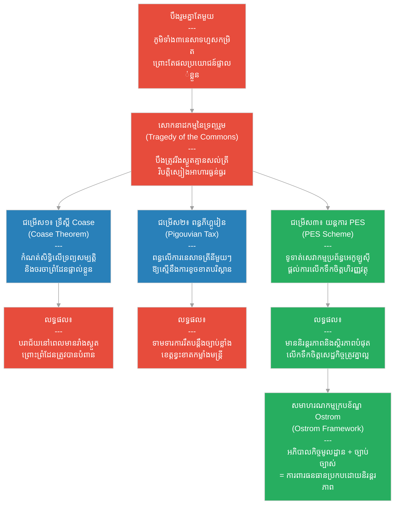

# ២៨២ — បឹងដែលជារបស់មនុស្សគ្រប់គ្នា (The Lake That Belonged to Everyone)៖ សេដ្ឋកិច្ចបរិស្ថាន និងការគ្រប់គ្រងធនធានរួម
**Subject:** Environmental Economics  
**Concept:** Tragedy of the commons, Coase theorem, Pigouvian tax, PES schemes  
**Level:** Year 4  
**Author:** ichamrong  
**Date:** 2026-05-30  
**Tags:** #environmental-economics #tragedy-of-the-commons #coase-theorem #pigouvian-tax #pes-schemes #ostrom #parables #business-sustainability #cambodian-context  
**Category:** Business Sustainability  
**Read Time:** ~4 min  

---

## 📌 មាតិកា (Table of Contents)
- [វិបត្តិធុរកិច្ច និងការគ្រប់គ្រងធនធានរួម (The Commons Dilemma)](#0)
- [១. រឿងនិទានប្រៀបធៀប៖ បឹងរួម និងជម្រើសដោះស្រាយទាំងបី (The Parable Story)](#1)
- [២. គំនូសតាងលំហូរការងារ (System Flowchart)](#2)
- [៣. មេរៀនពីរឿង (Lesson)](#3)
- [Related Posts](#4)

---

## វិបត្តិធុរកិច្ច និងការគ្រប់គ្រងធនធានរួម (The Commons Dilemma)

នៅក្នុងសេដ្ឋកិច្ចបរិស្ថាន វិបត្តិធំបំផុតមួយដែលសហគមន៍ជួបប្រទះ គឺសោកនាដកម្មនៃទ្រព្យរួម ដែលធនធានធម្មជាតិរួម (ដូចជាបឹង ព្រៃឈើ ឬខ្យល់អាកាស) ត្រូវបានបំផ្លិចបំផ្លាញ និងប្រើប្រាស់ហួសកម្រិត ព្រោះបុគ្គលម្នាក់ៗធ្វើសកម្មភាពដើម្បីផលប្រយោជន៍រយៈពេលខ្លីផ្ទាល់ខ្លួន។ សម្រាប់អ្នកគ្រប់គ្រង និងអ្នករៀបចំគោលនយោបាយ ការយល់ដឹងពីទ្រឹស្តីសេដ្ឋកិច្ចបរិស្ថាន ដូចជា ទ្រឹស្តី Coase ពន្ធភីហ្គូវៀន និងយន្តការទូទាត់សេវាកម្មប្រព័ន្ធអេកូឡូស៊ី រួមជាមួយនឹងទ្រឹស្តីគ្រប់គ្រងធនធានរួមរបស់ Ostrom គឺចាំបាច់បំផុតដើម្បីស្តារ និងការពារធនធានធម្មជាតិឱ្យមាននិរន្តរភាព។

---

## ១. រឿងនិទានប្រៀបធៀប៖ បឹងរួម និងជម្រើសដោះស្រាយទាំងបី (The Parable Story)

បឹង (lake) មួយស្ថិតនៅចំណុចប្រសព្វនៃភូមិចំនួនបី ហើយអស់រយៈពេលរាប់រយឆ្នាំមកហើយ វាបានផ្តល់ផលនេសាទត្រីយ៉ាងសម្បូរបែបសម្រាប់ភូមិទាំងអស់។ ភូមិនីមួយៗដឹងច្បាស់ថា ការនេសាទត្រីប្រកបដោយនិរន្តរភាព — ពោលគឺការយកត្រីត្រឹមតែបរិមាណដែលបឹងអាចបំពេញបន្ថែមឡើងវិញបាន — គឺជាជម្រើសដ៏ឆ្លាតវៃ និងសមហេតុផលបំផុតសម្រាប់រយៈពេលវែង។ 

ទោះជាយ៉ាងណាក៏ដោយ ភូមិនីមួយៗក៏ដឹងផងដែរថា៖ *ប្រសិនបើពួកគេនេសាទដោយការសន្សំសំចៃ ខណៈដែលភូមិពីរផ្សេងទៀតមិនព្រមធ្វើតាម ពួកគេនឹងត្រូវខកខានគ្មានអ្វីសេសសល់ឡើយ ខណៈពេលដែលភូមិដទៃទៀតយកត្រីទាំងអស់ទៅបាត់*។ យន្តការលើកទឹកចិត្តទីផ្សារបានជម្រុញឱ្យភូមិនីមួយៗនាំគ្នានេសាទត្រីឱ្យបានច្រើនបំផុតតាមតែអាចធ្វើទៅបាន មុនពេលដែលភូមិផ្សេងទៀតធ្វើបាន — នេះគឺជា **សោកនាដកម្មនៃទ្រព្យរួម (Tragedy of the Commons)**។ ក្នុងរយៈពេលត្រឹមតែសែសិបឆ្នាំ បឹងធម្មជាតិទាំងមូលត្រូវបាននេសាទរហូតដល់រីងស្ងួតគ្មានសល់ត្រីសោះឡើយ ហើយភូមិទាំងបីបានប្រឈមមុខនឹងគ្រោះទុរភិក្សដ៏ធ្ងន់ធ្ងរ។

សេដ្ឋវិទូម្នាក់ត្រូវបានចាត់បញ្ជូនមកពីទីក្រុងធំដើម្បីផ្តល់អនុសាសន៍ដោះស្រាយ។ គាត់បានស្នើឡើងនូវដំណោះស្រាយចំនួនបី ដែលដំណោះស្រាយនីមួយៗមកពីសាលាគំនិតសេដ្ឋកិច្ចខុសៗគ្នា៖

**ដំណោះស្រាយទីមួយ៖** គឺការបែងចែកសិទ្ធិលើទ្រព្យសម្បត្តិ (property rights) ទៅឱ្យភូមិនីមួយៗសម្រាប់ចំណែកបឹងជាក់លាក់ រួចអនុញ្ញាតឱ្យពួកគេចរចាគ្នារវាងគ្នាទៅវិញទៅមក — នេះហៅថា **ទ្រឹស្តី Coase (Coase Theorem)**៖ *ប្រសិនបើសិទ្ធិលើទ្រព្យសម្បត្តិត្រូវបានកំណត់ច្បាស់លាស់ និងថ្លៃដើមប្រតិបត្តិការចរចាមានកម្រិតទាប នោះភាគីទាំងអស់នឹងចរចាគ្នារកដំណោះស្រាយប្រកបដោយប្រសិទ្ធភាពសេដ្ឋកិច្ច ទោះបីជាការបែងចែកសិទ្ធិដំបូងស្ថិតក្នុងទម្រង់ណាក៏ដោយ។*

**ដំណោះស្រាយទីពីរ៖** គឺការដាក់ពន្ធលើការនេសាទត្រី ដែលស្មើនឹងថ្លៃដើមខូចខាតអេកូឡូស៊ីសម្រាប់រាល់ត្រីនីមួយៗដែលត្រូវបាននេសាទចេញ — នេះហៅថា **ពន្ធភីហ្គូវៀន (Pigouvian Tax)** ដែលជួយធ្វើឱ្យការនេសាទហួសកម្រិតមានតម្លៃថ្លៃខ្លាំងរហូតដល់ត្រូវបញ្ឈប់សកម្មភាពបំពាន។

**ដំណោះស្រាយទីបី៖** គឺការបង់ប្រាក់ឱ្យអ្នកភូមិដើម្បីការពារបឹង — ដែលជាការផ្តល់ប្រាក់សំណងសម្រាប់ «សេវាកម្មប្រព័ន្ធអេកូឡូស៊ី» ដែលពួកគេផ្តល់ឱ្យតាមរយៈការកម្រិតនិងកាត់បន្ថយការនេសាទរបស់ខ្លួន — នេះហៅថា **យន្តការទូទាត់សេវាកម្មប្រព័ន្ធអេកូឡូស៊ី (Payment for Ecosystem Services - PES)**។

អ្នកភូមិបានសាកល្បងអនុវត្តដំណោះស្រាយទាំងបី៖

*វិធីសាស្ត្រ Coase* ដំណើរការបានតែមួយផ្នែកប៉ុណ្ណោះ — ពោលគឺភូមិពីរក្នុងចំណោមបីបានព្រមព្រៀងលើព្រំដែន និងគោរពវា ប៉ុន្តែភូមិទីបីបានបំពានព្រំដែននៅពេលដែលគ្រោះរាំងស្ងួតបានធ្វើឱ្យត្រីខ្សត់ខ្សោយ។ 

*វិធីសាស្ត្រពន្ធភីហ្គូវៀន* ជួយកាត់បន្ថយការនេសាទបានខ្លះ ប៉ុន្តែវាទាមទារឱ្យមានហេដ្ឋារចនាសម្ព័ន្ធរឹតបន្តឹងច្បាប់ និងការត្រួតពិនិត្យយ៉ាងខ្លាំង ដែលអាជ្ញាធរខេត្តខ្វះខាតកម្លាំងមន្ត្រី។ 

*យន្តការ PES* គឺជាយន្តការដែលមានស្ថិរភាព និងនិរន្តរភាពបំផុត — តាមរយៈការទទួលបានការទូទាត់សាច់ប្រាក់ជាទៀងទាត់ពីរដ្ឋបាលខេត្ត ជាថ្នូរនឹងការផ្ទៀងផ្ទាត់ទិន្នន័យត្រីប្រចាំត្រីមាស ដែលផ្តល់ឱ្យភូមិទាំងបីនូវការលើកទឹកចិត្តផ្នែកសេដ្ឋកិច្ចដោយផ្ទាល់ក្នុងការរួមគ្នាការពារបឹង។

សេដ្ឋវិទូជាន់ខ្ពស់ម្នាក់ឈ្មោះ **Ostrom** ធ្លាប់បានសរសេរថា៖ *«ធនធានរួមដែលត្រូវបានគ្រប់គ្រងដោយសហគមន៍ផ្ទាល់ ជាមួយនឹងច្បាប់ច្បាស់លាស់ និងការអនុវត្តច្បាប់ពិតប្រាកដ តែងតែផ្តល់សមិទ្ធផលល្អជាងទាំងការធ្វើឯកជនភាវូបនីយកម្ម និងការដាក់ពន្ធរដ្ឋាភិបាល ព្រោះការគ្រប់គ្រងក្នុងស្រុកជួយបង្កប់នូវគណនេយ្យភាព និងបញ្ញាញាណដែលប្រព័ន្ធខាងក្រៅមិនអាចចម្លងតាមបានឡើយ។»*

បឹងធម្មជាតិបានស្តារឡើងវិញយ៉ាងសន្សឹមៗ — ពោលគឺត្រូវចំណាយពេលដប់ប្រាំឆ្នាំ មិនមែនប្រាំឆ្នាំឡើយ។ ភូមិទាំងបីបានបង្កើតក្រុមប្រឹក្សាគ្រប់គ្រងបឹងរួមមួយ ដោយមានតំណាងមកពីភូមិនីមួយៗ និងមានការរាប់ចំនួនត្រីប្រចាំត្រីមាសប្រកបដោយតម្លាភាពដែលប្រជាពលរដ្ឋគ្រប់រូបអាចចូលរួមពិនិត្យបាន។ 

មេរៀនដែលទទួលបានគឺ៖ **«ធនធានរួមទាមទារអភិបាលកិច្ចរួម — ហើយឧបករណ៍ដែលជួយសម្របសម្រួលការលើកទឹកចិត្តសេដ្ឋកិច្ចឱ្យស្របទៅនឹងនិរន្តរភាពរយៈពេលវែងបានល្អបំផុត គឺជាឧបករណ៍ដែលមានប្រសិទ្ធភាពជាក់ស្តែង ទោះបីជាវាចេញមកពីទ្រឹស្តីសេដ្ឋកិច្ចណាមួយក៏ដោយ។»**

---

## ២. គំនូសតាងលំហូរការងារ (System Flowchart)

---

## ៣. មេរៀនពីរឿង (Lesson)

សោកនាដកម្មនៃទ្រព្យរួម (tragedy of the commons) ជួយពន្យល់ពីរបៀបដែលឥរិយាបថដែលសមហេតុផលរបស់បុគ្គលម្នាក់ៗ បែរជាបំផ្លិចបំផ្លាញធនធានរួមរបស់សហគមន៍ទាំងស្រុង — ហើយសេដ្ឋកិច្ចបរិស្ថានផ្តល់នូវវិធីសាស្ត្រឆ្លើយតបចម្បងបីគឺ៖ សិទ្ធិលើទ្រព្យសម្បត្តិ ពន្ធកែតម្រូវ និងការទូទាត់សេវាកម្មប្រព័ន្ធអេកូឡូស៊ី។ ការស្រាវជ្រាវរបស់ Ostrom បានបង្ហាញថា ធនធានរួមដែលគ្រប់គ្រងដោយសហគមន៍ផ្ទាល់ — ជាមួយនឹងច្បាប់ដែលរចនាដោយសហគមន៍ និងគណនេយ្យភាពពិតប្រាកដ — តែងតែផ្តល់លទ្ធផលល្អជាងគ្រប់ដំណោះស្រាយទ្រឹស្តីទាំងឡាយ។ មេរៀនអនុវត្តជាក់ស្តែងគឺ៖ ត្រូវប្រើប្រាស់ឧបករណ៍ណាដែលជួយសម្របសម្រួលការលើកទឹកចិត្តសេដ្ឋកិច្ចឱ្យស្របទៅនឹងនិរន្តរភាពបានល្អបំផុត និងមានស្ថិរភាពបំផុត ផ្អែកលើស្ថានភាពសហគមន៍ និងធនធានជាក់ស្តែង។

---

## Related Posts

- **[Environmental Economics](../02-environmental-economics.md)** — Advanced environmental economics covering commons governance, the Coase theorem, Pigouvian taxation, payment for ecosystem services, and Ostrom's framework.
