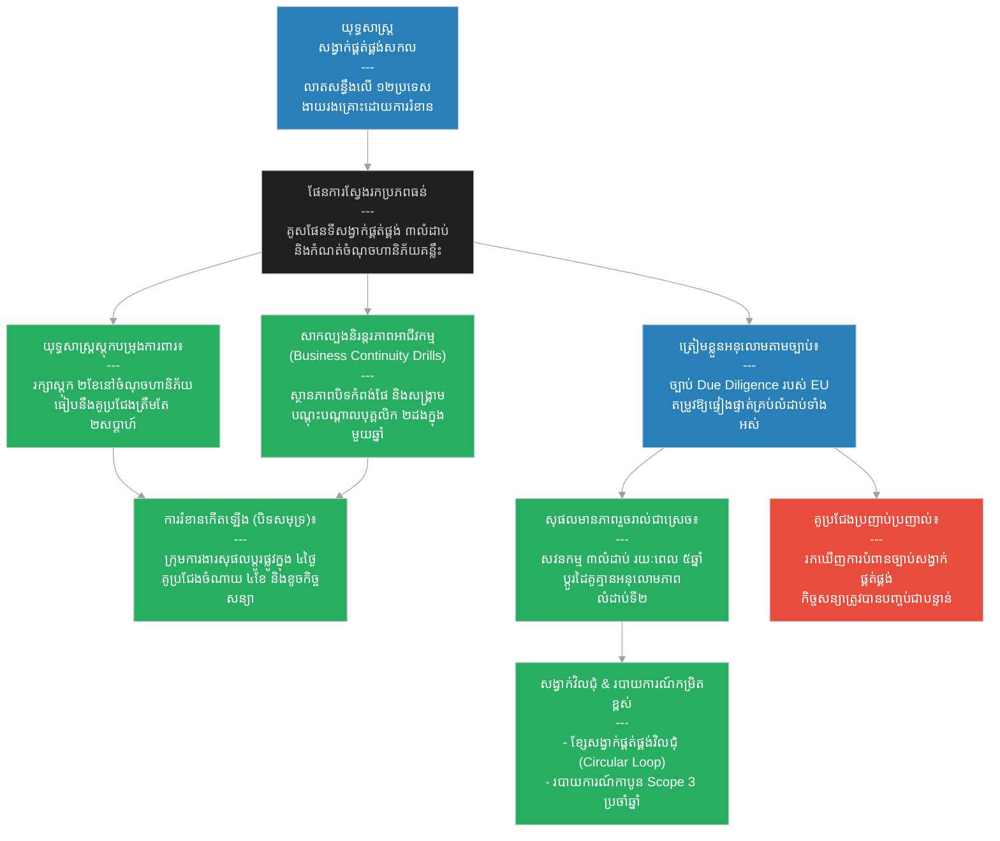

# ២៨៣ — ពាណិជ្ជករដែលខ្សែសង្វាក់មិនដែលដាច់ (The Merchant Whose Chain Never Broke)៖ ការគ្រប់គ្រងខ្សែសង្វាក់ផ្គត់ផ្គង់កម្រិតខ្ពស់ និងភាពធន់
**Subject:** Advanced Supply Chain Management  
**Concept:** Supply chain resilience, Scope 3 accounting, circular supply chains, due diligence law  
**Level:** Year 4  
**Author:** ichamrong  
**Date:** 2026-05-30  
**Tags:** #supply-chain #resilience #due-diligence-law #circular-supply-chain #scope-3-emissions #parables #business-sustainability #cambodian-context  
**Category:** Business Sustainability  
**Read Time:** ~4 min  

---

## 📌 មាតិកា (Table of Contents)
- [វិបត្តិធុរកិច្ច និងភាពធន់នៃខ្សែសង្វាក់ផ្គត់ផ្គង់ (The Supply Chain Resilience Dilemma)](#0)
- [១. រឿងនិទានប្រៀបធៀប៖ សុផល និងខ្សែសង្វាក់ស្ពានដែក (The Parable Story)](#1)
- [២. គំនូសតាងលំហូរការងារ (System Flowchart)](#2)
- [៣. មេរៀនពីរឿង (Lesson)](#3)
- [Related Posts](#4)

---

## វិបត្តិធុរកិច្ច និងភាពធន់នៃខ្សែសង្វាក់ផ្គត់ផ្គង់ (The Supply Chain Resilience Dilemma)

នៅក្នុងការគ្រប់គ្រងខ្សែសង្វាក់ផ្គត់ផ្គង់កម្រិតខ្ពស់ ហានិភ័យភូមិសាស្ត្រនយោបាយ គ្រោះមហន្តរាយធម្មជាតិ និងវិបត្តិសេដ្ឋកិច្ច អាចកាត់ផ្តាច់ខ្សែសង្វាក់ផ្គត់ផ្គង់របស់អាជីវកម្មក្នុងរយៈពេលត្រឹមតែមួយប៉ព្រិចភ្នែក។ ក្រុមហ៊ុនជាច្រើនដែលផ្តោតតែលើការកាត់បន្ថយថ្លៃដើមរយៈពេលខ្លី តែងតែជួបប្រទះនូវការដួលរលំប្រតិបត្តិការទាំងស្រុងនៅពេលមានវិបត្តិ។ គន្លឹះដើម្បីសាងសង់ភាពធន់ គឺការគូសផែនទីខ្សែសង្វាក់ផ្គត់ផ្គង់ឱ្យបានស៊ីជម្រៅច្រើនស្រទាប់ ការរៀបចំផែនការបន្តនិរន្តរភាពអាជីវកម្ម ការអនុវត្តខ្សែសង្វាក់ផ្គត់ផ្គង់វិលជុំ និងការរៀបចំខ្លួនជាស្រេចចំពោះច្បាប់ត្រួតពិនិត្យការអនុវត្តខ្សែសង្វាក់ផ្គត់ផ្គង់ និងការវាស់វែងការបំភាយឧស្ម័នលំដាប់ទី ៣។

---

## ១. រឿងនិទានប្រៀបធៀប៖ សុផល និងខ្សែសង្វាក់ស្ពានដែក (The Parable Story)

ពាណិជ្ជករ (merchant) ម្នាក់ឈ្មោះ **សុផល (Sophal)** បានផ្គត់ផ្គង់ក្រណាត់ទៅកាន់បណ្តាព្រះរាជាណាចក្រនានាទូទាំងអាស៊ី និងអឺរ៉ុប ពីបណ្តាញអ្នកត្បាញ ជាងលាបពណ៌ ភ្នាក់ងារដឹកជញ្ជូន និងភ្នាក់ងារកំពង់ផែ ដែលលាតសន្ធឹងឆ្លងកាត់ដប់ពីរប្រទេស។ 

ខ្សែសង្វាក់ផ្គត់ផ្គង់របស់ក្រុមហ៊ុនគូប្រជែងរបស់នាងបានដាច់ជាបន្តបន្ទាប់ — សង្គ្រាមនៅក្នុងព្រះរាជាណាចក្រមួយបានកាត់ផ្តាច់ដៃគូផ្គត់ផ្គង់ គ្រោះរាំងស្ងួតបានបញ្ឈប់ការងាររបស់ជាងលាបពណ៌ក្រណាត់ ហើយការបិទខ្ទប់ផ្លូវសមុទ្របានបង្ខំឱ្យបង្វែរទិសដៅដឹកជញ្ជូនទំនិញ ដែលបន្ថែមការពន្យារពេលរហូតដល់ពីរខែ។ ប៉ុន្តែខ្សែសង្វាក់ផ្គត់ផ្គង់របស់សុផលមិនដែលដាច់ទាល់តែសោះ ទោះបីជាស្ថិតក្រោមការរំខានដ៏ធ្ងន់ធ្ងរដូចគ្នាក៏ដោយ — ព្រោះនាងបានសាងសង់ **ភាពធន់នៃខ្សែសង្វាក់ផ្គត់ផ្គង់ (Supply Chain Resilience)** តាំងពីមុនពេលមានវិបត្តិមកដល់ម្ល៉េះ។

ក្រុមហ៊ុនគូប្រជែងរបស់នាងស្គាល់តែអ្នកផ្គត់ផ្គង់ផ្ទាល់របស់ពួកគេប៉ុណ្ណោះ — ដែលជា **អ្នកផ្គត់ផ្គង់លំដាប់ទី ១ (Tier 1 Suppliers)**។ ចំណែកឯសុផលបានគូរផែនទីខ្សែសង្វាក់ផ្គត់ផ្គង់របស់ខ្លួនយ៉ាងលម្អិតរហូតដល់ស្រទាប់ទីបី — ដោយនាងមិនត្រឹមតែដឹងថានរណាជាអ្នកលក់ក្រណាត់ឱ្យនាងប៉ុណ្ណោះទេ ប៉ុន្តែថែមទាំងដឹងថានរណាជាអ្នកលាបពណ៌អំបោះ នរណាជាអ្នកដាំកប្បាស និងកន្លែងណាខ្លះដែលកប្បាសនោះត្រូវបានកែច្នៃ។ 

នៅត្រង់ចំណុចចរន្តដែលមានហានិភ័យខ្ពស់ (risk nodes) — ដូចជា ជាងលាបពណ៌តែមួយគត់នៅក្នុងខេត្តមួយ ឬកំពង់ផែទឹកជ្រៅតែមួយគត់នៅក្នុងខេត្តមួយទៀត — នាងតែងតែរក្សាទុកស្តុកបម្រុងការពារ (buffer stock) ស្មើនឹងរយៈពេលពីរខែ ជំនួសឱ្យស្តុកបម្រុងត្រឹមតែពីរសប្តាហ៍ធម្មតា។

នាងបានដំណើរការសាកល្បង **ផែនការបន្តនិរន្តរភាពអាជីវកម្ម (Business Continuity Planning)** ពីរដងក្នុងមួយឆ្នាំ — ដែលជាការសាកល្បងត្រាប់តាមស្ថានភាពវិបត្តិរំខាននានា ដែលតម្រូវឱ្យក្រុមការងាររបស់នាងត្រូវចេះបង្វែរទិសដៅសង្វាក់ផ្គត់ផ្គង់ដោយខ្លួនឯងដោយមិនបាច់មានវត្តមានរបស់នាងផ្ទាល់។ ការសាកល្បងទាំងនេះមានតម្លៃថ្លៃដើមខ្ពស់ និងបង្កភាពស្មុគស្មាញច្រើន ប៉ុន្តែនៅពេលដែលការបិទខ្ទប់ផ្លូវសមុទ្រពិតប្រាកដបានកើតឡើង ក្រុមការងាររបស់នាងអាចបង្វែរទិសដៅដឹកជញ្ជូនបានដោយជោគជ័យក្នុងរយៈពេលត្រឹមតែបួនថ្ងៃប៉ុណ្ណោះ ខណៈដែលគូប្រជែងរបស់នាងត្រូវចំណាយពេលរហូតដល់បួនខែ។

នៅពេលដែលសហភាពអឺរ៉ុបបានអនុម័ត **ច្បាប់ត្រួតពិនិត្យការអនុវត្តខ្សែសង្វាក់ផ្គត់ផ្គង់ (Supply Chain Due Diligence Law)** — ដែលតម្រូវឱ្យពាណិជ្ជករត្រូវតែបង្ហាញភស្តុតាងជាលាយលក្ខណ៍អក្សរថាគ្មានពលកម្មបង្ខំឡើយនៅក្នុងគ្រប់ស្រទាប់ទាំងអស់នៃសង្វាក់ផ្គត់ផ្គង់របស់ខ្លួន — សុផលគឺមានភាពរួចរាល់ជាស្រេចជានិច្ច។ នាងបានធ្វើសវនកម្មត្រួតពិនិត្យអ្នកផ្គត់ផ្គង់ទាំងបីលំដាប់អស់រយៈពេលប្រាំឆ្នាំមកហើយ ដោយសារតែហេតុផលសាងសង់ភាពធន់ប្រតិបត្តិការ មិនមែនដោយសារហេតុផលច្បាប់បង្ខំនោះឡើយ — រួចនាងបានជំនួសរួចជាស្រេចនូវអ្នកផ្គត់ផ្គង់លំដាប់ទី ២ មួយដែលត្រូវបានរកឃើញថាបានប្រើប្រាស់កម្លាំងពលកម្មជាប់បំណុល។ 

គូប្រជែងរបស់នាងបានប្រញាប់ប្រញាល់ទៅធ្វើសវនកម្មលើអ្នកផ្គត់ផ្គង់ដែលពួកគេមិនដែលធ្លាប់បានជួបមុខពីមុនមក រួចបានរកឃើញការបំពានច្បាប់ជាច្រើន ដែលធ្វើឱ្យពួកគេត្រូវបាត់បង់កិច្ចសន្យាជាមួយអឺរ៉ុបទាំងស្រុងក្នុងកំឡុងពេលដោះស្រាយបញ្ហាបំពាននោះ។

នាងក៏បានដំណើរការ **កម្មវិធីប្រមូលទំនិញត្រឡប់មកវិញ (Take-back Program)** ផងដែរ — ដែលក្រណាត់ចាស់ៗដែលប្រើប្រាស់រួចពីអ្នកទិញត្រូវបានប្រមូលត្រឡប់មកវិញ យកមកលាបពណ៌ឡើងវិញប្រសិនបើអាច ឬកាត់កែច្នៃទៅជាសរសៃអំបោះឆៅសម្រាប់ត្បាញសារជាថ្មី — នេះជាគំរូនៃ **ខ្សែសង្វាក់ផ្គត់ផ្គង់វិលជុំ (Circular Supply Chain)**។

ទន្ទឹមនឹងនេះ **ការបំភាយឧស្មែនលំដាប់ទី ៣ (Scope 3 Emissions)** របស់សុផល — ដែលជាបរិមាណកាបូនដែលបានបញ្ចេញពេញមួយខ្សែសង្វាក់តម្លៃទាំងមូលរបស់នាង រាប់ចាប់ពីវាលដាំកប្បាសរហូតដល់ការដឹកជញ្ជូនដល់ដៃអតិថិជន — ត្រូវបានវាស់វែង និងរាយការណ៍ប្រចាំឆ្នាំយ៉ាងត្រឹមត្រូវ ព្រោះអតិថិជនអឺរ៉ុបកាន់តែតម្រូវឱ្យមានទិន្នន័យទាំងនេះជាលក្ខខណ្ឌចម្បងនៃកិច្ចសន្យា។

មេរៀនរបស់នាងត្រូវបានបង្រៀននៅក្នុងសាលាពាណិជ្ជកម្មជាច្រើនជំនាន់៖ **«ភាពធន់ត្រូវតែសាងសង់មុនពេលមានវិបត្តិ មិនមែនសាងសង់ក្នុងកំឡុងពេលវិបត្តិនោះឡើយ ហើយចំណេះដឹងស៊ីជម្រៅដូចគ្នាដែលជួយការពារសង្វាក់ផ្គត់ផ្គង់កុំឱ្យដាច់ ក៏ជាចំណេះដឹងដែលជួយធានាឱ្យវាបំពេញបានតាមស្តង់ដារក្រមសីលធម៌ និងច្បាប់ដែលទីផ្សារសម័យទំនើបកាន់តែតម្រូវឱ្យមានជានិច្ច។»**

---

## ២. គំនូសតាងលំហូរការងារ (System Flowchart)

---

## ៣. មេរៀនពីរឿង (Lesson)

ភាពធន់នៃខ្សែសង្វាក់ផ្គត់ផ្គង់ (supply chain resilience) ទាមទារឱ្យមានការគូសផែនទីខ្សែសង្វាក់ឱ្យហួសពីអ្នកផ្គត់ផ្គង់ផ្ទាល់ ការរក្សាស្តុកបម្រុងការពារនៅត្រង់ចរន្តដែលមានហានិភ័យខ្ពស់ និងការសាកល្បងផែនការទប់ទល់ការរំខានមុនពេលដែលវាបំផ្លិចបំផ្លាញពិតប្រាកដ។ ចំណេះដឹងប្រព័ន្ធស៊ីជម្រៅដូចគ្នាដែលជួយការពារការបរាជ័យនៃប្រតិបត្តិការ ក៏ជាកត្តាដែលជួយឱ្យក្រុមហ៊ុនអាចអនុលោមតាមច្បាប់ត្រួតពិនិត្យការអនុវត្តខ្សែសង្វាក់ផ្គត់ផ្គង់ និងការរាយការណ៍ការបំភាយឧស្ម័នលំដាប់ទី ៣ ផងដែរ។ ភាពធន់ប្រតិបត្តិការ និងគណនេយ្យភាពផ្នែកក្រមសីលធម៌ គឺត្រូវបានសាងសង់ឡើងពីគ្រឹះតែមួយគត់៖ គឺការស្គាល់និងយល់ច្បាស់ពីខ្សែសង្វាក់ផ្គត់ផ្គង់ទាំងមូលរបស់អ្នក។

---

## Related Posts

- **[Advanced Supply Chain Management](../03-advanced-supply-chain-management.md)** — Advanced supply chain strategy covering resilience engineering, multi-tier mapping, circular supply chains, Scope 3 accounting, and supply chain due diligence law.
