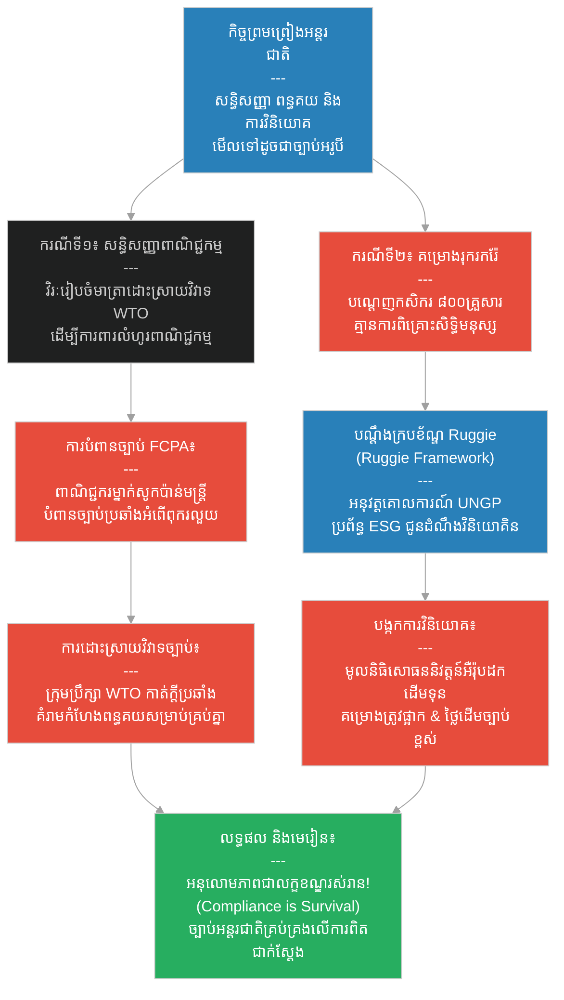

# ២៨៤ — រាជទូត និងសន្ធិសញ្ញាដែលត្រូវបានបំពាន (The Ambassador and the Broken Treaty)៖ ច្បាប់ធុរកិច្ចអន្តរជាតិ និងសន្ធិសញ្ញា
**Subject:** International Business Law & Treaties  
**Concept:** UNGP Ruggie Framework, WTO dispute settlement, FCPA/anti-corruption  
**Level:** Year 4  
**Author:** ichamrong  
**Date:** 2026-05-30  
**Tags:** #international-law #treaties #wto-dispute #fcpa #human-rights #ruggie-framework #parables #business-sustainability #cambodian-context  
**Category:** Business Sustainability  
**Read Time:** ~4 min  

---

## 📌 មាតិកា (Table of Contents)
- [វិបត្តិធុរកិច្ច និងច្បាប់អន្តរជាតិ (The International Law Dilemma)](#0)
- [១. រឿងនិទានប្រៀបធៀបទីមួយ៖ វិសិដ្ឋ និងសន្ធិសញ្ញាពាណិជ្ជកម្ម (The Story of the Trade Treaty)](#1)
- [២. រឿងនិទានប្រៀបធៀបទីពីរ៖ អណ្តូងរ៉ែដែក និងសិទ្ធិមនុស្ស (The Story of the Iron Mine & Human Rights)](#2)
- [៣. គំនូសតាងលំហូរការងារ (System Flowchart)](#3)
- [៤. មេរៀនពីរឿង (Lesson)](#4)
- [Related Posts](#5)

---

## វិបត្តិធុរកិច្ច និងច្បាប់អន្តរជាតិ (The International Law Dilemma)

នៅក្នុងការធ្វើពាណិជ្ជកម្មអន្តរជាតិ សន្ធិសញ្ញា ច្បាប់ប្រឆាំងអំពើពុករលួយ និងក្របខ័ណ្ឌការពារសិទ្ធិមនុស្ស តែងតែត្រូវបានចាត់ទុកថាជាប្រធានបទទ្រឹស្តីអរូបីក្នុងកំឡុងពេលចរចាបង្កើតកិច្ចព្រមព្រៀង។ ទោះជាយ៉ាងណាក៏ដោយ សម្រាប់សហគ្រាសសកល ច្បាប់អន្តរជាតិទាំងនេះនឹងក្លាយជាការពិតជាក់ស្តែង និងមានឥទ្ធិពលបំផុតភ្លាមៗនៅពេលមានបញ្ហាខុសឆ្គងកើតឡើង។ ការបំពានច្បាប់តែមួយករណីពីសំណាក់បុគ្គលិក ឬដៃគូអាជីវកម្ម អាចកម្ទេចសន្ធិសញ្ញាទាំងមូល និងដុតបំផ្លាញទ្រព្យសម្បត្តិ និងកេរ្តិ៍ឈ្មោះអាជីវកម្មទាំងស្រុង។

---

## ១. រឿងនិទានប្រៀបធៀបទីមួយ៖ វិសិដ្ឋ និងសន្ធិសញ្ញាពាណិជ្ជកម្ម (The Story of the Trade Treaty)

រាជទូត (ambassador) ម្នាក់ឈ្មោះ **វិរៈ (Virak)** បានចំណាយពេលបីឆ្នាំដើម្បីចរចាបង្កើតសន្ធិសញ្ញាពាណិជ្ជកម្មមួយរវាងព្រះរាជាណាចក្ររបស់ទ្រង់ និងអាណាចក្រភាគខាងជើងដ៏មានទ្រព្យសម្បត្តិស្តុកស្តម្ភ។ សន្ធិសញ្ញានេះត្រូវបានប្រារព្ធអបអរសាទរយ៉ាងខ្លាំង៖ វាជួយកាត់បន្ថយពន្ធគយ បង្កើតនីតិវិធីដោះស្រាយវិវាទច្បាស់លាស់ និងមានយន្តការគំរូផ្អែកលើ **ដំណើរការដោះស្រាយវិវាទរបស់អង្គការពាណិជ្ជកម្មពិភពលោក (WTO Dispute Settlement)** ដែលតាមរយៈយន្តការនេះ រាល់ពាណិជ្ជករទាំងឡាយណាដែលយល់ថាសន្ធិសញ្ញាត្រូវបានបំពាន អាចដាក់ពាក្យបណ្តឹងជាផ្លូវការ ទទួលបានការកាត់ក្តីពីក្រុមប្រឹក្សាឯករាជ្យ និងស្នើសុំសំណងខូចខាតបាន។ វិរៈជឿជាក់យ៉ាងមុតមាំថាសន្ធិសញ្ញានេះគឺជាគ្រឹះនៃភាពរុងរឿងសម្រាប់មនុស្សជំនាន់ក្រោយ។

បន្ទាប់មក ពាណិជ្ជករម្នាក់មកពីព្រះរាជាណាចក្ររបស់គាត់ បានសូកប៉ាន់មន្ត្រីអាណាចក្រភាគខាងជើង ដើម្បីឈ្នះកិច្ចសន្យាគយមួយ។ ការសូកប៉ាន់នេះបានបំពានច្បាប់ប្រឆាំងអំពើពុករលួយរបស់អាណាចក្រភាគខាងជើង និងបំពាន **ច្បាប់ស្តីពីការអនុវត្តអំពើពុករលួយនៅបរទេស (Foreign Corrupt Practices Act - FCPA)** — ដែលជាគោលការណ៍ច្បាប់ ចែងក្នុងអនុសញ្ញាអន្តរជាតិ ដែលហាមឃាត់ដាច់ខាតមិនឱ្យក្រុមហ៊ុន ឬបុគ្គលសូកប៉ាន់មន្ត្រីបរទេសដើម្បីទទួលបាន ឬរក្សាទុកអាជីវកម្មឡើយ។ 

អាណាចក្រភាគខាងជើងបានប្រើប្រាស់មាត្រាដោះស្រាយវិវាទនៃសន្ធិសញ្ញាភ្លាមៗប្រឆាំងនឹងព្រះរាជាណាចក្ររបស់វិរៈ ដោយទាមទារប្រាក់សំណងយ៉ាងមហាសាល និងគំរាមកំហែងផ្អាកការអនុវត្តពន្ធគយសម្បទានអស់រយៈពេលបីឆ្នាំ។ ការសូកប៉ាន់ពីសំណាក់ពាណិជ្ជករតែម្នាក់ បានរុញច្រានសន្ធិសញ្ញាទាំងមូល — និងពាណិជ្ជករទាំងអស់ដែលពឹងផ្អែកលើវា — ឱ្យធ្លាក់ចូលក្នុងហានិភ័យដ៏ធ្ងន់ធ្ងរ។ វិរៈបានរៀនមេរៀនមួយថា៖ **«ច្បាប់អន្តរជាតិមិនមែនជាទ្រឹស្តីអរូបិយឡើយ រហូតដល់កិច្ចព្រមព្រៀងជួបវិបត្តិ ហើយនៅខណៈនោះ វានឹងក្លាយជាការពិតជាក់ស្តែងដែលកំពុងគោះទ្វារផ្ទះរបស់យើង។»**

---

## ២. រឿងនិទានប្រៀបធៀបទីពីរ៖ អណ្តូងរ៉ែដែក និងសិទ្ធិមនុស្ស (The Story of the Iron Mine & Human Rights)

រឿងរ៉ាវស្របគ្នាដ៏សំខាន់មួយទៀតបានកើតឡើងនៅប៉ែកខាងកើត។ ក្រុមហ៊ុនរុករករ៉ែមកពីព្រះរាជាណាចក្រទីបី បានបើកដំណើរការអណ្តូងរ៉ែដែកមួយនៅតំបន់ដាច់ស្រយាល ដោយបានបណ្តេញកសិករចំនួន ៨០០ គ្រួសារចេញពីដីដូនតារបស់ពួកគេ ដោយគ្មានការពិគ្រោះយោបល់ ឬបង់ប្រាក់សំណងសមរម្យឡើយ។ 

ក្រុមកសិករបានដាក់ពាក្យបណ្តឹងជាផ្លូវការនៅក្រោម **គោលការណ៍ណែនាំរបស់អង្គការសហប្រជាជាតិស្តីពីធុរកិច្ច និងសិទ្ធិមនុស្ស (UN Guiding Principles on Business and Human Rights - Ruggie Framework)** — ដែលជាក្របខ័ណ្ឌការងារអន្តរជាតិដែលបង្កើតឡើងដើម្បីកំណត់ទំនួលខុសត្រូវរបស់សាជីវកម្មក្នុងការគោរពសិទ្ធិមនុស្ស និងផ្តល់ដំណោះស្រាយកែតម្រូវនៅពេលមានការរំលោភបំពានកើតឡើង។

ក្រុមវិនិយោគិនរបស់ក្រុមហ៊ុន — ដែលជាមូលនិធិសោធននិវត្តន៍ធំៗជាច្រើនរបស់អឺរ៉ុប — ទទួលបានរបាយការណ៍បណ្តឹងនេះតាមរយៈប្រព័ន្ធត្រួតពិនិត្យ ESG របស់ពួកគេ រួចបានដាក់ការវិនិយោគទាំងមូលរបស់ពួកគេទៅលើក្រុមហ៊ុនរុករករ៉ែក្រោមការត្រួតពិនិត្យយ៉ាងម៉ត់ចត់ជាបន្ទាន់។ សកម្មភាពអណ្តូងរ៉ែត្រូវបានផ្អាក ការចរចាសំណងចាប់ផ្តើមឡើង ហើយថ្លៃដើមផ្នែកច្បាប់របស់ក្រុមហ៊ុនក្នុងរយៈពេលបួនឆ្នាំបន្ទាប់ បានកើនឡើងខ្ពស់ជាងផលចំណេញដែលរំពឹងទុករបស់អណ្តូងរ៉ែទាំងមូលឆ្ងាយណាស់។

វិរៈបានសរសេររបាយការណ៍យ៉ាងវែងផ្ញើទៅកាន់ពាណិជ្ជករវ័យក្មេងដែលបានលួចសូកប៉ាន់មន្ត្រី និងផ្ញើទៅកាន់ក្រុមប្រឹក្សាភិបាលនៃក្រុមហ៊ុនរុករករ៉ែ។ របាយការណ៍មានអំណះអំណាងស្នូលមួយថា៖ **«សន្ធិសញ្ញា ក្របខ័ណ្ឌការងារ និងគោលការណ៍ច្បាប់ដែលមើលទៅហាក់ដូចជាអរូបិយក្នុងកំឡុងពេលចរចាបង្កើតកិច្ចព្រមព្រៀង — រួមមាន ច្បាប់ WTO, មាត្រានៃច្បាប់ FCPA, និងក្របខ័ណ្ឌការងារ Ruggie — នឹងក្លាយជាការពិតជាក់ស្តែងគ្រប់គ្រងលើអ្នកភ្លាមៗនៅខណៈពេលដែលប្រតិបត្តិការជួបការបំពាន។ ការអនុលោមតាមច្បាប់មិនមែនជាការងាររបស់ផ្នែកច្បាប់ឡើយ ប៉ុន្តែវាគឺជាគ្រឹះនៃការរស់រានមានជីវិតរបស់អាជីវកម្មទាំងមូល។»**

---

## ៣. គំនូសតាងលំហូរការងារ (System Flowchart)

---

## ៤. មេរៀនពីរឿង (Lesson)

ច្បាប់ធុរកិច្ចអន្តរជាតិ (international business law) — រួមមាន យន្តការដោះស្រាយវិវាទរបស់ WTO អនុសញ្ញាប្រឆាំងអំពើពុករលួយដូចជាច្បាប់ FCPA និងក្របខ័ណ្ឌសិទ្ធិមនុស្សដូចជាគោលការណ៍ Ruggie របស់អង្គការសហប្រជាជាតិ — គឺមានវត្តមានយ៉ាងស្ងប់ស្ងាត់នៅពីក្រោយរាល់ប្រតិបត្តិការអន្តរជាតិទាំងអស់ រហូតដល់ថ្ងៃដែលមានការបំពានច្បាប់កើតឡើង។ ការខកខានក្នុងការអនុលោមតាមច្បាប់តែមួយករណី អាចទាក់ទាញយន្តការច្បាប់ដែលបំផ្លាញថ្លៃដើមច្រើនជាងផលចំណេញដែលកិច្ចព្រមព្រៀងអាចរកបាន។ ការវាយតម្លៃច្បាប់ និងការអនុវត្តច្បាប់ (legal due diligence) នៅក្នុងធុរកិច្ចអន្តរជាតិ មិនមែនជាការចំណាយឥតប្រយោជន៍ឡើយ ប៉ុន្តែវាគឺជាគ្រឹះដ៏រឹងមាំតែមួយគត់ដែលធ្វើឱ្យរាល់ប្រតិបត្តិការផ្សេងៗទៀតអាចប្រព្រឹត្តទៅបានប្រកបដោយចីរភាព។

---

## Related Posts

- **[International Business Law & Treaties](../04-international-business-law-and-treaties.md)** — Advanced international business law covering WTO dispute settlement, FCPA anti-corruption compliance, and the UN Guiding Principles on Business and Human Rights.
