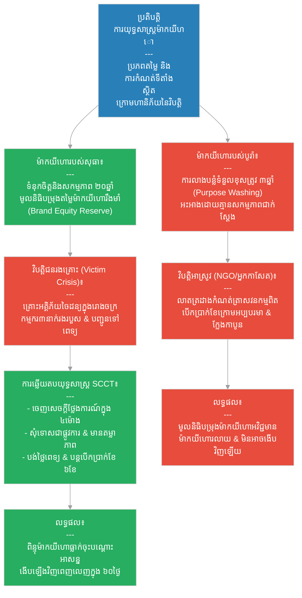

# ២៨៥ — ម៉ាកយីហោដែលរស់រានមានជីវិតពីព្យុះវិបត្តិ (The Brand That Survived the Storm)៖ យុទ្ធសាស្ត្រគ្រប់គ្រងម៉ាកយីហោ និងទំនាក់ទំនងវិបត្តិ
**Subject:** Strategic Brand Management  
**Concept:** SCCT crisis communication, brand equity, purpose washing risk  
**Level:** Year 4  
**Author:** ichamrong  
**Date:** 2026-05-30  
**Tags:** #brand-management #crisis-communication #scct #brand-equity #purpose-washing #parables #business-sustainability #cambodian-context  
**Category:** Business Sustainability  
**Read Time:** ~4 min  

---

## 📌 មាតិកា (Table of Contents)
- [វិបត្តិធុរកិច្ច និងទំនាក់ទំនងវិបត្តិម៉ាកយីហោ (The Brand Crisis Dilemma)](#0)
- [១. រឿងនិទានប្រៀបធៀប៖ សុធា បូរ៉ា និងវិបត្តិរោងចក្រវាយនភណ្ឌ (The Parable Story)](#1)
- [២. គំនូសតាងលំហូរការងារ (System Flowchart)](#2)
- [៣. មេរៀនពីរឿង (Lesson)](#3)
- [Related Posts](#4)

---

## វិបត្តិធុរកិច្ច និងទំនាក់ទំនងវិបត្តិម៉ាកយីហោ (The Brand Crisis Dilemma)

នៅក្នុងយុទ្ធសាស្ត្រគ្រប់គ្រងម៉ាកយីហោ វិបត្តិអាចកើតឡើងចំពោះអាជីវកម្មណាមួយគ្រប់ពេលវេលាដោយគ្មានការព្រមានទុកជាមុន។ របៀបដែលក្រុមហ៊ុនប្រាស្រ័យទាក់ទង និងដោះស្រាយវិបត្តិនៅក្នុងដំណាក់កាលដំបូង នឹងកំណត់ពីជោគវាសនារស់រានមានជីវិតនៃម៉ាកយីហោរបស់ខ្លួន។ ម៉ាកយីហោដែលកសាងឡើងដោយសកម្មភាពពិតប្រាកដ និងមានគណនេយ្យភាព នឹងមានខែលការពារទំនុកចិត្តយ៉ាងរឹងមាំពីអតិថិជន ខណៈពេលដែលក្រុមហ៊ុនដែលប្រើប្រាស់ការលាងបន្លំទំនួលខុសត្រូវ នឹងត្រូវរលាយរលត់ទាំងស្រុងនៅពេលជួបវិបត្តិ។ តាមរយៈការអនុវត្ត ទ្រឹស្តីទំនាក់ទំនងវិបត្តិស្ថានភាព (SCCT) អាជីវកម្មអាចស្តារកេរ្តិ៍ឈ្មោះ និងគ្រប់គ្រងវិបត្តិយ៉ាងមានប្រសិទ្ធភាពបំផុត។

---

## ១. រឿងនិទានប្រៀបធៀប៖ សុធា បូរ៉ា និងវិបត្តិរោងចក្រវាយនភណ្ឌ (The Parable Story)

ម្ចាស់ក្រុមហ៊ុនផលិតក្រណាត់ (cloth-maker) ម្នាក់ឈ្មោះ **សុធា (Sothea)** បានកសាងម៉ាកយីហោរបស់នាងអស់រយៈពេលម្ភៃឆ្នាំមកហើយ តាមរយៈការផ្តល់ជូនទំនិញដែលមានគុណភាពស៊ីសង្វាក់គ្នា ការបង់ប្រាក់ខែសមរម្យ និងការប្តេជ្ញាចិត្តជាសាធារណៈចំពោះលក្ខខណ្ឌការងារប្រកបដោយសុវត្ថិភាព។ អ្នកទិញគ្រប់រូបដឹងច្បាស់ថា ឈ្មោះរបស់សុធាតំណាងឱ្យ៖ *កម្មករត្រូវបានយកចិត្តទុកដាក់ និងថែទាំយ៉ាងល្អ ហើយក្រណាត់មានគុណភាពជាប់បានយូរ* — នេះគឺជា **ទ្រព្យសកម្មម៉ាកយីហោ (Brand Equity)** ដ៏រឹងមាំដែលកសាងឡើងតាមរយៈសកម្មភាពពិតប្រាកដរយៈពេលពីរទសវត្សរ៍ មិនមែនកើតឡើងពីការផ្សព្វផ្សាយពាណិជ្ជកម្មឡើយ។ 

ថ្ងៃមួយ គ្រោះអគ្គិភ័យចៃដន្យមួយបានផ្ទុះឡើងនៅក្នុងផ្នែកលាបពណ៌ក្រណាត់នៃរោងចក្ររបស់នាង។ កម្មករបីនាក់បានរងរបួសរលាក និងត្រូវបានបញ្ជូនទៅសង្គ្រោះបន្ទាន់នៅមន្ទីរពេទ្យ។ ក្រុមហ៊ុនគូប្រជែងបានលួចខ្សឹបប្រាប់អ្នកទិញថា៖ *«នេះគឺជាចំណុចបញ្ចប់នៃម៉ាកយីហោរបស់នាងហើយ។»*

សុធាបានឆ្លើយតបទៅនឹងវិបត្តិនេះក្នុងរយៈពេលត្រឹមតែបួនម៉ោងប៉ុណ្ណោះ។ នាងបានចេញសេចក្តីថ្លែងការណ៍ជាសាធារណៈដោយទទួលស្គាល់ហេតុការណ៍គ្រោះអគ្គិភ័យទាំងស្រុង បង្ហាញឈ្មោះកម្មករទាំងបីនាក់ដោយក្តីបារម្ភ រួមជាមួយនឹងលក្ខខណ្ឌសុខភាពរបស់ពួកគេ ប្រកាសបង់ថ្លៃព្យាបាលមន្ទីរពេទ្យទាំងអស់ និងបន្តផ្តល់ប្រាក់ខែពេញលេញចំនួនប្រាំមួយខែក្នុងកំឡុងពេលសម្រាកព្យាបាលស្ដារសុខភាពឡើងវិញ រួមជាមួយនឹងការប្តេជ្ញាចិត្តធ្វើសវនកម្មសុវត្ថិភាពរោងចក្រពីភាគីទីបីឯករាជ្យក្នុងរយៈពេលសាមសិបថ្ងៃ។ 

សកម្មភាពនេះឆ្លើយតបយ៉ាងត្រឹមត្រូវទៅនឹង **ទ្រឹស្តីទំនាក់ទំនងវិបត្តិស្ថានភាព (Situational Crisis Communication Theory - SCCT)**៖ ដែលជាទ្រឹស្តីបែងចែកប្រភេទវិបត្តិទៅតាមកម្រិតទំនួលខុសត្រូវរបស់អង្គភាព — ក្នុងករណីនេះ វាជាវិបត្តិជនរងគ្រោះ ដែលក្រុមហ៊ុនមានចំណែកទទួលខុសត្រូវ និងចេញវេជ្ជបញ្ជាឱ្យមានការសុំទោសជាផ្លូវការទាំងស្រុង និងសកម្មភាពកែតម្រូវភ្លាមៗជាការឆ្លើយតបដ៏ត្រឹមត្រូវបំផុត។

ពិន្ទុសុខភាពម៉ាកយីហោរបស់សុធា — ដែលវាស់វែងតាមរយៈការស្ទង់មតិអ្នកទិញប្រចាំឆ្នាំ — បានធ្លាក់ចុះយ៉ាងខ្លាំងក្នុងសប្តាហ៍ដំបូងបន្ទាប់ពីគ្រោះអគ្គិភ័យ ប៉ុន្តែវាបានស្តារឡើងវិញដល់កម្រិតមុនពេលមានវិបត្តិក្នុងរយៈពេលត្រឹមតែហុកសិបថ្ងៃប៉ុណ្ណោះ។ ការងើបឡើងវិញយ៉ាងលឿននេះ មិនមែនកើតឡើងដោយសារការចំណាយលើការផ្សព្វផ្សាយទីផ្សារឡើយ — ប៉ុន្តែគឺដោយសារសកម្មភាពប្រកបដោយភាពស៊ីសង្វាក់គ្នាអស់រយៈពេលម្ភៃឆ្នាំមុនរបស់នាង បានបង្កើតនូវ **«មូលនិធិបំរុងនៃទំនុកចិត្ត» (Reserve of Trust)** ដ៏ធំធេង ដែលអតិថិជនយល់ព្រមអនុញ្ញាតឱ្យនាងប្រើប្រាស់នៅពេលជួបសញ្ញាវិបត្តិ ហើយការឆ្លើយតបដ៏រហ័ស និងមានតម្លាភាពរបស់នាងបានបញ្ជាក់ថា មូលនិធិបម្រុងនោះគឺជាការពិតជាក់ស្តែង។ 

ទ្រព្យសកម្មម៉ាកយីហោដំណើរការដូចជាមូលនិធិបម្រុងហិរញ្ញវត្ថុ៖ *កសាងឡើងនៅក្នុងឆ្នាំល្អៗ និងប្រើប្រាស់នៅពេលជួបវិបត្តិ*។

ផ្ទុយទៅវិញ ម្ចាស់ម៉ាកយីហោគូប្រជែងម្នាក់ឈ្មោះ **បូរ៉ា (Bora)** បានចំណាយពេលបីឆ្នាំមុននោះ ផ្សព្វផ្សាយរោងចក្ររបស់ខ្លួនថាជា *«អ្នកផលិតក្រណាត់ប្រកបដោយនិរន្តរភាពបំផុតនៅកម្ពុជា»*។ គាត់បានផលិតរបាយការណ៍និរន្តរភាព បើកយុទ្ធនាការផ្សព្វផ្សាយវិញ្ញាបនបត្របៃតង និងឡើងនិយាយក្នុងសន្និសីទពាណិជ្ជកម្មនានាអំពីការប្តេជ្ញាចិត្តរបស់ខ្លួនចំពោះកម្មករ។ 

អ្នកកាសែតស៊ើបអង្កេតម្នាក់បានស្វែងរក និងទទួលបានកំណត់ត្រាសវនកម្មពិតប្រាកដនៃរោងចក្ររបស់គាត់ពីមន្ទីរការងារខេត្ត រួចបានបោះពុម្ពផ្សាយថា៖ *កម្មករក្នុងរោងចក្ររបស់គាត់ត្រូវបានបង់ប្រាក់ខែទាបជាងកម្រិតអប្បបរមា ការអះអាងពីសមិទ្ធផលកាបូនបៃតងគឺជាព័ត៌មានប្រឌិតឡើង ហើយវិញ្ញាបនបត្របៃតងរបស់គាត់ត្រូវបានទិញយកពីស្ថាប័នដែលគ្មានការទទួលស្គាល់ផ្លូវការ*។ នេះគឺជាទង្វើ **ការលាងបន្លំទំនួលខុសត្រូវ (Purpose Washing)** — ការអះអាងពីគោលបំណងល្អដើម្បីសង្គម និងបរិស្ថាន ខណៈពេលដែលប្រតិបត្តិការផ្ទៃក្នុងជាក់ស្តែងផ្ទុយស្រឡះពីការអះអាង។

ម៉ាកយីហោរបស់បូរ៉ាមិនដែលងើបឡើងវិញបានឡើយ — ព្រោះវិបត្តិអាស្រូវនេះបានបញ្ជាក់ពីការសង្ស័យជាច្រើនឆ្នាំរបស់អតិថិជន ជាជាងការផ្ទុយពីវា។ មូលនិធិបម្រុងទំនុកចិត្តរបស់គាត់គឺអវិជ្ជមាន៖ អតិថិជនធ្លាប់អត់ឱនចំពោះការអះអាងដែលពួកគេមិនសូវជឿជាក់ពីមុនមក ហើយភស្តុតាងអាស្រូវនេះបានបំប្លែងភាពអត់ឱនឱ្យទៅជាការបដិសេធទាំងស្រុង។

មេរៀនដែលទទួលបានគឺ៖ **«ទ្រព្យសកម្មម៉ាកយីហោ (brand equity) ដែលកកកុញតាមរយៈសកម្មភាពដ៏ស្មោះត្រង់ និងស៊ីសង្វាក់គ្នាអស់ជាច្រើនទសវត្សរ៍ ដំណើរការជាមូលនិធិបម្រុងការពារវិបត្តិ — វាអាចស្រូបយកផលប៉ះពាល់វិបត្តិពិតប្រាកដ និងស្តារឡើងវិញបានយ៉ាងមានប្រសិទ្ធភាព។ ការលាងបន្លំទំនួលខុសត្រូវ (Purpose washing) នឹងដុតបំផ្លាញមូលនិធិបម្រុងនេះចោលទាំងស្រុង ដោយជំនួសមកវិញនូវការអះអាងមិនពិតដែលវិបត្តិនឹងលាតត្រដាងការពិតជាក់ស្តែងនៅថ្ងៃណាមួយជានិច្ច។»**

---

## ២. គំនូសតាងលំហូរការងារ (System Flowchart)

---

## ៣. មេរៀនពីរឿង (Lesson)

ទ្រព្យសកម្មម៉ាកយីហោ (brand equity) ដែលកកកុញតាមរយៈសកម្មភាពការងារស្មោះត្រង់ និងប្រកបដោយភាពស៊ីសង្វាក់គ្នាអស់ជាច្រើនទសវត្សរ៍ ដើរតួជាមូលនិធិបម្រុងការពារវិបត្តិ (crisis reserve) — វាមានលទ្ធភាពស្រូបយកផលប៉ះពាល់នៃវិបត្តិពិតប្រាកដ និងជួយឱ្យម៉ាកយីហោស្តារកេរ្តិ៍ឈ្មោះឡើងវិញបានយ៉ាងលឿន។ ការលាងបន្លំទំនួលខុសត្រូវ (Purpose washing) នឹងរំលាយចោលនូវមូលនិធិបម្រុងនេះភ្លាមៗ ដោយការជំនួសមកវិញនូវការអះអាងក្លែងក្លាយ ដែលនឹងត្រូវបានលាតត្រដាងការពិតនៅពេលមានវិបត្តិ។ ការធ្វើទំនាក់ទំនងវិបត្តិប្រកបដោយប្រសិទ្ធភាព — តាមគោលការណ៍ SCCT នៃតម្លាភាពពេញលេញ និងសកម្មភាពកែតម្រូវជាបន្ទាន់ — ជួយពន្លឿនការងើបឡើងវិញសម្រាប់ម៉ាកយីហោណាដែលបានសាងសង់សិទ្ធិដើម្បីទទួលបានការជឿទុកចិត្តពីអតិថិជន។

---

## Related Posts

- **[Strategic Brand Management](../05-strategic-brand-management.md)** — Advanced brand management covering crisis communication theory (SCCT), brand equity under pressure, purpose-washing risk, and long-term brand resilience strategy.
