# ស្គាល់អតិថិជនរបស់អ្នក និងស្គាល់ធុរកិច្ចរបស់អ្នក (KYC / KYB)៖ KYC / KYB — Know Your Customer / Know Your Business

**សមត្ថកិច្ចអនុវត្ត (Jurisdiction)៖** សកល (ក្របខ័ណ្ឌ FATF អនុវត្តតាមប្រទេសនីមួយៗ)  
**Jurisdiction:** Global (FATF framework, implemented nationally)  

**អនុវត្តចំពោះ (Applies to)៖** ធនាគារ ស្ថាប័នដំណើរការទូទាត់ ស្ថាប័នបោះផ្សាយលុយអេឡិចត្រូនិក ផ្លែតហ្វមទីផ្សារ គ្រឹះស្ថានផ្តល់ប្រាក់កម្ចី ស្ថាប័នប្តូរប្រាក់គ្រីបតូ — ធុរកិច្ចដែលមានបទប្បញ្ញត្តិ ឬផ្អែកលើទំនុកចិត្ត  
**Applies to:** Banks, payment processors, e-money issuers, marketplace platforms, lending, crypto exchanges — any regulated financial or trust-based business  

**Tags:** #compliance #kyc #kyb #identity #onboarding #aml

---

## 📌 មាតិកា (Table of Contents)
- [តើវាជាអ្វី (What It Is)](#0)
- [ហេតុអ្វីបានជាវាមានសារៈសំខាន់ (Why It Exists)](#1)
- [KYC — ការផ្ទៀងផ្ទាត់អត្តសញ្ញាណបុគ្គល (KYC — Individual Verification)](#2)
- [KYB — ការផ្ទៀងផ្ទាត់អត្តសញ្ញាណធុរកិច្ច (KYB — Business Verification)](#3)
- [វិធីសាស្ត្សផ្អែកលើហានិភ័យ (Risk-Based Approach)](#4)
- [ការត្រួតពិនិត្យជាបន្តបន្ទាប់ (CDD) (Ongoing Monitoring (CDD))](#5)
- [ការរក្សាទុកឯកសារ (Document Retention)](#6)
- [ឯកសារទាក់ទង (Related)](#7)

---

<a id="0"></a>
## តើវាជាអ្វី (What It Is)

**ស្គាល់អតិថិជនរបស់អ្នក (KYC)** គឺជាដំណើរការនៃការផ្ទៀងផ្ទាត់អត្តសញ្ញាណរបស់អតិថិជនជាបុគ្គលម្នាក់ៗ។  
**KYC (Know Your Customer)** is the process of verifying the identity of individual customers.  

**ស្គាល់ធុរកិច្ចរបស់អ្នក (KYB)** គឺជាដំណើរការនៃការផ្ទៀងផ្ទាត់អត្តសញ្ញាណ និងភាពស្របច្បាប់នៃអតិថិជនជាធុរកិច្ច ឬក្រុមហ៊ុន។  
**KYB (Know Your Business)** is the process of verifying the identity and legitimacy of business customers.  

ដំណើរការទាំងពីរនេះត្រូវបានតម្រូវដោយបទប្បញ្ញត្តិប្រឆាំងការសម្អាតប្រាក់ និងការផ្តល់ហិរញ្ញប្បទានដល់ភេរវកម្ម (AML/CFT) នៅទូទាំងសកលលោក។ គោលដៅគឺធានាថាអ្នកស្គាល់ច្បាស់ពីអ្នកដែលអ្នកកំពុងធ្វើធុរកិច្ចជាមួយ ហើយធានាថាពួកគេមិនប្រើប្រាស់ផ្លែតហ្វមរបស់អ្នកដើម្បីសម្អាតប្រាក់ ឆបោក ឬផ្តល់ហិរញ្ញប្បទានដល់ភេរវកម្មឡើយ។  
Both are required by AML/CFT regulations globally. The goal: ensure you know who you are doing business with and that they are not using your platform for money laundering, fraud, or terrorism financing.  

---

<a id="1"></a>
## ហេតុអ្វីបានជាវាមានសារៈសំខាន់ (Why It Exists)

ដំណើរការ KYC/KYB ជួយការពារអាជីវកម្មពីការក្លាយជាឧបករណ៍នៃការប្រព្រឹត្តបទល្មើសហិរញ្ញវត្ថុ។  
The KYC/KYB process helps prevent businesses from becoming tools for financial crime.  

```mermaid
%%{init: {
  'theme': 'dark',
  'themeVariables': {
    'background': '#1e1e1e',
    'primaryTextColor': '#ffffff',
    'lineColor': '#a0a0a0'
  },
  'themeCSS': 'svg { background-color: #1e1e1e !important; padding: 1rem !important; border-radius: 8px !important; } .edgeLabel rect { fill: #1e1e1e !important; } text, tspan { fill: #ffffff !important; }'
}}%%
graph TD
    subgraph NOKYC["គ្មានការអនុវត្ត KYC (Without KYC)"]
        A1["👤 បង្កើតគណនី<br/>ដោយឈ្មោះក្លែងក្លាយ<br/>(Account with<br/>fake name)"] --> B1["💰 ទទួលការទូទាត់<br/>ពីជនរងគ្រោះឆបោក<br/>(Receive fraud<br/>payments)"]
        B1 --> C1["🏦 ដកប្រាក់ទៅ<br/>គណនីធនាគារក្រៅប្រទេស<br/>(Withdraw overseas)"]
        C1 --> D1["🔴 ផ្លែតហ្វមខ្វះ<br/>ព័ត៌មានអត្តសញ្ញាណ<br/>(No identity trail)"]
        D1 --> E1["🔴 ប្រឈមវិធានការច្បាប់<br/>ពីបទខកខានបង្ការ<br/>(Regulatory penalties)"]
    end

    subgraph WKYC["មានការអនុវត្ត KYC (With KYC)"]
        A2["🪪 ផ្តល់ឯកសារសម្គាល់ខ្លួន<br/>និងផ្ទៀងផ្ទាត់ផ្ទៃមុខ<br/>(Provide ID &<br/>liveness check)"] --> B2["🔍 ពិនិត្យបញ្ជីទណ្ឌកម្ម<br/>និងបដិសេធភ្លាមៗ<br/>(Screen sanctions &<br/>reject automatically)"]
        B2 --> C2["📁 រក្សាទុកទិន្នន័យ<br/>អត្តសញ្ញាណ ៥-១០ ឆ្នាំ<br/>(Retain ID for<br/>5-10 years)"]
        C2 --> D2["🟢 មានដានព័ត៌មាន<br/>សម្រាប់សមត្ថកិច្ច<br/>(Law enforcement<br/>trail)"]
        D2 --> E2["🟢 បង្ហាញការអនុវត្ត<br/>កាតព្វកិច្ចដោយម៉ត់ចត់<br/>(Demonstrated<br/>due diligence)"]
    end

    style E1 fill:#e74c3c,color:#fff
    style E2 fill:#27ae60,color:#fff
    style D1 fill:#e74c3c,color:#fff
    style D2 fill:#27ae60,color:#fff
```



**ករណីគ្មានការអនុវត្ត KYC៖**  
* បុគ្គលម្នាក់បង្កើតគណនីដោយប្រើឈ្មោះក្លែងក្លាយ។  
* ប្រើប្រាស់ផ្លែតហ្វមដើម្បីទទួលការទូទាត់ពីជនរងគ្រោះនៃការឆបោក។  
* ដកប្រាក់ទៅគណនីធនាគារក្រៅប្រទេស។  
* ផ្លែតហ្វមគ្មានមធ្យោបាយដើម្បីកំណត់អត្តសញ្ញាណពួកគេឡើយ។  
* ➔ ផ្លែតហ្វមក្លាយជាឧបករណ៍ដោយអចេតនានៃការឆបោក។  
* ➔ ផ្លែតហ្វមប្រឈមនឹងវិធានការច្បាប់ពីបទ «ខកខានក្នុងការបង្ការបទល្មើសហិរញ្ញវត្ថុ»។  

**Without KYC:**  
* A person creates an account with a fake name.  
* Uses the platform to receive payments from fraud victims.  
* Withdraws to an overseas bank account.  
* Platform had no way to identify them.  
* ➔ Platform is an unwitting tool for fraud.  
* ➔ Platform faces regulatory action for "failure to prevent financial crime."  

**ករណីមានការអនុវត្ត KYC៖**  
* បុគ្គលនោះត្រូវតែផ្តល់ឯកសារសម្គាល់ខ្លួនផ្លូវការ និងផ្ទៀងផ្ទាត់ថាជាមនុស្សពិត។  
* ឈ្មោះត្រូវគ្នាជាមួយបញ្ជីទណ្ឌកម្ម ➔ គណនីត្រូវបានបដិសេធភ្លាមៗ។  
* រាល់ឯកសារអត្តសញ្ញាណទាំងអស់ត្រូវបានរក្សាទុកពី ៥ ទៅ ១០ ឆ្នាំ។  
* ➔ ប្រសិនបើមានការឆបោកកើតឡើង សមត្ថកិច្ចមានដានព័ត៌មានដើម្បីស៊ើបអង្កេត។  
* ➔ ផ្លែតហ្វមបានបង្ហាញពីការអនុវត្តកាតព្វកិច្ចដោយម៉ត់ចត់។  

**With KYC:**  
* Person must provide government ID and match their face.  
* Name matches a sanctions list ➔ application rejected immediately.  
* All identity documents retained for 5–10 years.  
* ➔ If fraud occurs, law enforcement has a trail.  
* ➔ Platform demonstrated due diligence.  

---

<a id="2"></a>
## KYC — ការផ្ទៀងផ្ទាត់អត្តសញ្ញាណបុគ្គល (KYC — Individual Verification)

ការផ្ទៀងផ្ទាត់អត្តសញ្ញាណបុគ្គលតម្រូវឱ្យមានការត្រួតពិនិត្យឯកសារ និងព័ត៌មានជាក់លាក់។  
Individual verification requires checking specific documents and information.  

### អ្វីដែលត្រូវផ្ទៀងផ្ទាត់ (What to Verify)

| ធាតុអត្តសញ្ញាណ<br/>Element | ឯកសារដែលអាចទទួលយកបាន<br/>Acceptable Documents |
|:---|:---|
| **អត្តសញ្ញាណ**<br/>Identity | លិខិតឆ្លងដែន អត្តសញ្ញាណប័ណ្ណសញ្ជាតិខ្មែរ ឬប័ណ្ណបើកបរ<br/>Passport, national ID card, driver's licence |
| **ថ្ងៃខែឆ្នាំកំណើត**<br/>Date of birth | ផ្ទៀងផ្ទាត់ពីឯកសារសម្គាល់ខ្លួន<br/>From the identity document |
| **អាសយដ្ឋាន**<br/>Address | វិក្កយបត្រសេវាសាធារណៈ របាយការណ៍គណនីធនាគារ ឬលិខិតផ្លូវការពីរដ្ឋអំណាច (អាយុកាល < ៣ ខែ)<br/>Utility bill, bank statement, government letter (< 3 months old) |
| **វត្តមានពិតប្រាកដ**<br/>Liveness | ការផ្ទៀងផ្ទាត់រូបថតសែលហ្វីធៀបនឹងរូបថតលើអត្តសញ្ញាណប័ណ្ណ ការត្រួតពិនិត្យវត្តមានមនុស្សពិតតាមវីដេអូ<br/>Selfie match to ID photo, video liveness check |

### កម្រិតនៃការផ្ទៀងផ្ទាត់ (Verification Levels)

| កម្រិត<br/>Level | ដំណើរការរួមបញ្ចូល<br/>What it involves | ករណីយកទៅប្រើប្រាស់<br/>When to use |
|:---|:---|:---|
| **កម្រិតមូលដ្ឋាន**<br/>Basic KYC | ការត្រួតពិនិត្យឈ្មោះ ថ្ងៃខែឆ្នាំកំណើត និងឯកសារសម្គាល់ខ្លួន<br/>Name, DOB, ID document check | ប្រតិបត្តិការដែលមានហានិភ័យទាប និងទំហំទឹកប្រាក់តូច<br/>Low-risk, low-value transactions |
| **កម្រិតស្តង់ដារ**<br/>Standard KYC | ឯកសារសម្គាល់ខ្លួន + វត្តមានពិតប្រាកដ + អាសយដ្ឋាន<br/>ID + liveness + address | ការចុះឈ្មោះអតិថិជនជាទូទៅ<br/>Standard onboarding |
| **កម្រិតកម្រិតខ្ពស់**<br/>Enhanced KYC | កម្រិតស្តង់ដារ + ប្រភពមូលនិធិ + ការសម្ភាសន៍តាមវីដេអូ<br/>Standard + source of funds + video interview | អតិថិជនដែលមានហានិភ័យខ្ពស់ បុគ្គលមានឥទ្ធិពលខាងនយោបាយ (PEPs) ឬប្រតិបត្តិការធំៗ<br/>High-risk, PEPs, large transactions |

### ក្រុមហ៊ុនផ្តល់សេវាកម្ម KYC (KYC Providers)

| ក្រុមហ៊ុនផ្តល់សេវាកម្ម<br/>Provider | ចំណុចខ្លាំង<br/>Strength |
|:---|:---|
| Onfido | សកល ចំណុចខ្លាំងលើ OCR + វត្តមានពិត ស្របតាម GDPR<br/>Global, strong OCR + liveness, GDPR compliant |
| Jumio | ល្អខ្លាំងសម្រាប់សេវាកម្មហិរញ្ញវត្ថុ គ្របដណ្តប់ទូទាំងសកលលោក<br/>Strong for financial services, global coverage |
| Sumsub | មានប្រសិទ្ធភាពថ្លៃដើម គ្របដណ្តប់ល្អនៅតំបន់អាស៊ីប៉ាស៊ីហ្វិក<br/>Cost-effective, good Asia-Pacific coverage |
| IDnow | វត្តមានរឹងមាំនៅក្នុងទីផ្សារសហភាពអឺរ៉ុប និងតំបន់ DACH<br/>Strong EU and DACH market presence |
| Veriff | ភាពត្រឹមត្រូវខ្ពស់ ផ្អែកលើការផ្ទៀងផ្ទាត់តាមវីដេអូ<br/>High accuracy, video-based |

---

<a id="3"></a>
## KYB — ការផ្ទៀងផ្ទាត់អត្តសញ្ញាណធុរកិច្ច (KYB — Business Verification)

ការផ្ទៀងផ្ទាត់អត្តសញ្ញាណធុរកិច្ចធានាថា អង្គភាពធុរកិច្ចនោះមានដំណើរការស្របច្បាប់ពិតប្រាកដ។  
Business verification ensures that the business entity is legally operating.  

### អ្វីដែលត្រូវផ្ទៀងផ្ទាត់សម្រាប់ធុរកិច្ច (What to Verify for a Business)

| ធាតុអត្តសញ្ញាណ<br/>Element | ឯកសារ/ព័ត៌មានដែលត្រូវទទួលបាន<br/>What to Obtain |
|:---|:---|
| **អង្គភាពស្របច្បាប់**<br/>Legal entity | វិញ្ញាបនបត្រចុះបញ្ជីពាណិជ្ជកម្មរបស់ក្រុមហ៊ុន<br/>Company registration certificate |
| **អាសយដ្ឋានចុះបញ្ជី**<br/>Registered address | សៀវភៅបញ្ជីក្រុមហ៊ុន ឬវិក្កយបត្រសេវាសាធារណៈ<br/>Company registry or utility bill |
| **នាយកក្រុមហ៊ុន**<br/>Directors | បញ្ជីឈ្មោះនាយកទាំងអស់ + ការធ្វើ KYC លើម្នាក់ៗ<br/>List of all directors + KYC on each |
| **ម្ចាស់កម្មសិទ្ធិទទួលផលចុងក្រោយ (UBOs)**<br/>Ultimate Beneficial Owners (UBOs) | បុគ្គលណាដែលកាន់កាប់ ឬគ្រប់គ្រងចាប់ពី ២៥% ឡើងទៅ — ត្រូវធ្វើ KYC លើម្នាក់ៗ<br/>Anyone who owns or controls 25%+ — KYC on each |
| **អាជ្ញាប័ណ្ណធុរកិច្ច**<br/>Business licence | អាជ្ញាប័ណ្ណជាក់លាក់តាមវិស័យ (សុខាភិបាល ហិរញ្ញវត្ថុ អចលនទ្រព្យ)<br/>Industry-specific licence (medical, financial, real estate) |
| **គណនីធនាគារ**<br/>Bank account | របាយការណ៍គណនីដែលបង្ហាញពីឈ្មោះក្រុមហ៊ុនត្រូវគ្នា<br/>Statement showing company name matching |

### ម្ចាស់កម្មសិទ្ធិទទួលផលចុងក្រោយ (UBO) / Ultimate Beneficial Owner (UBO)

ម្ចាស់កម្មសិទ្ធិទទួលផលចុងក្រោយ (UBO) គឺជាមនុស្សពិតប្រាកដដែលកាន់កាប់ ឬគ្រប់គ្រងក្រុមហ៊ុនចុងក្រោយគេបង្អស់។ អ្នកត្រូវតែស្វែងរកតាមរយៈរចនាសម្ព័ន្ធក្រុមហ៊ុនរហូតដល់រកឃើញបុគ្គលពិតប្រាកដ។  
The Ultimate Beneficial Owner (UBO) is the real human being(s) who ultimately own or control the company. You must trace through corporate structures until you reach natural persons.  

```
ឧទាហរណ៍៖
  ក្រុមហ៊ុន A (អតិថិជនរបស់អ្នក)
    ➔ កាន់កាប់ ៦០% ដោយក្រុមហ៊ុន B
      ➔ ក្រុមហ៊ុន B ត្រូវបានកាន់កាប់ ៨០% ដោយបុគ្គល X ➔ UBO (៤៨% នៃក្រុមហ៊ុន A)
    ➔ កាន់កាប់ ៤០% ដោយបុគ្គល Y ➔ UBO (៤០% នៃក្រុមហ៊ុន A)

ទាំងបុគ្គល X និងបុគ្គល Y គឺជា UBOs — ត្រូវតែធ្វើ KYC លើម្នាក់ៗ។

Example:
  Company A (your customer)
    → 60% owned by Company B
      → Company B is 80% owned by Person X ← UBO (48% of Company A)
    → 40% owned by Person Y ← UBO (40% of Company A)

Both Person X and Person Y are UBOs — must do KYC on each.
```

---

<a id="4"></a>
## វិធីសាស្ត្រផ្អែកលើហានិភ័យ (Risk-Based Approach)

មិនមែនអតិថិជនទាំងអស់សុទ្ធតែត្រូវការកម្រិតត្រួតពិនិត្យដូចគ្នានោះទេ។ ត្រូវអនុវត្តការត្រួតពិនិត្យឱ្យបានម៉ត់ចត់ជាងមុនចំពោះអតិថិជនដែលមានហានិភ័យខ្ពស់។  
Not all customers need the same level of scrutiny. Apply more rigorous checks to higher-risk customers:  

| កត្តាហានិភ័យ<br/>Risk factor | តម្រូវការ KYC ខ្ពស់ជាងមុន<br/>Higher KYC burden |
|:---|:---|
| **បុគ្គលមានឥទ្ធិពលខាងនយោបាយ (PEP)**<br/>PEP (politically exposed person) | តម្រូវឱ្យមានការត្រួតពិនិត្យដោយយកចិត្តទុកដាក់កម្រិតខ្ពស់ (Enhanced Due Diligence)<br/>Enhanced Due Diligence required |
| **ប្រទេសដែលមានហានិភ័យខ្ពស់**<br/>High-risk country | ដែនសមត្ថកិច្ចដែលស្ថិតក្នុងបញ្ជីប្រផេះ/បញ្ជីខ្មៅរបស់ FATF<br/>FATF grey/black list jurisdiction |
| **ប្រតិបត្តិការមានទំហំទឹកប្រាក់ធំ**<br/>High-value transactions | ការផ្ទៀងផ្ទាត់ប្រភពនៃមូលនិធិ<br/>Source of funds verification |
| **គំរូធុរកិច្ចមិនធម្មតា**<br/>Unusual business model | តម្រូវឱ្យមានឯកសារបន្ថែម<br/>More documentation required |
| **ភាពជាម្ចាស់អនាមិក ឬស្មុគស្មាញ**<br/>Anonymous or complex ownership | ស្វែងរកប្រភពរហូតដល់កម្រិត UBO<br/>Trace to UBO level |

---

<a id="5"></a>
## ការត្រួតពិនិត្យជាបន្តបន្ទាប់ (CDD) / Ongoing Monitoring (CDD)

ដំណើរការ KYC មិនមែនធ្វើឡើងតែម្តងនោះទេ។ ការត្រួតពិនិត្យអតិថិជនដោយយកចិត្តទុកដាក់ (CDD) គឺជាកាតព្វកិច្ចជាបន្តបន្ទាប់៖  
KYC is not a one-time event. Customer Due Diligence (CDD) is ongoing:  

* **ការផ្ទៀងផ្ទាត់ឯកសារឡើងវិញមុនពេលហួសសុពលភាព**  
  Re-verify documents before expiry  
* **ការត្រួតពិនិត្យលំនាំប្រតិបត្តិការដើម្បីស្វែងរកភាពមិនប្រក្រតី**  
  Monitor transaction patterns for anomalies  
* **ការត្រួតពិនិត្យឡើងវិញធៀបនឹងបញ្ជីទណ្ឌកម្មជាប្រចាំ (យ៉ាងហោចណាស់ម្តងក្នុងមួយឆ្នាំ)**  
  Re-screen against sanctions lists periodically (at least annually)  
* **ការធ្វើបច្ចុប្បន្នភាពចំណាត់ថ្នាក់ហានិភ័យនៅពេលស្ថានភាពផ្លាស់ប្តូរ**  
  Update risk rating when circumstances change  
* **ការចាប់ផ្តើមត្រួតពិនិត្យកម្រិតខ្ពស់ប្រសិនបើរកឃើញសកម្មភាពគួរឱ្យសង្ស័យ**  
  Trigger enhanced review if suspicious activity detected  

---

<a id="6"></a>
## ការរក្សាទុកឯកសារ (Document Retention)

ឯកសារអត្តសញ្ញាណ និងលទ្ធផលផ្ទៀងផ្ទាត់ត្រូវតែរក្សាទុកដោយសុវត្ថិភាពក្នុងរយៈពេលកំណត់ណាមួយ។  
Identity documents and verification results must be kept securely for a defined period.  

| ប្រភេទឯកសារកត់ត្រា<br/>Record | រយៈពេលរក្សាទុកអប្បបរមា<br/>Minimum retention |
|:---|:---|
| **ឯកសារ KYC និងលទ្ធផលផ្ទៀងផ្ទាត់**<br/>KYC documents and verification results | ៥ ឆ្នាំ បន្ទាប់ពីការបញ្ចប់ទំនាក់ទំនងធុរកិច្ច (១០ ឆ្នាំ នៅក្នុងដែនសមត្ថកិច្ចមួយចំនួន)<br/>5 years after relationship ends (10 years in some jurisdictions) |
| **ឯកសារកត់ត្រាប្រតិបត្តិការ**<br/>Transaction records | ៥ ទៅ ១០ ឆ្នាំ<br/>5–10 years |
| **ការវាយតម្លៃហានិភ័យ**<br/>Risk assessments | ៥ ឆ្នាំ<br/>5 years |

---

<a id="7"></a>
## ឯកសារទាក់ទង (Related)

* **[ការប្រឆាំងការសម្អាតប្រាក់ និងការផ្តល់ហិរញ្ញប្បទានដល់ភេរវកម្ម (AML/CFT)](../payment-and-financial/03-aml-cft.md)**  
  [AML/CFT](../payment-and-financial/03-aml-cft.md)  
* **[អនុសាសន៍របស់ FATF (FATF Recommendations)](./03-fatf-recommendations.md)**  
  [FATF Recommendations](./03-fatf-recommendations.md)  
* **[ការត្រួតពិនិត្យទណ្ឌកម្ម (Sanctions Screening)](./04-sanctions-screening.md)**  
  [Sanctions Screening](./04-sanctions-screening.md)  
* **[ការផ្ទៀងផ្ទាត់អត្តសញ្ញាណឌីជីថល (Digital Identity Verification)](./06-digital-identity-verification.md)**  
  [Digital Identity Verification](./06-digital-identity-verification.md)  
* **[នីតិវិធីផ្ទៀងផ្ទាត់អ្នកផ្តល់សេវាកម្ម KYC (KYC Provider Verification Procedure)](../../procedures/compliance-and-accounts/kyc/01-kyc-provider-verification.md)**  
  [KYC Provider Verification Procedure](../../procedures/compliance-and-accounts/kyc/01-kyc-provider-verification.md)  
* **[គំរូឯកសារ KYC (KYC Templates)](../../templates/kyc/)**  
  [KYC Templates](../../templates/kyc/)  
