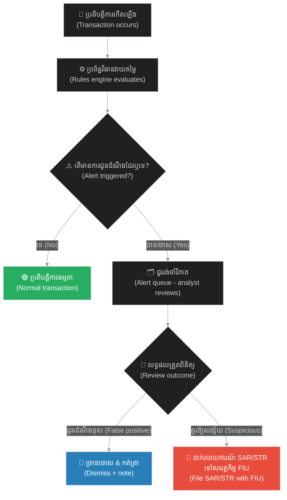

# ការត្រួតពិនិត្យប្រតិបត្តិការហិរញ្ញវត្ថុដើម្បីបង្ការការសម្អាតប្រាក់ (AML Transaction Monitoring)៖ AML Transaction Monitoring

**Tags:** #compliance #aml #transaction-monitoring #suspicious-activity #sar #fintech

---

## 📌 មាតិកា (Table of Contents)
- [តើវាជាអ្វី (What It Is)](#0)
- [របៀបដែលវាដំណើរការ (How It Works)](#1)
- [វិធានជូនដំណឹងទូទៅ (Common Alert Rules)](#2)
- [ការកំណត់កម្រិតជូនដំណឹង (Alert Thresholds — Tuning)](#3)
- [ការដាក់របាយការណ៍ SAR / STR (SAR / STR Filing)](#4)
- [ជម្រើសបច្ចេកវិទ្យា (Technology Options)](#5)
- [ការរក្សាទុកឯកសារកត់ត្រា (Record Keeping)](#6)
- [ឯកសារទាក់ទង (Related)](#7)

---

## តើវាជាអ្វី (What It Is)

ការត្រួតពិនិត្យប្រតិបត្តិការហិរញ្ញវត្ថុ គឺជាដំណើរការដោយស្វ័យប្រវត្ត ឬដោយដៃក្នុងការពិនិត្យមើលប្រតិបត្តិការហិរញ្ញវត្ថុ ដើម្បីស្វែងរកលំនាំដែលអាចចង្អុលបង្ហាញពីការសម្អាតប្រាក់ ការឆបោក ការផ្តល់ហិរញ្ញប្បទានដល់ភេរវកម្ម ឬបទល្មើសហិរញ្ញវត្ថុផ្សេងទៀត។ វាគឺជាលក្ខខណ្ឌតម្រូវស្នូលនៃបទប្បញ្ញត្តិ AML/CFT នៅទូទាំងសកលលោក។  
Transaction monitoring is the automated and manual process of reviewing financial transactions to detect patterns that may indicate money laundering, fraud, terrorism financing, or other financial crimes. It is a core requirement of AML/CFT regulations globally.  

---

## របៀបដែលវាដំណើរការ (How It Works)

លំហូរការងារនៃការត្រួតពិនិត្យប្រតិបត្តិការហិរញ្ញវត្ថុត្រូវបានបង្ហាញតាមរយៈគំនូសតាងខាងក្រោម៖  
The transaction monitoring workflow is shown in the diagram below:  

---

## វិធានជូនដំណឹងទូទៅ (Common Alert Rules)

វិធានជូនដំណឹងត្រូវបានបែងចែកជាបីប្រភេទចម្បងៗ៖  
Alert rules are divided into three main categories:  

### វិធានផ្អែកលើទំហំ ឬចំនួនប្រតិបត្តិការ (Volume-Based Rules)

| វិធាន Rule | ការពិពណ៌នា Description |
|:---|:---|
| **ការស្វែងរកការបំបែកប្រតិបត្តិការ** Structuring detection | ប្រតិបត្តិការច្រើនដងដែលមានទំហំទឹកប្រាក់ទាបជាងកម្រិតត្រូវរាយការណ៍បន្តិចបន្តួច (ឧទាហរណ៍ ៥ ដងក្នុងតម្លៃ $៩,៩០០ ក្នុងមួយថ្ងៃ) Multiple transactions just below reporting threshold (e.g. 5× $9,900 in one day) |
| **ល្បឿនប្រតិបត្តិការ** Velocity | ប្រតិបត្តិការច្រើនជាងធម្មតាធៀបនឹងប្រវត្តិរូបអតិថិជនក្នុងរយៈពេលខ្លី More transactions than typical for this customer profile in a short period |
| **ប្រតិបត្តិការទោលទំហំធំ** Large single transaction | ប្រតិបត្តិការលើសពីកម្រិតកំណត់ (ឧទាហរណ៍ > $១០,០០០ ដុល្លារអាមេរិក) Transaction exceeds defined threshold (e.g. > $10,000 USD) |
| **កម្រិតកំណត់ប្រមូលផ្តុំ** Cumulative threshold | សរុបប្រតិបត្តិការក្នុងរយៈពេល ៣០ ថ្ងៃលើសពីកម្រិតកំណត់ Total transactions in 30 days exceed threshold |

### វិធានផ្អែកលើលំនាំប្រតិបត្តិការ (Pattern-Based Rules)

| វិធាន Rule | ការពិពណ៌នា Description |
|:---|:---|
| **ប្រតិបត្តិការវិលជុំ** Round tripping | ថវិការត់ចេញទៅក្រៅ ហើយត្រលប់មកវិញពីប្រភពផ្សេងគ្នា Money goes out and comes back from a different source |
| **ការបំប្លែងច្រើនដំណាក់កាល** Layering | ការផ្ទេរប្រាក់យ៉ាងលឿនឆ្លងកាត់គណនី ឬរូបិយប័ណ្ណជាច្រើន Rapid movement through multiple accounts or currencies |
| **ភាពមិនស៊ីគ្នានៃភូមិសាស្ត្រ** Geographic mismatch | ប្រតិបត្តិការពីប្រទេសដែលមិនធម្មតាសម្រាប់អតិថិជននេះ Transaction from an unusual country for this customer |
| **ដែនសមត្ថកិច្ចហានិភ័យខ្ពស់** High-risk jurisdiction | ប្រតិបត្តិការទៅ/មកពីប្រទេសដែលស្ថិតក្នុងបញ្ជីប្រផេះ/ខ្មៅរបស់ FATF Transaction to/from FATF grey/black list country |
| **សកម្មភាពលើគណនីអសកម្ម** Dormant account activity | គណនីដែលអសកម្មលើសពី ៦ ខែ ស្រាប់តែមានប្រតិបត្តិការធំៗ Account inactive for 6+ months suddenly has large transactions |
| **ការផ្ទេរចេញភ្លាមៗ** Same-day in/out | ទទួលបានមូលនិធិ ហើយផ្ទេរចេញទៅក្រៅភ្លាមៗ Funds received and immediately transferred out |
| **ការបំប្លែងរហ័ស** Rapid conversion | លុយហ្វីអាត (Fiat) បំប្លែងទៅជាគ្រីបតូ ហើយបំប្លែងត្រលប់មកវិញភ្លាមៗ Fiat converted to crypto, immediately converted back |

### វិធានផ្អែកលើទំនាក់ទំនង (Relationship-Based Rules)

| វិធាន Rule | ការពិពណ៌នា Description |
|:---|:---|
| **ហានិភ័យពីភាគីផ្ទុយ** Counterparty risk | ប្រតិបត្តិការជាមួយអង្គភាពដែលរងទណ្ឌកម្ម ឬមានហានិភ័យខ្ពស់ Transaction with a sanctioned or high-risk entity |
| **សកម្មភាពរបស់បុគ្គល PEP** PEP activity | ប្រតិបត្តិការមិនធម្មតាដែលពាក់ព័ន្ធនឹងបុគ្គលមានឥទ្ធិពលខាងនយោបាយ (PEP) Unusual transactions involving a politically exposed person |
| **តំណភ្ជាប់បណ្តាញ** Network links | អតិថិជនធ្វើប្រតិបត្តិការញឹកញាប់ជាមួយភាគីសង្ស័យដែលគេស្គាល់ Customer transacts frequently with known suspicious parties |

---

## ការកំណត់កម្រិតជូនដំណឹង (Alert Thresholds — Tuning)

ការកំណត់វិធានមិនបានល្អនឹងបង្កើតការជូនដំណឹងខុស (False Positives) ច្រើនហួសហេតុ — ធ្វើឱ្យអ្នកវិភាគមានការនឿយហត់ ហើយសកម្មភាពសង្ស័យពិតប្រាកដត្រូវបានមើលរំលង។ វិធានដែលកំណត់បានល្អតម្រូវឱ្យមាន៖  
Poorly tuned rules create too many false positives — analysts are overwhelmed and real suspicious activity is buried. Well-tuned rules require:  

1. **ការបង្កើតប្រវត្តិរូបជាមូលដ្ឋាន** — ស្វែងយល់ពីលំនាំប្រតិបត្តិការធម្មតាសម្រាប់អតិថិជននីមួយៗ  
   **Baseline profiling** — understand normal transaction patterns for each customer segment  
2. **កម្រិតកំណត់ផ្អែកលើហានិភ័យ** — កម្រិតខ្ពស់សម្រាប់អតិថិជនដែលមានហានិភ័យទាបដែលបានផ្ទៀងផ្ទាត់ និងកម្រិតទាបសម្រាប់អតិថិជនថ្មី/ហានិភ័យខ្ពស់  
   **Risk-based thresholds** — higher thresholds for verified, low-risk customers; lower for new/high-risk  
3. **ការវាស់ស្ទង់ជាប្រចាំ** — ពិនិត្យមើលអត្រាជូនដំណឹងខុសប្រចាំខែ និងកែតម្រូវកម្រិតកំណត់  
   **Regular calibration** — review false positive rate monthly; adjust thresholds  
4. **ម៉ូដែលរៀនសូត្ររបស់ម៉ាស៊ីន (ML)** (កម្រិតខ្ពស់) — ការរកឃើញភាពមិនប្រក្រតីដែលបានបណ្តុះបណ្តាលលើទិន្នន័យប្រតិបត្តិការប្រវត្តិសាស្ត្រ  
   **ML models** (advanced) — anomaly detection trained on historical transaction data  

**អត្រាគោលដៅនៃការជូនដំណឹងខុស៖** < ៩៥% នៃការជូនដំណឹងគួរតែត្រូវបានច្រានចោលជាការជូនដំណឹងខុស។ ប្រសិនបើ > ៩៩% ជាការជូនដំណឹងខុស មានន័យថាវិធាននោះមានភាពរសើបខ្លាំងពេកហើយ។  
**Target false positive rate:** < 95% of alerts should be dismissed as false positives. If > 99% are false positives, the rules are too sensitive.  

---

## ការដាក់របាយការណ៍ SAR / STR (SAR / STR Filing)

នៅពេលដែលប្រតិបត្តិការមួយត្រូវបានវាយតម្លៃថាគួរឱ្យសង្ស័យ៖  
When a transaction is assessed as suspicious:  

| ជំហាន Step | សកម្មភាព Action |
|:---|:---|
| 1 | កត់ត្រាសូចនាករសង្ស័យឱ្យបានលម្អិត Document the suspicious indicators in detail |
| 2 | ហាមទម្លាយព័ត៌មានដល់អតិថិជន — ការទម្លាយព័ត៌មាន (Tipping Off) គឺជាបទល្មើសព្រហ្មទណ្ឌ Do NOT tip off the customer — tipping off is a criminal offence |
| 3 | ដាក់របាយការណ៍សកម្មភាពសង្ស័យ (SAR) ឬរបាយការណ៍ប្រតិបត្តិការសង្ស័យ (STR) ទៅកាន់អង្គភាពស៊ើបការណ៍ហិរញ្ញវត្ថុជាតិ (FIU) File a SAR (Suspicious Activity Report) or STR (Suspicious Transaction Report) with the national FIU |
| 4 | បន្តទំនាក់ទំនងធុរកិច្ចជាធម្មតា លើកលែងតែមានការណែនាំផ្សេងពីអង្គភាព FIU Continue the relationship normally unless the FIU instructs otherwise |
| 5 | រក្សាសំណៅឯកសារ SAR រយៈពេល ៥ ឆ្នាំ Retain a copy of the SAR for 5 years |

### កាលកំណត់ដាក់របាយការណ៍តាមដែនសមត្ថកិច្ច (Filing Timeline by Jurisdiction)

| ដែនសមត្ថកិច្ច Jurisdiction | កាលកំណត់ដាក់របាយការណ៍ Filing deadline |
|:---|:---|
| សហរដ្ឋអាមេរិក (FinCEN) USA (FinCEN) | ក្នុងរយៈពេល ៣០ ថ្ងៃបន្ទាប់ពីរកឃើញ (៦០ ថ្ងៃ ប្រសិនបើមិនស្គាល់អត្តសញ្ញាណជនសង្ស័យ) Within 30 days of detection (60 days if subject unknown) |
| ចក្រភពអង់គ្លេស (NCA) UK (NCA) | ឱ្យបានលឿនតាមដែលអាចធ្វើទៅបាន As soon as practicable |
| សហភាពអឺរ៉ុប EU | ប្រែប្រួលតាមប្រទេសជាសមាជិក (ជាទូទៅ ២៤ ទៅ ៧២ ម៉ោង) Varies by member state (typically 24–72 hours) |
| កម្ពុជា (CAFIU) Cambodia (NBC FIU) | ក្នុងរយៈពេល ២ ថ្ងៃធ្វើការ Within 2 working days |
| សិង្ហបុរី (SPF) Singapore (SPF) | ឱ្យបានលឿនតាមដែលអាចធ្វើទៅបាន As soon as practicable |
| ថៃ (AMLO) Thailand (AMLO) | ក្នុងរយៈពេល ៣ ថ្ងៃធ្វើការ Within 3 working days |

---

## ជម្រើសបច្ចេកវិទ្យា (Technology Options)

| វិធីសាស្ត្រ Approach | ឧបករណ៍ Tools | ស័ក្តិសមបំផុតសម្រាប់ Best for |
|:---|:---|:---|
| ផ្អែកលើវិធាន (Rules-based) | Oracle FCCM, Actimize, NICE Actimize | ធនាគារ ស្ថាប័នហិរញ្ញវត្ថុដែលបានបង្កើតឡើងយូរ Banks, established institutions |
| ផ្អែកលើ ML (ML-based) | Featurespace, Feedzai, ComplyAdvantage | ក្រុមហ៊ុនបច្ចេកវិទ្យាហិរញ្ញវត្ថុ (FinTechs) ការត្រួតពិនិត្យពេលវេលាជាក់ស្តែង FinTechs, real-time monitoring |
| ក្លៅដ៍ SaaS (Cloud SaaS) | Unit21, Sardine, Sift | ក្រុមហ៊ុនបង្កើតថ្មី (Startups) ពាណិជ្ជកម្មអេឡិចត្រូនិក និងផ្លែតហ្វម Startups, e-commerce, platforms |
| កូដប្រភពបើកចំហ (Open source) | Open rules engine + custom rules | ធុរកិច្ចដែលមានទំហំប្រតិបត្តិការតូច ការបង្កើតដោយផ្ទាល់ខ្លួនផ្ទៃក្នុង Very small volumes, internal build |

---

## ការរក្សាទុកឯកសារកត់ត្រា (Record Keeping)

| ប្រភេទឯកសារកត់ត្រា Record | រយៈពេលរក្សាទុក Retention |
|:---|:---|
| **ឯកសារកត់ត្រាការជូនដំណឹង** (រួមទាំងការច្រានចោល) Alert records (including dismissed alerts) | ៥ ឆ្នាំ 5 years |
| **សំណៅឯកសារ SAR** SAR copies | ៥ ឆ្នាំ បន្ទាប់ពីការដាក់របាយការណ៍ 5 years after filing |
| **កំណត់ត្រានៃការស៊ើបអង្កេត** Investigation notes | ៥ ឆ្នាំ 5 years |
| **កំណត់ត្រានៃការវាស់ស្ទង់ប្រព័ន្ធ** Calibration records | ៥ ឆ្នាំ 5 years |

---

## ឯកសារទាក់ទង (Related)

* **[ការប្រឆាំងការសម្អាតប្រាក់ និងការផ្តល់ហិរញ្ញប្បទានដល់ភេរវកម្ម (AML/CFT)](../payment-and-financial/03-aml-cft.md)**  
  [AML/CFT](../payment-and-financial/03-aml-cft.md)  
* **[មូលដ្ឋានគ្រឹះ KYC / KYB (KYC / KYB Fundamentals)](./01-kyc-kyb-fundamentals.md)**  
  [KYC/KYB Fundamentals](./01-kyc-kyb-fundamentals.md)  
* **[ការត្រួតពិនិត្យទណ្ឌកម្ម (Sanctions Screening)](./04-sanctions-screening.md)**  
  [Sanctions Screening](./04-sanctions-screening.md)  
* **[អនុសាសន៍របស់ FATF (FATF Recommendations)](./03-fatf-recommendations.md)**  
  [FATF Recommendations](./03-fatf-recommendations.md)  
