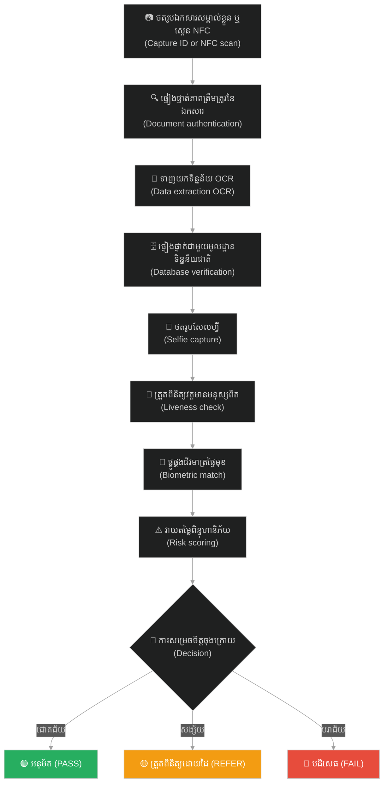

# ការផ្ទៀងផ្ទាត់អត្តសញ្ញាណឌីជីថល — ស្តង់ដារបច្ចេកទេស (Digital Identity Verification — Technical Standards)៖ Digital Identity Verification — Technical Standards

**Tags:** #compliance #kyc #identity #liveness #ocr #biometrics #verification

---

## 📌 មាតិកា (Table of Contents)
- [តើវាជាអ្វី (What It Is)](#0)
- [សសរស្តម្ភទាំងបី (The Three Pillars)](#1)
- [ការធ្វើតេស្តអ្នកផ្តល់សេវាសម្គាល់ផ្ទៃមុខរបស់ NIST (NIST Face Recognition Vendor Test (FRVT))](#2)
- [កម្រិតនៃការធានាអត្តសញ្ញាណ (Identity Assurance Levels (NIST SP 800-63))](#3)
- [ប្រព័ន្ធ eKYC អេឡិចត្រូនិក (eKYC (Electronic KYC))](#4)
- [មូលហេតុបរាជ័យទូទៅ និងបទពិសោធន៍អ្នកប្រើប្រាស់ (Common Failure Reasons and User Experience)](#5)
- [ការគ្របដណ្តប់នៃឯកសារតាមប្រទេស (Document Coverage by Country)](#6)
- [លក្ខវិនិច្ឆ័យជ្រើសរើសដៃគូសេវាកម្ម (Vendor Selection Criteria)](#7)
- [ឯកសារទាក់ទង (Related)](#8)

---

## តើវាជាអ្វី (What It Is)

ការផ្ទៀងផ្ទាត់អត្តសញ្ញាណឌីជីថល គឺជាដំណើរការបច្ចេកទេសក្នុងការបញ្ជាក់ថាបុគ្គលម្នាក់ពិតជាអ្នកដែលពួកគេបានអះអាងពិតប្រាកដ — ដោយប្រើប្រាស់មធ្យោបាយឌីជីថលជំនួសឱ្យវត្តមានផ្ទាល់។ វាបញ្ជូលគ្នារវាងការផ្ទៀងផ្ទាត់ភាពត្រឹមត្រូវនៃឯកសារ ការផ្គូផ្គងជីវមាត្រ (Biometric) និងការត្រួតពិនិត្យវត្តមានមនុស្សពិតប្រាកដ (Liveness)។  
Digital identity verification is the technical process of confirming that a person is who they claim to be — using digital means rather than physical presence. It combines document authentication, biometric matching, and liveness detection.  

---

## សសរស្តម្ភទាំងបី (The Three Pillars)

### ១. ការផ្ទៀងផ្ទាត់ភាពត្រឹមត្រូវនៃឯកសារ (Document Authentication)

ផ្ទៀងផ្ទាត់ថាឯកសារសម្គាល់ខ្លួននោះពិតជាឯកសារពិតប្រាកដ និងមិនត្រូវបានគេកែប្រែ។  
Verify that the identity document is genuine and unaltered.  

| ការត្រួតពិនិត្យ Check | អ្វីដែលប្រព័ន្ធរកឃើញ What it detects |
|:---|:---|
| **ការផ្ទៀងផ្ទាត់តំបន់ MRZ** MRZ (Machine Readable Zone) validation | ពិនិត្យមើលភាពស៊ីគ្នានៃអក្សរពីរជួរនៅផ្នែកខាងក្រោមនៃលិខិតឆ្លងដែន Checks the bottom two lines of a passport for consistency |
| **ការពិនិត្យមើលដោយចក្ខុវិញ្ញាណ (AI)** Visual inspection (AI) | លក្ខណៈពិសេសការពារសន្តិសុខ លំនាំហូឡូក្រាម និងភាពស៊ីគ្នានៃពុម្ពអក្សរ Security features, hologram patterns, font consistency |
| **ការអានបន្ទះឈីប (NFC)** Chip reading (NFC) | សម្រាប់លិខិតឆ្លងដែនជីវមាត្រ (Biometric Passport) — អានទិន្នន័យពីឈីបផ្ទាល់ For biometric passports — reads the chip directly |
| **ការស្កេនបាកូដ / QR កូដ** Barcode / QR scan | សម្រាប់អត្តសញ្ញាណប័ណ្ណជាតិមួយចំនួន For some national IDs |
| **ការស្វែងរកក្នុងមូលដ្ឋានទិន្នន័យ** Database lookup | ត្រួតពិនិត្យធៀបនឹងបញ្ជីឈ្មោះចុះបញ្ជីអត្តសញ្ញាណរបស់រដ្ឋាភិបាល (បើមាន) Checking against government identity registries (where available) |
| **ការរកឃើញលំនាំក្លែងបន្លំ** Fraud pattern detection | ស្វែងរកលំនាំនៃការក្លែងបន្លំឯកសារដែលធ្លាប់បានដឹង Known document forgery patterns |

### ២. ការផ្គូផ្គងជីវមាត្រ (Biometric Matching)

ផ្គូផ្គងបុគ្គលដែលកំពុងបង្ហាញឯកសារ ទៅនឹងរូបថតនៅលើឯកសារនោះ។  
Match the person presenting the document to the photo in the document.  

| វិធីសាស្ត្រ Method | ភាពត្រឹមត្រូវ Accuracy | កត់សម្គាល់ Notes |
|:---|:---|:---|
| **ការសម្គាល់ផ្ទៃមុខ** Facial recognition | ៩៩%+ (ម៉ូដែលទំនើប) 99%+ (modern models) | រូបថតសែលហ្វី ធៀបនឹង រូបថតលើអត្តសញ្ញាណប័ណ្ណ Selfie vs ID photo |
| **ការផ្គូផ្គង ១:១** 1:1 matching | ខ្ពស់ High | រូបថតសែលហ្វីត្រូវគ្នានឹងរូបថតលើអត្តសញ្ញាណប័ណ្ណជាក់លាក់នេះ Selfie matches this specific ID photo |
| **ការផ្គូផ្គង ១:N** 1:N matching | ខ្ពស់ក្នុងកម្រិតទ្រង់ទ្រាយធំ High at scale | ពិនិត្យធៀបនឹងមូលដ្ឋានទិន្នន័យ (មិនសូវប្រើប្រាស់ក្នុងដំណើរការ KYC ឡើយ) Checks against a database (less common in KYC) |

### ៣. ការត្រួតពិនិត្យវត្តមានមនុស្សពិតប្រាកដ (Liveness Detection)

ការពារការក្លែងបន្លំដោយប្រើប្រាស់រូបថត វីដេអូ ឬរបាំងមុខ។  
Prevent spoofing with photos, videos, or masks.  

| ប្រភេទ Type | វិធីសាស្ត្រ Method |
|:---|:---|
| **ការត្រួតពិនិត្យវត្តមានអសកម្ម** Passive liveness | ការវិភាគដោយ AI លើរូបភាពទោល — មិនតម្រូវឱ្យអ្នកប្រើប្រាស់ធ្វើសកម្មភាពអ្វីឡើយ AI analysis of a single image — no user interaction required |
| **ការត្រួតពិនិត្យវត្តមានសកម្ម** Active liveness | អ្នកប្រើប្រាស់ត្រូវធ្វើសកម្មភាពណាមួយ (ងាកក្បាល បិទបើកភ្នែក ឬញញឹម) User performs an action (turn head, blink, smile) |
| **ការត្រួតពិនិត្យវត្តមានតាមវីដេអូ** Video liveness | ដំណើរការឃ្លីបវីដេអូខ្លីដើម្បីស្វែងរកសញ្ញាវត្តមានមនុស្សពិតប្រាកដ Short video clip processed for liveness signals |
| **ការត្រួតពិនិត្យវត្តមាន 3D** 3D liveness | ឧបករណ៍ចាប់ជម្រៅ (ដូចជាប្រភេទ Face ID) — សន្តិសុខកម្រិតខ្ពស់បំផុត Depth sensors (Face ID type) — highest security |

---

## ការធ្វើតេស្តអ្នកផ្តល់សេវាសម្គាល់ផ្ទៃមុខរបស់ NIST (NIST Face Recognition Vendor Test (FRVT))

វិទ្យាស្ថាន NIST ដំណើរការការវាយតម្លៃជាបន្តបន្ទាប់លើក្បួនដោះស្រាយការសម្គាល់ផ្ទៃមុខ។ សម្រាប់ដំណើរការ KYC ដែលត្រូវការការធានាខ្ពស់ (សេវាកម្មហិរញ្ញវត្ថុ សេវាថែទាំសុខភាព) សូមប្រើប្រាស់អ្នកផ្តល់សេវាដែលមានពិន្ទុ FRVT ខ្ពស់។ អ្នកផ្តល់សេវាកំពូលៗរួមមាន៖ Idemia, NEC, Cognitec, Daon។  
NIST runs ongoing evaluations of face recognition algorithms. For high-assurance KYC (financial services, healthcare), use providers with strong FRVT scores. Top performers consistently include: Idemia, NEC, Cognitec, Daon.  

---

## កម្រិតនៃការធានាអត្តសញ្ញាណ (Identity Assurance Levels (NIST SP 800-63))

| កម្រិត Level | ឈ្មោះ Name | កម្លាំងនៃការផ្ទៀងផ្ទាត់ Verification strength |
|:---|:---|:---|
| **IAL1** | ការអះអាងដោយខ្លួនឯង Self-asserted | គ្មានការផ្ទៀងផ្ទាត់អត្តសញ្ញាណ — អ្នកប្រើប្រាស់ផ្តល់ព័ត៌មានដោយខ្លួនឯង No identity proofing — user provides their own info |
| **IAL2** | ការផ្ទៀងផ្ទាត់អត្តសញ្ញាណពីចម្ងាយ Remote identity proofing | ឯកសារសម្គាល់ខ្លួន + សែលហ្វី + វត្តមានពិតប្រាកដ — ធ្វើឡើងពីចម្ងាយ Document + selfie + liveness — done remotely |
| **IAL3** | ការផ្ទៀងផ្ទាត់ផ្ទាល់ In-person | វត្តមានផ្ទាល់ ឬផ្ទៀងផ្ទាត់ពីចម្ងាយក្រោមការត្រួតពិនិត្យពីភ្នាក់ងារ Physical presence or supervised remote with operator |

ករណីប្រើប្រាស់ KYC ភាគច្រើនតម្រូវឱ្យមានកម្រិត **IAL2** ជាអប្បបរមា។ សេវាកម្មហិរញ្ញវត្ថុដែលមានតម្លៃខ្ពស់អាចនឹងតម្រូវឱ្យមានកម្រិត IAL3។  
Most KYC use cases require **IAL2** minimum. High-value financial services may require IAL3.  

---

## ប្រព័ន្ធ eKYC អេឡិចត្រូនិក (eKYC (Electronic KYC))

eKYC គឺជាដំណើរការឌីជីថលពេញលេញពីចុងម្ខាងទៅចុងម្ខាង៖  
eKYC is the fully digital end-to-end process:  

---

## មូលហេតុបរាជ័យទូទៅ និងបទពិសោធន៍អ្នកប្រើប្រាស់ (Common Failure Reasons and User Experience)

| បញ្ហាបរាជ័យ Failure | សារត្រូវបង្ហាញជូនអ្នកប្រើប្រាស់ Message to show user |
|:---|:---|
| **រូបថតឯកសារមិនច្បាស់** Blurry document photo | «រូបថតឯកសារសម្គាល់ខ្លួនរបស់លោកអ្នកមិនច្បាស់ទេ។ សូមថតម្តងទៀតនៅក្នុងទីតាំងដែលមានពន្លឺល្អជាងនេះ។» "Your ID photo is blurry. Please retake it in better lighting." |
| **មានចំណាំងប្លាតលើឯកសារ** Glare on document | «មានចំណាំងប្លាតពន្លឺលើឯកសារសម្គាល់ខ្លួនរបស់លោកអ្នក។ សូមជៀសវាងពីពន្លឺចាំងផ្ទាល់ ហើយថតម្តងទៀត។» "There's glare on your ID. Move away from direct light and retake." |
| **ឯកសារអស់សុពលភាព** ID expired | «ឯកសារសម្គាល់ខ្លួនរបស់លោកអ្នកបានអស់សុពលភាពហើយ។ សូមប្រើប្រាស់ឯកសារដែលមានសុពលភាព។» "Your ID has expired. Please use a valid document." |
| **ផ្ទៃមុខមិនស៊ីគ្នា** Face not matching | «យើងមិនអាចផ្គូផ្គងរូបថតសែលហ្វីទៅនឹងឯកសារសម្គាល់ខ្លួនរបស់លោកអ្នកបានទេ។ សូមថតរូបទាំងពីរឡើងវិញនៅក្នុងទីតាំងដែលមានពន្លឺល្អ។» "We couldn't match your selfie to your ID. Please retake both in good lighting." |
| **ការផ្ទៀងផ្ទាត់វត្តមានពិតប្រាកដបរាជ័យ** Liveness failed | «សូមអនុវត្តតាមការណែនាំ និងមើលឱ្យចំកាមេរ៉ា។» "Please follow the instructions and look directly at the camera." |
| **ឯកសារមិនត្រូវបានគាំទ្រ** Document not supported | «ប្រភេទឯកសារនេះមិនត្រូវបានទទួលយកនៅក្នុងប្រទេសរបស់លោកអ្នកឡើយ។ សូមប្រើប្រាស់ [ឯកសារជំនួស]។» "This document type is not accepted in your country. Please use [alternatives]." |

---

## ការគ្របដណ្តប់នៃឯកសារតាមប្រទេស (Document Coverage by Country)

ប្រទេសនីមួយៗមានការគាំទ្រឯកសារខុសៗគ្នា។ សូមប្រាកដថាអ្នកផ្តល់សេវាផ្ទៀងផ្ទាត់របស់អ្នកមានលទ្ធភាពគាំទ្រលើទីផ្សារគោលដៅរបស់អ្នក៖  
Different countries have different supported documents. Ensure your verification provider has coverage for your target markets:  

| ប្រទេស Country | ឯកសារដែលត្រូវបានទទួលយក Accepted documents |
|:---|:---|
| កម្ពុជា Cambodia | អត្តសញ្ញាណប័ណ្ណសញ្ជាតិខ្មែរ (ប្រភេទជីវមាត្រថ្មី) លិខិតឆ្លងដែន National ID (new biometric), Passport |
| ថៃ Thailand | អត្តសញ្ញាណប័ណ្ណជាតិ (CID) លិខិតឆ្លងដែន ប័ណ្ណបើកបរ National ID (CID), Passport, Driver's licence |
| សិង្ហបុរី Singapore | NRIC លិខិតឆ្លងដែន ប័ណ្ណការងារ (Employment Pass) NRIC, Passport, Employment Pass |
| វៀតណាម Vietnam | CCCD (អត្តសញ្ញាណប័ណ្ណមានឈីប) លិខិតឆ្លងដែន CCCD (Chip ID), Passport |
| ឥណ្ឌូនេស៊ី Indonesia | KTP (អត្តសញ្ញាណប័ណ្ណជាតិ) លិខិតឆ្លងដែន KTP (National ID), Passport |

---

## លក្ខវិនិច្ឆ័យជ្រើសរើសដៃគូសេវាកម្ម (Vendor Selection Criteria)

| លក្ខវិនិច្ឆ័យ Criterion | អ្វីដែលត្រូវត្រួតពិនិត្យ What to check |
|:---|:---|
| **ការគ្របដណ្តប់ឯកសារ** Document coverage | តើប្រព័ន្ធគាំទ្រឯកសាររបស់ប្រទេសគោលដៅរបស់អ្នកដែរឬទេ? Does it support your target countries' documents? |
| **អត្រារកឃើញការក្លែងបន្លំ** Fraud detection rate | តើអត្រាទទួលយកការផ្គូផ្គងខុស (FAR) មានកម្រិតប៉ុន្មាន? What is the false acceptance rate (FAR)? |
| **កម្រិតត្រួតពិនិត្យវត្តមាន** Liveness level | ប្រភេទសកម្ម ឬអសកម្ម — តើមួយណាដែលតម្រូវសម្រាប់កម្រិតហានិភ័យរបស់អ្នក? Passive vs active — what's required for your risk level? |
| **GDPR និងឯកជនភាពទិន្នន័យ** GDPR/data privacy | តើទិន្នន័យត្រូវបានរក្សាទុកនៅឯណា? តើគោលការណ៍រក្សាទុកទិន្នន័យជាអ្វី? Where is data stored? What is the retention policy? |
| **គុណភាព API** API quality | តើជាប្រភេទ SDK ឬ API? គុណភាព Mobile SDK យ៉ាងដូចម្តេច? SDK vs API? Mobile SDK quality? |
| **កិច្ចព្រមព្រៀងកម្រិតសេវាកម្ម (SLA)** SLA | តើពេលវេលានៃការដំណើរការផ្ទៀងផ្ទាត់ (SLA) មានរយៈពេលប៉ុន្មាន? What is the processing time SLA? |
| **តម្លៃ** Price | ការគិតតម្លៃក្នុងមួយការផ្ទៀងផ្ទាត់ — តើមានការបញ្ចុះតម្លៃតាមទំហំដែរឬទេ? Per-verification pricing — volume discounts? |
| **ភស្តុតាងសវនកម្ម** Audit trail | តើអ្នកអាចនាំចេញឯកសារកត់ត្រាការផ្ទៀងផ្ទាត់សម្រាប់សវនកម្មបានដែរឬទេ? Can you export verification records for compliance? |

---

## ឯកសារទាក់ទង (Related)

* **[មូលដ្ឋានគ្រឹះ KYC / KYB (KYC / KYB Fundamentals)](./01-kyc-kyb-fundamentals.md)**  
  [KYC/KYB Fundamentals](./01-kyc-kyb-fundamentals.md)  
* **[បទប្បញ្ញត្តិ eIDAS (eIDAS)](./05-eidas.md)** — ក្របខ័ណ្ឌអត្តសញ្ញាណឌីជីថលរបស់សហភាពអឺរ៉ុប  
  [eIDAS](./05-eidas.md) — EU digital identity framework  
* **[ខ្សែសង្វាក់នៃការបញ្ចូល និងផ្ទៀងផ្ទាត់ឯកសារ (File Upload & Validation Pipeline)](../../procedures/compliance-and-accounts/02-file-upload-validation-pipeline.md)** — ការគ្រប់គ្រងឯកសារបច្ចេកទេសសម្រាប់ឯកសារ KYC [File Upload & Validation Pipeline](../../procedures/compliance-and-accounts/02-file-upload-validation-pipeline.md) — technical file handling for KYC documents  
* **[នីតិវិធីផ្ទៀងផ្ទាត់អ្នកផ្តល់សេវា KYC (KYC Provider Verification Procedure)](../../procedures/compliance-and-accounts/kyc/01-kyc-provider-verification.md)**  
  [KYC Provider Verification Procedure](../../procedures/compliance-and-accounts/kyc/01-kyc-provider-verification.md)  
