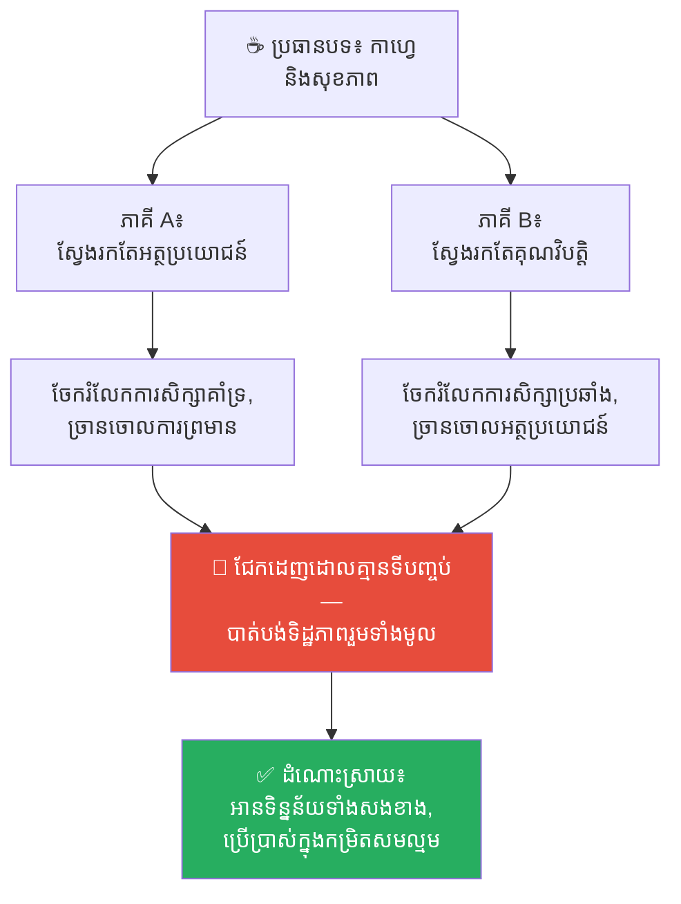
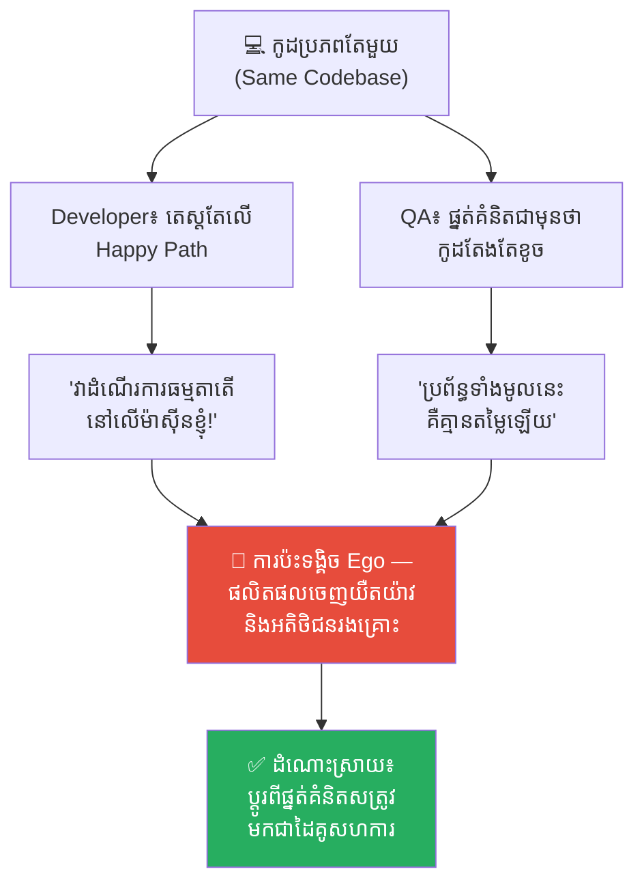
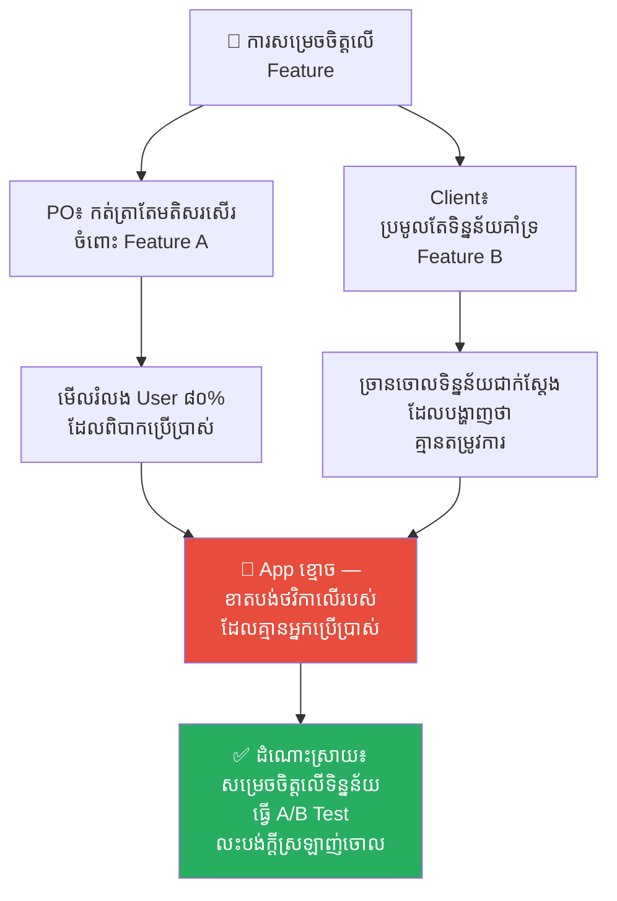
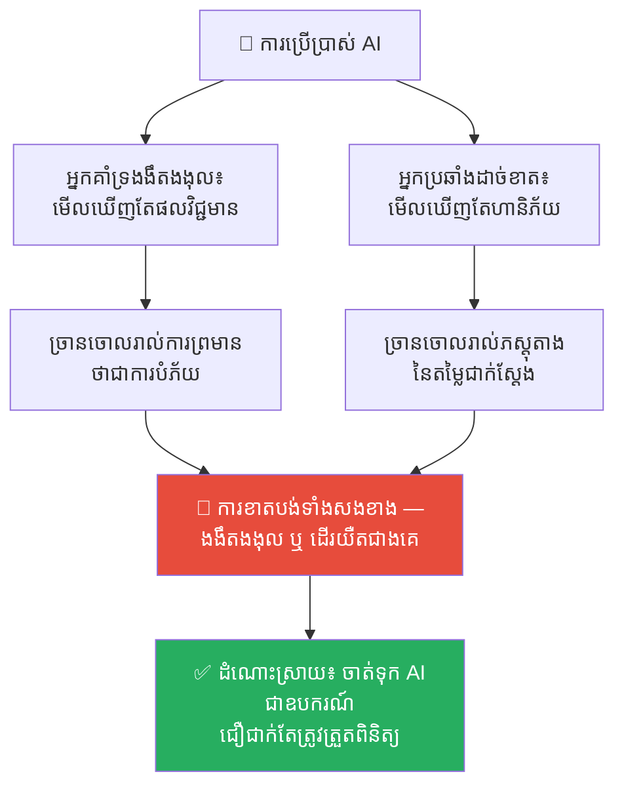
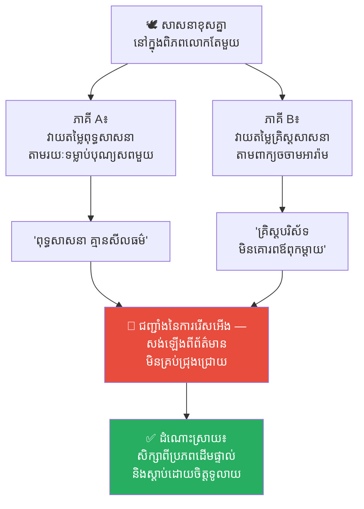
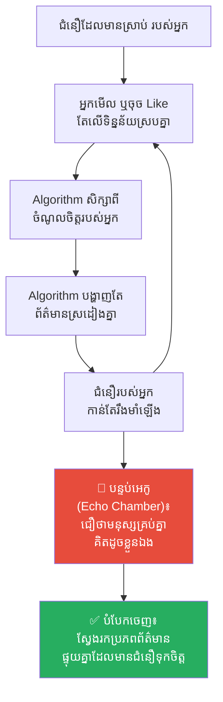
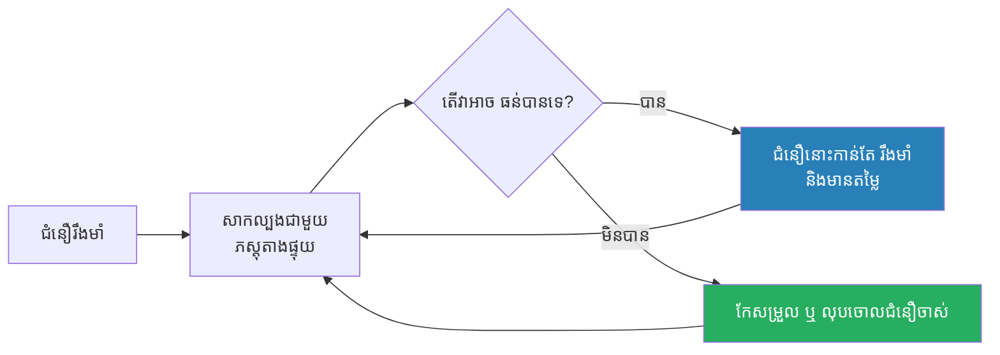

# Confirmation Bias (ការលំអៀងបញ្ជាក់អំណះអំណាង)៖ អន្ទាក់ចិត្តដែលបង្ខំយើងឱ្យស្តាប់តែអ្វីដែលយើងចង់ឮ

**Author:** ichamrong  
**Date:** 2026-05-16  
**Tags:** #confirmation-bias #cognitive-bias #critical-thinking #psychology #mental-models  
**Category:** Concepts  
**Read Time:** ~12 min  

---

## 📌 មាតិកា (Table of Contents)
- [អន្ទាក់ផ្លូវចិត្ត (The Trap)](#អន្ទាក់ផ្លូវចិត្ត-the-trap)
- [១. បញ្ហា៖ មេធាវីការពារក្តីនៅក្នុងខួរក្បាលរបស់អ្នក (The Issue: The Lawyer Inside Your Head)](#១-បញ្ហា-មេធាវីការពារក្តីនៅក្នុងខួរក្បាលរបស់អ្នក-the-issue-the-lawyer-inside-your-head)
- [២. ឧទាហរណ៍ជាក់ស្តែងក្នុងពិភពពិត (Real World Examples)](#២-ឧទាហរណ៍ជាក់ស្តែងក្នុងពិភពពិត)
  - [ឧទាហរណ៍ទី ១ — កម្រិតស្រាល៖ ជម្លោះរឿងកាហ្វេ (The Coffee Debate)](#ឧទាហរណ៍ទី-១-កម្រិតស្រាល-ជម្លោះរឿងកាហ្វេ-the-coffee-debate)
  - [ឧទាហរណ៍ទី ២ — កម្រិតមធ្យម (បច្ចេកទេស)៖ ជម្លោះរវាង Developer និង QA (The Dev vs. QA Standoff)](#ឧទាហរណ៍ទី-២-កម្រិតមធ្យម-បច្ចេកទេស-ជម្លោះរវាង-developer-និង-qa-the-dev-vs-qa-standoff)
  - [ឧទាហរណ៍ទី ៣ — កម្រិតមធ្យម (ធុរកិច្ច)៖ Product Owner ទល់នឹង អតិថិជន (Product Owner vs. Client)](#ឧទាហរណ៍ទី-៣-កម្រិតមធ្យម-ធុរកិច្ច-product-owner-ទល់នឹង-អតិថិជន-product-owner-vs-client)
  - [ឧទាហរណ៍ទី ៤ — កម្រិតមធ្យម (សង្គម)៖ ការជជែកដេញដោលរឿង AI (The AI Debate)](#ឧទាហរណ៍ទី-៤-កម្រិតមធ្យម-សង្គម-ការជជែកដេញដោលរឿង-ai-the-ai-debate)
  - [ឧទាហរណ៍ទី ៥ — កម្រិតធ្ងន់៖ ជំនឿ និងសាសនា (Faith and Religion)](#ឧទាហរណ៍ទី-៥-កម្រិតធ្ងន់-ជំនឿ-និងសាសនា-faith-and-religion)
- [៣. កត្តាជម្រុញ៖ បន្ទប់អេកូក្នុងយុគសម័យឌីជីថល (The Aggravator: Echo Chambers in the Digital Age)](#៣-កត្តាជម្រុញ-បន្ទប់អេកូក្នុងយុគសម័យឌីជីថល-the-aggravator-echo-chambers-in-the-digital-age)
- [៤. ដំណោះស្រាយទូទៅ (The General Solution)](#៤-ដំណោះស្រាយទូទៅ-the-general-solution)
  - [ស្វែងរកភស្តុតាងបដិសេធ (Seek Disconfirmation)](#ស្វែងរកភស្តុតាងបដិសេធ-seek-disconfirmation)
  - [ស្វែងរកប្រភពព័ត៌មានចម្រុះ (Diversify Your Sources)](#ស្វែងរកប្រភពព័ត៌មានចម្រុះ-diversify-your-sources)
  - [ចាត់ទុកជំនឿរបស់អ្នកជាសម្មតិកម្ម មិនមែនជាការពិតដាច់ខាត (Treat Your Beliefs as Hypotheses)](#ចាត់ទុកជំនឿរបស់អ្នកជាសម្មតិកម្ម-មិនមែនជាការពិតដាច់ខាត-treat-your-beliefs-as-hypotheses)
- [សេចក្តីសន្និដ្ឋាន (Conclusion)](#សេចក្តីសន្និដ្ឋាន-conclusion)
- [ឯកសារយោង (References)](#ឯកសារយោង-references)
- [Related Posts](#related-posts)

---

## អន្ទាក់ផ្លូវចិត្ត (The Trap)

តើអ្នកធ្លាប់ឆ្ងល់ទេថា ហេតុអ្វីបានជាមនុស្សពីរនាក់ អាចមើលទៅលើព័ត៌មាន ឬការពិតតែមួយដូចគ្នា បែរជាអាចទាញសេចក្តីសន្និដ្ឋានផ្ទុយគ្នាស្រឡះ និងចាកចេញទៅវិញដោយជំនឿរៀងៗខ្លួនកាន់តែខ្លាំង?

* អ្នកគាំទ្រ **បក្ស A** យល់ថាវាជា **«ភស្តុតាងដែលបញ្ជាក់ថា បក្ស A ត្រឹមត្រូវ»**។
* អ្នកគាំទ្រ **បក្ស B** យល់ថាវាជា **«ព័ត៌មានលំអៀង និងមិនពិត»**។

នេះមិនមែនមកពីពួកគេល្ងង់នោះទេ។ ប៉ុន្តែវាគឺដោយសារតែខួរក្បាលរបស់ពួកគេ កំពុងតែដំណើរការកម្មវិធីមេរោគមួយហៅថា **Confirmation Bias (ការលំអៀងបញ្ជាក់អំណះអំណាង)**។

ដើម្បីងាយស្រួលតាមដាន នេះជាផែនទីបង្ហាញផ្លូវសម្រាប់អត្ថបទនេះ៖
1. **បញ្ហា (The Issue)** — តើអ្វីទៅជា Confirmation Bias?
2. **ឧទាហរណ៍ជាក់ស្តែង (Real World Examples)** — តើវាជះឥទ្ធិពលលើជីវិត ការងារ និងសង្គមរបស់យើងយ៉ាងដូចម្តេច? (បង្ហាញពីទិដ្ឋភាពទាំងសងខាង ការពិតដ៏ជូរចត់ និងដំណោះស្រាយ)
3. **កត្តាជម្រុញ (The Aggravator)** — ហេតុអ្វីបានជាបញ្ហានេះកាន់តែធ្ងន់ធ្ងរក្នុងយុគសម័យឌីជីថល?
4. **ដំណោះស្រាយទូទៅ (The General Solution)** — តើយើងអាចគេចផុតពីអន្ទាក់ផ្លូវចិត្តនេះដោយរបៀបណា?

---

## ១. បញ្ហា៖ មេធាវីការពារក្តីនៅក្នុងខួរក្បាលរបស់អ្នក (The Issue: The Lawyer Inside Your Head)

**Confirmation Bias** គឺជាទំនោរចិត្តធម្មជាតិរបស់ខួរក្បាលមនុស្ស ក្នុងការ**ស្វែងរក បកស្រាយ និងចងចាំ**តែព័ត៌មានណាដែល**ស្របទៅនឹងជំនឿ ឬផ្នត់គំនិតដែលមានស្រាប់**របស់ខ្លួន ហើយបែរជាច្រានចោល ឬមើលរំលងរាល់ព័ត៌មានណាដែលផ្ទុយពីជំនឿនោះ។

និយាយឱ្យសាមញ្ញ៖

❌ យើង**មិនមែនជាអ្នកវិទ្យាសាស្ត្រ**ដែលស្វែងរកការពិតដោយគ្មានលំអៀងនោះឡើយ។

✅ នៅក្នុងការពិត យើងប្រៀបដូចជា**មេធាវីការពារក្តី** — ដែលប្រឹងប្រែងរកតែភស្តុតាង និងអំណះអំណាងមកការពារកូនក្តី (ជំនឿផ្ទាល់ខ្លួន) របស់ខ្លួនជានិច្ច ទោះបីជាដឹងខ្លួនឯងជ្រៅៗថាវាអាចខុសក៏ដោយ។

---

## ២. ឧទាហរណ៍ជាក់ស្តែងក្នុងពិភពពិត

ដើម្បីយល់ច្បាស់ពីលំអៀងផ្លូវចិត្តនេះ ផ្លូវការសិក្សានឹងនាំអ្នកទៅពិនិត្យមើល **ឧទាហរណ៍ចំនួន ៥ កម្រិតខុសៗគ្នា**៖

---

### ឧទាហរណ៍ទី ១ — កម្រិតស្រាល៖ ជម្លោះរឿងកាហ្វេ (The Coffee Debate)

**ស្ថានភាព៖** មិត្តភក្តិពីរនាក់ជជែកវែកញែកគ្នាពីរឿងផឹកកាហ្វេ។

* **ភាគី A (អ្នកញៀនកាហ្វេ)៖** ស្វែងរកតែពាក្យគន្លឹះនៅលើ Google ថា *«អត្ថប្រយោជន៍នៃការផឹកកាហ្វេ»*។ ពេលឃើញអត្ថបទដែលនិយាយថាកាហ្វេជួយការពារបេះដូង ពួកគេចែករំលែកវាភ្លាមៗ។ តែពេលឃើញការព្រមានពីការរំខានដល់ដំណេក ពួកគេច្រានចោលថា៖ *«ការស្រាវជ្រាវនេះមិនត្រឹមត្រូវទេ»*។
* **ភាគី B (អ្នកស្រឡាញ់សុខភាពធម្មជាតិ)៖** ស្វែងរកតែពាក្យ *«គ្រោះថ្នាក់ និងផលប៉ះពាល់នៃកាហ្វេ»*។ ពេលឃើញអត្ថបទនិយាយពីការបង្កការថប់បារម្ភ (Anxiety) ពួកគេយកទៅបង្ហាញភាគី A ភ្លាម។ តែពេលឃើញការសិក្សាពីអត្ថប្រយោជន៍កាហ្វេ ពួកគេច្រានចោលថា៖ *«នេះប្រហែលជាក្រុមហ៊ុនកាហ្វេជួលឱ្យសរសេរហើយ»*។

**ការពិតដ៏ជូរចត់៖**
អ្នកទាំងពីរឈ្លោះគ្នាមិនចេះចប់ ពីព្រោះម្នាក់ៗអានតែអ្វីដែលគាំទ្រគំនិតខ្លួនឯង។ ការពិតគឺ **កាហ្វេមានទាំងអត្ថប្រយោជន៍ និងគុណវិបត្តិ** ហើយផលប៉ះពាល់គឺអាស្រ័យលើបរិមាណ និងស្ថានភាពសុខភាពបុគ្គលម្នាក់ៗ។

**ដំណោះស្រាយ៖**
ត្រូវមានភាពក្លាហានក្នុងការវាយតម្លៃភស្តុតាងផ្ទុយ។ អ្នកចូលចិត្តកាហ្វេគួរអានពីគុណវិបត្តិ។ អ្នកប្រឆាំងគួរទទួលស្គាល់អត្ថប្រយោជន៍។ ថ្លឹងថ្លែងទិន្នន័យទាំងសងខាង និងប្រើប្រាស់ក្នុងកម្រិតសមល្មម។

---

### ឧទាហរណ៍ទី ២ — កម្រិតមធ្យម (បច្ចេកទេស)៖ ជម្លោះរវាង Developer និង QA (The Dev vs. QA Standoff)

**ស្ថានភាព៖** ទំនាស់ការងាររវាងអ្នកសរសេរកូដ (Developer) និងអ្នកតេស្តប្រព័ន្ធ (QA Tester)។

* **ភាគី A (Developer)៖** ជឿជាក់យ៉ាងមុតមាំថាកូដខ្លួនឯងល្អឥតខ្ចោះ ពួកគេតេស្តតែលើផ្លូវរលូន (Happy Path) ប៉ុណ្ណោះ។ ពេល QA រកឃើញ Bug ពួកគេតែងតែការពារខ្លួនថា៖ *«វាដំណើរការធម្មតាតើនៅលើម៉ាស៊ីនខ្ញុំ! ប្រហែលជា User ប្រើប្រាស់មិនត្រូវបច្ចេកទេសខ្លួនឯងទេ!»*
* **ភាគី B (QA Tester)៖** មានផ្នត់គំនិតជាមុនថា កូដរបស់ Developer ម្នាក់នេះតែងតែមានបញ្ហា និងធូររលុង។ ពេលឃើញ Bug តូចមួយ ពួកគេទាញសេចក្តីសន្និដ្ឋានភ្លាមថា៖ *«ប្រព័ន្ធទាំងមូលនេះសរសេរមកខូចអស់ហើយ កូដធូររលុងណាស់»* ដោយមិនបានសិក្សាពី Root Cause ឬលក្ខខណ្ឌកំណត់របស់ Server ឡើយ។

**ការពិតដ៏ជូរចត់៖**
Developer ការពារតែប្រកានខ្ជាប់នូវអត្មា (Ego) ខ្លួនឯង។ ចំណែក QA ក៏ផ្តោតតែលើការរកកំហុសដើម្បីបញ្ជាក់ថាខ្លួនឯងត្រឹមត្រូវ។ លទ្ធផល៖ ការងារត្រូវបានស្ទះ ទំនាក់ទំនងសហការដាច់រហែក ហើយ**អតិថិជនរងគ្រោះ**ព្រោះផលិតផលចេញយឺតយ៉ាវ និងមានបញ្ហា។

**ដំណោះស្រាយ៖**
ប្តូរផ្នត់គំនិតពី «សត្រូវ» មកជា «ដៃគូសហការ»។ Developer ត្រូវចាត់ទុក QA ជាសំណាញ់សុវត្ថិភាពដែលជួយការពារមិនឱ្យ Bug ធ្លាក់ដល់ដៃ User និងលុបចោលលេស *«ម៉ាស៊ីនខ្ញុំដំណើរការធម្មតា»*។ ចំណែក QA គួរផ្តល់ Feedback ដោយផ្តោតលើ**បញ្ហា** មិនមែនលើ**បុគ្គល**ឡើយ។

---

### ឧទាហរណ៍ទី ៣ — កម្រិតមធ្យម (ធុរកិច្ច)៖ Product Owner ទល់នឹង អតិថិជន (Product Owner vs. Client)

**ស្ថានភាព៖** ការមិនចុះសម្រុងគ្នាក្នុងការជ្រើសរើស Feature ណាដែលត្រូវអភិវឌ្ឍបន្តក្នុង App។

* **ភាគី A (Product Owner)៖** ស្រឡាញ់ Feature A ខ្លាំង ព្រោះតែចំណូលចិត្តបច្ចេកវិទ្យាផ្ទាល់ខ្លួន។ ពួកគេកត់ត្រាទុកតែរាល់មតិសរសើររបស់ User ពី Feature នេះ។ ចំពោះ User ៨០% ទៀតដែលរអ៊ូថាវាស្មុគស្មាញ និងពិបាកប្រើ? PO គិតថា៖ *«ពួកគេមិនទាន់ស៊ាំនឹងបច្ចេកវិទ្យាថ្មីនេះប៉ុណ្ណោះ»*។
* **ភាគី B (Client / ម្ចាស់អាជីវកម្ម)៖** ចង់បាន Feature B ដើម្បីដណ្តើមទីផ្សារជាមួយគូប្រជែង។ ពួកគេប្រមូលតែអត្ថបទណាដែលនិយាយគាំទ្រ Feature នេះ។ ពេលប្រព័ន្ធបង្ហាញទិន្នន័យជាក់ស្តែងថា Target Users មិនត្រូវការវាទាល់តែសោះ ពួកគេច្រានចោលទិន្នន័យនោះភ្លាម៖ *«ក្រុមការងារគ្រាន់តែខ្ជិល និងចង់ដោះសារមិនចង់ធ្វើប៉ុណ្ណោះ»*។

**ការពិតដ៏ជូរចត់៖**
គ្មានភាគីណាម្នាក់ស្តាប់**អ្នកប្រើប្រាស់ពិតប្រាកដ (End Users)** ឡើយ។ PO កំពុងដេញតាមក្តីស្រមៃបច្ចេកវិទ្យា ចំណែក Client កំពុងរត់តាមគូប្រជែង។ ផលិតផលចុងក្រោយនឹងក្លាយជា **App ខ្មោច (Ghost App)** — ខាតបង់ថវិការាប់ម៉ឺនដុល្លារក្នុងការបង្កើតអ្វីដែលគ្មាននរណាម្នាក់ត្រូវការ គ្រាន់តែដើម្បីបញ្ជាក់ថា *«គំនិតខ្ញុំត្រឹមត្រូវ»*។

**ដំណោះស្រាយ៖**
ទុក Ego ចោលនៅមាត់ទ្វារ ហើយយក**ទិន្នន័យជាអាជ្ញាកណ្តាល**។ ធ្វើ A/B Testing ជាក់ស្តែង។ ប្រសិនបើតួលេខបង្ហាញថា User មិនត្រូវការ ត្រូវមានភាពក្លាហានក្នុងការ**លះបង់គំនិតដែលខ្លួនស្រឡាញ់ចោល (Kill Your Darling)** ទោះបីជាវាជា Feature ដែលអ្នកពេញចិត្តបំផុតក៏ដោយ។

---

### ឧទាហរណ៍ទី ៤ — កម្រិតមធ្យម (សង្គម)៖ ការជជែកដេញដោលរឿង AI (The AI Debate)

**ស្ថានភាព៖** ទស្សនៈផ្ទុយគ្នាចំពោះការកើនឡើងនៃឧបករណ៍ AI ដូចជា ChatGPT។

* **ភាគី A (អ្នកគាំទ្រ AI ងងឹតងងុល)៖** មើលឃើញតែអត្ថប្រយោជន៍។ ពេលឃើញការព្រមានថាការប្រើប្រាស់ AI នាំឱ្យបាត់បង់ការគិតបែបស៊ីជម្រៅ (Critical Thinking) ពួកគេច្រានចោលភ្លាម៖ *«មនុស្សទាំងនេះគ្រាន់តែជាមនុស្សជំនាន់ចាស់ដែលខ្លាចការផ្លាស់ប្តូរ និងការរីកចម្រើនប៉ុណ្ណោះ»*។
* **ភាគី B (អ្នកប្រឆាំង AI ដាច់ខាត)៖** ជឿជាក់ថា AI បង្កើតឡើងដើម្បីបំផ្លាញការងារមនុស្ស។ ពួកគេប្រមូលតែភស្តុតាងដែល AI ឆ្លើយខុស ឬផ្តល់ព័ត៌មានលំអៀង។ ពេលឃើញព័ត៌មានថា AI ជួយវិភាគរកឃើញជំងឺមហារីកមុនគ្រូពេទ្យ ពួកគេច្រានចោលថា៖ *«វាមិនត្រឹមត្រូវ ១០០% ទេ ដូច្នេះវាគ្រោះថ្នាក់ខ្លាំងណាស់»* ហើយសុខចិត្តធ្វើការងារដោយដៃយឺតៗដដែល ជំនួសឱ្យការរៀនសូត្រពីឧបករណ៍ថ្មី។

**ការពិតដ៏ជូរចត់៖**
ទស្សនៈជ្រុលនិយមទាំងពីរ សុទ្ធតែនាំមកនូវការខាតបង់។ អ្នកគាំទ្រងងឹតងងុលនឹងក្លាយជាជនរងគ្រោះនៃការជឿជាក់ហួសហេតុ ពេល AI ឆ្លើយប្រឌិតព័ត៌មានខុស (AI Hallucination)។ ចំណែកអ្នកប្រឆាំងដាច់ខាតនឹងត្រូវគេបន្សល់ទុកនៅពីក្រោយ ខណៈពេលដែលពិភពលោកកំពុងបោះជំហានទៅមុខយ៉ាងលឿន។

**ដំណោះស្រាយ៖**
ចាត់ទុក AI ឱ្យត្រូវតាមលក្ខខណ្ឌពិត៖ **វាជាឧបករណ៍ មិនមែនជាអាទិទេព ឬជាបិសាចឡើយ**។ អនុវត្តគោលការណ៍ **«ជឿជាក់ ប៉ុន្តែត្រូវត្រួតពិនិត្យជានិច្ច» (Trust, but Verify)**។ ប្រើប្រាស់វាដើម្បីសន្សំពេលវេលា ប៉ុន្តែត្រូវរក្សាការសម្រេចចិត្តចុងក្រោយនៅលើខួរក្បាលមនុស្សជានិច្ច។

---

### ឧទាហរណ៍ទី ៥ — កម្រិតធ្ងន់៖ ជំនឿ និងសាសនា (Faith and Religion)

**ស្ថានភាព៖** ការវាយតម្លៃ និងការរើសអើងគ្នារវាងអ្នកកាន់សាសនាផ្សេងៗគ្នា។

* **ភាគី A (គ្រិស្តបរិស័ទម្នាក់)៖** ឃើញយុវជនរាំលេងក្នុងពិធីបុណ្យសពរបស់ពុទ្ធសាសនិក ហើយសន្និដ្ឋានភ្លាមថា៖ *«ពុទ្ធសាសនាមិនបង្រៀនឱ្យមនុស្សមានសីលធម៌ និងការគោរពសេចក្តីស្លាប់ឡើយ»*។ ពេលពួកគេអានឃើញថាអ្នកវិទ្យាសាស្ត្រល្បីៗនៅអឺរ៉ុបភាគច្រើនជាគ្រិស្តបរិស័ទ ពួកគេចាត់ទុកវាជាភស្តុតាងបញ្ជាក់ថា៖ *«ឃើញទេ មនុស្សឆ្លាតៗជឿលើព្រះ ដូច្នេះជំនឿរបស់ខ្ញុំគឺត្រឹមត្រូវពិតប្រាកដ»* ដោយមិនបានគិតពីបរិបទវប្បធម៌ និងប្រវត្តិសាស្ត្រនាសម័យនោះឡើយ។
* **ភាគី B (ពុទ្ធសាសនិកម្នាក់)៖** ឃើញគ្រិស្តបរិស័ទមិនលុតជង្គង់សំពះរូបសំណាក ហើយសន្និដ្ឋានថា៖ *«សាសនាគ្រិស្តបង្រៀនកូនមិនឱ្យគោរពឪពុកម្តាយ និងបុព្វបុរសឡើយ»*។ ពេលឃើញគ្រូគង្វាលណាម្នាក់និយាយអ្វីដែលជ្រុលនិយម ពួកគេបិទទ្វារចិត្តចំពោះសាសនានោះជារៀងរហូត។ ពួកគេមើលរំលងសេចក្តីល្អដទៃទៀត ប៉ុន្តែបែរជាប្រឹងស្វែងរកសម្តីរបស់ Einstein ដែលសរសើរពុទ្ធសាសនាយកមកធ្វើជាខែលការពារជំនឿខ្លួន។

**ការពិតដ៏ជូរចត់៖**
ការវាយតម្លៃសាសនាមួយទាំងមូលដោយផ្អែកលើទង្វើរបស់បុគ្គលមួយចំនួន ឬពាក្យចចាមអារ៉ាម គឺជាអយុត្តិធម៌ដ៏ធំបំផុតដែលមនុស្សម្នាក់អាចប្រព្រឹត្ត។ សូមពិចារណា៖
* **ការរាំលេងក្នុងពិធីបុណ្យសព** — នៅក្នុងសហគមន៍ខ្លះ នេះជាបណ្តាំចុងក្រោយរបស់សាមីខ្លួនដែលចង់ឱ្យកូនចៅអបអរសាទរចំពោះជីវិតដែលបានរស់នៅយ៉ាងមានន័យ មិនមែនមកយំសោកសៅឡើយ។
* **«ការមិនគោរពឪពុកម្តាយ»** — នេះជាការយល់ខុសទាំងស្រុង។ គម្ពីរគ្រិស្តសាសនាបង្គាប់ឱ្យកូនគោរពនិងដឹងគុណឪពុកម្តាយយ៉ាងម៉ត់ចត់បំផុត។ ចំណែកការមិនសំពះរូបសំណាក គឺជាគោលការណ៍ជំនឿដែលមិនថ្វាយបង្គំរូបព្រះដែលធ្វើឡើងដោយដៃមនុស្ស — មិនមែនជាការមិនគោរពឪពុកម្តាយឡើយ។
* សាសនាទាំងពីរ នៅស្នូលពិតប្រាកដ សុទ្ធតែបង្រៀនមនុស្សឱ្យ**ធ្វើអំពើល្អ មានសេចក្តីមេត្តាករុណា និងរស់នៅដោយសុចរិតភាព**។

Confirmation Bias បានសាងសង់ជញ្ជាំងនៃការស្អប់ខ្ពើមចេញពីព័ត៌មានដែលមិនគ្រប់ជ្រុងជ្រោយ។

**ដំណោះស្រាយ៖**
មុននឹងវាយតម្លៃជំនឿរបស់អ្នកដទៃ កុំពឹងផ្អែកលើពាក្យចចាមអារ៉ាម។ ចូលទៅសាកសួរ និងជជែកជាមួយអ្នកកាន់ជំនឿនោះដោយ**ចិត្តបើកចំហរពិតប្រាកដ** ឬអានសៀវភៅផ្លូវការរបស់ពួកគេ។ ការយល់ដឹងពីមូលហេតុដែលពួកគេជឿ មិនមែនមានន័យថាយើងត្រូវតែយល់ស្របជាមួយពួកគេនោះទេ — វាហៅថាការផ្តល់សេចក្តីថ្លៃថ្នូរជាមនុស្សឱ្យគ្នាទៅវិញទៅមក។

---

## ៣. កត្តាជម្រុញ៖ បន្ទប់អេកូក្នុងយុគសម័យឌីជីថល (The Aggravator: Echo Chambers in the Digital Age)

Confirmation Bias មានតាំងពីដើមកំណើតនៃគំនិតរបស់មនុស្សមកម៉្លេះ។ ប៉ុន្តែវាបានក្លាយជាគ្រោះថ្នាក់ខ្លាំងឡើងទ្វេដង ដោយសារតែប្រព័ន្ធក្បួនដោះស្រាយ (Algorithms) ដែលដំណើរការលើ Facebook, TikTok និង YouTube។

**របៀបដែលក្បួនដោះស្រាយដំណើរការ៖**
គោលដៅរបស់វាគឺសាមញ្ញបំផុត — ធ្វើយ៉ាងណាឱ្យអ្នកស្ថិតនៅក្នុង App របស់វាឱ្យបានយូរបំផុត។ ដូច្នេះ វានឹងជ្រើសរើសបង្ហាញតែអ្វីដែលអ្នកធ្លាប់ចុច Like ធ្លាប់យល់ស្រប ឬធ្លាប់ទស្សនាប៉ុណ្ណោះ។

**លទ្ធផល — បន្ទប់អេកូ (The Echo Chamber)៖**
អ្នកនឹងត្រូវគេបង្ខាំងទុកនៅក្នុងបន្ទប់មួយ ដែលគ្រប់សំឡេងទាំងអស់សុទ្ធតែស្រែកគាំទ្រ និងយល់ស្របតាមជំនឿរបស់អ្នកជានិច្ច។ អ្នកចាប់ផ្តើមជឿជាក់ដោយស្មោះត្រង់ថា *«មនុស្សគ្រប់គ្នាក្នុងលោក សុទ្ធតែគិតដូចខ្ញុំ»* — តែការពិត វាគ្រាន់តែជាពពុះព័ត៌មាន (Filter Bubble) ដ៏តូចមួយដែលប្រព័ន្ធសាងសង់ជុំវិញខ្លួនអ្នកប៉ុណ្ណោះ។

ប្រព័ន្ធក្បួនដោះស្រាយមិនខ្វល់ពីការរីកចម្រើនខាងបញ្ញា ឬភាពត្រឹមត្រូវនៃព័ត៌មានរបស់អ្នកឡើយ។ វាខ្វល់តែពីការទាក់ទាញការយកចិត្តទុកដាក់ (Attention) របស់អ្នកប៉ុណ្ណោះ។ ហើយ Confirmation Bias គឺជាឧបករណ៍ដែលគួរឱ្យទុកចិត្តបំផុតក្នុងការចាប់យកវា។

---

## ៤. ដំណោះស្រាយទូទៅ (The General Solution)

ដើម្បីយកឈ្នះលើអន្ទាក់ផ្លូវចិត្តនេះ និងក្លាយជាមនុស្សដែលមានប្រាជ្ញាពិតប្រាកដ — មិនមែនគ្រាន់តែជាមនុស្សដែលមានភាពជឿជាក់ខ្ពស់ក្នុងភាពល្ងង់ខ្លៅនោះទេ — អ្នកត្រូវតែធ្វើរឿងខ្លះដែលធ្វើឱ្យខ្លួនឯងមានអារម្មណ៍មិនសូវស្រណុកចិត្ត៖

### ស្វែងរកភស្តុតាងបដិសេធ (Seek Disconfirmation)

❌ ឈប់សួរខ្លួនឯងថា៖ *«ហេតុអ្វីបានជាខ្ញុំត្រឹមត្រូវ?»*

✅ ចាប់ផ្តើមសួរថា៖ ***«តើខ្ញុំអាចខុសដោយរបៀបណា?»***

ស្វែងរកភស្តុតាង និងអំណះអំណាងដែលជំទាស់នឹងគំនិតរបស់អ្នកដោយសកម្ម។ ប្រសិនបើអ្នកមិនអាចស្វែងរកវាឃើញទេ មានន័យថាអ្នកប្រហែលជាមិនទាន់បានប្រឹងប្រែងរកវាឱ្យអស់ពីចិត្តឡើយ។

### ស្វែងរកប្រភពព័ត៌មានចម្រុះ (Diversify Your Sources)

ប្រសិនបើអ្នកមាននិន្នាការនយោបាយឆ្វេង គួរចំណាយពេលអានអំណះអំណាងស៊ីជម្រៅពីភាគីស្តាំ — មិនមែនដើម្បីផ្លាស់ប្តូរជំនឿរបស់អ្នកឡើយ ប៉ុន្តែដើម្បីយល់ពីតក្កវិជ្ជានៅពីក្រោយការគិតរបស់ពួកគេ។ 

អ្នកមិនចាំបាច់ត្រូវតែផ្លាស់ប្តូរចិត្តនោះទេ។ ប៉ុន្តែអ្នកត្រូវតែដឹងពីអ្វីដែលភាគីម្ខាងទៀតគិតពិតប្រាកដ តាមរយៈសម្តីពិតរបស់ពួកគេ មិនមែនតាមរយៈពាក្យបង្ខូចបង្កាច់របស់ភាគីអ្នកឡើយ។

### ចាត់ទុកជំនឿរបស់អ្នកជាសម្មតិកម្ម មិនមែនជាការពិតដាច់ខាត (Treat Your Beliefs as Hypotheses)

នៅក្នុងវិទ្យាសាស្ត្រ ទ្រឹស្តីមួយត្រូវបានចាត់ទុកថាមានតម្លៃ លុះត្រាតែវាបានឆ្លងកាត់ការសាកល្បងបំផ្លាញ និង**បដិសេធ (Disprove/Falsify)** រាប់ពាន់ដងទៅហើយនៅតែមិនអាចបំផ្លាញបាន។

អនុវត្តគោលការណ៍ដូចគ្នានេះចំពោះជំនឿរបស់អ្នក។ ចាត់ទុកពួកវាជា **សម្មតិកម្ម (Hypothesis)** — គឺជាការស្មានដ៏ល្អបំផុតផ្អែកលើព័ត៌មានបច្ចុប្បន្ន ដែលត្រៀមខ្លួនជានិច្ចក្នុងការកែសម្រួលនៅពេលទទួលបានទិន្នន័យថ្មី — មិនមែនជាការពិតដាច់ខាតដែលប៉ះពាល់មិនបានឡើយ។

---

## សេចក្តីសន្និដ្ឋាន (Conclusion)

> **«មនុស្សឆ្លាត មិនមែនជាមនុស្សដែលដឹងគ្រប់រឿងនោះទេ។ ប៉ុន្តែគឺជាមនុស្សដែលមានភាពក្លាហានគ្រប់គ្រាន់ក្នុងការទទួលស្គាល់ថាខ្លួនឯងអាចខុស — ហើយតែងតែត្រៀមខ្លួនជានិច្ចក្នុងការផ្លាស់ប្តូរចិត្ត នៅពេលពួកគេជួបប្រទះនឹងភស្តុតាងថ្មីដែលច្បាស់លាស់ជាងមុន។»**

ការការពារជំនឿចាស់របស់ខ្លួន ធ្វើឱ្យអ្នកមានអារម្មណ៍ល្អមួយភ្លែត។

ប៉ុន្តែការចោទសួរ និងពិនិត្យមើលជំនឿចាស់ឡើងវិញ ទើបជាអ្វីដែលធ្វើឱ្យអ្នកកាន់តែមានប្រាជ្ញាពិតប្រាកដ។

ភាពខុសគ្នារវាងផ្លូវទាំងពីរនេះ គឺត្រូវបានកំណត់ដោយ Confirmation Bias។

---

## 🐇 ធ្លាក់ចូលក្នុងរន្ធទន្សាយយុទ្ធសាស្ត្រ (Enter the Strategic Rabbit Hole)
ដើម្បីស្វែងយល់កាន់តែស៊ីជម្រៅអំពីការកម្ចាត់លំអៀងផ្លូវចិត្ត និងការប្រើប្រាស់វិធីសាស្ត្រវិភាគរកឫសគល់នៃបញ្ហា សូមចាប់ផ្តើមដំណើររុករករបស់អ្នកដោយចុចលើតំណភ្ជាប់ខាងក្រោម៖

* 🚀 **[ចាប់ផ្តើមដំណើររុករក (Start the Journey) ➔ The 5 Whys Technique](./02-five-whys-technique.md)**

---

## ឯកសារយោង (References)

* **Kahneman, D.** — *Thinking, Fast and Slow* (2011)។ សៀវភៅណែនាំដ៏ល្អបំផុតពីប្រព័ន្ធគិតទី ១ (គិតលឿន មានលំអៀងច្រើន) និងប្រព័ន្ធគិតទី ២ (គិតយឺត ហ្មត់ចត់) ព្រមទាំងការវិភាគស៊ីជម្រៅលើ Confirmation Bias។
* **Farnam Street (FS Blog)** — *Confirmation Bias and the Power of Disconfirming Evidence*។ ការវិភាគជាក់ស្តែងពីរបៀបដែលលំអៀងនេះជះឥទ្ធិពលលើការសម្រេចចិត្តប្រចាំថ្ងៃ។
* **Veritasium (YouTube)** — *The Math Equation That Tried to Stump the Internet*។ ការបង្ហាញជាក់ស្តែងដ៏អស្ចារ្យពីរបៀបដែលមនុស្សចូលចិត្តធ្វើតេស្តដើម្បី *បញ្ជាក់អំណះអំណាង* ជាងការធ្វើតេស្តដើម្បី *បដិសេធវា*។

---

## Related Posts

* [The 5 Whys Technique៖ ឈប់ដោះស្រាយលើរោគសញ្ញា ចាប់ផ្តើមស្វែងរកឫសគល់នៃបញ្ហា](./02-five-whys-technique.md)
* [The Lost Axe and the Filter of Mind (ពូថៅដែលបាត់ និងអ័ព្ទនៃការសង្ស័យ)](../parables/13-the-lost-axe-and-the-filter-of-mind.md)

---

*Last updated: 2026-05-17*

## Related

- [💡 Concepts README](../README.md)
- [📚 Main Repository README](../../../README.md)
- [Developer Habits](../../developer-habits/README.md)
- [Mental Health & Well-being](../../mental-health/README.md)
- [Management & SDLC](../../management/README.md)

