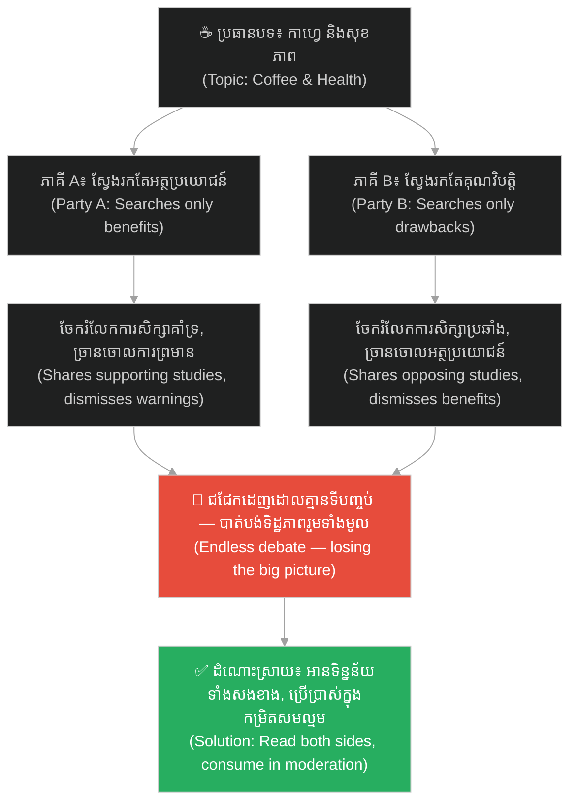
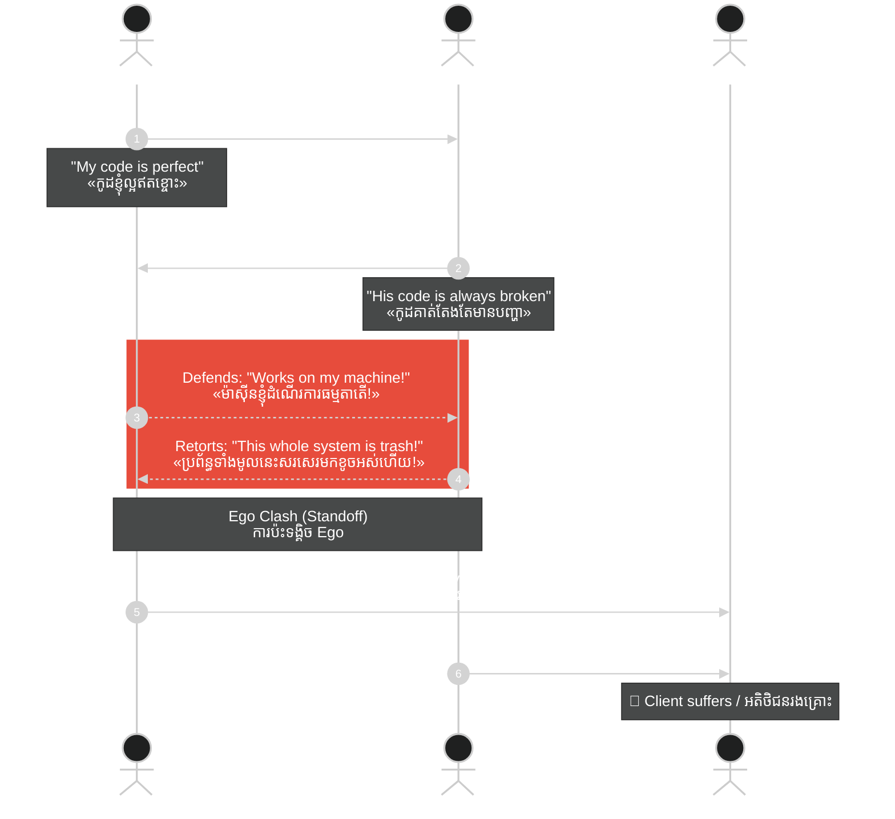
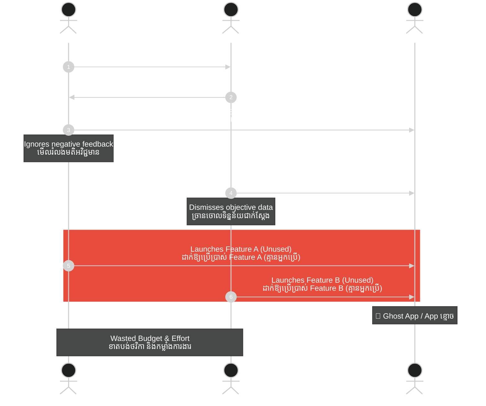
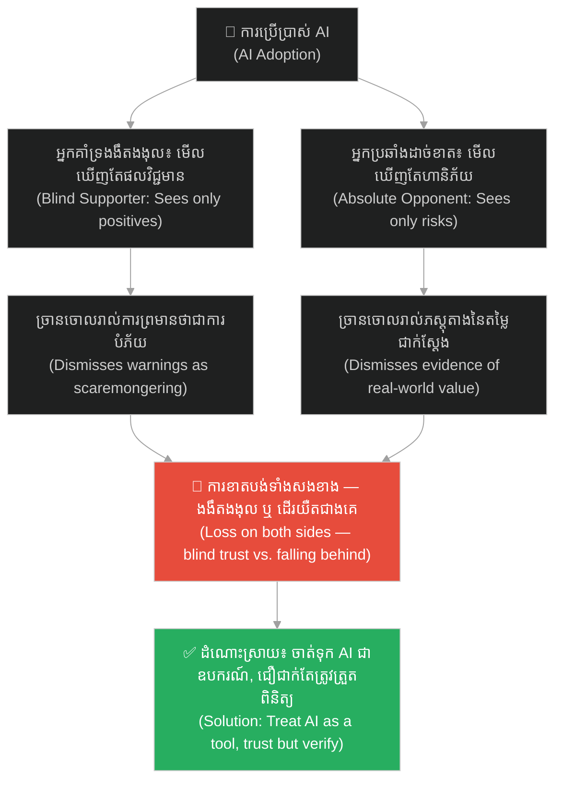
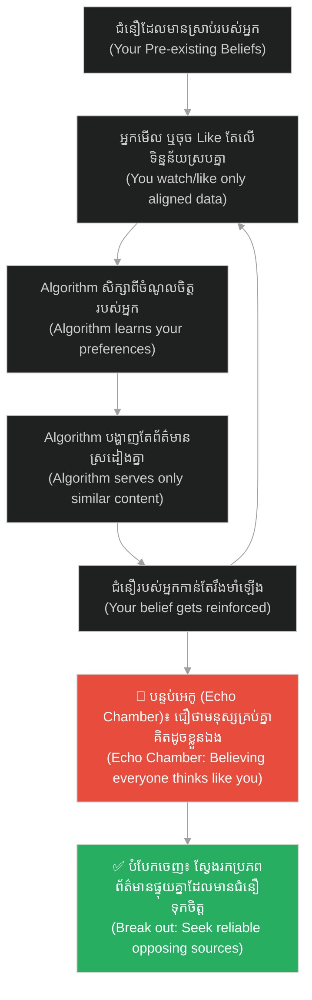
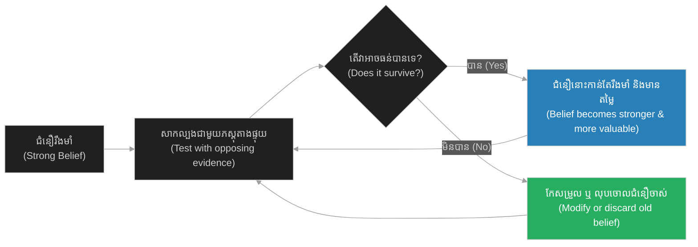

# Confirmation Bias (ការលំអៀងបញ្ជាក់អំណះអំណាង)៖ អន្ទាក់ចិត្តដែលបង្ខំយើងឱ្យស្តាប់តែអ្វីដែលយើងចង់ឮ (Confirmation Bias: The Mental Trap That Forces Us to Hear Only What We Want to Hear)

**Author:** ichamrong  
**Date:** 2026-05-16  
**Tags:** #confirmation-bias #cognitive-bias #critical-thinking #psychology #mental-models  
**Category:** Concepts  
**Read Time:** ~15 min  

---

## 📌 មាតិកា (Table of Contents)
- [អន្ទាក់ផ្លូវចិត្ត (The Trap)](#អន្ទាក់ផ្លូវចិត្ត-the-trap)
- [១. បញ្ហា៖ មេធាវីការពារក្តីនៅក្នុងខួរក្បាលរបស់អ្នក (The Issue: The Lawyer Inside Your Head)](#១-បញ្ហា-មេធាវីការពារក្តីនៅក្នុងខួរក្បាលរបស់អ្នក-the-issue-the-lawyer-inside-your-head)
- [២. ឧទាហរណ៍ជាក់ស្តែងក្នុងពិភពពិត (Real World Examples)](#២-ឧទាហរណ៍ជាក់ស្តែងក្នុងពិភពពិត)
  - [ឧទាហរណ៍ទី ១ — កម្រិតស្រាល៖ ជម្លោះរឿងកាហ្វេ (The Coffee Debate)](#ឧទាហរណ៍ទី-១--កម្រិតស្រាល-ជម្លោះរឿងកាហ្វេ-the-coffee-debate)
  - [ឧទាហរណ៍ទី ២ — កម្រិតមធ្យម (បច្ចេកទេស)៖ ជម្លោះរវាង Developer និង QA (The Dev vs. QA Standoff)](#ឧទាហរណ៍ទី-២--កម្រិតមធ្យម-បច្ចេកទេស-ជម្លោះរវាង-developer-និង-qa-the-dev-vs-qa-standoff)
  - [ឧទាហរណ៍ទី ៣ — កម្រិតមធ្យម (ធុរកិច្ច)៖ Product Owner ទល់នឹង អតិថិជន (Product Owner vs. Client)](#ឧទាហរណ៍ទី-៣--កម្រិតមធ្យម-ធុរកិច្ច-product-owner-ទល់នឹង-អតិថិជន-product-owner-vs-client)
  - [ឧទាហរណ៍ទី ៤ — កម្រិតមធ្យម (សង្គម)៖ ការជជែកដេញដោលរឿង AI (The AI Debate)](#ឧទាហរណ៍ទី-៤--កម្រិតមធ្យម-សង្គម-ការជជែកដេញដោលរឿង-ai-the-ai-debate)
  - [ឧទាហរណ៍ទី ៥ — កម្រិតធ្ងន់៖ ជំនឿ និងសាសនា (Faith and Religion)](#ឧទាហរណ៍ទី-៥--កម្រិតធ្ងន់-ជំនឿ-និងសាសនា-faith-and-religion)
- [៣. កត្តាជម្រុញ៖ បន្ទប់អេកូក្នុងយុគសម័យឌីជីថល (The Aggravator: Echo Chambers in the Digital Age)](#៣-កត្តាជម្រុញ-បន្ទប់អេកូក្នុងយុគសម័យឌីជីថល-the-aggravator-echo-chambers-in-the-digital-age)
- [៤. ដំណោះស្រាយទូទៅ (The General Solution)](#៤-ដំណោះស្រាយទូទៅ-the-general-solution)
  - [ស្វែងរកភស្តុតាងបដិសេធ (Seek Disconfirmation)](#ស្វែងរកភស្តុតាងបដិសេធ-seek-disconfirmation)
  - [ស្វែងរកប្រភពព័ត៌មានចម្រុះ (Diversify Your Sources)](#ស្វែងរកប្រភពព័ត៌មានចម្រុះ-diversify-your-sources)
  - [ចាត់ទុកជំនឿរបស់អ្នកជាសម្មតិកម្ម មិនមែនជាការពិតដាច់ខាត (Treat Your Beliefs as Hypotheses)](#ចាត់ទុកជំនឿរបស់អ្នកជាសម្មតិកម្ម-មិនមែនជាការពិតដាច់ខាត-treat-your-beliefs-as-hypotheses)
- [សេចក្តីសន្និដ្ឋាន (Conclusion)](#សេចក្តីសន្និដ្ឋាន-conclusion)
- [ឯកសារយោង (References)](#ឯកសារយោង-references)
- [Related Posts](#related-posts)

---

## អន្ទាក់ផ្លូវចិត្ត (The Trap)

តើអ្នកធ្លាប់ឆ្ងល់ទេថា ហេតុអ្វីបានជាមនុស្សពីរនាក់ អាចមើលទៅលើព័ត៌មាន ឬការពិតតែមួយដូចគ្នា បែរជាអាចទាញសេចក្តីសន្និដ្ឋានផ្ទុយគ្នាស្រឡះ និងចាកចេញទៅវិញដោយជំនឿរៀង ៗ ខ្លួនកាន់តែខ្លាំង?

Have you ever wondered why two people can look at the exact same information or facts, yet draw completely opposite conclusions and walk away even more convinced of their own respective beliefs?

* អ្នកគាំទ្រ **បក្ស A** យល់ថាវាជា **«ភស្តុតាងដែលបញ្ជាក់ថា បក្ស A ត្រឹមត្រូវ»**។
* អ្នកគាំទ្រ **បក្ស B** យល់ថាវាជា **«ព័ត៌មានលំអៀង និងមិនពិត»**។

* A supporter of **Party A** sees it as **"proof that Party A is correct."**
* A supporter of **Party B** sees it as **"biased and fake news."**

នេះមិនមែនមកពីពួកគេល្ងង់នោះទេ។ ប៉ុន្តែវាគឺដោយសារតែខួរក្បាលរបស់ពួកគេ កំពុងតែដំណើរការកម្មវិធីមេរោគមួយហៅថា **Confirmation Bias (ការលំអៀងបញ្ជាក់អំណះអំណាង)**។

This is not because they are unintelligent. Rather, it is because their brains are running a malware program called **Confirmation Bias**.

ដើម្បីងាយស្រួលតាមដាន នេះជាផែនទីបង្ហាញផ្លូវសម្រាប់អត្ថបទនេះ៖
1. **បញ្ហា (The Issue)** — តើអ្វីទៅជា Confirmation Bias?
2. **ឧទាហរណ៍ជាក់ស្តែង (Real World Examples)** — តើវាជះឥទ្ធិពលលើជីវិត ការងារ និងសង្គមរបស់យើងយ៉ាងដូចម្តេច? (បង្ហាញពីទិដ្ឋភាពទាំងសងខាង ការពិតដ៏ជូរចត់ និងដំណោះស្រាយ)
3. **កត្តាជម្រុញ (The Aggravator)** — ហេតុអ្វីបានជាបញ្ហានេះកាន់តែធ្ងន់ធ្ងរក្នុងយុគសម័យឌីជីថល?
4. **ដំណោះស្រាយទូទៅ (The General Solution)** — តើយើងអាចគេចផុតពីអន្ទាក់ផ្លូវចិត្តនេះដោយរបៀបណា?

To make it easy to follow, here is the roadmap for this article:
1. **The Issue** — What is Confirmation Bias?
2. **Real World Examples** — How does it affect our lives, work, and society? (Examining both sides, the bitter truth, and solutions)
3. **The Aggravator** — Why is this problem worse in the digital age?
4. **The General Solution** — How can we escape this mental trap?

---

## ១. បញ្ហា៖ មេធាវីការពារក្តីនៅក្នុងខួរក្បាលរបស់អ្នក (The Issue: The Lawyer Inside Your Head)

**Confirmation Bias** គឺជាទំនោរចិត្តធម្មជាតិរបស់ខួរក្បាលមនុស្ស ក្នុងការ**ស្វែងរក បកស្រាយ និងចងចាំ**តែព័ត៌មានណាដែល**ស្របទៅនឹងជំនឿ ឬផ្នត់គំនិតដែលមានស្រាប់**របស់ខ្លួន ហើយច្រានចោល ឬមើលរំលងរាល់ព័ត៌មានដែលផ្ទុយពីជំនឿនោះ។

**Confirmation Bias** is the natural tendency of the human brain to **search for, interpret, and recall** information in a way that **confirms one's preexisting beliefs or hypotheses**, while ignoring or discarding any information that contradicts them.

និយាយឱ្យសាមញ្ញ៖

❌ យើង**មិនមែនជាអ្នកវិទ្យាសាស្ត្រ**ដែលស្វែងរកការពិតដោយគ្មានលំអៀងនោះឡើយ។

✅ នៅក្នុងការពិត យើងប្រៀបដូចជា**មេធាវីការពារក្តី** — ដែលប្រឹងប្រែងរកតែភស្តុតាង និងអំណះអំណាងមកការពារកូនក្តី (ជំនឿផ្ទាល់ខ្លួន) របស់ខ្លួនជានិច្ច ទោះបីជាដឹងខ្លួនឯងជ្រៅ ៗ ថាវាអាចខុសក៏ដោយ។

To put it simply:

❌ We are **not scientists** searching for unbiased truth.

✅ In reality, we are like **defense attorneys** — striving only to find evidence and arguments to protect our client (our personal beliefs), even when we know deep down that we might be wrong.

---

## ២. ឧទាហរណ៍ជាក់ស្តែងក្នុងពិភពពិត (Real World Examples)

ដើម្បីយល់ច្បាស់ពីលំអៀងផ្លូវចិត្តនេះ យើងនឹងនាំអ្នកទៅពិនិត្យមើល **ឧទាហរណ៍ចំនួន ៥ កម្រិតខុស ៗ គ្នា**៖

To clearly understand this cognitive bias, we will explore **five examples across different levels**:

---

### ឧទាហរណ៍ទី ១ — កម្រិតស្រាល៖ ជម្លោះរឿងកាហ្វេ (The Coffee Debate)

**ស្ថានភាព៖** មិត្តភក្តិពីរនាក់ជជែកវែកញែកគ្នាពីរឿងផឹកកាហ្វេ។

**Scenario:** Two friends are debating the effects of drinking coffee.

* **ភាគី A (អ្នកញៀនកាហ្វេ)៖** ស្វែងរកតែពាក្យគន្លឹះនៅលើ Google ថា *«អត្ថប្រយោជន៍នៃការផឹកកាហ្វេ»*។ ពេលឃើញអត្ថបទដែលនិយាយថាកាហ្វេជួយការពារបេះដូង ពួកគេចែករំលែកវាភ្លាម ៗ ។ តែពេលឃើញការព្រមានពីការរំខានដល់ដំណេក ពួកគេច្រានចោលថា៖ *«ការស្រាវជ្រាវនេះមិនត្រឹមត្រូវទេ»*។
* **ភាគី B (អ្នកស្រឡាញ់សុខភាពធម្មជាតិ)៖** ស្វែងរកតែពាក្យ *«គ្រោះថ្នាក់ និងផលប៉ះពាល់នៃកាហ្វេ»*។ ពេលឃើញអត្ថបទនិយាយពីការបង្កការថប់បារម្ភ (Anxiety) ពួកគេយកទៅបង្ហាញភាគី A ភ្លាម។ តែពេលឃើញការសិក្សាពីអត្ថប្រយោជន៍កាហ្វេ ពួកគេច្រានចោលថា៖ *«នេះប្រហែលជាក្រុមហ៊ុនកាហ្វេជួលឱ្យសរសេរហើយ»*។

* **Party A (The Coffee Enthusiast):** Searches Google only for keywords like *"benefits of drinking coffee"*. When they see an article saying coffee protects the heart, they share it instantly. But when they see warnings about sleep disruption, they dismiss it: *"This research is flawed."*
* **Party B (The Natural Health Advocate):** Searches only for *"dangers and side effects of coffee"*. When they see an article about coffee causing anxiety, they show it to Party A immediately. But when they see studies on coffee's benefits, they dismiss it: *"This was probably funded by the coffee industry."*

**ការពិតដ៏ជូរចត់៖**
អ្នកទាំងពីរឈ្លោះគ្នាមិនចេះចប់ ពីព្រោះម្នាក់ ៗ អានតែអ្វីដែលគាំទ្រគំនិតខ្លួនឯង។ ការពិតគឺ **កាហ្វេមានទាំងអត្ថប្រយោជន៍ និងគុណវិបត្តិ** ហើយផលប៉ះពាល់គឺអាស្រ័យលើបរិមាណ និងស្ថានភាពសុខភាពបុគ្គលម្នាក់ ៗ ។

**The Bitter Truth:**
The two argue endlessly because each only reads what supports their own view. The reality is that **coffee has both benefits and drawbacks**, and its effects depend on the dosage and the individual's health condition.



**ដំណោះស្រាយ៖**
ត្រូវមានភាពក្លាហានក្នុងការវាយតម្លៃភស្តុតាងផ្ទុយ។ អ្នកចូលចិត្តកាហ្វេគួរអានពីគុណវិបត្តិ។ អ្នកប្រឆាំងគួរទទួលស្គាល់អត្ថប្រយោជន៍។ ថ្លឹងថ្លែងទិន្នន័យទាំងសងខាង និងប្រើប្រាស់ក្នុងកម្រិតសមល្មម។

**Solution:**
Have the courage to evaluate opposing evidence. Coffee lovers should read about the drawbacks. Opponents should acknowledge the benefits. Weigh the data from both sides and consume in moderation.

---

### ឧទាហរណ៍ទី ២ — កម្រិតមធ្យម (បច្ចេកទេស)៖ ជម្លោះរវាង Developer និង QA (The Dev vs. QA Standoff)

**ស្ថានភាព៖** ទំនាស់ការងាររវាងអ្នកសរសេរកូដ (Developer) និងអ្នកតេស្តប្រព័ន្ធ (QA Tester)។

**Scenario:** A workplace conflict between a developer (coder) and a quality assurance tester.

* **ភាគី A (Developer)៖** ជឿជាក់យ៉ាងមុតមាំថាកូដរបស់ខ្លួនល្អឥតខ្ចោះ ពួកគេតេស្តតែលើផ្លូវរលូន (Happy Path) ប៉ុណ្ណោះ។ ពេល QA រកឃើញ Bug ពួកគេតែងតែការពារខ្លួនថា៖ *«វាដំណើរការធម្មតាតើនៅលើម៉ាស៊ីនខ្ញុំ! ប្រហែលជា User ប្រើប្រាស់មិនត្រូវបច្ចេកទេសខ្លួនឯងទេ!»*
* **ភាគី B (QA Tester)៖** មានផ្នត់គំនិតជាមុនថា កូដរបស់ Developer ម្នាក់នេះតែងតែមានបញ្ហា និងធូររលុង។ ពេលឃើញ Bug តូចមួយ ពួកគេទាញសេចក្តីសន្និដ្ឋានភ្លាមថា៖ *«ប្រព័ន្ធទាំងមូលនេះសរសេរមកខូចអស់ហើយ កូដធូររលុងណាស់»* ដោយមិនបានសិក្សាពី Root Cause ឬលក្ខខណ្ឌកំណត់របស់ Server ឡើយ។

* **Party A (Developer):** Firmly believes their code is perfect, testing it only on the "Happy Path". When QA finds a bug, they immediately defend themselves: *"It works fine on my machine! Maybe the user just doesn't know how to use it!"*
* **Party B (QA Tester):** Has a preconceived notion that this developer's code is always buggy and poorly written. Upon seeing a minor bug, they instantly conclude: *"This entire system is broken, the code is extremely sloppy,"* without investigating the root cause or server limitations.

**ការពិតដ៏ជូរចត់៖**
Developer ព្យាយាមការពារ និងប្រកាន់ខ្ជាប់នូវអត្មា (Ego) របស់ខ្លួន។ ចំណែក QA ក៏ផ្តោតតែលើការស្វែងរកកំហុសដើម្បីបញ្ជាក់ថាការគិតរបស់ខ្លួនត្រឹមត្រូវ។ លទ្ធផល៖ ការងារត្រូវកកស្ទះ ទំនាក់ទំនងសហការត្រូវដាច់រហែក ហើយ**អតិថិជនជាអ្នករងគ្រោះ**ព្រោះផលិតផលចេញយឺតយ៉ាវ និងមានបញ្ហា។

**The Bitter Truth:**
The developer focuses on protecting their ego, while the QA tester only focuses on finding faults to prove themselves right. The result: work gets congested, collaboration falls apart, and **the client suffers** because product delivery is delayed and buggy.



**ដំណោះស្រាយ៖**
ប្តូរផ្នត់គំនិតពី «សត្រូវ» មកជា «ដៃគូសហការ»។ Developer ត្រូវចាត់ទុក QA ជាសំណាញ់សុវត្ថិភាពដែលជួយការពារមិនឱ្យ Bug ធ្លាក់ដល់ដៃ User និងលុបចោលលេស *«ម៉ាស៊ីនខ្ញុំដំណើរការធម្មតា»*។ ចំណែក QA គួរផ្តល់ Feedback ដោយផ្តោតលើ**បញ្ហា** មិនមែនលើ**បុគ្គល**ឡើយ។

**Solution:**
Shift the mindset from "enemies" to "collaborative partners". Developers must view QA as a safety net that prevents bugs from reaching the user, discarding the *"works on my machine"* excuse. QA should provide feedback focused on the **issue**, not the **person**.

---

### ឧទាហរណ៍ទី ៣ — កម្រិតមធ្យម (ធុរកិច្ច)៖ Product Owner ទល់នឹង អតិថិជន (Product Owner vs. Client)

**ស្ថានភាព៖** ការមិនចុះសម្រុងគ្នាក្នុងការជ្រើសរើស Feature ណាដែលត្រូវអភិវឌ្ឍបន្តក្នុង App។

**Scenario:** Disagreement over which feature to develop next in an application.

* **ភាគី A (Product Owner)៖** ស្រឡាញ់ Feature A ខ្លាំង ព្រោះតែចំណូលចិត្តបច្ចេកវិទ្យាផ្ទាល់ខ្លួន។ ពួកគេកត់ត្រាទុកតែរាល់មតិសរសើររបស់ User ចំពោះ Feature នេះ។ ចំពោះ User ៨០% ទៀតដែលរអ៊ូថាវាស្មុគស្មាញ និងពិបាកប្រើ? PO គិតថា៖ *«ពួកគេមិនទាន់ស៊ាំនឹងបច្ចេកវិទ្យាថ្មីនេះប៉ុណ្ណោះ»*។
* **ភាគី B (Client / ម្ចាស់អាជីវកម្ម)៖** ចង់បាន Feature B ដើម្បីដណ្តើមទីផ្សារជាមួយគូប្រជែង។ ពួកគេប្រមូលតែអត្ថបទណាដែលនិយាយគាំទ្រ Feature នេះ។ ពេលប្រព័ន្ធបង្ហាញទិន្នន័យជាក់ស្តែងថា Target Users មិនត្រូវការវាទាល់តែសោះ ពួកគេច្រានចោលទិន្នន័យនោះភ្លាម៖ *«ក្រុមការងារគ្រាន់តែខ្ជិល និងចង់ដោះសារមិនចង់ធ្វើប៉ុណ្ណោះ»*។

* **Party A (Product Owner):** Loves Feature A due to a personal technology preference. They only keep track of positive user feedback about this feature. As for the other 80% of users complaining that it is complex and hard to use? The PO thinks: *"They are just not used to this new technology yet."*
* **Party B (Client / Business Owner):** Wants Feature B to compete with rivals. They only gather articles supporting this feature. When the analytics system shows real data that target users do not need it at all, they instantly dismiss the data: *"The team is just lazy and making excuses because they don't want to build it."*

**ការពិតដ៏ជូរចត់៖**
គ្មានភាគីណាម្នាក់ស្តាប់**អ្នកប្រើប្រាស់ពិតប្រាកដ (End Users)** ឡើយ។ PO កំពុងដេញតាមក្តីស្រមៃបច្ចេកវិទ្យា ចំណែក Client កំពុងរត់តាមគូប្រជែង។ ផលិតផលចុងក្រោយនឹងក្លាយជា **App ខ្មោច (Ghost App)** — ខាតបង់ថវិការាប់ម៉ឺនដុល្លារក្នុងការបង្កើតអ្វីដែលគ្មាននរណាម្នាក់ត្រូវការ គ្រាន់តែដើម្បីបញ្ជាក់ថា *«គំនិតខ្ញុំត្រឹមត្រូវ»*។

**The Bitter Truth:**
Neither party is listening to the **actual end users**. The PO is chasing a tech fantasy, while the client is blindly running after competitors. The final product will become a **Ghost App** — wasting tens of thousands of dollars building something nobody wants, just to prove *"my idea is right."*



**ដំណោះស្រាយ៖**
ទុក Ego ចោលនៅមាត់ទ្វារ ហើយយក**ទិន្នន័យជាអាជ្ញាកណ្តាល**។ ធ្វើ A/B Testing ជាក់ស្តែង។ ប្រសិនបើតួលេខបង្ហាញថា User មិនត្រូវការ ត្រូវមានភាពក្លាហានក្នុងការ**លះបង់គំនិតដែលខ្លួនស្រឡាញ់ចោល (Kill Your Darling)** ទោះបីជាវាជា Feature ដែលអ្នកពេញចិត្តបំផុតក៏ដោយ។

**Solution:**
Leave your ego at the door and let **data be the arbiter**. Perform actual A/B testing. If the numbers show that users do not want it, have the courage to **kill your darling** — even if it's the feature you love the most.

---

### ឧទាហរណ៍ទី ៤ — កម្រិតមធ្យម (សង្គម)៖ ការជជែកដេញដោលរឿង AI (The AI Debate)

**ស្ថានភាព៖** ទស្សនៈផ្ទុយគ្នាចំពោះការកើនឡើងនៃឧបករណ៍ AI ដូចជា ChatGPT។

**Scenario:** Conflicting perspectives on the rise of AI tools like ChatGPT.

* **ភាគី A (អ្នកគាំទ្រ AI ងងឹតងងុល)៖** មើលឃើញតែអត្ថប្រយោជន៍។ ពេលឃើញការព្រមានថាការប្រើប្រាស់ AI នាំឱ្យបាត់បង់ការគិតបែបស៊ីជម្រៅ (Critical Thinking) ពួកគេច្រានចោលភ្លាម៖ *«មនុស្សទាំងនេះគ្រាន់តែជាមនុស្សជំនាន់ចាស់ដែលខ្លាចការផ្លាស់ប្តូរ និងការរីកចម្រើនប៉ុណ្ណោះ»*។
* **ភាគី B (អ្នកប្រឆាំង AI ដាច់ខាត)៖** ជឿជាក់ថា AI បង្កើតឡើងដើម្បីបំផ្លាញការងារមនុស្ស។ ពួកគេប្រមូលតែភស្តុតាងដែល AI ឆ្លើយខុស ឬផ្តល់ព័ត៌មានលំអៀង។ ពេលឃើញព័ត៌មានថា AI ជួយវិភាគរកឃើញជំងឺមហារីកមុនគ្រូពេទ្យ ពួកគេច្រានចោលថា៖ *«វាមិនត្រឹមត្រូវ ១០០% ទេ ដូច្នេះវាគ្រោះថ្នាក់ខ្លាំងណាស់»* ហើយសុខចិត្តធ្វើការងារដោយដៃយឺត ៗ ដដែល ជំនួសឱ្យការរៀនសូត្រពីឧបករណ៍ថ្មី។

* **Party A (Blind AI Supporter):** Sees only the positive benefits. When warned that over-reliance on AI leads to a decline in critical thinking, they dismiss it immediately: *"These people are just old-fashioned folks who fear change and progress."*
* **Party B (Absolute AI Opponent):** Believes AI is built to destroy human jobs. They gather only evidence where AI makes mistakes or outputs biased information. When seeing news that AI helps detect cancer earlier than doctors, they dismiss it: *"It is not 100% accurate, so it's extremely dangerous,"* choosing to perform tasks manually and slowly rather than learning the new tool.

**ការពិតដ៏ជូរចត់៖**
ទស្សនៈជ្រុលនិយមទាំងពីរ សុទ្ធតែនាំមកនូវការខាតបង់។ អ្នកគាំទ្រងងឹតងងុលនឹងក្លាយជាជនរងគ្រោះនៃការជឿជាក់ហួសហេតុ ពេល AI ឆ្លើយប្រឌិតព័ត៌មានខុស (AI Hallucination)។ ចំណែកអ្នកប្រឆាំងដាច់ខាតនឹងត្រូវបន្សល់ទុកនៅខាងក្រោយ ខណៈពេលដែលពិភពលោកកំពុងបោះជំហានទៅមុខយ៉ាងលឿន។

**The Bitter Truth:**
Both extreme perspectives lead to loss. Blind supporters fall victim to overconfidence when AI hallucinating answers. Absolute opponents are left behind while the rest of the world advances rapidly.



**ដំណោះស្រាយ៖**
ចាត់ទុក AI ឱ្យត្រូវតាមលក្ខខណ្ឌពិត៖ **វាជាឧបករណ៍ មិនមែនជាអាទិទេព ឬជាបិសាចឡើយ**។ អនុវត្តគោលការណ៍ **«ជឿជាក់ ប៉ុន្តែត្រូវត្រួតពិនិត្យជានិច្ច» (Trust, but Verify)**។ ប្រើប្រាស់វាដើម្បីសន្សំពេលវេលា ប៉ុន្តែត្រូវរក្សាការសម្រេចចិត្តចុងក្រោយនៅលើខួរក្បាលមនុស្សជានិច្ច។

**Solution:**
Treat AI for what it truly is: **a tool, not a deity or a demon**. Practice the principle of **"Trust, but Verify"**. Use it to save time, but keep the final decision-making power in the human mind.

---

### ឧទាហរណ៍ទី ៥ — កម្រិតធ្ងន់៖ ជំនឿ និងសាសនា (Faith and Religion)

**ស្ថានភាព៖** ការវាយតម្លៃ និងការរើសអើងគ្នារវាងអ្នកកាន់សាសនាផ្សេង ៗ គ្នា។

**Scenario:** Mutual judgment and prejudice between followers of different religions.

* **ភាគី A (គ្រិស្តបរិស័ទម្នាក់)៖** ឃើញយុវជនរាំលេងក្នុងពិធីបុណ្យសពរបស់ពុទ្ធសាសនិក ហើយសន្និដ្ឋានភ្លាម ៗ ថា៖ *«ពុទ្ធសាសនាមិនបង្រៀនឱ្យមនុស្សមានសីលធម៌ និងការគោរពសេចក្តីស្លាប់ឡើយ»*។ ពេលគាត់អានឃើញថាអ្នកវិទ្យាសាស្ត្រល្បី ៗ នៅអឺរ៉ុបភាគច្រើនជាគ្រិស្តបរិស័ទ គាត់ក៏ចាត់ទុកវាជាភស្តុតាងបញ្ជាក់ថា៖ *«ឃើញទេ មនុស្សឆ្លាត ៗ ជឿលើព្រះ ដូច្នេះជំនឿរបស់ខ្ញុំគឺត្រឹមត្រូវពិតប្រាកដ»* ដោយមិនបានគិតពីបរិបទវប្បធម៌ និងប្រវត្តិសាស្ត្រនាសម័យនោះឡើយ។
* **ភាគី B (ពុទ្ធសាសនិកម្នាក់)៖** ឃើញគ្រិស្តបរិស័ទមិនលុតជង្គង់សំពះរូបសំណាក ហើយសន្និដ្ឋានថា៖ *«សាសនាគ្រិស្តបង្រៀនកូនមិនឱ្យគោរពឪពុកម្តាយ និងបុព្វបុរសឡើយ»*។ ពេលឃើញគ្រូគង្វាលណាម្នាក់និយាយអ្វីដែលជ្រុលនិយម គាត់ក៏បិទទ្វារចិត្តចំពោះសាសនានោះជារៀងរហូត។ គាត់មើលរំលងសេចក្តីល្អដទៃទៀត ប៉ុន្តែបែរជាប្រឹងស្វែងរកសម្ដីរបស់ Einstein ដែលសរសើរពុទ្ធសាសនាយកមកធ្វើជាខែលការពារជំនឿខ្លួន។

* **Party A (A Christian):** Sees youngsters dancing at a Buddhist funeral and immediately concludes: *"Buddhism doesn't teach people morality and respect for the dead."* When they read that most famous European scientists historically were Christians, they take it as proof: *"See? Smart people believe in God, so my faith is correct,"* ignoring the historical and cultural context of those eras.
* **Party B (A Buddhist):** Sees Christians not kneeling down to bow to statues and concludes: *"Christianity teaches children not to respect parents and ancestors."* Upon seeing any extremist pastor on TV, they shut their minds to that religion forever. They overlook its other good deeds, but actively search for Einstein's quotes praising Buddhism to shield their own beliefs.

**ការពិតដ៏ជូរចត់៖**
ការវាយតម្លៃសាសនាមួយទាំងមូលដោយផ្អែកលើទង្វើរបស់បុគ្គលមួយចំនួន ឬពាក្យចចាមអារ៉ាម គឺជាអយុត្តិធម៌ដ៏ធំបំផុតដែលមនុស្សម្នាក់អាចប្រព្រឹត្ត។ សូមពិចារណា៖
* **ការរាំលេងក្នុងពិធីបុណ្យសព** — នៅក្នុងសហគមន៍ខ្លះ នេះជាបណ្តាំចុងក្រោយរបស់សាមីខ្លួនដែលចង់ឱ្យកូនចៅអបអរសាទរចំពោះជីវិតដែលបានរស់នៅយ៉ាងមានន័យ មិនមែនមកយំសោកសៅឡើយ។
* **«ការមិនគោរពឪពុកម្តាយ»** — នេះជាការយល់ខុសទាំងស្រុង។ គម្ពីរគ្រិស្តសាសនាបង្គាប់ឱ្យកូនគោរពនិងដឹងគុណឪពុកម្តាយយ៉ាងម៉ត់ចត់បំផុត។ ចំណែកការមិនសំពះរូបសំណាក គឺជាគោលការណ៍ជំនឿដែលមិនថ្វាយបង្គំរូបព្រះដែលធ្វើឡើងដោយដៃមនុស្ស — មិនមែនជាការមិនគោរពឪពុកម្តាយឡើយ។
* សាសនាទាំងពីរ នៅស្នូលពិតប្រាកដ សុទ្ធតែបង្រៀនមនុស្សឱ្យ**ធ្វើអំពើល្អ មានសេចក្តីមេត្តាករុណា និងរស់នៅដោយសុចរិតភាព**។

Confirmation Bias បានសាងសង់ជញ្ជាំងនៃការស្អប់ខ្ពើមចេញពីព័ត៌មានដែលមិនគ្រប់ជ្រុងជ្រោយ។

**The Bitter Truth:**
Judging an entire religion based on the actions of a few individuals or hearsay is one of the greatest injustices a person can commit. Consider:
* **Dancing at a funeral:** In some communities, this is the deceased's final wish — wanting loved ones to celebrate a life well-lived, rather than cry and mourn.
* **"Not respecting parents":** This is a complete misunderstanding. The Christian Bible commands children to honor their parents in the strongest terms. The refusal to bow to statues is a theological principle of not worshipping man-made idols — it is not a lack of respect for parents.
* At their true core, both religions teach people to **do good, have compassion, and live with integrity**.

Confirmation Bias builds walls of hatred out of incomplete information.

```mermaid
%%{init: {
  'theme': 'dark',
  'themeVariables': {
    'background': '#1e1e1e',
    'primaryTextColor': '#ffffff',
    'lineColor': '#a0a0a0'
  },
  'themeCSS': 'svg { background-color: #1e1e1e !important; padding: 1rem !important; border-radius: 8px !important; } .edgeLabel rect { fill: #1e1e1e !important; } text, tspan { fill: #ffffff !important; }'
}}%%
graph TD
    A["🕊️ សាសនាខុសគ្នា នៅក្នុងពិភពលោកតែមួយ<br/>(Different Religions in One World)"] --> B["ភាគី A៖ វាយតម្លៃពុទ្ធសាសនាតាមរយៈទម្លាប់បុណ្យសពមួយ<br/>(Party A: Judges Buddhism by one funeral custom)"]
    A --> C["ភាគី B៖ វាយតម្លៃគ្រិស្តសាសនាតាមពាក្យចចាមអារ៉ាម<br/>(Party B: Judges Christianity by rumors)"]
    B --> D["'ពុទ្ធសាសនា គ្មានសីលធម៌'<br/>(\"Buddhism lacks morality\")"]
    C --> E["'គ្រិស្តបរិស័ទ មិនគោរពឪពុកម្តាយ'<br/>(\"Christians disrespect parents\")"]
    D --> F["🔴 ជញ្ជាំងនៃការរើសអើង — សង់ឡើងពីព័ត៌មានមិនគ្រប់ជ្រុងជ្រោយ<br/>(Walls of prejudice built from incomplete data)"]
    E --> F
    F --> G["✅ ដំណោះស្រាយ៖ សិក្សាពីប្រភពដើមផ្ទាល់ និងស្តាប់ដោយចិត្តទូលាយ<br/>(Solution: Study directly from sources, listen open-mindedly)"]

    style F fill:#e74c3c,color:#fff
    style G fill:#27ae60,color:#fff
```

**ដំណោះស្រាយ៖**
មុននឹងវាយតម្លៃជំនឿរបស់អ្នកដទៃ កុំពឹងផ្អែកលើពាក្យចចាមអារ៉ាម។ ចូលទៅសាកសួរ និងជជែកជាមួយអ្នកកាន់ជំនឿនោះដោយ**ចិត្តបើកចំហពិតប្រាកដ** ឬអានសៀវភៅផ្លូវការរបស់ពួកគេ។ ការយល់ដឹងពីមូលហេតុដែលពួកគេជឿ មិនមែនមានន័យថាយើងត្រូវតែយល់ស្របជាមួយពួកគេនោះទេ — វាហៅថាការផ្តល់សេចក្តីថ្លៃថ្នូរជាមនុស្សឱ្យគ្នាទៅវិញទៅមក។

**Solution:**
Before judging others' beliefs, don't rely on hearsay. Reach out and talk to the practitioners of that faith with a **genuinely open mind**, or read their official texts. Understanding why they believe does not mean you have to agree with them — it is simply affording mutual human dignity.

---

## ៣. កត្តាជម្រុញ៖ បន្ទប់អេកូក្នុងយុគសម័យឌីជីថល (The Aggravator: Echo Chambers in the Digital Age)

Confirmation Bias មានតាំងពីដើមកំណើតនៃគំនិតរបស់មនុស្សមកម៉្លេះ។ ប៉ុន្តែវាបានក្លាយជាគ្រោះថ្នាក់ខ្លាំងឡើងទ្វេដង ដោយសារតែប្រព័ន្ធក្បួនដោះស្រាយ (Algorithms) ដែលដំណើរការលើ Facebook, TikTok និង YouTube។

Confirmation Bias has existed since the dawn of human thought. However, it has become twice as dangerous due to the algorithmic systems running on Facebook, TikTok, and YouTube.

**របៀបដែលក្បួនដោះស្រាយដំណើរការ៖**
គោលដៅរបស់វាគឺសាមញ្ញបំផុត — ធ្វើយ៉ាងណាឱ្យអ្នកស្ថិតនៅក្នុង App របស់វាឱ្យបានយូរបំផុត។ ដូច្នេះ វានឹងជ្រើសរើសបង្ហាញតែអ្វីដែលអ្នកធ្លាប់ចុច Like ធ្លាប់យល់ស្រប ឬធ្លាប់ទស្សនាប៉ុណ្ណោះ។

**How Algorithms Work:**
Their goal is simple — keep you on their app for as long as possible. Thus, they selectively feed you content that you have previously liked, agreed with, or watched.

**លទ្ធផល — បន្ទប់អេកូ (The Echo Chamber)៖**
អ្នកនឹងត្រូវគេបង្ខាំងទុកនៅក្នុងបន្ទប់មួយ ដែលគ្រប់សំឡេងទាំងអស់សុទ្ធតែស្រែកគាំទ្រ និងយល់ស្របតាមជំនឿរបស់អ្នកជានិច្ច។ អ្នកចាប់ផ្តើមជឿជាក់ដោយស្មោះត្រង់ថា *«មនុស្សគ្រប់គ្នាក្នុងលោក សុទ្ធតែគិតដូចខ្ញុំ»* — តែការពិត វាគ្រាន់តែជាពពុះព័ត៌មាន (Filter Bubble) ដ៏តូចមួយដែលប្រព័ន្ធសាងសង់ជុំវិញខ្លួនអ្នកប៉ុណ្ណោះ។

**The Result — Echo Chambers:**
You end up confined in a room where every voice echoes your beliefs, agreeing with you constantly. You begin to honestly believe: *"Everyone in the world thinks like me."* In reality, it is just a tiny Filter Bubble the system built around you.

ប្រព័ន្ធក្បួនដោះស្រាយមិនខ្វល់ពីការរីកចម្រើនខាងបញ្ញា ឬភាពត្រឹមត្រូវនៃព័ត៌មានរបស់អ្នកឡើយ។ វាខ្វល់តែពីការទាក់ទាញការយកចិត្តទុកដាក់ (Attention) របស់អ្នកប៉ុណ្ណោះ។ ហើយ Confirmation Bias គឺជាឧបករណ៍ដ៏មានប្រសិទ្ធភាព និងគួរឱ្យទុកចិត្តបំផុតក្នុងការទាក់ទាញការចាប់អារម្មណ៍នោះ។

Algorithms do not care about your intellectual growth or the accuracy of your information. They only care about capturing your attention. And Confirmation Bias is the most reliable and effective tool to capture it.



---

## ៤. ដំណោះស្រាយទូទៅ (The General Solution)

ដើម្បីយកឈ្នះលើអន្ទាក់ផ្លូវចិត្តនេះ និងក្លាយជាមនុស្សដែលមានប្រាជ្ញាពិតប្រាកដ — មិនមែនគ្រាន់តែជាមនុស្សដែលមានជំនឿចិត្តខ្ពស់លើភាពល្ងង់ខ្លៅរបស់ខ្លួននោះឡើយ — អ្នកត្រូវតែធ្វើរឿងមួយចំនួនដែលធ្វើឱ្យខ្លួនឯងមានអារម្មណ៍មិនសូវស្រណុកចិត្ត៖

To overcome this cognitive trap and grow truly wise — rather than just being highly confident in your own ignorance — you must do things that make you feel slightly uncomfortable:

### ស្វែងរកភស្តុតាងបដិសេធ (Seek Disconfirmation)

❌ ឈប់សួរខ្លួនឯងថា៖ *«ហេតុអ្វីបានជាខ្ញុំត្រឹមត្រូវ?»*

✅ ចាប់ផ្តើមសួរថា៖ ***«តើខ្ញុំអាចខុសដោយរបៀបណា?»***

ស្វែងរកភស្តុតាង និងអំណះអំណាងដែលជំទាស់នឹងគំនិតរបស់អ្នកដោយសកម្ម។ ប្រសិនបើអ្នកមិនអាចស្វែងរកវាឃើញទេ មានន័យថាអ្នកប្រហែលជាមិនទាន់បានប្រឹងប្រែងរកវាឱ្យអស់ពីចិត្តឡើយ។

### Seek Disconfirmation

❌ Stop asking yourself: *"Why am I right?"*

✅ Start asking: ***"How could I be wrong?"***

Actively search for evidence and arguments that challenge your views. If you cannot find any, it means you probably haven't tried hard enough.

### ស្វែងរកប្រភពព័ត៌មានចម្រុះ (Diversify Your Sources)

ប្រសិនបើអ្នកមាននិន្នាការនយោបាយលំអៀងទៅខាងឆ្វេង គួរចំណាយពេលអានអំណះអំណាងស៊ីជម្រៅពីភាគីខាងស្តាំ — មិនមែនដើម្បីផ្លាស់ប្តូរជំនឿរបស់អ្នកឡើយ ប៉ុន្តែដើម្បីយល់ពីតក្កវិជ្ជានៅពីក្រោយការគិតរបស់ពួកគេ។ 

អ្នកមិនចាំបាច់ផ្លាស់ប្តូរគំនិតរបស់អ្នកនោះឡើយ។ ប៉ុន្តែអ្នកត្រូវតែដឹងពីអ្វីដែលភាគីម្ខាងទៀតគិតពិតប្រាកដ តាមរយៈសម្ដីពិតរបស់ពួកគេ មិនមែនតាមរយៈការបង្ខូចបង្កាច់ពីភាគីរបស់អ្នកឡើយ។

### Diversify Your Sources

If you lean politically to the left, spend time reading in-depth arguments from the right — not to change your beliefs, but to understand the logic behind their thinking.

You do not have to change your mind. But you must know what the other side actually thinks, through their own words, not through the caricature created by your own group.

### ចាត់ទុកជំនឿរបស់អ្នកជាសម្មតិកម្ម មិនមែនជាការពិតដាច់ខាត (Treat Your Beliefs as Hypotheses)

នៅក្នុងវិទ្យាសាស្ត្រ ទ្រឹស្តីមួយត្រូវបានចាត់ទុកថាមានតម្លៃ លុះត្រាតែវាបានឆ្លងកាត់ការសាកល្បងបំផ្លាញ និង**បដិសេធ (Disprove/Falsify)** រាប់ពាន់ដងទៅហើយនៅតែមិនអាចបំផ្លាញបាន។

អនុវត្តគោលការណ៍ដូចគ្នានេះចំពោះជំនឿរបស់អ្នក។ ចាត់ទុកពួកវាជា **សម្មតិកម្ម (Hypothesis)** — ដែលជាការប៉ាន់ស្មានដ៏ល្អបំផុតផ្អែកលើព័ត៌មានបច្ចុប្បន្ន និងត្រៀមខ្លួនជានិច្ចក្នុងការកែសម្រួលនៅពេលទទួលបានទិន្នន័យថ្មី — មិនមែនជាការពិតដាច់ខាតដែលប៉ះពាល់មិនបានឡើយ។

### Treat Your Beliefs as Hypotheses

In science, a theory is only considered valuable after it has undergone thousands of attempts to disprove or falsify it, yet still stands strong.

Apply the same principle to your beliefs. Treat them as **hypotheses** — the best estimations based on current data, always ready to be modified when new facts arrive — not as untouchable absolute truths.



---

## សេចក្តីសន្និដ្ឋាន (Conclusion)

> **«មនុស្សឆ្លាត មិនមែនជាមនុស្សដែលដឹងគ្រប់រឿងនោះទេ។ ប៉ុន្តែគឺជាមនុស្សដែលមានភាពក្លាហានគ្រប់គ្រាន់ក្នុងការទទួលស្គាល់ថាខ្លួនឯងអាចខុស — ហើយតែងតែត្រៀមខ្លួនជានិច្ចក្នុងការផ្លាស់ប្តូរគំនិត នៅពេលពួកគេជួបប្រទះនឹងភស្តុតាងថ្មីដែលច្បាស់លាស់ជាងមុន។»**
>
> **“A wise person is not one who knows everything, but one who has enough courage to admit that they might be wrong — and is always ready to change their mind when presented with clearer, new evidence.”**

ការការពារជំនឿចាស់របស់ខ្លួន ធ្វើឱ្យអ្នកមានអារម្មណ៍ល្អមួយភ្លែត។

ប៉ុន្តែការចោទសួរ និងការពិនិត្យមើលជំនឿចាស់របស់ខ្លួនឡើងវិញ ទើបជាអ្វីដែលធ្វើឱ្យអ្នកកាន់តែមានប្រាជ្ញាពិតប្រាកដ។

ភាពខុសគ្នារវាងផ្លូវទាំងពីរនេះ គឺត្រូវបានកំណត់ដោយ Confirmation Bias។

Defending your old beliefs makes you feel good for a moment.

But questioning and re-examining your old beliefs is what actually makes you wiser.

The choice between these two paths is determined by how you handle Confirmation Bias.

---

## 🐇 ធ្លាក់ចូលក្នុងរន្ធទន្សាយយុទ្ធសាស្ត្រ (Enter the Strategic Rabbit Hole)
ដើម្បីស្វែងយល់កាន់តែស៊ីជម្រៅអំពីការកម្ចាត់លំអៀងផ្លូវចិត្ត និងការប្រើប្រាស់វិធីសាស្ត្រវិភាគរកឫសគល់នៃបញ្ហា សូមចាប់ផ្តើមដំណើររុករករបស់អ្នកដោយចុចលើតំណភ្ជាប់ខាងក្រោម៖

To delve deeper into overcoming cognitive bias and utilizing root cause analysis, begin your exploration by clicking the link below:

* 🚀 **[ចាប់ផ្តើមដំណើររុករក (Start the Journey) ➔ The 5 Whys Technique](./02-five-whys-technique.md)**

---

## ឯកសារយោង (References)

* **Kahneman, D.** — *Thinking, Fast and Slow* (2011)។ សៀវភៅណែនាំដ៏ល្អបំផុតពីប្រព័ន្ធគិតទី ១ (គិតលឿន មានលំអៀងច្រើន) និងប្រព័ន្ធគិតទី ២ (គិតយឺត ហ្មត់ចត់) ព្រមទាំងការវិភាគស៊ីជម្រៅលើ Confirmation Bias។
* **Farnam Street (FS Blog)** — *Confirmation Bias and the Power of Disconfirming Evidence*។ ការវិភាគជាក់ស្តែងពីរបៀបដែលលំអៀងនេះជះឥទ្ធិពលលើការសម្រេចចិត្តប្រចាំថ្ងៃ។
* **Veritasium (YouTube)** — *The Math Equation That Tried to Stump the Internet*។ ការបង្ហាញជាក់ស្តែងដ៏អស្ចារ្យពីរបៀបដែលមនុស្សចូលចិត្តធ្វើតេស្តដើម្បី *បញ្ជាក់អំណះអំណាង* ជាងការធ្វើតេស្តដើម្បី *បដិសេធវា*។

* **Kahneman, D.** — *Thinking, Fast and Slow* (2011). The ultimate guide on System 1 thinking (fast, error-prone) and System 2 thinking (slow, deliberate), and a deep analysis of Confirmation Bias.
* **Farnam Street (FS Blog)** — *Confirmation Bias and the Power of Disconfirming Evidence*. Practical analysis on how this bias affects daily decision-making.
* **Veritasium (YouTube)** — *The Math Equation That Tried to Stump the Internet*. An excellent visual demonstration of how people seek to *confirm* their hypotheses rather than *disprove* them.

---

## Related Posts

* [The 5 Whys Technique៖ ឈប់ដោះស្រាយលើរោគសញ្ញា ចាប់ផ្តើមស្វែងរកឫសគល់នៃបញ្ហា](./02-five-whys-technique.md)
* [The Lost Axe and the Filter of Mind (ពូថៅដែលបាត់ និងអ័ព្ទនៃការសង្ស័យ)](../parables/13-the-lost-axe-and-the-filter-of-mind.md)

---

*Last updated: 2026-06-04*

## Related

- [💡 Concepts README](../README.md)
- [📚 Main Repository README](../../../README.md)
- [Developer Habits](../../developer-habits/README.md)
- [Mental Health & Well-being](../../mental-health/README.md)
- [Management & SDLC](../../management/README.md)
