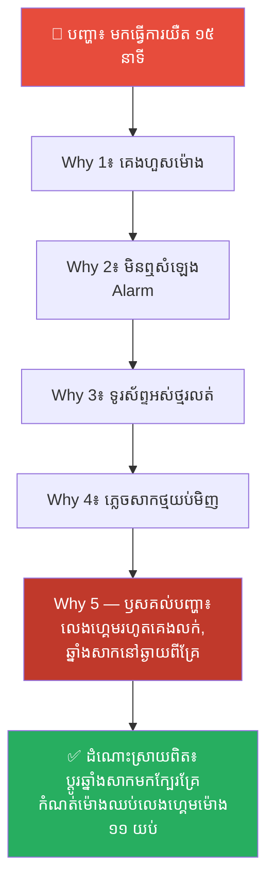
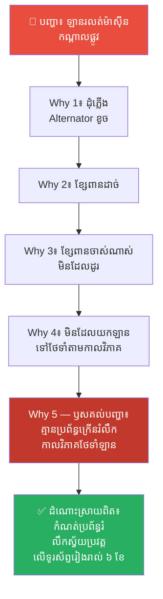
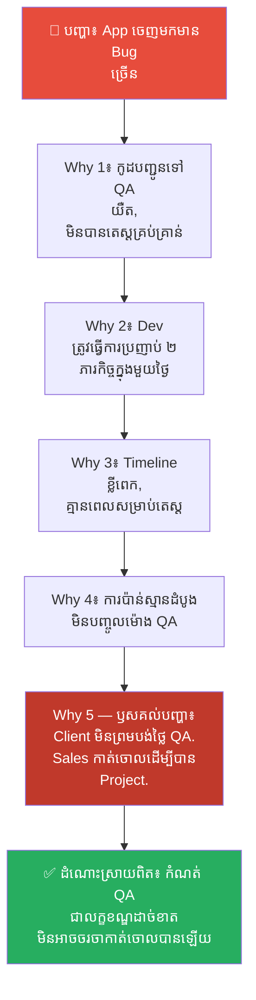
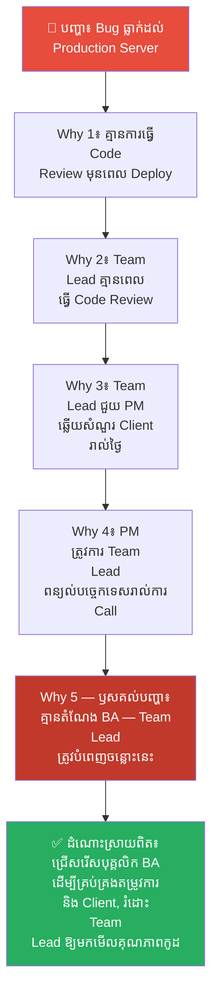
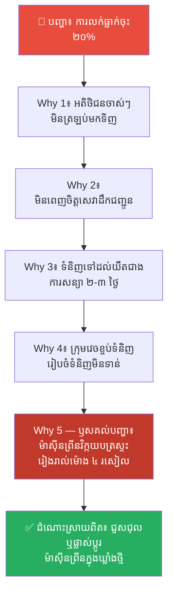
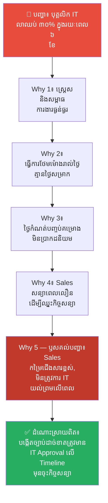
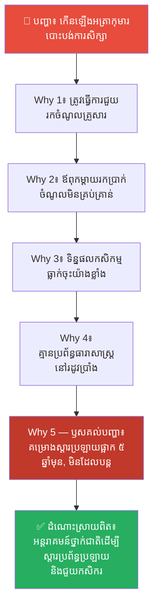
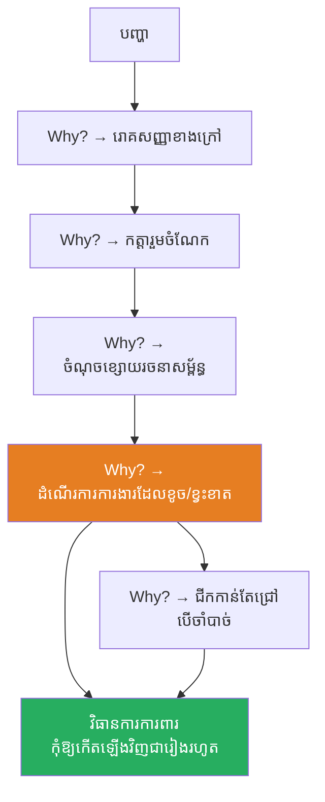

# The 5 Whys Technique (បច្ចេកទេសសួរ «ហេតុអ្វី» ៥ ដង)៖ ឈប់ដោះស្រាយលើរោគសញ្ញា ចាប់ផ្តើមស្វែងរកឫសគល់នៃបញ្ហា

**Author:** ichamrong  
**Date:** 2026-05-16  
**Tags:** #5-whys #root-cause-analysis #problem-solving #mental-models #lean #toyota  
**Category:** Concepts  
**Read Time:** ~14 min  

---

## 📌 មាតិកា (Table of Contents)
- [លំនាំបញ្ហា (The Pattern)](#លំនាំបញ្ហា-the-pattern)
- [១. បញ្ហា៖ ការកាត់ស្មៅដែលមិនធ្លាប់ដកឫស (The Issue: The Lawn Mower That Never Pulls the Roots)](#១-បញ្ហា-ការកាត់ស្មៅដែលមិនធ្លាប់ដកឫស-the-issue-the-lawn-mower-that-never-pulls-the-roots)
- [២. ឧទាហរណ៍ជាក់ស្តែងក្នុងពិភពពិត (Real World Examples)](#២-ឧទាហរណ៍ជាក់ស្តែងក្នុងពិភពពិត)
  - [ឧទាហរណ៍ទី ១ — កម្រិតស្រាល៖ ទៅធ្វើការយឺត (Late to Work)](#ឧទាហរណ៍ទី-១-កម្រិតស្រាល-ទៅធ្វើការយឺត-late-to-work)
  - [ឧទាហរណ៍ទី ២ — កម្រិតមធ្យម (បច្ចេកទេស)៖ ឡានខូចកណ្តាលផ្លូវ (Car Breaks Down)](#ឧទាហរណ៍ទី-២-កម្រិតមធ្យម-បច្ចេកទេស-ឡានខូចកណ្តាលផ្លូវ-car-breaks-down)
  - [ឧទាហរណ៍ទី ៣ — កម្រិតមធ្យម (បច្ចេកទេស)៖ App ចេញមកមាន Bug ច្រើន (App Shipped With Too Many Bugs)](#ឧទាហរណ៍ទី-៣-កម្រិតមធ្យម-បច្ចេកទេស-app-ចេញមកមាន-bug-ច្រើន-app-shipped-with-too-many-bugs)
  - [ឧទាហរណ៍ទី ៤ — កម្រិតមធ្យម (បច្ចេកទេស)៖ Bug ធ្លាក់ដល់ផលិតកម្មពិត (Bugs Reaching Production)](#ឧទាហរណ៍ទី-៤-កម្រិតមធ្យម-បច្ចេកទេស-bug-ធ្លាក់ដល់ផលិតកម្មពិត-bugs-reaching-production)
  - [ឧទាហរណ៍ទី ៥ — កម្រិតមធ្យម (ធុរកិច្ច)៖ ការធ្លាក់ចុះនៃការលក់ (Sales Drop)](#ឧទាហរណ៍ទី-៥-កម្រិតមធ្យម-ធុរកិច្ច-ការធ្លាក់ចុះនៃការលក់-sales-drop)
  - [ឧទាហរណ៍ទី ៦ — កម្រិតមធ្យម (ការគ្រប់គ្រង)៖ បុគ្គលិកលាឈប់ច្រើន (High Employee Turnover)](#ឧទាហរណ៍ទី-៦-កម្រិតមធ្យម-ការគ្រប់គ្រង-បុគ្គលិកលាឈប់ច្រើន-high-employee-turnover)
  - [ឧទាហរណ៍ទី ៧ — កម្រិតធ្ងន់៖ កុមារបោះបង់ការសិក្សា (Children Dropping Out of School)](#ឧទាហរណ៍ទី-៧-កម្រិតធ្ងន់-កុមារបោះបង់ការសិក្សា-children-dropping-out-of-school)
- [៣. កត្តាជម្រុញ៖ ភាពប្រញាប់ប្រញាល់ និងភាពខ្ជិលច្រអូសផ្នែកស្មារតី (The Aggravator: Speed and Mental Laziness)](#៣-កត្តាជម្រុញ-ភាពប្រញាប់ប្រញាល់-និងភាពខ្ជិលច្រអូសផ្នែកស្មារតី-the-aggravator-speed-and-mental-laziness)
- [៤. ដំណោះស្រាយទូទៅ៖ របៀបប្រើប្រាស់ 5 Whys ឱ្យត្រឹមត្រូវ (The General Solution: How to Use 5 Whys Correctly)](#៤-ដំណោះស្រាយទូទៅ-របៀបប្រើប្រាស់-5-whys-ឱ្យត្រឹមត្រូវ-the-general-solution-how-to-use-5-whys-correctly)
  - [សួររកបញ្ហានៅក្នុងប្រព័ន្ធ មិនមែនសួររកកំហុសបុគ្គល (Ask about process, not person)](#សួររកបញ្ហានៅក្នុងប្រព័ន្ធ-មិនមែនសួររកកំហុសបុគ្គល)
  - [ផ្អែកលើការពិតជាក់ស្តែង មិនមែនការស្មាន (Ground in facts, not guesses)](#ផ្អែកលើការពិតជាក់ស្តែង-មិនមែនការស្មាន)
  - [ដឹងពីចំណុចដែលត្រូវបញ្ឈប់ (Know when to stop)](#ដឹងពីចំណុចដែលត្រូវបញ្ឈប់)
- [សេចក្តីសន្និដ្ឋាន (Conclusion)](#សេចក្តីសន្និដ្ឋាន-conclusion)
- [ឯកសារយោង (References)](#ឯកសារយោង-references)
- [Related Posts](#related-posts)

---

## លំនាំបញ្ហា (The Pattern)

តើអ្នកធ្លាប់ដោះស្រាយបញ្ហាណាមួយរួចរាល់ហើយ — ស្រាប់តែវាត្រឡប់មកកើតឡើងវិញនៅខែក្រោយដែរឬទេ?

* ម៉ាស៊ីនខូច។ អ្នកជួសជុលវា។ ខែក្រោយ វាក៏ខូចម្តងទៀត។
* បុគ្គលិកខកខាន Deadline ជានិច្ច។ អ្នកព្រមាននិងស្តីបន្ទោសពួកគេ។ សប្តាហ៍ក្រោយ ពួកគេនៅតែខកខានដដែល។

នេះមិនមែនមានន័យថាអ្នកគ្មានសមត្ថភាពដោះស្រាយបញ្ហានោះទេ។ ប៉ុន្តែវាមានន័យថាអ្នកកំពុងដោះស្រាយខុសរឿង។ អ្នកកំពុងដោះស្រាយលើ **រោគសញ្ញា (Symptoms)** មិនមែន **ឫសគល់នៃបញ្ហា (Root Cause)** ឡើយ។

ផែនទីបង្ហាញផ្លូវសម្រាប់អត្ថបទនេះ៖
1. **បញ្ហា (The Issue)** — តើការដោះស្រាយត្រឹមតែផ្ទៃក្រៅមានន័យដូចម្តេច? តើបច្ចេកទេស 5 Whys គឺជាអ្វី?
2. **ឧទាហរណ៍ជាក់ស្តែង (Real World Examples)** — ឧទាហរណ៍ចំនួន ៧ បង្ហាញពីភាពខុសគ្នារវាងការដោះស្រាយលើផ្ទៃក្រៅ និងការប្រើប្រាស់ 5 Whys។
3. **កត្តាជម្រុញ (The Aggravator)** — ហេតុអ្វីបានជាមនុស្សភាគច្រើនតែងតែដោះស្រាយត្រឹមតែរោគសញ្ញាខាងក្រៅ?
4. **ដំណោះស្រាយទូទៅ (The General Solution)** — របៀបប្រើប្រាស់ 5 Whys ឱ្យមានប្រសិទ្ធភាពខ្ពស់។

---

## ១. បញ្ហា៖ ការកាត់ស្មៅដែលមិនធ្លាប់ដកឫស (The Issue: The Lawn Mower That Never Pulls the Roots)

នៅពេលបញ្ហាកើតឡើង ខួរក្បាលរបស់យើងតែងតែស្វែងរកដំណោះស្រាយដែលលឿន និងងាយស្រួលបំផុតដោយស្វ័យប្រវត្តិ។ យើងប្រៀបដូចជាអ្នកកាត់ស្មៅ — ដែលកាត់តែចុងស្មៅខាងលើ ដោយមិនបានជីកដកឫសរបស់វាចេញឡើយ។ តែប៉ុន្មានសប្តាហ៍ក្រោយមក ស្មៅនោះនឹងដុះឡើងមកវិញដដែល។

**The 5 Whys (បច្ចេកទេសសួរ ហេតុអ្វី ៥ ដង)** គឺជាវិធីសាស្ត្រដ៏សាមញ្ញ ប៉ុន្តែមានអំណាចមហាសាល ដែលបង្កើតឡើងដោយ **Sakichi Toyoda** (ស្ថាបនិកក្រុមហ៊ុន Toyota) ដើម្បីស្វែងរកឫសគល់ពិតប្រាកដនៃបញ្ហាណាមួយ — ដោយគ្រាន់តែចោទសួរពាក្យថា *«ហេតុអ្វី?»* សារចុះសារឡើង ស៊ីជម្រៅទៅក្រោមម្តងមួយកម្រិត រហូតដល់រកឃើញប្រភពដើម។

និយាយឱ្យសាមញ្ញ៖

❌ កុំពេញចិត្តនឹងចម្លើយដំបូងដែលអ្នកទទួលបាន — ព្រោះវាស្ទើរតែតែងតែជារោគសញ្ញាខាងក្រៅប៉ុណ្ណោះ។

✅ ធ្វើខ្លួនដូចជា **អ្នកស៊ើបអង្កេត**៖ សួរដេញដោលរហូតដល់រកឃើញជនបង្កពិតប្រាកដ។

---

## ២. ឧទាហរណ៍ជាក់ស្តែងក្នុងពិភពពិត

នេះជា **ឧទាហរណ៍ជាក់ស្តែងចំនួន ៧** ចាប់ពីជីវិតប្រចាំថ្ងៃ រហូតដល់ការគ្រប់គ្រងស្ថាប័នស្មុគស្មាញ៖

---

### ឧទាហរណ៍ទី ១ — កម្រិតស្រាល៖ ទៅធ្វើការយឺត (Late to Work)

**បញ្ហា៖** អ្នកមកធ្វើការយឺត ១៥ នាទីនៅថ្ងៃនេះ។

**ដំណោះស្រាយលើផ្ទៃក្រៅ៖** *«ចាំស្អែក ខ្ញុំនឹងបង្ខំខ្លួនឯងឱ្យភ្ញាក់ពីព្រលឹម!»*  
(លទ្ធផល៖ ស្អែកអាចនឹងមកទាន់ តែសប្តាហ៍ក្រោយនឹងនៅតែមកយឺតដដែល។)

**ការវិភាគបែប 5 Whys៖**

| # | សំណួរ (Why?) | ចម្លើយ (Answer) |
|---|---|---|
| 1 | ហេតុអ្វីបានជាអ្នកមកយឺត? | ពីព្រោះខ្ញុំគេងហួសម៉ោង។ |
| 2 | ហេតុអ្វីបានជាគេងហួសម៉ោង? | ពីព្រោះខ្ញុំមិនឮសំឡេង Alarm (ម៉ោងរោទ៍)។ |
| 3 | ហេតុអ្វីបានជាមិនឮសំឡេង Alarm? | ពីព្រោះទូរស័ព្ទរបស់ខ្ញុំអស់ថ្មរលត់បាត់។ |
| 4 | ហេតុអ្វីបានជាទូរស័ព្ទអស់ថ្មរលត់? | ពីព្រោះខ្ញុំភ្លេចសាកថ្មវាកាលពីយប់មិញ។ |
| 5 | ហេតុអ្វីបានជាភ្លេចសាកថ្ម? | **ពីព្រោះខ្ញុំលេងហ្គេមរហូតដល់គេងលក់ ហើយឆ្នាំងសាកនៅឆ្ងាយពីគ្រែពេក។** |

**ដំណោះស្រាយពិតប្រាកដ៖** ប្តូរឆ្នាំងសាកទូរស័ព្ទមកដាក់ក្បែរក្បាលគ្រែ ឬកំណត់ម៉ោងបិទហ្គេមដាច់ខាតនៅម៉ោង ១១ យប់។

---

### ឧទាហរណ៍ទី ២ — កម្រិតមធ្យម (បច្ចេកទេស)៖ ឡានខូចកណ្តាលផ្លូវ (Car Breaks Down)

**បញ្ហា៖** ឡានស្រាប់តែរលត់ម៉ាស៊ីន និងខូចនៅកណ្តាលផ្លូវ។

**ដំណោះស្រាយលើផ្ទៃក្រៅ៖** ហៅឡានស្ទូចយកទៅជាង និងដូរគ្រឿងបន្លាស់ដែលខូចចេញ។  
(លទ្ធផល៖ វានឹងខូចម្តងទៀតនៅខែក្រោយ។)

**ការវិភាគបែប 5 Whys** *(ឧទាហរណ៍បុរាណដើមរបស់ Toyota)*៖

| # | សំណួរ (Why?) | ចម្លើយ (Answer) |
|---|---|---|
| 1 | ហេតុអ្វីបានជាម៉ាស៊ីនរលត់? | ពីព្រោះដុំភ្លើង (Alternator) ឈប់ដំណើរការ។ |
| 2 | ហេតុអ្វីបានជា Alternator ឈប់ដំណើរការ? | ពីព្រោះខ្សែពាន (Belt) របស់វាបានដាច់។ |
| 3 | ហេតុអ្វីបានជាខ្សែពានដាច់? | ពីព្រោះវាចាស់ខ្លាំងណាស់ ហើយមិនដែលធ្លាប់បានប្តូរឡើយ។ |
| 4 | ហេតុអ្វីបានជាមិនដែលធ្លាប់បានប្តូរ? | ពីព្រោះឡាននេះមិនដែលបានយកទៅធ្វើការថែទាំតាមកាលកំណត់ (Scheduled Maintenance) ឡើយ។ |
| 5 | ហេតុអ្វីបានជារំលងការថែទាំឡាន? | **ពីព្រោះម្ចាស់ឡានគ្មានប្រព័ន្ធក្រើនរំលឹក (Reminder System) សម្រាប់កាលវិភាគថែទាំឡានឡើយ។** |

**ដំណោះស្រាយពិតប្រាកដ៖** កំណត់ប្រព័ន្ធរំលឹកកាលវិភាគថែទាំឡានស្វ័យប្រវត្តនៅលើទូរស័ព្ទរបស់អ្នករៀងរាល់ ៦ ខែម្តង។

---

### ឧទាហរណ៍ទី ៣ — កម្រិតមធ្យម (បច្ចេកទេស)៖ App ចេញមកមាន Bug ច្រើន (App Shipped With Too Many Bugs)

**បញ្ហា៖** App ដែលទើបតែ Release ថ្មី ត្រូវបានអតិថិជនរាយការណ៍មកថាមាន Bug ច្រើនខ្លាំងណាស់។

**ដំណោះស្រាយលើផ្ទៃក្រៅ៖** Team Lead ស្តីបន្ទោស Developer ថាធ្វើការធូររលុង និងបង្ខំឱ្យពួកគេស្នាក់នៅធ្វើការថែមម៉ោងពេញមួយយប់ដើម្បី Fix ឱ្យអស់។

**ការវិភាគបែប 5 Whys៖**

| # | សំណួរ (Why?) | ចម្លើយ (Answer) |
|---|---|---|
| 1 | ហេតុអ្វីបានជា App មាន Bug ច្រើនធ្លាក់ដល់ដៃ User? | ពីព្រោះកូដត្រូវបានបញ្ជូនទៅផ្នែក QA យឺតពេល ហើយមិនត្រូវបានតេស្តឱ្យបានគ្រប់ជ្រុងជ្រោយ។ |
| 2 | ហេតុអ្វីបានជាមិនបានតេស្តឱ្យគ្រប់ជ្រុងជ្រោយ? | ពីព្រោះ Developer ត្រូវប្រញាប់ប្រញាល់ធ្វើការខ្លាំងពេក — ត្រូវបង្ខំចិត្តធ្វើការងារ ២ ក្នុងមួយថ្ងៃជំនួសឱ្យ ១ — ដើម្បីឱ្យទាន់ថ្ងៃប្រគល់កូដឱ្យ QA។ |
| 3 | ហេតុអ្វីបានជាពួកគេត្រូវបង្ខំចិត្តធ្វើប្រញាប់ប្រញាល់បែបនេះ? | ពីព្រោះពេលវេលាគម្រោង (Project Timeline) ខ្លីពេក ហើយមិនបានបម្រុងទុកពេលវេលាសម្រាប់ធ្វើការតេស្តទាល់តែសោះ។ |
| 4 | ហេតុអ្វីបានជាមិនបម្រុងទុកពេលសម្រាប់តេស្តក្នុង Timeline? | ពីព្រោះការវាយតម្លៃតម្លៃគម្រោងដំបូង (Initial Estimate) មិនបានគិតបញ្ចូលម៉ោងការងាររបស់ QA ឡើយ។ |
| 5 | ហេតុអ្វីបានជាកាត់ចោលម៉ោង QA ចេញពីការវាយតម្លៃដំបូង? | **ពីព្រោះអតិថិជនបដិសេធមិនព្រមបង់ថ្លៃសេវា QA ដោយយល់ថាវាជា «ការងារដែលគ្មានប្រយោជន៍»។ ផ្នែកលក់ (Sales/PM) ក៏យល់ព្រមកាត់វាចោលភ្លាម ដើម្បីតែដណ្តើមយកគម្រោងនេះឱ្យបាន។** |

**ដំណោះស្រាយពិតប្រាកដ៖** កំណត់សេវាកម្ម QA ជាលក្ខខណ្ឌបង្ខំដាច់ខាត (Non-negotiable) នៅក្នុងរាល់កិច្ចសន្យាគម្រោង។ ត្រូវពន្យល់អតិថិជនឱ្យយល់ថាការវិនិយោគលើ QA ឥឡូវនេះ ជួយការពារការខាតបង់ដែលថ្លៃជាងនេះ ១០ ដងបន្ទាប់ពី Release។

---

### ឧទាហរណ៍ទី ៤ — កម្រិតមធ្យម (បច្ចេកទេស)៖ Bug ធ្លាក់ដល់ផលិតកម្មពិត (Bugs Reaching Production)

**បញ្ហា៖** Bug ធ្ងន់ធ្ងរបានកើតឡើងនៅលើប្រព័ន្ធផលិតកម្មពិត (Production Server) ដែលអតិថិជនពិតប្រាកដកំពុងប្រើប្រាស់។

**ដំណោះស្រាយលើផ្ទៃក្រៅ៖** ស្តីបន្ទោស Developer ណាដែលសរសេរកូដនោះ និងប្រញាប់ប្រញាល់ Push Hotfix ជាបន្ទាន់។

**ការវិភាគបែប 5 Whys៖**

| # | សំណួរ (Why?) | ចម្លើយ (Answer) |
|---|---|---|
| 1 | ហេតុអ្វីបានជា Bug ធ្លាក់ដល់ Production? | ពីព្រោះកូដនេះមិនត្រូវបានធ្វើការត្រួតពិនិត្យ (Code Review) មុនពេលបាញ់ឡើង (Deploy) ឡើយ។ |
| 2 | ហេតុអ្វីបានជាគ្មានការធ្វើ Code Review? | ពីព្រោះ Team Lead ដែលជាអ្នកទទួលខុសត្រូវលើការ Review គ្មានពេលវេលាទាល់តែសោះ។ |
| 3 | ហេតុអ្វីបានជា Team Lead គ្មានពេល? | ពីព្រោះពួកគេត្រូវចំណាយពេលរាល់ថ្ងៃជួយ Product Manager (PM) ឆ្លើយតបរាល់សំណួររបស់អតិថិជន។ |
| 4 | ហេតុអ្វីបានជា PM ត្រូវការ Team Lead ជួយឆ្លើយសំណួររាល់ថ្ងៃ? | ពីព្រោះ PM ត្រូវការឱ្យ Team Lead ពន្យល់ពីបច្ចេកទេស និងស្វែងរកដំណោះស្រាយរាល់ពេលមុននឹង Call ជាមួយអតិថិជន។ |
| 5 | ហេតុអ្វីបានជា PM និង Team Lead ជាប់គាំងក្នុងរង្វង់ការងារបែបនេះ? | **ពីព្រោះក្រុមហ៊ុនគ្មានអ្នកវិភាគអាជីវកម្ម (Business Analyst - BA) ឡើយ។ គ្មាននរណាម្នាក់ជាស្ពានចម្លងរវាងភាសាអាជីវកម្មរបស់អតិថិជន និងភាសាបច្ចេកទេសរបស់ក្រុមការងារ — ដូច្នេះ Team Lead ត្រូវបង្ខំចិត្តបំពេញចន្លោះនេះជានិច្ច ធ្វើឱ្យគ្មានពេលគ្រប់គ្រងគុណភាពកូដ។** |

**ដំណោះស្រាយពិតប្រាកដ៖** ជ្រើសរើសបុគ្គលិកផ្នែក Business Analyst (BA) ម្នាក់ដើម្បីគ្រប់គ្រងទំនាក់ទំនងជាមួយអតិថិជន និងចងក្រងឯកសារតម្រូវការ ដើម្បើរំដោះពេលវេលាឱ្យ Team Lead អាចត្រឡប់មកផ្តោតលើគុណភាពកូដ និងការបណ្តុះបណ្តាលសមាជិកក្រុម។

---

### ឧទាហរណ៍ទី ៥ — កម្រិតមធ្យម (ធុរកិច្ច)៖ ការធ្លាក់ចុះនៃការលក់ (Sales Drop)

**បញ្ហា៖** ការលក់ផលិតផល A បានធ្លាក់ចុះ ២០% នៅក្នុងខែនេះ។

**ដំណោះស្រាយលើផ្ទៃក្រៅ៖** បង្ខំក្រុមលក់ (Sales Team) ឱ្យធ្វើការ Call ទៅកាន់អតិថិជនឱ្យបានច្រើន និងផ្តល់បញ្ចុះតម្លៃបន្ថែម។

**ការវិភាគបែប 5 Whys៖**

| # | សំណួរ (Why?) | ចម្លើយ (Answer) |
|---|---|---|
| 1 | ហេតុអ្វីបានជាការលក់ធ្លាក់ចុះ ២០%? | ពីព្រោះអតិថិជនចាស់ៗមិនត្រឡប់មកទិញម្តងទៀត (Repeat Purchase) ឡើយ។ |
| 2 | ហេតុអ្វីបានជាពួកគេមិនត្រឡប់មកទិញ? | ពីព្រោះពួកគេមិនពេញចិត្តនឹងសេវាកម្មដឹកជញ្ជូន (Delivery Service)។ |
| 3 | ហេតុអ្វីបានជាមិនពេញចិត្តនឹងការដឹកជញ្ជូន? | ពីព្រោះទំនិញតែងតែទៅដល់ដៃពួកគេយឺតជាងការសន្យា ២ ទៅ ៣ ថ្ងៃជានិច្ច។ |
| 4 | ហេតុអ្វីបានជាទំនិញទៅដល់យឺត? | ពីព្រោះក្រុមវេចខ្ចប់ទំនិញ (Packing Team) មិនអាចរៀបចំទំនិញចេញទាន់ពេលវេលា។ |
| 5 | ហេតុអ្វីបានជាក្រុមវេចខ្ចប់រៀបចំមិនទាន់? | **ពីព្រោះម៉ាស៊ីនបោះពុម្ពវិក្កយបត្រ (Invoice Printer) នៅក្នុងឃ្លាំងតែងតែស្ទះក្រដាសរៀងរាល់ម៉ោង ៤ រសៀល ដែលធ្វើឱ្យដំណើរការវេចខ្ចប់ទាំងមូលត្រូវកកស្ទះ និងផ្អាកជារៀងរាល់ថ្ងៃ។** |

**ដំណោះស្រាយពិតប្រាកដ៖** ជួសជុល ឬទិញម៉ាស៊ីនបោះពុម្ពវិក្កយបត្រថ្មីដែលមានគុណភាពល្អសម្រាប់ក្រុមការងារនៅក្នុងឃ្លាំង។

---

### ឧទាហរណ៍ទី ៦ — កម្រិតមធ្យម (ការគ្រប់គ្រង)៖ បុគ្គលិកលាឈប់ច្រើន (High Employee Turnover)

**បញ្ហា៖** ៣០% នៃបុគ្គលិកនៅក្នុងនាយកដ្ឋាន IT បានសម្រេចចិត្តលាឈប់នៅក្នុងរយៈពេល ៦ ខែចុងក្រោយនេះ។

**ដំណោះស្រាយលើផ្ទៃក្រៅ៖** ប្រធាននាយកដ្ឋានស្នើសុំដំឡើងប្រាក់ខែឱ្យបុគ្គលិកដែលនៅសេសសល់ដើម្បីកុំឱ្យពួកគេលាឈប់បន្ត។

**ការវិភាគបែប 5 Whys៖**

| # | សំណួរ (Why?) | ចម្លើយ (Answer) |
|---|---|---|
| 1 | ហេតុអ្វីបានជាបុគ្គលិក IT លាឈប់ច្រើនម្ល៉េះ? | ពីព្រោះពួកគេមានអារម្មណ៍ស្ត្រេស និងរងសម្ពាធការងារធ្ងន់ធ្ងរពេក (Overwhelming Work Pressure)។ |
| 2 | ហេតុអ្វីបានជាសម្ពាធការងារខ្ពស់ម្ល៉េះ? | ពីព្រោះពួកគេត្រូវធ្វើការថែមម៉ោង (Overtime) ស្ទើរតែរាល់ថ្ងៃ និងគ្មានថ្ងៃសម្រាកឡើយ។ |
| 3 | ហេតុអ្វីបានជាពួកគេត្រូវធ្វើការថែមម៉ោងមិនចេះចប់? | ពីព្រោះគម្រោងភាគច្រើនមានថ្ងៃកំណត់បញ្ចប់ (Deadline) ដែលមិនប្រាកដនិយម និងគ្មានពេលវេលាបម្រុងទុកសម្រាប់ដោះស្រាយហានិភ័យឡើយ។ |
| 4 | ហេតុអ្វីបានជាគម្រោងមាន Deadline មិនប្រាកដនិយម? | ពីព្រោះក្រុមការងារផ្នែកលក់ (Sales Team) សន្យាពេលវេលាប្រគល់គម្រោងដ៏លឿនបំផុតទៅកាន់អតិថិជនដើម្បីតែចង់ឈ្នះដេញថ្លៃយកកិច្ចសន្យា។ |
| 5 | ហេតុអ្វីបានជាក្រុមលក់សន្យាអ្វីដែលក្រុម IT មិនអាចធ្វើបាន? | **ពីព្រោះប្រាក់កម្រៃជើងសារ (Commission) របស់ក្រុមលក់គឺផ្សារភ្ជាប់ទៅនឹងល្បឿននៃការចុះកិច្ចសន្យា ដោយមិនតម្រូវឱ្យមានការត្រួតពិនិត្យ និងយល់ព្រមលើលទ្ធភាពបច្ចេកទេស (Technical Sign-off) ពីក្រុម IT ជាមុនឡើយ។** |

**ដំណោះស្រាយពិតប្រាកដ៖** បង្កើតដំណើរការអនុម័តផ្លូវការមួយដែលតម្រូវឱ្យថ្នាក់ដឹកនាំផ្នែក IT ត្រួតពិនិត្យ និងចុះហត្ថលេខាឯកភាពលើលទ្ធភាពនៃពេលវេលា (Timeline Feasibility) មុនពេលផ្នែកលក់អាចធ្វើការសន្យា ឬចុះកិច្ចសន្យាជាមួយអតិថិជន។

---

### ឧទាហរណ៍ទី ៧ — កម្រិតធ្ងន់៖ កុមារបោះបង់ការសិក្សា (Children Dropping Out of School)

**បញ្ហា៖** នៅក្នុងស្រុកដាច់ស្រយាលមួយ មានការកើនឡើងយ៉ាងខ្លាំងនៃអត្រាកុមារបោះបង់ការសិក្សាចោល។

**ដំណោះស្រាយលើផ្ទៃក្រៅ៖** រដ្ឋាភិបាល ឬអង្គការក្រៅរដ្ឋាភិបាលធ្វើការបរិច្ចាគកង់ និងសម្ភារៈសិក្សាដើម្បីជម្រុញឱ្យពួកគេចង់មកសាលារៀនវិញ។

**ការវិភាគបែប 5 Whys៖**

| # | សំណួរ (Why?) | ចម្លើយ (Answer) |
|---|---|---|
| 1 | ហេតុអ្វីបានជាកុមារបោះបង់ការសិក្សា? | ពីព្រោះពួកគេត្រូវបង្ខំចិត្តទៅធ្វើការងារដើម្បីជួយរកចំណូលទ្រទ្រង់គ្រួសារ។ |
| 2 | ហេតុអ្វីបានជាកុមារត្រូវធ្វើការទាំងវ័យក្មេងម្ល៉េះ? | ពីព្រោះឪពុកម្តាយមិនអាចរកប្រាក់ចំណូលបានគ្រប់គ្រាន់សម្រាប់ទិញតម្រូវការចាំបាច់ប្រចាំថ្ងៃឡើយ។ |
| 3 | ហេតុអ្វីបានជាឪពុកម្តាយមិនអាចរកចំណូលបានគ្រប់គ្រាន់? | ពីព្រោះទិន្នផលកសិកម្ម (Agricultural Yields) បានធ្លាក់ចុះយ៉ាងខ្លាំងក្នុងរយៈពេលប៉ុន្មានឆ្នាំចុងក្រោយនេះ។ |
| 4 | ហេតុអ្វីបានជាទិន្នផលកសិកម្មធ្លាក់ចុះ? | ពីព្រោះគ្មានប្រព័ន្ធធារាសាស្ត្រ (Irrigation Infrastructure) គ្រប់គ្រាន់សម្រាប់នាំទឹកបញ្ចូលស្រែចម្ការនៅរដូវប្រាំងឡើយ។ |
| 5 | ហេតុអ្វីបានជាគ្មានប្រព័ន្ធធារាសាស្ត្រគ្រប់គ្រាន់? | **ពីព្រោះគម្រោងស្តារប្រឡាយទឹកបានកកស្ទះ និងផ្អាកកាលពី ៥ ឆ្នាំមុន ដោយសារតែកង្វះថវិកា និងការគ្រប់គ្រងមិនបានល្អពីអាជ្ញាធរមូលដ្ឋាន — ហើយមិនដែលត្រូវបានចាប់ផ្តើមឡើងវិញឡើយ។** |

**ដំណោះស្រាយពិតប្រាកដ៖** ត្រូវការអន្តរាគមន៍ថ្នាក់ជាតិដើម្បីស្តារហេដ្ឋារចនាសម្ព័ន្ធប្រព័ន្ធធារាសាស្ត្រឡើងវិញ និងណែនាំបច្ចេកទេសកសិកម្មទំនើបដល់សហគមន៍ — ដោះស្រាយការដួលរលំសេដ្ឋកិច្ចរបស់គ្រួសារដែលជាកម្លាំងទាញកុមារចេញពីថ្នាក់រៀន។

---

## ៣. កត្តាជម្រុញ៖ ភាពប្រញាប់ប្រញាល់ និងភាពខ្ជិលច្រអូសផ្នែកស្មារតី (The Aggravator: Speed and Mental Laziness)

ប្រសិនបើបច្ចេកទេស 5 Whys មានប្រសិទ្ធភាពខ្ពស់ម្ល៉េះ ហេតុអ្វីបានជាមនុស្សភាគច្រើននៅតែ default ជ្រើសរើសការដោះស្រាយត្រឹមតែរោគសញ្ញាខាងក្រៅ?

**លំអៀងនៃភាពបន្ទាន់ (The Urgency Bias)៖**
នៅក្នុងយុគសម័យឌីជីថល អ្វីៗគ្រប់យ៉ាងត្រូវបានរំពឹងថានឹងដោះស្រាយភ្លាមៗ។ ប្រធានចង់បានលទ្ធផលឥឡូវនេះ។ អតិថិជនចង់បានចម្លើយនាទីនេះ។ សម្ពាធឥតឈប់ឈរនេះបង្ខំយើងឱ្យជ្រើសរើសយកតែថ្នាំបំបាត់ការឈឺចាប់ដែលលឿន (Quick Fix) ជាងការវះកាត់យឺតៗដែលជួយព្យាបាលជំងឺរ៉ាំរ៉ៃឱ្យជាដាច់។

**ការគិតបែបប្រព័ន្ធទី ១ (System 1 Thinking)៖**
ដូចដែល Daniel Kahneman បានពន្យល់ ខួរក្បាលរបស់យើងចូលចិត្តប្រើប្រាស់ *System 1* — គិតលឿន ប្រើប្រាស់ថាមពលតិច និងផ្អែកលើទម្លាប់។ ចំណែកឯ 5 Whys តម្រូវឱ្យប្រើប្រាស់ *System 2* — គិតយឺត វិភាគស៊ីជម្រៅ និងត្រូវប្រឹងប្រែងខ្លាំង។ វានាំឱ្យខួរក្បាលហត់នឿយ។ មនុស្សភាគច្រើនតែងតែចៀសវាងភាពនឿយហត់នេះ។

**ការភ័យខ្លាចចំពោះអ្វីដែលឫសគល់បញ្ហានឹងបង្ហាញឱ្យឃើញ៖**
ជារឿយៗ ការជីកកកាយដល់ឫសគល់នៃបញ្ហានឹងបង្ហាញឱ្យឃើញថា បញ្ហាពិតប្រាកដត្រូវបានបង្កើតឡើងដោយការសម្រេចចិត្តខុសឆ្គងរបស់ថ្នាក់ដឹកនាំ ប្រព័ន្ធចាត់តាំងការងារដែលខូច — ឬសូម្បីតែការសម្រេចចិត្តផ្ទាល់ខ្លួនរបស់អ្នក។ វាតែងតែងាយស្រួលជាងក្នុងការបោសសម្រាមលាក់ទុកក្រោមព្រំ ជាងការប្រឈមមុខនឹងការពិតដ៏ជូរចត់។

---

## ៤. ដំណោះស្រាយទូទៅ៖ របៀបប្រើប្រាស់ 5 Whys ឱ្យត្រឹមត្រូវ (The General Solution: How to Use 5 Whys Correctly)

ដើម្បីទទួលបានលទ្ធផលពិតប្រាកដពីបច្ចេកទេសនេះ សូមចងចាំគោលការណ៍សំខាន់ៗទាំងនេះ៖

### សួររកបញ្ហានៅក្នុងប្រព័ន្ធ មិនមែនសួររកកំហុសបុគ្គល

❌ កុំសួរថា៖ *«ហេតុអ្វីបានជា **អ្នក** ធ្វើឱ្យខូចរបស់នេះ?»*  
(សំណួរនេះនឹងបង្កើតការការពារខ្លួន ការដោះសារ និងការភ័យខ្លាច។)

✅ ត្រូវសួរថា៖ ***«ហេតុអ្វីបានជាប្រព័ន្ធ (System) បរាជ័យនៅត្រង់ចំណុចនេះ?»***  
(សំណួរនេះផ្តោតទៅលើដំណើរការការងារ រក្សាភាពស្ថាបនា និងជួយបង្ហាញឱ្យឃើញពីបញ្ហារចនាសម្ព័ន្ធ។)

### ផ្អែកលើការពិតជាក់ស្តែង មិនមែនការស្មាន

រាល់ចម្លើយចំពោះសំណួរ *«ហេតុអ្វី?»* នីមួយៗ ត្រូវតែផ្អែកលើការពិតដែលអាចសង្កេតឃើញ ឬទិន្នន័យជាក់ស្តែង — មិនមែនការសន្មត់ឡើយ។ ប្រសិនបើមិនប្រាកដ ត្រូវចុះទៅមើលផ្ទាល់។ នៅក្នុងពិភព Toyota គោលការណ៍នេះហៅថា **Genchi Genbutsu (ចុះទៅកន្លែងពិត ដើម្បីឃើញរបស់ពិត)**។

### ដឹងពីចំណុចដែលត្រូវបញ្ឈប់

លេខ "5" គ្រាន់តែជាគោលការណ៍ណែនាំទូទៅប៉ុណ្ណោះ មិនមែនជាច្បាប់ដាច់ខាតឡើយ។ ជារឿយៗ ឫសគល់នៃបញ្ហាអាចលេចឡើងនៅសំណួរ «ហេតុអ្វី» ទី ៣។ ពេលខ្លះ អ្នកប្រហែលជាត្រូវការដល់ «ហេតុអ្វី» ទី ៧។ ត្រូវបញ្ឈប់ការសួរ នៅពេលដែលចម្លើយរបស់អ្នកចង្អុលទៅលើ **ដំណើរការការងារដែលខូច ឬខ្វះខាត (Broken or Missing Process)** — និងនៅពេលដែលអ្នកអាចបង្កើត**វិធានការការពារ (Countermeasure)** ដែលអាចការពារកុំឱ្យបញ្ហានោះកើតឡើងម្តងទៀតបាន។

---

## សេចក្តីសន្និដ្ឋាន (Conclusion)

> **«បញ្ហាដែលត្រូវបានកំណត់យ៉ាងច្បាស់លាស់ គឺជាបញ្ហាដែលត្រូវបានដោះស្រាយពាក់កណ្តាលរួចជាស្រេចទៅហើយ។»**  
> — Charles Kettering

ការដោះស្រាយបញ្ហាត្រឹមតែផ្ទៃក្រៅ គឺប្រៀបដូចជាការបិទស្កុតលើប្រហោងទូកដែលកំពុងលិចទឹក។ អ្នកអាចទិញពេលវេលាបានពីរបីនាទី — ប៉ុន្តែមិនយូរប៉ុន្មាន ទឹកនឹងធ្លាយចូលមកវិញកាន់តែខ្លាំង។

ការចំណាយពេលបន្ថែមពីរបីនាទីដើម្បីចោទសួរពាក្យថា *«ហេតុអ្វី?»* — ម្តងហើយម្តងទៀត — អាចសង្គ្រោះអ្នកពីការឈឺក្បាលរ៉ាំរ៉ៃរាប់ខែ ការបាត់បង់ពេលវេលា និងការខាតបង់ថវិកាដែលនឹងរីករាលដាលធំជាងការចំណាយលើការដោះស្រាយឫសគល់ដំបូងឆ្ងាយណាស់។

បច្ចេកទេស 5 Whys អាចនឹងមិនធ្វើឱ្យអ្នកក្លាយជាមនុស្សលេចធ្លោនៅក្នុងការប្រជុំដែលគ្រប់គ្នាចង់បានតែចម្លើយលឿនៗនោះឡើយ។ ប៉ុន្តែវានឹងធ្វើឱ្យអ្នកក្លាយជាមនុស្សម្នាក់ដែល**ដោះស្រាយបញ្ហាបានពិតប្រាកដ**។

---

## ឯកសារយោង (References)

* **Liker, J.L.** — *The Toyota Way* (2004)។ សៀវភៅផ្លូវការស្តីពីទស្សនវិជ្ជានៃការគ្រប់គ្រងរបស់ Toyota រួមទាំងប្រភពដើម និងការអនុវត្តជាក់ស្តែងនៃ 5 Whys នៅក្នុងប្រព័ន្ធផលិតកម្ម Toyota (Toyota Production System)។
* **Ries, E.** — *The Lean Startup* (2011)។ ការសម្របសម្រួលបច្ចេកទេស 5 Whys ពីផ្នែកផលិតកម្មឧស្សាហកម្មយកមកប្រើប្រាស់ក្នុងពិភព Startup ដើម្បីវិភាគរក root cause នៃភាពបរាជ័យ និងកែលម្អ build-measure-learn cycles។
* **Kahneman, D.** — *Thinking, Fast and Slow* (2011)។ ពន្យល់ពីដំណើរការគិត System 1 និង System 2 — ជាមូលហេតុផ្លូវចិត្តដែលនាំឱ្យមនុស្សចូលចិត្តតែ Quick Fix ជាងការវិភាគរក root cause។

---

## Related Posts

* [Confirmation Bias (ការលំអៀងបញ្ជាក់អំណះអំណាង)៖ អន្ទាក់ចិត្តដែលបង្ខំយើងឱ្យស្តាប់តែអ្វីដែលយើងចង់ឮ](./01-confirmation-bias.md)
* [The Cracked Pot and the Five Whys (ក្អមដីប្រេះ និងឫសគល់ទាំង ៥)](../parables/14-the-cracked-pot-and-the-five-whys.md)

---

*Last updated: 2026-05-17*

## Related

- [Developer Habits](../../developer-habits/README.md)
- [Mental Health & Well-being](../../mental-health/README.md)
- [Management & SDLC](../../management/README.md)
