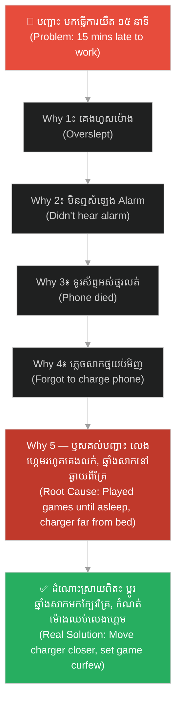
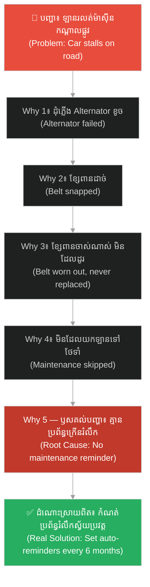
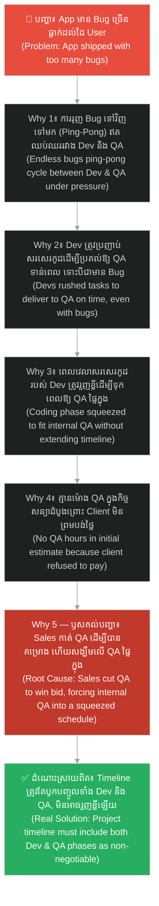
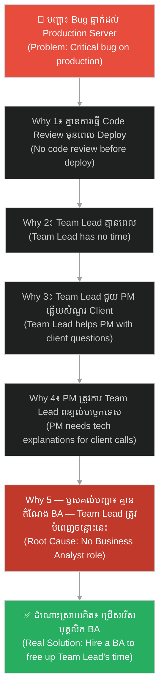
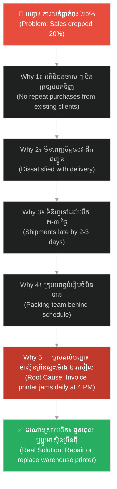
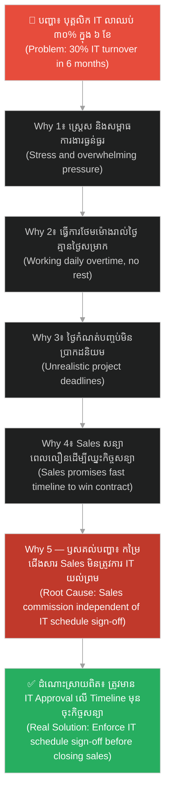
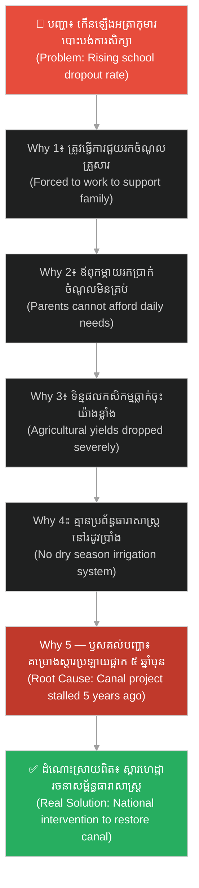
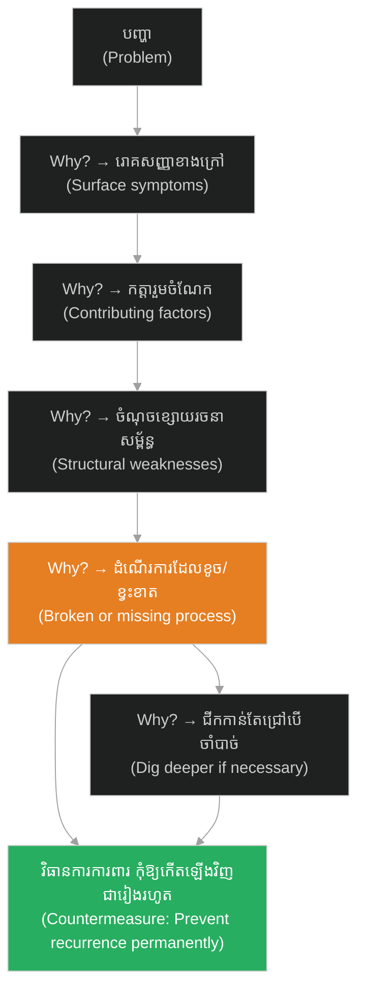

# The 5 Whys Technique (បច្ចេកទេសសួរ «ហេតុអ្វី» ៥ ដង)៖ ឈប់ដោះស្រាយលើរោគសញ្ញា ចាប់ផ្តើមស្វែងរកឫសគល់នៃបញ្ហា (The 5 Whys Technique: Stop Treating Symptoms, Start Solving the Root Cause)

**Author:** ichamrong  
**Date:** 2026-05-16  
**Tags:** #5-whys #root-cause-analysis #problem-solving #mental-models #lean #toyota  
**Category:** Concepts  
**Read Time:** ~18 min  

---

## 📌 មាតិកា (Table of Contents)
- [លំនាំបញ្ហា (The Pattern)](#លំនាំបញ្ហា-the-pattern)
- [១. បញ្ហា៖ ការកាត់ស្មៅដែលមិនធ្លាប់ដកឫស (The Issue: The Lawn Mower That Never Pulls the Roots)](#១-បញ្ហា-ការកាត់ស្មៅដែលមិនធ្លាប់ដកឫស-the-issue-the-lawn-mower-that-never-pulls-the-roots)
- [២. ឧទាហរណ៍ជាក់ស្តែងក្នុងពិភពពិត (Real World Examples)](#២-ឧទាហរណ៍ជាក់ស្តែងក្នុងពិភពពិត)
  - [ឧទាហរណ៍ទី ១ — កម្រិតស្រាល៖ ទៅធ្វើការយឺត (Late to Work)](#ឧទាហរណ៍ទី-១--កម្រិតស្រាល-ទៅធ្វើការយឺត-late-to-work)
  - [ឧទាហរណ៍ទី ២ — កម្រិតមធ្យម (បច្ចេកទេស)៖ ឡានខូចកណ្តាលផ្លូវ (Car Breaks Down)](#ឧទាហរណ៍ទី-២--កម្រិតមធ្យម-បច្ចេកទេស-ឡានខូចកណ្តាលផ្លូវ-car-breaks-down)
  - [ឧទាហរណ៍ទី ៣ — កម្រិតមធ្យម (បច្ចេកទេស)៖ App ចេញមកមាន Bug ច្រើន (App Shipped With Too Many Bugs)](#ឧទាហរណ៍ទី-៣--កម្រិតមធ្យម-បច្ចេកទេស-app-ចេញមកមាន-bug-ច្រើន-app-shipped-with-too-many-bugs)
  - [ឧទាហរណ៍ទី ៤ — កម្រិតមធ្យម (បច្ចេកទេស)៖ Bug ធ្លាក់ដល់ផលិតកម្មពិត (Bugs Reaching Production)](#ឧទាហរណ៍ទី-៤--កម្រិតមធ្យម-បច្ចេកទេស-bug-ធ្លាក់ដល់ផលិតកម្មពិត-bugs-reaching-production)
  - [ឧទាហរណ៍ទី ៥ — កម្រិតមធ្យម (ធុរកិច្ច)៖ ការធ្លាក់ចុះនៃការលក់ (Sales Drop)](#ឧទាហរណ៍ទី-៥--កម្រិតមធ្យម-ធុរកិច្ច-ការធ្លាក់ចុះនៃការលក់-sales-drop)
  - [ឧទាហរណ៍ទី ៦ — កម្រិតមធ្យម (ការគ្រប់គ្រង)៖ បុគ្គលិកលាឈប់ច្រើន (High Employee Turnover)](#ឧទាហរណ៍ទី-៦--កម្រិតមធ្យម-ការគ្រប់គ្រង-បុគ្គលិកលាឈប់ច្រើន-high-employee-turnover)
  - [ឧទាហរណ៍ទី ៧ — កម្រិតធ្ងន់៖ កុមារបោះបង់ការសិក្សា (Children Dropping Out of School)](#ឧទាហរណ៍ទី-៧--កម្រិតធ្ងន់-កុមារបោះបង់ការសិក្សា-children-dropping-out-of-school)
- [៣. កត្តាជម្រុញ៖ ភាពប្រញាប់ប្រញាល់ និងភាពខ្ជិលច្រអូសផ្នែកស្មារតី (The Aggravator: Speed and Mental Laziness)](#៣-កត្តាជម្រុញ-ភាពប្រញាប់ប្រញាល់-និងភាពខ្ជិលច្រអូសផ្នែកស្មារតី-the-aggravator-speed-and-mental-laziness)
- [៤. ដំណោះស្រាយទូទៅ៖ របៀបប្រើប្រាស់ 5 Whys ឱ្យត្រឹមត្រូវ (The General Solution: How to Use 5 Whys Correctly)](#៤-ដំណោះស្រាយទូទៅ-របៀបប្រើប្រាស់-5-whys-ឱ្យត្រឹមត្រូវ-the-general-solution-how-to-use-5-whys-correctly)
  - [សួររកបញ្ហានៅក្នុងប្រព័ន្ធ មិនមែនសួររកកំហុសបុគ្គល (Ask about process, not person)](#សួររកបញ្ហានៅក្នុងប្រព័ន្ធ-មិនមែនសួររកកំហុសបុគ្គល)
  - [ផ្អែកលើការពិតជាក់ស្តែង មិនមែនការស្មាន (Ground in facts, not guesses)](#ផ្អែកលើការពិតជាក់ស្តែង-មិនមែនការស្មាន)
  - [ដឹងពីចំណុចដែលត្រូវបញ្ឈប់ (Know when to stop)](#ដឹងពីចំណុចដែលត្រូវបញ្ឈប់)
- [សេចក្តីសន្និដ្ឋាន (Conclusion)](#សេចក្តីសន្និដ្ឋាន-conclusion)
- [ឯកសារយោង (References)](#ឯកសារយោង-references)
- [Related Posts](#related-posts)

---

## លំនាំបញ្ហា (The Pattern)

តើអ្នកធ្លាប់ដោះស្រាយបញ្ហាណាមួយរួចរាល់ហើយ — ស្រាប់តែវាត្រឡប់មកកើតឡើងវិញនៅខែក្រោយដែរឬទេ?

Have you ever solved a problem, only to have it return the following month?

* ម៉ាស៊ីនខូច។ អ្នកជួសជុលវា។ ខែក្រោយ វាក៏ខូចម្តងទៀត។
* បុគ្គលិកខកខាន Deadline ជានិច្ច។ អ្នកព្រមាននិងស្តីបន្ទោសពួកគេ។ សប្តាហ៍ក្រោយ ពួកគេនៅតែខកខានដដែល។

* A machine breaks. You fix it. Next month, it breaks again.
* Employees keep missing deadlines. You warn and reprimand them. Next week, they miss them again.

នេះមិនមែនមានន័យថាអ្នកគ្មានសមត្ថភាពដោះស្រាយបញ្ហានោះទេ។ ប៉ុន្តែវាមានន័យថាអ្នកកំពុងដោះស្រាយខុសរឿង។ អ្នកកំពុងដោះស្រាយលើ **រោគសញ្ញា (Symptoms)** មិនមែន **ឫសគល់នៃបញ្ហា (Root Cause)** ឡើយ។

This doesn't mean you lack problem-solving skills. It means you are fixing the wrong thing. You are treating the **symptoms**, not the **root cause**.

ផែនទីបង្ហាញផ្លូវសម្រាប់អត្ថបទនេះ៖
1. **បញ្ហា (The Issue)** — តើការដោះស្រាយត្រឹមតែផ្ទៃក្រៅមានន័យដូចម្តេច? តើបច្ចេកទេស 5 Whys គឺជាអ្វី?
2. **ឧទាហរណ៍ជាក់ស្តែង (Real World Examples)** — ឧទាហរណ៍ចំនួន ៧ បង្ហាញពីភាពខុសគ្នារវាងការដោះស្រាយលើផ្ទៃក្រៅ និងការប្រើប្រាស់ 5 Whys។
3. **កត្តាជម្រុញ (The Aggravator)** — ហេតុអ្វីបានជាមនុស្សភាគច្រើនតែងតែដោះស្រាយត្រឹមតែរោគសញ្ញាខាងក្រៅ?
4. **ដំណោះស្រាយទូទៅ (The General Solution)** — របៀបប្រើប្រាស់ 5 Whys ឱ្យមានប្រសិទ្ធភាពខ្ពស់។

Roadmap for this article:
1. **The Issue** — What does surface-level fixing look like? What is the 5 Whys technique?
2. **Real World Examples** — Seven examples showing the contrast between surface-level fixes and the 5 Whys.
3. **The Aggravator** — Why do most people default to treating surface symptoms?
4. **The General Solution** — How to use the 5 Whys with high effectiveness.

---

## ១. បញ្ហា៖ ការកាត់ស្មៅដែលមិនធ្លាប់ដកឫស (The Issue: The Lawn Mower That Never Pulls the Roots)

នៅពេលបញ្ហាកើតឡើង ខួរក្បាលរបស់យើងតែងតែស្វែងរកដំណោះស្រាយដែលលឿន និងងាយស្រួលបំផុតដោយស្វ័យប្រវត្តិ។ យើងប្រៀបដូចជាអ្នកកាត់ស្មៅ — ដែលកាត់តែចុងស្មៅខាងលើ ដោយមិនបានជីកដកឫសរបស់វាចេញឡើយ។ តែប៉ុន្មានសប្តាហ៍ក្រោយមក ស្មៅនោះនឹងដុះឡើងមកវិញដដែល។

When a problem arises, our brains automatically look for the fastest, easiest solution. We act like lawn mowers — cutting only the top of the grass without pulling out the roots. A few weeks later, the weeds grow right back.

**The 5 Whys (បច្ចេកទេសសួរ ហេតុអ្វី ៥ ដង)** គឺជាវិធីសាស្ត្រដ៏សាមញ្ញ ប៉ុន្តែមានអំណាចមហាសាល ដែលបង្កើតឡើងដោយ **Sakichi Toyoda** (ស្ថាបនិកក្រុមហ៊ុន Toyota) ដើម្បីស្វែងរកឫសគល់ពិតប្រាកដនៃបញ្ហាណាមួយ — ដោយគ្រាន់តែចោទសួរពាក្យថា *«ហេតុអ្វី?»* សារចុះសារឡើង ស៊ីជម្រៅទៅក្រោមម្តងមួយកម្រិត រហូតដល់រកឃើញប្រភពដើម។

**The 5 Whys** is a simple yet powerful method created by **Sakichi Toyoda** (founder of Toyota Industries) to find the absolute root cause of any problem — simply by asking *"Why?"* repeatedly, drilling down level-by-level until the origin is uncovered.

និយាយឱ្យសាមញ្ញ៖

❌ កុំពេញចិត្តនឹងចម្លើយដំបូងដែលអ្នកទទួលបាន — ព្រោះវាស្ទើរតែតែងតែជារោគសញ្ញាខាងក្រៅប៉ុណ្ណោះ។

✅ ធ្វើខ្លួនដូចជា **អ្នកស៊ើបអង្កេត**៖ សួរដេញដោលរហូតដល់រកឃើញជនបង្កពិតប្រាកដ។

To put it simply:

❌ Never settle for the first answer you get — it is almost always just a surface symptom.

✅ Act like a **detective**: keep interrogating until you locate the true culprit.

---

## ២. ឧទាហរណ៍ជាក់ស្តែងក្នុងពិភពពិត (Real World Examples)

នេះជា **ឧទាហរណ៍ជាក់ស្តែងចំនួន ៧** ចាប់ពីជីវិតប្រចាំថ្ងៃ រហូតដល់ការគ្រប់គ្រងស្ថាប័នស្មុគស្មាញ៖

Here are **seven real-world examples** ranging from daily life to complex organizational management:

---

### ឧទាហរណ៍ទី ១ — កម្រិតស្រាល៖ ទៅធ្វើការយឺត (Late to Work)

**បញ្ហា៖** អ្នកមកធ្វើការយឺត ១៥ នាទីនៅថ្ងៃនេះ។

**ដំណោះស្រាយលើផ្ទៃក្រៅ៖** *«ចាំស្អែក ខ្ញុំនឹងបង្ខំខ្លួនឯងឱ្យភ្ញាក់ពីព្រលឹម!»*  
(លទ្ធផល៖ ស្អែកអាចនឹងមកទាន់ តែសប្តាហ៍ក្រោយនឹងនៅតែមកយឺតដដែល។)

**Problem:** You are 15 minutes late to work today.

**Surface Fix:** *"Tomorrow, I'll force myself to wake up earlier!"*  
(Result: You might make it tomorrow, but next week you'll be late again.)

**ការវិភាគបែប 5 Whys៖**

| # | សំណួរ (Why?) | ចម្លើយ (Answer) |
|---|---|---|
| 1 | ហេតុអ្វីបានជាអ្នកមកយឺត?  (Why were you late?) | ពីព្រោះខ្ញុំគេងហួសម៉ោង។  (Because I overslept.) |
| 2 | ហេតុអ្វីបានជាគេងហួសម៉ោង?  (Why did you oversleep?) | ពីព្រោះខ្ញុំមិនឮសំឡេង Alarm (ម៉ោងរោទ៍)។  (Because I didn't hear the alarm.) |
| 3 | ហេតុអ្វីបានជាមិនឮសំឡេង Alarm?  (Why didn't you hear the alarm?) | ពីព្រោះទូរស័ព្ទរបស់ខ្ញុំអស់ថ្មរលត់បាត់។  (Because my phone died.) |
| 4 | ហេតុអ្វីបានជាទូរស័ព្ទអស់ថ្មរលត់?  (Why did the phone die?) | ពីព្រោះខ្ញុំភ្លេចសាកថ្មវាកាលពីយប់មិញ។  (Because I forgot to charge it last night.) |
| 5 | ហេតុអ្វីបានជាភ្លេចសាកថ្ម?  (Why did you forget to charge it?) | **ពីព្រោះខ្ញុំលេងហ្គេមរហូតដល់គេងលក់ ហើយឆ្នាំងសាកនៅឆ្ងាយពីគ្រែពេក។**  (**Because I played games until I fell asleep, and the charger was too far from my bed.**) |

**ដំណោះស្រាយពិតប្រាកដ៖** ប្តូរឆ្នាំងសាកទូរស័ព្ទមកដាក់ក្បែរក្បាលគ្រែ ឬកំណត់ម៉ោងបិទហ្គេមដាច់ខាតនៅម៉ោង ១១ យប់។

**Real Solution:** Move the phone charger next to the bed headboard, and set a strict curfew to stop gaming by 11 PM.

---

### ឧទាហរណ៍ទី ២ — កម្រិតមធ្យម (បច្ចេកទេស)៖ ឡានខូចកណ្តាលផ្លូវ (Car Breaks Down)

**បញ្ហា៖** ឡានស្រាប់តែរលត់ម៉ាស៊ីន និងខូចនៅកណ្តាលផ្លូវ។

**ដំណោះស្រាយលើផ្ទៃក្រៅ៖** ហៅឡានស្ទូចយកទៅជាង និងដូរគ្រឿងបន្លាស់ដែលខូចចេញ។  
(លទ្ធផល៖ វានឹងខូចម្តងទៀតនៅពេលក្រោយ។)

**Problem:** The car suddenly stalls and breaks down in the middle of the road.

**Surface Fix:** Tow the car to a mechanic and replace the broken part.  
(Result: It will break down again in the future.)

**ការវិភាគបែប 5 Whys៖**

| # | សំណួរ (Why?) | ចម្លើយ (Answer) |
|---|---|---|
| 1 | ហេតុអ្វីបានជាម៉ាស៊ីនរលត់?  (Why did the engine stall?) | ពីព្រោះដុំភ្លើង (Alternator) ឈប់ដំណើរការ។  (Because the alternator failed.) |
| 2 | ហេតុអ្វីបានជា Alternator ឈប់ដំណើរការ?  (Why did the alternator fail?) | ពីព្រោះខ្សែពាន (Belt) របស់វាបានដាច់។  (Because the belt snapped.) |
| 3 | ហេតុអ្វីបានជាខ្សែពានដាច់?  (Why did the belt snap?) | ពីព្រោះវាចាស់ខ្លាំងណាស់ ហើយមិនដែលធ្លាប់បានប្តូរឡើយ។  (Because it was worn out and never replaced.) |
| 4 | ហេតុអ្វីបានជាមិនដែលធ្លាប់បានប្តូរ?  (Why was it never replaced?) | ពីព្រោះឡាននេះមិនដែលបានយកទៅធ្វើការថែទាំតាមកាលកំណត់ (Scheduled Maintenance) ឡើយ។  (Because the car was not maintained according to the schedule.) |
| 5 | ហេតុអ្វីបានជារំលងការថែទាំឡាន?  (Why was maintenance skipped?) | **ពីព្រោះម្ចាស់ឡានគ្មានប្រព័ន្ធក្រើនរំលឹក (Reminder System) សម្រាប់កាលវិភាគថែទាំឡានឡើយ។**  (**Because the owner had no reminder system for car maintenance.**) |

**ដំណោះស្រាយពិតប្រាកដ៖** កំណត់ប្រព័ន្ធរំលឹកកាលវិភាគថែទាំឡានស្វ័យប្រវត្តិនៅលើទូរស័ព្ទរបស់អ្នករៀងរាល់ ៦ ខែម្តង។

**Real Solution:** Set a recurring calendar reminder on your phone every 6 months for scheduled car maintenance.

---

### ឧទាហរណ៍ទី ៣ — កម្រិតមធ្យម (បច្ចេកទេស)៖ App ចេញមកមាន Bug ច្រើន (App Shipped With Too Many Bugs)

**បញ្ហា៖** App ដែលទើបតែ Release ថ្មី ត្រូវបានអតិថិជនរាយការណ៍មកថាមាន Bug ច្រើនខ្លាំងណាស់។

**ដំណោះស្រាយលើផ្ទៃក្រៅ (ដែលធ្វើឱ្យប៉ះពាល់ដល់អារម្មណ៍យ៉ាងធ្ងន់ធ្ងរ)៖** ថ្នាក់ដឹកនាំស្តីបន្ទោស និងចោទប្រកាន់ថា Developer គ្មានសមត្ថភាព ឬធ្វើការធូររលុង ដោយសារតែប្រគល់កូដដែលមាន Bug ច្រើនទៅឱ្យ QA។ ពួកគេត្រូវបានបង្ខំឱ្យស្នាក់នៅធ្វើការពេញមួយយប់ដើម្បី Fix នៅក្នុងដំណើរការរុញ Bug ទៅវិញទៅមក (Ping-Pong) យ៉ាងតានតឹងបំផុត ទោះបីជាឫសគល់នៃបញ្ហាគឺមកពីការរៀបចំផែនការក៏ដោយ។

**Problem:** The newly released app is reported by users to have many critical bugs.

**Surface Fix (The Painful Reality):** Management blames developers for incompetent or sloppy coding because they hand off buggy code to QA. The developers are then forced to work sleepless nights in a stressful, high-pressure "ping-pong" bug-fixing cycle with QA, carrying the blame for a failure that was actually caused by bad project planning.

**ការវិភាគបែប 5 Whys៖**

| # | សំណួរ (Why?) | ចម្លើយ (Answer) |
|---|---|---|
| 1 | ហេតុអ្វីបានជា App មាន Bug ច្រើនធ្លាក់ដល់ដៃ User?  (Why did so many bugs reach users?) | ពីព្រោះមានការរុញ Bug ទៅវិញទៅមក (Ping-Pong) ឥតឈប់ឈររវាង Developer និង QA ក្រោមសម្ពាធពេលវេលាដ៏ខ្លី ធ្វើឱ្យគ្មានពេលគ្រប់គ្រាន់សម្រាប់តេស្តសាកល្បងមុន Release ឡើយ។  (Because there was an endless "ping-pong" cycle of bugs going back and forth between Dev and QA under tight time pressure, leaving no time for a complete test sweep.) |
| 2 | ហេតុអ្វីបានជាមានការរុញ Bug ទៅវិញទៅមក (Ping-Pong) ខ្លាំងបែបនេះ?  (Why was there a heavy "ping-pong" cycle?) | ពីព្រោះ Developer ត្រូវបង្ខំចិត្តសរសេរកូដយ៉ាងប្រញាប់ប្រញាល់បំផុត (Rush) ដើម្បីប្រគល់ការងារឱ្យទាន់កាលកំណត់ទៅ QA ទោះបីជាកូដនោះសំបូរទៅដោយ Bug ក៏ដោយ។  (Because developers had to rush their tasks and deliver them to QA on time, even when the code was full of bugs, just to meet the fixed handoff deadline.) |
| 3 | ហេតុអ្វីបានជា Developer ត្រូវសរសេរកូដប្រញាប់ប្រញាល់ និងប្រគល់កូដដែលមាន Bug ទៅឱ្យ QA?  (Why did developers have to rush tasks and deliver them with bugs?) | ពីព្រោះពេលវេលាសរសេរកូដរបស់ Developer ត្រូវបានរួញខ្លី ដើម្បីទុកពេលបញ្ចូលក្រុម QA ផ្ទៃក្នុង ដោយមិនបានពន្យារកាលវិភាគសរុបនៃគម្រោងឡើយ។  (Because the coding timeline was squeezed to fit internal QA testing, without extending the overall project schedule.) |
| 4 | ហេតុអ្វីបានជាពេលវេលាសរសេរកូដត្រូវរួញខ្លី ដើម្បីបញ្ចូល QA ផ្ទៃក្នុង?  (Why was the coding timeline squeezed to insert internal QA?) | ពីព្រោះការប៉ាន់ស្មានពេលដំបូងមិនបានបញ្ចូលម៉ោង QA ឡើយ (ព្រោះអតិថិជនមិនព្រមបង់ថ្លៃ)។ ប៉ុន្តែ ក្រុមហ៊ុននៅតែសម្រេចចិត្តបន្ថែម QA ផ្ទៃក្នុងដើម្បីធានាគុណភាព ដោយមិនបានកែសម្រួល ឬពន្យារ Timeline របស់គម្រោងឡើយ។  (Because the initial estimate had no QA hours as the client refused to pay. However, management added internal QA anyway for quality control, without adjusting or extending the overall project timeline.) |
| 5 | ហេតុអ្វីបានជាការប៉ាន់ស្មានគម្រោងដំបូងមិនបានបញ្ចូលម៉ោង QA?  (Why did the initial estimate exclude QA?) | **ពីព្រោះអតិថិជនបដិសេធមិនព្រមបង់ថ្លៃសេវា QA ហើយផ្នែកលក់ (Sales) ក៏យល់ព្រមកាត់វាចេញពីគម្រោងដំបូងដើម្បីដណ្តើមយកគម្រោងនេះឱ្យបាន រួចសង្ឃឹមថានឹងប្រើប្រាស់ QA ផ្ទៃក្នុងជាក្រោយ ដោយមិនបានគិតពីផលប៉ះពាល់លើពេលវេលាធ្វើការរបស់ Developer ឡើយ។**  (**Because the client refused to pay for QA, and Sales accepted this cut just to win the project, planning to force internal QA into the same schedule later without considering the impact on development time.**) |

**ដំណោះស្រាយពិតប្រាកដ៖** កំណត់សេវាកម្ម QA និងកាលវិភាគការងាររបស់វាជាលក្ខខណ្ឌបង្ខំដាច់ខាត (Non-negotiable) នៅក្នុងរាល់កិច្ចសន្យាគម្រោង។ ត្រូវពន្យល់អតិថិជន និងផ្នែកលក់ឱ្យយល់ថា ពេលវេលាតេស្តគុណភាពត្រូវតែបូកបន្ថែមពីលើម៉ោងសរសេរកូដជានិច្ច មិនអាចលួចបន្លំ ឬរួញខ្លីផ្នែកសរសេរកូដរបស់ Developer ឡើយ។

**Real Solution:** Make QA services and its timeline a non-negotiable term in all project contracts. Educate clients and sales that testing schedules must be planned on top of development time, rather than squeezing the coding phase and setting up teams for failure.

---

### ឧទាហរណ៍ទី ៤ — កម្រិតមធ្យម (បច្ចេកទេស)៖ Bug ធ្លាក់ដល់ផលិតកម្មពិត (Bugs Reaching Production)

**បញ្ហា៖** Bug ធ្ងន់ធ្ងរបានកើតឡើងនៅលើប្រព័ន្ធផលិតកម្មពិត (Production Server) ដែលអតិថិជនពិតប្រាកដកំពុងប្រើប្រាស់។

**ដំណោះស្រាយលើផ្ទៃក្រៅ៖** ស្តីបន្ទោស Developer ណាដែលសរសេរកូដនោះ និងប្រញាប់ប្រញាល់ Push Hotfix ជាបន្ទាន់។

**Problem:** A critical bug occurs on the production server being used by active clients.

**Surface Fix:** Blame the developer who wrote the code and rush a hotfix into production.

**ការវិភាគបែប 5 Whys៖**

| # | សំណួរ (Why?) | ចម្លើយ (Answer) |
|---|---|---|
| 1 | ហេតុអ្វីបានជា Bug ធ្លាក់ដល់ Production?  (Why did the bug reach production?) | ពីព្រោះកូដនេះមិនត្រូវបានធ្វើការត្រួតពិនិត្យ (Code Review) មុនពេលបាញ់ឡើង (Deploy) ឡើយ។  (Because the code was not reviewed before deployment.) |
| 2 | ហេតុអ្វីបានជាគ្មានការធ្វើ Code Review?  (Why was there no code review?) | ពីព្រោះ Team Lead ដែលជាអ្នកទទួលខុសត្រូវលើការ Review គ្មានពេលវេលាទាល់តែសោះ។  (Because the Team Lead responsible for reviews had no time.) |
| 3 | ហេតុអ្វីបានជា Team Lead គ្មានពេល?  (Why did the Team Lead have no time?) | ពីព្រោះពួកគេត្រូវចំណាយពេលរាល់ថ្ងៃជួយ Product Manager (PM) ឆ្លើយតបរាល់សំណួររបស់អតិថិជន។  (Because they spent all day helping the PM answer client questions.) |
| 4 | ហេតុអ្វីបានជា PM ត្រូវការ Team Lead ជួយឆ្លើយសំណួររាល់ថ្ងៃ?  (Why did the PM need help daily?) | ពីព្រោះ PM ត្រូវការឱ្យ Team Lead ពន្យល់ពីបច្ចេកទេស និងស្វែងរកដំណោះស្រាយរាល់ពេលមុននឹង Call ជាមួយអតិថិជន។  (Because the PM needed technical explanations and fixes before every client call.) |
| 5 | ហេតុអ្វីបានជា PM និង Team Lead ជាប់គាំងក្នុងរង្វង់ការងារបែបនេះ?  (Why were they stuck in this loop?) | **ពីព្រោះក្រុមហ៊ុនគ្មានអ្នកវិភាគអាជីវកម្ម (Business Analyst - BA) ឡើយ។ គ្មាននរណាម្នាក់ជាស្ពានចម្លងរវាងភាសាអាជីវកម្មរបស់អតិថិជន និងភាសាបច្ចេកទេសរបស់ក្រុមការងារ — ដូច្នេះ Team Lead ត្រូវបង្ខំចិត្តបំពេញចន្លោះនេះជានិច្ច ធ្វើឱ្យគ្មានពេលគ្រប់គ្រងគុណភាពកូដ។**  (**Because the company lacked a Business Analyst (BA). Nobody acted as a bridge between the client's business language and the team's technical language, forcing the Team Lead to fill the gap and leave code quality unmanaged.**) |

**ដំណោះស្រាយពិតប្រាកដ៖** ជ្រើសរើសបុគ្គលិកផ្នែក Business Analyst (BA) ម្នាក់ដើម្បីគ្រប់គ្រងទំនាក់ទំនងជាមួយអតិថិជន និងចងក្រងឯកសារតម្រូវការ ដើម្បីរំដោះពេលវេលាឱ្យ Team Lead អាចត្រឡប់មកផ្តោតលើគុណភាពកូដ និងការបណ្តុះបណ្តាលសមាជិកក្រុម។

**Real Solution:** Hire a Business Analyst (BA) to manage client relations and document requirements. This frees up the Team Lead's time to focus on code reviews and mentoring developers.

---

### ឧទាហរណ៍ទី ៥ — កម្រិតមធ្យម (ធុរកិច្ច)៖ ការធ្លាក់ចុះនៃការលក់ (Sales Drop)

**បញ្ហា៖** ការលក់ផលិតផល A បានធ្លាក់ចុះ ២០% នៅក្នុងខែនេះ។

**ដំណោះស្រាយលើផ្ទៃក្រៅ៖** បង្ខំក្រុមលក់ (Sales Team) ឱ្យធ្វើការ Call ទៅកាន់អតិថិជនឱ្យបានច្រើន និងផ្តល់បញ្ចុះតម្លៃបន្ថែម។

**Problem:** Sales of Product A dropped by 20% this month.

**Surface Fix:** Force the sales team to make more cold calls and offer deeper discounts.

**ការវិភាគបែប 5 Whys៖**

| # | សំណួរ (Why?) | ចម្លើយ (Answer) |
|---|---|---|
| 1 | ហេតុអ្វីបានជាការលក់ធ្លាក់ចុះ ២០%?  (Why did sales drop 20%?) | ពីព្រោះអតិថិជនចាស់ ៗ មិនត្រឡប់មកទិញម្តងទៀត (Repeat Purchase) ឡើយ។  (Because existing customers are not returning to make repeat purchases.) |
| 2 | ហេតុអ្វីបានជាពួកគេមិនត្រឡប់មកទិញ?  (Why are they not returning?) | ពីព្រោះពួកគេមិនពេញចិត្តនឹងសេវាកម្មដឹកជញ្ជូន (Delivery Service)។  (Because they are dissatisfied with the delivery service.) |
| 3 | ហេតុអ្វីបានជាមិនពេញចិត្តនឹងការដឹកជញ្ជូន?  (Why are they dissatisfied with delivery?) | ពីព្រោះទំនិញតែងតែទៅដល់ដៃពួកគេយឺតជាងការសន្យា ២ ទៅ ៣ ថ្ងៃជានិច្ច។  (Because shipments arrive 2 to 3 days later than promised.) |
| 4 | ហេតុអ្វីបានជាទំនិញទៅដល់យឺត?  (Why are shipments late?) | ពីព្រោះក្រុមវេចខ្ចប់ទំនិញ (Packing Team) មិនអាចរៀបចំទំនិញចេញទាន់ពេលវេលា។  (Because the packing team cannot prepare items on time.) |
| 5 | ហេតុអ្វីបានជាក្រុមវេចខ្ចប់រៀបចំមិនទាន់?  (Why is the packing team late?) | **ពីព្រោះម៉ាសិនបោះពុម្ពវិក្កយបត្រ (Invoice Printer) នៅក្នុងឃ្លាំងតែងតែស្ទះក្រដាសរៀងរាល់ម៉ោង ៤ រសៀល ដែលធ្វើឱ្យដំណើរការវេចខ្ចប់ទាំងមូលត្រូវកកស្ទះ និងផ្អាកជារៀងរាល់ថ្ងៃ។**  (**Because the warehouse invoice printer jams every day at 4 PM, stalling the entire packaging workflow.**) |

**ដំណោះស្រាយពិតប្រាកដ៖** ជួសជុល ឬទិញម៉ាស៊ីនបោះពុម្ពវិក្កយបត្រថ្មីដែលមានគុណភាពល្អសម្រាប់ក្រុមការងារនៅក្នុងឃ្លាំង។

**Real Solution:** Repair or purchase a new high-quality invoice printer for the warehouse packing team.

---

### ឧទាហរណ៍ទី ៦ — កម្រិតមធ្យម (ការគ្រប់គ្រង)៖ បុគ្គលិកលាឈប់ច្រើន (High Employee Turnover)

**បញ្ហា៖** ៣០% នៃបុគ្គលិកនៅក្នុងនាយកដ្ឋាន IT បានសម្រេចចិត្តលាឈប់នៅក្នុងរយៈពេល ៦ ខែចុងក្រោយនេះ។

**ដំណោះស្រាយលើផ្ទៃក្រៅ៖** ប្រធាននាយកដ្ឋានស្នើសុំដំឡើងប្រាក់ខែឱ្យបុគ្គលិកដែលនៅសេសសល់ដើម្បីកុំឱ្យពួកគេលាឈប់បន្ត។

**Problem:** 30% of IT department staff resigned in the past 6 months.

**Surface Fix:** The department head requests salary raises for the remaining staff to prevent them from leaving.

**ការវិភាគបែប 5 Whys៖**

| # | សំណួរ (Why?) | ចម្លើយ (Answer) |
|---|---|---|
| 1 | ហេតុអ្វីបានជាបុគ្គលិក IT លាឈប់ច្រើនម្ល៉េះ?  (Why are IT staff resigning?) | ពីព្រោះពួកគេមានអារម្មណ៍ស្ត្រេស និងរងសម្ពាធការងារធ្ងន់ធ្ងរពេក (Overwhelming Work Pressure)។  (Because they experience severe stress and overwhelming work pressure.) |
| 2 | ហេតុអ្វីបានជាសម្ពាធការងារខ្ពស់ម្ល៉េះ?  (Why is the pressure so high?) | ពីព្រោះពួកគេត្រូវធ្វើការថែមម៉ោង (Overtime) ស្ទើរតែរាល់ថ្ងៃ និងគ្មានថ្ងៃសម្រាកឡើយ។  (Because they have to work overtime almost daily with no rest days.) |
| 3 | ហេតុអ្វីបានជាពួកគេត្រូវធ្វើការថែមម៉ោងមិនចេះចប់?  (Why do they work endless overtime?) | ពីព្រោះគម្រោងភាគច្រើនមានថ្ងៃកំណត់បញ្ចប់ (Deadline) ដែលមិនប្រាកដនិយម និងគ្មានពេលវេលាបម្រុងទុកសម្រាប់ដោះស្រាយហានិភ័យឡើយ។  (Because projects have unrealistic deadlines and zero risk buffer.) |
| 4 | ហេតុអ្វីបានជាគម្រោងមាន Deadline មិនប្រាកដនិយម?  (Why are deadlines unrealistic?) | ពីព្រោះក្រុមការងារផ្នែកលក់ (Sales Team) សន្យាពេលវេលាប្រគោងដ៏លឿនបំផុតទៅកាន់អតិថិជនដើម្បីតែចង់ឈ្នះដេញថ្លៃយកកិច្ចសន្យា។  (Because the sales team promises ultra-fast delivery times just to win project bids.) |
| 5 | ហេតុអ្វីបានជាក្រុមលក់សន្យាអ្វីដែលក្រុម IT មិនអាចធ្វើបាន?  (Why does Sales promise what IT cannot deliver?) | **ពីព្រោះប្រាក់កម្រៃជើងសារ (Commission) របស់ក្រុមលក់គឺផ្សារភ្ជាប់ទៅនឹងល្បឿននៃការចុះកិច្ចសន្យា ដោយមិនតម្រូវឱ្យមានការត្រួតពិនិត្យ និងយល់ព្រមលើលទ្ធភាពបច្ចេកទេស (Technical Sign-off) ពីក្រុម IT ជាមុនឡើយ។**  (**Because Sales commission is tied purely to contract signatures, without requiring technical sign-off or schedule vetting from the IT team first.**) |

**ដំណោះស្រាយពិតប្រាកដ៖** បង្កើតដំណើរការអនុម័តផ្លូវការមួយដែលតម្រូវឱ្យថ្នាក់ដឹកនាំផ្នែក IT ត្រួតពិនិត្យ និងចុះហត្ថលេខាឯកភាពលើលទ្ធភាពនៃពេលវេលា (Timeline Feasibility) មុនពេលផ្នែកលក់អាចធ្វើការសន្យា ឬចុះកិច្ចសន្យាជាមួយអតិថិជន។

**Real Solution:** Standardize an approval workflow requiring IT leadership to review and sign off on timeline feasibility before Sales can finalize client agreements.

---

### ឧទាហរណ៍ទី ៧ — កម្រិតធ្ងន់៖ កុមារបោះបង់ការសិក្សា (Children Dropping Out of School)

**បញ្ហា៖** នៅក្នុងស្រុកដាច់ស្រយាលមួយ មានការកើនឡើងយ៉ាងខ្លាំងនៃអត្រាកុមារបោះបង់ការសិក្សាចោល។

**ដំណោះស្រាយលើផ្ទៃក្រៅ៖** រដ្ឋាភិបាល ឬអង្គការក្រៅរដ្ឋាភិបាលធ្វើការបរិច្ចាគកង់ និងសម្ភារៈសិក្សាដើម្បីជម្រុញឱ្យពួកគេចង់មកសាលារៀនវិញ។

**Problem:** In a remote district, the school dropout rate is rising sharply.

**Surface Fix:** The government or an NGO donates bicycles and study materials to encourage kids to return to school.

**ការវិភាគបែប 5 Whys៖**

| # | សំណួរ (Why?) | ចម្លើយ (Answer) |
|---|---|---|
| 1 | ហេតុអ្វីបានជាកុមារបោះបង់ការសិក្សា?  (Why do children drop out?) | ពីព្រោះពួកគេត្រូវបង្ខំចិត្តទៅធ្វើការងារដើម្បីជួយរកចំណូលទ្រទ្រង់គ្រួសារ។  (Because they must work to help support their families.) |
| 2 | ហេតុអ្វីបានជាកុមារត្រូវធ្វើការទាំងវ័យក្មេងម្ល៉េះ?  (Why do young children have to work?) | ពីព្រោះឪពុកម្តាយមិនអាចរកប្រាក់ចំណូលបានគ្រប់គ្រាន់សម្រាប់ទិញតម្រូវការចាំបាច់ប្រចាំថ្ងៃឡើយ។  (Because parents cannot earn enough to afford basic daily needs.) |
| 3 | ហេតុអ្វីបានជាឪពុកម្តាយមិនអាចរកចំណូលបានគ្រប់គ្រាន់?  (Why cannot parents earn enough?) | ពីព្រោះទិន្នផលកសិកម្ម (Agricultural Yields) បានធ្លាក់ចុះយ៉ាងខ្លាំងក្នុងរយៈពេលប៉ុន្មានឆ្នាំចុងក្រោយនេះ។  (Because agricultural yields have dropped severely over recent years.) |
| 4 | ហេតុអ្វីបានជាទិន្នផលកសិកម្មធ្លាក់ចុះ?  (Why did crop yields drop?) | ពីព្រោះគ្មានប្រព័ន្ធធារាសាស្ត្រ (Irrigation Infrastructure) គ្រប់គ្រាន់សម្រាប់នាំទឹកបញ្ចូលស្រែចម្ការនៅរដូវប្រាំងឡើយ។  (Because there is no irrigation system to bring water to fields in the dry season.) |
| 5 | ហេតុអ្វីបានជាគ្មានប្រព័ន្ធធារាសាស្ត្រគ្រប់គ្រាន់?  (Why is there no irrigation system?) | **ពីព្រោះគម្រោងស្តារប្រឡាយទឹកបានកកស្ទះ និងផ្អាកកាលពី ៥ ឆ្នាំមុន ដោយសារតែកង្វះថវិកា និងការគ្រប់គ្រងមិនបានល្អពីអាជ្ញាធរមូលដ្ឋាន — ហើយមិនដែលត្រូវបានចាប់ផ្តើមឡើងវិញឡើយ។**  (**Because a canal restoration project stalled 5 years ago due to lack of budget and mismanagement by local authorities, and was never resumed.**) |

**ដំណោះស្រាយពិតប្រាកដ៖** ត្រូវការអន្តរាគមន៍ថ្នាក់ជាតិដើម្បីស្តារហេដ្ឋារចនាសម្ព័ន្ធប្រព័ន្ធធារាសាស្ត្រឡើងវិញ និងណែនាំបច្ចេកទេសកសិកម្មទំនើបដល់សហគមន៍ — ដោះស្រាយការដួលរលំសេដ្ឋកិច្ចរបស់គ្រួសារដែលជាកម្លាំងទាញកុមារចេញពីថ្នាក់រៀន។

**Real Solution:** Mobilize national intervention to restore irrigation infrastructure and introduce modern agricultural techniques to the community, addressing the household economic distress that pulls children out of school.

---

## ៣. កត្តាជម្រុញ៖ ភាពប្រញាប់ប្រញាល់ និងភាពខ្ជិលច្រអូសផ្នែកស្មារតី (The Aggravator: Speed and Mental Laziness)

ប្រសិនបើបច្ចេកទេស 5 Whys មានប្រសិទ្ធភាពខ្ពស់ម្ល៉េះ ហេតុអ្វីបានជាមនុស្សភាគច្រើននៅតែ default ជ្រើសរើសការដោះស្រាយត្រឹមតែរោគសញ្ញាខាងក្រៅ?

If the 5 Whys technique is so effective, why do most people default to treating surface symptoms?

**លំអៀងនៃភាពបន្ទាន់ (The Urgency Bias)៖**

នៅក្នុងយុគសម័យឌីជីថល អ្វី ៗ គ្រប់យ៉ាងត្រូវបានរំពឹងថានឹងដោះស្រាយភ្លាម ៗ ។ ប្រធានចង់បានលទ្ធផលឥឡូវនេះ។ អតិថិជនចង់បានចម្លើយនាទីនេះ។ សម្ពាធឥតឈប់ឈរនេះបង្ខំយើងឱ្យជ្រើសរើសយកតែថ្នាំបំបាត់ការឈឺចាប់ដែលលឿន (Quick Fix) ជាងការវះកាត់យឺត ៗ ដែលជួយព្យាបាលជំងឺរ៉ាំរ៉ៃឱ្យជាដាច់។

**The Urgency Bias:**

In the digital age, everything is expected to be solved instantly. Managers want results now; clients want answers this minute. This constant pressure forces us to choose a fast painkiller (Quick Fix) over a slow surgery that cures the chronic disease.

**ការគិតបែបប្រព័ន្ធទី ១ (System 1 Thinking)៖**

ដូចដែល Daniel Kahneman បានពន្យល់ ខួរក្បាលរបស់យើងចូលចិត្តប្រើប្រាស់ *System 1* — គិតលឿន ប្រើប្រាស់ថាមពលតិច និងផ្អែកលើទម្លាប់។ ចំណែកឯ 5 Whys តម្រូវឱ្យប្រើប្រាស់ *System 2* — គិតយឺត វិភាគស៊ីជម្រៅ និងត្រូវប្រឹងប្រែងខ្លាំង។ វានាំឱ្យខួរក្បាលហត់នឿយ។ មនុស្សភាគច្រើនតែងតែចៀសវាងភាពនឿយហត់នេះ។

**System 1 Thinking:**

As Daniel Kahneman explained, our brains prefer using *System 1* — fast, energy-efficient, and habit-based. In contrast, the 5 Whys requires *System 2* — slow, analytical, and effortful. This drains mental energy, and humans naturally avoid cognitive fatigue.

**ការភ័យខ្លាចចំពោះអ្វីដែលឫសគល់បញ្ហានឹងបង្ហាញឱ្យឃើញ៖**

ជារឿយ ៗ ការជីកកកាយដល់ឫសគល់នៃបញ្ហានឹងបង្ហាញឱ្យឃើញថា បញ្ហាពិតប្រាកដត្រូវបានបង្កើតឡើងដោយការសម្រេចចិត្តខុសឆ្គងរបស់ថ្នាក់ដឹកនាំ ប្រព័ន្ធចាត់តាំងការងារដែលខូច — ឬសូម្បីតែការសម្រេចចិត្តផ្ទាល់ខ្លួនរបស់អ្នក។ វាតែងតែងាយស្រួលជាងក្នុងការបោសសម្រាមលាក់ទុកក្រោមព្រំ ជាងការប្រឈមមុខនឹងការពិតដ៏ជូរចត់។

**Fear of What the Root Cause Might Reveal:**

Often, digging to the root reveals that the real problem stems from poor management decisions, broken organizational systems — or even your own mistakes. It is always easier to sweep dirt under the rug than face a bitter truth.

---

## ៤. ដំណោះស្រាយទូទៅ៖ របៀបប្រើប្រាស់ 5 Whys ឱ្យត្រឹមត្រូវ (The General Solution: How to Use 5 Whys Correctly)

ដើម្បីទទួលបានលទ្ធផលពិតប្រាកដពីបច្ចេកទេសនេះ សូមចងចាំគោលការណ៍សំខាន់ ៗ ទាំងនេះ៖

To achieve real results from this technique, keep these core principles in mind:

### សួររកបញ្ហានៅក្នុងប្រព័ន្ធ មិនមែនសួររកកំហុសបុគ្គល (Ask about process, not person)

❌ កុំសួរថា៖ *«ហេតុអ្វីបានជា **អ្នក** ធ្វើឱ្យខូចរបស់នេះ?»*  
(សំណួរនេះនឹងបង្កើតការការពារខ្លួន ការដោះសារ និងការភ័យខ្លាច។)

✅ ត្រូវសួរថា៖ ***«ហេតុអ្វីបានជាប្រព័ន្ធ (System) បរាជ័យនៅត្រង់ចំណុចនេះ?»***  
(សំណួរនេះផ្តោតទៅលើដំណើរការការងារ រក្សាភាពស្ថាបនា និងជួយបង្ហាញឱ្យឃើញពីបញ្ហារចនាសម្ព័ន្ធ។)

❌ Don't ask: *"Why did **you** break this?"*  
(This triggers defensiveness, excuses, and fear.)

✅ Ask: ***"Why did the system fail at this point?"***  
(This focuses on the workflow, maintains constructiveness, and reveals structural flaws.)

### ផ្អែកលើការពិតជាក់ស្តែង មិនមែនការស្មាន (Ground in facts, not guesses)

រាល់ចម្លើយចំពោះសំណួរ *«ហេតុអ្វី?»* នីមួយ ៗ ត្រូវតែផ្អែកលើការពិតដែលអាចសង្កេតឃើញ ឬទិន្នន័យជាក់ស្តែង — មិនមែនការសន្មត់ឡើយ។ ប្រសិនបើមិនប្រាកដ ត្រូវចុះទៅមើលផ្ទាល់។ នៅក្នុងពិភព Toyota គោលការណ៍នេះហៅថា **Genchi Genbutsu (ចុះទៅកន្លែងពិត ដើម្បីឃើញរបស់ពិត)**។

Each answer to a *"Why?"* question must be grounded in observable facts or hard data — never assumptions. If you're unsure, go see for yourself. In Toyota's production system, this is called **Genchi Genbutsu (Go and see for yourself)**.

### ដឹងពីចំណុចដែលត្រូវបញ្ឈប់ (Know when to stop)

លេខ "5" គ្រាន់តែជាគោលការណ៍ណែនាំទូទៅប៉ុណ្ណោះ មិនមែនជាច្បាប់ដាច់ខាតឡើយ។ ជារឿយ ៗ ឫសគល់នៃបញ្ហាអាចលេចឡើងនៅសំណួរ «ហេតុអ្វី» ទី ៣។ ពេលខ្លះ អ្នកប្រហែលជាត្រូវការដល់ «ហេតុអ្វី» ទី ៧។ ត្រូវបញ្ឈប់ការសួរ នៅពេលដែលចម្លើយរបស់អ្នកចង្អុលទៅលើ **ដំណើរការការងារដែលខូច ឬខ្វះខាត (Broken or Missing Process)** — និងនៅពេលដែលអ្នកអាចបង្កើត**វិធានការការពារ (Countermeasure)** ដែលអាចការពារកុំឱ្យបញ្ហានោះកើតឡើងម្តងទៀតបាន។

The number "5" is a general guideline, not an absolute rule. Often, the root cause appears at the 3rd "Why." Other times, you may need 7. Stop asking when your answer points to a **broken or missing process** — and when you can build a **countermeasure** that prevents the problem from recurring.

---

## សេចក្តីសន្និដ្ឋាន (Conclusion)

> **«បញ្ហាដែលត្រូវបានកំណត់យ៉ាងច្បាស់លាស់ គឺជាបញ្ហាដែលត្រូវបានដោះស្រាយពាក់កណ្តាលរួចជាស្រេចទៅហើយ។»**  
> — Charles Kettering
>
> **“A problem well-stated is a problem half-solved.”**  
> — Charles Kettering

ការដោះស្រាយបញ្ហាត្រឹមតែផ្ទៃក្រៅ គឺប្រៀបដូចជាការបិទស្កុតលើប្រហោងទូកដែលកំពុងលិចទឹក។ អ្នកអាចទិញពេលវេលាបានពីរបីនាទី — ប៉ុន្តែមិនយូរប៉ុន្មាន ទឹកនឹងធ្លាយចូលមកវិញកាន់តែខ្លាំង។

ការចំណាយពេលបន្ថែមពីរបីនាទីដើម្បីចោទសួរពាក្យថា *«ហេតុអ្វី?»* — ម្តងហើយម្តងទៀត — អាចសង្គ្រោះអ្នកពីការឈឺក្បាលរ៉ាំរ៉ៃរាប់ខែ ការបាត់បង់ពេលវេលា និងការខាតបង់ថវិកាដែលនឹងរីករាលដាលធំជាងការចំណាយលើការដោះស្រាយឫសគល់ដំបូងឆ្ងាយណាស់។

បច្ចេកទេស 5 Whys អាចនឹងមិនធ្វើឱ្យអ្នកក្លាយជាមនុស្សលេចធ្លោនៅក្នុងការប្រជុំដែលគ្រប់គ្នាចង់បានតែចម្លើយលឿន ៗ នោះឡើយ។ ប៉ុន្តែវានឹងធ្វើឱ្យអ្នកក្លាយជាមនុស្សម្នាក់ដែល**ដោះស្រាយបញ្ហាបានពិតប្រាកដ**។

Treating surface-level symptoms is like pasting tape over a leak in a sinking boat. You may buy yourself a few minutes, but soon the water will burst back in even stronger.

Spending a few extra minutes to repeatedly ask *"Why?"* can save you months of chronic headaches, wasted time, and financial loss that escalates far beyond the cost of fixing the root cause upfront.

The 5 Whys technique might not make you stand out in meetings where everyone is demanding quick answers. But it will make you the person who **actually solves the problem**.

---

## ឯកសារយោង (References)

* **Liker, J.L.** — *The Toyota Way* (2004)។ សៀវភៅផ្លូវការស្តីពីទស្សនវិជ្ជានៃការគ្រប់គ្រងរបស់ Toyota រួមទាំងប្រភពដើម និងការអនុវត្តជាក់ស្តែងនៃ 5 Whys នៅក្នុងប្រព័ន្ធផលិតកម្ម Toyota (Toyota Production System)។
* **Ries, E.** — *The Lean Startup* (2011)។ ការសម្របសម្រួលបច្ចេកទេស 5 Whys ពីផ្នែកផលិតកម្មឧស្សាហកម្មយកមកប្រើប្រាស់ក្នុងពិភព Startup ដើម្បីវិភាគរក root cause នៃភាពបរាជ័យ និងកែលម្អ build-measure-learn cycles។
* **Kahneman, D.** — *Thinking, Fast and Slow* (2011)។ ពន្យល់ពីដំណើរការគិត System 1 និង System 2 — ជាមូលហេតុផ្លូវចិត្តដែលនាំឱ្យមនុស្សចូលចិត្តតែ Quick Fix ជាងការវិភាគរក root cause។

* **Liker, J.L.** — *The Toyota Way* (2004). The official book on Toyota's management philosophy, including the origin and practical application of the 5 Whys in the Toyota Production System (TPS).
* **Ries, E.** — *The Lean Startup* (2011). Adapting the 5 Whys from industrial manufacturing to the startup world to diagnose failures and optimize build-measure-learn feedback loops.
* **Kahneman, D.** — *Thinking, Fast and Slow* (2011). Explaining System 1 and System 2 thinking processes — the psychological reason why humans default to surface-level quick fixes over deep root-cause analysis.

---

## Related Posts

* [Confirmation Bias (ការលំអៀងបញ្ជាក់អំណះអំណាង)៖ អន្ទាក់ចិត្តដែលបង្ខំយើងឱ្យស្តាប់តែអ្វីដែលយើងចង់ឮ](./01-confirmation-bias.md)
* [The Cracked Pot and the Five Whys (ក្អមដីប្រេះ និងឫសគល់ទាំង ៥)](../parables/14-the-cracked-pot-and-the-five-whys.md)

---

*Last updated: 2026-06-04*

## Related

- [💡 Concepts README](../README.md)
- [📚 Main Repository README](../../../README.md)
- [Developer Habits](../../developer-habits/README.md)
- [Mental Health & Well-being](../../mental-health/README.md)
- [Management & SDLC](../../management/README.md)
