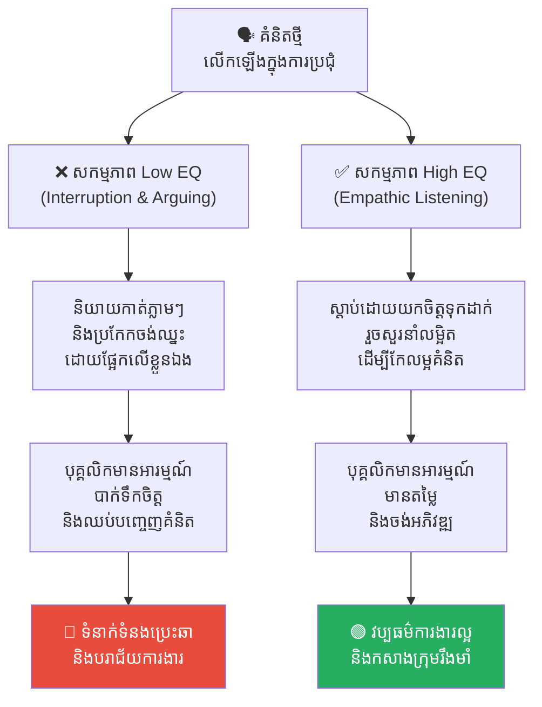
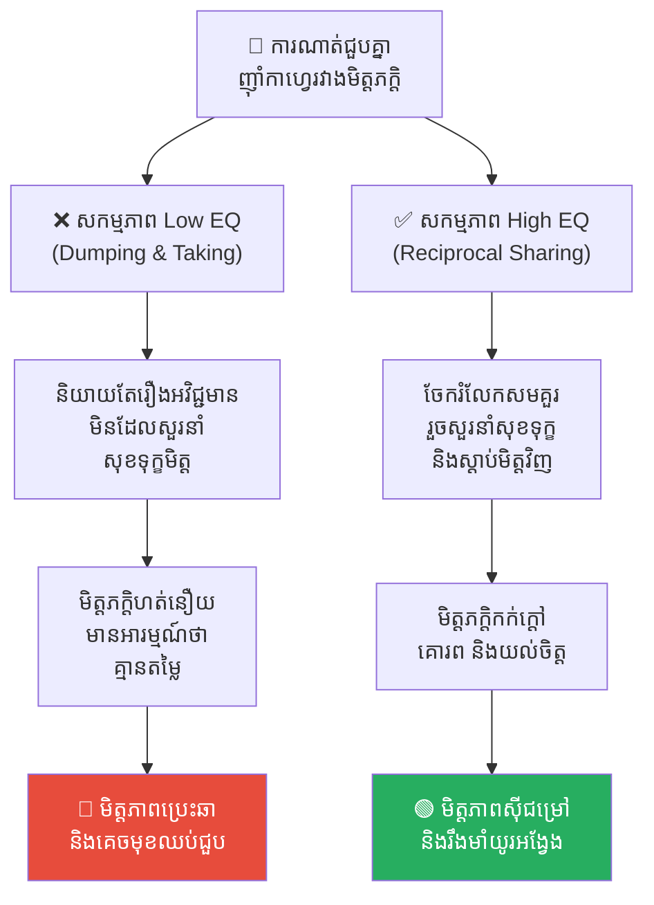
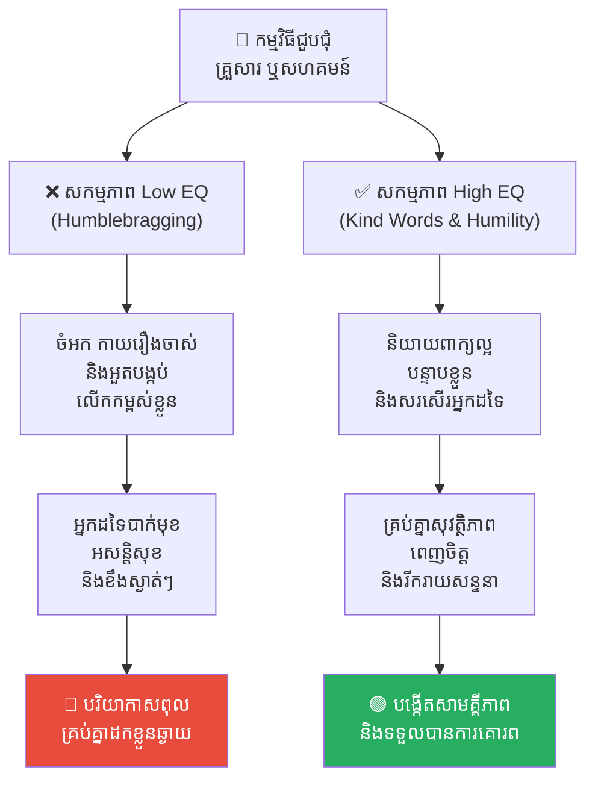
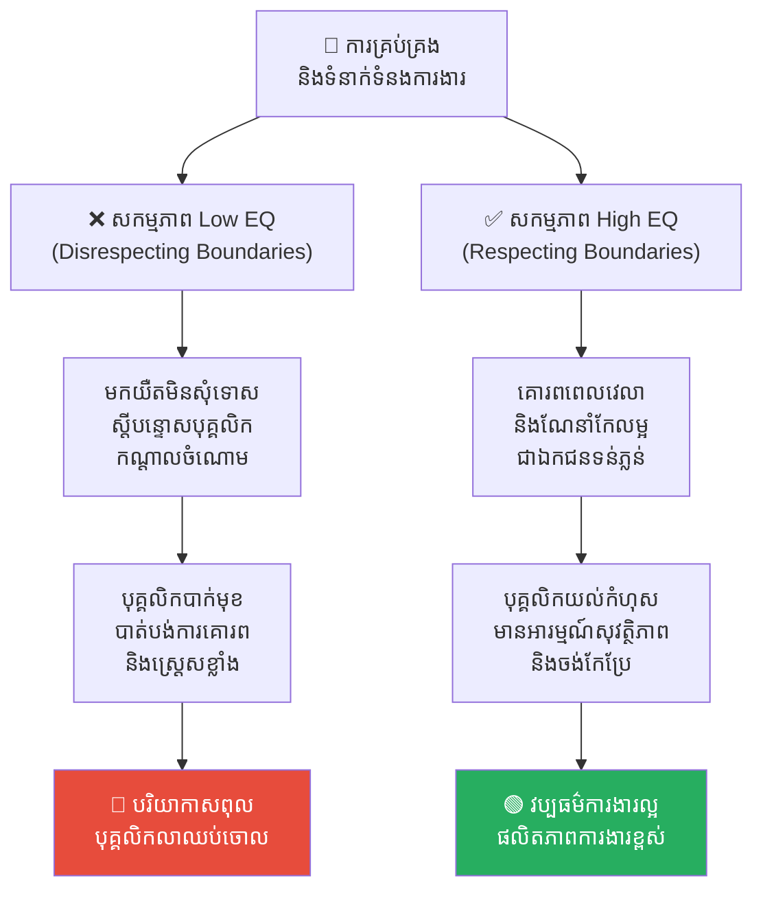
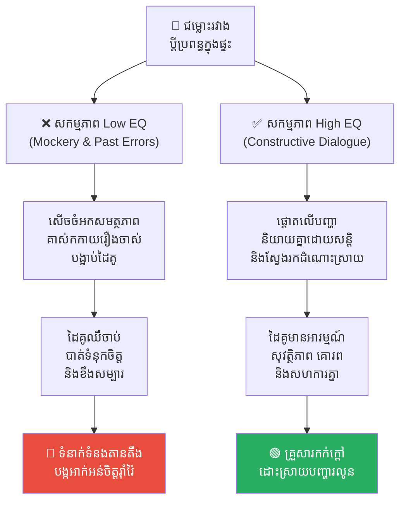
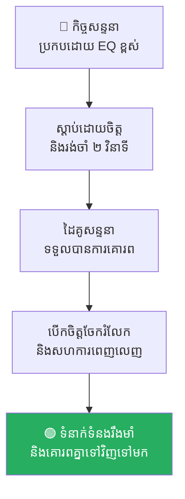

# វិទ្យាសាស្ត្រនៃការប្រាស្រ័យទាក់ទង៖ វិភាគលើចំណុចខ្វះ EQ ទាំង ១០ ក្នុងកិច្ចសន្ទនា (The Science of Communication: Analyzing 10 EQ Flaws in Conversation)

**Author:** ichamrong  
**Date:** 2026-05-17  
**Tags:** #communication #emotional-intelligence #psychology #personal-development #soft-skills  
**Category:** Concepts  
**Read Time:** ~16 min  

---

## 📌 មាតិកា (Table of Contents)
- [អន្ទាក់ផ្លូវចិត្ត (The Trap)](#អន្ទាក់ផ្លូវចិត្ត-the-trap)
- [១. បញ្ហា៖ ភាពពិការផ្នែកបញ្ញាស្មារតីក្នុងកិច្ចសន្ទនា (The Issue: Emotional Blindness)](#១-បញ្ហា-ភាពពិការផ្នែកបញ្ញាស្មារតីក្នុងកិច្ចសន្ទនា-the-issue-emotional-blindness)
- [២. ឧទាហរណ៍ជាក់ស្តែងក្នុងពិភពពិត (Real World Examples)](#២-ឧទាហរណ៍ជាក់ស្តែងក្នុងពិភពពិត)
  - [ឧទាហរណ៍ទី ១ — ការដណ្តើមវេទិកា និងប្រឆាំង (Interruption & Arguing)](#ឧទាហរណ៍ទី-១-ការដណ្តើមវេទិកា-និងប្រឆាំង-interruption-arguing)
  - [ឧទាហរណ៍ទី ២ — ធុងសម្រាមអារម្មណ៍ និងការមិនតបស្នង (Emotional Dumping & Parasitic Taking)](#ឧទាហរណ៍ទី-២-ធុងសម្រាមអារម្មណ៍-និងការមិនតបស្នង-emotional-dumping-parasitic-taking)
  - [ឧទាហរណ៍ទី ៣ — អាវុធពាក្យសម្តី និងការអួតបង្កប់ (Weaponizing Words & Humblebragging)](#ឧទាហរណ៍ទី-៣-អាវុធពាក្យសម្តី-និងការអួតបង្កប់-weaponizing-words-humblebragging)
  - [ឧទាហរណ៍ទី ៤ — ការមិនគោរពតម្លៃអ្នកដទៃ (Disrespecting Boundaries)](#ឧទាហរណ៍ទី-៤-ការមិនគោរពតម្លៃអ្នកដទៃ-disrespecting-boundaries)
  - [ឧទាហរណ៍ទី ៥ — ការសើចចំអកចំណុចខ្សោយ និងគាស់កកាយអតីតកាល (Mockery & Weaponizing Past Errors)](#ឧទាហរណ៍ទី-៥-ការសើចចំអកចំណុចខ្សោយ-និងគាស់កកាយអតីតកាល-mockery-weaponizing-past-errors)
- [៣. កត្តាជម្រុញ៖ អញនិយម និងអសន្តិសុខផ្លូវចិត្ត (The Aggravator: Ego and Insecurity)](#៣-កត្តាជម្រុញ-អញនិយម-និងអសន្តិសុខផ្លូវចិត្ត-the-aggravator-ego-and-insecurity)
- [៤. ដំណោះស្រាយទូទៅ (The General Solution)](#៤-ដំណោះស្រាយទូទៅ-the-general-solution)
- [សេចក្តីសន្និដ្ឋាន (Conclusion)](#សេចក្តីសន្និដ្ឋាន-conclusion)
- [Related Posts](#related-posts)

---

## អន្ទាក់ផ្លូវចិត្ត (The Trap)

តើអ្នកធ្លាប់គិតថាខ្លួនឯងជាមនុស្សដែលពូកែនិយាយ ឬពូកែទំនាក់ទំនងដែរឬទេ ដោយសារតែអ្នកអាចនិយាយបានច្រើន និងគ្មានការអៀនខ្មាស? 

មនុស្សជាច្រើនយល់ច្រឡំថា «ការប្រាស្រ័យទាក់ទង = ការនិយាយបញ្ចេញមតិ»។ ពួកគេប្រឹងប្រែងនិយាយឱ្យបានច្រើន ប្រកែកយកឈ្នះចាញ់ ឬប្រើប្រាស់ពាក្យសម្តីដើម្បីទាក់ទាញចំណាប់អារម្មណ៍។ ប៉ុន្តែយូរៗទៅ ពួកគេស្រាប់តែសម្គាល់ឃើញថា មិត្តភក្តិចាប់ផ្តើមដើរចេញឆ្ងាយ ទំនាក់ទំនងការងារប្រែជាតានតឹង ហើយគ្មាននរណាម្នាក់ចង់ចែករំលែករឿងរ៉ាវស៊ីជម្រៅជាមួយពួកគេឡើយ។

នេះគឺជាអន្ទាក់នៃការមាន **បញ្ញាស្មារតីទាប (Low EQ)** នៅក្នុងការប្រាស្រ័យទាក់ទង។ អ្នកប្រហែលជាកំពុងបង្កើតរបាំងផ្លូវចិត្តជាមួយអ្នកដទៃដោយមិនដឹងខ្លួន។

---

## ១. បញ្ហា៖ ភាពពិការផ្នែកបញ្ញាស្មារតីក្នុងកិច្ចសន្ទនា (The Issue: Emotional Blindness)

បញ្ញាស្មារតី (Emotional Intelligence - EQ) នៅក្នុងការសន្ទនា គឺជាសមត្ថភាពក្នុងការយល់ដឹងពីអារម្មណ៍ខ្លួនឯង និងដៃគូសន្ទនា។ កង្វះខាត EQ ស្តែងចេញតាមរយៈ **ទម្លាប់អាក្រក់ទាំង ១០** ដែលបំផ្លាញទំនាក់ទំនងយ៉ាងស្ងៀមស្ងាត់៖

1. **ចូលចិត្តនិយាយកាត់សម្តី៖** មិនទុកឱកាសឱ្យអ្នកដទៃនិយាយចប់។
2. **ប្រឆាំងគ្រប់រឿង៖** ចូលចិត្តប្រកែកយកឈ្នះជានិច្ច ទោះជារឿងតូចតាចគ្មានប្រយោជន៍។
3. **រអ៊ូរទាំគ្មានទីបញ្ចប់៖** យកអ្នកដទៃធ្វើជាធុងសម្រាមសម្រាប់បោះចោលអារម្មណ៍អវិជ្ជមានរបស់ខ្លួន។
4. **សើចចំអកចំណុចខ្សោយ៖** យកចំណុចខ្វះខាត ឬរូបរាងកាយអ្នកដទៃមកលេងសើចជាសាធារណៈ។
5. **គាស់កកាយអតីតកាល៖** យករឿងចាស់ ឬកំហុសឆ្គងពីមុនរបស់គេមកធ្វើជាអាវុធវាយប្រហារនៅពេលប្រកែកគ្នា។
6. **មិនគោរពពេលវេលា៖** តែងតែមកយឺតដោយមិនខ្វល់ខ្វាយពីការរង់ចាំ និងការលះបង់ពេលវេលារបស់អ្នកដទៃ។
7. **អួតបង្កប់ (Humblebragging)៖** ធ្វើជាត្អូញត្អែរ ឬបន្ទាបខ្លួនពីក្រៅ ប៉ុន្តែគោលបំណងពិតប្រាកដគឺបង្អួតប្រាប់គេពីភាពជោគជ័យ និងទ្រព្យសម្បត្តិ។
8. **មិនចេះសុំទោស៖** យល់ថាការទទួលស្គាល់កំហុស និងការសុំទោសគឺជាភាពទន់ខ្សោយ និងការបាត់បង់អំណាច។
9. **ប្រដៅកណ្តាលចំណោម៖** ធ្វើការកែតម្រូវ ឬស្តីបន្ទោសអ្នកដទៃនៅចំពោះមុខមនុស្សច្រើន ដើម្បីបង្កើនតម្លៃខ្លួនឯង ឬបង្ហាញអំណាចរបស់ខ្លួន។
10. **ទទួលតែមិនតបស្នង៖** ទាញយកផលប្រយោជន៍ ចំណេះដឹង ឬការស្តាប់បង្គាប់ពីកិច្ចសន្ទនាតែម្ខាង (Parasitic Taking) ដោយគ្មានការខ្វល់ខ្វាយពីតម្រូវការរបស់ដៃគូសន្ទនាឡើយ។

---

## ២. ឧទាហរណ៍ជាក់ស្តែងក្នុងពិភពពិត

សូមពិនិត្យមើលពីរបៀបដែលទម្លាប់ខ្វះ EQ ទាំងនេះបំផ្លាញទំនាក់ទំនងនៅក្នុងស្ថានភាពជាក់ស្តែង និងរបៀបដោះស្រាយវា៖

---

### ឧទាហរណ៍ទី ១ — ការដណ្តើមវេទិកា និងប្រឆាំង (Interruption & Arguing)

**ស្ថានភាព៖** នៅក្នុងការប្រជុំក្រុមការងារ បុគ្គលិកម្នាក់កំពុងលើកឡើងពីគំនិតច្នៃប្រឌិតថ្មីមួយ។ 

* **សកម្មភាព Low EQ (ទម្លាប់ទី ១ & ២)៖** ប្រធានក្រុមនិយាយកាត់ភ្លាមៗទាំងដែលគេនិយាយមិនទាន់ចប់ថា៖ *«ទេ! គំនិតនេះមិនដំណើរការទេ ខ្ញុំធ្លាប់ធ្វើវារួចហើយ។»* រួចក៏ព្យាយាមប្រកែករកត្រូវរហូតទាល់តែគំនិតនោះត្រូវទម្លាក់ចោលទាំងស្រុង។
* **សកម្មភាព High EQ (ដំណោះស្រាយ)៖** ទុកឱកាសឱ្យសមាជិកនិយាយចប់សិន រួចឆ្លើយតបថា៖ *«ល្អណាស់! គំនិតនេះគួរឱ្យចាប់អារម្មណ៍ខ្លាំងណាស់។ តើយើងអាចកែលម្អចំណុច X យ៉ាងដូចម្តេច ដើម្បីឱ្យវាដំណើរការបានកាន់តែល្អ?»*
* **លទ្ធផល៖** នៅក្រោមសកម្មភាព Low EQ បុគ្គលិកមានអារម្មណ៍បាក់ទឹកចិត្ត គ្មានតម្លៃ ហើយសម្រេចចិត្តបិទទ្វារគំនិតច្នៃប្រឌិតរបស់ខ្លួន ដោយឈប់បញ្ចេញមតិនៅពេលក្រោយទៀត។

---

### ឧទាហរណ៍ទី ២ — ធុងសម្រាមអារម្មណ៍ និងការមិនតបស្នង (Emotional Dumping & Parasitic Taking)

**ស្ថានភាព៖** ការណាត់ជួបគ្នាញ៉ាំកាហ្វេរវាងមិត្តភក្តិចាស់ពីរនាក់ដែលខានជួបគ្នាយូរ។

* **សកម្មភាព Low EQ (ទម្លាប់ទី ៣ & ១០)៖** មិត្តម្នាក់ចំណាយពេល ២ ម៉ោងពេញដើម្បីត្អូញត្អែរពីមេកន្លែងធ្វើការ វិបត្តិហិរញ្ញវត្ថុផ្ទាល់ខ្លួន និងរឿងរ៉ាវអវិជ្ជមានជាមួយដៃគូជីវិត (Emotional Dumping)។ នៅពេលមិត្តម្ខាងទៀតព្យាយាមនិយាយពីរឿងខ្លួនឯង គេស្រាប់តែបង្ហាញអាកប្បកិរិយាធុញទ្រាន់ មិនខ្វល់ខ្វាយ ឬបង្វែរសាច់រឿងត្រឡប់មកនិយាយពីរឿងខ្លួនឯងភ្លាមៗដោយគ្មានការតបស្នង (Parasitic Taking)។
* **សកម្មភាព High EQ (ដំណោះស្រាយ)៖** បន្ទាប់ពីបានចែករំលែកពីការលំបាករបស់ខ្លួនល្មមសមគួរហើយ ត្រូវចេះផ្អាកសិន រួចចោទសួរទៅកាន់មិត្តភក្តិវិញដោយក្តីបារម្ភថា៖ *«សុំទោសផងដែលនិយាយរឿងអវិជ្ជមានច្រើន! ចុះចំណែកឯងវិញ តើការងារ និងជីវិតថ្មីៗនេះយ៉ាងម៉េចដែរ?»* រួចស្តាប់ដោយការយល់ចិត្ត។
* **លទ្ធផល៖** មិត្តភក្តិម្ខាងទៀតមានអារម្មណ៍ហត់នឿយ និងមានអារម្មណ៍ថាខ្លួនគ្រាន់តែជា «ធុងសម្រាមអារម្មណ៍» សម្រាប់បឺតស្រូបថាមពលអវិជ្ជមានប៉ុណ្ណោះ។ នៅថ្ងៃក្រោយ ពួកគេនឹងព្យាយាមគេចវេសមិនចង់ជួបមុខ ឬឆ្លើយតបសារទៀតឡើយ។

---

### ឧទាហរណ៍ទី ៣ — អាវុធពាក្យសម្តី និងការអួតបង្កប់ (Weaponizing Words & Humblebragging)

**ស្ថានភាព៖** នៅក្នុងកម្មវិធីជួបជុំសហគមន៍ ឬពិធីជួបជុំក្រុមគ្រួសារ។

* **សកម្មភាព Low EQ (ទម្លាប់ទី ៤, ៥ & ៧)៖** សមាជិកម្នាក់និយាយលេងសើចឌឺដងពីទម្ងន់ និងរូបរាងកាយរបស់អ្នកដទៃ (Body Shaming) រួចគាស់កកាយរឿងប្រឡងធ្លាក់ ឬកំហុសឆ្គងកាលពី ១០ ឆ្នាំមុនរបស់គេមកនិយាយជាសាធារណៈឱ្យមនុស្សដទៃសើចចំអក។ បន្ទាប់មក ពួកគេធ្វើជាត្អូញត្អែរថា៖ *«ហត់ណាស់! ឡានថ្មីនេះទំនើបពេក ចុចមិនចង់ចេះទាល់តែសោះ!»* ឬ *«ធុញណាស់ ក្រុមហ៊ុនដំឡើងប្រាក់ខែឱ្យច្រើនពេក មិនដឹងយកទៅចាយអីអស់ទេ!»* ដើម្បីបង្អួតប្រាប់គេពីភាពមានបាន។
* **សកម្មភាព High EQ (ដំណោះស្រាយ)៖** ប្រើប្រាស់ពាក្យសម្តីដើម្បីលើកទឹកចិត្ត និងផ្តល់តម្លៃ។ ចៀសវាងការយកចំណុចខ្វះខាត ឬអតីតកាលរបស់អ្នកដទៃមកលេងសើច។ បង្ហាញភាពបន្ទាបខ្លួនពិតប្រាកដ និងកោតសរសើរជោគជ័យរបស់អ្នកដទៃដោយស្មោះត្រង់។
* **លទ្ធផល៖** បរិយាកាសប្រែជាតានតឹង គ្មានភាពស្មោះត្រង់ ហើយសមាជិកគ្រួសារមានអារម្មណ៍អសន្តិសុខ និងមិនចង់ស្និទ្ធស្នាលជាមួយបុគ្គលនោះឡើយ។

---

### ឧទាហរណ៍ទី ៤ — ការមិនគោរពតម្លៃអ្នកដទៃ (Disrespecting Boundaries)

**ស្ថានភាព៖** ទំនាក់ទំនងការងាររវាងប្រធាននាយកដ្ឋាន និងបុគ្គលិកថ្នាក់ក្រោម។

* **សកម្មភាព Low EQ (ទម្លាប់ទី ៦, ៨ & ៩)៖** ប្រធានណាត់ប្រជុំម៉ោង ៨ ព្រឹក តែខ្លួនឯងមកដល់ម៉ោង ៩ ដោយមិនបានសុំទោស ឬពន្យល់ពីហេតុផលសូម្បីមួយម៉ាត់ (មិនគោរពពេលវេលាអ្នកដទៃ)។ នៅពេលបុគ្គលិកធ្វើខុសបន្តិចបន្តួច មិនបានហៅទៅណែនាំដាច់ដោយឡែកទេ បែរជាស្រែកស្តីបន្ទោស ឬបង្អាប់កិត្តិយសពួកគេយ៉ាងខ្លាំងនៅកណ្តាលការិយាល័យឱ្យគេឯងឮទាំងអស់ (ប្រដៅកណ្តាលចំណោម)។
* **សកម្មភាព High EQ (ដំណោះស្រាយ)៖** គោរពពេលវេលារបស់បុគ្គលិក។ ប្រសិនបើមានការយឺតយ៉ាវ ត្រូវផ្ញើសារប្រាប់ជាមុន និងសុំទោសដោយស្មោះត្រង់។ អនុវត្តគោលការណ៍ «សរសើរជាសាធារណៈ ណែនាំជាឯកជន» ដើម្បីកែតម្រូវកំហុសបុគ្គលិកដោយរក្សាកិត្តិយសរបស់ពួកគេ។
* **លទ្ធផល៖** បុគ្គលិកបាត់បង់ការគោរពទាំងស្រុងចំពោះប្រធានការិយាល័យ ធ្វើឱ្យពួកគេមានអារម្មណ៍ភ័យខ្លាច និងធុញថប់នឹងបរិយាកាសការងារពុល (Toxic Workplace) ឈានទៅរកការធ្វើការងារត្រឹមតែបង្គ្រប់កិច្ច (Quiet Quitting) និងត្រៀមខ្លួនលាឈប់ភ្លាមៗនៅពេលមានឱកាស។

---

### ឧទាហរណ៍ទី ៥ — ការសើចចំអកចំណុចខ្សោយ និងគាស់កកាយអតីតកាល (Mockery & Weaponizing Past Errors)

**ស្ថានភាព៖** នៅក្នុងការសន្ទនារវាងប្តីប្រពន្ធនៅពេលមានការខ្វែងគំនិតគ្នារឿងការគ្រប់គ្រងហិរញ្ញវត្ថុក្នុងផ្ទះ។

* **សកម្មភាព Low EQ (ទម្លាប់ទី ៤ & ៥)៖** ស្វាមីនិយាយសើចចំអកភរិយាពីការទិញរបស់ខុស ឬគាស់កកាយរឿងប្រឡងធ្លាក់កាលពី ១០ ឆ្នាំមុនរបស់ភរិយាមកនិយាយបង្អាប់ជាសាធារណៈ ឬក្នុងផ្ទះថា៖ *«រៀនបានតែប៉ុណ្ណឹង ហើយទិញរបស់ក៏ល្ងង់ទៀត ចង់មកចាត់ចែងលុយកាក់អី!»*
* **សកម្មភាព High EQ (ដំណោះស្រាយ)៖** ផ្តោតលើបញ្ហាបច្ចុប្បន្ន មិនគាស់កកាយអតីតកាល ឬវាយប្រហារលើសមត្ថភាព និងចំណុចខ្សោយរបស់ដៃគូ។ ពិភាក្សាគ្នាដោយសន្តិវិធី និងសហការគ្នាស្វែងរកដំណោះស្រាយរួមគ្នា។
* **លទ្ធផល៖** នៅក្រោមសកម្មភាព Low EQ ភរិយាមានអារម្មណ៍ឈឺចាប់ បាក់មុខ និងបាក់ទំនុកចិត្តលើខ្លួនឯង។ ទំនាក់ទំនងប្តីប្រពន្ធកាន់តែតានតឹង ឆ្ងាយពីរង្វង់ពិភាក្សាប្រកបដោយការស្ថាបនា ហើយបង្កឱ្យមានការអាក់អន់ចិត្តរ៉ាំរ៉ៃ។

---

## ៣. កត្តាជម្រុញ៖ អញនិយម និងអសន្តិសុខផ្លូវចិត្ត (The Aggravator: Ego and Insecurity)

ហេតុអ្វីបានជាមនុស្សភាគច្រើនធ្លាក់ចូលក្នុងទម្លាប់អវិជ្ជមានទាំងនេះ?

1. **អញនិយម និងការចង់លេចធ្លោ (Egocentrism)៖** មនុស្សដែលយល់ថាខ្លួនឯងជាចំណុចកណ្តាលនៃសកលលោក តែងតែគិតថាគំនិត បញ្ហា និងពេលវេលារបស់ពួកគេមានតម្លៃជាងអ្នកដទៃជានិច្ច។ ពួកគេចង់ឱ្យពិភពលោកទាំងមូលបង្វិលជុំវិញពួកគេ។
2. **ភាពអសន្តិសុខខាងផ្លូវចិត្ត (Insecurity & Fragile Ego)៖** អ្នកដែលចូលចិត្តប្រកែកយកឈ្នះ ចំអកអ្នកដទៃ ឬមិនព្រមសុំទោស ជារឿយៗគឺជាអ្នកដែលមានទំនុកចិត្តលើខ្លួនឯងទាបបំផុត (Fragile Self-esteem)។ ពួកគេប្រើប្រាស់ទង្វើអវិជ្ជមានទាំងនេះជាខែលការពារភាពទន់ខ្សោយរបស់ខ្លួន ដើម្បីកុំឱ្យអ្នកដទៃមើលឃើញ ឬដើម្បីបិទបាំងភាពភ័យខ្លាចខាងក្នុងរបស់ពួកគេ។

---

## ៤. ដំណោះស្រាយទូទៅ (The General Solution)

ដើម្បីកសាង EQ ខ្ពស់នៅក្នុងការប្រាស្រ័យទាក់ទង អ្នកត្រូវផ្លាស់ប្តូរផ្នត់គំនិត និងអនុវត្តយុទ្ធសាស្ត្រខាងក្រោម៖

### អនុវត្តច្បាប់ "ផ្អាក ២ វិនាទី" (The 2-Second Rule)
កុំប្រញាប់ឆ្លើយតបភ្លាមៗ។ នៅពេលដៃគូសន្ទនានិយាយចប់ សូមរង់ចាំ ២ វិនាទីសិន មុននឹងបញ្ចេញមតិរបស់អ្នក។ វាបង្ហាញពីការផ្តល់កិត្តិយស និងធានាថាពួកគេពិតជាបាននិយាយចប់សព្វគ្រប់ ព្រមទាំងផ្តល់ពេលវេលាឱ្យខួរក្បាលរបស់អ្នកវិភាគឆ្លើយតបប្រកបដោយបញ្ញា។

### សរសើរជាសាធារណៈ ណែនាំជាឯកជន (Praise Publicly, Correct Privately)
កិត្តិយសជារឿងសំខាន់បំផុតរបស់មនុស្ស។ ប្រសិនបើចង់កែតម្រូវកំហុសអ្នកណាម្នាក់ ត្រូវហៅពួកគេមកនិយាយដាច់ដោយឡែកដោយប្រើសម្លេងទន់ភ្លន់ និងស្ថាបនា។ រីឯការកោតសរសើរ គួរធ្វើឡើងនៅចំពោះមុខមនុស្សច្រើនដើម្បីជម្រុញទឹកចិត្ត។

### ក្លាហានក្នុងការសុំទោស (The Courage to Apologize)
«សុំទោស ខ្ញុំខុសហើយ» មិនមែនជាពាក្យរបស់មនុស្សចាញ់ ឬទន់ខ្សោយនោះទេ តែជាពាក្យរបស់មនុស្សដែលមានទំនួលខុសត្រូវខ្ពស់ និងមានភាពចាស់ទុំខាងផ្លូវចិត្ត។ ការសុំទោសដោយស្មោះត្រង់ គឺជាស្ពានដ៏រឹងមាំបំផុតក្នុងការផ្សះផ្សារាល់ទំនាក់ទំនងដែលបាក់បែក។

### ផ្តល់តម្លៃស្មើភាពគ្នា (Give and Take)
កិច្ចសន្ទនាប្រៀបដូចជាការលេងវាយសី (Badminton)។ អ្នកត្រូវតែវាយត្រឡប់ទៅវិញទៅមក។ ពេលអ្នកនិយាយរឿងរបស់អ្នកចប់ ត្រូវចេះសួរនាំសុខទុក្ខ និងស្តាប់រឿងរ៉ាវរបស់ដៃគូសន្ទនាវិញដោយការយកចិត្តទុកដាក់ និង Empathy។

---

## សេចក្តីសន្និដ្ឋាន (Conclusion)

ការប្រាស្រ័យទាក់ទងប្រកបដោយប្រសិទ្ធភាព មិនមែនស្ថិតនៅលើភាពប៉ិនប្រសព្វក្នុងការនិយាយនោះទេ ប៉ុន្តែវាស្ថិតនៅលើសមត្ថភាពនៃការយល់ចិត្ត (Empathy)។ ការលុបបំបាត់ទម្លាប់អាក្រក់ទាំង ១០ នេះ គឺជាការបំបែករបាំងផ្លូវចិត្តដែលរារាំងអ្នកពីភាពជោគជ័យ។ នៅពេលដែលអ្នកផ្តោតលើការផ្តល់តម្លៃ និងគោរពអ្នកដទៃ នោះពិភពលោកទាំងមូលនឹងងាកមកគោរព និងស្រឡាញ់អ្នកដោយស្វ័យប្រវត្តិ។

---

## Related Posts

* **[01-confirmation-bias.md](./01-confirmation-bias.md)** — របៀបដែលខួរក្បាលជ្រើសរើសរកតែភស្តុតាងដែលខ្លួនចង់ឃើញ។
* **[02-five-whys-technique.md](./02-five-whys-technique.md)** — របៀបស្វែងរកឫសគល់នៃបញ្ហា ជំនួសឱ្យការបន្ទោសបុគ្គល។
* **[07-hedgehog-dilemma.md](./07-hedgehog-dilemma.md)** — របៀបស្វែងរកគម្លាតសុវត្ថិភាពនៅក្នុងទំនាក់ទំនងប្រចាំថ្ងៃ។

---

*Last updated: 2026-05-26*
