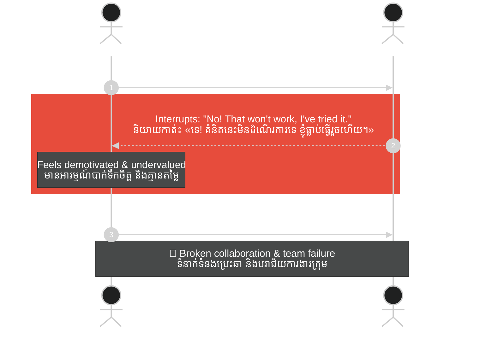
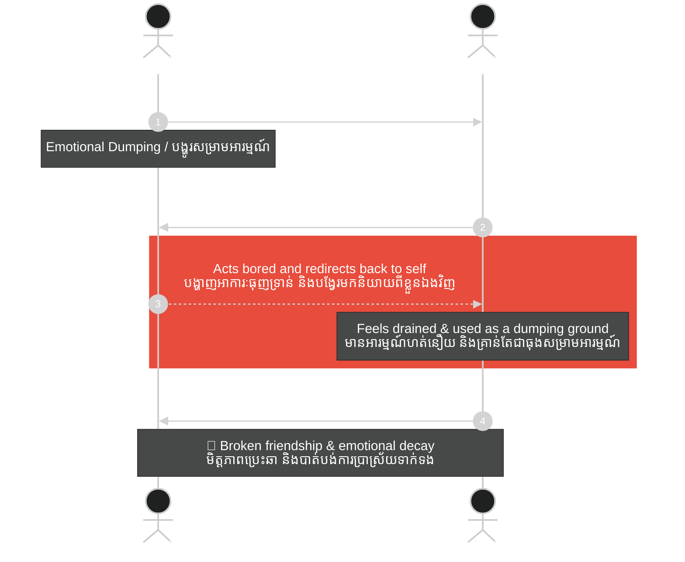
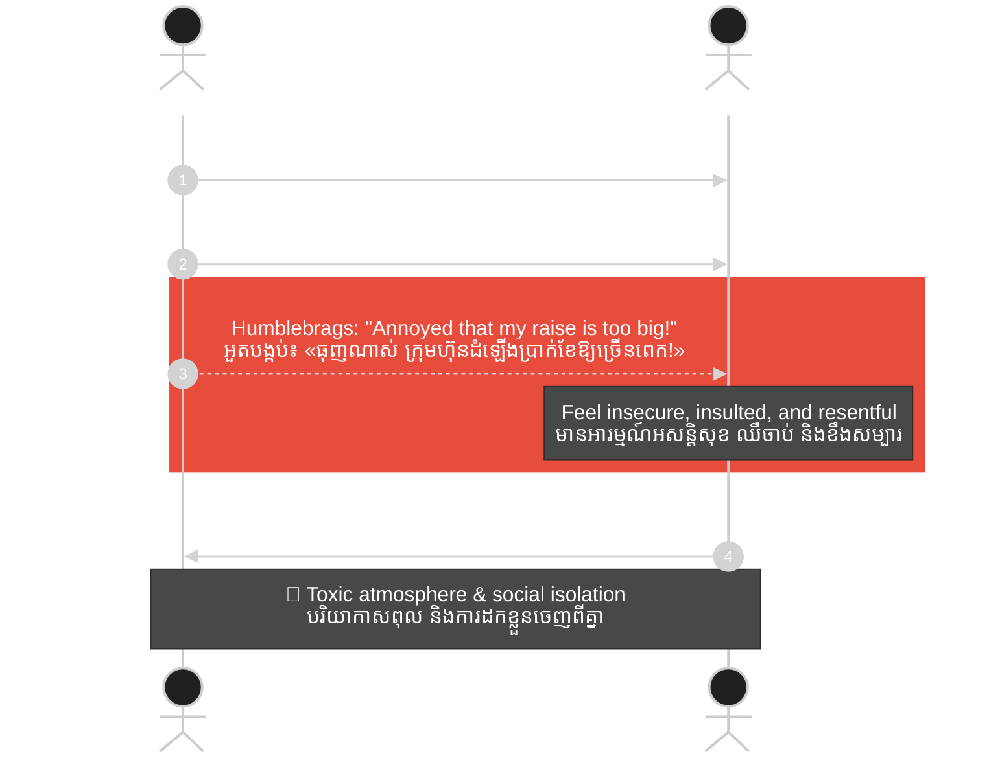
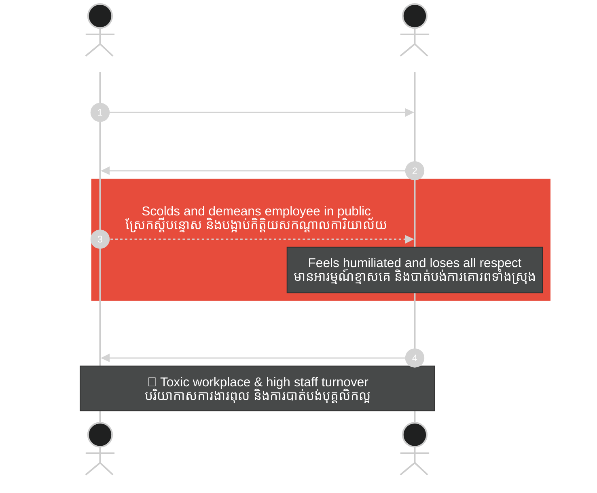
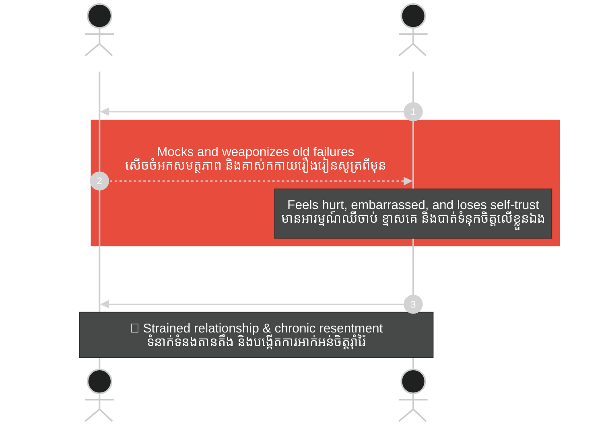
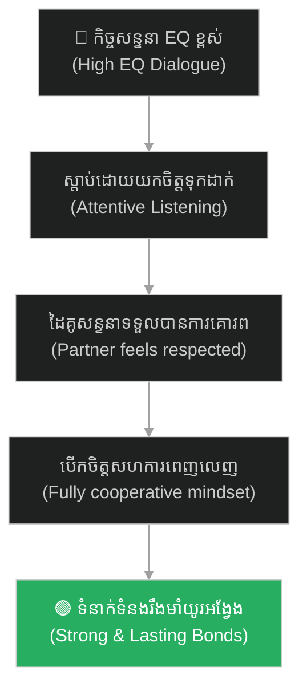

# វិទ្យាសាស្ត្រនៃការប្រាស្រ័យទាក់ទង៖ វិភាគលើចំណុចខ្វះ EQ ទាំង ១០ ក្នុងកិច្ចសន្ទនា (The Science of Communication: Analyzing 10 EQ Flaws in Conversation)

**Author:** ichamrong  
**Date:** 2026-06-04  
**Tags:** #communication #emotional-intelligence #psychology #personal-development #soft-skills  
**Category:** Concepts  
**Read Time:** ~20 min  

---

## 📌 មាតិកា (Table of Contents)
- [អន្ទាក់ផ្លូវចិត្ត (The Trap)](#0)
- [១. បញ្ហា៖ ភាពពិការផ្នែកអារម្មណ៍ក្នុងកិច្ចសន្ទនា (The Issue: Emotional Blindness in Conversation)](#1)
- [២. ឧទាហរណ៍ជាក់ស្តែងក្នុងពិភពពិត (Real World Examples)](#2)
  - [ឧទាហរណ៍ទី ១ — ការដណ្តើមវេទិកា និងប្រកែកតតាំង (Interruption & Arguing)](#2-1)
  - [ឧទាហរណ៍ទី ២ — ធុងសម្រាមអារម្មណ៍ និងការមិនតបស្នង (Emotional Dumping & Parasitic Taking)](#2-2)
  - [ឧទាហរណ៍ទី ៣ — អាវុធពាក្យសម្តី និងការអួតបង្កប់ (Weaponizing Words & Humblebragging)](#2-3)
  - [ឧទាហរណ៍ទី ៤ — ការមិនគោរពព្រំដែនអ្នកដទៃ (Disrespecting Boundaries)](#2-4)
  - [ឧទាហរណ៍ទី ៥ — ការសើចចំអកចំណុចខ្សោយ និងគាស់កកាយអតីតកាល (Mockery & Weaponizing Past Errors)](#2-5)
- [៣. កត្តាជម្រុញ៖ អញនិយម និងអសន្តិសុខផ្លូវចិត្ត (The Aggravator: Ego and Insecurity)](#3)
- [៤. ដំណោះស្រាយទូទៅ (The General Solution)](#4)
- [សេចក្តីសន្និដ្ឋាន (Conclusion)](#5)
- [ឯកសារយោង (References)](#6)
- [Related Posts](#7)

---

## អន្ទាក់ផ្លូវចិត្ត (The Trap)

តើអ្នកធ្លាប់គិតថាខ្លួនឯងជាមនុស្សដែលពូកែនិយាយ ឬពូកែទំនាក់ទំនងដែរឬទេ ដោយសារតែអ្នកអាចនិយាយបានច្រើន និងគ្មានការអៀនខ្មាស? 

Have you ever considered yourself a skilled communicator just because you can speak a lot without hesitation?

មនុស្សជាច្រើនយល់ច្រឡំថា «ការប្រាស្រ័យទាក់ទង = ការនិយាយបញ្ចេញមតិ»។ ពួកគេប្រឹងប្រែងនិយាយឱ្យបានច្រើន ប្រកែកយកឈ្នះចាញ់ ឬប្រើប្រាស់ពាក្យសម្តីដើម្បីទាក់ទាញចំណាប់អារម្មណ៍។ ប៉ុន្តែយូរៗទៅ ពួកគេស្រាប់តែសម្គាល់ឃើញថា មិត្តភក្តិចាប់ផ្តើមដើរចេញឆ្ងាយ ទំនាក់ទំនងការងារប្រែជាតានតឹង ហើយគ្មាននរណាម្នាក់ចង់ចែករំលែករឿងរ៉ាវស៊ីជម្រៅជាមួយពួកគេឡើយ។

Many people mistake "communication" for simply "speaking or expressing opinions." They strive to talk continuously, argue to win, or use words solely to draw attention. However, over time, they may notice friends drifting away, work relationships becoming strained, and no one willing to share deep, meaningful thoughts with them.

នេះគឺជាអន្ទាក់នៃការមាន **បញ្ញាស្មារតីទាប (Low EQ)** នៅក្នុងការប្រាស្រ័យទាក់ទង។ អ្នកប្រហែលជាកំពុងបង្កើតរបាំងផ្លូវចិត្តជាមួយអ្នកដទៃដោយមិនដឹងខ្លួន។

This is the trap of having **Low Emotional Intelligence (Low EQ)** in communication. You might be unconsciously building emotional barriers between yourself and others.

ដើម្បីងាយស្រួលតាមដាន នេះជាផែនទីបង្ហាញផ្លូវសម្រាប់អត្ថបទនេះ៖
1. **បញ្ហា (The Issue)** — តើអ្វីទៅជាភាពពិការផ្នែកអារម្មណ៍ក្នុងកិច្ចសន្ទនា?
2. **ឧទាហរណ៍ជាក់ស្តែង (Real World Examples)** — វិភាគលើទម្លាប់ខ្វះ EQ ទាំង ១០ ក្នុងស្ថានភាពជាក់ស្តែង និងរបៀបកែលម្អ។
3. **កត្តាជម្រុញ (The Aggravator)** — ហេតុអ្វីបានជាយើងធ្លាក់ចូលក្នុងទម្លាប់អវិជ្ជមានទាំងនេះ?
4. **ដំណោះស្រាយទូទៅ (The General Solution)** — វិធីសាស្ត្រកសាងទំនាក់ទំនងប្រកបដោយ EQ ខ្ពស់។

To make it easy to follow, here is the roadmap for this article:
1. **The Issue** — What is emotional blindness in conversation?
2. **Real World Examples** — Analyzing the 10 EQ flaws in practical situations and how to improve them.
3. **The Aggravator** — Why do we fall into these negative habits?
4. **The General Solution** — Methodologies to build high-EQ communication.

---

## ១. បញ្ហា៖ ភាពពិការផ្នែកអារម្មណ៍ក្នុងកិច្ចសន្ទនា (The Issue: Emotional Blindness in Conversation)

បញ្ញាស្មារតី (Emotional Intelligence - EQ) នៅក្នុងការសន្ទនា គឺជាសមត្ថភាពក្នុងការយល់ដឹងពីអារម្មណ៍ខ្លួនឯង និងដៃគូសន្ទនា។ កង្វះខាត EQ ស្តែងចេញតាមរយៈ **ទម្លាប់អាក្រក់ទាំង ១០** ដែលបំផ្លាញទំនាក់ទំនងយ៉ាងស្ងៀមស្ងាត់៖

Emotional Intelligence (EQ) in conversation is the ability to perceive and understand your own emotions as well as those of your conversational partner. A lack of EQ manifests through **10 bad habits** that quietly destroy relationships:

1. **ចូលចិត្តនិយាយកាត់សម្តី៖** មិនទុកឱកាសឱ្យអ្នកដទៃនិយាយចប់។  
   * **Constant Interruption:** Cutting people off and not allowing them to finish their thoughts.
2. **ប្រឆាំងគ្រប់រឿង៖** ចូលចិត្តប្រកែកយកឈ្នះជានិច្ច ទោះជារឿងតូចតាចគ្មានប្រយោជន៍។  
   * **Compulsive Defiance/Arguing:** The urge to argue and win every point, even over trivial and useless matters.
3. **រអ៊ូរទាំគ្មានទីបញ្ចប់៖** យកអ្នកដទៃធ្វើជាធុងសម្រាមសម្រាប់បោះចោលអារម្មណ៍អវិជ្ជមានរបស់ខ្លួន។  
   * **Endless Venting:** Treating others as emotional dumping grounds for one's own negative feelings.
4. **សើចចំអកចំណុចខ្សោយ៖** យកចំណុចខ្វះខាត ឬរូបរាងកាយអ្នកដទៃមកលេងសើចជាសាធារណៈ។  
   * **Mocking Weaknesses:** Making fun of others' flaws or physical appearances in public.
5. **គាស់កកាយអតីតកាល៖** យករឿងចាស់ ឬកំហុសឆ្គងពីមុនរបស់គេមកធ្វើជាអាវុធវាយប្រហារនៅពេលប្រកែកគ្នា។  
   * **Weaponizing the Past:** Digging up old mistakes or historical errors to attack someone during an argument.
6. **មិនគោរពពេលវេលា៖** តែងតែមកយឺតដោយមិនខ្វល់ខ្វាយពីការរង់ចាំ និងការលះបង់ពេលវេលារបស់អ្នកដទៃ។  
   * **Disregarding Time:** Constantly arriving late without regard for others' waiting or their sacrificed time.
7. **អួតបង្កប់ (Humblebragging)៖** ធ្វើជាត្អូញត្អែរ ឬបន្ទាបខ្លួនពីក្រៅ ប៉ុន្តែគោលបំណងពិតប្រាកដគឺបង្អួតប្រាប់គេពីភាពជោគជ័យ និងទ្រព្យសម្បត្តិ។  
   * **Humblebragging:** Complaining or acting humble on the surface while the true intent is to show off success or wealth.
8. **មិនចេះសុំទោស៖** យល់ថាការទទួលស្គាល់កំហុស និងការសុំទោសគឺជាភាពទន់ខ្សោយ និងការបាត់បង់អំណាច។  
   * **Refusing to Apologize:** Viewing admitting mistakes and apologizing as a sign of weakness or loss of power.
9. **ប្រដៅកណ្តាលចំណោម៖** ធ្វើការកែតម្រូវ ឬស្តីបន្ទោសអ្នកដទៃនៅចំពោះមុខមនុស្សច្រើន ដើម្បីបង្កើនតម្លៃខ្លួនឯង ឬបង្ហាញអំណាចរបស់ខ្លួន។  
   * **Public Criticizing:** Correcting or scolding someone in front of a crowd to boost one's own ego or showcase power.
10. **ទទួលតែមិនតបស្នង៖** ទាញយកផលប្រយោជន៍ ចំណេះដឹង ឬការស្តាប់បង្គាប់ពីកិច្ចសន្ទនាតែម្ខាង (Parasitic Taking) ដោយគ្មានការខ្វល់ខ្វាយពីតម្រូវការរបស់ដៃគូសន្ទនាឡើយ។  
    * **Parasitic Taking:** Extracting value, advice, or validation from a one-sided conversation without caring about the partner's needs.

---

## ២. ឧទាហរណ៍ជាក់ស្តែងក្នុងពិភពពិត (Real World Examples)

សូមពិនិត្យមើលពីរបៀបដែលទម្លាប់ខ្វះ EQ ទាំងនេះបំផ្លាញទំនាក់ទំនងនៅក្នុងស្ថានភាពជាក់ស្តែង និងរបៀបដោះស្រាយវា៖

Let us examine how these low-EQ habits destroy relationships in practical situations and look at how to resolve them:

---

### ឧទាហរណ៍ទី ១ — ការដណ្តើមវេទិកា និងប្រកែកតតាំង (Interruption & Arguing)

**ស្ថានភាព៖** នៅក្នុងការប្រជុំក្រុមការងារ បុគ្គលិកម្នាក់កំពុងលើកឡើងពីគំនិតច្នៃប្រឌិតថ្មីមួយ។ 

**Scenario:** During a team meeting, an employee is presenting a creative new idea.

* **សកម្មភាព Low EQ (ទម្លាប់ទី ១ & ២)៖** ប្រធានក្រុមនិយាយកាត់ភ្លាមៗទាំងដែលគេនិយាយមិនទាន់ចប់ថា៖ *«ទេ! គំនិតនេះមិនដំណើរការទេ ខ្ញុំធ្លាប់ធ្វើវារួចហើយ។»* រួចក៏ព្យាយាមប្រកែករកត្រូវរហូតទាល់តែគំនិតនោះត្រូវទម្លាក់ចោលទាំងស្រុង។
* **Party A (Low-EQ Action):** The team leader cuts them off mid-sentence, saying: *"No! That idea won't work, I've already tried it before."* They then argue their point aggressively until the idea is completely discarded.

* **សកម្មភាព High EQ (ដំណោះស្រាយ)៖** ទុកឱកាសឱ្យសមាជិកនិយាយចប់សិន រួចឆ្លើយតបថា៖ *«ល្អណាស់! គំនិតនេះគួរឱ្យចាប់អារម្មណ៍ខ្លាំងណាស់។ តើយើងអាចកែលម្អចំណុច X យ៉ាងដូចម្តេច ដើម្បីឱ្យវាដំណើរការបានកាន់តែល្អ?»*
* **Party B (High-EQ Action):** Allows the team member to finish presenting, then responds: *"Great! That is a very interesting concept. How can we improve area X to make it work even better?"*

* **លទ្ធផល៖** នៅក្រោមសកម្មភាព Low EQ បុគ្គលិកមានអារម្មណ៍បាក់ទឹកចិត្ត គ្មានតម្លៃ ហើយសម្រេចចិត្តបិទទ្វារគំនិតច្នៃប្រឌិតរបស់ខ្លួន ដោយឈប់បញ្ចេញមតិនៅពេលក្រោយទៀត។
* **The Result:** Under the low-EQ action, the employee feels demotivated, undervalued, and decides to shut down their creativity, choosing not to express any more ideas in the future.

---

### ឧទាហរណ៍ទី ២ — ធុងសម្រាមអារម្មណ៍ និងការមិនតបស្នង (Emotional Dumping & Parasitic Taking)

**ស្ថានភាព៖** ការណាត់ជួបគ្នាញ៉ាំកាហ្វេរវាងមិត្តភក្តិចាស់ពីរនាក់ដែលខានជួបគ្នាយូរ។

**Scenario:** A coffee meetup between two old friends who haven't seen each other in a long time.

* **សកម្មភាព Low EQ (ទម្លាប់ទី ៣ & ១០)៖** មិត្តម្នាក់ចំណាយពេល ២ ម៉ោងពេញដើម្បីត្អូញត្អែរពីមេកន្លែងធ្វើការ វិបត្តិហិរញ្ញវត្ថុផ្ទាល់ខ្លួន និងរឿងរ៉ាវអវិជ្ជមានជាមួយដៃគូជីវិត (Emotional Dumping)។ នៅពេលមិត្តម្ខាងទៀតព្យាយាមនិយាយពីរឿងខ្លួនឯង គេស្រាប់តែបង្ហាញអាកប្បកិរិយាធុញទ្រាន់ មិនខ្វល់ខ្វាយ ឬបង្វែរសាច់រឿងត្រឡប់មកនិយាយពីរឿងខ្លួនឯងភ្លាមៗដោយគ្មានការតបស្នង (Parasitic Taking)។
* **Party A (Low-EQ Action):** One friend spends the entire 2 hours complaining about their boss, their financial issues, and struggles with their partner (Emotional Dumping). When the other friend attempts to share their own updates, the first friend acts bored, distracted, or quickly redirects the conversation back to themselves (Parasitic Taking).

* **សកម្មភាព High EQ (ដំណោះស្រាយ)៖** បន្ទាប់ពីបានចែករំលែកពីការលំបាករបស់ខ្លួនល្មមសមគួរហើយ ត្រូវចេះផ្អាកសិន រួចចោទសួរទៅកាន់មិត្តភក្តិវិញដោយក្តីបារម្ភថា៖ *«សុំទោសផងដែលនិយាយរឿងអវិជ្ជមានច្រើន! ចុះចំណែកឯងវិញ តើការងារ និងជីវិតថ្មីៗនេះយ៉ាងម៉េចដែរ?»* រួចស្តាប់ដោយការយល់ចិត្ត។
* **Party B (High-EQ Action):** After sharing a reasonable amount of their struggles, they pause and ask with genuine concern: *"I'm sorry for venting so much! How about you? How have your work and life been lately?"* and then listen with empathy.

* **លទ្ធផល៖** មិត្តភក្តិម្ខាងទៀតមានអារម្មណ៍ហត់នឿយ និងមានអារម្មណ៍ថាខ្លួនគ្រាន់តែជា «ធុងសម្រាមអារម្មណ៍» សម្រាប់បឺតស្រូបថាមពលអវិជ្ជមានប៉ុណ្ណោះ។ នៅថ្ងៃក្រោយ ពួកគេនឹងព្យាយាមគេចវេសមិនចង់ជួបមុខ ឬឆ្លើយតបសារទៀតឡើយ។
* **The Result:** The other friend feels drained, realizing they were used simply as an "emotional dumping ground" to absorb negativity. In the future, they will avoid meetups or stop replying to messages.

---

### ឧទហរណ៍ទី ៣ — អាវុធពាក្យសម្តី និងការអួតបង្កប់ (Weaponizing Words & Humblebragging)

**ស្ថានភាព៖** នៅក្នុងកម្មវិធីជួបជុំសហគមន៍ ឬពិធីជួបជុំក្រុមគ្រួសារ។

**Scenario:** At a community gathering or a family reunion.

* **សកម្មភាព Low EQ (ទម្លាប់ទី ៤, ៥ & ៧)៖** សមាជិកម្នាក់និយាយលេងសើចឌឺដងពីទម្ងន់ និងរូបរាងកាយរបស់អ្នកដទៃ (Body Shaming) រួចគាស់កកាយរឿងប្រឡងធ្លាក់ ឬកំហុសឆ្គងកាលពី ១០ ឆ្នាំមុនរបស់គេមកនិយាយជាសាធារណៈឱ្យមនុស្សដទៃសើចចំអក។ បន្ទាប់មក ពួកគេធ្វើជាត្អូញត្អែរថា៖ *«ហត់ណាស់! ឡានថ្មីនេះទំនើបពេក ចុចមិនចង់ចេះទាល់តែសោះ!»* ឬ *«ធុញណាស់ ក្រុមហ៊ុនដំឡើងប្រាក់ខែឱ្យច្រើនពេក មិនដឹងយកទៅចាយអីអស់ទេ!»* ដើម្បីបង្អួតប្រាប់គេពីភាពមានបាន។
* **Party A (Low-EQ Action):** A family member makes mocking jokes about someone's weight and appearance (Body Shaming), or digs up a test failure or mistake from 10 years ago to laugh at in public. Later, they complain: *"So tired! This new car is too advanced, I can't even figure out the buttons!"* or *"It's so annoying that the company gave me such a huge raise, I don't even know how to spend all this money,"* trying to brag about their wealth.

* **សកម្មភាព High EQ (ដំណោះស្រាយ)៖** ប្រើប្រាស់ពាក្យសម្តីដើម្បីលើកទឹកចិត្ត និងផ្តល់តម្លៃ។ ចៀសវាងការយកចំណុចខ្វះខាត ឬអតីតកាលរបស់អ្នកដទៃមកលេងសើច។ បង្ហាញភាពបន្ទាបខ្លួនពិតប្រាកដ និងកោតសរសើរជោគជ័យរបស់អ្នកដទៃដោយស្មោះត្រង់។
* **Party B (High-EQ Action):** Uses words to encourage and value others. Avoids mocking flaws or bringing up past mistakes. Demonstrates genuine humility and praises others' success sincerely.

* **លទ្ធផល៖** បរិយាកាសប្រែជាតានតឹង គ្មានភាពស្មោះត្រង់ ហើយសមាជិកគ្រួសារមានអារម្មណ៍អសន្តិសុខ និងមិនចង់ស្និទ្ធស្នាលជាមួយបុគ្គលនោះឡើយ។
* **The Result:** The atmosphere becomes tense and insincere. Family members feel insecure and avoid getting close to that person.

---

### ឧទាហរណ៍ទី ៤ — ការមិនគោរពព្រំដែនអ្នកដទៃ (Disrespecting Boundaries)

**ស្ថានភាព៖** ទំនាក់ទំនងការងាររវាងប្រធាននាយកដ្ឋាន និងបុគ្គលិកថ្នាក់ក្រោម។

**Scenario:** Workplace relations between a department manager and subordinate staff.

* **សកម្មភាព Low EQ (ទម្លាប់ទី ៦, ៨ & ៩)៖** ប្រធានណាត់ប្រជុំម៉ោង ៨ ព្រឹក តែខ្លួនឯងមកដល់ម៉ោង ៩ ដោយមិនបានសុំទោស ឬពន្យល់ពីហេតុផលសូម្បីមួយម៉ាត់ (មិនគោរពពេលវេលាអ្នកដទៃ)។ នៅពេលបុគ្គលិកធ្វើខុសបន្តិចបន្តួច មិនបានហៅទៅណែនាំដាច់ដោយឡែកទេ បែរជាស្រែកស្តីបន្ទោស ឬបង្អាប់កិត្តិយសពួកគេយ៉ាងខ្លាំងនៅកណ្តាលការិយាល័យឱ្យគេឯងឮទាំងអស់ (ប្រដៅកណ្តាលចំណោម)។
* **Party A (Low-EQ Action):** The manager schedules an 8:00 AM meeting but arrives at 9:00 AM without a single word of apology or explanation (disregarding others' time). When an employee makes a minor mistake, instead of calling them in privately, the manager publicly scolds and demeans them in the middle of the office for everyone to hear (public criticizing).

* **សកម្មភាព High EQ (ដំណោះស្រាយ)៖** គោរពពេលវេលារបស់បុគ្គលិក។ ប្រសិនបើមានការយឺតយ៉ាវ ត្រូវផ្ញើសារប្រាប់ជាមុន និងសុំទោសដោយស្មោះត្រង់។ អនុវត្តគោលការណ៍ «សរសើរជាសាធារណៈ ណែនាំជាឯកជន» ដើម្បីកែតម្រូវកំហុសបុគ្គលិកដោយរក្សាកិត្តិយសរបស់ពួកគេ។
* **Party B (High-EQ Action):** Respects employees' time. If running late, they send a heads-up message and apologize sincerely. Practicing the principle of "Praise Publicly, Correct Privately" to correct employees' errors while preserving their dignity.

* **លទ្ធផល៖** បុគ្គលិកបាត់បង់ការគោរពទាំងស្រុងចំពោះប្រធានការិយាល័យ ធ្វើឱ្យពួកគេមានអារម្មណ៍ភ័យខ្លាច និងធុញថប់នឹងបរិយាកាសការងារពុល (Toxic Workplace) ឈានទៅរកការធ្វើការងារត្រឹមតែបង្គ្រប់កិច្ច (Quiet Quitting) និងត្រៀមខ្លួនលាឈប់ភ្លាមៗនៅពេលមានឱកាស។
* **The Result:** Employees lose all respect for the manager, feeling anxious and suffocated in a toxic workplace. This leads to quiet quitting and staff preparing to resign at the first opportunity.

---

### ឧទាហរណ៍ទី ៥ — ការសើចចំអកចំណុចខ្សោយ និងគាស់កកាយអតីតកាល (Mockery & Weaponizing Past Errors)

**ស្ថានភាព៖** នៅក្នុងការសន្ទនារវាងប្តីប្រពន្ធនៅពេលមានការខ្វែងគំនិតគ្នារឿងការគ្រប់គ្រងហិរញ្ញវត្ថុក្នុងផ្ទះ។

**Scenario:** A conversation between spouses when disagreeing over household financial management.

* **សកម្មភាព Low EQ (ទម្លាប់ទី ៤ & ៥)៖** ស្វាមីនិយាយសើចចំអកភរិយាពីការទិញរបស់ខុស ឬគាស់កកាយរឿងប្រឡងធ្លាក់កាលពី ១០ ឆ្នាំមុនរបស់ភរិយាមកនិយាយបង្អាប់ជាសាធារណៈ ឬក្នុងផ្ទះថា៖ *«រៀនបានតែប៉ុណ្ណឹង ហើយទិញរបស់ក៏ល្ងង់ទៀត ចង់មកចាត់ចែងលុយកាក់អី!»*
* **Party A (Low-EQ Action):** The husband mocks the wife for buying the wrong item or digs up a test failure from 10 years ago to demean her publicly or in front of the family: *"You only studied up to that level and make stupid purchases, yet you want to manage our money!"*

* **សកម្មភាព High EQ (ដំណោះស្រាយ)៖** ផ្តោតលើបញ្ហាបច្ចុប្បន្ន មិនគាស់កកាយអតីតកាល ឬវាយប្រហារលើសមត្ថភាព និងចំណុចខ្សោយរបស់ដៃគូ។ ពិភាក្សាគ្នាដោយសន្តិវិធី និងសហការគ្នាស្វែងរកដំណោះស្រាយរួមគ្នា។
* **Party B (High-EQ Action):** Focuses on the current issue without bringing up the past or attacking the partner's capabilities and weaknesses. Discusses peacefully and works together to find a mutual solution.

* **លទ្ធផល៖** នៅក្រោមសកម្មភាព Low EQ ភរិយាមានអារម្មណ៍ឈឺចាប់ បាក់មុខ និងបាក់ទំនុកចិត្តលើខ្លួនឯង។ ទំនាក់ទំនងប្តីប្រពន្ធកាន់តែតានតឹង ឆ្ងាយពីរង្វង់ពិភាក្សាប្រកបដោយការស្ថាបនា ហើយបង្កឱ្យមានការអាក់អន់ចិត្តរ៉ាំរ៉ៃ។
* **The Result:** Under low-EQ actions, the wife feels hurt, embarrassed, and loses self-confidence. Spousal relations grow tense, straying far from constructive dialogue and building chronic resentment.

---

## ៣. កត្តាជម្រុញ៖ អញនិយម និងអសន្តិសុខផ្លូវចិត្ត (The Aggravator: Ego and Insecurity)

ហេតុអ្វីបានជាមនុស្សភាគច្រើនធ្លាក់ចូលក្នុងទម្លាប់អវិជ្ជមានទាំងនេះ?

Why do most people fall into these negative habits?

1. **អញនិយម និងការចង់លេចធ្លោ (Egocentrism)៖** មនុស្សដែលយល់ថាខ្លួនឯងជាចំណុចកណ្តាលនៃសកលលោក តែងតែគិតថាគំនិត បញ្ហា និងពេលវេលារបស់ពួកគេមានតម្លៃជាងអ្នកដទៃជានិច្ច។ ពួកគេចង់ឱ្យពិភពលោកទាំងមូលបង្វិលជុំវិញពួកគេ។  
   * **Egocentrism and the Desire to Stand Out:** People who view themselves as the center of the universe always believe their ideas, issues, and time are more valuable than everyone else's. They want the entire world to revolve around them.
2. **ភាពអសន្តិសុខខាងផ្លូវចិត្ត (Insecurity & Fragile Ego)៖** អ្នកដែលចូលចិត្តប្រកែកយកឈ្នះ ចំអកអ្នកដទៃ ឬមិនព្រមសុំទោស ជារឿយៗគឺជាអ្នកដែលមានទំនុកចិត្តលើខ្លួនឯងទាបបំផុត (Fragile Self-esteem)។ ពួកគេប្រើប្រាស់ទង្វើអវិជ្ជមានទាំងនេះជាខែលការពារភាពទន់ខ្សោយរបស់ខ្លួន ដើម្បីកុំឱ្យអ្នកដទៃមើលឃើញ ឬដើម្បីបិទបាំងភាពភ័យខ្លាចខាងក្នុងរបស់ពួកគេ។  
   * **Emotional Insecurity & Fragile Ego:** Those who compulsively argue to win, mock others, or refuse to apologize are often the ones with the lowest self-esteem (Fragile Self-esteem). They use these hostile actions as a shield to hide their vulnerabilities from others or to mask their inner fears.

---

## ៤. ដំណោះស្រាយទូទៅ (The General Solution)

ដើម្បីកសាង EQ ខ្ពស់នៅក្នុងការប្រាស្រ័យទាក់ទង អ្នកត្រូវផ្លាស់ប្តូរផ្នត់គំនិត និងអនុវត្តយុទ្ធសាស្ត្រខាងក្រោម៖

To build high EQ in communication, you must shift your mindset and apply the following strategies:

### អនុវត្តច្បាប់ "ផ្អាក ២ វិនាទី" (The 2-Second Rule)

កុំប្រញាប់ឆ្លើយតបភ្លាមៗ។ នៅពេលដៃគូសន្ទនានិយាយចប់ សូមរង់ចាំ ២ វិនាទីសិន មុននឹងបញ្ចេញមតិរបស់អ្នក។ វាបង្ហាញពីការផ្តល់កិត្តិយស និងធានាថាពួកគេពិតជាបាននិយាយចប់សព្វគ្រប់ ព្រមទាំងផ្តល់ពេលវេលាឱ្យខួរក្បាលរបស់អ្នកវិភាគឆ្លើយតបប្រកបដោយបញ្ញា។

### The 2-Second Rule

Do not rush to reply immediately. When your conversation partner finishes speaking, wait for 2 seconds before voicing your thoughts. It demonstrates respect, ensures they have fully finished speaking, and gives your brain time to formulate an intelligent response.

### សរសើរជាសាធារណៈ ណែនាំជាឯកជន (Praise Publicly, Correct Privately)

កិត្តិយសជារឿងសំខាន់បំផុតរបស់មនុស្ស។ ប្រសិនបើចង់កែតម្រូវកំហុសអ្នកណាម្នាក់ ត្រូវហៅពួកគេមកនិយាយដាច់ដោយឡែកដោយប្រើសម្លេងទន់ភ្លន់ និងស្ថាបនា។ រីឯការកោតសរសើរ គួរធ្វើឡើងនៅចំពោះមុខមនុស្សច្រើនដើម្បីជម្រុញទឹកចិត្ត។

### Praise Publicly, Correct Privately

Dignity is a crucial aspect of human nature. If you wish to correct someone's mistake, pull them aside to speak privately with a gentle, constructive tone. Conversely, praise should be given in public to build motivation.

### ក្លាហានក្នុងការសុំទោស (The Courage to Apologize)

«សុំទោស ខ្ញុំខុសហើយ» មិនមែនជាពាក្យរបស់មនុស្សចាញ់ ឬទន់ខ្សោយនោះទេ តែជាពាក្យរបស់មនុស្សដែលមានទំនួលខុសត្រូវខ្ពស់ និងមានភាពចាស់ទុំខាងផ្លូវចិត្ត។ ការសុំទោសដោយស្មោះត្រង់ គឺជាស្ពានដ៏រឹងមាំបំផុតក្នុងការផ្សះផ្សារាល់ទំនាក់ទំនងដែលបាក់បែក។

### The Courage to Apologize

"I'm sorry, I was wrong" is not the vocabulary of a loser or a weakling, but of someone with high accountability and emotional maturity. A sincere apology is the strongest bridge to rebuild any fractured relationship.

### ផ្តល់តម្លៃស្មើភាពគ្នា (Give and Take)

កិច្ចសន្ទនាប្រៀបដូចជាការលេងវាយសី (Badminton)។ អ្នកត្រូវតែវាយត្រឡប់ទៅវិញទៅមក។ ពេលអ្នកនិយាយរឿងរបស់អ្នកចប់ ត្រូវចេះសួរនាំសុខទុក្ខ និងស្តាប់រឿងរ៉ាវរបស់ដៃគូសន្ទនាវិញដោយការយកចិត្តទុកដាក់ និង Empathy។

### Give and Take

Conversation is like playing badminton—you must hit the shuttlecock back and forth. Once you finish sharing your story, ask about their well-being and listen to their experiences with attentiveness and empathy.

---

## 🐇 ធ្លាក់ចូលក្នុងរន្ធទន្សាយនៃទំនាក់ទំនង (Enter the Relationship Rabbit Hole)

ដើម្បីស្វែងយល់កាន់តែស៊ីជម្រៅអំពីរបៀបរក្សាគម្លាតសុវត្ថិភាព និងការកសាងទំនាក់ទំនងប្រកបដោយផាសុកភាព សូមចាប់ផ្តើមដំណើររុករករបស់អ្នកដោយចុចលើតំណភ្ជាប់ខាងក្រោម៖

To delve deeper into maintaining a safe emotional distance and building comfortable relationships, begin your exploration by clicking the link below:

* 🚀 **[ចាប់ផ្តើមដំណើររុករក (Start the Journey) ➔ Hedgehog's Dilemma](./07-hedgehog-dilemma.md)**

---

## សេចក្តីសន្និដ្ឋាន (Conclusion)

> **«ការប្រាស្រ័យទាក់ទងប្រកបដោយប្រសិទ្ធភាព មិនមែនស្ថិតនៅលើភាពប៉ិនប្រសព្វក្នុងការនិយាយនោះទេ ប៉ុន្តែវាស្ថិតនៅលើសមត្ថភាពនៃការយល់ចិត្ត (Empathy)។ ការលុបបំបាត់ទម្លាប់អាក្រក់ទាំង ១០ នេះ គឺជាការបំបែករបាំងផ្លូវចិត្តដែលរារាំងអ្នកពីភាពជោគជ័យ។ នៅពេលដែលអ្នកផ្តោតលើការផ្តល់តម្លៃ និងគោរពអ្នកដទៃ នោះពិភពលោកទាំងមូលនឹងងាកមកគោរព និងស្រឡាញ់អ្នកដោយស្វ័យប្រវត្តិ។»**
> 
> **“Effective communication is not about eloquence in speech, but rather about the depth of your empathy. Eliminating these 10 bad habits breaks the emotional barriers that hinder your success. When you focus on providing value and respecting others, the world will naturally reciprocate with respect and affection.”**

---

## ឯកសារយោង (References)

* **Goleman, D.** — *Emotional Intelligence: Why It Can Matter More Than IQ* (1995)។ សៀវភៅមូលដ្ឋានគ្រឹះស្ដីពីបញ្ញាស្មារតី យន្តការខួរក្បាលក្នុងការគ្រប់គ្រងអារម្មណ៍ និងការអនុវត្ត EQ ក្នុងទំនាក់ទំនងសង្គម។
* **Carnegie, D.** — *How to Win Friends and Influence People* (1936)។ សៀវភៅណែនាំបុរាណស្ដីពីសិល្បៈនៃការប្រាស្រ័យទាក់ទង ការទាក់ទាញចិត្តមនុស្ស និងការចៀសវាងទំនាស់ក្នុងសង្គម។
* **Rosenberg, M. B.** — *Nonviolent Communication: A Language of Life* (2003)។ វិធីសាស្ត្រប្រាស្រ័យទាក់ទងដោយសន្តិវិធី ការស្ដាប់ដោយយកចិត្តទុកដាក់ និងការបញ្ចេញអារម្មណ៍ដោយមិនបង្កឱ្យមានការឈឺចាប់។

* **Goleman, D.** — *Emotional Intelligence: Why It Can Matter More Than IQ* (1995). The foundational work on emotional intelligence, detailing brain mechanisms of emotional self-regulation and application of EQ in social relations.
* **Carnegie, D.** — *How to Win Friends and Influence People* (1936). The classic guide on the arts of communication, winning people over, and avoiding interpersonal conflicts.
* **Rosenberg, M. B.** — *Nonviolent Communication: A Language of Life* (2003). Methodologies for compassionate communication, empathetic listening, and expressing feelings without causing hurt.

---

## Related Posts

* **[01-confirmation-bias.md](./01-confirmation-bias.md)** — Confirmation Bias (ការលំអៀងបញ្ជាក់អំណះអំណាង)៖ អន្ទាក់ចិត្តដែលបង្ខំយើងឱ្យស្តាប់តែអ្វីដែលយើងចង់ឮ។
* **[02-five-whys-technique.md](./02-five-whys-technique.md)** — The 5 Whys Technique (វិធីសាស្ត្រសួររកហេតុផល ៥ដង)៖ ស្វែងរកឫសគល់នៃបញ្ហា ជំនួសឱ្យការបន្ទោសបុគ្គល។
* **[07-hedgehog-dilemma.md](./07-hedgehog-dilemma.md)** — Hedgehog's Dilemma (ទ្វេគ្រោះរបស់សត្វកំប្រុកបន្លា)៖ របៀបស្វែងរកគម្លាតសុវត្ថិភាពក្នុងទំនាក់ទំនង។

---

*Last updated: 2026-06-04*

## Related

- [💡 Concepts README](../README.md)
- [📚 Main Repository README](../../../README.md)
- [Developer Habits](../../developer-habits/README.md)
- [Mental Health & Well-being](../../mental-health/README.md)
- [Management & SDLC](../../management/README.md)
