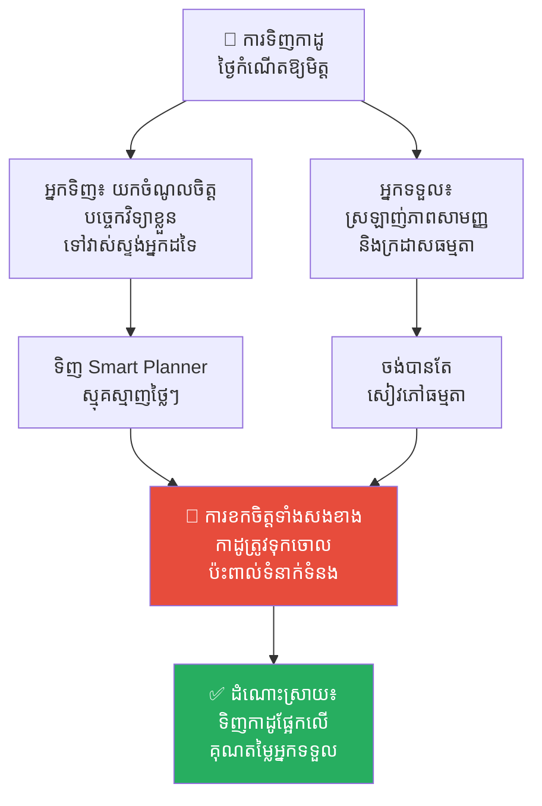
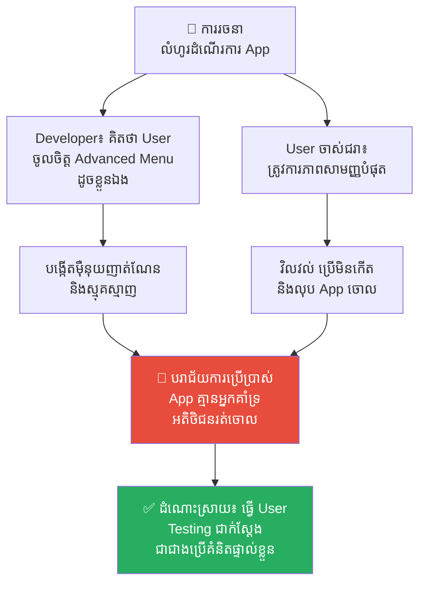
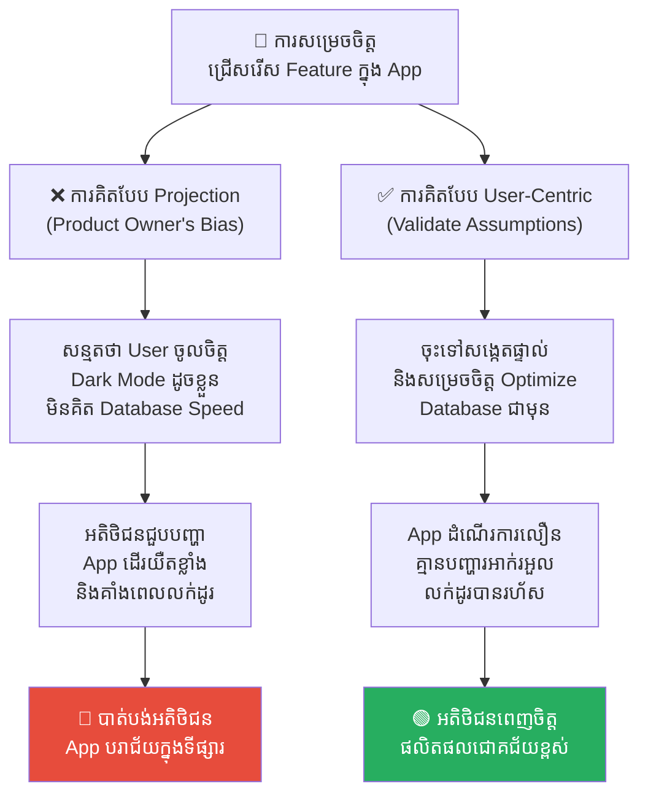
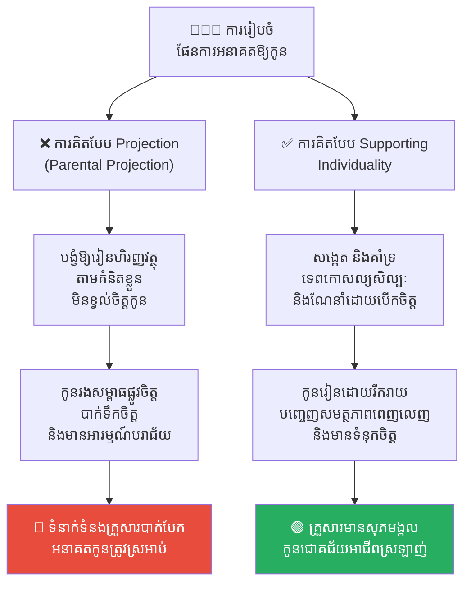
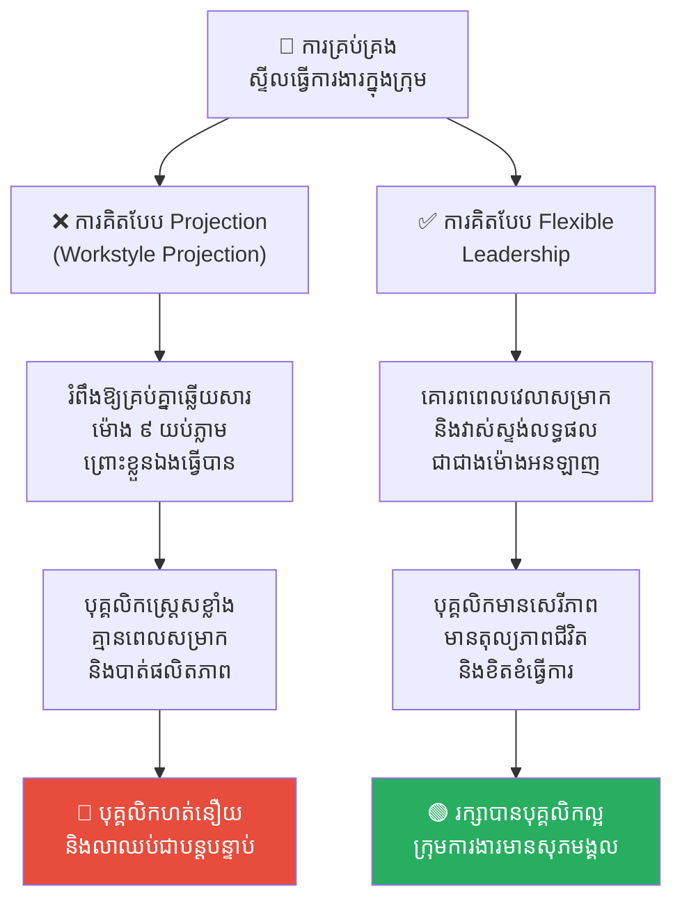

# The Projection Effect (ការយកគំនិតខ្លួនឯងទៅដាក់លើអ្នកដទៃ)៖ អន្ទាក់ចិត្តដែលគិតថាគ្រប់គ្នាគិតដូចអ្នក

**Author:** ichamrong  
**Date:** 2026-05-17  
**Tags:** #projection-effect #projection-bias #cognitive-bias #psychology #mental-models #empathy  
**Category:** Concepts  
**Read Time:** ~16 min  

---

## 📌 មាតិកា (Table of Contents)
- [អន្ទាក់ផ្លូវចិត្ត (The Trap)](#អន្ទាក់ផ្លូវចិត្ត-the-trap)
- [១. បញ្ហា៖ កញ្ចក់ឆ្លុះបញ្ចាំងបញ្ឆោតភ្នែក (The Issue: The False Mirror)](#១-បញ្ហា-កញ្ចក់ឆ្លុះបញ្ចាំងបញ្ឆោតភ្នែក-the-issue-the-false-mirror)
- [២. ឧទាហរណ៍ជាក់ស្តែងក្នុងពិភពពិត (Real World Examples)](#២-ឧទាហរណ៍ជាក់ស្តែងក្នុងពិភពពិត)
  - [ឧទាហរណ៍ទី ១ — កម្រិតស្រាល៖ ជម្រើសកាដូខុសគោលដៅ (The Gift-Giving Blunder)](#ឧទាហរណ៍ទី-១-កម្រិតស្រាល-ជម្រើសកាដូខុសគោលដៅ-the-gift-giving-blunder)
  - [ឧទាហរណ៍ទី ២ — កម្រិតមធ្យម (បច្ចេកទេស)៖ ជម្លោះរវាង Developer និង Designer (Developer vs. Designer)](#ឧទាហរណ៍ទី-២-កម្រិតមធ្យម-បច្ចេកទេស-ជម្លោះរវាង-developer-និង-designer-developer-vs-designer)
  - [ឧទាហរណ៍ទី ៣ — កម្រិតមធ្យម (ធុរកិច្ច)៖ លំអៀងរបស់ Product Owner (The Product Owner's Bias)](#ឧទាហរណ៍ទី-៣-កម្រិតមធ្យម-ធុរកិច្ច-លំអៀងរបស់-product-owner-the-product-owners-bias)
  - [ឧទាហរណ៍ទី ៤ — កម្រិតធ្ងន់៖ ការកំណត់អនាគត និងអាជីពឱ្យកូន (Parenting and Career Projection)](#ឧទាហរណ៍ទី-៤-កម្រិតធ្ងន់-ការកំណត់អនាគត-និងអាជីពឱ្យកូន-parenting-and-career-projection)
  - [ឧទាហរណ៍ទី ៥ — កម្រិតមធ្យម (ការគ្រប់គ្រង)៖ ការវាយតម្លៃបុគ្គលិកដោយផ្អែកលើស្ទីលធ្វើការងារផ្ទាល់ខ្លួន (Manager's Working Style Projection)](#ឧទាហរណ៍ទី-៥-កម្រិតមធ្យម-ការគ្រប់គ្រង-ការវាយតម្លៃបុគ្គលិកដោយផ្អែកលើស្ទីលធ្វើការងារផ្ទាល់ខ្លួន-managers-working-style-projection)
- [៣. កត្តាជម្រុញ៖ លំអៀងយកខ្លួនឯងជាកណ្តាល និងការខ្វះការយល់ចិត្ត (The Aggravator: Egocentric Bias & Lack of Empathy)](#៣-កត្តាជម្រុញ-លំអៀងយកខ្លួនឯងជាកណ្តាល-និងការខ្វះការយល់ចិត្ត-the-aggravator-egocentric-bias-lack-of-empathy)
- [៤. ដំណោះស្រាយទូទៅ (The General Solution)](#៤-ដំណោះស្រាយទូទៅ-the-general-solution)
  - [ការយល់ចិត្តសកម្ម និងការដាក់ខ្លួនក្នុងទស្សនៈអ្នកដទៃ (Active Empathy & Perspective Taking)](#ការយល់ចិត្តសកម្ម-និងការដាក់ខ្លួនក្នុងទស្សនៈអ្នកដទៃ-active-empathy-perspective-taking)
  - [ផ្ទៀងផ្ទាត់ការសន្មត់តាមរយៈការស្រាវជ្រាវ (Validate Assumptions through Research)](#ផ្ទៀងផ្ទាត់ការសន្មត់តាមរយៈការស្រាវជ្រាវ-validate-assumptions-through-research)
  - [ច្បាប់ផ្លាទីន (The Platinum Rule)](#ច្បាប់ផ្លាទីន-the-platinum-rule)
- [សេចក្តីសន្និដ្ឋាន (Conclusion)](#សេចក្តីសន្និដ្ឋាន-conclusion)
- [Related Posts](#related-posts)

---

## អន្ទាក់ផ្លូវចិត្ត (The Trap)

តើអ្នកធ្លាប់ណែនាំសៀវភៅ ភាពយន្ត ឬការងារណាមួយទៅកាន់អ្នកដទៃ ដោយជឿជាក់ ១០០% ថាពួកគេប្រាកដជាចូលចិត្តវាខ្លាំងណាស់ តែចុងក្រោយបែរជាឃើញពួកគេធុញទ្រាន់ ឬមិនខ្វល់សោះដែរឬទេ?

ឬក្នុងនាមជា Developer តើអ្នកធ្លាប់បង្កើត Feature មួយដោយគិតថា៖ *«វាសាមញ្ញ និងយល់បានស្រួលណាស់ នរណាក៏ចេះប្រើក្នុងរយៈពេល ២ វិនាទីដែរ»* ប៉ុន្តែពេលយកទៅឱ្យ User ធ្វើការតេស្តជាក់ស្តែង ពួកគេបែរជាវិលវល់ យល់ច្រឡំ និងចុចខុសម្តងហើយម្តងទៀតដែរឬទេ?

រឿងនេះកើតឡើងដោយសារតែខួរក្បាលរបស់យើងធ្លាក់ចូលទៅក្នុងអន្ទាក់ **Projection Effect (ឥទ្ធិពលនៃការយកគំនិតខ្លួនឯងទៅដាក់លើអ្នកដទៃ)**។ យើងតែងតែសន្មត់ដោយស្វ័យប្រវត្តថា ចំណូលចិត្ត គុណតម្លៃ ជំនឿ និងលំនាំនៃការគិតរបស់ខ្លួនយើង គឺត្រូវបានចែករំលែកជាសកលដោយមនុស្សជុំវិញខ្លួន។

---

## ១. បញ្ហា៖ កញ្ចក់ឆ្លុះបញ្ចាំងបញ្ឆោតភ្នែក (The Issue: The False Mirror)

**Projection Effect** (ឬ **Projection Bias**) គឺជាលំអៀងផ្លូវចិត្តមួយដែលយើងយករបៀបគិត អារម្មណ៍ និងគុណតម្លៃផ្ទាល់ខ្លួនទៅដាក់លើអ្នកដទៃ។ យើងវាយតម្លៃពិភពលោកមិនមែនតាមលក្ខខណ្ឌពិតរបស់វានោះទេ ប៉ុន្តែតាមរយៈ**កញ្ចក់ឆ្លុះបញ្ចាំងខ្លួនយើង**។

និយាយឱ្យសាមញ្ញ៖
* យើងជឿជាក់ថា ទស្សនៈ និងការយល់ឃើញរបស់យើង គឺជា**«ស្តង់ដារលំនាំដើម (Default/Normal)»** នៃពិភពលោក។
* ពេលអ្នកដទៃមិនយល់ស្រប ឬធ្វើខុសពីយើង យើងតែងតែវាយតម្លៃពួកគេភ្លាមថាជាមនុស្ស *«មិនឆ្លាត ខ្ជិល ឬចូលចិត្តបង្កបញ្ហា»* ជំនួសឱ្យការទទួលស្គាល់ថាពួកគេគ្រាន់តែមានគុណតម្លៃ និងតម្រូវការខុសពីយើងប៉ុណ្ណោះ។

```
❌ ការគិតខុស៖ "ចំណូលចិត្តរបស់ខ្ញុំ = ចំណូលចិត្តសកលលោក。"
✅ ការពិត៖ "ចំណូលចិត្តរបស់ខ្ញុំ = គ្រាន់តែជាទិន្នន័យ ១ ក្នុងចំណោមទិន្នន័យរាប់ពាន់លានប៉ុណ្ណោះ។"
```

---

## ២. ឧទាហរណ៍ជាក់ស្តែងក្នុងពិភពពិត

សូមពិនិត្យមើល **ឧទាហរណ៍ជាក់ស្តែងចំនួន ៥** ដែលជួបប្រទះក្នុងជីវិតប្រចាំថ្ងៃ ការងារ និងការគ្រប់គ្រង៖

---

### ឧទាហរណ៍ទី ១ — កម្រិតស្រាល៖ ជម្រើសកាដូខុសគោលដៅ (The Gift-Giving Blunder)

**ស្ថានភាព៖** ការទិញកាដូថ្ងៃកំណើតឱ្យមិត្តជិតស្និទ្ធម្នាក់។

* **ទស្សនៈរបស់អ្នក (The Tech Geek)៖** អ្នកស្រឡាញ់បច្ចេកវិទ្យា ឧបករណ៍ទំនើបៗ និង Smart devices។ អ្នកទិញសៀវភៅកត់ត្រាឌីជីថល (Smart Planner) ដ៏ទំនើប និងថ្លៃមួយ ដែលតម្រូវឱ្យមានការ Setup និងភ្ជាប់ប្រព័ន្ធស្មុគស្មាញរយៈពេល ៣០ នាទី។
* **ទស្សនៈរបស់មិត្តភក្តិ (The Minimalist)៖** ពួកគេចូលចិត្តភាពសាមញ្ញ មិនចូលចិត្តឧបករណ៍អេឡិចត្រូនិក និងមិនចង់ចំណាយពេល Setup អ្វីឡើយ។ អ្វីដែលពួកគេចង់បានគឺសៀវភៅសរសេរដៃក្រដាសធម្មតាដែលមានគុណភាពល្អ ឬប័ណ្ណផឹកកាហ្វេសាមញ្ញមួយ។
* **លទ្ធផល៖** សៀវភៅ Smart Planner ដ៏ថ្លៃនោះត្រូវបានគេទុកចោលក្នុងថតតុរហូតដល់ដុះធូលី ធ្វើឱ្យអ្នកមានអារម្មណ៍ខឹងថា *«ពួកគេមិនដឹងគុណសោះ»* ចំណែកមិត្តភក្តិក៏មានអារម្មណ៍ខុស (Guilty) ក្នុងការមិនប្រើប្រាស់។



---

### ឧទាហរណ៍ទី ២ — កម្រិតមធ្យម (បច្ចេកទេស)៖ ជម្លោះរវាង Developer និង Designer (Developer vs. Designer)

**ស្ថានភាព៖** ការរចនា Navigation Flow (លំហូរដំណើរការបញ្ជា) នៃ App ថ្មីមួយ។

* **Developer៖** ចូលចិត្តការប្រើប្រាស់ Keyboard Shortcuts, ម៉ឺនុយដែលមានជម្រើសកំណត់ច្រើន (Advanced Settings) និងផ្ទៃការងារដែលមានព័ត៌មានណែនណាប់។ ពួកគេយកចំណូលចិត្តនេះទៅដាក់លើប្រព័ន្ធ ដោយចង់ឱ្យមាន Nested Menus ស្មុគស្មាញ និង Layout ញាត់ណែន។
* **Designer៖** ដឹងថា Target Users របស់ App នេះ គឺជាមនុស្សចាស់ជរាដែលមិនសូវចេះបច្ចេកវិទ្យា ដែលត្រូវការប៊ូតុងចុចធំៗ ជម្រើសតិចបំផុត និងលំហូរដំណើរការត្រង់ៗងាយយល់ (Linear Flow)។
* **ជម្លោះ៖** Developer ជំទាស់ mockups របស់ Designer ដោយគិតថា៖ *«រចនាបែបនេះគឺងាយស្រួលពេកហើយ ដូចមើលងាយខួរក្បាល User ពេក។ ពួកគេចង់បាន Feature និងជម្រើសកំណត់ច្រើនជាងនេះ!»*
* **ការពិតដ៏ជូរចត់៖** Developer កំពុងយកសមត្ថភាពបច្ចេកវិទ្យាផ្ទាល់ខ្លួន និងចំណូលចិត្តរបស់ខ្លួន ទៅសន្មត់លើក្រុមមនុស្សចាស់ជរាដែលមានតម្រូវការផ្ទុយគ្នាស្រឡះ។



---

### ឧទាហរណ៍ទី ៣ — កម្រិតមធ្យម (ធុរកិច្ច)៖ លំអៀងរបស់ Product Owner (The Product Owner's Bias)

**ស្ថានភាព៖** នៅក្នុងគម្រោងអភិវឌ្ឍន៍ App គ្រប់គ្រងហាងលក់ដូរ។ Product Owner កំពុងសម្រេចចិត្តថាតើត្រូវបង្កើត Feature "Dark Mode" ដ៏ទាក់ទាញ ឬត្រូវ Optimize ល្បឿនស្វែងរក និងដំណើរការ Offline នៃ Database មុន។

* **Product Owner៖** ចូលចិត្តសោភ័ណភាព ស្រឡាញ់ UI ទំនើបៗ និងប្រើប្រាស់ទូរស័ព្ទលំដាប់ខ្ពស់ (High-end smartphone) ជាមួយអ៊ីនធឺណិតល្បឿនលឿន។ ពួកគេយកចំណូលចិត្តផ្ទាល់ខ្លួននេះទៅសន្មតលើ User ដោយគិតថា៖ *«Dark Mode គឺជា “របស់ដែលត្រូវតែមាន (Must-Have)” ដែលនឹងធ្វើឱ្យអតិថិជនលង់ស្រឡាញ់ App របស់យើងភ្លាម! រីឯល្បឿន Database គឺលឿនល្មមហើយ មិនចាំបាច់ធ្វើឥឡូវទេ!»*
* **អ្នកប្រើប្រាស់ពិតប្រាកដ (អាជីវករលក់ដូរ)៖** ភាគច្រើនប្រើទូរស័ព្ទកម្រិតមធ្យម និងប្រើអ៊ីនធឺណិតខ្សោយនៅក្នុងឃ្លាំងទំនិញ ឬតំបន់ដាច់ស្រយាល។ ពួកគេមិនខ្វល់រឿង Dark Mode ពណ៌អ្វីឡើយ ពួកគេត្រូវការតែល្បឿនស្វែងរកទំនិញរហ័ស និងមុខងារដំណើរការដោយគ្មានអ៊ីនធឺណិត (Offline Support) ប៉ុណ្ណោះ។
* **លទ្ធផល៖** ក្រុមការងារចំណាយពេល ២ Sprint បង្កើត Dark Mode ដ៏ស្រស់ស្អាត។ ប៉ុន្តែនៅពេលយកទៅឱ្យអាជីវករលក់ដូរប្រើប្រាស់ជាក់ស្តែង ពួកគេជួបប្រទះប្រព័ន្ធដំណើរការយឺតយ៉ាវ និងគាំងនៅពេលស្វែងរកមុខទំនិញ ធ្វើឱ្យពួកគេខឹងសម្បារ និងបោះបង់ App ចោលទៅប្រើប្រាស់ប្រព័ន្ធរបស់គូប្រជែងដែលសាមញ្ញតែដំណើរការលឿនជាង។



---

### ឧទាហរណ៍ទី ៤ — កម្រិតធ្ងន់៖ ការកំណត់អនាគត និងអាជីពឱ្យកូន (Parenting and Career Projection)

**ស្ថានភាព៖** ឪពុកម្តាយដែលជាអគ្គនាយកក្រុមហ៊ុនដ៏ជោគជ័យម្នាក់ កំពុងរៀបចំផែនការសិក្សា និងអាជីពនាពេលអនាគតឱ្យកូនប្រុសរបស់ខ្លួន។

* **ឪពុកម្តាយ៖** ជឿជាក់យ៉ាងមុតមាំថា សុភមង្គល និងជោគជ័យពិតប្រាកដនៃជីវិត គឺការមានអំណាច តួនាទីខ្ពង់ខ្ពស់ក្នុងក្រុមហ៊ុន និងការរកប្រាក់បានរាប់ម៉ឺនដុល្លារ។ ពួកគេយកមាត្រដ្ឋានគុណតម្លៃនេះទៅដាក់លើកូន ដោយបង្ខំកូនឱ្យរៀនផ្នែកហិរញ្ញវត្ថុ និងច្បាប់ ដោយគិតថា៖ *«នេះជាអ្វីដែលល្អបំផុតសម្រាប់វា គ្មានឪពុកម្តាយណាដែលចង់ឱ្យកូនលំបាកនោះទេ!»*
* **កូនប្រុស៖** 有និស្ស័យធម្មជាតិស្រឡាញ់សិល្បៈ ការគូរគំនូរ និងការរស់នៅស្ងប់ស្ងាត់។ គេចង់រស់នៅក្នុងពិភពច្នៃប្រឌិត និងស្វែងយល់ពីធម្មជាតិ មិនចង់ប្រកួតប្រជែងគ្នាក្នុងពិភពធុរកិច្ចឡើយ។
* **លទ្ធផលដ៏សោកសៅ៖** កូនប្រុសកើតមានជំងឺថប់បារម្ភ និងបាក់ទឹកចិត្តធ្ងន់ធ្ងរ រៀនផ្នែកហិរញ្ញវត្ថុមិនបានល្អ និងមានអារម្មណ៍ថាខ្លួនឯងជាកូនបរាជ័យពេញមួយជីវិត។ ទំនាក់ទំនងគ្រួសារត្រូវបាក់បែក និងឃ្លាតឆ្ងាយពីគ្នាទាំងស្រុង ចំណែកឯឪពុកម្តាយមានអារម្មណ៍ថាត្រូវកូនក្បត់ចិត្ត ដោយគិតថា៖ *«ខ្ញុំបានផ្តល់អ្វីៗគ្រប់យ៉ាងដែលខ្ញុំធ្លាប់ចង់បានឱ្យវាអស់ហើយ ហេតុអ្វីបានជាវានៅតែមិនដឹងគុណបែបនេះ?»*



---

### ឧទាហរណ៍ទី ៥ — កម្រិតមធ្យម (ការគ្រប់គ្រង)៖ ការវាយតម្លៃបុគ្គលិកដោយផ្អែកលើស្ទីលធ្វើការងារផ្ទាល់ខ្លួន (Manager's Working Style Projection)

**ស្ថានភាព៖** ថ្នាក់ដឹកនាំក្រុមការងារម្នាក់ជាមនុស្សដែលមានថាមពលខ្ពស់ (Workaholic) ចូលចិត្តឆ្លើយតបសារភ្លាមៗ និងធ្វើការងាររហូតដល់យប់ជ្រៅ។

* **សកម្មភាព Projection (Workstyle Projection)៖** ថ្នាក់ដឹកនាំសន្មតថាបុគ្គលិកគ្រប់គ្នាក្នុងក្រុមត្រូវតែមានស្ទីលធ្វើការងារដូចខ្លួន ដោយផ្ញើសារទាមទារការងារនៅម៉ោង ៩ យប់ និងរំពឹងឱ្យពួកគេឆ្លើយតបក្នុងរយៈពេល ៥ នាទី។ ពួកគេគិតថា៖ *«វាជាការងារសាមញ្ញសោះ ឆ្លើយតបសារបន្តិចមានអីលំបាក!»*
* **សកម្មភាព High EQ (Flexible Leadership)៖** ទទួលស្គាល់ និងគោរពលើសិទ្ធិ និងស្ទីលធ្វើការងារផ្ទាល់ខ្លួនរបស់សមាជិកម្នាក់ៗ។ បង្កើតគោលការណ៍ទំនាក់ទំនងច្បាស់លាស់ គោរពពេលវេលាសម្រាករបស់ពួកគេ និងវាស់ស្ទង់លទ្ធផលការងារជាជាងពេលវេលាអនឡាញ។
* **លទ្ធផល៖** នៅក្រោមសកម្មភាព Low EQ បុគ្គលិកមានអារម្មណ៍រងសម្ពាធផ្លូវចិត្តយ៉ាងធ្ងន់ធ្ងរ គ្មានការបែងចែកជីវិតផ្ទាល់ខ្លួន និងការងារ (No Work-Life Balance)។ ពួកគេមានអារម្មណ៍ធុញទ្រាន់ បាត់បង់ផលិតភាពការងារ និងចុងក្រោយសម្រេចចិត្តលាឈប់ពីការងារជាបន្តបន្ទាប់។



---

## ៣. កត្តាជម្រុញ៖ លំអៀងយកខ្លួនឯងជាកណ្តាល និងការខ្វះការយល់ចិត្ត (The Aggravator: Egocentric Bias & Lack of Empathy)

ហេតុអ្វីបានជាយើងតែងតែធ្លាក់ចូលទៅក្នុងអន្ទាក់ផ្លូវចិត្តនេះជានិច្ច?

1. **ការសន្មត់ខ្លួនឯងជាលំនាំដើម (Egocentric Default)៖** ខួរក្បាលរបស់មនុស្សគឺជាតួឯកនៅក្នុងសាច់រឿងរបស់ខ្លួន។ យើងធ្លាប់រស់នៅ និងឆ្លងកាត់ការពិសោធន៍ជីវិត ១០០% តាមរយៈញាណ និងការគិតផ្ទាល់ខ្លួន。ដូច្នេះ ការយកខ្លួនឯងធ្វើជា «ស្តង់ដារវាស់ស្ទង់» គឺជា Default កំណត់ដោយធម្មជាតិរបស់ខួរក្បាល ដើម្បីកាត់បន្ថយការប្រើប្រាស់ថាមពលក្នុងការវិភាគ។
2. **បណ្តាសានៃចំណេះដឹង (The Curse of Knowledge)៖** នៅពេលយើងចេះ ឬយល់ដឹងពីអ្វីមួយច្បាស់លាស់ហើយ (ដូចជាការសរសេរកូដ ឬរបៀបធ្វើការងារ) យើងពិបាកនឹងស្រមៃថាតើអារម្មណ៍របស់មនុស្សដែល *«មិនទាន់ចេះសោះ»* មានសភាពបែបណាណាស់។ យើងក៏យកចំណេះដឹងខ្លួនទៅសន្មត់លើអ្នកដទៃ ដែលនាំឱ្យមានការបណ្តុះបណ្តាល និងការប្រាស្រ័យទាក់ទងគ្នាខុសគោលដៅ។

---

## ៤. ដំណោះស្រាយទូទៅ (The General Solution)

តើយើងអាចបំបែកកញ្ចក់ឆ្លុះបញ្ចាំងបញ្ឆោតភ្នែកនេះដោយរបៀបណា?

### ការយល់ចិត្តសកម្ម និងការដាក់ខ្លួនក្នុងទស្សនៈអ្នកដទៃ (Active Empathy & Perspective Taking)
កុំសន្មត់ឱ្យសោះ។ ត្រូវសួរខ្លួនឯងថា៖ *«ប្រសិនបើខ្ញុំមានប្រវត្តិរូបដូចពួកគេ មានការភ័យខ្លាចដូចពួកគេ និងមានគោលដៅដូចពួកគេ តើខ្ញុំនឹងមើលឃើញបញ្ហានេះដោយរបៀបណា?»* បង្ខំខ្លួនឯងឱ្យដើរចេញពីប្រព័ន្ធគុណតម្លៃរបស់ខ្លួនឯង។

### ផ្ទៀងផ្ទាត់ការសន្មត់តាមរយៈការស្រាវជ្រាវ (Validate Assumptions through Research)
នៅក្នុងការសរសេរកូដ ការរចនា និងអាជីវកម្ម មតិផ្ទាល់ខ្លួន (Personal Opinions) គឺជាហានិភ័យដ៏ធំបំផុត។ ត្រូវបង្កើតទម្លាប់ធ្វើការតេស្តជានិច្ច៖
* ធ្វើ **User Interviews** ជាក់ស្តែង និងសង្កេតមើលរបៀបដែលពួកគេប្រើប្រាស់ផលិតផលរបស់អ្នកដោយគ្មានការជួយជ្រោមជ្រែងពីអ្នក។
* ដំណើរការ **A/B Testing** ដើម្បីអនុញ្ញាតឱ្យទង្វើជាក់ស្តែងរបស់ User ជាអ្នកសម្រេចចិត្ត មិនមែនយកការដេញដោលគ្នាក្នុងបន្ទប់ប្រជុំមកសម្រេចឡើយ។

### ច្បាប់ផ្លាទីន (The Platinum Rule)
យើងគ្រប់គ្នាត្រូវបានគេប្រដៅប្រដៅឱ្យអនុវត្តច្បាប់មាស (The Golden Rule)៖ *«ប្រព្រឹត្តទៅលើអ្នកដទៃ ដូចអ្វីដែល **អ្នក** ចង់ឱ្យគេប្រព្រឹត្តមកលើអ្នក»*。 

ប៉ុន្តែដើម្បីគេចផុតពី Projection Effect យើងត្រូវតែអនុវត្ត **«ច្បាប់ផ្លាទីន (The Platinum Rule)»** ជំនួសវិញ៖

> **«ប្រព្រឹត្តទៅលើអ្នកដទៃ ដូចអ្វីដែល ពួកគេ (THEY) ចង់ឱ្យយើងប្រព្រឹត្តទៅលើពួកគេ។»**

---

## សេចក្តីសន្និដ្ឋាន (Conclusion)

Projection Effect រំលាស់យើងថា ការគោរពពិតប្រាកដ — ទោះបីជាក្នុងការសរសេរកូដ ការដឹកនាំ គ្រួសារ ឬទំនាក់ទំនងផ្ទាល់ខ្លួន — គឺការអនុញ្ញាតឱ្យអ្នកដទៃមានគុណតម្លៃ ចំណុចខ្លាំង និងគោលដៅផ្ទាល់ខ្លួនរបស់ពួកគេ។ នៅពេលយើងឈប់ស្វែងរកតែរូបឆ្លុះបញ្ចាំងរបស់ខ្លួនឯងនៅក្នុងខ្លួនមនុស្សជុំវិញខ្លួន នោះយើងនឹងចាប់ផ្តើមយល់ចិត្តពួកគេជាមិនខាន។

---

## Related Posts

* **[01-confirmation-bias.md](./01-confirmation-bias.md)** — របៀបដែលយើងតម្រងភស្តុតាងដើម្បីតែបញ្ជាក់គំនិតខ្លួនឯង។
* **[Projection Effect (ការយកគំនិតខ្លួនឯងទៅដាក់លើអ្នកដទៃ)](../parables/01-projection-effect.md)** — រឿងព្រេងប្រវត្តិសាស្ត្រចិនរវាងស្តេច ជិន វិនកុង និង ជៀ ជឺធួយ។
* **[The Two Orchestras and the Silent Flute (អ្នកដឹកនាំភ្លេងពីររូប និងល្បែងសម្លេងស្ងាត់)](../parables/17-the-two-orchestras-and-the-silent-flute.md)** — ការយល់ឃើញពីការដឹកនាំបែប Servant Leadership ទល់នឹងការដឹកនាំបែប Heroic Leader projections។

---

*Last updated: 2026-05-26*
