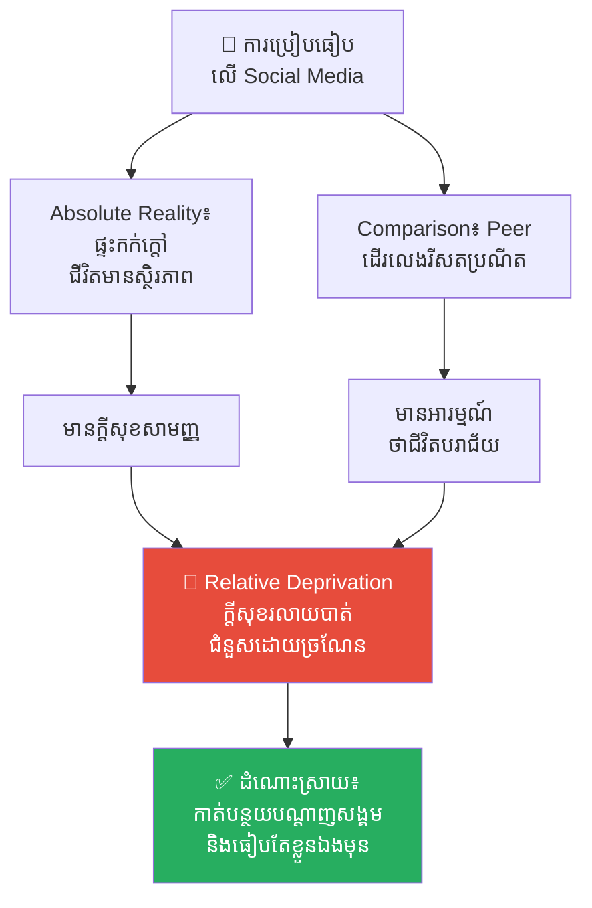
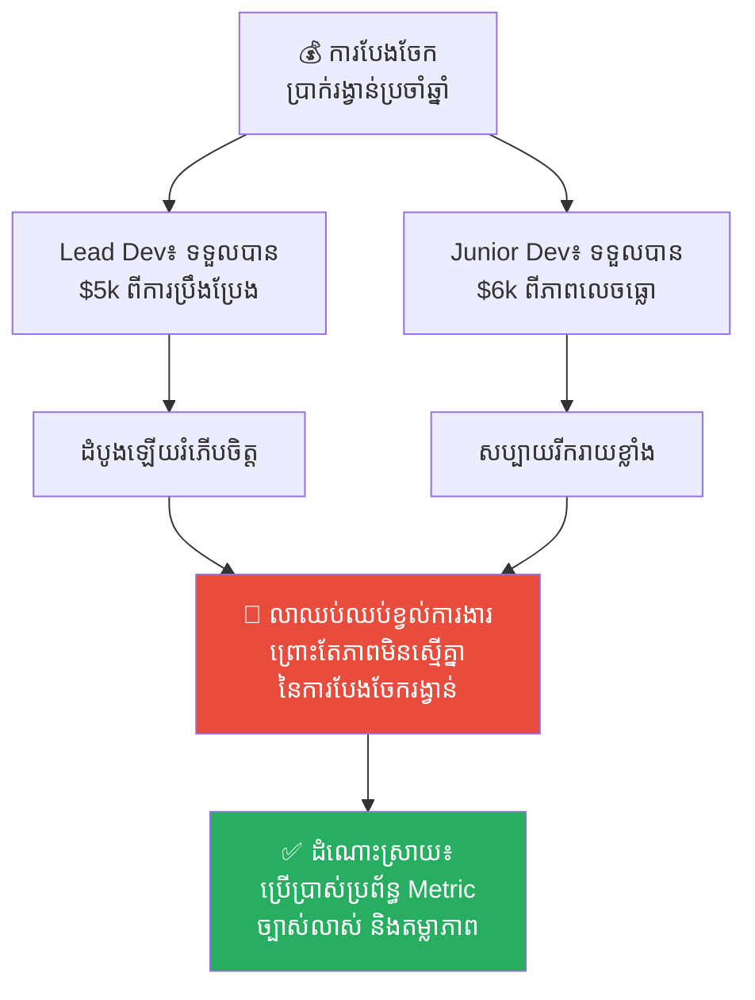
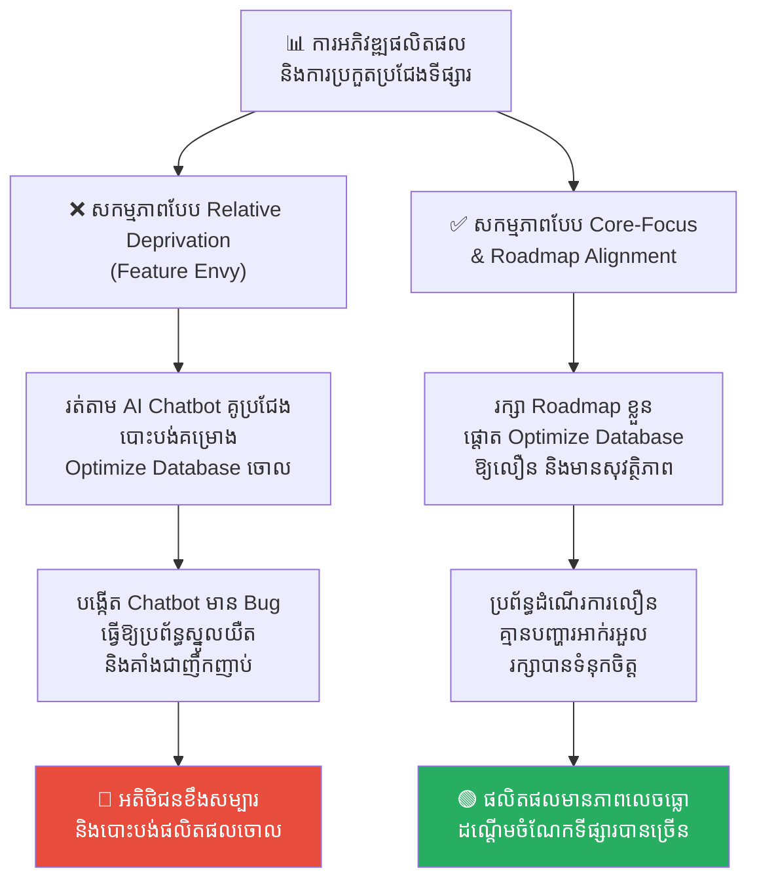
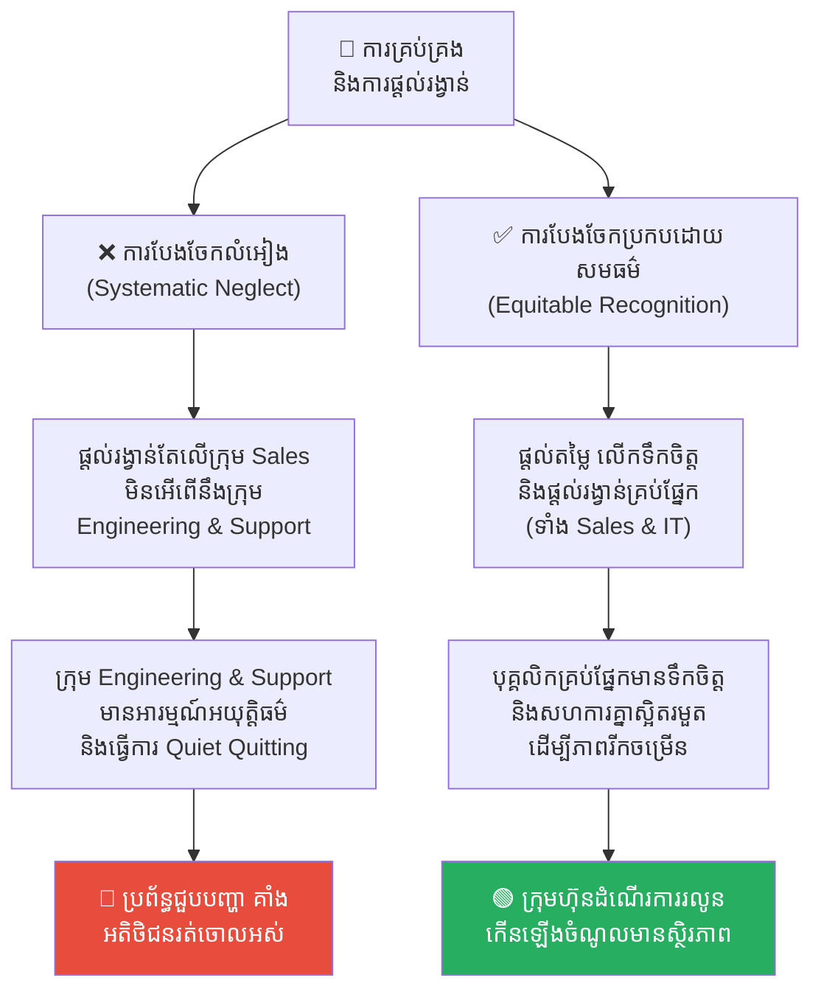
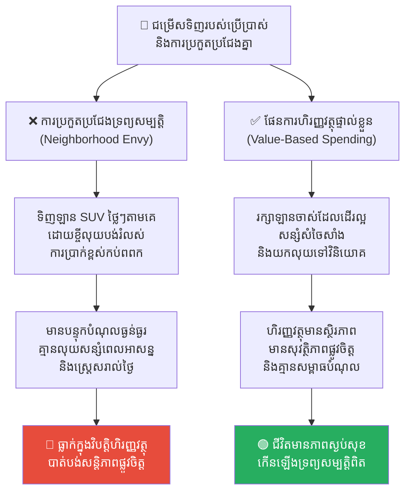

# The Relative Deprivation Effect (ឥទ្ធិពលនៃការដកហូតដោយការប្រៀបធៀប)៖ ការឈឺចាប់នៃការប្រៀបធៀបដែលមិនស្មើភាព

**Author:** ichamrong  
**Date:** 2026-05-17  
**Tags:** #relative-deprivation #psychology #mental-models #leadership #team-management #social-science  
**Category:** Concepts  
**Read Time:** ~16 min  

---

## 📌 មាតិកា (Table of Contents)
- [អន្ទាក់ផ្លូវចិត្ត (The Trap)](#អន្ទាក់ផ្លូវចិត្ត-the-trap)
- [១. បញ្ហា៖ ការឈឺចាប់នៃការប្រៀបធៀប «គេល្អជាង» (The Issue: The Pain of "Better Off" Comparison)](#១-បញ្ហា-ការឈឺចាប់នៃការប្រៀបធៀប-គេល្អជាង-the-issue-the-pain-of-better-off-comparison)
- [២. ឧទាហរណ៍ជាក់ស្តែងក្នុងពិភពពិត (Real World Examples)](#២-ឧទាហរណ៍ជាក់ស្តែងក្នុងពិភពពិត)
  - [ឧទាហរណ៍ទី ១ — កម្រិតស្រាល៖ ភាពច្រណែនលើបណ្តាញសង្គម (The Social Media Envy)](#ឧទាហរណ៍ទី-១-កម្រិតស្រាល-ភាពច្រណែនលើបណ្តាញសង្គម-the-social-media-envy)
  - [ឧទាហរណ៍ទី ២ — កម្រិតមធ្យម (បច្ចេកទេស)៖ ភាពមិនស្មើគ្នានៃប្រាក់រង្វាន់ (The Bonus Disparity)](#ឧទាហរណ៍ទី-២-កម្រិតមធ្យម-បច្ចេកទេស-ភាពមិនស្មើគ្នានៃប្រាក់រង្វាន់-the-bonus-disparity)
  - [ឧទាហរណ៍ទី ៣ — កម្រិតមធ្យម (ធុរកិច្ច)៖ ភាពចង់បានតាមគូប្រជែង (Competitor Feature Envy)](#ឧទាហរណ៍ទី-៣-កម្រិតមធ្យម-ធុរកិច្ច-ភាពចង់បានតាមគូប្រជែង-competitor-feature-envy)
  - [ឧទាហរណ៍ទី ៤ — កម្រិតធ្ងន់៖ ការមិនអើពើជាប្រព័ន្ធ និងការបះបោរស្ងាត់ (Systematic Neglect & Corporate Rebellion)](#ឧទាហរណ៍ទី-៤-កម្រិតធ្ងន់-ការមិនអើពើជាប្រព័ន្ធ-និងការបះបោរស្ងាត់-systematic-neglect-corporate-rebellion)
  - [ឧទាហរណ៍ទី ៥ — កម្រិតស្រាល (ការរស់នៅប្រចាំថ្ងៃ)៖ ការទិញរបស់ប្រើប្រាស់ទំនើបៗតាមអ្នកជិតខាង (Keeping up with the Joneses / Neighborhood Envy)](#ឧទាហរណ៍ទី-៥-កម្រិតស្រាល-ការរស់នៅប្រចាំថ្ងៃ-ការទិញរបស់ប្រើប្រាស់ទំនើបៗតាមអ្នកជិតខាង-keeping-up-with-the-joneses-neighborhood-envy)
- [៣. កត្តាជម្រុញ៖ គម្លាតជិតស្និទ្ធ និងលទ្ធភាពមើលឃើញ (The Aggravator: Proximity and Visibility)](#៣-កត្តាជម្រុញ-គម្លាតជិតស្និទ្ធ-និងលទ្ធភាពមើលឃើញ-the-aggravator-proximity-and-visibility)
- [៤. ដំណោះស្រាយទូទៅ (The General Solution)](#៤-ដំណោះស្រាយទូទៅ-the-general-solution)
  - [បង្កើតលក្ខខណ្ឌវិនិច្ឆ័យច្បាស់លាស់ និងតម្លាភាព (Transparent & Objective Criteria)](#បង្កើតលក្ខខណ្ឌវិនិច្ឆ័យច្បាស់លាស់-និងតម្លាភាព-transparent-objective-criteria)
  - [ទទួលស្គាល់តួនាទីដែលមើលមិនឃើញ (Acknowledge Invisible Roles)](#ទទួលស្គាល់តួនាទីដែលមើលមិនឃើញ-acknowledge-invisible-roles)
  - [ការវាយតម្លៃធៀបនឹងអតីតកាលខ្លួនឯង (Internal Benchmarking)](#ការវាយតម្លៃធៀបនឹងអតីតកាលខ្លួនឯង-internal-benchmarking)
- [សេចក្តីសន្និដ្ឋាន (Conclusion)](#សេចក្តីសន្និដ្ឋាន-conclusion)
- [Related Posts](#related-posts)

---

## អន្ទាក់ផ្លូវចិត្ត (The Trap)

ស្រមៃថាអ្នកទទួលបានការដំឡើងប្រាក់ខែ ១០%។ អ្នកមានអារម្មណ៍រំភើបរីករាយជាខ្លាំង។ អ្នកមានអារម្មណ៍ថាខ្លួនឯងមានតម្លៃ ជោគជ័យ និងគ្រោងរៀបចំអាហារពេលល្ងាចអបអរសាទរជាមួយក្រុមគ្រួសារយ៉ាងសប្បាយ។

លុះស្អែកឡើង អ្នកស្រាប់តែដឹងថា មិត្តរួមការងារម្នាក់ទៀត — ដែលធ្វើការងារដូចគ្នា និងមានបទពិសោធន៍ស្មើគ្នា — ទទួលបានការដំឡើងប្រាក់ខែរហូតដល់ ១៥%។

រំពេចនោះ ការដំឡើងប្រាក់ខែ ១០% របស់អ្នកលែងមានន័យភ្លាម។ ភាពសប្បាយរីករាយទាំងអស់បានរលាយបាត់ជំនួសមកវិញដោយភាពល្វីងជូរចត់ កំហឹង និងអារម្មណ៍ចង់រកការងារថ្មីភ្លាមៗ។ ស្ថានភាពជាក់ស្តែងរបស់អ្នក (Absolute Reality) មិនបានប្រែប្រួលទេ (អ្នកនៅតែមានលុយកើនឡើង ១០% ដដែល) ប៉ុន្តែ**ការពិតធៀប (Relative Reality)** របស់អ្នកត្រូវបានខូចខាតទាំងស្រុង។

នេះគឺជាសកម្មភាពនៃ **Relative Deprivation Effect (ឥទ្ធិពលនៃការដកហូតដោយការប្រៀបធៀប)**។

---

## ១. បញ្ហា៖ ការឈឺចាប់នៃការប្រៀបធៀប «គេល្អជាង» (The Issue: The Pain of "Better Off" Comparison)

**Relative Deprivation** គឺជាស្ថានភាពផ្លូវចិត្តនៃការមានអារម្មណ៍ថាត្រូវបានគេដកហូត ឬខ្វះខាតអ្វីមួយ (ដូចជា ឋានៈ ប្រាក់កាស ការទទួលស្គាល់ សិទ្ធិ) ដែលអ្នកជឿជាក់ថាខ្លួន**សមនឹងទទួលបាន** ដោយផ្អែកលើ**ការប្រៀបធៀបខ្លួនឯងទៅនឹងក្រុមមនុស្សជុំវិញខ្លួន**។

វាបង្រៀនយើងថា សុភមង្គល និងការពេញចិត្តរបស់មនុស្សមិនមែនជាលក្ខខណ្ឌដាច់ខាត (Absolute) នោះឡើយ៖
* យើងមិនវាស់ស្ទង់ភាពជោគជ័យរបស់យើងដោយផ្អែកលើ **«តើយើងបានដើរមកឆ្ងាយប៉ុណ្ណោះ»** នោះទេ។
* យើងវាស់ស្ទង់ភាពជោគជ័យរបស់យើងដោយផ្អែកលើ **«តើយើងនៅពីក្រោយអ្នកជិតខាងយើងប៉ុណ្ណា»**។

```
❌ ការពិតដាច់ខាត (Absolute Reality)៖ "ខ្ញុំទទួលបានការដំឡើង ១០%។ ជីវិតខ្ញុំល្អជាងមុន។"
✅ ការពិតធៀប (Relative Reality)៖ "គេទទួលបាន ១៥%។ ខ្ញុំអន់ជាងគេ ដូច្នេះខ្ញុំមានអារម្មណ៍ខឹងសម្បារ។"
```

---

## ២. ឧទាហរណ៍ជាក់ស្តែងក្នុងពិភពពិត

សូមពិនិត្យមើល **ឧទាហរណ៍ជាក់ស្តែងចំនួន ៥** បង្ហាញពីរបៀបដែលលំអៀងផ្លូវចិត្តនេះបំផ្លាញទំនាក់ទំនងការងារ និងស្ថិរភាពក្រុមការងារ៖

---

### ឧទាហរណ៍ទី ១ — កម្រិតស្រាល៖ ភាពច្រណែនលើបណ្តាញសង្គម (The Social Media Envy)

**ស្ថានភាព៖** ការអូសទស្សនាបណ្តាញសង្គម (Feed) នៅថ្ងៃសម្រាកចុងសប្តាហ៍។

* **ការពិតដាច់ខាត (Absolute Reality)៖** អ្នករស់នៅក្នុងផ្ទះដ៏កក់ក្តៅ មានការងារធ្វើដែលមានស្ថិរភាព និងរីករាយនឹងពេលវេលាសម្រាកចុងសប្តាហ៍យ៉ាងមានសន្តិភាព។
* **ការប្រៀបធៀប (The Comparison)៖** អ្នកឃើញរូបថតមិត្តរួមថ្នាក់ចាស់ម្នាក់កំពុងដើរលេងកម្សាន្តនៅរីសតលំដាប់ប្រណីតក្នុងប្រទេសស្វីស។
* **លទ្ធផល៖** អ្នកស្រាប់តែមានអារម្មណ៍ថាជីវិតខ្លួនឯងបរាជ័យ ផ្ទះខ្លួនឯងតូចចង្អៀត និងមានអារម្មណ៍ធុញទ្រាន់នឹងការងារបច្ចុប្បន្នភ្លាមៗ ដោយមើលរំលងការពិតថាអ្នកទើបតែមានក្តីសុខ ៥ នាទីមុននេះសោះ។



---

### ឧទាហរណ៍ទី ២ — កម្រិតមធ្យម (បច្ចេកទេស)៖ ភាពមិនស្មើគ្នានៃប្រាក់រង្វាន់ (The Bonus Disparity)

**ស្ថានភាព៖** ក្រុមហ៊ុន Startup បច្ចេកវិទ្យាមួយចែកប្រាក់រង្វាន់ប្រចាំឆ្នាំ (Bonus) ផ្អែកលើការយល់ឃើញផ្ទាល់ខ្លួនរបស់ Manager ជាជាងផ្អែកលើ Metric ច្បាស់លាស់។

* **Lead Developer៖** បានដឹកនាំការផ្លាស់ប្តូរស្ថាបត្យកម្មប្រព័ន្ធ (Architectural Migration) ដ៏ធំដោយជោគជ័យ។ ពួកគេទទួលបានប្រាក់រង្វាន់ $5,000 យ៉ាងច្រើន។
* **Junior Developer៖** ទើបតែចូលរួមការងារយឺតពេល ធ្វើការងារសាមញ្ញៗ ប៉ុន្តែមានវោហាសាស្ត្រល្អ និងចូលចិត្តជជែកជាមួយ CEO រាល់ថ្ងៃ។ ពួកគេទទួលបានប្រាក់រង្វាន់ $6,000 ដោយសារតែ «លេចធ្លោខ្លាំង»។
* **លទ្ធផល៖** ពេល Lead Developer ដឹងរឿងនេះភ្លាម ពួកគេឈប់ខិតខំប្រឹងប្រែងធ្វើការងារបន្ថែមភ្លាម ឈប់ជួយបណ្តុះបណ្តាលសមាជិកថ្មី និងលាឈប់ពីការងារក្នុងរយៈពេល ២ ខែក្រោយ។
* **ការពិតដ៏ជូរចត់៖** Lead Dev មិនមែនលាឈប់ដោយសារខ្វះខាតលុយ $1,000 នោះទេ ប៉ុន្តែលាឈប់ដោយសារតែ **ភាពមិនស្មើគ្នាធៀប (Relative Injustice)** នៃការបែងចែករង្វាន់។



---

### ឧទាហរណ៍ទី ៣ — កម្រិតមធ្យម (ធុរកិច្ច)៖ ភាពចង់បានតាមគូប្រជែង (Competitor Feature Envy)

**ស្ថានភាព៖** ក្រុមហ៊ុនអភិវឌ្ឍន៍ប្រព័ន្ធគ្រប់គ្រងគណនេយ្យ (Accounting System) មួយមានប្រព័ន្ធដែលដំណើរការល្អ ឥតខ្ចោះ ឥតមានកំហុស និងគ្មានការគាំង (No Crash) ឡើយ ដែលធ្វើឱ្យអតិថិជនស្រឡាញ់ខ្លាំង។ ស្រាប់តែថ្ងៃមួយ គូប្រជែងនៅលើទីផ្សារបានប្រកាសបើកដំណើរការ (Launch) មុខងារ AI Chatbot ថ្មីមួយ។

* **សកម្មភាព Relative Deprivation (Feature Envy)៖** Product Owner និងថ្នាក់ដឹកនាំមានអារម្មណ៍ថាខ្លួន «ត្រូវបានដកហូតឱកាស» និង «កំពុងចាញ់គូប្រជែង» យ៉ាងខ្លាំង (ទោះជា AI Chatbot មិនមែនជាតម្រូវការចម្បងរបស់ប្រព័ន្ធគណនេយ្យក៏ដោយ)។ ពួកគេបានសម្រេចចិត្តផ្អាកការងារ Database Optimization និងការកែលម្អប្រព័ន្ធសុវត្ថិភាពភ្លាម ដើម្បីបង្វែរធនធាន និងកម្លាំងវិស្វករទាំងអស់មកបង្កើត AI Chatbot ជាបន្ទាន់។
* **លទ្ធផល៖** ដោយសារតែប្រញាប់ប្រញាល់ពេក ក្រុមការងារបានបង្កើត AI Chatbot ដែលពោរពេញដោយ Bug និងដំណើរការមិនល្អ។ ស្របពេលជាមួយគ្នា គម្រោង Database Optimization ត្រូវបានបោះបង់ចោល ធ្វើឱ្យប្រព័ន្ធស្នូលគណនេយ្យចាប់ផ្តើមដើរយឺតខ្លាំង និងគាំងនៅពេលមានការប្រើប្រាស់ច្រើន។ អតិថិជនមានអារម្មណ៍ខឹងសម្បារព្រោះការងារចម្បងរបស់ពួកគេរអាក់រអួល ហើយចាប់ផ្តើមបោះបង់ប្រព័ន្ធគណនេយ្យនេះចោលដើម្បីទៅប្រើប្រាស់ប្រព័ន្ធរបស់គូប្រជែងផ្សេងទៀតដែលគ្មាន AI តែមានស្ថិរភាពល្អ។



---

### ឧទាហរណ៍ទី ៤ — កម្រិតធ្ងន់៖ ការមិនអើពើជាប្រព័ន្ធ និងការបះបោរស្ងាត់ (Systematic Neglect & Corporate Rebellion)

**ស្ថានភាព៖** នៅក្នុងក្រុមហ៊ុនបច្ចេកវិទ្យាមួយ ថ្នាក់ដឹកនាំសម្រេចចិត្តផ្តល់រង្វាន់ ប្រាក់កម្រៃជើងសារខ្ពស់ (High Commission) និងការសរសើរជាសាធារណៈតែទៅលើក្រុមផ្នែកលក់ (Sales Team) ប៉ុណ្ណោះ ព្រោះយល់ថាពួកគេជាអ្នករកលុយមកឱ្យក្រុមហ៊ុន។

* **សកម្មភាព Relative Deprivation (Systematic Neglect)៖** ក្រុមវិស្វករ (Engineers) និងក្រុមគាំទ្រអតិថិជន (Customer Support) មានអារម្មណ៍ «ត្រូវបានដកហូតសិទ្ធិ និងតម្លៃ» យ៉ាងខ្លាំង។ ពួកគេមានអារម្មណ៍ថាទោះជាពួកគេខិតខំប្រឹងប្រែងដោះស្រាយបញ្ហាបច្ចេកទេស និងគាំទ្រអតិថិជនទាំងយប់ទាំងថ្ងៃយ៉ាងណាក៏ដោយ ក៏ក្រុមហ៊ុនចាត់ទុកពួកគេជា «បុគ្គលិកថ្នាក់ទី ២» ជានិច្ច។
* **លទ្ធផល៖** ក្រុមវិស្វករ និងក្រុម Support ចាប់ផ្តើមធ្វើការបះបោរស្ងាត់ (Quiet Quitting) ដោយធ្វើការត្រឹមតែបង្គ្រប់កិច្ច ឈប់យកចិត្តទុកដាក់នឹងការព្រមានប្រព័ន្ធ (Server Alerts) និងឆ្លើយតបសំណួរអតិថិជនយឺតយ៉ាវ។ ស្ថិរភាពប្រព័ន្ធធ្លាក់ចុះ ផលិតផលជួបបញ្ហា Crash ញឹកញាប់ និងអត្រាអតិថិជនឈប់ប្រើប្រាស់សេវាកម្ម (Churn Rate) កើនឡើង ៣ ដង ដែលវាយកម្ទេចរាល់ចំណូលថ្មីដែលក្រុម Sales រកបានទាំងស្រុង។



---

### ឧទាហរណ៍ទី ៥ — កម្រិតស្រាល (ការរស់នៅប្រចាំថ្ងៃ)៖ ការទិញរបស់ប្រើប្រាស់ទំនើបៗតាមអ្នកជិតខាង (Keeping up with the Joneses / Neighborhood Envy)

**ស្ថានភាព៖** គ្រួសារមួយមានជីវភាពធូរធារល្មម និងមានឡានស៊េរីចាស់មួយដែលកំពុងដំណើរការយ៉ាងល្អ ឥតខ្ចោះ និងសន្សំសំចៃសាំងខ្លាំង។ ស្រាប់តែថ្ងៃមួយ អ្នកជិតខាងផ្ទះក្បែរគ្នាបានទិញឡាន SUV ទំនើប និងថ្លៃស៊េរីចុងក្រោយបង្អស់មួយមកជិះបង្អួត។

* **សកម្មភាព Relative Deprivation (Neighborhood Envy)៖** គ្រួសារនោះស្រាប់តែមានអារម្មណ៍ថាខ្លួន «ខ្វះខាត និងទាបទន់ជាងគេ» (ទោះបីជាស្ថានភាពហិរញ្ញវត្ថុ និងតម្រូវការធ្វើដំណើរពិតប្រាកដមិនត្រូវការឡានថ្មីក៏ដោយ)។ ពួកគេបានសម្រេចចិត្តខ្ចីលុយធនាគារ និងបង់រំលស់ក្នុងអត្រាការប្រាក់ខ្ពស់ដើម្បីទិញឡាន SUV ដូចអ្នកជិតខាងជាបន្ទាន់។
* **សកម្មភាព High EQ (Value-Based Spending)៖** រក្សាឡានចាស់ដែលនៅដំណើរការល្អ សន្សំសំចៃសាំង និងយកលុយកាក់ដែលសល់ទៅវិនិយោគ ឬសន្សំទុកសម្រាប់អនាគតគ្រួសារ។ មិនយកភាពមានបានរបស់អ្នកដទៃមកធ្វើជាបន្ទុកហិរញ្ញវត្ថុផ្ទាល់ខ្លួនឡើយ។
* **លទ្ធផល៖** នៅក្រោមសកម្មភាព Low EQ ការទិញឡានថ្មីនេះធ្វើឱ្យពួកគេមានបន្ទុកបំណុលធ្ងន់ធ្ងររៀងរាល់ខែ គ្មានប្រាក់សន្សំសម្រាប់ពេលអាសន្ន និងមានសម្ពាធផ្លូវចិត្តយ៉ាងខ្លាំងក្នុងការស្វែងរកប្រាក់មកបង់ធនាគារ។ ភាពសប្បាយរីករាយពីឡានថ្មីរលាយបាត់លឿនណាស់ ជំនួសមកវិញដោយវិបត្តិហិរញ្ញវត្ថុក្នុងផ្ទះ។



---

## ៣. កត្តាជម្រុញ៖ គម្លាតជិតស្និទ្ធ និងលទ្ធភាពមើលឃើញ (The Aggravator: Proximity and Visibility)

Relative Deprivation គឺមានប្រតិកម្មខ្លាំងបំផុតទៅនឹង **ភាពជិតស្និទ្ធ (Proximity)**៖
* យើងមិនសូវមានអារម្មណ៍ខ្វះខាត ឬច្រណែននឹងមហាសេដ្ឋីលំដាប់ពិភពលោកដូចជា Elon Musk ឡើយ ព្រោះពួកគេស្ថិតនៅឆ្ងាយពីជីវិតពិតរបស់យើងពេក។
* យើងមានប្រតិកម្មខ្លាំង និងឈឺចាប់បំផុត គឺនៅពេលប្រៀបធៀបខ្លួនឯងទៅនឹង **មិត្តរួមការងារ មិត្តរួមថ្នាក់ អ្នកជិតខាង និងបងប្អូនបង្កើត**។ កាលណាទំនាក់ទំនងកាន់តែជិតស្និទ្ធ ការឈឺចាប់ផ្នែកចិត្តសាស្ត្រនៃភាពមិនស្មើគ្នាកាន់តែមុតស្រួច។

---

## ៤. ដំណោះស្រាយទូទៅ (The General Solution)

តើយើងអាចការពារស្ថាប័ន និងខ្លួនយើងពីអន្ទាក់ Relative Deprivation ដោយរបៀបណា?

### បង្កើតលក្ខខណ្ឌវិនិច្ឆ័យច្បាស់លាស់ និងតម្លាភាព (Transparent & Objective Criteria)
នៅក្នុងការដឹកនាំ និងគ្រប់គ្រង ភាពមិនច្បាស់លាស់ (Subjectivity) គឺជាសារធាតុពុល៖
* ប្រាក់រង្វាន់ ការដំឡើងតំណែង និងឱកាសការងារត្រូវតែផ្សារភ្ជាប់ទៅនឹង **លក្ខខណ្ឌវិនិច្ឆ័យដែលមានកំណត់ច្បាស់លាស់ វាស់វែងបាន និងមានតម្លាភាព**។
* ប្រសិនបើមានការលើកលែងពិសេស ត្រូវតែមានការពន្យល់យ៉ាងច្បាស់លាស់ផ្អែកលើទិន្នន័យ មិនមែនផ្អែកលើបក្សពួកនិយមឡើយ។

### ទទួលស្គាល់តួនាទីដែលមើលមិនឃើញ (Acknowledge Invisible Roles)
កុំមើលរំលងតួនាទីដែលខ្វះ «ភាពលេចធ្លោចែងចាំង» ប៉ុន្តែជាគ្រឹះទ្រទ្រង់ក្រុមហ៊ុនឱ្យរឹងមាំ (ដូចជា DevOps, QA, Support, Operations)។ ត្រូវធានាថាការកោតសរសើរ និងរង្វាន់ត្រូវបានបែងចែកទៅកាន់គ្រប់ផ្នែកទាំងអស់ដោយសមធម៌។

### ការវាយតម្លៃធៀបនឹងអតីតកាលខ្លួនឯង (Internal Benchmarking)
នៅលើកម្រិតបុគ្គល ត្រូវបញ្ឈប់រង្វង់ការប្រៀបធៀបខ្លួនឯងទៅនឹងអ្នកដទៃ (Social Comparison)។ មាត្រដ្ឋានវាស់ស្ទង់តែមួយគត់ដែលមានសុខភាពល្អ គឺ **រូបអ្នកផ្ទាល់ធៀបនឹងរូបអ្នកកាលពីអតីតកាល**៖

> **«តើខ្ញុំនៅថ្ងៃនេះ មានការរីកចម្រើន មានប្រាជ្ញា ឬសមត្ថភាពជាងខ្លួនខ្ញុំកាលពីមួយឆ្នាំមុនដែរឬទេ?»**

---

## សេចក្តីសន្និដ្ឋាន (Conclusion)

ការយល់ឃើញពីអយុត្តិធម៌ធៀប គឺជាកម្លាំងជម្រុញដ៏ខ្លាំងបំផុតមួយនៃជម្លោះ និងការលែងខ្វល់ការងាររបស់មនុស្ស។ តាមរយៈការយល់ដឹងពី Relative Deprivation Effect ថ្នាក់ដឹកនាំអាចសាងសង់វប្បធម៌ការងារដែលមានសមធម៌ពិតប្រាកដ ហើយបុគ្គលម្នាក់ៗអាចស្វែងរកភាពស្ងប់សុខផ្លូវចិត្តដោយដើរចេញពីវដ្តនៃការប្រៀបធៀបសង្គមដ៏មានជាតិពុល។

---

## Related Posts

* **[04-projection-effect.md](./04-projection-effect.md)** — មូលហេតុដែលយើងសន្មត់ថាអ្នកដទៃមានមាត្រដ្ឋានគុណតម្លៃដូចយើង។
* **[Relative Deprivation Effect (ឥទ្ធិពលនៃការដកហូតដោយការប្រៀបធៀប)](../parables/02-relative-deprivation-effect.md)** — រឿងព្រេងប្រវត្តិសាស្ត្រចិនរវាងមេទ័ព ហួរ យាន និង យ៉ាង ចិន។
* **[The Baker and the Butcher (Paradox of Kindness)](../parables/11-the-baker-and-the-butcher.md)** — ការកំណត់ព្រំដែនការងារ ដើម្បីការពារកុំឱ្យការលះបង់ក្លាយជាកាតព្វកិច្ចធម្មតា។

---

*Last updated: 2026-05-26*
