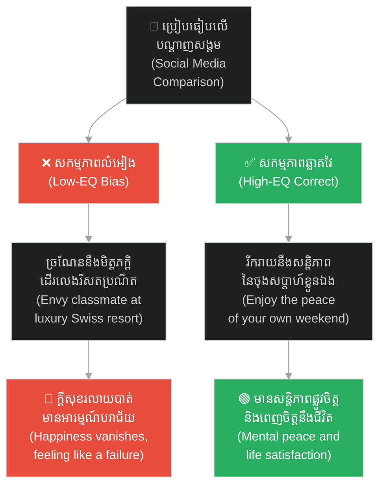
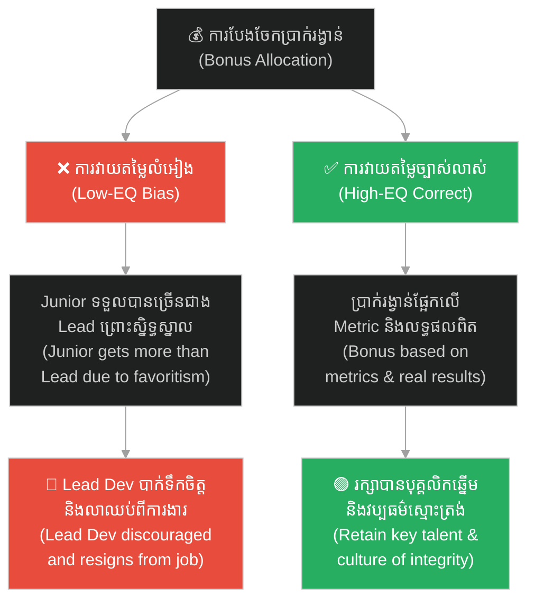
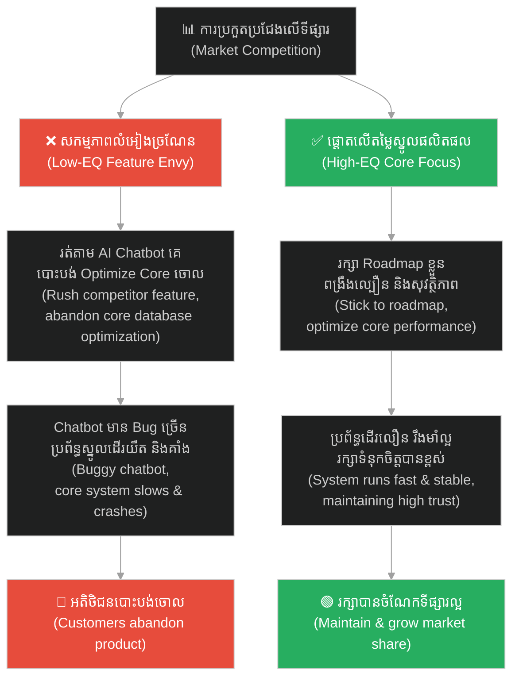
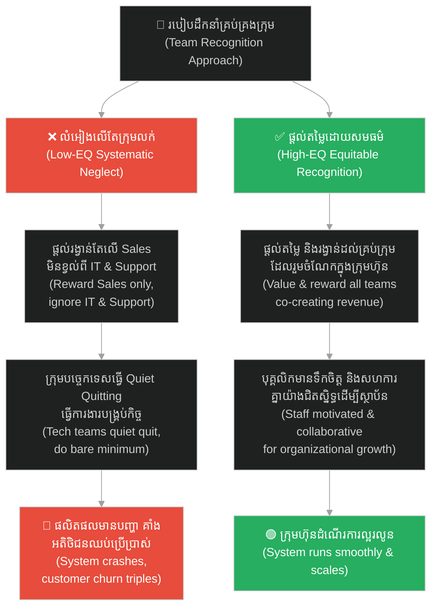
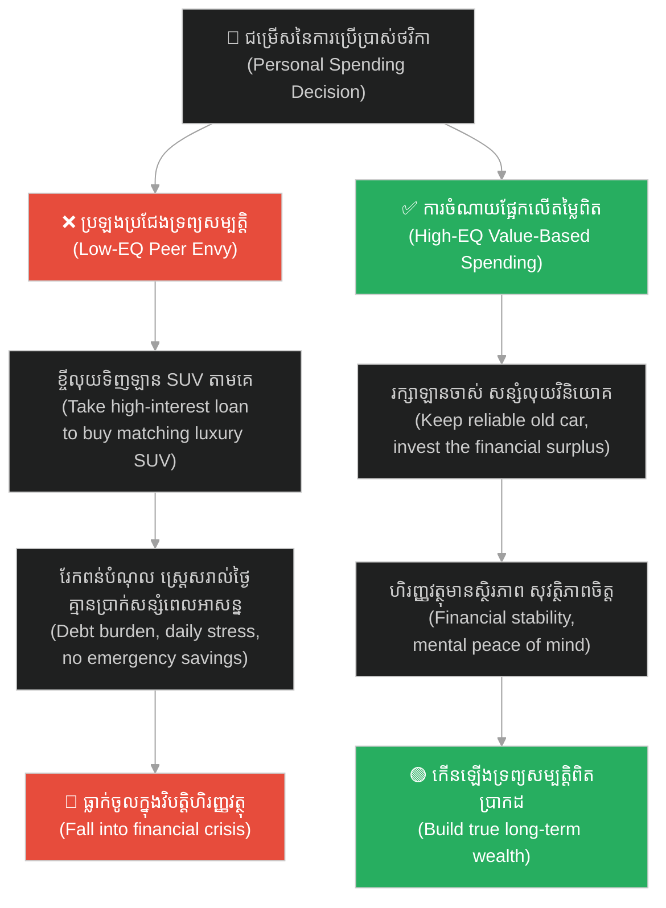

# Relative Deprivation Effect (ឥទ្ធិពលនៃការដកហូតដោយការប្រៀបធៀប)៖ ការឈឺចាប់នៃការប្រៀបធៀបដែលមិនស្មើភាព (Relative Deprivation Effect: The Pain of Unequal Comparison)

**Author:** ichamrong  
**Date:** 2026-06-04  
**Tags:** #relative-deprivation #psychology #mental-models #leadership #team-management #social-science  
**Category:** Concepts  
**Read Time:** ~20 min  

---

## 📌 មាតិកា (Table of Contents)
- [អន្ទាក់ផ្លូវចិត្ត (The Trap)](#0)
- [១. បញ្ហា៖ ការឈឺចាប់នៃការប្រៀបធៀប «គេល្អជាង» (The Issue: The Pain of "Better Off" Comparison)](#1)
- [២. ឧទាហរណ៍ជាក់ស្តែងក្នុងពិភពពិត (Real World Examples)](#2)
  - [ឧទាហរណ៍ទី ១ — កម្រិតស្រាល៖ ភាពច្រណែនលើបណ្តាញសង្គម (Example 1: Social Media Envy)](#2-1)
  - [ឧទាហរណ៍ទី ២ — កម្រិតមធ្យម (បច្ចេកទេស)៖ ភាពមិនស្មើគ្នានៃប្រាក់រង្វាន់ (Example 2: The Bonus Disparity)](#2-2)
  - [ឧទាហរណ៍ទី ៣ — កម្រិតមធ្យម (ធុរកិច្ច)៖ ភាពចង់បានតាមគូប្រជែង (Example 3: Competitor Feature Envy)](#2-3)
  - [ឧទាហរណ៍ទី ៤ — កម្រិតធ្ងន់៖ ការមិនអើពើជាប្រព័ន្ធ និងការបះបោរស្ងាត់ (Example 4: Systematic Neglect & Corporate Rebellion)](#2-4)
  - [ឧទាហរណ៍ទី ៥ — កម្រិតស្រាល (ការរស់នៅប្រចាំថ្ងៃ)៖ ការទិញរបស់ប្រើប្រាស់ទំនើបៗតាមអ្នកជិតខាង (Example 5: Keeping up with the Joneses)](#2-5)
- [៣. កត្តាជម្រុញ៖ គម្លាតជិតស្និទ្ធ និងលទ្ធភាពមើលឃើញ (The Aggravator: Proximity and Visibility)](#3)
- [៤. ដំណោះស្រាយទូទៅ (The General Solution)](#4)
- [សេចក្តីសន្និដ្ឋាន (Conclusion)](#5)
- [ឯកសារយោង (References)](#6)
- [Related Posts](#7)

---

<a id="0"></a>
## អន្ទាក់ផ្លូវចិត្ត (The Trap)

ស្រមៃថាអ្នកទទួលបានការដំឡើងប្រាក់ខែ ១០%។ អ្នកមានអារម្មណ៍រំភើបរីករាយជាខ្លាំង។ អ្នកមានអារម្មណ៍ថាខ្លួនឯងមានតម្លៃ ជោគជ័យ និងគ្រោងរៀបចំអាហារពេលល្ងាចអបអរសាទរជាមួយក្រុមគ្រួសារយ៉ាងសប្បាយ។

Imagine receiving a 10% salary raise. You are absolutely thrilled. You feel valued, successful, and plan to celebrate with a nice family dinner.

លុះស្អែកឡើង អ្នកស្រាប់តែដឹងថា មិត្តរួមការងារម្នាក់ទៀត — ដែលធ្វើការងារដូចគ្នា និងមានបទពិសោធន៍ស្មើគ្នា — ទទួលបានការដំឡើងប្រាក់ខែរហូតដល់ ១៥%។

The next day, you discover that a colleague performing the same role with identical experience received a 15% raise.

រំពេចនោះ ការដំឡើងប្រាក់ខែ ១០% របស់អ្នកលែងមានន័យភ្លាម។ ភាពសប្បាយរីករាយទាំងអស់បានរលាយបាត់ជំនួសមកវិញដោយភាពល្វីងជូរចត់ កំហឹង និងអារម្មណ៍ចង់រកការងារថ្មីភ្លាមៗ។ ស្ថានភាពជាក់ស្តែងរបស់អ្នក (Absolute Reality) មិនបានប្រែប្រួលទេ (អ្នកនៅតែមានលុយកើនឡើង ១០% ដដែល) ប៉ុន្តែ**ការពិតធៀប (Relative Reality)** របស់អ្នកត្រូវបានខូចខាតទាំងស្រុង។

Instantly, your 10% raise loses its meaning. The joy evaporates, replaced by bitterness, resentment, and a sudden urge to look for a new job. Your absolute reality hasn't changed (you still have 10% more money), but your **relative reality** has been completely shattered.

នេះគឺជាសកម្មភាពនៃ **Relative Deprivation Effect (ឥទ្ធិពលនៃការដកហូតដោយការប្រៀបធៀប)**។

This is the Relative Deprivation Effect at work.

เพื่อងាយស្រួលតាមដាន នេះជាផែនទីបង្ហាញផ្លូវសម្រាប់អត្ថបទនេះ៖
1. **បញ្ហា (The Issue)** — តើការប្រៀបធៀបខ្លួនឯងទៅនឹងអ្នកដទៃបង្កើតការឈឺចាប់ផ្លូវចិត្តដូចម្តេច?
2. **ឧទាហរណ៍ជាក់ស្តែង (Real World Examples)** — ឧទាហរណ៍ចំនួន ៥ ចាប់ពីជីវិតប្រចាំថ្ងៃ រហូតដល់ការដឹកនាំក្រុមហ៊ុន។
3. **កត្តាជម្រុញ (The Aggravator)** — ហេតុអ្វីបានជាភាពជិតស្និទ្ធធ្វើឱ្យការឈឺចាប់កាន់តែមុតស្រួច?
4. **ដំណោះស្រាយទូទៅ (The General Solution)** — របៀបគ្រប់គ្រងចិត្ត និងការកសាងប្រព័ន្ធដឹកនាំប្រកបដោយសមធម៌។

Roadmap for this article:
1. **The Issue** — How does comparing ourselves to others create psychological distress?
2. **Real World Examples** — Five examples ranging from everyday life to corporate leadership.
3. **The Aggravator** — Why does proximity make the pain of comparison more acute?
4. **The General Solution** — How to manage our mindset and build equitable leadership systems.

---

<a id="1"></a>
## ១. បញ្ហា៖ ការឈឺចាប់នៃការប្រៀបធៀប «គេល្អជាង» (The Issue: The Pain of "Better Off" Comparison)

**Relative Deprivation** គឺជាស្ថានភាពផ្លូវចិត្តនៃការមានអារម្មណ៍ថាត្រូវបានគេដកហូត ឬខ្វះខាតអ្វីមួយ (ដូចជា ឋានៈ ប្រាក់កាស ការទទួលស្គាល់ សិទ្ធិ) ដែលអ្នកជឿជាក់ថាខ្លួន**សមនឹងទទួលបាន** ដោយផ្អែកលើ**ការប្រៀបធៀបខ្លួនឯងទៅនឹងក្រុមមនុស្សជុំវិញខ្លួន**។

**Relative deprivation** is the psychological state of feeling deprived of or lacking something (such as status, wealth, recognition, or rights) that you believe you **deserve**, based on **comparing yourself to those around you**.

វាបង្រៀនយើងថា សុភមង្គល និងការពេញចិត្តរបស់មនុស្សមិនមែនជាលក្ខខណ្ឌដាច់ខាត (Absolute) នោះឡើយ៖
* យើងមិនវាស់ស្ទង់ភាពជោគជ័យរបស់យើងដោយផ្អែកលើ **«តើយើងបានដើរមកឆ្ងាយប៉ុណ្ណោះ»** នោះទេ។
* យើងវាស់ស្ទង់ភាពជោគជ័យរបស់យើងដោយផ្អែកលើ **«តើយើងនៅពីក្រោយអ្នកជិតខាងយើងប៉ុណ្ណា»**។

It teaches us that human happiness and satisfaction are not absolute conditions:
* We do not measure our success based on **"how far we have come."**
* We measure our success based on **"how far we are behind our neighbors."**

```
❌ ការពិតដាច់ខាត (Absolute Reality)៖ "ខ្ញុំទទួលបានការដំឡើង ១០%។ ជីវិតខ្ញុំល្អជាងមុន។"
(Absolute Reality: "I received a 10% raise. My life is objectively better.")

✅ ការពិតធៀប (Relative Reality)៖ "គេទទួលបាន ១៥%។ ខ្ញុំអន់ជាងគេ ដូច្នេះខ្ញុំមានអារម្មណ៍ខឹងសម្បារ។"
(Relative Reality: "They received 15%. I am worse off, so I feel resentful.")
```

---

<a id="2"></a>
## ២. ឧទាហរណ៍ជាក់ស្តែងក្នុងពិភពពិត (Real World Examples)

សូមពិនិត្យមើល **ឧទាហរណ៍ជាក់ស្តែងចំនួន ៥** បង្ហាញពីរបៀបដែលលំអៀងផ្លូវចិត្តនេះបំផ្លាញទំនាក់ទំនងការងារ និងស្ថិរភាពក្រុមការងារ៖

Here are **five real-world examples** demonstrating how this cognitive bias disrupts work relationships and team stability:

---

<a id="2-1"></a>
### ឧទាហរណ៍ទី ១ — កម្រិតស្រាល៖ ភាពច្រណែនលើបណ្តាញសង្គម (Example 1: Social Media Envy)

**ស្ថានភាព៖** ការអូសទស្សនាបណ្តាញសង្គម (Feed) នៅថ្ងៃសម្រាកចុងសប្តាហ៍។

**Scenario:** Scrolling through your social media feed during a weekend break.

* **សកម្មភាព Low EQ / Bias (ទម្លាប់/លំអៀង)៖** អ្នកឃើញរូបថតមិត្តរួមថ្នាក់ចាស់ម្នាក់កំពុងដើរលេងកម្សាន្តនៅរីសតលំដាប់ប្រណីតក្នុងប្រទេសស្វីស។ អ្នកស្រាប់តែមានអារម្មណ៍ថាជីវិតខ្លួនឯងបរាជ័យ ផ្ទះខ្លួនឯងតូចចង្អៀត និងមានអារម្មណ៍ធុញទ្រាន់នឹងការងារបច្ចុប្បន្នភ្លាមៗ ដោយមើលរំលងការពិតថាអ្នកទើបតែមានក្តីសុខ ៥ នាទីមុននេះសោះ។
* **Low-EQ/Bias Action:** You see a photo of an old classmate vacationing at a luxury resort in Switzerland. You suddenly feel like a failure, your home feels small, and you feel discontent with your job, overlooking the fact that you were perfectly happy just five minutes ago.
* **សកម្មភាព High EQ / Correct (ដំណោះស្រាយ)៖** ការយល់ដឹងថាបណ្តាញសង្គមបង្ហាញតែចំណុចលេចធ្លោបំផុត (Highlight Reel) របស់គេ។ រីករាយនឹងកាហ្វេ និងសន្តិភាពនៃចុងសប្តាហ៍ផ្ទាល់ខ្លួន ហើយប្រៀបធៀបខ្លួនឯងទៅនឹងជីវិតកាលពីអតីតកាល។
* **High-EQ/Correct Action:** Recognize that social media only displays others' highlight reels. Enjoy your coffee and the peace of your own weekend, comparing your current self only to your past self.
* **លទ្ធផល៖** រក្សាបានសន្តិភាពផ្លូវចិត្ត និងក្តីរីករាយពិតប្រាកដក្នុងជីវិតប្រចាំថ្ងៃ។
* **The Result:** Maintain mental peace and genuine joy in daily life.



---

<a id="2-2"></a>
### ឧទាហរណ៍ទី ២ — កម្រិតមធ្យម (បច្ចេកទេស)៖ ភាពមិនស្មើគ្នានៃប្រាក់រង្វាន់ (Example 2: The Bonus Disparity)

**ស្ថានភាព៖** ក្រុមហ៊ុន Startup បច្ចេកវិទ្យាមួយចែកប្រាក់រង្វាន់ប្រចាំឆ្នាំ (Bonus) ផ្អែកលើការយល់ឃើញផ្ទាល់ខ្លួនរបស់ Manager ជាជាងផ្អែកលើ Metric ច្បាស់លាស់។

**Scenario:** A tech startup distributes annual bonuses based on subjective managerial perception rather than objective metrics.

* **សកម្មភាព Low EQ / Bias (ទម្លាប់/លំអៀង)៖** Lead Dev ដឹងថា Junior Dev (ដែលទើបចូលរួមការងារ ធ្វើការងារសាមញ្ញៗ ប៉ុន្តែមានវោហាសាស្ត្រល្អ) ទទួលបានប្រាក់រង្វាន់ $6,000 ច្រើនជាងខ្លួនដែលទទួលបាន $5,000 (ទោះជា Lead Dev ដឹកនាំប្រព័ន្ធ Migration ធំដោយជោគជ័យ)។ Lead Dev មានអារម្មណ៍អយុត្តិធម៌ខ្លាំង ក៏ឈប់ខិតខំប្រឹងប្រែង ឈប់ជួយបណ្តុះបណ្តាលសមាជិកថ្មី និងលាឈប់ពីការងារក្នុងរយៈពេល ២ ខែក្រោយ។
* **Low-EQ/Bias Action:** The Lead Dev learns that a Junior Dev (who joined late, worked on minor tasks, but is highly charismatic) received a $6,000 bonus—higher than their own $5,000 bonus (despite the Lead Dev successfully migrating the entire system architecture). The Lead Dev feels treated unfairly, stops putting in extra effort, ceases mentoring, and resigns two months later.
* **សកម្មភាព High EQ / Correct (ដំណោះស្រាយ)៖** ថ្នាក់ដឹកនាំរៀបចំឱ្យមានប្រព័ន្ធវាយតម្លៃការងារច្បាស់លាស់ (Objective Performance Metrics) ដោយផ្សារភ្ជាប់ទិន្នន័យផលិតភាពពិតប្រាកដទៅនឹងកម្រិតរង្វាន់ និងពន្យល់ពីលក្ខខណ្ឌនៃការវាយតម្លៃប្រកបដោយតម្លាភាព។
* **High-EQ/Correct Action:** Leadership implements objective performance metrics, linking actual productivity data directly to bonus brackets, and transparently explains evaluation guidelines to everyone.
* **លទ្ធផល៖** ក្រុមហ៊ុនអាចរក្សាបុគ្គលិកឆ្នើម (Lead Dev) និងធានាបាននូវការជឿទុកចិត្តលើប្រព័ន្ធគ្រប់គ្រងផ្ទៃក្នុង។
* **The Result:** The company retains top talent (Lead Dev) and ensures deep trust in internal management.



---

<a id="2-3"></a>
### ឧទាហរណ៍ទី ៣ — កម្រិតមធ្យម (ធុរកិច្ច)៖ ភាពចង់បានតាមគូប្រជែង (Example 3: Competitor Feature Envy)

**ស្ថានភាព៖** ក្រុមហ៊ុនអភិវឌ្ឍន៍ប្រព័ន្ធគ្រប់គ្រងគណនេយ្យ (Accounting System) មួយមានប្រព័ន្ធដែលដំណើរការល្អ ឥតខ្ចោះ ឥតមានកំហុស និងគ្មានការគាំង (No Crash) ឡើយ ដែលធ្វើឱ្យអតិថិជនស្រឡាញ់ខ្លាំង។ ស្រាប់តែថ្ងៃមួយ គូប្រជែងនៅលើទីផ្សារបានប្រកាសបើកដំណើរការ (Launch) មុខងារ AI Chatbot ថ្មីមួយ។

**Scenario:** An accounting software company has a highly stable, bug-free, and crash-proof core system that customers love. Suddenly, a competitor launches a new AI Chatbot feature.

* **សកម្មភាព Low EQ / Bias (ទម្លាប់/លំអៀង)៖** Product Owner និងថ្នាក់ដឹកនាំមានអារម្មណ៍ថាខ្លួន «ត្រូវបានដកហូតឱកាស» និង «កំពុងចាញ់គូប្រជែង» យ៉ាងខ្លាំង (ទោះជា AI Chatbot មិនមែនជាតម្រូវការចម្បងរបស់ប្រព័ន្ធគណនេយ្យក៏ដោយ)។ ពួកគេបានសម្រេចចិត្តផ្អាកការងារ Database Optimization និងការកែលម្អប្រព័ន្ធសុវត្ថិភាពភ្លាម ដើម្បីបង្វែរធនធាន និងកម្លាំងវិស្វករទាំងអស់មកបង្កើត AI Chatbot ជាបន្ទាន់។ ជាលទ្ធផល AI Chatbot បង្កើតឡើងមកមាន Bug ច្រើន ប្រព័ន្ធស្នូលដើរយឺត និងគាំង អតិថិជនមានអារម្មណ៍ខឹងសម្បារព្រោះការងារចម្បងរបស់ពួកគេរអាក់រអួល ហើយចាប់ផ្តើមបោះបង់ប្រព័ន្ធគណនេយ្យនេះចោល។
* **Low-EQ/Bias Action:** The Product Owner and leadership feel "deprived of opportunities" and "falling behind." Even though an AI chatbot is not a primary requirement for an accounting system, they suspend vital database optimization and security updates to redirect all resources to rush their own AI Chatbot. Consequently, the rushed chatbot is riddled with bugs, the core system slows down and crashes, angering customers who then abandon the software.
* **សកម្មភាព High EQ / Correct (ដំណោះស្រាយ)៖** រក្សាភាពជឿជាក់លើចំណុចខ្លាំងរបស់ខ្លួន (Roadmap Focus)។ បន្តពង្រឹងល្បឿន លំនឹង និងសុវត្ថិភាពនៃប្រព័ន្ធគណនេយ្យ ហើយរង់ចាំតាមដានលទ្ធផលទីផ្សាររបស់គូប្រជែង មុននឹងសម្រេចចិត្តវិនិយោគ។
* **High-EQ/Correct Action:** Focus on your core strength (Roadmap Focus). Continue strengthening system speed, stability, and security, and monitor the competitor's market feedback before deciding to invest.
* **លទ្ធផល៖** ផលិតផលរក្សាបានស្ថិរភាពដ៏អស្ចារ្យ ទទួលបានទំនុកចិត្តខ្ពស់ពីអតិថិជន និងដណ្តើមចំណែកទីផ្សារបានច្រើនពីគូប្រជែងដែលកំពុងជួបបញ្ហាប្រព័ន្ធគាំង។
* **The Result:** The product maintains outstanding stability, secures high customer trust, and wins market share from the competitor struggling with system crashes.



---

<a id="2-4"></a>
### ឧទាហរណ៍ទី ៤ — កម្រិតធ្ងន់៖ ការមិនអើពើជាប្រព័ន្ធ និងការបះបោរស្ងាត់ (Example 4: Systematic Neglect & Corporate Rebellion)

**ស្ថានភាព៖** នៅក្នុងក្រុមហ៊ុនបច្ចេកវិទ្យាមួយ ថ្នាក់ដឹកនាំសម្រេចចិត្តផ្តល់រង្វាន់ ប្រាក់កម្រៃជើងសារខ្ពស់ (High Commission) និងការសរសើរជាសាធារណៈតែទៅលើក្រុមផ្នែកលក់ (Sales Team) ប៉ុណ្ណោះ ព្រោះយល់ថាពួកគេជាអ្នករកលុយមកឱ្យក្រុមហ៊ុន។

**Scenario:** In a tech company, leadership decides to reward, praise, and give high commissions exclusively to the Sales Team, believing they are the sole source of revenue.

* **សកម្មភាព Low EQ / Bias (ទម្លាប់/លំអៀង)៖** ក្រុមវិស្វករ (Engineers) និងក្រុមគាំទ្រអតិថិជន (Customer Support) មានអារម្មណ៍ «ត្រូវបានដកហូតសិទ្ធិ និងតម្លៃ» យ៉ាងខ្លាំង។ ពួកគេមានអារម្មណ៍ថាទោះជាពួកគេខិតខំប្រឹងប្រែងដោះស្រាយបញ្ហាបច្ចេកទេស និងគាំទ្រអតិថិជនទាំងយប់ទាំងថ្ងៃយ៉ាងណាក៏ដោយ ក៏ក្រុមហ៊ុនចាត់ទុកពួកគេជា «បុគ្គលិកថ្នាក់ទី ២» ជានិច្ច។ ពួកគេចាប់ផ្តើមធ្វើការបះបោរស្ងាត់ (Quiet Quitting) ធ្វើការងារបង្គ្រប់កិច្ច ឈប់យកចិត្តទុកដាក់នឹងការព្រមានប្រព័ន្ធ ស្ថិរភាពប្រព័ន្ធធ្លាក់ចុះ ផលិតផលជួបបញ្ហា Crash ញឹកញាប់ និងអត្រាអតិថិជនបោះបង់សេវាកម្ម (Churn Rate) កើនឡើង ៣ ដង។
* **Low-EQ/Bias Action:** Engineers and support staff feel "deprived of value and status," treated as second-class citizens despite working night and day to resolve system issues. They begin "quiet quitting," doing the bare minimum and ignoring system alerts. System stability falls, crashes increase, and customer churn rate triples, wiping out all new sales revenue.
* **សកម្មភាព High EQ / Correct (ដំណោះស្រាយ)៖** ថ្នាក់ដឹកនាំរចនាប្រព័ន្ធលើកទឹកចិត្តប្រកបដោយសមធម៌ (Equitable Recognition) ដោយផ្តល់រង្វាន់ និងការសរសើរដល់គ្រប់ក្រុមការងារទាំងអស់ ដែលរួមចំណែកដល់ភាពជោគជ័យរបស់ក្រុមហ៊ុន (រួមទាំង Sales, IT និង Support)។
* **High-EQ/Correct Action:** Leadership designs an equitable recognition system, rewarding and praising all teams that contribute to the company's success (including Sales, IT, and Support).
* **លទ្ធផល៖** គ្រប់ផ្នែកទាំងអស់សហការគ្នាយ៉ាងជិតស្និទ្ធ ប្រព័ន្ធដំណើរការរលូន និងអាចបន្តពង្រីកខ្លួនដោយជោគជ័យ។
* **The Result:** All departments collaborate closely, the system runs smoothly, and the company successfully scales.



---

<a id="2-5"></a>
### ឧទាហរណ៍ទី ៥ — កម្រិតស្រាល (ការរស់នៅប្រចាំថ្ងៃ)៖ ការទិញរបស់ប្រើប្រាស់ទំនើបៗតាមអ្នកជិតខាង (Example 5: Keeping up with the Joneses)

**ស្ថានភាព៖** គ្រួសារមួយមានជីវភាពធូរធារល្មម និងមានឡានស៊េរីចាស់មួយដែលកំពុងដំណើរការយ៉ាងល្អ ឥតខ្ចោះ និងសន្សំសំចៃសាំងខ្លាំង។ ស្រាប់តែថ្ងៃមួយ អ្នកជិតខាងផ្ទះក្បែរគ្នាបានទិញឡាន SUV ទំនើប និងថ្លៃស៊េរីចុងក្រោយបង្អស់មួយមកជិះបង្អួត។

**Scenario:** A financially comfortable family drives an older car that runs perfectly and is highly fuel-efficient. Suddenly, their next-door neighbor buys a brand new luxury SUV.

* **សកម្មភាព Low EQ / Bias (ទម្លាប់/លំអៀង)៖** គ្រួសារនោះស្រាប់តែមានអារម្មណ៍ថាខ្លួន «ខ្វះខាត និងទាបទន់ជាងគេ» (ទោះបីជាស្ថានភាពហិរញ្ញវត្ថុ និងតម្រូវការធ្វើដំណើរពិតប្រាកដមិនត្រូវការឡានថ្មីក៏ដោយ)។ ពួកគេបានសម្រេចចិត្តខ្ចីលុយធនាគារ និងបង់រំលស់ក្នុងអត្រាការប្រាក់ខ្ពស់ដើម្បីទិញឡាន SUV ដូចអ្នកជិតខាងជាបន្ទាន់។ ជាលទ្ធផល ពួកគេរែកពន់បំណុលធ្ងន់ធ្ងររៀងរាល់ខែ គ្មានប្រាក់សន្សំសម្រាប់ពេលអាសន្ន និងមានសម្ពាធផ្លូវចិត្តយ៉ាងខ្លាំង។
* **Low-EQ/Bias Action:** The family suddenly feels "deprived and inferior" (even though their actual transportation needs are fully met). They take out a high-interest bank loan to buy a matching SUV. Consequently, they face massive monthly debt payments, zero emergency savings, and constant financial stress.
* **សកម្មភាព High EQ / Correct (ដំណោះស្រាយ)៖** រក្សាឡានចាស់ដែលនៅដំណើរការល្អ សន្សំសំចៃសាំង និងយកលុយកាក់ដែលសល់ទៅវិនិយោគ ឬសន្សំទុកសម្រាប់អនាគតគ្រួសារ។ មិនយកភាពមានបានរបស់អ្នកដទៃមកធ្វើជាបន្ទុកហិរញ្ញវត្ថុផ្ទាល់ខ្លួនឡើយ។
* **High-EQ/Correct Action:** Keep the reliable old car, invest the surplus cash, and refuse to let someone else's lifestyle dictate their financial health or become their personal debt burden.
* **លទ្ធផល៖** ហិរញ្ញវត្ថុមានស្ថិរភាព មានសុវត្ថិភាពផ្លូវចិត្ត និងគ្មានសម្ពាធបំណុល។
* **The Result:** Financial stability, mental peace of mind, and zero debt pressure.



---

<a id="3"></a>
## ៣. កត្តាជម្រុញ៖ គម្លាតជិតស្និទ្ធ និងលទ្ធភាពមើលឃើញ (The Aggravator: Proximity and Visibility)

Relative Deprivation គឺមានប្រតិកម្មខ្លាំងបំផុតទៅនឹង **ភាពជិតស្និទ្ធ (Proximity)**៖

Relative Deprivation is highly sensitive to **proximity**:

* យើងមិនសូវមានអារម្មណ៍ខ្វះខាត ឬច្រណែននឹងមហាសេដ្ឋីលំដាប់ពិភពលោកដូចជា Elon Musk ឡើយ ព្រោះពួកគេស្ថិតនៅឆ្ងាយពីជីវិតពិតរបស់យើងពេក។
* We rarely feel deprived or envious of global billionaires like Elon Musk because they are too far removed from our daily realities.

* យើងមានប្រតិកម្មខ្លាំង និងឈឺចាប់បំផុត គឺនៅពេលប្រៀបធៀបខ្លួនឯងទៅនឹង **មិត្តរួមការងារ មិត្តរួមថ្នាក់ អ្នកជិតខាង និងបងប្អូនបង្កើត**។ កាលណាទំនាក់ទំនងកាន់តែជិតស្និទ្ធ ការឈឺចាប់ផ្នែកចិត្តសាស្ត្រនៃភាពមិនស្មើគ្នាកាន់តែមុតស្រួច។
* We react most strongly and painfully when comparing ourselves to **coworkers, classmates, neighbors, and siblings**. The closer the relationship, the more acute the psychological pain of perceived inequality.

---

<a id="4"></a>
## ៤. ដំណោះស្រាយទូទៅ (The General Solution)

តើយើងអាចការពារស្ថាប័ន និងខ្លួនយើងពីអន្ទាក់ Relative Deprivation ដោយរបៀបណា?

How can we protect our organizations and ourselves from the Relative Deprivation trap?

### បង្កើតលក្ខខណ្ឌវិនិច្ឆ័យច្បាស់លាស់ និងតម្លាភាព (Transparent & Objective Criteria)

នៅក្នុងការដឹកនាំ និងគ្រប់គ្រង ភាពមិនច្បាស់លាស់ (Subjectivity) គឺជាសារធាតុពុល៖
* ប្រាក់រង្វាន់ ការដំឡើងតំណែង និងឱកាសការងារត្រូវតែផ្សារភ្ជាប់ទៅនឹង **លក្ខខណ្ឌវិនិច្ឆ័យដែលមានកំណត់ច្បាស់លាស់ វាស់វែងបាន និងមានតម្លាភាព**។
* ប្រសិនបើមានការលើកលែងពិសេស ត្រូវតែមានការពន្យល់យ៉ាងច្បាស់លាស់ផ្អែកលើទិន្នន័យ មិនមែនផ្អែកលើបក្សពួកនិយមឡើយ។

In leadership and management, subjectivity is toxic:
* Bonuses, promotions, and career opportunities must be tied to **clearly defined, measurable, and transparent criteria**.
* If special exceptions occur, they must be justified by data rather than favoritism.

### ទទួលស្គាល់តួនាទីដែលមើលមិនឃើញ (Acknowledge Invisible Roles)

កុំមើលរំលងតួនាទីដែលខ្វះ «ភាពលេចធ្លោចែងចាំង» ប៉ុន្តែជាគ្រឹះទ្រទ្រង់ក្រុមហ៊ុនឱ្យរឹងមាំ (ដូចជា DevOps, QA, Support, Operations)។ ត្រូវធានាថាការកោតសរសើរ និងរង្វាន់ត្រូវបានបែងចែកទៅកាន់គ្រប់ផ្នែកទាំងអស់ដោយសមធម៌។

Do not overlook roles that lack "flashy visibility" but serve as the backbone of the organization (such as DevOps, QA, Support, Operations). Ensure that appreciation and rewards are distributed equitably across all departments.

### ការវាយតម្លៃធៀបនឹងអតីតកាលខ្លួនឯង (Internal Benchmarking)

នៅលើកម្រិតបុគ្គល ត្រូវបញ្ឈប់រង្វង់ការប្រៀបធៀបខ្លួនឯងទៅនឹងអ្នកដទៃ (Social Comparison)។ មាត្រដ្ឋានវាស់ស្ទង់តែមួយគត់ដែលមានសុខភាពល្អ គឺ **រូបអ្នកផ្ទាល់ធៀបនឹងរូបអ្នកកាលពីអតីតកាល**៖

On an individual level, break the cycle of social comparison. The only healthy benchmark is your own progress over time:

> **«តើខ្ញុំនៅថ្ងៃនេះ មានការរីកចម្រើន មានប្រាជ្ញា ឬសមត្ថភាពជាងខ្លួនខ្ញុំកាលពីមួយឆ្នាំមុនដែរឬទេ?»**
> 
> *"Am I today more developed, wiser, or more capable than I was a year ago?"*

---

## 🐇 ធ្លាក់ចូលក្នុងរន្ធទន្សាយ (Enter the Rabbit Hole)

ដើម្បីស្វែងយល់កាន់តែស៊ីជម្រៅអំពីការប្រៀបធៀបអត្ថិភាព និងការបាត់បង់ដោយសារការប្រៀបធៀបតាមរយៈរឿងព្រេងប្រវត្តិសាស្ត្រចិន សូមចាប់ផ្តើមដំណើររុករករបស់អ្នកដោយចុចលើតំណភ្ជាប់ខាងក្រោម៖

To explore further details of relative comparison and deprivation through a Chinese historical parable, begin your journey by clicking below:

* 🚀 **[ចាប់ផ្តើមដំណើររុករក (Start the Journey) ➔ The General's Envy (ឥទ្ធិពលនៃការដកហូតដោយការប្រៀបធៀប)](../parables/02-relative-deprivation-effect.md)**

---

<a id="5"></a>
## សេចក្តីសន្និដ្ឋាន (Conclusion)

> **«ការប្រៀបធៀបគឺជាចោរលួចយកក្តីរីករាយ។»**  
> — Theodore Roosevelt
> 
> **“Comparison is the thief of joy.”**  
> — Theodore Roosevelt

ការយល់ឃើញពីអយុត្តិធម៌ធៀប គឺជាកម្លាំងជម្រុញដ៏ខ្លាំងបំផុតមួយនៃជម្លោះ និងការលែងខ្វល់ការងាររបស់មនុស្ស។ តាមរយៈការយល់ដឹងពី Relative Deprivation Effect ថ្នាក់ដឹកនាំអាចសាងសង់វប្បធម៌ការងារដែលមានសមធម៌ពិតប្រាកដ ហើយបុគ្គលម្នាក់ៗអាចស្វែងរកភាពស្ងប់សុខផ្លូវចិត្តដោយដើរចេញពីវដ្តនៃការប្រៀបធៀបសង្គមដ៏មានជាតិពុល។

Perceived relative injustice is one of the strongest drivers of conflict and disengagement. By understanding the Relative Deprivation Effect, leaders can build equitable cultures, and individuals can find peace of mind by stepping away from toxic social comparisons.

---

<a id="6"></a>
## ឯកសារយោង (References)

* **Stouffer, S. A., et al.** — *The American Soldier* (1949)។ សិក្សាស្រាវជ្រាវដ៏ល្បីល្បាញដំបូងបង្អស់ដែលបានបង្ហាញពី Relative Deprivation ក្នុងចំណោមទាហានអាមេរិក។
* **Stouffer, S. A., et al.** — *The American Soldier* (1949). The landmark social science study that first identified relative deprivation among US military personnel.
* **Merton, R. K.** — *Social Theory and Social Structure* (1957)។ ការវិភាគទ្រឹស្តី Reference Group ដែលពន្យល់ពីរបៀបដែលមនុស្សជ្រើសរើសក្រុមប្រៀបធៀបរបស់ខ្លួន។
* **Merton, R. K.** — *Social Theory and Social Structure* (1957). Explaining Reference Group Theory and how individuals choose groups for comparison.
* **Festinger, L.** — *A Theory of Social Comparison Processes* (1954)។ ទ្រឹស្តីចិត្តសាស្ត្រស្នូលស្តីពីដំណើរការប្រៀបធៀបសង្គមរបស់មនុស្ស។
* **Festinger, L.** — *A Theory of Social Comparison Processes* (1954). The foundational psychological theory explaining social comparison mechanisms.

---

<a id="7"></a>
## Related Posts

* **[04-projection-effect.md](./04-projection-effect.md)** — Projection Effect (ការលំអៀងគិតថាគេដូចខ្លួន)៖ មូលហេតុដែលយើងសន្មត់ថាអ្នកដទៃមានមាត្រដ្ឋានគុណតម្លៃដូចយើង។
* **[The General's Envy (ឥទ្ធិពលនៃការដកហូតដោយការប្រៀបធៀប)](../parables/02-relative-deprivation-effect.md)** — រឿងព្រេងប្រវត្តិសាស្ត្រចិនរវាងមេទ័ព ហួរ យាន និង យ៉ាង ចិន។
* **[The Baker and the Butcher (Paradox of Kindness)](../parables/11-the-baker-and-the-butcher.md)** — ការកំណត់ព្រំដែនការងារ ដើម្បីការពារកុំឱ្យការលះបង់ក្លាយជាកាតព្វកិច្ចធម្មតា។
