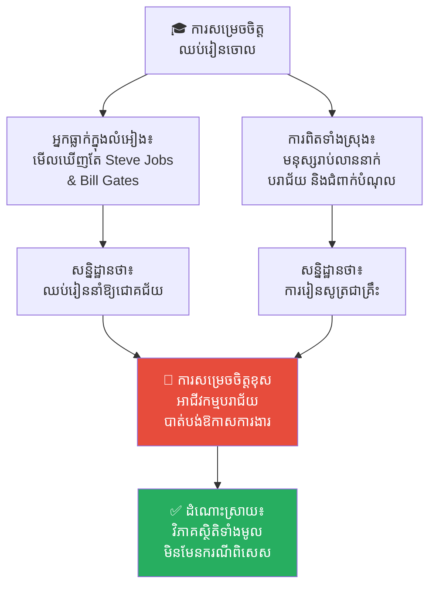
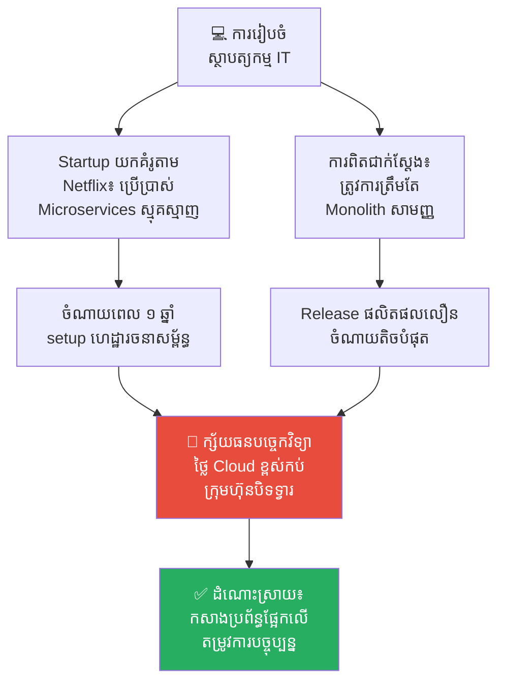
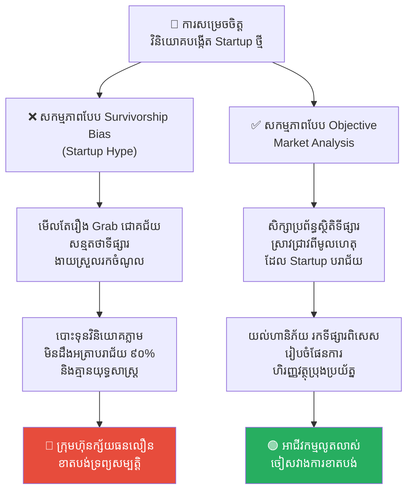
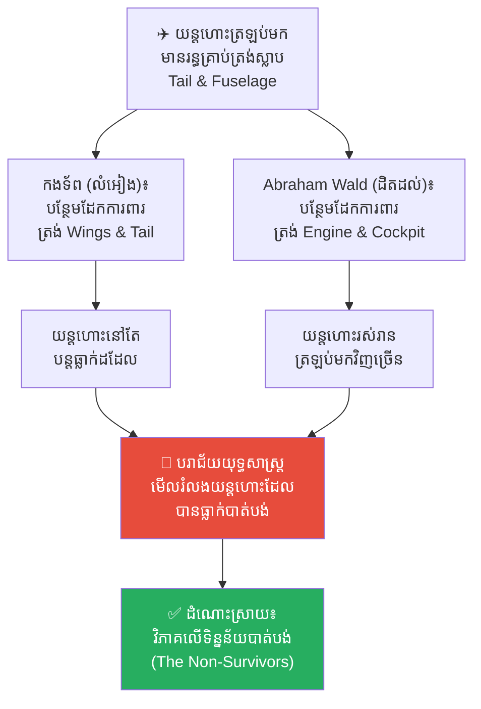
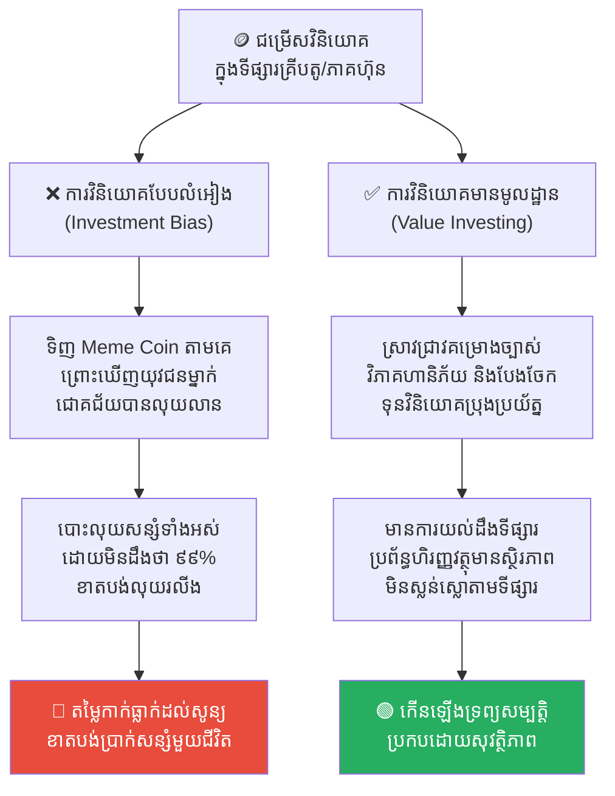

# Survivorship Bias (លំអៀងដោយសារការរស់រានមានជីវិត)៖ អន្ទាក់ផ្លូវចិត្តដែលមើលឃើញតែអ្នកឈ្នះ

**Author:** ichamrong  
**Date:** 2026-05-17  
**Tags:** #survivorship-bias #statistics #cognitive-bias #critical-thinking #mental-models #decision-making  
**Category:** Concepts  
**Read Time:** ~16 min  

---

## 📌 មាតិកា (Table of Contents)
- [អន្ទាក់ផ្លូវចិត្ត (The Trap)](#អន្ទាក់ផ្លូវចិត្ត-the-trap)
- [១. បញ្ហា៖ ទីលានបញ្ចុះសពស្ងប់ស្ងាត់ និងការវិភាគតែលើអ្នករស់រាន (The Issue: The Silent Graveyard)](#១-បញ្ហា-ទីលានបញ្ចុះសពស្ងប់ស្ងាត់-និងការវិភាគតែលើអ្នករស់រាន-the-issue-the-silent-graveyard)
- [២. ឧទាហរណ៍ជាក់ស្តែងក្នុងពិភពពិត (Real World Examples)](#២-ឧទាហរណ៍ជាក់ស្តែងក្នុងពិភពពិត)
  - [ឧទាហរណ៍ទី ១ — កម្រិតស្រាល៖ ទេវកថានៃការបោះបង់ការសិក្សា (The Dropout Myth)](#ឧទាហរណ៍ទី-១-កម្រិតស្រាល-ទេវកថានៃការបោះបង់ការសិក្សា-the-dropout-myth)
  - [ឧទាហរណ៍ទី ២ — កម្រិតមធ្យម (បច្ចេកទេស)៖ ការលួចចម្លងស្ថាបត្យកម្មប្រព័ន្ធរបស់ Unicorn (Copying Unicorn Architecture)](#ឧទាហរណ៍ទី-២-កម្រិតមធ្យម-បច្ចេកទេស-ការលួចចម្លងស្ថាបត្យកម្មប្រព័ន្ធរបស់-unicorn-copying-unicorn-architecture)
  - [ឧទាហរណ៍ទី ៣ — កម្រិតមធ្យម (ធុរកិច្ច)៖ រឿងរ៉ាវជោគជ័យរបស់ Startup (The Startup Hype)](#ឧទាហរណ៍ទី-៣-កម្រិតមធ្យម-ធុរកិច្ច-រឿងរ៉ាវជោគជ័យរបស់-startup-the-startup-hype)
  - [ឧទាហរណ៍ទី ៤ — កម្រិតធ្ងន់៖ យន្តហោះសឹករបស់ Abraham Wald (The Classic WWII Armor Problem)](#ឧទាហរណ៍ទី-៤-កម្រិតធ្ងន់-យន្តហោះសឹករបស់-abraham-wald-the-classic-wwii-armor-problem)
  - [ឧទាហរណ៍ទី ៥ — កម្រិតមធ្យម (ការវិនិយោគ)៖ ការវិនិយោគលើភាគហ៊ុន/គ្រីបតូតាមអ្នកជោគជ័យ (Crypto/Stock Investment Bias)](#ឧទាហរណ៍ទី-៥-កម្រិតមធ្យម-ការវិនិយោគ-ការវិនិយោគលើភាគហ៊ុនគ្រីបតូតាមអ្នកជោគជ័យ-cryptostock-investment-bias)
- [៣. កត្តាជម្រុញ៖ ការផ្សព្វផ្សាយរបស់ប្រព័ន្ធផ្សព្វផ្សាយ និងការខ្វះទិន្នន័យអវិជ្ជមាន (The Aggravator: Media Hype & Missing Negative Data)](#៣-កត្តាជម្រុញ-ការផ្សព្វផ្សាយរបស់ប្រព័ន្ធផ្សព្វផ្សាយ-និងការខ្វះទិន្នន័យអវិជ្ជមាន-the-aggravator-media-hype-missing-negative-data)
- [៤. ដំណោះស្រាយទូទៅ (The General Solution)](#៤-ដំណោះស្រាយទូទៅ-the-general-solution)
  - [សួររកទិន្នន័យដែលមើលមិនឃើញ (Look for the Missing Data)](#សួររកទិន្នន័យដែលមើលមិនឃើញ-look-for-the-missing-data)
  - [សិក្សាពីការបរាជ័យជាជាងជោគជ័យ (Study Failures)](#សិក្សាពីការបរាជ័យជាជាងជោគជ័យ-study-failures)
  - [ស្វែងយល់ពីតួនាទីនៃសំណាង (Acknowledge Luck and Circumstance)](#ស្វែងយល់ពីតួនាទីនៃសំណាង-acknowledge-luck-and-circumstance)
- [សេចក្តីសន្និដ្ឋាន (Conclusion)](#សេចក្តីសន្និដ្ឋាន-conclusion)
- [Related Posts](#related-posts)

---

## អន្ទាក់ផ្លូវចិត្ត (The Trap)

តើអ្នកធ្លាប់អានសម្រង់សម្តីជម្រុញទឹកចិត្ត ឬរឿងរ៉ាវរបស់មហាសេដ្ឋីលំដាប់ពិភពលោកដូចជា Steve Jobs, Bill Gates ឬ Mark Zuckerberg ដែរឬទេ?

រឿងរ៉ាវទាំងនោះតែងតែមានរូបមន្តស្រដៀងគ្នា៖ *«ពួកគេបានសម្រេចចិត្តបោះបង់ការសិក្សានៅសកលវិទ្យាល័យលំដាប់កំពូល ចាប់ផ្តើមបង្កើតក្រុមហ៊ុននៅក្នុងយានដ្ឋានឡានដ៏កខ្វក់ ជឿជាក់លើក្តីស្រមៃខ្លួនឯង ប្រថុយប្រថានគ្រប់បែបយ៉ាង ហើយចុងក្រោយក៏ក្លាយជាមហាសេដ្ឋីលំដាប់ពិភពលោក។»*

បន្ទាប់ពីអានរួច អ្នកប្រហែលជាមានអារម្មណ៍ថា៖ *«ដើម្បីទទួលបានជោគជ័យដ៏អស្ចារ្យ ខ្ញុំត្រូវតែបោះបង់សាលាចោល ហើយប្រថុយប្រថានគ្រប់បែបយ៉ាងដូចពួកគេដែរ!»*

ប៉ុន្តែ នេះគឺជាការគិតដ៏គ្រោះថ្នាក់បំផុតដែលបណ្តាលមកពី **Survivorship Bias (លំអៀងដោយសារការរស់រានមានជីវិត)**។ អ្នកកំពុងវាយតម្លៃសកលលោកទាំងមូលដោយមើលឃើញតែ «អ្នកឈ្នះ» ម្នាក់គត់ ខណៈពេលដែលមើលមិនឃើញ «អ្នកចាញ់» រាប់សែននាក់ផ្សេងទៀតឡើយ។

---

## ១. បញ្ហា៖ ទីលានបញ្ចុះសពស្ងប់ស្ងាត់ និងការវិភាគតែលើអ្នករស់រាន (The Issue: The Silent Graveyard)

**Survivorship Bias** គឺជាកំហុសតក្កវិទ្យា និងលំអៀងស្ថិតិមួយ ដែលយើងផ្តោតការវិភាគតែទៅលើ **«បុគ្គល ឬវត្ថុដែលបានរស់រានមានជីវិត ឬទទួលបានជោគជ័យ (The Survivors)»** ហើយមើលរំលងទាំងស្រុងនូវ **«បុគ្គល ឬវត្ថុដែលបានបរាជ័យ (The Failures)»** ដោយសារតែពួកគេលែងមានលទ្ធភាពបង្ហាញខ្លួន ឬនិយាយឱ្យយើងឮបាន។

និយាយឱ្យសាមញ្ញ៖
* **ទីលានបញ្ចុះសពស្ងប់ស្ងាត់ (The Silent Graveyard)៖** ចំពោះរាល់អ្នកបោះបង់ការសិក្សាម្នាក់ដែលបានក្លាយជាមហាសេដ្ឋី មានមនុស្សរាប់សែននាក់ផ្សេងទៀតដែលបានបោះបង់ការសិក្សាដូចគ្នា ហើយបានបញ្ចប់ជីវិតការងារដោយការជំពាក់បំណុលសាលា និងធ្វើការងារដែលមានចំណូលទាបបំផុត។ ប៉ុន្តែគ្មានសារព័ត៌មានណាទៅសម្ភាសន៍មនុស្សដែលបរាជ័យនៅក្នុង Graveyard ទាំងនោះឡើយ។
* ផ្លូវនៃការសម្រេចចិត្តរបស់យើងប្រែជាខុសឆ្គងទាំងស្រុង ព្រោះយើងយកតែរូបមន្តរបស់ **«ករណីពិសេស (The Exception)»** មកធ្វើជា **«ច្បាប់ទូទៅ (The Rule)»**។

```
❌ ការគិតខុស៖ "Steve Jobs បោះបង់សាលាហើយជោគជ័យ ដូច្នេះការបោះបង់សាលា = ផ្លូវទៅរកភាពមានបាន។"
✅ ការពិត៖ "Steve Jobs គឺជាករណីពិសេស ១ ក្នុងចំណោមមនុស្សរាប់លាននាក់។ ៩៩.៩% នៃអ្នកបោះបង់សាលា មិនអាចបង្កើត Apple បានឡើយ។"
```

---

## ២. ឧទាហរណ៍ជាក់ស្តែងក្នុងពិភពពិត

សូមពិនិត្យមើល **ឧទាហរណ៍ជាក់ស្តែងចំនួន ៥** ចាប់ពីការរស់នៅប្រចាំថ្ងៃ រហូតដល់យុទ្ធសាស្ត្រសរសេរកូដ និងប្រវត្តិសាស្ត្រពិភពលោក៖

---

### ឧទាហរណ៍ទី ១ — កម្រិតស្រាល៖ ទេវកថានៃការបោះបង់ការសិក្សា (The Dropout Myth)

**ស្ថានភាព៖** ការជជែកវែកញែករបស់យុវជនម្នាក់ដែលចង់ឈប់រៀនដើម្បីចាប់ផ្តើមអាជីវកម្ម។

* **ទិន្នន័យដែលមើលឃើញ (The Survivors)៖** Bill Gates (Microsoft), Mark Zuckerberg (Facebook), Steve Jobs (Apple) — សុទ្ធតែជា Dropouts ដែលល្បីល្បាញបំផុត។
* **ទិន្នន័យដែលបាត់បង់ (The Silent Graveyard)៖** មនុស្សរាប់លាននាក់ដែលឈប់រៀន ហើយមិនអាចស្វែងរកការងារល្អធ្វើ គ្មានជំនាញវិជ្ជាជីវៈរឹងមាំ និងរស់នៅក្នុងជីវភាពខ្វះខាត។
* **លទ្ធផល៖** យុវជននោះសម្រេចចិត្តឈប់រៀនភ្លាម។ មួយឆ្នាំក្រោយមក អាជីវកម្មលក់ដូរអនឡាញរបស់ពួកគេបរាជ័យ ហើយពួកគេមិនអាចរកការងារសរសេរកូដល្អធ្វើបាន ព្រោះគ្មានសញ្ញាបត្រ និងគ្មានមូលដ្ឋានគ្រឹះវិទ្យាសាស្ត្រកុំព្យូទ័ររឹងមាំ។



---

### ឧទាហរណ៍ទី ២ — កម្រិតមធ្យម (បច្ចេកទេស)៖ ការលួចចម្លងស្ថាបត្យកម្មប្រព័ន្ធរបស់ Unicorn (Copying Unicorn Architecture)

**ស្ថានភាព៖** ក្រុមហ៊ុន Startup តូចមួយដែលមានសមាជិកតែ ៥ នាក់ និងទើបតែមាន User ១,០០០ នាក់។

* **ការមើលឃើញគំរូជោគជ័យ (The Survivors)៖** ថ្នាក់ដឹកនាំបច្ចេកវិទ្យាអានប្លក់បច្ចេកទេសរបស់ Netflix, Spotify និង Uber ឃើញថាពួកគេប្រើប្រាស់ Microservices ស្មុគស្មាញ, Kubernetes, Event-driven architecture ជាមួយ Kafka និង Distributed DBs។
* **ការសន្មត់៖** *«ដើម្បីលូតលាស់ក្លាយជា Unicorn ដូច Netflix យើងត្រូវតែសរសេរកូដ និងប្រើប្រាស់ស្ថាបត្យកម្ម Microservices ស្មុគស្មាញបែបនេះតាំងពីថ្ងៃដំបូង!»*
* **ការពិតដ៏ជូរចត់៖** ពួកគេចំណាយពេល ១ ឆ្នាំ និងថវិការាប់ម៉ឺនដុល្លារក្នុងការ Setup ហេដ្ឋារចនាសម្ព័ន្ធដ៏ស្មុគស្មាញ។ ដល់ពេល Release ផលិតផល ពួកគេត្រូវកកស្ទះព្រោះតែ Network Latency ស្មុគស្មាញ, Bug ពិបាករក Root Cause និងត្រូវចំណាយថ្លៃ Cloud ប្រចាំខែខ្ពស់កប់ពពក រហូតដល់ក្រុមហ៊ុនត្រូវក្ស័យធនមុននឹងទទួលបានអតិថិជនថ្មី។
* **មេរៀន៖** Netflix ប្រើប្រាស់ Microservices ព្រោះពួកគេមានទំហំធំ និងមានវិស្វកររាប់ពាន់នាក់។ ស្ថាបត្យកម្មស្មុគស្មាញនេះគឺជា *លទ្ធផល* នៃភាពជោគជ័យ មិនមែនជា *មូលហេតុ* នាំឱ្យជោគជ័យនោះទេ។ សម្រាប់ Startup កម្រិតដំបូង Monolith សាមញ្ញទើបជាអ្នកជួយសង្គ្រោះជីវិត។



---

### ឧទាហរណ៍ទី ៣ — កម្រិតមធ្យម (ធុរកិច្ច)៖ រឿងរ៉ាវជោគជ័យរបស់ Startup (The Startup Hype)

**ស្ថានភាព៖** សហគ្រិនម្នាក់កំពុងពិចារណាបោះទុនវិនិយោគសន្សំទាំងអស់របស់ខ្លួនដើម្បីបើកអាជីវកម្មបង្កើតកម្មវិធីដឹកជញ្ជូន និងចែកចាយអាហារ (Food Delivery App) ថ្មីមួយ។

* **សកម្មភាព Survivorship Bias (Startup Hype)៖** សហគ្រិនអានតែ Tech news និងបណ្តាញសង្គមជារៀងរាល់ថ្ងៃ ដែលចុះផ្សាយតែពីក្រុមហ៊ុន Startup ជោគជ័យ ដូចជា Grab, Foodpanda ឬ TikTok ដែលទទួលបានការវិនិយោគរាប់លានដុល្លារ។ ពួកគេសន្មត់ថា៖ *«ទីផ្សារដឹកជញ្ជូនអាហារពិតជាធំធេង និងងាយស្រួលរកចំណូលណាស់។ ឱ្យតែយើងបង្កើត App មួយដ៏ស្រស់ស្អាត នោះយើងនឹងទទួលបានជោគជ័យ និងក្លាយជាមហាសេដ្ឋីមិនខាន!»*
* **លទ្ធផល៖** សហគ្រិនបានបោះទុនវិនិយោគរាប់ម៉ឺនដុល្លារដើម្បីអភិវឌ្ឍ App និងជួលបុគ្គលិកដឹកជញ្ជូន។ ប៉ុន្តែពួកគេមិនបានដឹងពីការពិតថា ៩០% នៃ Startup ទាំងអស់បានបិទទ្វារ និងបរាជ័យនៅក្នុងរយៈពេល ២ ឆ្នាំដំបូង (Silent Graveyard) ឡើយ។ App របស់ពួកគេមិនអាចប្រកួតប្រជែងតម្លៃ និងការចំណាយលើទីផ្សារដ៏ខ្លាំងក្លាជាមួយក្រុមហ៊ុនយក្សដែលមានស្រាប់បានឡើយ ធ្វើឱ្យអាជីវកម្មជួបការក្ស័យធនក្នុងរយៈពេល ១ ឆ្នាំ និងខាតបង់ទ្រព្យសម្បត្តិទាំងអស់។



---

### ឧទាហរណ៍ទី ៤ — កម្រិតធ្ងន់៖ យន្តហោះសឹករបស់ Abraham Wald (The Classic WWII Armor Problem)

**ស្ថានភាព៖** នៅក្នុងសម័យសង្គ្រាមលោកលើកទី ២ កងទ័ពអាកាសអាមេរិកចង់ដំឡើងដែកខែលការពារ (Armor) លើផ្នែកយន្តហោះសឹកដែលត្រឡប់មកពីសមរភូមិ ដើម្បីកាត់បន្ថយអត្រាយន្តហោះត្រូវគេបាញ់ធ្លាក់។

* **ការសង្កេតទិន្នន័យ (The Survivors)៖** កងទ័ពអាកាសបានពិនិត្យមើលរាល់យន្តហោះសឹកដែលហោះត្រឡប់មកដល់មូលដ្ឋានវិញ។ ពួកគេឃើញថាយន្តហោះភាគច្រើនមានស្នាមរន្ធគ្រាប់កាំភ្លើងធ្ងន់ធ្ងរនៅត្រង់ **ស្លាប (Wings), តួកណ្តាល (Fuselage) និងកន្ទុយ (Tail)**។
* **ការសន្មត់ដំបូងរបស់កងទ័ព៖** *«យើងត្រូវតែបន្ថែមដែកខែលការពារបន្ថែមនៅត្រង់ ស្លាប និងតួកណ្តាល ព្រោះវាជាកន្លែងដែលរងការបាញ់ប្រហារច្រើនជាងគេបំផុត!»*
* **ការយល់ឃើញដ៏អស្ចារ្យរបស់ Abraham Wald (អ្នកគណិតវិទ្យា)៖** Wald បាននិយាយថា៖ *«ខុសទាំងស្រុង! អ្នកត្រូវតែបន្ថែមដែកខែលការពារនៅត្រង់ ម៉ាស៊ីន (Engine) និងកាប៊ីនពីឡុត (Cockpit) ទៅវិញទេ!»*
* **ហេតុអ្វី?** ពីព្រោះយន្តហោះដែលរងការបាញ់ប្រហារចំស្លាប និងតួកណ្តាល នៅតែមានសមត្ថភាព *«រស់រានមានជីវិតហោះត្រឡប់មកមូលដ្ឋានវិញបាន»* ដើម្បីឱ្យអ្នកឃើញ។ ចំណែកឯយន្តហោះដែលរងការបាញ់ប្រហារចំ **ម៉ាស៊ីន ឬកាប៊ីនពីឡុត** គឺបាន **ធ្លាក់ និងឆេះស្លាប់បាត់ទៅហើយ** នៅក្នុងទឹកដីសត្រូវ ធ្វើឱ្យពួកគេគ្មានឱកាសហោះត្រឡប់មកបង្ហាញរន្ធគ្រាប់កាំភ្លើងឱ្យអ្នកឃើញឡើយ។



---

### ឧទាហរណ៍ទី ៥ — កម្រិតមធ្យម (ការវិនិយោគ)៖ ការវិនិយោគលើភាគហ៊ុន/គ្រីបតូតាមអ្នកជោគជ័យ (Crypto/Stock Investment Bias)

**ស្ថានភាព៖** វិនិយោគិនថ្មីថ្មោងម្នាក់ចង់វិនិយោគទុនលើរូបិយប័ណ្ណឌីជីថល (Cryptocurrency)។

* **សកម្មភាព Survivorship Bias (Investment Bias)៖** ពួកគេអានព័ត៌មាន និងឃើញរូបថតរបស់យុវជនម្នាក់ដែលបានទិញ Meme Coin មួយ រួចក្លាយជាសេដ្ឋីមានលុយរាប់លានដុល្លារក្នុងរយៈពេល ១ សប្តាហ៍។ ពួកគេសន្មត់ថា៖ *«ការទិញ Meme Coin នេះគឺជាផ្លូវកាត់ក្លាយជាអ្នកមានលឿនបំផុត នរណាទិញក៏ចំណេញដែរ!»*
* **សកម្មភាព High EQ (Value Investing)៖** ស្រាវជ្រាវគម្រោងឱ្យបានច្បាស់លាស់ វិភាគលើគម្រោងដែលមានសក្តានុពល និងមូលដ្ឋានគ្រឹះពិតប្រាកដ បែងចែកទុនវិនិយោគប្រុងប្រយ័ត្ន និងចៀសវាងការដើរតាម «ករណីពិសេស» ដែលជោគជ័យដោយសារសំណាងខ្ពស់។
* **លទ្ធផល៖** នៅក្រោមសកម្មភាព Low EQ ពួកគេបានយកប្រាក់សន្សំទាំងអស់ទៅទិញ Meme Coin នោះដែរ។ ផ្ទុយទៅវិញ ពួកគេមិនបានដឹងពីការពិតថា ៩៩.៩% នៃមនុស្សដែលទិញ Meme Coin នោះគឺបានខាតបង់លុយកាក់ទាំងអស់ (Silent Graveyard) ឡើយ ព្រោះគ្មាននរណាចុះផ្សាយពីអ្នកខាតឡើយ។ ពីរថ្ងៃក្រោយមក តម្លៃ Meme Coin នោះបានធ្លាក់ចុះដល់សូន្យ (Rug Pull) ធ្វើឱ្យពួកគេខាតបង់ប្រាក់សន្សំមួយជីវិតទាំងស្រុង។



---

## ៣. កត្តាជម្រុញ៖ ការផ្សព្វផ្សាយរបស់ប្រព័ន្ធផ្សព្វផ្សាយ និងការខ្វះទិន្នន័យអវិជ្ជមាន (The Aggravator: Media Hype & Missing Negative Data)

ហេតុអ្វីបានជាយើងតែងតែធ្លាក់ចូលទៅក្នុងអន្ទាក់ផ្លូវចិត្តនេះ?

1. **ការផ្សព្វផ្សាយរបស់ប្រព័ន្ធផ្សព្វផ្សាយ (Media Asymmetry)៖** សារព័ត៌មាន និងបណ្តាញសង្គមលក់បានតែរឿងរ៉ាវ «រំភើបរីករាយ និងភាពជោគជ័យដ៏អស្ចារ្យ» ប៉ុណ្ណោះ។ គ្មាននរណាចង់ទិញកាសែតដែលសរសេរចំណងជើងថា៖ *«បុរសម្នាក់បានព្យាយាមបង្កើតហាងកាហ្វេអស់រយៈពេល ៥ ឆ្នាំ ចុងក្រោយត្រូវខាតបង់លុយ និងត្រឡប់ទៅធ្វើការងារធម្មតាវិញ»* ឡើយ។
2. **ភាពងាយស្រួលក្នុងការទទួលបានទិន្នន័យឈ្នះ (Availability of Win Data)៖** អ្នកឈ្នះមានលុយ មានអំណាច និងមានវេទិកាដើម្បីសរសេរសៀវភៅ និងផ្សព្វផ្សាយពីខ្លួនឯង។ ចំណែកអ្នកចាញ់បាត់បង់ទាំងលុយកាក់ និងឱកាស បិទបាំងភាពបរាជ័យរបស់ខ្លួនដោយភាពអៀនខ្មាស ធ្វើឱ្យទិន្នន័យបរាជ័យកាន់តែបាត់បង់ទាំងស្រុងពីប្រព័ន្ធព័ត៌មាន។

---

## ៤. ដំណោះស្រាយទូទៅ (The General Solution)

តើយើងអាចបំបែកអន្ទាក់លំអៀងផ្លូវចិត្តនេះដោយរបៀបណា?

### សួររកទិន្នន័យដែលមើលមិនឃើញ (Look for the Missing Data)
នៅពេលណាដែលនរណាម្នាក់បង្ហាញ «រូបមន្តជោគជ័យ» ដល់អ្នក ជានិច្ចកាលត្រូវចោទសួរថា៖
* *«តើមានមនុស្សប៉ុន្មាននាក់ដែលបានសាកល្បងរូបមន្តដូចគ្នានេះ ហើយបានបរាជ័យ?»*
* *«តើយន្តហោះដែលបាត់បង់ (The Non-Survivors) ស្ថិតនៅត្រង់ណាខ្លះ?»*

### សិក្សាពីការបរាជ័យជាជាងជោគជ័យ (Study Failures)
ការសិក្សាពីភាពជោគជ័យអាចនឹងផ្តល់នូវទំនុកចិត្តខុសឆ្គង ព្រោះជារឿយៗវាពោរពេញទៅដោយកត្តាសំណាង និងពេលវេលាដែលមិនអាចចម្លងបាន។ ផ្ទុយទៅវិញ **ការសិក្សាពីភាពបរាជ័យ (Post-Mortem Analysis)** នឹងផ្តល់ឱ្យអ្នកនូវរាល់ «មីនគ្រាប់» និង «ចំណុចខ្សោយរចនាសម្ព័ន្ធ» ពិតប្រាកដដែលអ្នកត្រូវចៀសវាង。ការចៀសវាងកំហុសឆ្គង គឺងាយស្រួលជាងការប្រឹងប្រែងបង្កើតភាពល្អឥតខ្ចោះ។

### ស្វែងយល់ពីតួនាទីនៃសំណាង (Acknowledge Luck and Circumstance)
ត្រូវទទួលស្គាល់ថា ភាពជោគជ័យដ៏អស្ចារ្យជារឿយៗគឺជាការរួមផ្សំគ្នានៃសំណាង ពេលវេលា និងបរិបទសង្គម។ កុំយកករណីពិសេសរបស់មហាសេដ្ឋីម្នាក់មកធ្វើជាគ្រឹះក្នុងការរៀបចំផែនការជីវិតរបស់អ្នកដោយមិនបានគិតគូរពីសុវត្ថិភាពផ្ទាល់ខ្លួនឡើយ។

---

## សេចក្តីសន្និដ្ឋាន (Conclusion)

Survivorship Bias រំលឹកយើងថា ការគិតបែបវិទ្យាសាស្ត្រពិតប្រាកដ គឺការពិនិត្យមើលរូបភាពទាំងមូលនៃប្រព័ន្ធទិន្នន័យ — ទាំងអ្នកឈ្នះដែលកំពុងឈរនៅលើឆាក និងអ្នកបរាជ័យដែលកំពុងដេកស្ងប់ស្ងាត់នៅក្នុងទីលានបញ្ចុះសព។ នៅពេលយើងឈប់មើលរំលងទិន្នន័យដែលបាត់បង់ នោះការសម្រេចចិត្តរបស់យើងនឹងកាន់តែរឹងមាំ និងមានប្រសិទ្ធភាពជារៀងរហូត។

---

## Related Posts

* **[01-confirmation-bias.md](./01-confirmation-bias.md)** — របៀបដែលខួរក្បាលជ្រើសរើសរកតែភស្តុតាងដែលខ្លួនចង់ឃើញ។
* **[Survivorship Bias (លំអៀងដោយសារការរស់រានមានជីវិត)](../parables/07-survivorship-bias.md)** — រឿងព្រេងប្រវត្តិសាស្ត្រចិនរវាងចុងភៅ មីងជឺ និងម្ចាស់ភោជនីយដ្ឋាន ស៊ូយាន។
* **[The Camel and Survivorship Bias (សត្វអូដ្ឋ និងលំអៀងនៃការរស់រាន)](../parables/12-the-camel-and-survivorship-bias.md)** — រឿងព្រេងអារ៉ាប់បុរាណពីការធ្វើដំណើរឆ្លងកាត់វាលខ្សាច់ដ៏គ្រោះថ្នាក់។

---

*Last updated: 2026-05-26*
