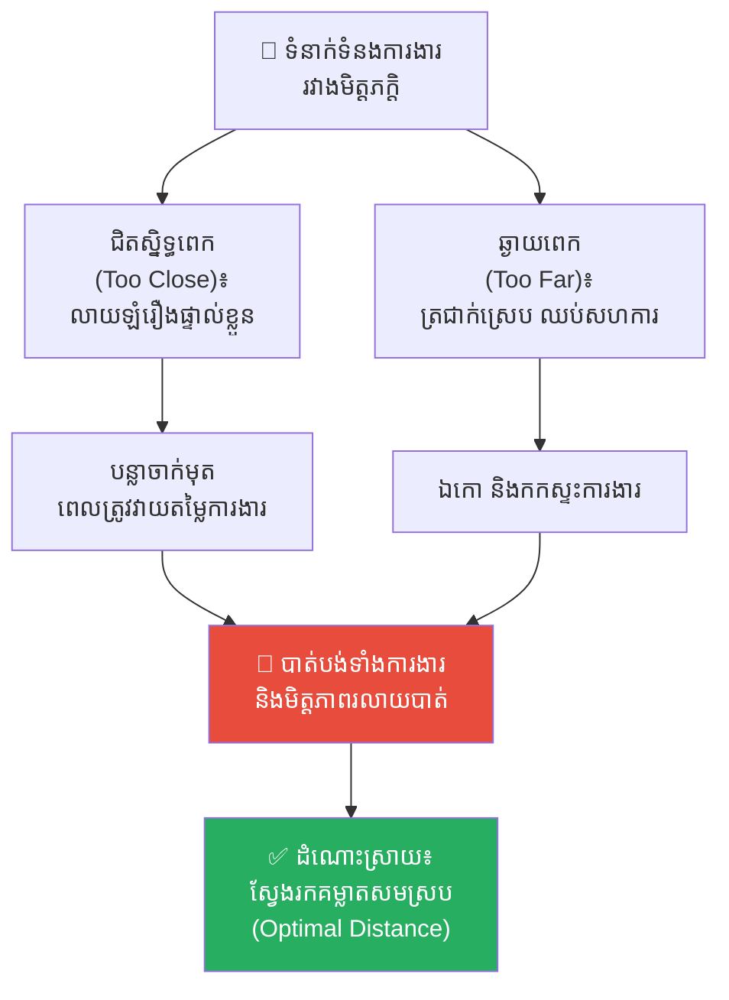
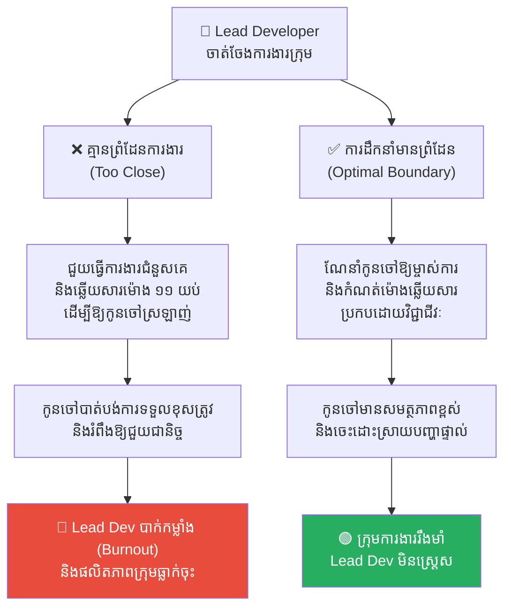
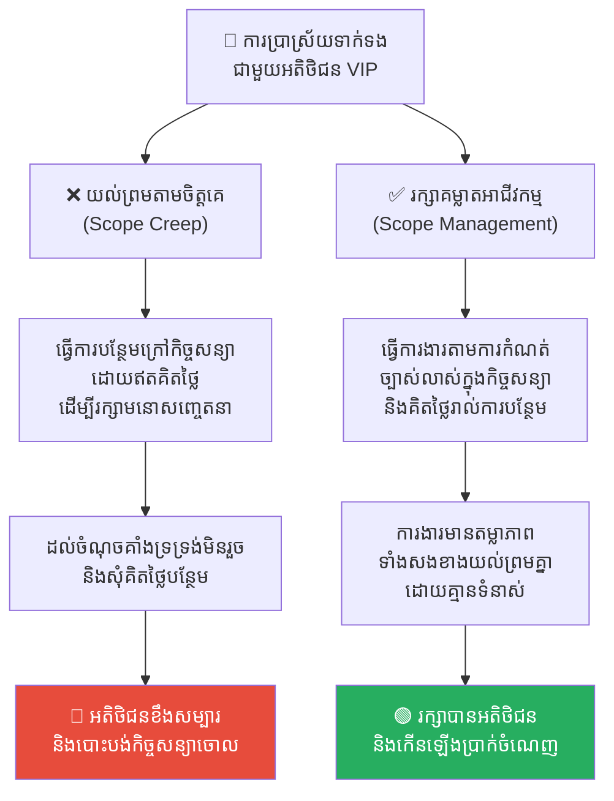
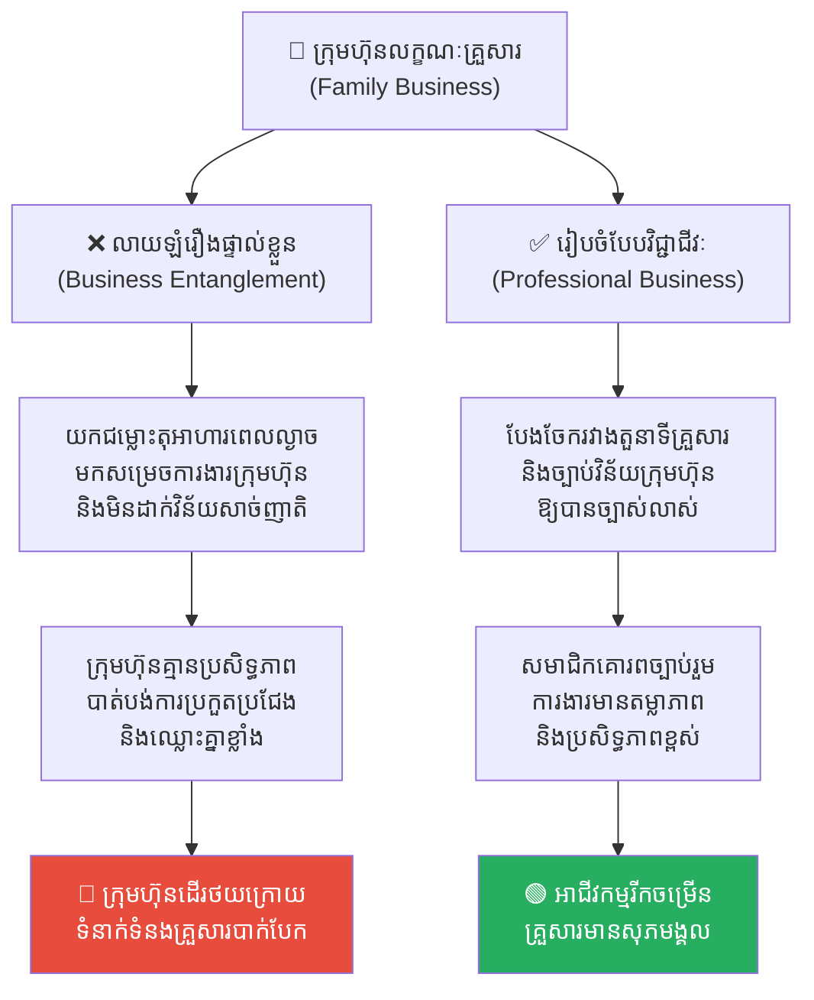
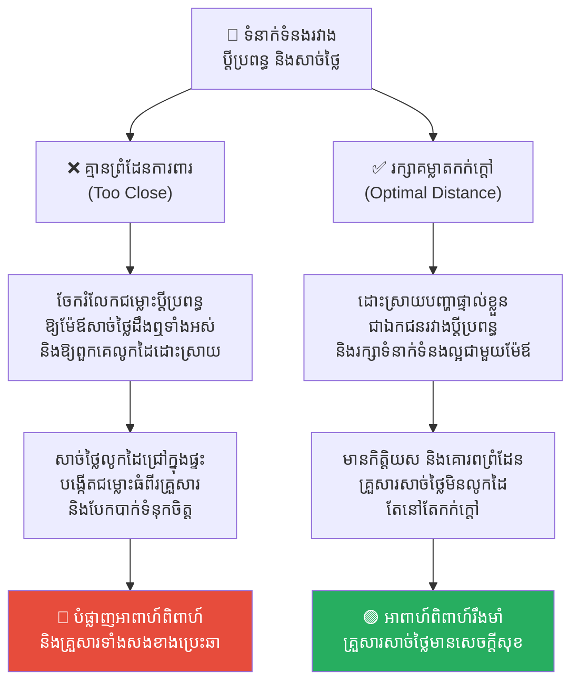

# The Hedgehog Dilemma (បញ្ហាលំបាកនៃសត្វប្រមា)៖ ការរក្សាតុល្យភាពរវាងភាពស្និទ្ធស្នាល និងព្រំដែនទំនាក់ទំនង

**Author:** ichamrong  
**Date:** 2026-05-17  
**Tags:** #hedgehog-dilemma #boundaries #relationship #psychology #mental-models #leadership #team-collaboration  
**Category:** Concepts  
**Read Time:** ~16 min  

---

## 📌 មាតិកា (Table of Contents)
- [អន្ទាក់ផ្លូវចិត្ត (The Trap)](#អន្ទាក់ផ្លូវចិត្ត-the-trap)
- [១. បញ្ហា៖ ភាពរងា និងបន្លាមុត (The Issue: Coldness and Quills)](#១-បញ្ហា-ភាពរងា-និងបន្លាមុត-the-issue-coldness-and-quills)
- [២. ឧទាហរណ៍ជាក់ស្តែងក្នុងពិភពពិត (Real World Examples)](#២-ឧទាហរណ៍ជាក់ស្តែងក្នុងពិភពពិត)
  - [ឧទាហរណ៍ទី ១ — កម្រិតស្រាល៖ ជម្លោះមិត្តភាពក្នុងក្រុមការងារ (The Workspace Friendship Trap)](#ឧទាហរណ៍ទី-១-កម្រិតស្រាល-ជម្លោះមិត្តភាពក្នុងក្រុមការងារ-the-workspace-friendship-trap)
  - [ឧទាហរណ៍ទី ២ — កម្រិតមធ្យម (បច្ចេកទេស)៖ ការគ្រប់គ្រងគ្មានព្រំដែន (Boundary-less Engineering Lead)](#ឧទាហរណ៍ទី-២-កម្រិតមធ្យម-បច្ចេកទេស-ការគ្រប់គ្រងគ្មានព្រំដែន-boundary-less-engineering-lead)
  - [ឧទាហរណ៍ទី ៣ — កម្រិតមធ្យម (ធុរកិច្ច)៖ ការប្រាស្រ័យទាក់ទងជាមួយអតិថិជន (Client Relationship Management)](#ឧទាហរណ៍ទី-៣-កម្រិតមធ្យម-ធុរកិច្ច-ការប្រាស្រ័យទាក់ទងជាមួយអតិថិជន-client-relationship-management)
  - [ឧទាហរណ៍ទី ៤ — កម្រិតធ្ងន់៖ គ្រួសារធុរកិច្ច និងជម្លោះផលប្រយោជន៍ (Family Business Entanglement)](#ឧទាហរណ៍ទី-៤-កម្រិតធ្ងន់-គ្រួសារធុរកិច្ច-និងជម្លោះផលប្រយោជន៍-family-business-entanglement)
  - [ឧទាហរណ៍ទី ៥ — កម្រិតស្រាល (ទំនាក់ទំនងផ្ទាល់ខ្លួន)៖ ព្រំដែនទំនាក់ទំនងរវាងប្តីប្រពន្ធ និងគ្រួសារសាច់ថ្លៃ (In-law Relationship Dynamics)](#ឧទាហរណ៍ទី-៥-កម្រិតស្រាល-ទំនាក់ទំនងផ្ទាល់ខ្លួន-ព្រំដែនទំនាក់ទំនងរវាងប្តីប្រពន្ធ-និងគ្រួសារសាច់ថ្លៃ-in-law-relationship-dynamics)
- [៣. កត្តាជម្រុញ៖ ការភ័យខ្លាចភាពឯកោ និងការចង់បានការយល់ព្រម (The Aggravator: Fear of Loneliness & Need for Approval)](#៣-កត្តាជម្រុញ-ការភ័យខ្លាចភាពឯកោ-និងការចង់បានការយល់ព្រម-the-aggravator-fear-of-loneliness-need-for-approval)
- [៤. ដំណោះស្រាយទូទៅ (The General Solution)](#៤-ដំណោះស្រាយទូទៅ-the-general-solution)
  - [ស្វែងរកគម្លាតសុវត្ថិភាពដ៏ល្អប្រសើរ (The Optimal Distance)](#ស្វែងរកគម្លាតសុវត្ថិភាពដ៏ល្អប្រសើរ-the-optimal-distance)
  - [បង្កើត និងគោរពព្រំដែនច្បាស់លាស់ (Define Clear Boundaries)](#បង្កើត-និងគោរពព្រំដែនច្បាស់លាស់-define-clear-boundaries)
  - [ភាពកក់ក្តៅប្រកបដោយវិជ្ជាជីវៈ (Warm Professionalism)](#ភាពកក់ក្តៅប្រកបដោយវិជ្ជាជីវៈ-warm-professionalism)
- [សេចក្តីសន្និដ្ឋាន (Conclusion)](#សេចក្តីសន្និដ្ឋាន-conclusion)
- [Related Posts](#related-posts)

---

## អន្ទាក់ផ្លូវចិត្ត (The Trap)

តើអ្នកធ្លាប់ព្យាយាមកសាងទំនាក់ទំនងជិតស្និទ្ធខ្លាំងជាមួយមិត្តរួមការងារ ឬកូនចៅក្រោមបង្គាប់ ដោយសង្ឃឹមថានឹងបង្កើតបរិយាកាសការងារដូចជា «គ្រួសារតែមួយ» ដែរឬទេ?

ដំបូងឡើយ អ្វីៗគ្រប់យ៉ាងពិតជាល្អណាស់។ អ្នកទាំងពីរចែករំលែករឿងរ៉ាវផ្ទាល់ខ្លួន ទៅញ៉ាំអាហារ និងដើរលេងជាមួយគ្នាក្រៅម៉ោងការងារ។ ប៉ុន្តែប៉ុន្មានខែក្រោយមក នៅពេលដែលការងាររបស់ពួកគេចាប់ផ្តើមមានកំហុសឆ្គង ឬធ្លាក់ចុះ ហើយអ្នកត្រូវបង្ខំចិត្តធ្វើការស្តីបន្ទោស ឬវាយតម្លៃការងាររបស់ពួកគេយ៉ាងតឹងរ៉ឹង៖
* ពួកគេមានអារម្មណ៍ថាអ្នកក្បត់មិត្តភាពរបស់ពួកគេ។
* អ្នកមានអារម្មណ៍ពិបាកចិត្ត និងស្ទាក់ស្ទើរក្នុងការកែតម្រូវការងាររបស់ពួកគេ ព្រោះខ្លាចខូចទំនាក់ទំនងផ្ទាល់ខ្លួន។
* មិត្តភាពជិតស្និទ្ធនោះស្រាប់តែប្រែជាមានជាតិពុល ការអាក់អន់ចិត្ត និងភាពមិនស្រណុកចិត្តរៀងរាល់ពេលជជែកគ្នានៅក្នុងអគារការងារ។

នេះគឺជាសកម្មភាពនៃ **The Hedgehog Dilemma (បញ្ហាលំបាកនៃសត្វប្រមា)**។

---

## ១. បញ្ហា៖ ភាពរងា និងបន្លាមុត (The Issue: Coldness and Quills)

**Hedgehog Dilemma** (ឬ **Porcupine Dilemma**) គឺជាគំនិតចិត្តសាស្ត្រ និងទស្សនវិជ្ជាដ៏ល្បីល្បាញមួយ ដែលលើកឡើងដំបូងដោយលោក **Arthur Schopenhauer** និងក្រោយមកសម្របសម្រួលដោយលោក **Sigmund Freud**។ វាបង្ហាញពីឧបសគ្គផ្លូវចិត្តរបស់មនុស្សក្នុងការស្វែងរកភាពស្និទ្ធស្នាល៖

> *«នៅក្នុងរដូវរងាដ៏ត្រជាក់ខ្លាំង ក្រុមសត្វប្រមា (Hedgehogs) ប្រមូលផ្តុំគ្នាជិតស្និទ្ធដើម្បីកម្តៅគ្នាទៅវិញទៅមក ការពារកុំឱ្យកកស្លាប់។ ប៉ុន្តែនៅពេលពួកវាខិតចូលជិតគ្នាពេក បន្លាដ៏មុតស្រួចនៅលើខ្លួនរបស់ពួកវា (Quills) ក៏ចាប់ផ្តើមមុតចាក់គ្នាទៅវិញទៅមក បង្កការឈឺចាប់ជាខ្លាំង។ ពួកវាក៏បង្ខំចិត្តដើរថយក្រោយចេញឆ្ងាយពីគ្នាវិញដើម្បីកុំឱ្យឈឺចាប់ តែភាពរងាដ៏ត្រជាក់ក៏ចាប់ផ្តើមយាយីពួកវាដដែល។ ពួកវាក៏ត្រូវព្យាយាមរំកិលចុះឡើងម្តងហើយម្តងទៀត រហូតដល់រកឃើញ **«គម្លាតដ៏សមស្របមួយ (Optimal Distance)»** ដែលពួកគេអាចទទួលបានភាពកក់ក្តៅផង និងចៀសវាងការចាក់មុតពីបន្លាផង។»*

និយាយឱ្យសាមញ្ញ៖
❌ ការគ្មានព្រំដែន (ចង់ស្និទ្ធស្នាលពេក) = រងការចាក់មុត និងឈឺចាប់។

❌ ការដកខ្លួនដាច់ឆ្ងាយ (ចង់សុវត្ថិភាពពេក) = រងា និងឯកោខ្លាំង។

✅ ដំណោះស្រាយពិត = ស្វែងរកគម្លាតសុវត្ថិភាពដែលមានទាំងភាពកក់ក្តៅ និងព្រំដែនការពារ។

---

## ២. ឧទាហរណ៍ជាក់ស្តែងក្នុងពិភពពិត

សូមពិនិត្យមើល **ឧទាហរណ៍ជាក់ស្តែងចំនួន ៥** បង្ហាញពីរបៀបដែលគម្លាតទំនាក់ទំនងមានសារៈសំខាន់ក្នុងការងារ និងជីវិត៖

---

### ឧទាហរណ៍ទី ១ — កម្រិតស្រាល៖ ជម្លោះមិត្តភាពក្នុងក្រុមការងារ (The Workspace Friendship Trap)

**ស្ថានភាព៖** ទំនាស់ការងាររវាងមិត្តភក្តិជិតស្និទ្ធពីរនាក់ដែលធ្វើការងារក្នុងនាយកដ្ឋានតែមួយ។

* **បន្លាចាក់មុត (Too Close)៖** ពួកគេដឹងរាល់រឿងរ៉ាវសម្ងាត់ផ្ទាល់ខ្លួន ជួបគ្នាពីព្រឹកដល់យប់។ នៅពេលម្នាក់ឡើងកាន់តំណែងជាប្រធានក្រុម ពួកគេត្រូវបង្ខំចិត្តបែងចែកភារកិច្ចពិបាកៗឱ្យមិត្តភក្តិ។ មិត្តភក្តិមានអារម្មណ៍ខឹងថា៖ *«ហេតុអ្វីបានជាឯងមិនយោគយល់អញសោះ? យើងជាមិត្តជិតស្និទ្ធនឹងគ្នាតើ!»*
* **ភាពរងាត្រជាក់ (Too Far)៖** បន្ទាប់ពីមានទំនាស់ ពួកគេឈប់និយាយគ្នាទាំងស្រុង ធ្វើការងារតែម្នាក់ឯង និងមិនព្រមសហការគ្នាក្នុងគម្រោងថ្មី ដែលធ្វើឱ្យបរិយាកាសក្រុមទាំងមូលកកស្ទះ និងតានតឹងខ្លាំង។
* **ដំណោះស្រាយពិត៖** ស្វែងរកគម្លាតសុវត្ថិភាព។ រៀនបែងចែកឱ្យច្បាស់រវាង «តួនាទីអាជីពក្នុងម៉ោងការងារ» និង «មិត្តភាពក្រៅម៉ោងការងារ» ដោយមានការព្រមព្រៀង និងយល់ចិត្តគ្នាជាមុន។

---

### ឧទាហរណ៍ទី ២ — កម្រិតមធ្យម (បច្ចេកទេស)៖ ការគ្រប់គ្រងគ្មានព្រំដែន (Boundary-less Engineering Lead)

**ស្ថានភាព៖** Lead Developer ចង់ឱ្យសមាជិកក្រុមទាំងអស់ស្រឡាញ់ខ្លួនខ្លាំង ពួកគេក៏ចាប់ផ្តើមលុបចោលរាល់ព្រំដែនការងារ៖ ពួកគេអនុញ្ញាតឱ្យសមាជិកផ្ញើសារសួរការងារផ្ទាល់ខ្លួននៅម៉ោង ១១ យប់, អនុញ្ញាតឱ្យខកខាន Deadline ដោយគ្មានហេតុផលច្បាស់លាស់ និងជួយធ្វើការងារជំនួសពួកគេរាល់ពេលមានបញ្ហា។

* **បន្លាចាក់មុត (Too Close)៖** សមាជិកក្រុមចាប់ផ្តើមបាត់បង់ភាពទទួលខុសត្រូវ ផ្ញើការងារយឺតយ៉ាវ និងរំពឹងឱ្យ Lead Dev ជួយដោះស្រាយរាល់បញ្ហាតូចតាចជានិច្ច។ Lead Dev ធ្លាក់ខ្លួនចូលក្នុងស្ថានភាពបាក់កម្លាំង (Burnout) ធ្ងន់ធ្ងរ ព្រោះត្រូវទ្រទ្រង់រាល់ការងាររបស់ក្រុមទាំងមូល។
* **ដំណោះស្រាយពិត៖** ណែនាំកូនចៅឱ្យម្ចាស់ការ និងកំណត់ម៉ោងឆ្លើយសារប្រកបដោយវិជ្ជាជីវៈ។ ការបង្កើតព្រំដែនការងារជួយឱ្យសមាជិកអភិវឌ្ឍសមត្ថភាពម្ចាស់ការ និងការពារកុំឱ្យ Lead Dev ធ្លាក់ខ្លួនចូលក្នុងស្ថានភាពបាក់កម្លាំង។

---

### ឧទាហរណ៍ទី ៣ — កម្រិតមធ្យម (ធុរកិច្ច)៖ ការប្រាស្រ័យទាក់ទងជាមួយអតិថិជន (Client Relationship Management)

**ស្ថានភាព៖** ក្រុមហ៊ុនសេវាកម្មចង់កសាងទំនាក់ទំនងជិតស្និទ្ធជាមួយអតិថិជនលំដាប់ VIP ម្នាក់។

* **កំហុសគ្មានព្រំដែន (Too Close)៖** គណនេយ្យករគម្រោង (Account Manager) យល់ព្រមធ្វើការងារបន្ថែមក្រៅកិច្ចសន្យ (Scope Creep) រាប់សិបមុខដោយឥតគិតថ្លៃ គ្រាន់តែចង់រក្សា «ភាពស្និទ្ធស្នាល និងមនោសញ្ចេតនាល្អ»។
* **ការផ្ទុះឡើងនៃបញ្ហា៖** ដល់ចំណុចមួយដែលក្រុមហ៊ុនលែងមានសមត្ថភាពទ្រទ្រង់ការងារឥតគិតថ្លៃនោះបានទៀតហើយ ហើយសុំដកខ្លួនចេញ ឬសុំគិតថ្លៃបន្ថែម។ អតិថិជនមានអារម្មណ៍ខឹងសម្បារភ្លាមថា៖ *«ពីមុនធ្វើបាន ហេតុអ្វីឥឡូវធ្វើមិនបាន? ពួកអ្នកឯងពិតជាអាត្មានិយម និងលោភលន់ណាស់!»* ពួកគេក៏សម្រេចចិត្តបោះបង់កិច្ចសន្យាចោលទាំងស្រុង។
* **ដំណោះស្រាយពិត៖** ធ្វើការងារឱ្យមានព្រំដែនច្បាស់លាស់តាមកិច្ចសន្យា និងគិតថ្លៃរាល់ការងារបន្ថែម។ វារក្សាបានទាំងទំនុកចិត្ត តម្លាភាព និងស្ថិរភាពអាជីវកម្ម។

---

### ឧទាហរណ៍ទី ៤ — កម្រិតធ្ងន់៖ គ្រួសារធុរកិច្ច និងជម្លោះផលប្រយោជន៍ (Family Business Entanglement)

**ស្ថានភាព៖** ក្រុមហ៊ុនលក្ខណៈគ្រួសារ (Family Business) ដែលមានឪពុកម្តាយ បងប្អូនបង្កើត និងសាច់ញាតិធ្វើការងាររួមគ្នាដោយគ្មានរចនាសម្ព័ន្ធការងារច្បាស់លាស់។

* **បន្លាចាក់មុត (Too Close)៖** រាល់ការមិនចុះសម្រុងគ្នាក្នុងតុអាហារពេលល្ងាចរបស់គ្រួសារ ត្រូវបាននាំយកមកសម្រេចចិត្តក្នុងបន្ទប់ប្រជុំក្រុមហ៊ុន។ ហើយរាល់ការខកខានការងាររបស់សមាជិកម្នាក់ មិនអាចត្រូវបានដាក់វិន័យ ឬបណ្តេញចេញបានឡើយ ព្រោះខ្លាចប៉ះពាល់ដល់ «មនោសញ្ចេតនាគ្រួសារ»។
* **ដំណោះស្រាយពិត៖** បែងចែករចនាសម្ព័ន្ធរវាង «តួនាទីគ្រួសារ» និង «ច្បាប់វិន័យក្រុមហ៊ុន» ឱ្យបានដាច់ស្រឡះ និងច្បាស់លាស់។ វារក្សាបានទាំងការប្រកួតប្រជែងអាជីវកម្ម និងសុភមង្គលគ្រួសារ។

---

### ឧទាហរណ៍ទី ៥ — កម្រិតស្រាល (ទំនាក់ទំនងផ្ទាល់ខ្លួន)៖ ព្រំដែនទំនាក់ទំនងរវាងប្តីប្រពន្ធ និងគ្រួសារសាច់ថ្លៃ (In-law Relationship Dynamics)

**ស្ថានភាព៖** ទំនាក់ទំនងប្តីប្រពន្ធថ្មីថ្មោងដែលរស់នៅក្បែរ ឬជាមួយគ្រួសារសាច់ថ្លៃ (In-laws)។

* **បន្លាចាក់មុត (Too Close)៖** ប្តីប្រពន្ធចែករំលែករាល់ទំនាស់ រឿងរ៉ាវហិរញ្ញវត្ថុ និងអាថ៌កំបាំងផ្ទាល់ខ្លួនទៅឱ្យឪពុកម្តាយសាច់ថ្លៃដឹងឮទាំងអស់ និងអនុញ្ញាតឱ្យពួកគេលូកដៃចូលរួមសម្រេចចិត្តរាល់រឿងផ្ទៃក្នុងក្នុងផ្ទះ ដើម្បីតែចង់បង្ហាញភាពស្និទ្ធស្នាល។
* **សកម្មភាព High EQ (Optimal Distance)៖** រក្សាភាពជាឯកជន និងភាពម្ចាស់ការរបស់ប្តីប្រពន្ធ។ ដោះស្រាយរាល់បញ្ហា និងទំនាស់រវាងគ្នាដោយសន្តិវិធីជាឯកជន ដោយមិននាំយកទៅឱ្យគ្រួសារសាច់ថ្លៃលូកដៃឡើយ ប៉ុន្តែនៅតែរក្សាទំនាក់ទំនងល្អ ផ្តល់ការគោរព និងភាពកក់ក្តៅជាមួយពួកគេ។
* **លទ្ធផល៖** នៅក្រោមសកម្មភាព Low EQ គ្រួសារសាច់ថ្លៃចាប់ផ្តើមលូកដៃចូលរួមសម្រេចចិត្តកាន់តែជ្រៅ បង្កើតឱ្យមានទំនាស់រវាងគ្រួសារទាំងសងខាង និងបំផ្លាញទំនុកចិត្តរវាងប្តីប្រពន្ធទាំងស្រុង នាំឱ្យអាពាហ៍ពិពាហ៍ត្រូវបែកបាក់។

---

## ៣. កត្តាជម្រុញ៖ ការភ័យខ្លាចភាពឯកោ និងការចង់បានការយល់ព្រម (The Aggravator: Fear of Loneliness & Need for Approval)

ហេតុអ្វីបានជាយើងតែងតែពិបាកក្នុងការរក្សាព្រំដែនទំនាក់ទំនង?

1. **ការភ័យខ្លាចភាពឯកោ (Fear of Exclusion)៖** មនុស្សគឺជាសត្វសង្គម។ យើងភ័យខ្លាចខ្លាំងណាស់ចំពោះភាពឯកោ និងការដកខ្លួនចេញពីក្រុម។ ការភ័យខ្លាចនេះជម្រុញឱ្យយើងព្យាយាម «រំលាយព្រំដែនខ្លួនឯង» ដើម្បីចូលទៅជិតស្និទ្ធជាមួយអ្នកដទៃឱ្យបានលឿនបំផុត។
2. **ការភ័យខ្លាចជម្លោះ (Conflict Avoidance)៖** ការបង្កើតព្រំដែន (និយាយពាក្យថា «ទេ») ជារឿយៗបង្កើតឱ្យមានការមិនពេញចិត្ត ឬការខកចិត្តបណ្តោះអាសន្នពីអ្នកដទៃ។ ដើម្បីចៀសវាងភាពមិនស្រណុកចិត្តទាំងនេះ យើងសុខចិត្តអនុញ្ញាតឱ្យគេចាក់មុតនឹងបន្លាម្តងហើយម្តងទៀត។

---

## ៤. ដំណោះស្រាយទូទៅ (The General Solution)

តើយើងអាចអនុវត្តមេរៀនរបស់សត្វប្រមាដើម្បីកសាងទំនាក់ទំនងការងារដែលមានសុខភាពល្អយ៉ាងដូចម្តេច?

### ស្វែងរកគម្លាតសុវត្ថិភាពដ៏ល្អប្រសើរ (The Optimal Distance)
ត្រូវទទួលស្គាល់ថា គម្លាតសុវត្ថិភាពមិនមែនជាការ «ស្អប់ខ្ពើម ឬព្រងើយកន្តើយ» នោះឡើយ ប៉ុន្តែវាជាសកម្មភាពនៃការផ្តល់ **សេចក្តីថ្លៃថ្នូរ និងសេរីភាពផ្ទាល់ខ្លួន** ឱ្យគ្នាទៅវិញទៅមក៖
* នៅក្នុងការងារ៖ ស្និទ្ធស្នាលគ្រប់គ្រាន់ដើម្បីយល់ចិត្ត និងសហការគ្នាបានល្អ ប៉ុន្តែរក្សាគម្លាតគ្រប់គ្រាន់ដើម្បីអាចធ្វើការសម្រេចចិត្តប្រកបដោយវិជ្ជាជីវៈ និងតម្លាភាព។

### បង្កើត និងគោរពព្រំដែនច្បាស់លាស់ (Define Clear Boundaries)
កុំរង់ចាំរហូតដល់មានទំនាស់ទើបបង្កើតព្រំដែន។ ត្រូវនិយាយគ្នាឱ្យច្បាស់តាំងពីថ្ងៃដំបូង៖
* *«យើងជាមិត្តភក្តិល្អនឹងគ្នា ប៉ុន្តែនៅក្នុងម៉ោងការងារ និងចំពោះរាល់គម្រោង យើងត្រូវអនុវត្តតាមច្បាប់ការងារ និង Metric របស់ក្រុមហ៊ុនជាធំ។ នេះគឺជាការការពារមិត្តភាពរបស់យើងកុំឱ្យខូចខាតនាពេលអនាគត។»*

### ភាពកក់ក្តៅប្រកបដោយវិជ្ជាជីវៈ (Warm Professionalism)
ចៀសវាងភាពត្រជាក់ស្រេប (Coldness) ដោយការអនុវត្តការស្តាប់ដោយការយល់ចិត្ត (Active Listening) គាំទ្រ និងកោតសរសើរការងារសមាជិកក្រុម។ ប៉ុន្តែត្រូវទប់ស្កាត់បន្លាមុតដោយរក្សាភាពហ្មត់ចត់ ការគោរពច្បាប់វិន័យ និងការវាយតម្លៃដោយស្មើភាព។

---

## សេចក្តីសន្និដ្ឋាន (Conclusion)

Hedgehog Dilemma រំលឹកយើងថា ទំនាក់ទំនងដែលរឹងមាំ និងយូរអង្វែងបំផុត មិនមែនជាទំនាក់ទំនងដែលរលាយចូលគ្នាជាតែមួយគ្មានព្រំដែននោះឡើយ។ ប៉ុន្តែវាគឺជាទំនាក់ទំនងដែលមនុស្សពីរនាក់ អាចរស់នៅក្បែរគ្នា ផ្តល់ភាពកក់ក្តៅ និងការគាំទ្រឱ្យគ្នាទៅវិញទៅមក ដោយគោរពនូវព្រំដែន និងភាពជាម្ចាស់ការរបស់រៀងៗខ្លួនជារៀងរហូត។

---

## Related Posts

* **[05-relative-deprivation-effect.md](./05-relative-deprivation-effect.md)** — របៀបដែលការប្រៀបធៀបសង្គមបង្កើតឱ្យមានការឈឺចាប់ និងទំនាស់។
* **[The Hedgehog Dilemma (បញ្ហាលំបាកនៃសត្វប្រមា)](../parables/08-the-hedgehog-dilemma.md)** — រឿងព្រេងក្រិកបុរាណរវាងសត្វប្រមាពីរនាក់គឺ សូកូ និង គីគី នៅក្នុងរដូវរងា។

---

*Last updated: 2026-05-26*
