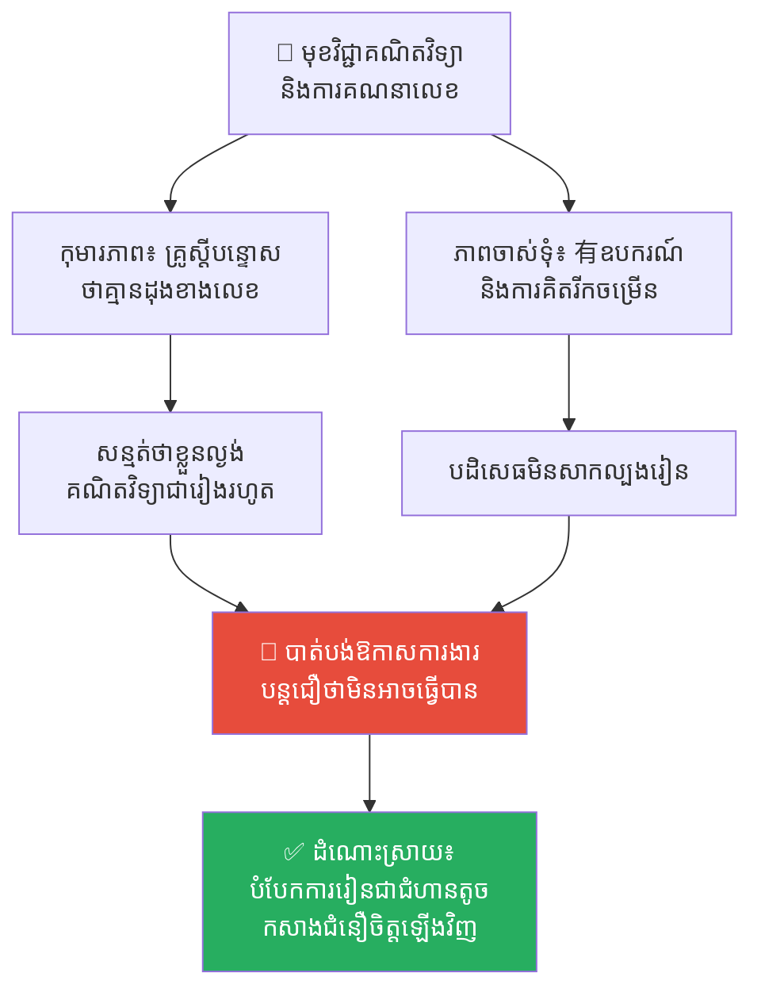
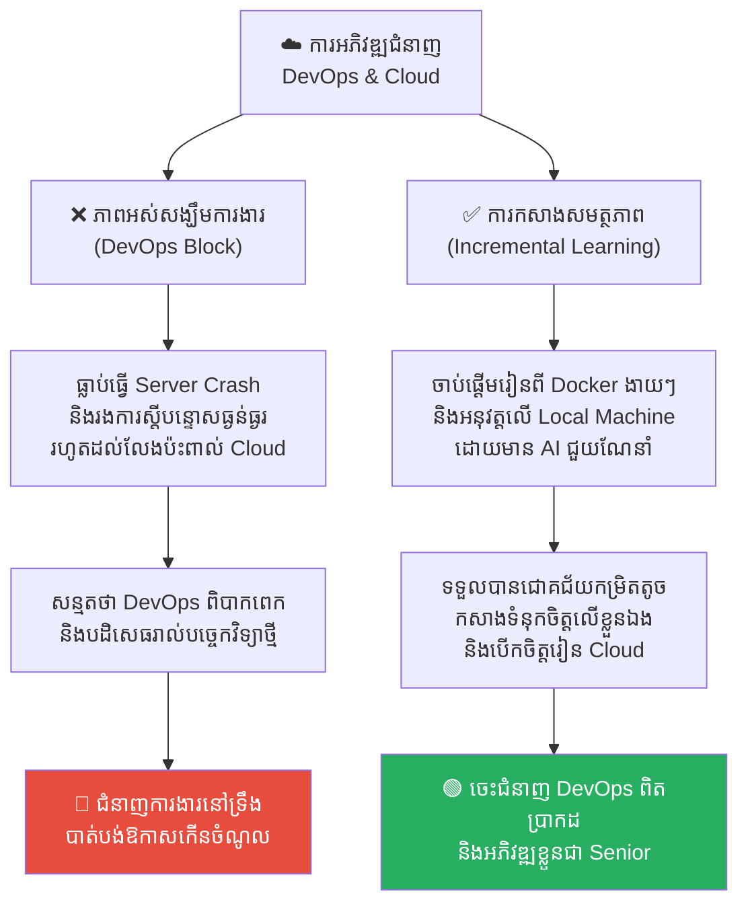
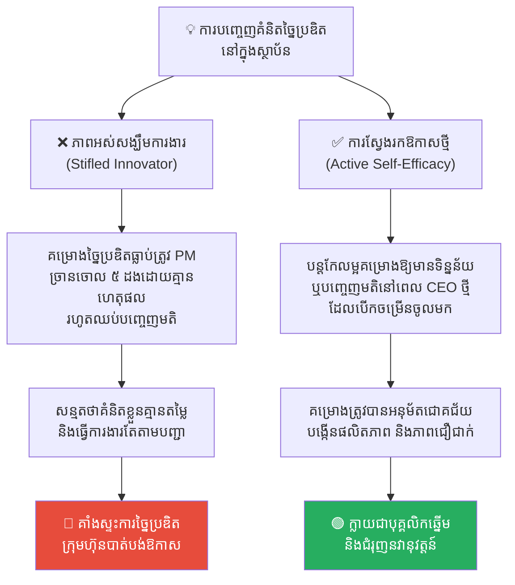
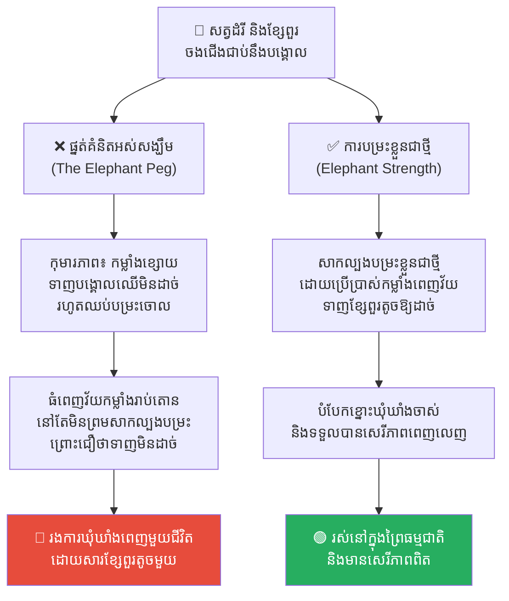
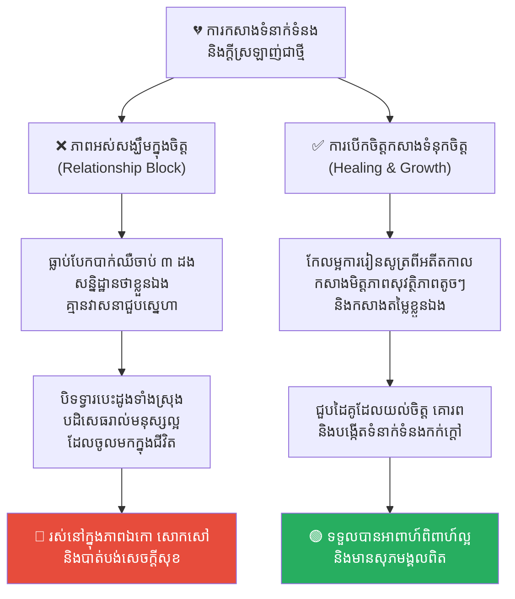

# Learned Helplessness (ភាពអស់សង្ឃឹមដែលបានរៀនសូត្រ)៖ ការបំបែកខ្នោះខ្នងផ្លូវចិត្តនៃអតីតកាល

**Author:** ichamrong  
**Date:** 2026-05-17  
**Tags:** #learned-helplessness #psychology #mental-models #self-efficacy #motivation #personal-growth  
**Category:** Concepts  
**Read Time:** ~16 min  

---

## 📌 មាតិកា (Table of Contents)
- [អន្ទាក់ផ្លូវចិត្ត (The Trap)](#អន្ទាក់ផ្លូវចិត្ត-the-trap)
- [១. បញ្ហា៖ ខ្នោះខ្នងដែលមើលមិនឃើញ (The Issue: The Invisible Chains)](#១-បញ្ហា-ខ្នោះខ្នងដែលមើលមិនឃើញ-the-issue-the-invisible-chains)
- [២. ឧទាហរណ៍ជាក់ស្តែងក្នុងពិភពពិត (Real World Examples)](#២-ឧទាហរណ៍ជាក់ស្តែងក្នុងពិភពពិត)
  - [ឧទាហរណ៍ទី ១ — កម្រិតស្រាល៖ ភាពភ័យខ្លាចមុខវិជ្ជាគណិតវិទ្យា (The Math Anxiety Block)](#ឧទាហរណ៍ទី-១-កម្រិតស្រាល-ភាពភ័យខ្លាចមុខវិជ្ជាគណិតវិទ្យា-the-math-anxiety-block)
  - [ឧទាហរណ៍ទី ២ — កម្រិតមធ្យម (បច្ចេកទេស)៖ ភាពភ័យខ្លាច Cloud & DevOps (The DevOps Learning Block)](#ឧទាហរណ៍ទី-២-កម្រិតមធ្យម-បច្ចេកទេស-ភាពភ័យខ្លាច-cloud-devops-the-devops-learning-block)
  - [ឧទាហរណ៍ទី ៣ — កម្រិតមធ្យម (ធុរកិច្ច)៖ ភាពគាំងស្ទះនៃការច្នៃប្រឌិត (The Stifled Innovator)](#ឧទាហរណ៍ទី-៣-កម្រិតមធ្យម-ធុរកិច្ច-ភាពគាំងស្ទះនៃការច្នៃប្រឌិត-the-stifled-innovator)
  - [ឧទាហរណ៍ទី ៤ — កម្រិតធ្ងន់៖ ទេវកថានៃដំរីសឹក និងខ្សែចងជើង (The Elephant and the Peg)](#ឧទាហរណ៍ទី-៤-កម្រិតធ្ងន់-ទេវកថានៃដំរីសឹក-និងខ្សែចងជើង-the-elephant-and-the-peg)
  - [ឧទាហរណ៍ទី ៥ — កម្រិតស្រាល (ទំនាក់ទំនងផ្ទាល់ខ្លួន)៖ ភាពអស់សង្ឃឹមក្នុងការស្វែងរកស្នេហា ឬការកសាងមិត្តភាព (Relationship Helplessness)](#ឧទាហរណ៍ទី-៥-កម្រិតស្រាល-ទំនាក់ទំនងផ្ទាល់ខ្លួន-ភាពអស់សង្ឃឹមក្នុងការស្វែងរកស្នេហា-ឬការកសាងមិត្តភាព-relationship-helplessness)
- [៣. កត្តាជម្រុញ៖ ការរិះគន់បំផ្លាញ និងអវត្តមាននៃបទពិសោធន៍ជោគជ័យ (The Aggravator: Destructive Criticism & Absence of Micro-Wins)](#៣-កត្តាជម្រុញ-ការរិះគន់បំផ្លាញ-និងអវត្តមាននៃបទពិសោធន៍ជោគជ័យ-the-aggravator-destructive-criticism-absence-of-micro-wins)
- [៤. ដំណោះស្រាយទូទៅ (The General Solution)](#៤-ដំណោះស្រាយទូទៅ-the-general-solution)
  - [រចនាជោគជ័យកម្រិតតូចបំផុត (Design Micro-Wins)](#រចនាជោគជ័យកម្រិតតូចបំផុត-design-micro-wins)
  - [កែប្រែការពន្យល់ខ្លួនឯងឡើងវិញ (Reframe Your Explanatory Style)](#កែប្រែការពន្យល់ខ្លួនឯងឡើងវិញ-reframe-your-explanatory-style)
  - [ពង្រឹងស្មារតីជឿជាក់លើសមត្ថភាពខ្លួនឯង (Boost Self-Efficacy)](#ពង្រឹងស្មារតីជឿជាក់លើសមត្ថភាពខ្លួនឯង-boost-self-efficacy)
- [សេចក្តីសន្និដ្ឋាន (Conclusion)](#សេចក្តីសន្និដ្ឋាន-conclusion)
- [Related Posts](#related-posts)

---

## អន្ទាក់ផ្លូវចិត្ត (The Trap)

តើអ្នកធ្លាប់ជួបប្រទះស្ថានភាពមួយដែលអ្នកចង់រៀនជំនាញថ្មីមួយ (ដូចជា ការសរសេរកូដភាសាថ្មី មុខវិជ្ជាវិទ្យាសាស្ត្រ ឬការនិយាយជាសាធារណៈ) ប៉ុន្តែខួរក្បាលរបស់អ្នកស្រាប់តែស្រែកប្រាប់ភ្លាមថា៖ *«កុំព្យាយាមអី ឯងគ្មានដុងខាងហ្នឹងទេ! ពីមុនធ្លាប់ធ្វើខូចម្តងហើយតើ ធ្វើម្តងទៀតក៏នៅតែខូចដដែលហ្នឹង!»* ដែរឬទេ?

ឬនៅក្នុងក្រុមការងារ តើអ្នកធ្លាប់ឃើញសមាជិកម្នាក់ដែលឈប់ហ៊ានបញ្ចេញមតិយោបល់ ឬឈប់ហ៊ានសាកល្បងគំនិតថ្មីៗទាំងស្រុង ដោយសុខចិត្តធ្វើតែការងារសាមញ្ញៗដែលគេបង្គាប់ ទោះបីជាពួកគេមានសមត្ថភាពខ្ពស់ក៏ដោយដែរឬទេ?

ស្ថានភាពផ្លូវចិត្តនៃការបោះបង់ការប្រយុទ្ធទាំងស្រុងនេះ មិនមែនមកពីពួកគេខ្ជិល ឬខ្វះសមត្ថភាពនោះឡើយ។ ប៉ុន្តែវាគឺជាការឆ្លុះបញ្ចាំងនៃកម្មវិធីមេរោគផ្លូវចិត្តដ៏គួរឱ្យខ្លាចមួយហៅថា **Learned Helplessness (ភាពអស់សង្ឃឹមដែលបានរៀនសូត្រ)**។

---

## ១. បញ្ហា៖ ខ្នោះខ្នងដែលមើលមិនឃើញ (The Issue: The Invisible Chains)

**Learned Helplessness** គឺជាបាតុភូតចិត្តសាស្ត្រមួយដែលរកឃើញដំបូងដោយលោក **Martin Seligman** ក្នុងទសវត្សរ៍ឆ្នាំ ១៩៦០។ វាគឺជាស្ថានភាពមួយដែល៖

> *«នៅពេលបុគ្គលម្នាក់រងគ្រោះ ឬជួបប្រទះនឹងការបរាជ័យ និងព្រឹត្តិការណ៍ឈឺចាប់ដដែលៗ ដែលពួកគេមិនអាចគ្រប់គ្រង ឬគេចផុតបានកាលពីអតីតកាល ពួកគេក៏ចាប់ផ្តើម **«រៀនសូត្រ និងសន្មត់»** ថាខ្លួនឯងនឹងគ្មានសមត្ថភាពគ្រប់គ្រង ឬផ្លាស់ប្តូរវាជារៀងរហូត។ ទោះបីជានៅពេលអនាគត ស្ថានភាពបានប្រែប្រួល សេរីភាពត្រូវបានបើកចំហ និងមានផ្លូវគេចផុតយ៉ាងងាយស្រួលក៏ដោយ ក៏ពួកគេសម្រេចចិត្តអង្គុយទ្រាំទ្ររងទុក្ខ និងមិនព្រមសាកល្បងគេចផុតឡើយ។»*

និយាយឱ្យសាមញ្ញ៖
* អតីតកាលដែលឈឺចាប់ បានសាងសង់ **«ខ្នោះខ្នងផ្លូវចិត្ត»** ឃុំឃាំងយើង។
* យើងបាត់បង់ការជឿជាក់លើសមត្ថភាពខ្លួនឯង (Self-Efficacy) ដោយជឿថារាល់សកម្មភាពរបស់យើងនឹងមិនអាចបង្កើតលទ្ធផលវិជ្ជមានអ្វីឡើយ។

```
❌ ផ្នត់គំនិតអស់សង្ឃឹម៖ "ខ្ញុំធ្លាប់ធ្វើបរាជ័យកាលពីមុន = ខ្ញុំគ្មានសមត្ថភាពធ្វើវាបានជារៀងរហូត។"
✅ ផ្នត់គំនិតរីកចម្រើន៖ "អតីតកាលបរាជ័យ = គ្រាន់តែជាទិន្នន័យចាស់។ ស្ថានភាពបច្ចុប្បន្នបានប្រែប្រួល ហើយខ្ញុំអាចរៀនសូត្រវាឡើងវិញបាន។"
```

---

## ២. ឧទាហរណ៍ជាក់ស្តែងក្នុងពិភពពិត

សូមពិនិត្យមើល **ឧទាហរណ៍ជាក់ស្តែងចំនួន ៥** បង្ហាញពីរបៀបដែល Learned Helplessness បង្កើតខ្នោះខ្នងឃុំឃាំងមនុស្សក្នុងអាជីព និងជីវិត៖

---

### ឧទាហរណ៍ទី ១ — កម្រិតស្រាល៖ ភាពភ័យខ្លាចមុខវិជ្ជាគណិតវិទ្យា (The Math Anxiety Block)

**ស្ថានភាព៖** យុវសិស្សម្នាក់ដែលតែងតែទទួលបានពិន្ទុអន់ក្នុងមុខវិជ្ជាគណិតវិទ្យាកាលពីថ្នាក់បឋមសិក្សា។

* **ការបង្កើតខ្នោះផ្លូវចិត្ត៖** គ្រូធ្លាប់ស្តីបន្ទោសពួកគេនៅចំពោះមុខមិត្តរួមថ្នាក់ថា៖ *«ឯងពិតជាល្ងង់គណិតវិទ្យាណាស់ រៀនមិនចេះដូចគេសោះ!»*
* **លទ្ធផលនៅវ័យកណ្តាល៖** នៅពេលពួកគេរៀនដល់សកលវិទ្យាល័យ ឬត្រូវវិភាគទិន្នន័យស្ថិតិសាមញ្ញក្នុងការងារ ពួកគេបិទទ្វារខួរក្បាលភ្លាមដោយនិយាយថា៖ *«ខ្ញុំគ្មានដុងខាងលេខឡើយ ខ្ញុំមិនអាចធ្វើវាបានទេ»* ដោយមិនបានព្យាយាមអាន ឬសិក្សាពីគំនិតថ្មីៗសាមញ្ញសោះឡើយ ទោះបីជាពេលនេះពួកគេមានភាពចាស់ទុំ និងមានឧបករណ៍ជួយគណនាច្រើនក៏ដោយ។



---

### ឧទាហរណ៍ទី ២ — កម្រិតមធ្យម (បច្ចេកទេស)៖ ភាពភ័យខ្លាច Cloud & DevOps (The DevOps Learning Block)

**ស្ថានភាព៖** Developer ចាស់វស្សាម្នាក់ដែលធ្លាប់តែសរសេរកូដនៅលើ Local Machine ប៉ុណ្ណោះ។

* **ព្រឹត្តិការណ៍ឈឺចាប់៖** ៣ ឆ្នាំមុន ពួកគេធ្លាប់ព្យាយាម Deploy កូដទៅកាន់ AWS Cloud តែម្នាក់ឯង។ ពួកគេ Setup ខុស ធ្វើឱ្យ Server Crash និងរងការស្តីបន្ទោសយ៉ាងធ្ងន់ធ្ងរពី CTO ព្រមទាំងក្រុមហ៊ុនត្រូវខាតបង់ថវិកា Cloud Billing អស់ $2,000 ក្នុងមួយយប់។
* **ភាពអស់សង្ឃឹម៖** ចាប់ពីពេលនោះមក ពួកគេឈប់ប៉ះពាល់ការងារ DevOps ទាំងស្រុង។ ពេលក្រុមហ៊ុនប្តូរមកប្រើប្រាស់ Docker, Kubernetes និងប្រព័ន្ធ CI/CD ទំនើប ពួកគេបដិសេធមិនរៀនសូត្រ ដោយគិតថា៖ *«DevOps ស្មុគស្មាញពេកសម្រាប់ខ្ញុំ ខ្ញុំមិនអាចយល់វាបានឡើយ។ ខ្ញុំគ្រាន់តែសរសេរកូដសាមញ្ញៗបានហើយ។»*
* **ការពិតដ៏ជូរចត់៖** ពួកគេកំពុងឃុំឃាំងខ្លួនឯងនៅក្នុងអតីតកាល។ ឥឡូវនេះមានប្រព័ន្ធ GUI, Terraform និង AI Assistants ជាច្រើនដែលជួយសម្រួលការងារ Cloud ឱ្យសាមញ្ញជាងមុន ១០ ដង ប៉ុន្តែពួកគេមិនព្រមបើកចិត្តសាកល្បងឡើយ។



---

### ឧទាហរណ៍ទី ៣ — កម្រិតមធ្យម (ធុរកិច្ច)៖ ភាពគាំងស្ទះនៃការច្នៃប្រឌិត (The Stifled Innovator)

**ស្ថានភាព៖** បុគ្គលិកផ្នែកច្នៃប្រឌិតម្នាក់នៅក្នុងក្រុមហ៊ុនដែលមានរចនាសម្ព័ន្ធការងារតឹងរ៉ឹង និងបែបការិយាធិបតេយ្យ (Bureaucratic)។

* **បទពិសោធន៍ចាស់៖** នៅក្នុងរយៈពេលមួយឆ្នាំដំបូង ពួកគេធ្លាប់សរសេរគម្រោងច្នៃប្រឌិតថ្មីៗចំនួន ៥ ដាក់ជូនថ្នាក់លើ។ គ្រប់គម្រោងទាំងអស់ត្រូវបានច្រានចោលភ្លង់ៗដោយគ្មានហេតុផលច្បាស់លាស់ ក្រៅពីពាក្យថា៖ *«កុំធ្វើរបស់ប្លែកៗនាំឱ្យខាតពេល ធ្វើតាមតែច្បាប់ចាស់ទៅបានហើយ។»*
* **លទ្ធផល៖** ពួកគេធ្លាក់ខ្លួនចូលក្នុងស្ថានភាព Learned Helplessness។ ពួកគេឈប់គិតគំនិតច្នៃប្រឌិតចោលទាំងអស់ ធ្វើការងារតែតាមបញ្ជា និងលែងខ្វល់ខ្វាយពីការរីកចម្រើនរបស់ក្រុមហ៊ុន។ ទោះបីជាពេលក្រោយមក ក្រុមហ៊ុនបានប្តូរ CEO ថ្មីដែលចូលចិត្តការច្នៃប្រឌិត និងស្វែងរកគំនិតថ្មីៗក៏ដោយ ក៏បុគ្គលិកម្នាក់នេះនៅតែស្ងៀមស្ងាត់ និងមិនព្រមបញ្ចេញគំនិតដដែល។



---

### ឧទាហរណ៍ទី ៤ — កម្រិតធ្ងន់៖ ទេវកថានៃដំរីសឹក និងខ្សែចងជើង (The Elephant and the Peg)

**ស្ថានភាព៖** ជារឿងប្រៀបប្រដូចដ៏ល្បីល្បាញស្តីពីការហ្វឹកហាត់សត្វដំរីនៅក្នុងសៀក។

* **ការបង្វឹកវ័យក្មេង៖** ពេលដំរីនៅតូច ហ្មដំរីបានចងជើងរបស់វាជាមួយនឹងបង្គោលឈើដ៏រឹងមាំមួយដោយប្រើខ្សែពួរតូចមួយ។ កូនដំរីប្រឹងប្រែងទាញ រុញ និងបម្រះរាល់ថ្ងៃដើម្បីគេចផុត តែដោយសារកម្លាំងវានៅខ្សោយ វាទាញមិនដាច់ឡើយ។ យូរៗទៅ កូនដំរីក៏បញ្ឈប់ការបម្រះចោលទាំងស្រុង ព្រោះវាជឿជាក់ថាមិនអាចទៅរួច។
* **ដំរីធំពេញវ័យ៖** ពេលដំរីលូតលាស់ធំធាត់មានកម្លាំងរាប់តោន ដែលអាចបោកផ្តួលដើមឈើធំៗបានយ៉ាងងាយស្រួល ហ្មដំរីនៅតែចងជើងវានឹងបង្គោលឈើតូចដដែលដោយប្រើខ្សែពួរសាមញ្ញមួយ។ សត្វដំរីធំនោះអង្គុយស្ងៀមស្ងាត់ មិនព្រមសាកល្បងបម្រះទាញខ្សែពួរតូចនោះឱ្យដាច់ឡើយ ព្រោះវាជឿជាក់លើខ្នោះផ្លូវចិត្តកាលពីវានៅតូចជានិច្ច។



---

### ឧទាហរណ៍ទី ៥ — កម្រិតស្រាល (ទំនាក់ទំនងផ្ទាល់ខ្លួន)៖ ភាពអស់សង្ឃឹមក្នុងការស្វែងរកស្នេហា ឬការកសាងមិត្តភាព (Relationship Helplessness)

**ស្ថានភាព៖** មនុស្សម្នាក់ដែលធ្លាប់ជួបប្រទះការបែកបាក់ស្នេហាដ៏ឈឺចាប់ ឬការបដិសេធដ៏អាក្រក់ចំនួន ៣ ដងក្នុងអតីតកាល។

* **ការបង្កើតខ្នោះផ្លូវចិត្ត៖** ពួកគេសន្មតថា៖ *«ខ្ញុំជាមនុស្សគ្មានតម្លៃ គ្មានភាពទាក់ទាញ និងមិនអាចមាននរណាម្នាក់ស្រឡាញ់ខ្ញុំបានឡើយជារៀងរហូត។»* ពួកគេសាងសង់ខ្នោះផ្លូវចិត្តអស់សង្ឃឹម (Relationship Helplessness) ឃុំឃាំងខ្លួនឯង។
* **សកម្មភាព High EQ (Healing & Growth)៖** បើកចិត្ត និងអនុញ្ញាតឱ្យខ្លួនឯងកសាងមិត្តភាពសុវត្ថិភាពតូចៗជាមុនសិន (Micro-wins)។ រៀនសូត្រពីអតីតកាល និងកែប្រែការពន្យល់ខ្លួនឯង (Reframing) ថាការបែកបាក់ពីមុនមកពី «កត្តាខុសគ្នា ឬពេលវេលាមិនសមស្រប» មិនមែនមកពីតម្លៃខ្លួនឯងនោះឡើយ។
* **លទ្ធផល៖** នៅក្រោមសកម្មភាព Low EQ ពួកគេបិទទ្វារបេះដូងទាំងស្រុង បដិសេធរាល់ទំនាក់ទំនងថ្មី និងមនុស្សល្អៗដែលចូលមកក្នុងជីវិត ដោយសុខចិត្តរស់នៅក្នុងភាពឯកោ និងទុក្ខសោកជារៀងរហូត។



---

## ៣. កត្តាជម្រុញ៖ ការរិះគន់បំផ្លាញ និងអវត្តមាននៃបទពិសោធន៍ជោគជ័យ (The Aggravator: Destructive Criticism & Absence of Micro-Wins)

ហេតុអ្វីបានជា Learned Helplessness កាន់តែរីករាលដាលខ្លាំង?

1. **ការរិះគន់បំផ្លាញ (Destructive Criticism)៖** ថ្នាក់ដឹកនាំ ឬឪពុកម្តាយដែលរិះគន់ផ្តោតលើ «អត្តសញ្ញាណបុគ្គល» (ឧទាហរណ៍៖ *«ឯងជាមនុស្សគ្មានការទទួលខុសត្រូវ»*) ជំនួសឱ្យការរិះគន់លើ «សកម្មភាពជាក់ស្តែង» (ឧទាហរណ៍៖ *«ឯងភ្លេចផ្ញើរបាយការណ៍កាលពីម្សិលមិញ»*) នឹងជម្រុញឱ្យមនុស្សជឿជាក់ថាពួកគេខ្វះសមត្ថភាពជាអចិន្ត្រៃយ៍។
2. **អវត្តមាននៃជោគជ័យកម្រិតតូច (Absence of Micro-Wins)៖** ប្រសិនបើយើងតែងតែដាក់គោលដៅធំពេក និងវែងឆ្ងាយពេក នោះយើងនឹងជួបប្រទះការបរាជ័យញឹកញាប់ពេក ដែលជម្រុញឱ្យខួរក្បាលបោះបង់ការប្រយុទ្ធ។

---

## ៤. ដំណោះស្រាយទូទៅ (The General Solution)

តើយើងអាចបំបែកខ្នោះខ្នងផ្លូវចិត្តដែលមើលមិនឃើញនេះដោយរបៀបណា?

### រចនាជោគជ័យកម្រិតតូចបំផុត (Design Micro-Wins)
បំបែករាល់ការងារធំៗ និងគួរឱ្យខ្លាច ឱ្យទៅជាភារកិច្ចតូចបំផុតដែលអាចសម្រេចបានក្នុងរយៈពេល ១០ នាទី៖
* ប្រសិនបើខ្លាចការសរសេរកូដ DevOps៖ កុំទាន់រៀន Setup AWS ទាំងមូល។ គ្រាន់តែរៀនសរសេរ Dockerfile ដ៏សាមញ្ញមួយឱ្យដំណើរការលើម៉ាស៊ីនខ្លួនឯងឱ្យបានជោគជ័យសិន។
* **រាល់ជោគជ័យតូចតាច (Micro-win) គឺជាថ្នាំព្យាបាល និងបន្សាបជាតិពុលនៃភាពអស់សង្ឃឹមនៅក្នុងខួរក្បាល។**

### កែប្រែការពន្យល់ខ្លួនឯងឡើងវិញ (Reframe Your Explanatory Style)
នៅពេលជួបប្រទះបរាជ័យ ត្រូវប្តូររបៀបពន្យល់ខ្លួនឯងពី **Pessimistic Style** មកជា **Optimistic Style**៖
* ❌ *«ខ្ញុំបរាជ័យ ព្រោះខ្ញុំល្ងង់ជារៀងរហូត (Personal, Permanent, Pervasive)។»*
* ✅ *«ខ្ញុំបរាជ័យលើកនេះ ព្រោះវិធីសាស្ត្រ Setup របស់ខ្ញុំមិនទាន់ត្រឹមត្រូវ ហើយខ្ញុំអាចកែសម្រួលវាឡើងវិញបាននៅថ្ងៃស្អែក (Specific, Temporary, External)។»*

### ពង្រឹងស្មារតីជឿជាក់លើសមត្ថភាពខ្លួនឯង (Boost Self-Efficacy)
កសាងទំនុកចិត្តឡើងវិញតាមរយៈការអនុវត្តជាក់ស្តែង ការរៀនសូត្រពីអ្នកដទៃ (Modeling) និងការស្វែងរកបរិយាកាសការងារដែលមានសុវត្ថិភាពផ្លូវចិត្ត (Psychological Safety) ដែលអនុញ្ញាតឱ្យមានការសាកល្បង និងបង្កើតកំហុសឆ្គងដោយគ្មានការផាកពិន័យ។

---

## សេចក្តីសន្និដ្ឋាន (Conclusion)

Learned Helplessness រំលឹកយើងថា ខ្នោះខ្នងដ៏រឹងមាំបំផុតដែលឃុំឃាំងយើង មិនមែនជាឧបសគ្គនៅក្នុងពិភពពិតនោះឡើយ ប៉ុន្តែវាជាការសន្មត់ខុសឆ្គងដែលខួរក្បាលរបស់យើងបានសាងសង់ឡើងចេញពីអតីតកាល។ នៅពេលយើងមានភាពក្លាហានបំបែកខ្សែពួរតូចនោះចោលតាមរយៈជោគជ័យកម្រិតតូចៗ នោះយើងនឹងរកឃើញសេរីភាព និងប្រភពថាមពលពិតប្រាកដរបស់យើងឡើងវិញជាមិនខាន។

---

## Related Posts

* **[02-five-whys-technique.md](./02-five-whys-technique.md)** — របៀបស្វែងរកឫសគល់នៃបញ្ហានៅក្នុងដំណើរការការងារ មិនមែនលើបុគ្គល។
* **[Learned Helplessness (ភាពអស់សង្ឃឹមដែលបានរៀនសូត្រ)](../parables/10-learned-helplessness.md)** — រឿងព្រេងប្រវត្តិសាស្ត្រជប៉ុនរវាងជាងស្មូន តាកាស៊ី និងស្មូនវ័យក្មេង ហ៊ីរ៉ូតូ។

---

*Last updated: 2026-05-26*
