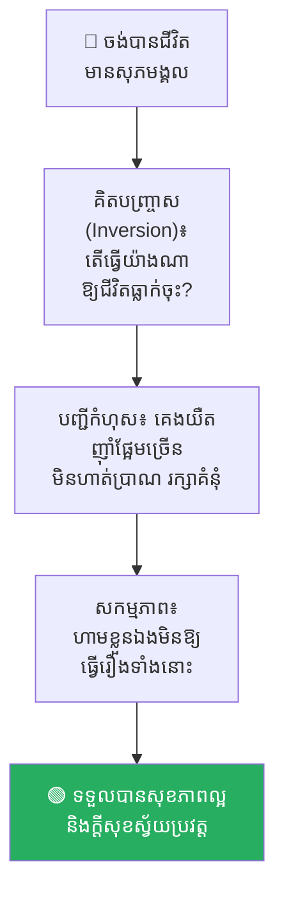
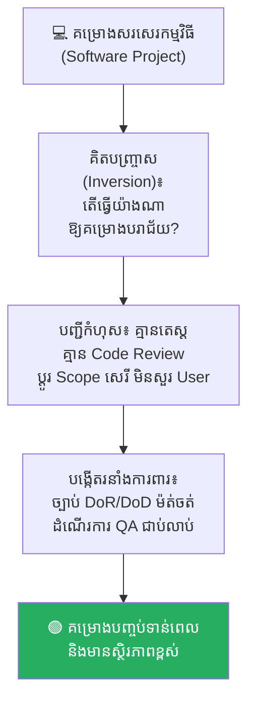
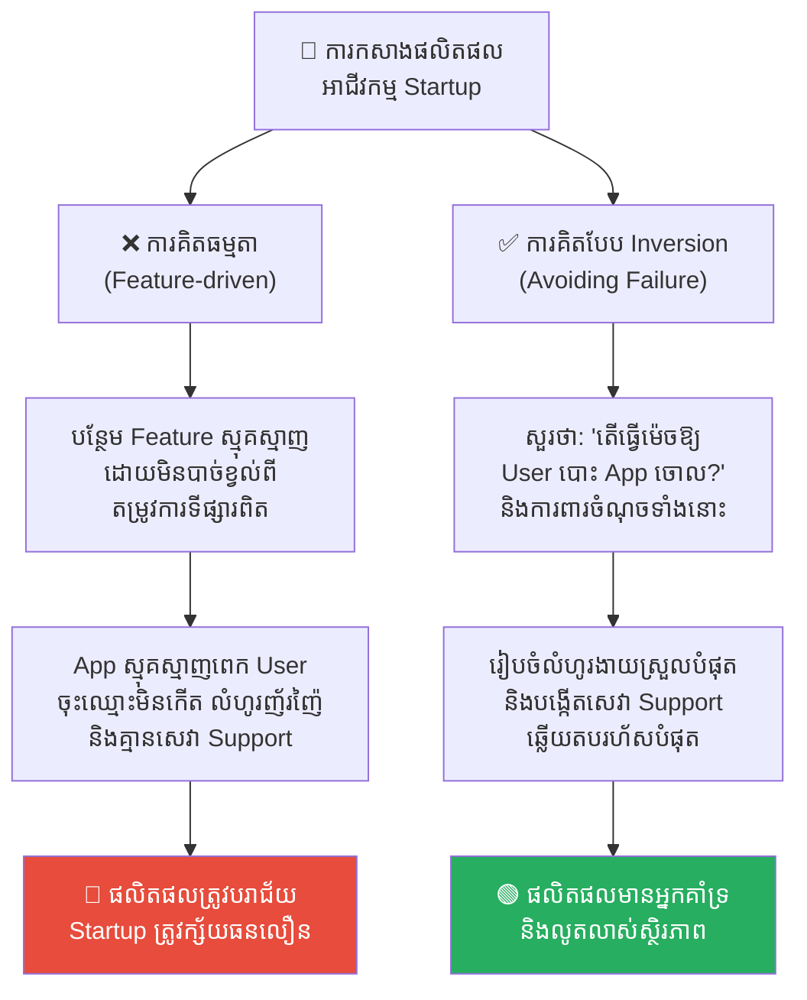
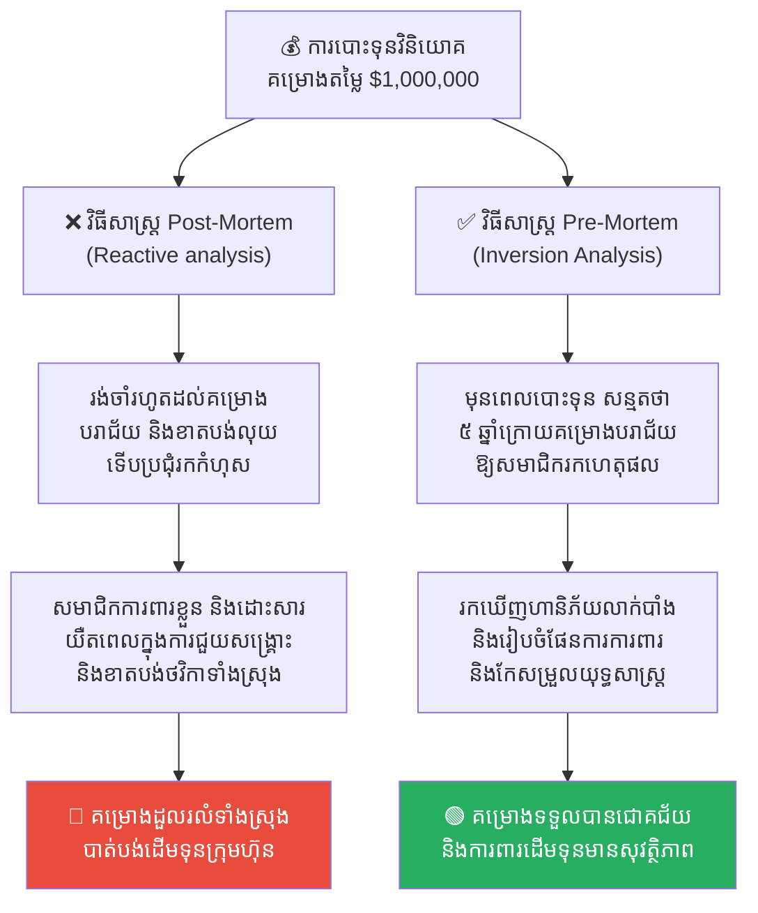
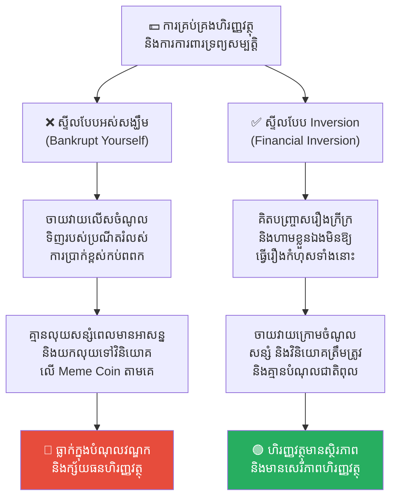

# The Principle of Inversion (គោលការណ៍ត្រឡប់បញ្ច្រាស)៖ ការធានាភាពជោគជ័យដោយការកម្ទេចរាល់ភាពបរាជ័យ

**Author:** ichamrong  
**Date:** 2026-05-17  
**Tags:** #inversion-principle #mental-models #decision-making #charlie-munger #pre-mortem #problem-solving  
**Category:** Concepts  
**Read Time:** ~16 min  

---

## 📌 មាតិកា (Table of Contents)
- [អន្ទាក់ផ្លូវចិត្ត (The Trap)](#អន្ទាក់ផ្លូវចិត្ត-the-trap)
- [១. បញ្ហា៖ គិតបញ្ច្រាសជានិច្ច (The Issue: Always Invert)](#១-បញ្ហា-គិតបញ្ច្រាសជានិច្ច-the-issue-always-invert)
- [២. ឧទាហរណ៍ជាក់ស្តែងក្នុងពិភពពិត (Real World Examples)](#២-ឧទាហរណ៍ជាក់ស្តែងក្នុងពិភពពិត)
  - [ឧទាហរណ៍ទី ១ — កម្រិតស្រាល៖ របៀបរៀបចំជីវិតឱ្យមានទុក្ខសោក (How to Ruin Your Personal Life)](#ឧទាហរណ៍ទី-១-កម្រិតស្រាល-របៀបរៀបចំជីវិតឱ្យមានទុក្ខសោក-how-to-ruin-your-personal-life)
  - [ឧទាហរណ៍ទី ២ — កម្រិតមធ្យម (បច្ចេកទេស)៖ របៀបធ្វើឱ្យគម្រោង IT បរាជ័យ (How to Build a Failed Software Project)](#ឧទាហរណ៍ទី-២-កម្រិតមធ្យម-បច្ចេកទេស-របៀបធ្វើឱ្យគម្រោង-it-បរាជ័យ-how-to-build-a-failed-software-project)
  - [ឧទាហរណ៍ទី ៣ — កម្រិតមធ្យម (ធុរកិច្ច)៖ របៀបកម្ទេចផលិតផលអាជីវកម្ម (How to Kill Your Startup Product)](#ឧទាហរណ៍ទី-៣-កម្រិតមធ្យម-ធុរកិច្ច-របៀបកម្ទេចផលិតផលអាជីវកម្ម-how-to-kill-your-startup-product)
  - [ឧទាហរណ៍ទី ៤ — កម្រិតធ្ងន់៖ ការធ្វើវិភាគមុនស្លាប់ (The Pre-Mortem Exercise)](#ឧទាហរណ៍ទី-៤-កម្រិតធ្ងន់-ការធ្វើវិភាគមុនស្លាប់-the-pre-mortem-exercise)
  - [ឧទាហរណ៍ទី ៥ — កម្រិតមធ្យម (ការគ្រប់គ្រងហិរញ្ញវត្ថុផ្ទាល់ខ្លួន)៖ របៀបធ្វើឱ្យខ្លួនឯងធ្លាក់ខ្លួនក្រីក្រ និងជំពាក់បំណុលគេ (How to Bankrupt Yourself)](#ឧទាហរណ៍ទី-៥-កម្រិតមធ្យម-ការគ្រប់គ្រងហិរញ្ញវត្ថុផ្ទាល់ខ្លួន-របៀបធ្វើឱ្យខ្លួនឯងធ្លាក់ខ្លួនក្រីក្រ-និងជំពាក់បំណុលគេ-how-to-bankrupt-yourself)
- [៣. កត្តាជម្រុញ៖ លំអៀងនៃការចង់បាន និងការមើលរំលងការដកចេញ (The Aggravator: Optimism Bias & Subtraction Bias)](#៣-កត្តាជម្រុញ-លំអៀងនៃការចង់បាន-និងការមើលរំលងការដកចេញ-the-aggravator-optimism-bias-subtraction-bias)
- [៤. ដំណោះស្រាយទូទៅ (The General Solution)](#៤-ដំណោះស្រាយទូទៅ-the-general-solution)
  - [អនុវត្តលំហាត់ប្រាណ Pre-Mortem ជានិច្ច (Conduct Pre-Mortems)](#អនុវត្តលំហាត់ប្រាណ-pre-mortem-ជានិច្ច-conduct-pre-mortems)
  - [ផ្តោតលើការកាត់បន្ថយកំហុសជាជាងការបង្កើតភាពល្អឥតខ្ចោះ (Avoid Stupidity)](#ផ្តោតលើការកាត់បន្ថយកំហុសជាជាងការបង្កើតភាពល្អឥតខ្ចោះ-avoid-stupidity)
  - [ច្បាប់ដកចេញ (Via Negativa)](#ច្បាប់ដកចេញ-via-negativa)
- [សេចក្តីសន្និដ្ឋាន (Conclusion)](#សេចក្តីសន្និដ្ឋាន-conclusion)
- [Related Posts](#related-posts)

---

## អន្ទាក់ផ្លូវចិត្ត (The Trap)

ស្រមៃថាអ្នកចង់ចាប់ផ្តើមគម្រោងសរសេរកម្មវិធី (Software Project) ថ្មីមួយឱ្យជោគជ័យ។ កិច្ចប្រជុំដំបូងត្រូវបានរៀបចំឡើងយ៉ាងរំភើប។ គ្រប់គ្នាចោទសួរសំណួរធម្មតា៖ *«តើយើងត្រូវធ្វើអ្វីខ្លះដើម្បីឱ្យគម្រោងនេះជោគជ័យខ្លាំង? តើត្រូវបន្ថែម Feature អស្ចារ្យអ្វីខ្លះ? តើត្រូវរៀបចំ Marketing ដ៏អស្ចារ្យបែបណា?»*

សមាជិកគ្រប់គ្នាបញ្ចេញគំនិតវិជ្ជមានរាប់សិបមុខ។ ផែនការដ៏ធំមួយត្រូវបានបង្កើតឡើងដោយពោរពេញទៅដោយការសន្មត់ដ៏ល្អឥតខ្ចោះ។

ប៉ុន្តែ ៦ ខែក្រោយមក គម្រោងនោះស្រាប់តែដួលរលំទាំងស្រុង៖
* កូដមាន Bug ច្រើន ព្រោះតែប្រញាប់ប្រញាល់ Deploy លឿនពេក។
* សមាជិកក្រុមឈ្លោះគ្នា ព្រោះគ្មានការបែងចែកតួនាទីច្បាស់លាស់។
* ថវិកាគម្រោងបានអស់រលីង ព្រោះតែចំណាយលើសកម្រិត។

ហេតុអ្វីបានជារឿងនេះកើតឡើង ទោះបីជាយើងមានផែនការជោគជ័យដ៏ល្អក៏ដោយ? ពីព្រោះខួរក្បាលរបស់យើងគិតតែលើ **«ផ្លូវឆ្ពោះទៅរកជោគជ័យ»** ហើយមើលរំលងទាំងស្រុងនូវ **«ការការពាររាល់ផ្លូវដែលនាំទៅរកបរាជ័យ»**។ 

ដើម្បីចៀសវាងគ្រោះមហន្តរាយនេះ យើងត្រូវតែអនុវត្ត **The Principle of Inversion (គោលការណ៍ត្រឡប់បញ្ច្រាស)**។

---

## ១. បញ្ហា៖ គិតបញ្ច្រាសជានិច្ច (The Issue: Always Invert)

**Principle of Inversion** គឺជាគំរូផ្នត់គំនិត (Mental Model) ដ៏មានអំណាចបំផុតមួយ ដែលមានប្រភពដើមពីអ្នកគណិតវិទ្យាអាឡឺម៉ង់លោក **Carl Jacobi** ដែលចូលចិត្តនិយាយពាក្យស្លោកថា៖ *«Man muss immer umkehren»* (**គិតបញ្ច្រាសជានិច្ច - Always Invert**)។ ក្រោយមក គោលការណ៍នេះត្រូវបានផ្សព្វផ្សាយយ៉ាងខ្លាំងដោយលោក **Charlie Munger** (ដៃគូអាជីវកម្មរបស់ Warren Buffett)៖

> *«ប្រសិនបើអ្នកចង់ជួយកសិករម្នាក់ឱ្យទទួលបានជោគជ័យ កុំចំណាយពេលគិតពីរបៀបជួយពួកគេ។ ផ្ទុយទៅវិញ ត្រូវចំណាយពេលគិតពីរឿងដែលធ្វើឱ្យកសិករម្នាក់ត្រូវក្ស័យធន និងបរាជ័យ ហើយត្រូវប្រឹងប្រែងចៀសវាងរឿងទាំងនោះឱ្យបាន។ ប្រសិនបើខ្ញុំដឹងថាខ្ញុំនឹងស្លាប់នៅត្រង់កន្លែងណា ខ្ញុំនឹងមិនទៅជាន់ទីនោះដាច់ខាតជារៀងរហូត។»*

និយាយឱ្យសាមញ្ញ៖
* ❌ កុំសួរថា៖ *«តើខ្ញុំត្រូវធ្វើដូចម្តេចដើម្បីឱ្យជោគជ័យ?»*
* ✅ ត្រូវសួរថា៖ ***«តើខ្ញុំត្រូវធ្វើដូចម្តេចទើបប្រាកដជាជួបបរាជ័យធ្ងន់ធ្ងរ? ហើយតើខ្ញុំត្រូវការពារ និងចៀសវាងវាដោយរបៀបណា?»***

```
❌ វិធីគិតធម្មតា៖ "គំនិតល្អៗ -> ផែនការជោគជ័យ -> ជួបឧបសគ្គដែលមិនបានរំពឹងទុក -> បរាជ័យ"
✅ វិធីគិតបញ្ច្រាស៖ "គិតរកផ្លូវបរាជ័យទាំងអស់ -> កម្ទេច/ការពារផ្លូវទាំងនោះជាមុន -> ជោគជ័យដោយស្វ័យប្រវត្ត"
```

---

## ២. ឧទាហរណ៍ជាក់ស្តែងក្នុងពិភពពិត

សូមពិនិត្យមើល **ឧទាហរណ៍ជាក់ស្តែងចំនួន ៥** បង្ហាញពីអំណាចនៃការគិតបញ្ច្រាស៖

---

### ឧទាហរណ៍ទី ១ — កម្រិតស្រាល៖ របៀបរៀបចំជីវិតឱ្យមានទុក្ខសោក (How to Ruin Your Personal Life)

**ស្ថានភាព៖** អ្នកចង់មានជីវិតរស់នៅប្រចាំថ្ងៃប្រកបដោយសុភមង្គល និងសុខភាពល្អ។

* **គំនិតបញ្ច្រាស (Inversion)៖** សួរខ្លួនឯងថា *«តើខ្ញុំត្រូវរស់នៅបែបណាដើម្បីឱ្យជីវិតខ្ញុំធ្លាក់ក្នុងទុក្ខសោក និងជំងឺរ៉ាំរ៉ៃលឿនបំផុត?»*
* **បញ្ជីបរាជ័យ (The Target List)៖**
  1. គេងមិនឱ្យគ្រប់គ្រាន់ ចូលគេងម៉ោង ២ ឬ ៣ ភ្លឺរាល់យប់។
  2. ផឹកស្រា និងញ៉ាំអាហារផ្អែម ឬខ្លាញ់កប់ពពកជារៀងរាល់ថ្ងៃ។
  3. អង្គុយលេងទូរស័ព្ទពេញមួយថ្ងៃ មិនព្រមធ្វើលំហាត់ប្រាណសោះ។
  4. រក្សាគំនុំ និងខឹងសម្បារនឹងមនុស្សជុំវិញខ្លួនឥតឈប់ឈរ។
* **សកម្មភាពពិត៖** ពិនិត្យមើលបញ្ជីខាងលើ ហើយប្រឹងប្រែង**ចៀសវាងការធ្វើរឿងទាំងនោះឱ្យបានដាច់ខាត**។ ជីវិតដែលមានសុខភាពល្អ និងសុភមង្គលនឹងកើតឡើងដោយស្វ័យប្រវត្ត។



---

### ឧទាហរណ៍ទី ២ — កម្រិតមធ្យម (បច្ចេកទេស)៖ របៀបធ្វើឱ្យគម្រោង IT បរាជ័យ (How to Build a Failed Software Project)

**ស្ថានភាព៖** ក្រុមការងារត្រៀមអភិវឌ្ឍប្រព័ន្ធ Mobile App ថ្មីមួយសម្រាប់អតិថិជន។

* **គំនិតបញ្ច្រាស (Inversion)៖** *«តើយើងត្រូវធ្វើរបៀបណាខ្លះ ដើម្បីឱ្យគម្រោងនេះត្រូវខូចខាត យឺតយ៉ាវ និងខាតបង់លុយទាំងស្រុង?»*
* **បញ្ជីកំហុស IT (The IT Failure List)៖**
  1. ឈប់និយាយ ឬសួរនាំជាមួយអតិថិជន និង User ពិតប្រាកដចោលទាំងអស់។
  2. សរសេរកូដភ្លាមៗដោយគ្មានការរៀបចំ Architecture និងគ្មានការធ្វើ Code Review ឡើយ។
  3. ឈប់តេស្តប្រព័ន្ធ (No QA) រហូតដល់ថ្ងៃចុងក្រោយទើបបាញ់ឡើង Production។
  4. អនុញ្ញាតឱ្យសមាជិកផ្លាស់ប្តូរ Scope គម្រោង mid-sprint ដោយសេរីគ្មានការត្រួតពិនិត្យ។
* **សកម្មភាពការពារ៖** បង្កើតវិន័យការងារយ៉ាងម៉ត់ចត់៖ ត្រូវមាន DoR/DoD ច្បាស់លាស់, ត្រូវធ្វើ Code Review រាល់ថ្ងៃ, ត្រូវមាន QA តេស្តរាល់ Feature, និងបង្កើតដំណើរការគ្រប់គ្រង Change Request យ៉ាងហ្មត់ចត់។



---

### ឧទាហរណ៍ទី ៣ — កម្រិតមធ្យម (ធុរកិច្ច)៖ របៀបកម្ទេចផលិតផលអាជីវកម្ម (How to Kill Your Startup Product)

**ស្ថានភាព៖** Startup ចង់កសាង App មួយដើម្បីវាយលុកទីផ្សារ។

* **គំនិតបញ្ច្រាស (Inversion)៖** *«តើធ្វើយ៉ាងណាឱ្យ App របស់យើងគ្មានអ្នកប្រើប្រាស់ និងក្ស័យធនលឿនបំផុត?»*
* **បញ្ជីកំហុសអាជីវកម្ម៖**
  1. បង្កើត Feature ដែលយើងស្រឡាញ់ម្នាក់ឯង ដោយមិនបាច់ខ្វល់ពីតម្រូវការទីផ្សារពិតប្រាកដ។
  2. ធ្វើឱ្យលំហូរចុះឈ្មោះ (Sign-up flow) មានភាពស្មុគស្មាញ និងទាមទារព័ត៌មានច្រើនកប់ពពក។
  3. មិនបាច់ផ្តល់សេវាគាំទ្រអតិថិជន (Customer Support) ឡើយ ពេលពួកគេសួរ ត្រូវព្រងើយកន្តើយ។
* **សកម្មភាព៖** រៀបចំលំហូរ Sign-up ឱ្យសាមញ្ញបំផុតក្នុងរយៈពេល ៣ វិនាទី, ដំណើរការទិន្នន័យស្រាវជ្រាវទីផ្សារជានិច្ច និងបង្កើតក្រុម Support ដែលឆ្លើយតបលឿនបំផុត។



---

### ឧទាហរណ៍ទី ៤ — កម្រិតធ្ងន់៖ ការធ្វើវិភាគមុនស្លាប់ (The Pre-Mortem Exercise)

**ស្ថានភាព៖** ក្រុមហ៊ុនសហគ្រាសកំពុងត្រៀមបោះទុនវិនិយោគទឹកប្រាក់ $1,000,000 ទៅលើគម្រោងថ្មីមួយ។

* **វិធីសាស្ត្រគិតធម្មតា (Post-Mortem)៖** រង់ចាំរហូតដល់គម្រោងបរាជ័យ និងខាតបង់លុយអស់ ទើបហៅសមាជិកប្រជុំគ្នាដេញដោលរក Root Cause នៃភាពបរាជ័យ។ (នេះហៅថាការធ្វើកោសល្យវិច័យសាកសព - យឺតពេលហើយ)។
* **វិធីសាស្ត្រគិតបញ្ច្រាស (Pre-Mortem)៖** មុនពេលបោះទុន សមាជិកទាំងអស់ត្រូវអង្គុយជុំគ្នា ហើយប្រធានប្រជុំប្រកាសថា៖ *«សូមស្រមៃថាឥឡូវនេះយើងស្ថិតនៅក្នុងពេលអនាគត ៥ ឆ្នាំក្រោយ។ គម្រោងតម្លៃ ១ លានដុល្លាររបស់យើងបានដួលរលំ និងបរាជ័យទាំងស្រុង។ ឥឡូវនេះ ខ្ញុំសុំឱ្យអ្នកម្នាក់ៗសរសេររឿងរ៉ាវប្រវត្តិសាស្ត្រមួយ ទាក់ទងនឹង មូលហេតុអ្វីខ្លះដែលធ្វើឱ្យវាបរាជ័យបែបនេះ ឱ្យបានលម្អិតបំផុត។»*
* **លទ្ធផល៖** សមាជិកទាំងអស់លែងមានការភ័យខ្លាចក្នុងការនិយាយពី «ចំណុចខ្សោយ ឬបញ្ហានយោបាយផ្ទៃក្នុង» ទៀតហើយ។ ពួកគេនឹងសរសេរការពិតដ៏គួរឱ្យខ្លាចជាច្រើនចេញមក ដែលជួយឱ្យថ្នាក់ដឹកនាំអាចកែសម្រួលយុទ្ធសាស្ត្រ និងបិទរាល់ប្រហោងធ្លាយគ្រោះថ្នាក់ជាមុន។



---

### ឧទាហរណ៍ទី ៥ — កម្រិតមធ្យម (ការគ្រប់គ្រងហិរញ្ញវត្ថុផ្ទាល់ខ្លួន)៖ របៀបធ្វើឱ្យខ្លួនឯងធ្លាក់ខ្លួនក្រីក្រ និងជំពាក់បំណុលគេ (How to Bankrupt Yourself)

**ស្ថានភាព៖** វិភាក្សាពីការគ្រប់គ្រងហិរញ្ញវត្ថុផ្ទាល់ខ្លួន ដើម្បីធានាបាននូវស្ថិរភាព និងសេរីភាពហិរញ្ញវត្ថុ។

* **គំនិតបញ្ច្រាស (Financial Inversion)៖** សួរខ្លួនឯងថា *«តើខ្ញុំត្រូវធ្វើយ៉ាងណា ដើម្បីឱ្យខ្លួនឯងធ្លាក់ខ្លួនក្រីក្រ ជំពាក់បំណុលវណ្ឌក និងក្ស័យធនហិរញ្ញវត្ថុលឿនបំផុត?»*
* **បញ្ជីកំហុសហិរញ្ញវត្ថុ៖**
  1. ចាយវាយខ្ជះខ្ជាយលើសពីចំណូលដែលរកបានរៀងរាល់ខែ។
  2. ទិញរបស់ប្រណីតៗមិនចាំបាច់ដោយប្រើកាតឥណទាន (Credit Card) ឬបង់រំលស់ក្នុងអត្រាការប្រាក់ខ្ពស់។
  3. មិនបាច់សន្សំប្រាក់សម្រាប់ពេលមានអាសន្ន (Emergency Fund) ឡើយ។
  4. យកប្រាក់សន្សំទាំងអស់ទៅវិនិយោគលើភាគហ៊ុន ឬកាក់គ្រីបតូដែលគ្មានមូលដ្ឋានច្បាស់លាស់តាមគេដោយគ្មានការស្រាវជ្រាវ។
* **សកម្មភាពការពារ៖** ពិនិត្យមើលបញ្ជីខាងលើ រួចបង្កើតគោលការណ៍ហ្មត់ចត់៖ ចាយវាយក្រោមចំណូល, គ្មានការបង្កើតបំណុលអាក្រក់, បង្កើតកញ្ចប់លុយសន្សំអាសន្ន និងវិនិយោគលើប្រព័ន្ធសុវត្ថិភាពច្បាស់លាស់។ ស្ថិរភាពហិរញ្ញវត្ថុនឹងកើតឡើងដោយស្វ័យប្រវត្ត។



---

## ៣. កត្តាជម្រុញ៖ លំអៀងនៃការចង់បាន និងការមើលរំលងការដកចេញ (The Aggravator: Optimism Bias & Subtraction Bias)

ហេតុអ្វីបានជាយើងតែងតែមើលរំលងការគិតបញ្ច្រាស?

1. **លំអៀងនៃការចង់បាន (Optimism Bias)៖** មនុស្សចូលចិត្តរឿងរ៉ាវវិជ្ជមាន និងការសរសើរ។ ការនិយាយពី «ភាពបរាជ័យ ឬហានិភ័យ» នៅក្នុងការប្រជុំដំបូង ជារឿយៗត្រូវបានគេចាត់ទុកថាជាមនុស្ស *«គិតអវិជ្ជមាន គ្មានទឹកចិត្ត ឬចង់បង្អាក់ទឹកចិត្តក្រុមការងារ»*។
2. **លំអៀងនៃការមើលរំលងការដកចេញ (Subtraction Bias)៖** ពេលដោះស្រាយបញ្ហា ខួរក្បាលរបស់យើងចូលចិត្ត **«បន្ថែម (Add)»** របស់ថ្មីៗជានិច្ច (បន្ថែម Feature, បន្ថែមមនុស្ស, បន្ថែមច្បាប់) ជាងការ **«ដកចេញ (Subtract)»** នូវប្រភពនៃកំហុសឆ្គង ឬភាពស្មុគស្មាញចោល។

---

## ៤. ដំណោះស្រាយទូទៅ (The General Solution)

តើយើងអាចអនុវត្តគោលការណ៍ត្រឡប់បញ្ច្រាសដើម្បីធានាជោគជ័យយ៉ាងដូចម្តេច?

### អនុវត្តលំហាត់ប្រាណ Pre-Mortem ជានិច្ច (Conduct Pre-Mortems)
ធ្វើឱ្យការគិតបញ្ច្រាសក្លាយជាផ្នែកមួយនៃដំណើរការការងារផ្លូវការ។ មុននឹងសម្រេចចិត្ត ឬចាប់ផ្តើមយុទ្ធសាស្ត្រថ្មី ត្រូវដំណើរការលំហាត់ប្រាណ **Pre-Mortem** ដើម្បីអនុញ្ញាតឱ្យសមាជិកបញ្ចេញមតិយោបល់ពីហានិភ័យដោយសេរី និងគ្មានការភ័យខ្លាច។

### ផ្តោតលើការកាត់បន្ថយកំហុសជាជាងការបង្កើតភាពល្អឥតខ្ចោះ (Avoid Stupidity)
ដូចដែលលោក Charlie Munger ធ្លាប់បាននិយាយ៖
> **«វាជាការគួរឱ្យភ្ញាក់ផ្អើលណាស់ដែលឃើញអាជីវកម្មរយៈពេលវែង ទទួលបានអត្ថប្រយោជន៍ដ៏មហាសាល គ្រាន់តែមកពីការប្រឹងប្រែងរក្សាខ្លួនកុំឱ្យធ្វើរឿងឆោតល្ងង់ (Avoid Stupidity) ជំនួសឱ្យការប្រឹងប្រែងធ្វើខ្លួនឱ្យឆ្លាតវៃអស្ចារ្យ (Try to be Brilliant)។»**

ចៀសវាងការខាតបង់ គឺសាមញ្ញ និងមានសុវត្ថិភាពជាងការរត់តាមរកប្រាក់ចំណេញកម្រិតខ្ពស់។

### ច្បាប់ដកចេញ (Via Negativa)
ដោះស្រាយបញ្ហាដោយការ **ដកចេញនូវឧបសគ្គ ឬប្រភពកំហុសឆ្គងចោល**៖
* ជំនួសឱ្យការបន្ថែមប្រព័ន្ធលក់ថ្មីដើម្បីជម្រុញការលក់៖ ត្រូវដកចោលនូវរាល់ជំហានស្មុគស្មាញនៅក្នុង App ដែលធ្វើឱ្យ User ធុញទ្រាន់មិនព្រមទិញ។

---

## សេចក្តីសន្និដ្ឋាន (Conclusion)

The Principle of Inversion រំលឹកយើងថា ការពារគឺប្រសើរជាងព្យាបាល។ នៅពេលយើងមានភាពក្លាហាន និងប្រាជ្ញាក្នុងការប្រឈមមុខនឹងភាពបរាជ័យជាមុន ព្រមទាំងបិទរាល់ច្រកផ្លូវគ្រោះថ្នាក់ទាំងអស់ នោះផ្លូវដែលនៅសេសសល់តែមួយគត់សម្រាប់យើង គឺផ្លូវឆ្ពោះទៅរកភាពជោគជ័យដ៏រឹងមាំជារៀងរហូត។

---

## Related Posts

* **[01-confirmation-bias.md](./01-confirmation-bias.md)** — របៀបដែលយើងសម្លឹងមើលតែព័ត៌មានដែលយើងចង់ឃើញ។
* **[02-five-whys-technique.md](./02-five-whys-technique.md)** — របៀបស្វែងរកឫសគល់នៃបញ្ហានៅក្នុងប្រព័ន្ធការងារ IT។

---

*Last updated: 2026-05-26*
