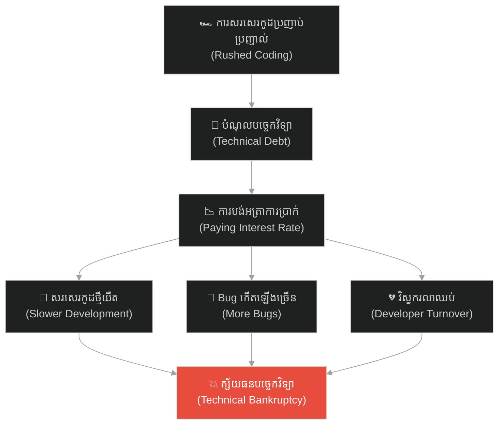
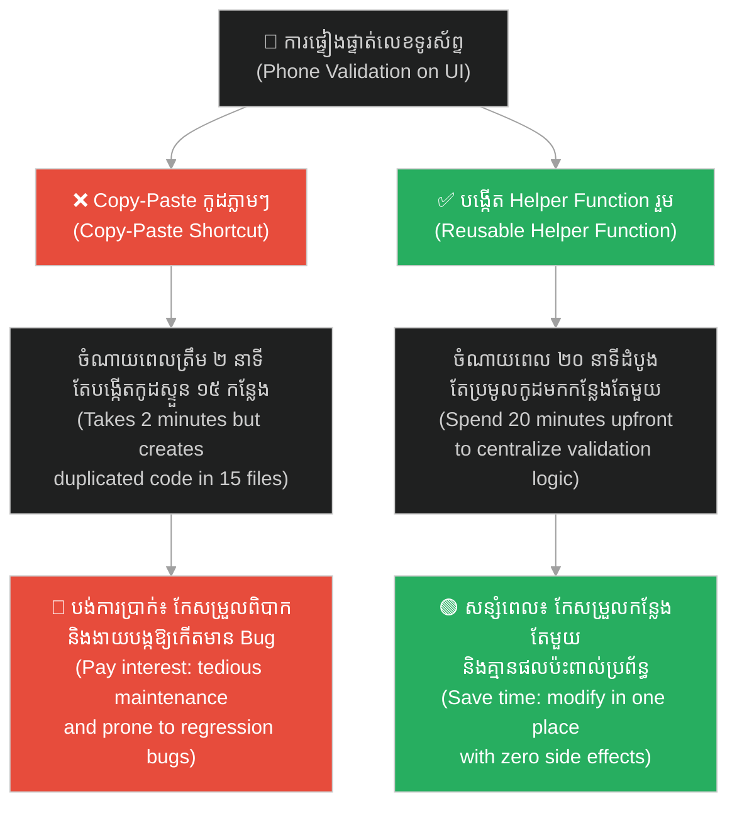
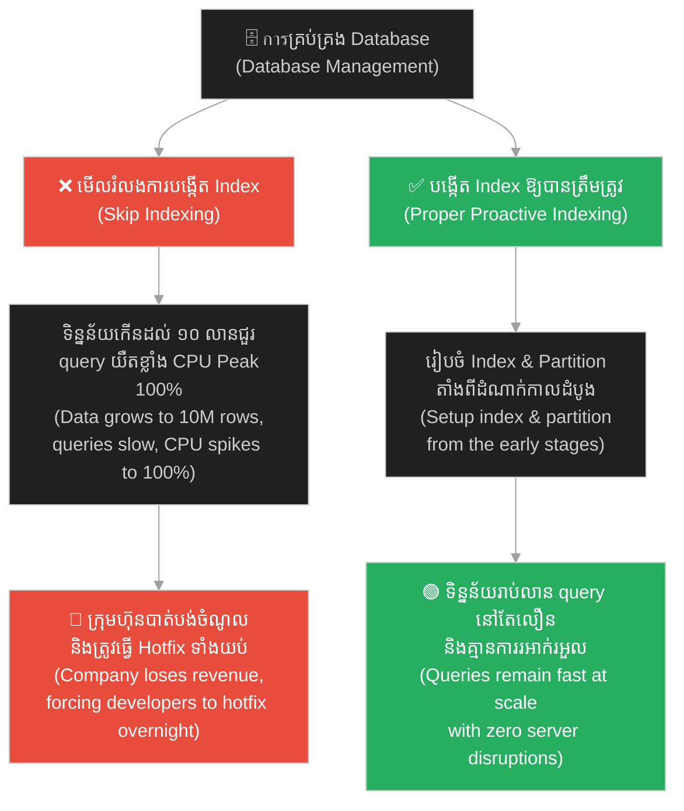
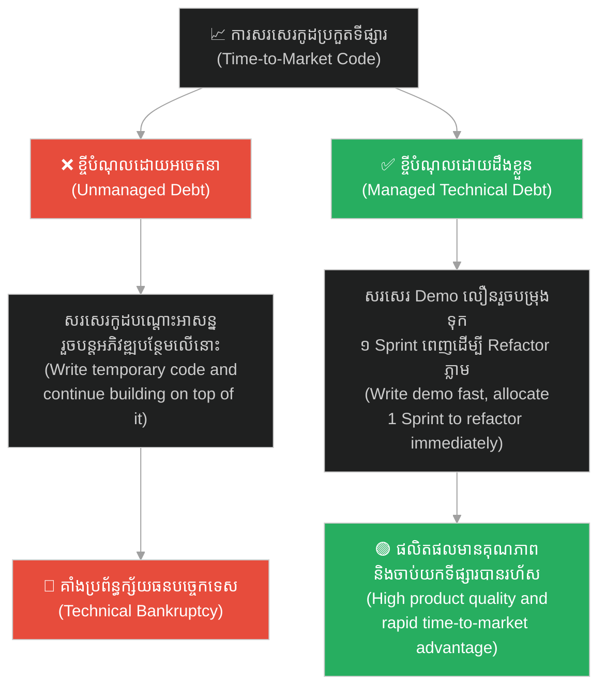
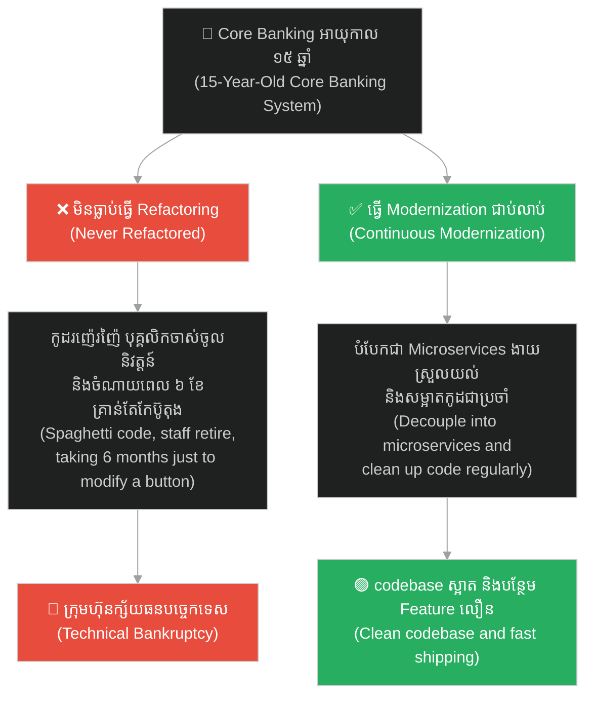
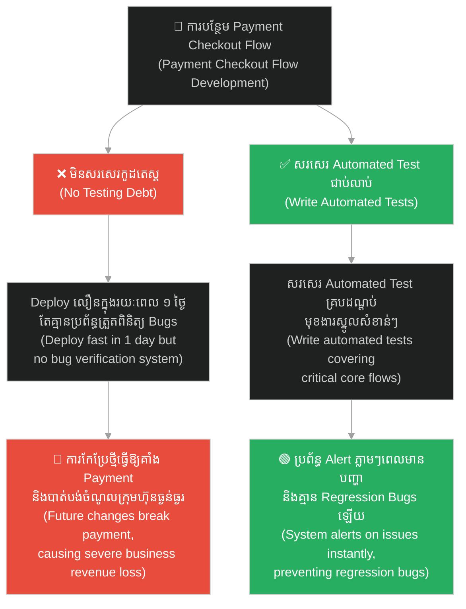

# Technical Debt & Refactoring (បំណុលបច្ចេកវិទ្យា និងការកែលម្អកូដឡើងវិញ)៖ ការគ្រប់គ្រងអត្រាការប្រាក់នៃសូហ្វវែរ (Technical Debt & Refactoring: Managing the Interest Rate of Software)

**Author:** ichamrong  
**Date:** 2026-06-04  
**Tags:** #technical-debt #refactoring #software-architecture #code-quality #agile #project-management  
**Category:** Concepts  
**Read Time:** ~20 min  

---

## 📌 មាតិកា (Table of Contents)
- [លំនាំបញ្ហា (The Pattern)](#0)
- [១. បញ្ហា៖ គំនិតប្រៀបធៀបផ្នែកហិរញ្ញវត្ថុ (The Issue: The Financial Metaphor)](#1)
- [២. ឧទាហរណ៍ជាក់ស្តែងក្នុងពិភពពិត (Real World Examples)](#2)
  - [ឧទាហរណ៍ទី ១ — កម្រិតស្រាល៖ របៀបចម្លងកូដសាមញ្ញ (Example 1: The Quick UI Validation Copy-Paste)](#2-1)
  - [ឧទាហរណ៍ទី ២ — កម្រិតមធ្យម (បច្ចេកទេស)៖ ការមើលរំលងការរៀបចំសន្ទស្សន៍ទិន្នន័យ (Example 2: Database Indexing Neglect)](#2-2)
  - [ឧទាហរណ៍ទី ៣ — កម្រិតមធ្យម (ធុរកិច្ច)៖ បំណុលដែលបង្ខំដោយទីផ្សារ (Example 3: Market-Driven Code Debt)](#2-3)
  - [ឧទាហរណ៍ទី ៤ — កម្រិតធ្ងន់៖ ស្ថានភាពក្ស័យធនបច្ចេកទេសទាំងស្រុង (Example 4: Technical Bankruptcy)](#2-4)
  - [ឧទាហរណ៍ទី ៥ — កម្រិតមធ្យម (គុណភាពកូដ)៖ បំណុលនៃការមិនសរសេរ Automated Test (Example 5: No Testing Debt)](#2-5)
- [៣. កត្តាជម្រុញ៖ សម្ពាធទីផ្សារ និងការសម្លឹងឃើញតែផលចំណេញរយៈពេលខ្លី (The Aggravator: Market Pressure & Short-Termism)](#3)
- [៤. ដំណោះស្រាយទូទៅ (The General Solution)](#4)
- [សេចក្តីសន្និដ្ឋាន (Conclusion)](#5)
- [ឯកសារយោង (References)](#6)
- [Related Posts](#7)

---

## លំនាំបញ្ហា (The Pattern)

ស្រមៃថាអ្នកចង់សាងសង់ផ្ទះមួយខ្នងឱ្យបានលឿនបំផុតក្នុងរយៈពេល ១ សប្តាហ៍។ ដើម្បីសន្សំពេលវេលា អ្នកមិនបានជីកគ្រឹះផ្ទះឱ្យបានជ្រៅឡើយ ហើយប្រើប្រាស់តែសសរឈើសាមញ្ញៗ និងជញ្ជាំងក្តារបន្ទះស្តើងដើម្បីដំឡើងវា។

Imagine you want to build a house as quickly as possible in just one week. To save time, you skip digging a deep foundation, using simple wooden posts and thin plywood walls to put it together.

ដំបូងឡើយ ផ្ទះនេះមើលទៅស្អាតបាត និងអាចរស់នៅបានយ៉ាងលឿនស្របតាមតម្រូវការរបស់អ្នក។

At first, this house looks decent and is ready for occupancy quickly, satisfying your immediate needs.

ប៉ុន្តែ ២ ឆ្នាំក្រោយមក នៅពេលដែលអ្នកចង់បន្ថែមជាន់ទី ២ ឬចង់ពង្រីកបន្ទប់បន្ថែម៖
* សសរឈើចាស់មិនអាចទ្រទ្រង់ទម្ងន់បន្ថែមបានឡើយ។
* ប្រព័ន្ធទឹក និងភ្លើងដែលរៀបចំខុសបច្ចេកទេស ចាប់ផ្តើមធ្លាយ និងឆ្លងចរន្ត។
* ដើម្បីសាងសង់ជាន់ទី ២ អ្នកត្រូវបង្ខំចិត្ត**វាយកម្ទេចផ្ទះចាស់ទាំងមូលចោល** ហើយចាប់ផ្តើមសាងសង់គ្រឹះឡើងវិញពីដំបូង។

But two years later, when you decide to add a second floor or expand the rooms:
* The old wooden posts cannot support the additional weight.
* The poorly designed plumbing and electrical wiring begin to leak and short-circuit.
* To construct the second floor, you are forced to **demolish the entire old house** and rebuild the foundation from scratch.

នេះគឺជាសកម្មភាពនៃ **Technical Debt (បំណុលបច្ចេកវិទ្យា)** នៅក្នុងពិភពសរសេរកម្មវិធី (Software Engineering)។

This is **Technical Debt** at work in the software engineering world.

ដើម្បីងាយស្រួលតាមដាន នេះជាផែនទីបង្ហាញផ្លូវសម្រាប់អត្ថបទនេះ៖
1. **បញ្ហា (The Issue)** — តើគំនិតនៃការប្រៀបធៀបបំណុលបច្ចេកវិទ្យាទៅនឹងហិរញ្ញវត្ថុបង្ហាញពីអ្វីខ្លះ?
2. **ឧទាហរណ៍ជាក់ស្តែង (Real World Examples)** — ឧទាហរណ៍ចំនួន ៥ ពីការអភិវឌ្ឍ UI, មូលដ្ឋានទិន្នន័យ, ធុរកិច្ចធៀបនឹងបច្ចេកទេស, ស្ថិរភាពប្រព័ន្ធចាស់, និងការសរសេរ Automated Test។
3. **កត្តាជម្រុញ (The Aggravator)** — ហេតុអ្វីបានជាបំណុលបច្ចេកវិទ្យាតែងតែរីករាលដាលខ្លាំង?
4. **ដំណោះស្រាយទូទៅ (The General Solution)** — របៀបគ្រប់គ្រងអត្រាការប្រាក់នៃសូហ្វវែរ និងការធ្វើ Refactoring ជាប្រចាំ។

Roadmap for this article:
1. **The Issue** — What does the financial metaphor of technical debt represent?
2. **Real World Examples** — Five examples spanning UI development, database setups, business tradeoffs, legacy systems, and automated testing.
3. **The Aggravator** — Why does technical debt accumulate so aggressively?
4. **The General Solution** — How to manage the interest rate of software through systematic refactoring.

---

## ១. បញ្ហា៖ គំនិតប្រៀបធៀបផ្នែកហិរញ្ញវត្ថុ (The Issue: The Financial Metaphor)

គំនិតប្រៀបធៀប **Technical Debt** ត្រូវបានលើកឡើងដំបូងដោយលោក **Ward Cunningham** (ម្នាក់ក្នុងចំណោមស្ថាបនិក Agile Manifesto) ក្នុងឆ្នាំ ១៩៩២។ វាបង្ហាញពីទំនាក់ទំនងរវាង «ល្បឿន» និង «គុណភាព» នៅក្នុងការសរសេរកូដ៖

The financial metaphor of **Technical Debt** was first coined by **Ward Cunningham** (co-author of the Agile Manifesto) in 1992. It illustrates the critical relationship between speed and quality in coding:

> **«ការសរសេរកូដដែលមានគុណភាពអន់ ឬប្រញាប់ប្រញាល់ដើម្បីឱ្យទាន់ថ្ងៃប្រគល់ការងារ គឺប្រៀបដូចជាការ «ខ្ចីបុលហិរញ្ញវត្ថុ» ពីធនាគារអញ្ចឹង។ វាអនុញ្ញាតឱ្យអ្នកទទួលបានមុខងារការងារលឿនជាងមុនមួយកម្រិត (ទទួលបានដើមទុនភ្លាមៗ)។ ប៉ុន្តែ ដរាបណាអ្នកមិនទាន់បានចំណាយពេលជម្រះ ឬកែលម្អកូដនោះឡើងវិញទេ (មិនទាន់សងប្រាក់ដើម) នោះរាល់ការសរសេរកូដថ្មីៗបន្ថែមពីលើកូដចាស់នោះ នឹងតម្រូវឱ្យអ្នកចំណាយម៉ោងការងារ និងកម្លាំងទ្វេដង (ត្រូវបង់ «អត្រាការប្រាក់ - Interest Rate») ជានិច្ច។ ប្រសិនបើទុកចោលយូរពេក ក្រុមហ៊ុននឹងធ្លាក់ចូលក្នុងស្ថានភាព «ក្ស័យធនបច្ចេកវិទ្យា (Technical Bankruptcy)» ដែលមិនអាចបន្ថែម Feature ថ្មីបានសោះឡើយ។»**
> 
> *"Shipping first-time code is like going into debt. A little debt speeds development so long as it is paid back promptly with a rewrite. The danger occurs when the debt is not repaid. Every minute spent on not-quite-right code will be charged interest in the form of future work. Entire engineering organizations can be brought to a stand-still under the debt load of an unreformed design, resulting in technical bankruptcy."*

និយាយឱ្យសាមញ្ញ៖
* ❌ ខ្ចីបំណុលរ៉ាំរ៉ៃ (មិនធ្វើ Refactoring) = បង់ការប្រាក់ខ្ពស់ និងយឺតយ៉ាវ។
* ❌ ក្ស័យធនបច្ចេកវិទ្យា (Technical Bankruptcy) = មិនអាចកែប្រែ ឬបន្ថែមអ្វីបាន។
* ✅ ដំណោះស្រាយពិត = ខ្ចីដោយដឹងខ្លួន និងមានគម្រោងសងវិញជាប្រចាំ។

To put it simply:
* ❌ Unmanaged debt (no refactoring) = paying high interest and slowing down.
* ❌ Technical Bankruptcy = unable to modify code or ship new features.
* ✅ Optimal solution = borrow deliberately and pay it back regularly.

---

## ២. ឧទាហរណ៍ជាក់ស្តែងក្នុងពិភពពិត (Real World Examples)

សូមពិនិត្យមើល **ឧទាហរណ៍ជាក់ស្តែងចំនួន ៥** បង្ហាញពីរបៀបដែលបំណុលបច្ចេកវិទ្យាកើតឡើង និងរបៀបគ្រប់គ្រងវា៖

Here are **five real-world examples** demonstrating how technical debt accumulates and how it should be managed:

---

### ឧទាហរណ៍ទី ១ — កម្រិតស្រាល៖ របៀបចម្លងកូដសាមញ្ញ (Example 1: The Quick UI Validation Copy-Paste)

**ស្ថានភាព៖** Developer ត្រូវការធ្វើការផ្ទៀងផ្ទាត់លេខទូរស័ព្ទ (Phone Validation) នៅទំព័រចុះឈ្មោះថ្មីមួយ។

**Scenario:** A developer needs to implement phone number validation on a new user registration page.

* **សកម្មភាព Low EQ / Bias (ទម្លាប់/លំអៀង)៖** ដើម្បីសន្សំពេល ពួកគេមិនបានសរសេរ Helper Function រួមដែលអាចប្រើប្រាស់ឡើងវិញបានឡើយ។ ពួកគេគ្រាន់តែចម្លងកូដផ្ទៀងផ្ទាត់ (Copy-Paste) ពីទំព័រចាស់យកមកដាក់ភ្លាមៗ។ ភារកិច្ចត្រូវបានបញ្ចប់ក្នុងរយៈពេល ២ នាទី (លឿនបំផុត)។
* **Low-EQ/Bias Action (Mental Block):** To save time, they skip writing a reusable helper function. Instead, they copy-paste the validation logic from an old page. The task is completed in just 2 minutes (extremely fast).
* **សកម្មភាព High EQ / Correct (ដំណោះស្រាយ)៖** សរសេរ Helper Function តែមួយរួម `validatePhoneNumber()` ហើយរាល់ទំព័រទាំងអស់ត្រូវ Call ប្រើប្រាស់មុខងាររួមនេះ។ ពេលផ្លាស់ប្តូរទ្រង់ទ្រាយ ត្រូវកែសម្រួលតែកន្លែងតែមួយគត់។
* **High-EQ/Correct Action:** Implement a single helper function `validatePhoneNumber()` that all pages call. When the phone format changes, it only needs to be modified in one place.
* **លទ្ធផល៖** រក្សាបាននូវកូដស្អាត ងាយស្រួលកែសម្រួល និងចៀសវាង Regression Bugs នាពេលអនាគត។
* **The Result:** Maintain clean code, easy to modify, and prevent future regression bugs.

---

### ឧទាហរណ៍ទី ២ — កម្រិតមធ្យម (បច្ចេកទេស)៖ ការមើលរំលងការរៀបចំសន្ទស្សន៍ទិន្នន័យ (Example 2: Database Indexing Neglect)

**ស្ថានភាព៖** ក្រុមហ៊ុន Startup បង្កើត App លក់ទំនិញថ្មីមួយដែលទើបមានទិន្នន័យទិញដូរ ១,០០០ ជួរ។

**Scenario:** A startup builds a new e-commerce app that initially has only 1,000 transaction rows.

* **សកម្មភាព Low EQ / Bias (ទម្លាប់/លំអៀង)៖** ក្រុមការងារមិនបានរៀបចំសន្ទស្សន៍ទិន្នន័យ (Database Indexing) ឬការបែងចែក Partition ឱ្យបានត្រឹមត្រូវឡើយ ព្រោះយល់ថា៖ *«ទិន្នន័យនៅតិចតួចណាស់ មិនបាច់ខ្វល់ឡើយ Query ដើរលឿនស្រាប់ហើយ។»*
* **Low-EQ/Bias Action:** The team neglects database indexing and partitioning, thinking: *"We only have a few records, queries are fast anyway, no need to overengineer."*
* **សកម្មភាព High EQ / Correct (ដំណោះស្រាយ)៖** រៀបចំ Database Index និង Partition ឱ្យបានត្រឹមត្រូវតាំងពីដំបូង ដោយវិភាគលើលំនាំនៃការ Query ទិន្នន័យសំខាន់ៗ។
* **High-EQ/Correct Action:** Implement appropriate database indexes and partitions early on, analyzing critical query patterns.
* **លទ្ធផល៖** នៅពេលទិន្នន័យកើនដល់រាប់លានជួរ ប្រព័ន្ធនៅតែ Query បានលឿនបំផុត និងមិនមានបញ្ហា CPU Peak ឡើយ។
* **The Result:** Even when data grows to millions of rows, queries remain extremely fast with zero CPU spikes.

---

### ឧទាហរណ៍ទី ៣ — កម្រិតមធ្យម (ធុរកិច្ច)៖ បំណុលដែលបង្ខំដោយទីផ្សារ (Example 3: Market-Driven Code Debt)

**ស្ថានភាព៖** ក្រុមហ៊ុនត្រូវការបង្ហាញ Prototype ផលិតផលទៅកាន់វិនិយោគិន (Investors) ក្នុងរយៈពេល ២ សប្តាហ៍ដើម្បីទទួលបានការបោះទុន។

**Scenario:** A company needs to pitch a product prototype to investors within 2 weeks to secure funding.

* **សកម្មភាព Low EQ / Bias (ទម្លាប់/លំអៀង)៖** សរសេរកូដប្រញាប់ឱ្យរួចដៃដោយគ្មានគម្រោង ឬផែនការសងបំណុលនាពេលអនាគត។ បន្តបន្ថែម Feature ថ្មីពីលើកូដបណ្តោះអាសន្ននោះឥតឈប់ឈរ។
* **Low-EQ/Bias Action:** Writing code hastily to launch, but without any future repayment plan. Continuing to build new features on top of this temporary code structure.
* **សកម្មភាព High EQ / Correct (ដំណោះស្រាយ)៖** ថ្នាក់ដឹកនាំបច្ចេកវិទ្យាសម្រេចចិត្ត៖ *«យើងនឹងប្រើប្រាស់ Template UI ស្រាប់ សរសេរកូដរឹង (Hardcoded) មួយចំនួន និងមិនទាន់សរសេរ Automated Test ឡើយ ដើម្បីបង្ហាញ Demo ឱ្យទាន់ពេល។ នេះជាបំណុលដែលយើងដឹងខ្លួន និងព្រមខ្ចី។»* បន្ទាប់ពីទទួលបានការបោះទុនជោគជ័យភ្លាម ក្រុមហ៊ុនបម្រុងទុកកាលវិភាគ ១ Sprint ពេញភ្លាម ដើម្បីសរសេរកូដផ្នែកគ្រឹះឡើងវិញឱ្យមានរចនាសម្ព័ន្ធត្រឹមត្រូវ (Refactoring)។
* **High-EQ/Correct Action:** Technical leaders decide: *"We will use an off-the-shelf UI template, hardcode some variables, and skip automated testing to show the demo in time. This is a deliberate debt we agree to incur."* Right after securing the investment, they allocate 1 full Sprint to refactor the core code architecture before developing new features.
* **លទ្ធផល៖** ទទួលបានទាំងការបោះទុនទាន់ពេលវេលា និងរក្សាបាននូវគុណភាព codebase នាពេលអនាគត។
* **The Result:** Win the investment on time while maintaining a clean, sustainable codebase.

---

### ឧទាហរណ៍ទី ៤ — កម្រិតធ្ងន់៖ ស្ថានភាពក្ស័យធនបច្ចេកទេសទាំងស្រុង (Example 4: Technical Bankruptcy)

**ស្ថានភាព៖** ក្រុមហ៊ុនសហគ្រាសចាស់មួយដែលដំណើរការប្រព័ន្ធ Core Banking អស់រយៈពេល ១៥ ឆ្នាំដោយគ្មានការកែលម្អកូដ (Refactoring) ឬការធ្វើទំនើបកម្មឡើយ។

**Scenario:** A legacy enterprise operating a Core Banking system for 15 years without code refactoring or modernization.

* **សកម្មភាព Low EQ / Bias (ទម្លាប់/លំអៀង)៖** មិនកែលម្អកូដចាស់ សរសេរកូដបន្ថែមបែបបិទប៉ះ (Spaghetti Code) រហូតគ្មាននរណាម្នាក់ហ៊ានប៉ះពាល់ ឬកែសម្រួលកូដតែមួយជួរឡើយ ព្រោះខ្លាចប្រព័ន្ធដួលរលំ។
* **Low-EQ/Bias Action:** Avoiding legacy code improvements, coding only via hack-and-patch, resulting in spaghetti code that developers fear to touch, lest they break the entire system.
* **សកម្មភាព High EQ / Correct (ដំណោះស្រាយ)៖** វិនិយោគលើការធ្វើ Refactoring និង Modernization ជាប់លាប់ បំបែកប្រព័ន្ធ Monolith ចាស់ទៅជា Microservices និងបណ្តុះបណ្តាលក្រុមការងារពីបច្ចេកវិទ្យាថ្មីៗ។
* **High-EQ/Correct Action:** Invest in continuous refactoring and system modernization, decoupling the legacy monolith into manageable microservices, while training the team on modern technologies.
* **លទ្ធផល៖** codebase មានសណ្តាប់ធ្នាប់ វិស្វករថ្មីៗងាយយល់ និងអាចបន្ថែម Feature ថ្មីបានរហ័ស។
* **The Result:** The codebase remains clean, easy for new engineers to understand, and enables rapid shipping of new features.

---

### ឧទាហរណ៍ទី ៥ — កម្រិតមធ្យម (គុណភាពកូដ)៖ បំណុលនៃការមិនសរសេរ Automated Test (Example 5: No Testing Debt)

**ស្ថានភាព៖** ក្រុមការងារត្រូវការបន្ថែមមុខងារទូទាត់ប្រាក់ (Payment Checkout Flow) ថ្មីស្មុគស្មាញមួយ។

**Scenario:** A development team needs to implement a complex payment checkout flow.

* **សកម្មភាព Low EQ / Bias (ទម្លាប់/លំអៀង)៖** ដើម្បីសន្សំពេល និងទាន់ថ្ងៃប្រគល់ការងារ ពួកគេសម្រេចចិត្តមិនសរសេរ Automated Test (Unit/Integration Test) ឡើយ។ ពួកគេ Deploy ទៅ Production ភ្លាមៗក្នុងរយៈពេល ១ ថ្ងៃ (ជំនួសឱ្យ ៣ ថ្ងៃប្រសិនបើសរសេរ Test)។ ក្រោយមក ពេលកែប្រែ Feature ថ្មី ធ្វើឱ្យគាំងប្រព័ន្ធ Payment ទាំងស្រុងដោយមិនដឹងខ្លួន នាំឱ្យបាត់បង់ចំណូល។
* **Low-EQ/Bias Action:** To save time and meet the deadline, they skip writing automated tests (Unit/Integration). They deploy directly to production in 1 day (instead of 3 days with tests). Later, a code change breaks the payment flow silently, causing major revenue loss.
* **សកម្មភាព High EQ / Correct (ដំណោះស្រាយ)៖** សរសេរ Automated Test គ្របដណ្តប់មុខងារស្នូល (Core Flow Coverage)។ ពេលមានការកែប្រែកូដថ្មី ប្រព័ន្ធ Test ស្វ័យប្រវត្តិនឹងដំណើរការ Alert ប្រាប់ពីកំហុសភ្លាមៗ មុនពេល Release ទៅកាន់ Production។
* **High-EQ/Correct Action:** Implement automated tests for all core payment flows. When code changes are introduced, automated testing suites run and alert developers to failures immediately before release.
* **លទ្ធផល៖** ធានាបាននូវស្ថិរភាពផលិតផលខ្ពស់ និងគ្មាន Regression Bugs ឡើយ។
* **The Result:** High system stability and complete elimination of regression bugs.

---

## ៣. កត្តាជម្រុញ៖ សម្ពាធទីផ្សារ និងការសម្លឹងឃើញតែផលចំណេញរយៈពេលខ្លី (The Aggravator: Market Pressure & Short-Termism)

ហេតុអ្វីបានជាបំណុលបច្ចេកវិទ្យាតែងតែរីករាលដាលខ្លាំង?

Why does technical debt accumulate so aggressively?

1. **សម្ពាធពីផ្នែកអាជីវកម្ម (Business Pressure)៖** ផ្នែកលក់ និង Product Managers តែងតែចង់បាន Feature ថ្មីៗលឿនបំផុតដើម្បីបង្កើនសន្ទស្សន៍ KPI។ ពួកគេពិបាកនឹងយល់ស្របណាស់នៅពេល Developer សុំពេលធ្វើការងារ «Refactoring» ដែលមិនបង្កើតផលមើលឃើញភ្លាមៗទៅកាន់ User (Invisible Work)។
1. **Business Pressure:** Sales teams and Product Managers always want new features shipped as quickly as possible to hit their KPIs. They rarely align with developers asking for time to do "Refactoring," which is invisible work to the end-users.

2. **ការគិតរយៈពេលខ្លី (Short-Term Thinking)៖** យើងដំឡើង App ឱ្យដំណើរការដំបូងដោយជោគជ័យ ហើយគិតថាការងារបានបញ្ចប់ហើយ ដោយមើលរំលងការចំណាយ និងភាពស្មុគស្មាញនៃការថែទាំប្រព័ន្ធរយៈពេលវែង (Maintainability)។
2. **Short-Term Thinking:** We launch an app successfully on day one and think the job is done, completely overlooking the long-term maintenance costs and complexity (Maintainability).

---

## ៤. ដំណោះស្រាយទូទៅ (The General Solution)

តើយើងអាចគ្រប់គ្រងអត្រាការប្រាក់នៃសូហ្វវែរ និងជម្រះបំណុលបច្ចេកវិទ្យាយ៉ាងដូចម្តេច?

How can we manage the interest rate of software and pay down technical debt?

### ច្បាប់ក្មេងស្ទាវវាលស្មៅ (The Boy Scout Rule)

អនុវត្តគោលការណ៍ក្មេងស្ទាវជានិច្ច៖
> **«ត្រូវបន្សល់ទុកកន្លែងដែលអ្នកបានទៅដល់ ឱ្យមានសណ្តាប់ធ្នាប់ និងស្អាតជាងមុន ពេលអ្នកចាកចេញទៅវិញជានិច្ច។»**

Always apply the Boy Scout Rule:
> *"Always leave the campground cleaner than you found it."*

នៅក្នុងការសរសេរកូដ៖ រាល់ពេលដែលអ្នកបើកកូដចាស់ណាមួយដើម្បីកែសម្រួល Bug ឬបន្ថែម Feature ត្រូវចំណាយពេល ៥ នាទីជម្រះ ឬសម្រួលកូដក្បែរនោះឱ្យមានភាពងាយស្រួលអានជាងមុនបន្តិច។ ប្រសិនបើសមាជិកគ្រប់គ្នាធ្វើបែបនេះជារៀងរាល់ថ្ងៃ codebase នឹងមានសុខភាពល្អដោយស្វ័យប្រវត្ត។

In coding: Every time you open a file to fix a bug or add a feature, spend 5 minutes cleaning up or refactoring adjacent code to make it more readable. If everyone does this daily, the codebase will naturally improve.

### គោលការណ៍កែលម្អកូដ ២០% (The 20% Refactoring Budget)

ថ្នាក់ដឹកនាំបច្ចេកវិទ្យាត្រូវចរចា និងរៀបចំកាលវិភាគការងារឱ្យមានតម្លាភាព៖
* ៨០% នៃពេលវេលា Sprint ផ្តោតលើការបង្កើត Feature ថ្មីៗសម្រាប់អាជីវកម្ម។
* ២០% នៃពេលវេលា Sprint ត្រូវបម្រុងទុកដាច់ខាតសម្រាប់ក្រុមការងារធ្វើការជម្រះបំណុលបច្ចេកវិទ្យា, Optimize Database, សរសេរ Automated Test និងសម្រួល Architecture (Refactoring)។

Tech leadership must negotiate and structure transparent allocations:
* 80% of Sprint capacity is focused on business features.
* 20% of Sprint capacity is strictly reserved for the team to pay down tech debt, optimize databases, write automated tests, and refactor architectures.

### ការចងក្រងនិងតាមដានសន្ទស្សន៍បំណុល (Technical Debt Backlog)

បែងចែកក្តារបញ្ជីការងារច្បាស់លាស់មួយសម្រាប់កត់ត្រារាល់ «បំណុលបច្ចេកវិទ្យា» ដែលក្រុមការងារបានដឹងខ្លួន និងខ្ចី៖
* វាយតម្លៃកម្រិតគ្រោះថ្នាក់នៃបំណុលនីមួយៗ (High, Medium, Low Interest)។
* រៀបចំផែនការជម្រះបំណុលដែលមាន «អត្រាការប្រាក់ខ្ពស់បំផុត» មុនគេ (បំណុលណាដែលបង្កឱ្យមាន Bug ញឹកញាប់ ឬធ្វើឱ្យការសរសេរកូដថ្មីដើរយឺតបំផុត)។

Dedicate a specific backlog or tracking list to record known technical debt items:
* Evaluate the interest rate/severity of each debt item (High, Medium, Low Interest).
* Prioritize paying down the highest-interest debt first (debts that cause frequent bugs or slow down developers the most).

---

## 🐇 ធ្លាក់ចូលក្នុងរន្ធទន្សាយ (Enter the Rabbit Hole)

ដើម្បីស្វែងយល់កាន់តែស៊ីជម្រៅអំពីការគ្រប់គ្រងបំណុលបច្ចេកទេស និងការជៀសវាងការសាងសង់ប្រព័ន្ធការងាររញ៉េរញ៉ៃតាមរយៈរឿងព្រេងរបស់វេជ្ជបណ្ឌិត ហ្វ្រែងខេនស្តែន និងបិសាចដែលគាត់បានបង្កើត សូមចាប់ផ្តើមដំណើររុករករបស់អ្នកដោយចុចលើតំណភ្ជាប់ខាងក្រោម៖

To delve deeper into managing technical debt and avoiding unmaintainable legacy code through the parable of Victor Frankenstein and his stitched-together monster, begin your journey by clicking below:

* 🚀 **[ចាប់ផ្តើមដំណើររុករក (Start the Journey) ➔ Technical Debt & Frankenstein (បំណុលបច្ចេកវិទ្យា និងបិសាចហ្វ្រែងខេនស្តែន)](../parables/57-the-monster-of-tech-debt.md)**

---

## សេចក្តីសន្និដ្ឋាន (Conclusion)

> **«បំណុលបច្ចេកវិទ្យាមិនមែនជាសត្រូវជានិច្ចនោះឡើយ ប៉ុន្តែការមិនសងវាវិញទើបជាសត្រូវពិតប្រាកដ។»**  
> 
> **“Technical debt is not always the enemy, but failing to pay it back is.”**  

Technical Debt មិនមែនជាសត្រូវដាច់ខាតរបស់សូហ្វវែរនោះឡើយ។ វាគឺជាឧបករណ៍យុទ្ធសាស្ត្រមួយដែលអាចជួយឱ្យយើងដើរលឿនក្នុងទីផ្សារ ប្រសិនបើយើងប្រើប្រាស់វាដោយដឹងខ្លួន និងមានផែនការគ្រប់គ្រងច្បាស់លាស់ Pres. ប៉ុន្តែ ប្រសិនបើយើងមើលរំលងគុណភាពកូដ និងបដិសេធមិនព្រមធ្វើ Refactoring នោះអត្រាការប្រាក់នឹងវាយកម្ទេចរាល់សមត្ថភាពច្នៃប្រឌិត និងស្ថិរភាពប្រព័ន្ធរបស់យើងទាំងស្រុងនាពេលអនាគត។

Technical Debt is not an absolute enemy of software. It is a strategic tool that helps us go fast in the market if used deliberately and with a clear repayment plan. However, if we neglect code quality and refuse to refactor, the interest rate will eventually destroy our creative capacity and system stability.

---

## ឯកសារយោង (References)

* **Cunningham, W.** — *The WyCash Portfolio Management System* (1992)។ របាយការណ៍ដំបូងបង្អស់ដែលបានបង្កើតទ្រឹស្តីបំណុលបច្ចេកវិទ្យា (Technical Debt Metaphor)។
* **Cunningham, W.** — *The WyCash Portfolio Management System* (1992). The original experience report that coined the technical debt metaphor.
* **Fowler, M.** — *Refactoring: Improving the Design of Existing Code* (1999)។ សៀវភៅគ្រឹះស្តីពីការកែលម្អកូដដើម្បីជម្រះបំណុល។
* **Fowler, M.** — *Refactoring: Improving the Design of Existing Code* (1999). The definitive guide on refactoring techniques to pay down technical debt.
* **Martin, R. C.** — *Clean Code: A Handbook of Agile Software Craftsmanship* (2008)។ ការណែនាំស្តីពីការសរសេរកូដដែលស្អាត និងងាយស្រួលថែទាំ។
* **Martin, R. C.** — *Clean Code: A Handbook of Agile Software Craftsmanship* (2008). The industry standard guide on writing maintainable, clean code.

---

## Related Posts

* **[02-five-whys-technique.md](./02-five-whys-technique.md)** — Five Whys Technique (បច្ចេកទេសសួរ «ហេតុអ្វី» ៥ ដង)៖ ស្វែងរកឫសគល់នៃបញ្ហាក្នុងដំណើរការការងារ។
* **[09-inversion-principle.md](./09-inversion-principle.md)** — Inversion Principle (គោលការណ៍ត្រឡប់បញ្ច្រាស)៖ របៀបគិតបញ្ច្រាសដើម្បីការពារគម្រោង IT កុំឱ្យជួបការក្ស័យធនបច្ចេកវិទ្យា។
* **[Technical Debt & Frankenstein (បំណុលបច្ចេកវិទ្យា និងបិសាចហ្វ្រែងខេនស្តែន)](../parables/57-the-monster-of-tech-debt.md)** — រឿងព្រេងប្រវត្តិសាស្ត្រស្តីពីវេជ្ជបណ្ឌិតហ្វ្រែងខេនស្តែន និងបិសាចនៃកូដរញ៉េរញ៉ៃ។
