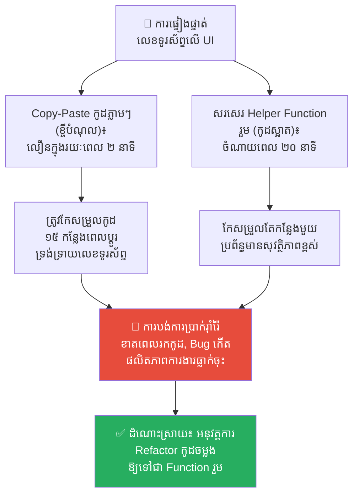
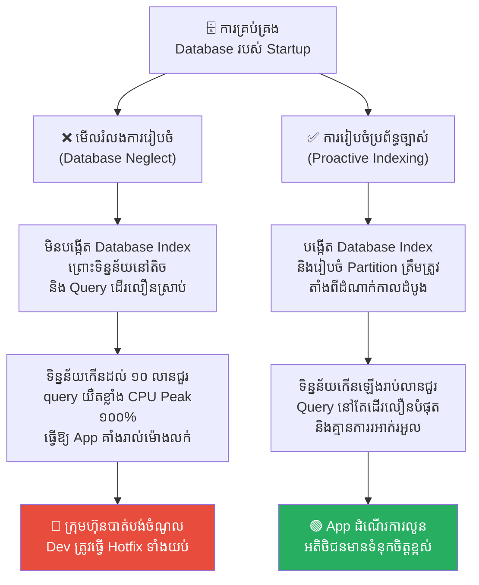
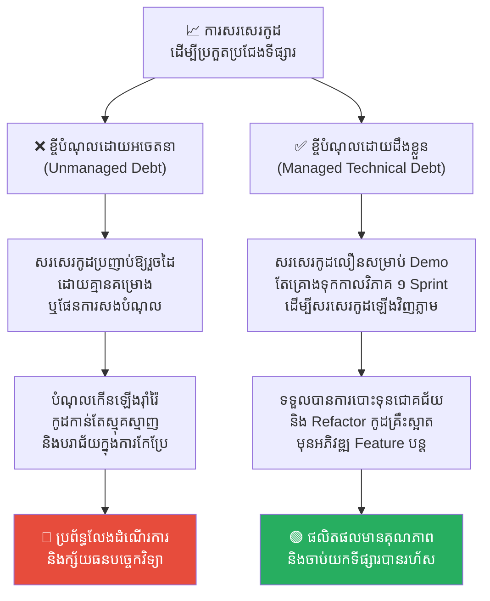
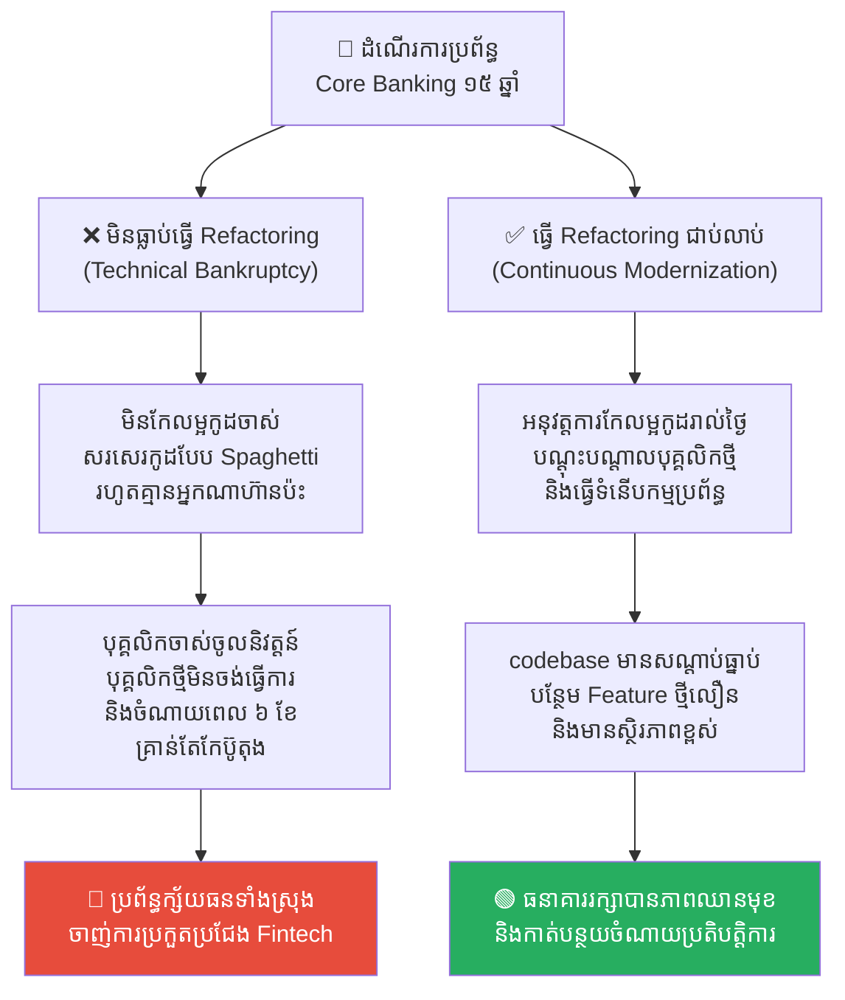
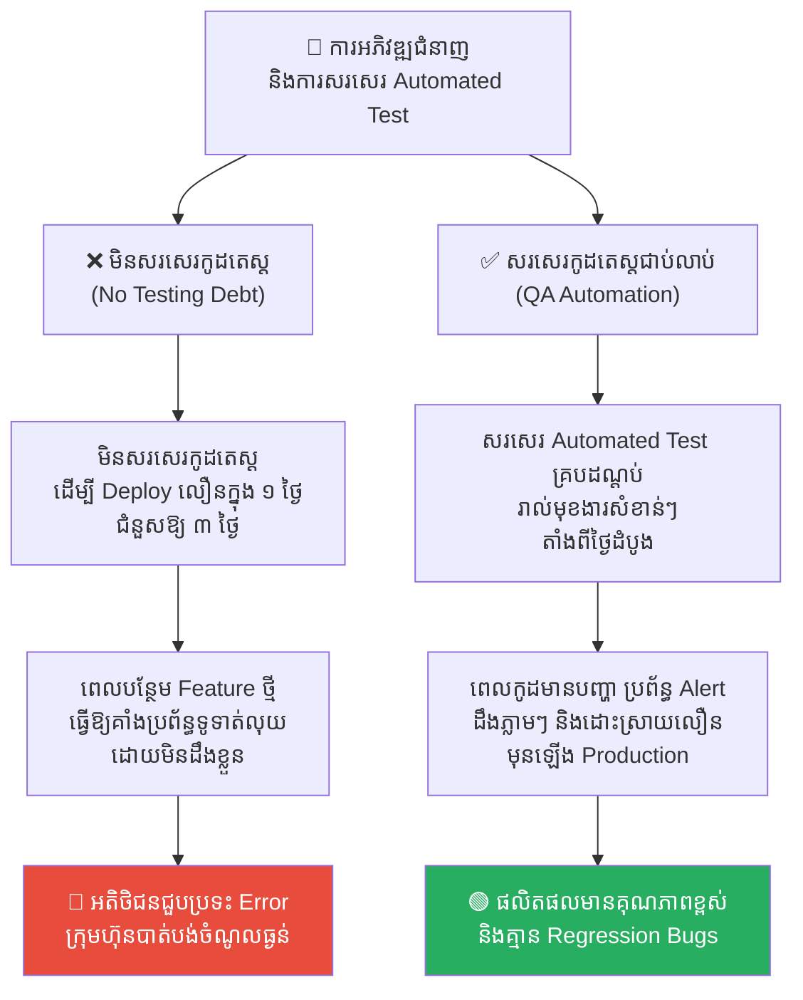

# Technical Debt & Refactoring (បំណុលបច្ចេកវិទ្យា និងការកែលម្អកូដឡើងវិញ)៖ ការគ្រប់គ្រងអត្រាការប្រាក់នៃសូហ្វវែរ

**Author:** ichamrong  
**Date:** 2026-05-17  
**Tags:** #technical-debt #refactoring #software-architecture #code-quality #agile #project-management  
**Category:** Concepts  
**Read Time:** ~16 min  

---

## 📌 មាតិកា (Table of Contents)
- [លំនាំបញ្ហា (The Pattern)](#លំនាំបញ្ហា-the-pattern)
- [១. បញ្ហា៖ គំនិតប្រៀបធៀបផ្នែកហិរញ្ញវត្ថុ (The Issue: The Financial Metaphor)](#១-បញ្ហា-គំនិតប្រៀបធៀបផ្នែកហិរញ្ញវត្ថុ-the-issue-the-financial-metaphor)
- [២. ឧទាហរណ៍ជាក់ស្តែងក្នុងពិភពពិត (Real World Examples)](#២-ឧទាហរណ៍ជាក់ស្តែងក្នុងពិភពពិត)
  - [ឧទាហរណ៍ទី ១ — កម្រិតស្រាល៖ របៀបចម្លងកូដសាមញ្ញ (The Quick UI Validation Copy-Paste)](#ឧទាហរណ៍ទី-១-កម្រិតស្រាល-របៀបចម្លងកូដសាមញ្ញ-the-quick-ui-validation-copy-paste)
  - [ឧទាហរណ៍ទី ២ — កម្រិតមធ្យម (បច្ចេកទេស)៖ ការមើលរំលងការរៀបចំសន្ទស្សន៍ទិន្នន័យ (Database Indexing Neglect)](#ឧទាហរណ៍ទី-២-កម្រិតមធ្យម-បច្ចេកទេស-ការមើលរំលងការរៀបចំសន្ទស្សន៍ទិន្នន័យ-database-indexing-neglect)
  - [ឧទាហរណ៍ទី ៣ — កម្រិតមធ្យម (ធុរកិច្ច)៖ បំណុលដែលបង្ខំដោយទីផ្សារ (Market-Driven Code Debt)](#ឧទាហរណ៍ទី-៣-កម្រិតមធ្យម-ធុរកិច្ច-បំណុលដែលបង្ខំដោយទីផ្សារ-market-driven-code-debt)
  - [ឧទាហរណ៍ទី ៤ — កម្រិតធ្ងន់៖ ស្ថានភាពក្ស័យធនបច្ចេកទេសទាំងស្រុង (Technical Bankruptcy)](#ឧទាហរណ៍ទី-៤-កម្រិតធ្ងន់-ស្ថានភាពក្ស័យធនបច្ចេកទេសទាំងស្រុង-technical-bankruptcy)
  - [ឧទាហរណ៍ទី ៥ — កម្រិតមធ្យម (គុណភាពកូដ)៖ បំណុលនៃការមិនសរសេរ Automated Test (No Testing Debt)](#ឧទាហរណ៍ទី-៥-កម្រិតមធ្យម-គុណភាពកូដ-បំណុលនៃការមិនសរសេរ-automated-test-no-testing-debt)
- [៣. កត្តាជម្រុញ៖ សម្ពាធទីផ្សារ និងការសម្លឹងឃើញតែផលចំណេញរយៈពេលខ្លី (The Aggravator: Market Pressure & Short-Termism)](#៣-កត្តាជម្រុញ-សម្ពាធទីផ្សារ-និងការសម្លឹងឃើញតែផលចំណេញរយៈពេលខ្លី-the-aggravator-market-pressure-short-termism)
- [៤. ដំណោះស្រាយទូទៅ (The General Solution)](#៤-ដំណោះស្រាយទូទៅ-the-general-solution)
  - [ច្បាប់ក្មេងស្ទាវវាលស្មៅ (The Boy Scout Rule)](#ច្បាប់ក្មេងស្ទាវវាលស្មៅ-the-boy-scout-rule)
  - [គោលការណ៍កែលម្អកូដ ២០% (The 20% Refactoring Budget)](#គោលការណ៍កែលម្អកូដ-២០-the-20-refactoring-budget)
  - [ការចងក្រងនិងតាមដានសន្ទស្សន៍បំណុល (Technical Debt Backlog)](#ការចងក្រងនិងតាមដានសន្ទស្សន៍បំណុល-technical-debt-backlog)
- [សេចក្តីសន្និដ្ឋាន (Conclusion)](#សេចក្តីសន្និដ្ឋាន-conclusion)
- [Related Posts](#related-posts)

---

## លំនាំបញ្ហា (The Pattern)

ស្រមៃថាអ្នកចង់សាងសង់ផ្ទះមួយខ្នងឱ្យបានលឿនបំផុតក្នុងរយៈពេល ១ សប្តាហ៍។ ដើម្បីសន្សំពេលវេលា អ្នកមិនបានជីកគ្រឹះផ្ទះឱ្យបានជ្រៅឡើយ ហើយប្រើប្រាស់តែសសរឈើសាមញ្ញៗ និងជញ្ជាំងក្តារបន្ទះស្តើងដើម្បីដំឡើងវា។

ដំបូងឡើយ ផ្ទះនេះមើលទៅស្អាតបាត និងអាចរស់នៅបានយ៉ាងលឿនស្របតាមតម្រូវការរបស់អ្នក។ 

ប៉ុន្តែ ២ ឆ្នាំក្រោយមក នៅពេលដែលអ្នកចង់បន្ថែមជាន់ទី ២ ឬចង់ពង្រីកបន្ទប់បន្ថែម៖
* សសរឈើចាស់មិនអាចទ្រទ្រង់ទម្ងន់បន្ថែមបានឡើយ។
* ប្រព័ន្ធទឹក និងភ្លើងដែលរៀបចំខុសបច្ចេកទេស ចាប់ផ្តើមធ្លាយ និងឆ្លងចរន្ត។
* ដើម្បីសាងសង់ជាន់ទី ២ អ្នកត្រូវបង្ខំចិត្ត**វាយកម្ទេចផ្ទះចាស់ទាំងមូលចោល** ហើយចាប់ផ្តើមសាងសង់គ្រឹះឡើងវិញពីដំបូង។

នេះគឺជាសកម្មភាពនៃ **Technical Debt (បំណុលបច្ចេកវិទ្យា)** នៅក្នុងពិភពសរសេរកម្មវិធី (Software Engineering)។

---

## ១. បញ្ហា៖ គំនិតប្រៀបធៀបផ្នែកហិរញ្ញវត្ថុ (The Issue: The Financial Metaphor)

គំនិតប្រៀបធៀប **Technical Debt** ត្រូវបានលើកឡើងដំបូងដោយលោក **Ward Cunningham** (ម្នាក់ក្នុងចំណោមស្ថាបនិក Agile Manifesto) ក្នុងឆ្នាំ ១៩៩២។ វាបង្ហាញពីទំនាក់ទំនងរវាង «ល្បឿន» និង «គុណភាព» នៅក្នុងការសរសេរកូដ៖

> *«ការសរសេរកូដដែលមានគុណភាពអន់ ឬប្រញាប់ប្រញាល់ដើម្បីឱ្យទាន់ថ្ងៃប្រគល់ការងារ គឺប្រៀបដូចជាការ **«ខ្ចីបុលហិរញ្ញវត្ថុ»** ពីធនាគារអញ្ចឹង។ វាអនុញ្ញាតឱ្យអ្នកទទួលបានមុខងារការងារលឿនជាងមុនមួយកម្រិត (ទទួលបានដើមទុនភ្លាមៗ)។ ប៉ុន្តែ ដរាបណាអ្នកមិនទាន់បានចំណាយពេលជម្រះ ឬកែលម្អកូដនោះឡើងវិញទេ (មិនទាន់សងប្រាក់ដើម) នោះរាល់ការសរសេរកូដថ្មីៗបន្ថែមពីលើកូដចាស់នោះ នឹងតម្រូវឱ្យអ្នកចំណាយម៉ោងការងារ និងកម្លាំងទ្វេដង (ត្រូវបង់ **«អត្រាការប្រាក់ - Interest Rate»**) ជានិច្ច។ ប្រសិនបើទុកចោលយូរពេក ក្រុមហ៊ុននឹងធ្លាក់ចូលក្នុងស្ថានភាព **«ក្ស័យធនបច្ចេកវិទ្យា (Technical Bankruptcy)»** ដែលមិនអាចបន្ថែម Feature ថ្មីបានសោះឡើយ។»*

```
                  ┌────────────────────────────────────────┐
                  │        ការសរសេរកូដប្រញាប់ប្រញាល់        │
                  └───────────────────┬────────────────────┘
                                      │
                                      ▼
                        បំណុលបច្ចេកវិទ្យា (Technical Debt)
                                      │
                   ┌──────────────────┴──────────────────┐
                   │    អត្រាការប្រាក់ (Interest Rate)   │
                   │  - សរសេរកូដថ្មីកាន់តែយឺត           │
                   │  - Bug កើតឡើងមិនចេះចប់             │
                   │  - សមាជិកក្រុមហត់នឿយ និងលាឈប់    │
                   └──────────────────┬──────────────────┘
                                      │
                                      ▼
                       ក្ស័យធនបច្ចេកវិទ្យា (Bankruptcy)
```

---

## ២. ឧទាហរណ៍ជាក់ស្តែងក្នុងពិភពពិត

សូមពិនិត្យមើល **ឧទាហរណ៍ជាក់ស្តែងចំនួន ៥** បង្ហាញពីរបៀបដែលបំណុលបច្ចេកវិទ្យាកើតឡើង និងរបៀបគ្រប់គ្រងវា៖

---

### ឧទាហរណ៍ទី ១ — កម្រិតស្រាល៖ របៀបចម្លងកូដសាមញ្ញ (The Quick UI Validation Copy-Paste)

**ស្ថានភាព៖** Developer ត្រូវការធ្វើការផ្ទៀងផ្ទាត់លេខទូរស័ព្ទ (Phone Validation) នៅពាក្យចុះឈ្មោះថ្មីមួយ។

* **ការខ្ចីបំណុល (The Debt)៖** ដើម្បីសន្សំពេល ពួកគេមិនបានសរសេរ Helper Function រួមដែលអាចប្រើប្រាស់ឡើងវិញបានឡើយ។ ពួកគេគ្រាន់តែចម្លងកូដផ្ទៀងផ្ទាត់ (Copy-Paste) ពីទំព័រចាស់យកមកដាក់ភ្លាមៗ។ ភារកិច្ចត្រូវបានបញ្ចប់ក្នុងរយៈពេល ២ នាទី (លឿនបំផុត)។
* **ការបង់ការប្រាក់ (The Interest)៖** ៦ ខែក្រោយមក ក្រុមហ៊ុនសម្រេចចិត្តប្តូរទ្រង់ទ្រាយលេខទូរស័ព្ទថ្មី។ Developer ត្រូវបង្ខំចិត្តស្វែងរក និងកែសម្រួលកូដ Copy-Paste នោះនៅកន្លែងខុសៗគ្នាចំនួន ១៥ កន្លែងក្នុង codebase។ ប្រសិនបើពួកគេភ្លេចកែតែមួយកន្លែង ប្រព័ន្ធនឹងកើតមាន Bug ភ្លាម។
* **ដំណោះស្រាយ (Refactoring)៖** សរសេរ Helper Function តែមួយរួម `validatePhoneNumber()` ហើយរាល់ទំព័រទាំងអស់ត្រូវ Call ប្រើប្រាស់មុខងាររួមនេះ។ ពេលផ្លាស់ប្តូរទ្រង់ទ្រាយ ត្រូវកែសម្រួលតែកន្លែងតែមួយគត់។



---

### ឧទាហរណ៍ទី ២ — កម្រិតមធ្យម (បច្ចេកទេស)៖ ការមើលរំលងការរៀបចំសន្ទស្សន៍ទិន្នន័យ (Database Indexing Neglect)

**ស្ថានភាព៖** ក្រុមហ៊ុន Startup បង្កើត App លក់ទំនិញថ្មីមួយដែលទើបមានទិន្នន័យទិញដូរ ១,០០០ ជួរ។

* **ការខ្ចីបំណុល (The Debt)៖** ក្រុមការងារមិនបានរៀបចំសន្ទស្សន៍ទិន្នន័យ (Database Indexing) ឬការបែងចែក Partition ឱ្យបានត្រឹមត្រូវឡើយ ព្រោះ៖ *«ទិន្នន័យនៅតិចតួចណាស់ មិនបាច់ខ្វល់ឡើយ Query ដើរលឿនស្រាប់ហើយ។»*
* **ការបង់ការប្រាក់ (The Interest)៖** ២ ឆ្នាំក្រោយមក ទិន្នន័យកើនឡើងដល់ ១០,០០០,០០០ ជួរ។ រាល់ការស្វែងរកទំនិញម្តងៗ ធ្វើឱ្យ CPU របស់ Database Server Peak ១០០% និងធ្វើឱ្យ App ទាំងមូលដើរយឺតខ្លាំង ឬ Crash ជារៀងរាល់ម៉ោងលក់ដាច់។ ក្រុមការងារត្រូវចំណាយពេលធ្វើការសង្គ្រោះបន្ទាន់ (Hotfix) រាល់យប់ដោយគ្មានពេលគេង។



---

### ឧទាហរណ៍ទី ៣ — កម្រិតមធ្យម (ធុរកិច្ច)៖ បំណុលដែលបង្ខំដោយទីផ្សារ (Market-Driven Code Debt)

**ស្ថានភាព៖** ក្រុមហ៊ុនត្រូវការបង្ហាញ Prototype ផលិតផលទៅកាន់វិនិយោគិន (Investors) ក្នុងរយៈពេល ២ សប្តាហ៍ដើម្បីទទួលបានការបោះទុន។

* **ការខ្ចីបំណុលដោយចេតនា (Deliberate Debt)៖** ថ្នាក់ដឹកនាំបច្ចេកវិទ្យាសម្រេចចិត្ត៖ *«យើងនឹងប្រើប្រាស់ Template UI ស្រាប់ សរសេរកូដរឹង (Hardcoded) មួយចំនួន និងមិនទាន់សរសេរ Automated Test ឡើយ ដើម្បីបង្ហាញ Demo ឱ្យទាន់ពេល។ នេះជាបំណុលដែលយើងដឹងខ្លួន និងព្រមខ្ចី។»*
* **ការសងបំណុល៖** បន្ទាប់ពីទទួលបានការបោះទុនជោគជ័យភ្លាម ក្រុមហ៊ុនបម្រុងទុកកាលវិភាគ ១ Sprint ពេញភ្លាម ដើម្បីសរសេរកូដផ្នែកគ្រឹះឡើងវិញឱ្យមានរចនាសម្ព័ន្ធត្រឹមត្រូវ មុនពេលបន្តអភិវឌ្ឍ Feature ថ្មី។
* **មេរៀន៖** ការខ្ចីបំណុលមិនមែនជាការខុសឆ្គងជានិច្ចនោះឡើយ ប្រសិនបើវាជា **«ការខ្ចីបំណុលដោយដឹងខ្លួន និងមានផែនការសងច្បាស់លាស់»** ដើម្បីដណ្តើមឱកាសទីផ្សារ។



---

### ឧទាហរណ៍ទី ៤ — កម្រិតធ្ងន់៖ ស្ថានភាពក្ស័យធនបច្ចេកទេសទាំងស្រុង (Technical Bankruptcy)

**ស្ថានភាព៖** ក្រុមហ៊ុនសហគ្រាសចាស់មួយដែលដំណើរការប្រព័ន្ធ Core Banking អស់រយៈពេល ១៥ ឆ្នាំដោយគ្មានការកែលម្អកូដ (Refactoring) ឬការធ្វើទំនើបកម្មឡើយ។

* **គ្រោះមហន្តរាយ (Technical Bankruptcy)៖** 
  * កូដមានភាពញញេរញ៉ៃដូចសរសៃមី (Spaghetti Code) គ្មាននរណាម្នាក់ហ៊ានកែសម្រួលកូដតែមួយជួរឡើយ ព្រោះខ្លាចធ្វើឱ្យប្រព័ន្ធទាំងមូលដួលរលំ។
  * បុគ្គលិកចាស់ៗដែលយល់ដឹងពីកូដនោះបានចូលនិវត្តន៍អស់។ បុគ្គលិកថ្មីៗមិនព្រមចូលធ្វើការងារឡើយព្រោះខ្លាចបច្ចេកវិទ្យាចាស់គម្រឹល និងកូដគ្មានសណ្តាប់ធ្នាប់។
  * រាល់ពេលចង់បន្ថែមប៊ូតុងសាមញ្ញមួយ ក្រុមហ៊ុនត្រូវចំណាយពេល ៦ ខែ និងថវិការាប់សែនដុល្លារក្នុងការ Setup និងតេស្ត។ ក្រុមហ៊ុនបានធ្លាក់ចូលក្នុងស្ថានភាពក្ស័យធនបច្ចេកវិទ្យាទាំងស្រុង ដែលមិនអាចប្រកួតប្រជែងជាមួយ Fintech ថ្មីៗបានឡើយ។



---

### ឧទាហរណ៍ទី ៥ — កម្រិតមធ្យម (គុណភាពកូដ)៖ បំណុលនៃការមិនសរសេរ Automated Test (No Testing Debt)

**ស្ថានភាព៖** ក្រុមការងារត្រូវការបន្ថែមមុខងារបង់ប្រាក់ (Payment Checkout Flow) ថ្មីស្មុគស្មាញមួយ។

* **ការខ្ចីបំណុល (The Debt)៖** ដើម្បីសន្សំពេលវេលា និងបញ្ចប់ភារកិច្ចឱ្យទាន់ថ្ងៃប្រគល់ការងារ ពួកគេបានសម្រេចចិត្តមិនសរសេរ Automated Test (Unit Test หรือ Integration Test) ឡើយ។ ពួកគេបាញ់ (Deploy) ទៅកាន់ Handover ភ្លាមៗក្នុងរយៈពេលតែ ១ ថ្ងៃ (ជំនួសឱ្យ ៣ ថ្ងៃប្រសិនបើសរសេរ Test គ្រប់គ្រាន់)។
* **ការបង់ការប្រាក់ (The Interest)៖** ៣ ខែក្រោយមក ពេលពួកគេបន្ថែមមុខងារថ្មីមួយទៀត (ដូចជា ការគណនាថ្លៃសេវាដឹកជញ្ជូន - Shipping Fee)។ ការកែប្រែកូដនោះបានបង្កឱ្យមានឥទ្ធិពលប៉ះពាល់ (Side Effect) ធ្វើឱ្យគាំងប្រព័ន្ធ Payment Checkout ទាំងស្រុងដោយមិនដឹងខ្លួន។ អតិថិជនជួបប្រទះការបង់លុយមិនកើត និងបោះបង់ទំនិញចោល ដែលធ្វើឱ្យក្រុមហ៊ុនខាតបង់ចំណូលរាប់ពាន់ដុល្លារភ្លាមៗ។
* **ដំណោះស្រាយ (The Solution)៖** អនុវត្តការសរសេរ Automated Test គ្របដណ្តប់រាល់មុខងារស្នូលសំខាន់ៗរបស់ប្រព័ន្ធ (Core Flow Coverage)។ ពេលមានការកែប្រែកូដថ្មី ប្រព័ន្ធ Test ស្វ័យប្រវត្តិនឹងដំណើរការ Alert ប្រាប់ពីកំហុសភ្លាមៗ មុនពេល Release ទៅកាន់ Production។



---

## ៣. កត្តាជម្រុញ៖ សម្ពាធទីផ្សារ និងការសម្លឹងឃើញតែផលចំណេញរយៈពេលខ្លី (The Aggravator: Market Pressure & Short-Termism)

ហេតុអ្វីបានជាបំណុលបច្ចេកវិទ្យាតែងតែរីករាលដាលខ្លាំង?

1. **សម្ពាធពីផ្នែកអាជីវកម្ម (Business Pressure)៖** ផ្នែកលក់ និង Product Managers តែងតែចង់បាន Feature ថ្មីៗលឿនបំផុតដើម្បីបង្កើនសន្ទស្សន៍ KPI។ ពួកគេពិបាកនឹងយល់យល់ស្របណាស់នៅពេល Developer សុំពេលធ្វើការងារ «Refactoring» ដែលមិនបង្កើតផលមើលឃើញភ្លាមៗទៅកាន់ User (Invisible Work)។
2. **ការគិតរយៈពេលខ្លី (Short-Term Thinking)៖** យើងដំឡើង App ឱ្យដំណើរការដំបូងដោយជោគជ័យ ហើយគិតថាការងារបានបញ្ចប់ហើយ ដោយមើលរំលងការចំណាយ និងភាពស្មុគស្មាញនៃការថែទាំប្រព័ន្ធរយៈពេលវែង (Maintainability)។

---

## ៤. ដំណោះស្រាយទូទៅ (The General Solution)

តើយើងអាចគ្រប់គ្រងអត្រាការប្រាក់នៃសូហ្វវែរ និងជម្រះបំណុលបច្ចេកវិទ្យាយ៉ាងដូចម្តេច?

### ច្បាប់ក្មេងស្ទាវវាលស្មៅ (The Boy Scout Rule)
អនុវត្តគោលការណ៍ក្មេងស្ទាវជានិច្ច៖
> **«ត្រូវបន្សល់ទុកកន្លែងដែលអ្នកបានទៅដល់ ឱ្យមានសណ្តាប់ធ្នាប់ និងស្អាតជាងមុន ពេលអ្នកចាកចេញទៅវិញជានិច្ច។»**

នៅក្នុងការសរសេរកូដ៖ រាល់ពេលដែលអ្នកបើកកូដចាស់ណាមួយដើម្បីកែសម្រួល Bug ឬបន្ថែម Feature ត្រូវចំណាយពេល ៥ នាទីជម្រះ ឬសម្រួលកូដក្បែរនោះឱ្យមានភាពងាយស្រួលអានជាងមុនបន្តិច។ ប្រសិនបើសមាជិកគ្រប់គ្នាធ្វើបែបនេះជារៀងរាល់ថ្ងៃ codebase នឹងមានសុខភាពល្អដោយស្វ័យប្រវត្ត។

### គោលការណ៍កែលម្អកូដ ២០% (The 20% Refactoring Budget)
ថ្នាក់ដឹកនាំបច្ចេកវិទ្យាត្រូវចរចា និងរៀបចំកាលវិភាគការងារឱ្យមានតម្លាភាព៖
* ៨០% នៃពេលវេលា Sprint ផ្តោតលើការបង្កើត Feature ថ្មីៗសម្រាប់អាជីវកម្ម។
* ២០% នៃពេលវេលា Sprint ត្រូវបម្រុងទុកដាច់ខាតសម្រាប់ក្រុមការងារធ្វើការជម្រះបំណុលបច្ចេកវិទ្យា, Optimize Database, សរសេរ Automated Test និងសម្រួល Architecture (Refactoring)។

### ការចងក្រងនិងតាមដានសន្ទស្សន៍បំណុល (Technical Debt Backlog)
បែងចែកក្តារបញ្ជីការងារច្បាស់លាស់មួយសម្រាប់កត់ត្រារាល់ «បំណុលបច្ចេកវិទ្យា» ដែលក្រុមការងារបានដឹងខ្លួន និងខ្ចី៖
* វាយតម្លៃកម្រិតគ្រោះថ្នាក់នៃបំណុលនីមួយៗ (High, Medium, Low Interest)។
* រៀបចំផែនការជម្រះបំណុលដែលមាន «អត្រាការប្រាក់ខ្ពស់បំផុត» មុនគេ (បំណុលណាដែលបង្កឱ្យមាន Bug ញឹកញាប់ ឬធ្វើឱ្យការសរសេរកូដថ្មីដើរយឺតបំផុត)។

---

## សេចក្តីសន្និដ្ឋាន (Conclusion)

Technical Debt មិនមែនជាសត្រូវដាច់ខាតរបស់សូហ្វវែរនោះឡើយ។ វាគឺជាឧបករណ៍យុទ្ធសាស្ត្រមួយដែលអាចជួយឱ្យយើងដើរលឿនក្នុងទីផ្សារ ប្រសិនបើយើងប្រើប្រាស់វាដោយដឹងខ្លួន និងមានផែនការគ្រប់គ្រងច្បាស់លាស់។ ប៉ុន្តែ ប្រសិនបើយើងមើលរំលងគុណភាពកូដ និងបដិសេធមិនព្រមធ្វើ Refactoring នោះអត្រាការប្រាក់នឹងវាយកម្ទេចរាល់សមត្ថភាពច្នៃប្រឌិត និងស្ថិរភាពប្រព័ន្ធរបស់យើងទាំងស្រុងនាពេលអនាគត។

---

## Related Posts

* **[02-five-whys-technique.md](./02-five-whys-technique.md)** — របៀបស្វែងរកឫសគល់នៃបញ្ហានៅក្នុងប្រព័ន្ធការងារ IT។
* **[09-inversion-principle.md](./09-inversion-principle.md)** — របៀបគិតបញ្ច្រាសដើម្បីការពារគម្រោង IT កុំឱ្យជួបការក្ស័យធនបច្ចេកវិទ្យា។

---

*Last updated: 2026-05-26*
