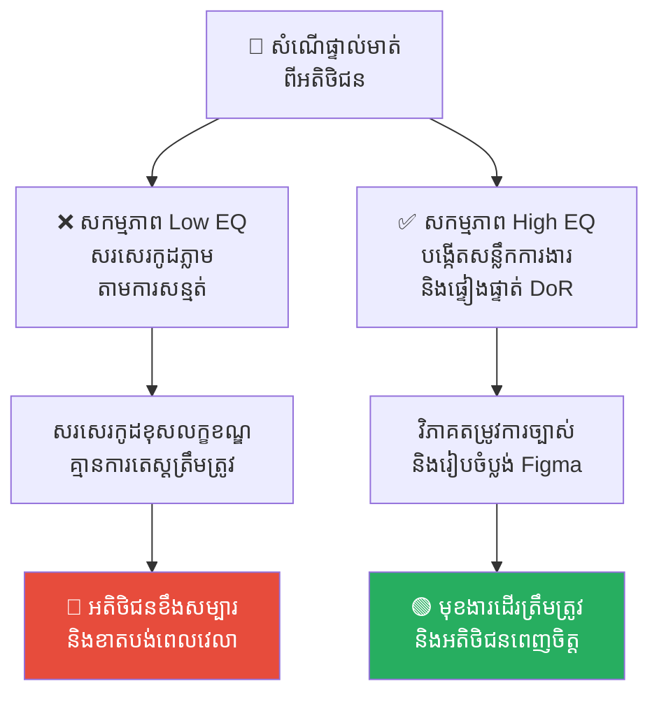
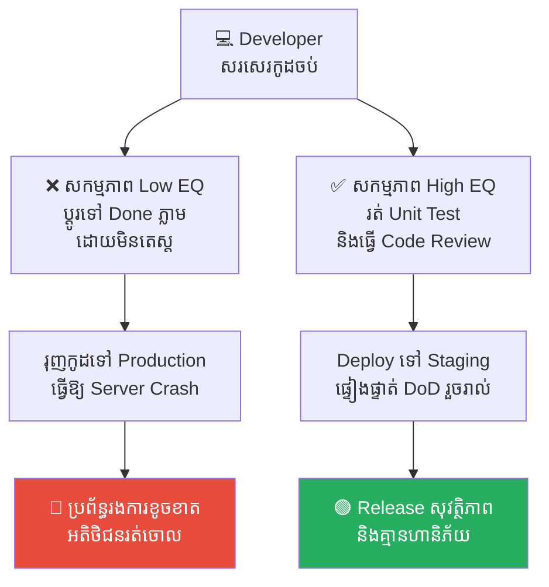
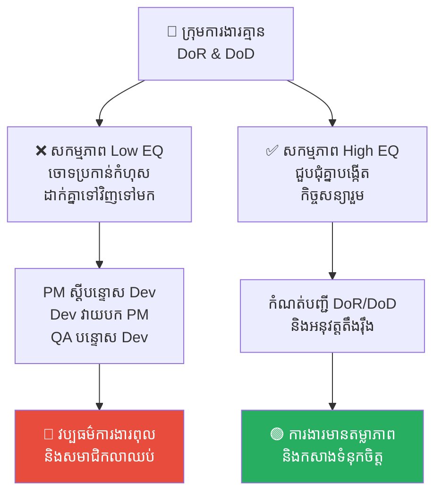
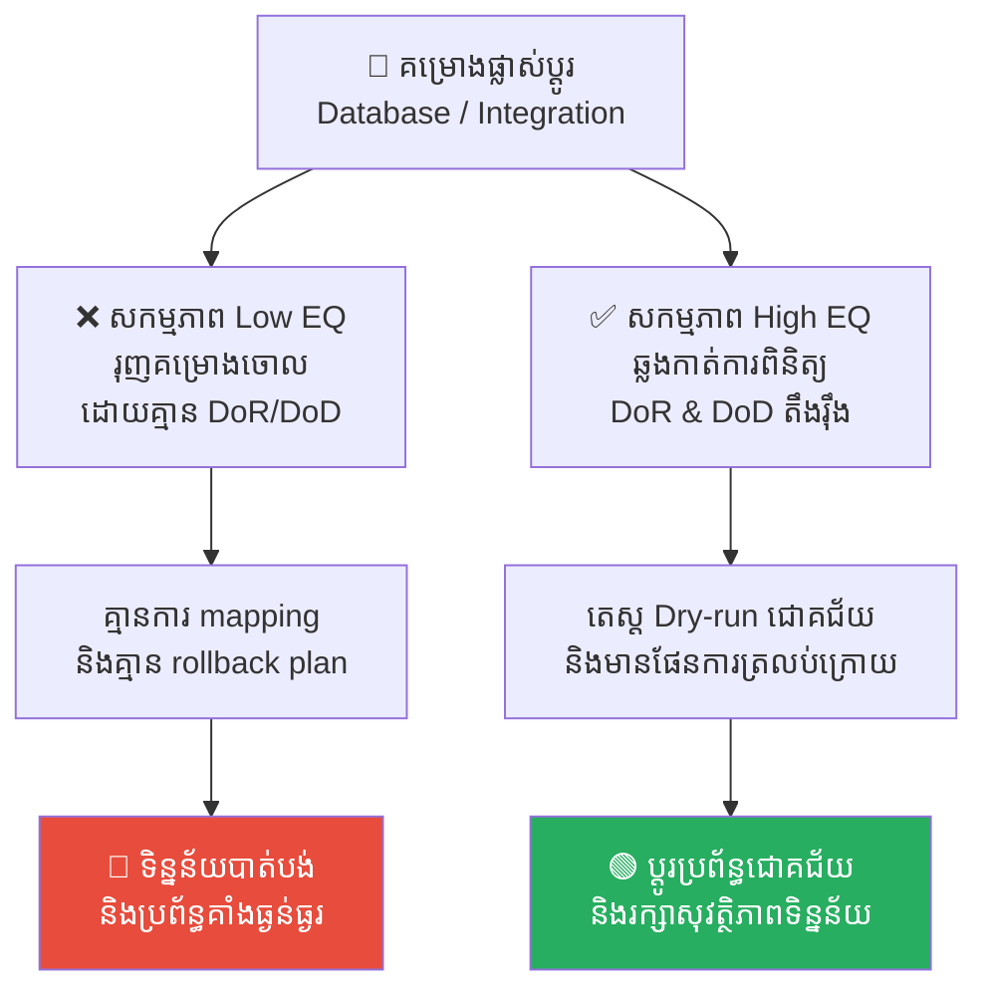

# Definition of Ready (DoR) & Definition of Done (DoD)៖ កិច្ចសន្យា DoR និង DoD ក្នុងការគ្រប់គ្រងគម្រោង

**Author:** ichamrong  
**Date:** 2026-05-17  
**Tags:** #scrum #agile #project-management #definition-of-ready #definition-of-done #team-collaboration #quality-management  
**Category:** Concepts  
**Read Time:** ~15 min  

---

## 📌 មាតិកា (Table of Contents)
- [អន្ទាក់ការងារ (The Trap)](#អន្ទាក់ការងារ-the-trap)
- [១. បញ្ហា៖ ទ្វារទ្វេភាគីនៃសូហ្វវែរអាជីព (The Issue: The Two Gates of Professional Software Engineering)](#១-បញ្ហា-ទ្វារទ្វេភាគីនៃសូហ្វវែរអាជីព-the-issue-the-two-gates-of-professional-software-engineering)
- [២. ឧទាហរណ៍ជាក់ស្តែងក្នុងពិភពពិត (Real World Examples)](#២-ឧទាហរណ៍ជាក់ស្តែងក្នុងពិភពពិត)
  - [ឧទាហរណ៍ទី ១ — កម្រិតស្រាល៖ អន្ទាក់ណែនាំដោយសម្តីទទេ (The "Oral Instruction" Trap)](#ឧទាហរណ៍ទី-១-កម្រិតស្រាល-អន្ទាក់ណែនាំដោយសម្តីទទេ-the-oral-instruction-trap)
  - [ឧទាហរណ៍ទី ២ — កម្រិតមធ្យម (បច្ចេកទេស)៖ ការដោះលែងកូដ "ដំណើរការលើម៉ាស៊ីនខ្ញុំ" (The "Works on My Machine" Release)](#ឧទាហរណ៍ទី-២-កម្រិតមធ្យម-បច្ចេកទេស-ការដោះលែងកូដ-ដំណើរការលើម៉ាស៊ីនខ្ញុំ-the-works-on-my-machine-release)
  - [ឧទាហរណ៍ទី ៣ — កម្រិតមធ្យម (ធុរកិច្ច)៖ ការលួចបន្ថែមការងារពាក់កណ្តាលផ្លូវ (The Mid-Sprint Scope Creep)](#ឧទាហរណ៍ទី-៣-កម្រិតមធ្យម-ធុរកិច្ច-ការលួចបន្ថែមការងារពាក់កណ្តាលផ្លូវ-the-mid-sprint-scope-creep)
  - [ឧទាហរណ៍ទី ៤ — កម្រិតធ្ងន់៖ វដ្តនៃការចោទប្រកាន់គ្នាក្នុងក្រុម (The Total Team Blame Cycle)](#ឧទាហរណ៍ទី-៤-កម្រិតធ្ងន់-វដ្តនៃការចោទប្រកាន់គ្នាក្នុងក្រុម-the-total-team-blame-cycle)
  - [ឧទាហរណ៍ទី ៥ — កម្រិតធ្ងន់ (បច្ចេកទេស)៖ ការផ្លាស់ប្តូរប្រព័ន្ធទិន្នន័យដោយគ្មានផែនការ (The Unplanned System Integration & Migration)](#ឧទាហរណ៍ទី-៥-កម្រិតធ្ងន់-បច្ចេកទេស-ការផ្លាស់ប្តូរប្រព័ន្ធទិន្នន័យដោយគ្មានផែនការ-the-unplanned-system-integration-migration)
- [៣. កត្តាជម្រុញ៖ សម្ពាធល្បឿន និងការសន្មត់ «រឿងសាមញ្ញ» (The Aggravator: Speed Pressure & The Assumption of Common Sense)](#៣-កត្តាជម្រុញ-សម្ពាធល្បឿន-និងការសន្មត់-រឿងសាមញ្ញ-the-aggravator-speed-pressure-the-assumption-of-common-sense)
- [៤. ដំណោះស្រាយទូទៅ (The General Solution)](#៤-ដំណោះស្រាយទូទៅ-the-general-solution)
  - [ការចងក្រងបញ្ជីផ្ទៀងផ្ទាត់ DoR របស់ក្រុម (Drafting Your Team's DoR Checklist)](#ការចងក្រងបញ្ជីផ្ទៀងផ្ទាត់-dor-របស់ក្រុម-drafting-your-teams-dor-checklist)
  - [ការចងក្រងបញ្ជីផ្ទៀងផ្ទាត់ DoD របស់ក្រុម (Drafting Your Team's DoD Checklist)](#ការចងក្រងបញ្ជីផ្ទៀងផ្ទាត់-dod-របស់ក្រុម-drafting-your-teams-dod-checklist)
  - [ការការពារទ្វារទាំងពីរយ៉ាងតឹងរ៉ឹង (Enforce the Gates)](#ការការពារទ្វារទាំងពីរយ៉ាងតឹងរ៉ឹង-enforce-the-gates)
- [សេចក្តីសន្និដ្ឋាន (Conclusion)](#សេចក្តីសន្និដ្ឋាន-conclusion)
- [Related Posts](#related-posts)

---

## អន្ទាក់ការងារ (The Trap)

តើអ្នកធ្លាប់អង្គុយនៅក្នុងកិច្ចប្រជុំរៀបចំផែនការការងារ (Sprint Planning) ហើយស្រាប់តែ Product Manager (PM) ទាញសន្លឹកការងារ (Ticket) មួយមកបង្ហាញដែលមានសរសេរតែពាក្យខ្លីៗថា៖ *«សូមភ្ជាប់ប្រព័ន្ធទូទាត់ប្រាក់ Stripe។ ធ្វើយ៉ាងណាឱ្យវាដំណើរការរលូនល្អ។»* ដែរឬទេ?

គ្មានគំរូរចនាប្លង់ Figma ភ្ជាប់មកជាមួយ, គ្មានឯកសារណែនាំ API ផ្លូវការ, ហើយរចនាសម្ព័ន្ធទិន្នន័យ (Database Schema) ក៏មិនទាន់ត្រូវបានកំណត់។ PM និយាយថា៖ *«អូ! វាងាយស្រួលណាស់ គ្រាន់តែមើលឯកសារលើគេហទំព័រផ្លូវការរបស់ពួកគេទៅ។ យើងត្រូវការប្រព័ន្ធនេះបញ្ចប់ក្នុង Sprint នេះដាច់ខាត!»*

Developer ចាប់ផ្តើមសរសេរកូដដោយផ្អែកលើការស្មាន។ បីថ្ងៃក្រោយមក នៅពេលពួកគេយក UI ទៅបង្ហាញ PM បែរជាស្រែកថា៖ *«ទេ! នេះមើលទៅអាក្រក់ណាស់! ជម្រើសបង់ប្រាក់ត្រូវតែបង្ហាញជាផ្ទាំង Modal Window មិនមែនជាទំព័រថ្មីដាច់ដោយឡែកឡើយ! ហើយចុះប៊ូតុងទាញយកវិក្កយបត្រនៅឯណា?»*

Developer ត្រូវបង្ខំចិត្តវាយកម្ទេចកូដចាស់ចោល និងសរសេរឡើងវិញទាំងអស់ពីដំបូង។ ដល់ថ្ងៃបញ្ចប់ Sprint សន្លឹកការងារនោះនៅតែមិនទាន់បញ្ចប់ គម្រោងត្រូវពន្យារពេល ហើយសមាជិកគ្រប់គ្នាមានការខឹងសម្បារ និងធុញទ្រាន់ខ្លាំង។

នេះគឺជាលទ្ធផលនៃការចូលរួមការងារ Sprint ដោយគ្មាន **Definition of Ready (DoR - និយមន័យនៃការត្រៀមខ្លួនរួចរាល់)**។

---

## ១. បញ្ហា៖ ទ្វារទ្វេភាគីនៃសូហ្វវែរអាជីព (The Issue: The Two Gates of Professional Software Engineering)

នៅក្នុងការអភិវឌ្ឍសូហ្វវែរប្រកបដោយវិជ្ជាជីវៈ គុណភាព និងភាពច្បាស់លាស់នៃការងារត្រូវបានរក្សាការពារដោយ «កិច្ចសន្យាផ្លូវការ» ពីរច្បាប់ដែលយល់ព្រមរួមគ្នាដោយសមាជិកក្រុមទាំងមូល៖

1. **Definition of Ready (DoR)៖** ទ្វារច្រកចូល (The Entrance Gate)។ វាបកស្រាយពីរាល់លក្ខខណ្ឌដែលសន្លឹកការងារ (User Story) ត្រូវតែមាន **«មុនពេល»** ត្រូវបានអនុញ្ញាតឱ្យយកចូលទៅអភិវឌ្ឍនៅក្នុង Sprint។
2. **Definition of Done (DoD)៖** ទ្វារច្រកចេញ (The Exit Gate)។ វាបកស្រាយពីរាល់លក្ខខណ្ឌដែលសន្លឹកការងារត្រូវតែបំពេញបានជោគជ័យ **«មុនពេល»** ត្រូវបានចាត់ទុកថាបានបញ្ចប់ជាស្ថាពរ និងរួចរាល់ក្នុងការ Release ទៅកាន់ Production។

```
                  ┌───────────────────────┐
                  │    Product Backlog    │
                  └───────────┬───────────┘
                              │
                    Definition of Ready (DoR)   <-- ទ្វារច្រកចូល (Entrance Gate)
                              │
                  ┌───────────▼───────────┐
                  │   Development Sprint  │
                  └───────────┬───────────┘
                              │
                    Definition of Done (DoD)    <-- ទ្វារច្រកចេញ (Exit Gate)
                              │
                  ┌───────────▼───────────┐
                  │   Production Release  │
                  └───────────────────────┘
```

ប្រសិនបើគ្មានទ្វារទាំងពីរនេះទេ ការសហការគ្នានៅក្នុងក្រុមនឹងធ្លាក់ចូលទៅក្នុងការសន្មត់ ការផ្លាស់ប្តូរគោលដៅពាក់កណ្តាលផ្លូវ និងវប្បធម៌ការងារចោទប្រកាន់កំហុសដាក់គ្នាទៅវិញទៅមកជានិច្ច។

---

## ២. ឧទាហរណ៍ជាក់ស្តែងក្នុងពិភពពិត

សូមពិនិត្យមើល **ឧទាហរណ៍ជាក់ស្តែងចំនួន ៥** បង្ហាញពីរបៀបដែល DoR និង DoD បង្កើតព្រំដែនការងារប្រកបដោយវិជ្ជាជីវៈ៖

---

### ឧទាហរណ៍ទី ១ — កម្រិតស្រាល៖ អន្ទាក់ណែនាំដោយសម្តីទទេ (The "Oral Instruction" Trap)

**ស្ថានភាព៖** អតិថិជនសាកសួរ Developer ផ្ទាល់តាម Slack Call ថា៖ *«តើអ្នកអាចជួយបន្ថែមប្រអប់ស្វែងរក (Search Box) តូចមួយនៅលើ Header នៃ Dashboard បានទេ?»*

* **សកម្មភាព Low EQ (កំហុសឆ្គង)៖** Developer យល់ព្រមភ្លាម និងចំណាយពេលមួយថ្ងៃពេញដើម្បីសរសេរកូដ ដោយមិនបានបង្កើតសន្លឹកការងារ (Ticket) និងមិនបានពិនិត្យថា API គាំទ្រការស្វែងរកឬអត់ឡើយ។ ស្អែកឡើង ពេលអតិថិជនតេស្ត ពួកគេវាយពាក្យស្វែងរកខ្លីៗ តែប្រព័ន្ធមិនបង្ហាញលទ្ធផល ពួកគេខឹងភ្លាម៖ *«ហេតុអ្វីមិនបង្ហាញ Fuzzy Match? ហើយវាមើលទៅអាក្រក់ណាស់នៅលើទូរស័ព្ទ!»*
* **សកម្មភាព High EQ (ដំណោះស្រាយ)៖** អនុវត្តច្បាប់ DoR៖ គ្មានសន្លឹកការងារផ្លូវការ គ្មានការអភិវឌ្ឍ (No ticket, no code)។ ត្រូវសរសេរតម្រូវការច្បាស់លាស់ ផ្ទៀងផ្ទាត់លទ្ធភាព API និងគំរូប្លង់ Figma ជាមុន ទើបអនុញ្ញាតឱ្យយកទៅសរសេរកូដ។
* **លទ្ធផល៖** ការរំលង DoR ធ្វើឱ្យខាតបង់ពេលវេលាធ្វើការងារឡើងវិញ។ ការគោរព DoR ជួយឱ្យក្រុមការងារដើរទិសដៅត្រឹមត្រូវ និងប្រគល់ការងារប្រកបដោយស្ថិរភាព។



---

### ឧទាហរណ៍ទី ២ — កម្រិតមធ្យម (បច្ចេកទេស)៖ ការដោះលែងកូដ "ដំណើរការលើម៉ាស៊ីនខ្ញុំ" (The "Works on My Machine" Release)

**ស្ថានភាព៖** Developer ម្នាក់ផ្លាស់ប្តូរសន្លឹកការងារទៅជា "Done" ព្រោះតែសរសេរកូដរួចរាល់នៅលើម៉ាស៊ីនខ្លួនឯង។

* **សកម្មភាព Low EQ (កំហុសឆ្គង)៖** Developer រុញ (Push) កូដផ្ទាល់ទៅកាន់ Main Branch ដោយមិនបានរត់ Unit Test, គ្មានការ Review កូដពីសមាជិកដទៃ, និងមិនបាន Deploy ទៅកាន់ Staging Server ដើម្បីតេស្តឡើយ។ ពេលប្រព័ន្ធ CI/CD បាញ់កូដឡើង Production Server ស្រាប់តែប្រព័ន្ធទាំងមូលត្រូវ Crash ព្រោះតែខ្វះ Environment Variables។ Developer ការពារខ្លួនភ្លាម៖ *«វាដើរធម្មតាតើនៅលើម៉ាស៊ីនខ្ញុំ!»*
* **សកម្មភាព High EQ (ដំណោះស្រាយ)៖** អនុវត្ត DoD ដាច់ខាត៖ កូដត្រូវតែឆ្លងកាត់ការ Review ពីប្រធានក្រុម, ត្រូវឆ្លងកាត់ Pipeline Test ១០០% ជោគជ័យ, និងត្រូវ Deploy តេស្តដោយគ្មានកំហុសនៅលើ Staging Server ទើបអនុញ្ញាតឱ្យប្តូរទៅជា "Done"។
* **លទ្ធផល៖** ការរំលង DoD បង្កគ្រោះមហន្តរាយដល់ប្រព័ន្ធបន្តផ្ទាល់។ ការគោរព DoD ធានារាល់ការ Release មានសុវត្ថិភាពខ្ពស់ និងគ្មានហានិភ័យ។



---

### ឧទាហរណ៍ទី ៣ — កម្រិតមធ្យម (ធុរកិច្ច)៖ ការលួចបន្ថែមការងារពាក់កណ្តាលផ្លូវ (The Mid-Sprint Scope Creep)

**ស្ថានភាព៖** ក្រុមការងារកំពុងដំណើរការ Sprint មកដល់សប្តាហ៍ទី ២។ ស្រាប់តែ PM បន្ថែមលក្ខខណ្ឌថ្មីពាក់កណ្តាលផ្លូវ៖ *«អូ! យើងត្រូវការប៊ូតុង PDF Export នេះឱ្យគាំទ្រការបកប្រែ ៣ ភាសា (ខ្មែរ អង់គ្លេស ចិន) ផងដែរ!»*

* **សកម្មភាព Low EQ (កំហុសឆ្គង)៖** Developer កំពុងសរសេរកូដផ្នែកស្នូលជិតចប់ហើយ។ ការបន្ថែមភាសាពាក់កណ្តាលផ្លូវបង្ខំឱ្យពួកគេវាយកម្ទេចរចនាសម្ព័ន្ធទិន្នន័យចាស់ ដែលអាចធ្វើឱ្យការងារផ្សេងទៀតទាំងអស់ក្នុង Sprint ត្រូវយឺតយ៉ាវដួលរលំ។
* **សកម្មភាព High EQ (ដំណោះស្រាយ)៖** Developer ប្រើប្រាស់ DoR ជាខែលការពារ៖ *«រាល់ការផ្លាស់ប្តូរលក្ខខណ្ឌការងារពាក់កណ្តាលផ្លូវ គឺជាការរំលោភលើច្បាប់ DoR រួមរបស់យើង។ មុខងារ Localization នេះត្រូវតែបង្កើតជាសន្លឹកការងារថ្មីដាច់ដោយឡែក យកទៅវិភាគក្នុង refinement សម្រាប់ Sprint ក្រោយ។»*
* **លទ្ធផល៖** ការលួចបន្ថែមការងារពាក់កណ្តាលផ្លូវធ្វើឱ្យក្រុមការងារបាក់ទឹកចិត្ត និង Sprint ដួលរលំ។ ការរក្សាព្រំដែន DoR ជួយឱ្យ Sprint រក្សាស្ថិរភាព និងផលិតភាពការងារខ្ពស់។

```mermaid
graph TD
    A["🏃‍♂️ ក្រុមការងារកំពុង<br/>ដំណើរការ Sprint"] --> B["❌ សកម្មភាព Low EQ<br/>PM លួចបន្ថែមភាសា<br/>ពាក់កណ្តាលផ្លូវ"]
    A --> C["✅ សកម្មភាព High EQ<br/>ប្រើប្រាស់ច្បាប់ DoR<br/>ជាខែលការពារ"]
    
    B --> D["វាយកម្ទេចកូដចាស់<br/>និងរំខានល្បឿនក្រុម"]
    D --> E["🔴 Sprint ដួលរលំ<br/>និងការងារយឺតយ៉ាវ"]
    
    C --> F["បង្កើតសន្លឹកការងារថ្មី<br/>សម្រាប់ Sprint ក្រោយ"]
    F --> G["🟢 រក្សាស្ថិរភាពក្រុម<br/>និងប្រគល់ការងារទាន់ពេល"]

    style E fill:#e74c3c,color:#fff
    style G fill:#27ae60,color:#fff
```



---

### ឧទាហរណ៍ទី ៤ — កម្រិតធ្ងន់៖ វដ្តនៃការចោទប្រកាន់គ្នាក្នុងក្រុម (The Total Team Blame Cycle)

**ស្ថានភាព៖** ក្រុមការងារបច្ចេកវិទ្យាដែលគ្មានការកំណត់ច្បាប់ DoR និង DoD ច្បាស់លាស់ កំពុងរងសម្ពាធការងារធ្ងន់ធ្ងរ។

* **សកម្មភាព Low EQ (កំហុសឆ្គង)៖** សមាជិកចោទប្រកាន់កំហុសដាក់គ្នាទៅវិញទៅមក៖ PM ស្តីបន្ទោស Developer ថាធ្វើការយឺតយ៉ាវ និងមាន Bug ច្រើន; Developer វាយបកទៅ PM ថាផ្តល់ព័ត៌មានមិនច្បាស់លាស់ និងផ្លាស់ប្តូរចិត្តរាល់ថ្ងៃ; QA ស្តីបន្ទោស Developer ថាបោះកូដខូចៗមកឱ្យតេស្តនៅថ្ងៃចុងក្រោយ។
* **សកម្មភាព High EQ (ដំណោះស្រាយ)៖** ជួបជុំសមាជិកក្រុមដើម្បីបង្កើតកិច្ចសន្យារួម DoR និង DoD។ អនុវត្តយន្តការត្រួតពិនិត្យតឹងរ៉ឹង៖ គ្មានការងារណាត្រូវបានអនុញ្ញាតឱ្យចូល ឬចេញពីបន្ទាត់អភិវឌ្ឍឡើយ បើមិនទាន់ឆ្លងកាត់ DoR/DoD checklist ជោគជ័យ។
* **លទ្ធផល៖** វដ្ត Blame Cycle បំផ្លាញវប្បធម៌ការងារ និងធ្វើឱ្យសមាជិកល្អៗលាឈប់។ ការកសាង DoR/DoD នាំមកនូវតម្លាភាព ទំនុកចិត្ត និងការសហការរវាងក្រុមការងារឡើងវិញ។



---

### ឧទាហរណ៍ទី ៥ — កម្រិតធ្ងន់ (បច្ចេកទេស)៖ ការផ្លាស់ប្តូរប្រព័ន្ធទិន្នន័យដោយគ្មានផែនការ (The Unplanned System Integration & Migration)

**ស្ថានភាព៖** ក្រុមហ៊ុនចង់ផ្លាស់ប្តូរប្រព័ន្ធទិន្នន័យអតិថិជន (Database Migration) ទៅកាន់ Cloud Server ថ្មីមួយ។

* **សកម្មភាព Low EQ (កំហុសឆ្គង)៖** ដោយសារតែសម្ពាធពេលវេលា PM បង្ខំឱ្យក្រុមការងាររុញគម្រោងនេះចោលដោយគ្មាន DoR (គ្មានការ mapping រចនាសម្ព័ន្ធទិន្នន័យច្បាស់លាស់, គ្មាន rollback plan ផ្លូវការ) និងគ្មាន DoD (គ្មានការរត់តេស្ត Dry-run លើទិន្នន័យសាកល្បង, គ្មានការផ្ទៀងផ្ទាត់ទិន្នន័យចុងក្រោយ)។ ប្រព័ន្ធគាំងទាំងស្រុង និងបាត់បង់ទិន្នន័យអតិថិជនមួយចំនួនធំ។
* **សកម្មភាព High EQ (ដំណោះស្រាយ)៖** អនុវត្ត DoR និង DoD តឹងរ៉ឹង៖ DoR តម្រូវឱ្យមានឯកសារ data mapping រួចរាល់ និងផែនការត្រលប់ក្រោយ (Rollback Strategy) ច្បាស់លាស់។ DoD តម្រូវឱ្យមានការសាកល្បង Dry-run ជោគជ័យ ១០០% លើ Staging Server និងមានការផ្ទៀងផ្ទាត់ភាពត្រឹមត្រូវនៃទិន្នន័យពី QA។
* **លទ្ធផល៖** ការរត់គម្រោងគ្មាន DoR/DoD នាំឱ្យបាត់បង់ទិន្នន័យ និងខូចខាតប្រព័ន្ធធ្ងន់ធ្ងរ។ ការគោរព DoR/DoD ជួយឱ្យការផ្លាស់ប្តូរប្រព័ន្ធជោគជ័យ សុវត្ថិភាព និងមិនរំខានដល់សេវាកម្មអតិថិជន។



---

## ៣. កត្តាជម្រុញ៖ សម្ពាធល្បឿន និងការសន្មត់ «រឿងសាមញ្ញ» (The Aggravator: Speed Pressure & The Assumption of Common Sense)

ហេតុអ្វីបានជាក្រុមការងារតែងតែរំលងច្បាប់ DoR និង DoD?

1. **ការយល់ច្រឡំពីល្បឿន (The Illusion of Speed)៖** យើងតែងតែគិតថាការចំណាយពេលអង្គុយសរសេរបញ្ជីផ្ទៀងផ្ទាត់ គូរ FIGMA ឬសរសេរលក្ខខណ្ឌការងារ គឺជា *«ភាពការិយាធិបតេយ្យយឺតយ៉ាវ»*។ យើងចង់ចាប់ផ្តើមសរសេរកូដភ្លាមៗ។ យើងច្រឡំការធ្វើចលនាវឹកវរ ថាជាការរីកចម្រើនការងារ។
2. **ការសន្មត់រឿងសាមញ្ញ (The "Common Sense" Fallacy)៖** PM សន្មត់ថា Developer *«ច្បាស់ជាដឹង»* ថារចនាសម្ព័ន្ធប៊ូតុងត្រូវធ្វើបែបណា។ Developer សន្មត់ថា QA *«ច្បាស់ជាចេះ»* រៀបចំតេស្តដោយខ្លួនឯង។ នៅក្នុងពិភពសូហ្វវែរ **«រឿងសាមញ្ញ (Common Sense) គឺគ្មានតម្លៃឡើយ»**។ ប្រសិនបើវាមិនត្រូវបានសរសេរច្បាស់លាស់ជាលាយលក្ខណ៍អក្សរទេ វានឹងត្រូវយល់ច្រឡំជាមិនខាន។

---

## ៤. ដំណោះស្រាយទូទៅ (The General Solution)

តើយើងអាចកសាងទ្វារទាំងពីរការពារក្រុមការងារយ៉ាងដូចម្តេច?

### ការចងក្រងបញ្ជីផ្ទៀងផ្ទាត់ DoR របស់ក្រុម (Drafting Your Team's DoR Checklist)
សន្លឹកការងារមួយ ត្រូវបានអនុញ្ញាតឱ្យយកចូល Sprint លុះត្រាតែបំពេញលក្ខខណ្ឌទាំងនេះ៖
* **Clear Value៖** មានការបញ្ជាក់ច្បាស់លាស់ពី «តួនាទី, អ្វីដែលចង់បាន, និងផលប្រយោជន៍» (As a... I want to... So that...)។
* **Explicit Acceptance Criteria៖** មានលក្ខខណ្ឌទទួលយកការងារច្បាស់លាស់ (Given/When/Then scenarios)។
* **Designs Attached៖** 有ភ្ជាប់ប្លង់គំរូ Figma រួចរាល់ (ប្រសិនបើប៉ះពាល់ UI/UX)។
* **Technical Agreement៖** រចនាសម្ព័ន្ធទិន្នន័យ ឬ API Specification ត្រូវបានយល់ព្រមរួមគ្នាដោយក្រុម backend/frontend។
* **No Blockers៖** គ្មានការពឹងផ្អែកទៅលើក្រុមការងារខាងក្រៅដែលមិនទាន់រួចរាល់ឡើយ។

### ការចងក្រងបញ្ជីផ្ទៀងផ្ទាត់ DoD របស់ក្រុម (Drafting Your Team's DoD Checklist)
សន្លឹកការងារមួយ ត្រូវបានចាត់ទុកថា "Done" លុះត្រាតែបំពេញលក្ខខណ្ឌទាំងនេះ៖
* **Code Implemented៖** កូដត្រូវបានសរសេរស្អាតត្រឹមត្រូវតាមស្ដង់ដារបច្ចេកទេស។
* **Tests Passed៖** Automated Unit/Integration tests ត្រូវបានរត់ជោគជ័យ ១០០%។
* **Code Reviewed៖** ឆ្លងកាត់ការ Review និង Approve ពីសមាជិកដទៃ (PR Approved)។
* **Self-Tested៖** Developer បានតេស្តសាកល្បងដោយផ្ទាល់ទាំង happy និង unhappy paths។
* **Deployed to Staging៖** កូដត្រូវបានបាញ់ឡើង និងតេស្តជោគជ័យដោយគ្មានកំហុសនៅលើ Staging Server ដោយក្រុម QA។

### ការការពារទ្វារទាំងពីរយ៉ាងតឹងរ៉ឹង (Enforce the Gates)
Scrum Master ឬ Lead Developer ត្រូវធ្វើជាអ្នកយាមទ្វារដ៏ហ្មត់ចត់បំផុត៖
* ប្រសិនបើសន្លឹកការងារមិនទាន់បំពេញតាមច្បាប់ DoR **ហាមទាញយកចូល Sprint ដាច់ខាត** ទោះបីជា PM អង្វរករយ៉ាងណាក៏ដោយ។
* ប្រសិនបើមុខងារការងារមិនទាន់បំពេញតាមច្បាប់ DoD **ហាមបាញ់ឡើង Production ដាច់ខាត** ទោះបីជាមានការប្រញាប់ប្រញាល់យ៉ាងណាក៏ដោយ។

---

## សេចក្តីសន្និដ្ឋាន (Conclusion)

ការបង្កើតច្បាប់ DoR និង DoD ច្បាស់លាស់ គឺជាការរៀបចំគ្រឹះទំនាក់ទំនងប្រកបដោយតម្លាភាព និងវិជ្ជាជីវៈខ្ពស់។ វាមិនមែនជាការបង្អាក់ល្បឿនការងារនោះឡើយ ប៉ុន្តែវាជាការធានាថា រាល់ជំហានដែលក្រុមការងារបោះទៅមុខ គឺជាជំហានដ៏រឹងមាំ និងគ្មានការថយក្រោយ ដែលជួយបំផ្លាញវដ្តនៃការចោទប្រកាន់គ្នា និងនាំមកនូវភាពជោគជ័យពិតប្រាកដជារៀងរហូត។

---

## Related Posts

* **[02-five-whys-technique.md](./02-five-whys-technique.md)** — របៀបស្វែងរកឫសគល់នៃបញ្ហានៅក្នុងដំណើរការការងារ IT។
* **[10-technical-debt-and-refactoring.md](./10-technical-debt-and-refactoring.md)** — របៀបដែលការបណ្តោយឱ្យកូដគ្មានគុណភាពឆ្លងផុតទ្វារ DoD បង្កើតជាបំណុលបច្ចេកវិទ្យា។
* **[12-multiplier-leadership.md](./12-multiplier-leadership.md)** — របៀបដែលមេដឹកនាំ Multiplier ចែករំលែកចំណេះដឹងផ្ទុយពីមេដឹកនាំ Diminisher។
* **[The Master Mason and the Readiness Contracts (មេជាងសំណង់ និងកិច្ចសន្យា DoR/DoD)](../parables/18-the-master-mason-and-the-readiness-contracts.md)** — រឿងប្រៀបធៀបប្រវត្តិសាស្ត្រអ៊ីតាលីរវាងជាងសំណង់ Leonardo, Marco និង សេដ្ឋី Giovanni។

---

*Last updated: 2026-05-26*
