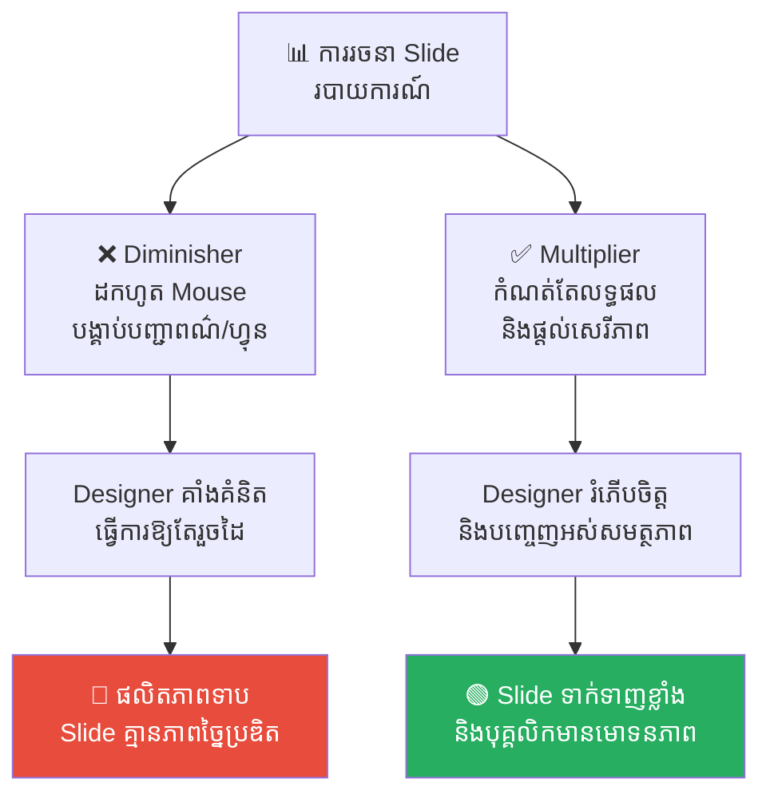
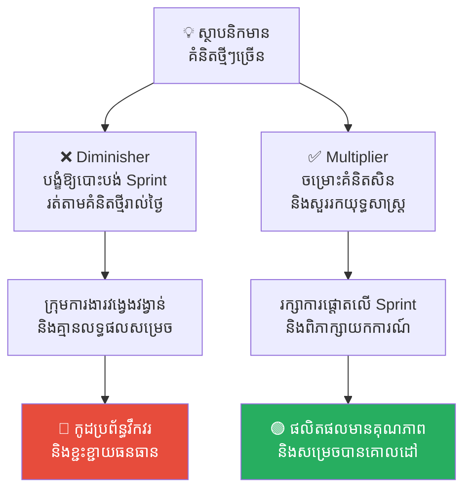
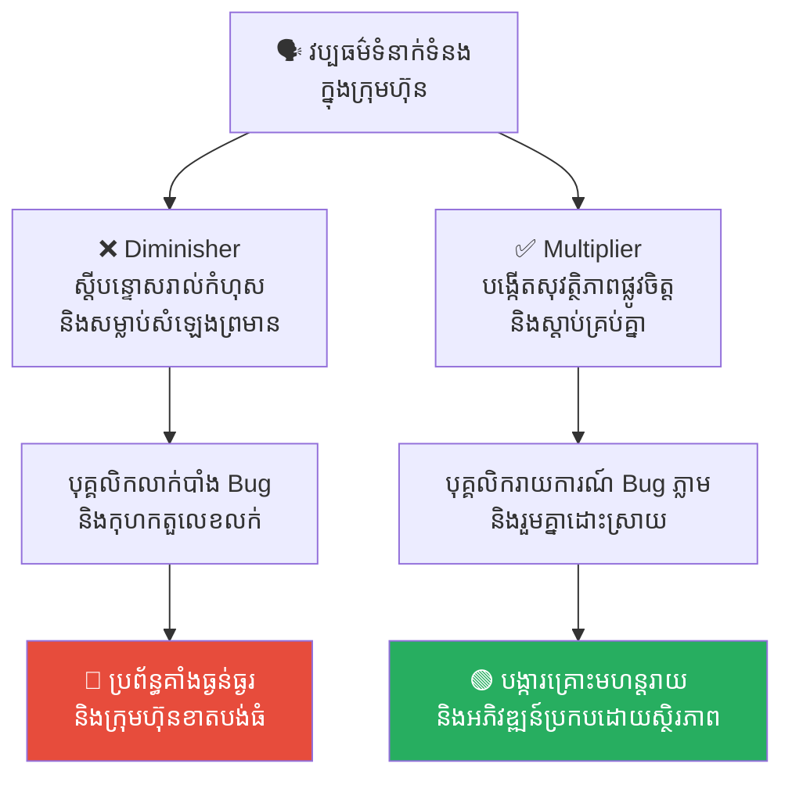
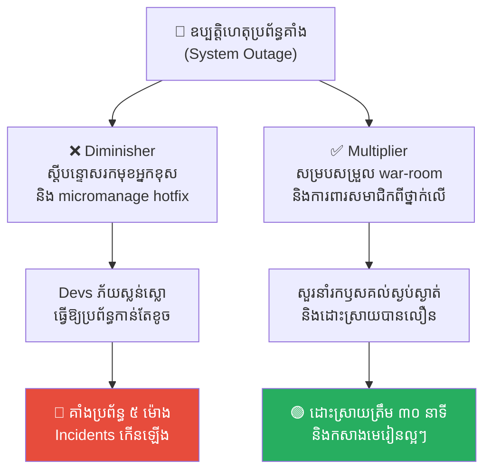

# Multiplier vs. Diminisher Leadership (អ្នកដឹកនាំបង្កើនសមត្ថភាព ទល់នឹង អ្នកដឹកនាំកាត់បន្ថយសមត្ថភាព)៖ ការដោះលែងបញ្ញាស្មារតីពិតប្រាកដរបស់ក្រុមការងារ

**Author:** ichamrong  
**Date:** 2026-05-17  
**Tags:** #multiplier-leadership #diminisher-leader #leadership #servant-leadership #psychological-safety #team-productivity  
**Category:** Concepts  
**Read Time:** ~15 min  

---

## 📌 មាតិកា (Table of Contents)
- [លំនាំបញ្ហា (The Trap)](#លំនាំបញ្ហា-the-trap)
- [១. បញ្ហា៖ ប្រភេទអ្នកដឹកនាំពីរប្រភេទ (The Issue: The Two Types of Leaders)](#១-បញ្ហា-ប្រភេទអ្នកដឹកនាំពីរប្រភេទ-the-issue-the-two-types-of-leaders)
- [២. ឧទាហរណ៍ជាក់ស្តែងក្នុងពិភពពិត (Real World Examples)](#២-ឧទាហរណ៍ជាក់ស្តែងក្នុងពិភពពិត)
  - [ឧទាហរណ៍ទី ១ — កម្រិតស្រាល៖ ការគ្រប់គ្រងលើការធ្វើ Presentation (Micromanaging a Presentation)](#ឧទាហរណ៍ទី-១-កម្រិតស្រាល-ការគ្រប់គ្រងលើការធ្វើ-presentation-micromanaging-a-presentation)
  - [ឧទាហរណ៍ទី ២ — កម្រិតមធ្យម (បច្ចេកទេស)៖ ឧបសគ្គពីអ្នកដឹកនាំប្រភេទ "វីរៈបុរស" (The "Genius Developer" Bottleneck)](#ឧទាហរណ៍ទី-២-កម្រិតមធ្យម-បច្ចេកទេស-ឧបសគ្គពីអ្នកដឹកនាំប្រភេទ-វីរៈបុរស-the-genius-developer-bottleneck)
  - [ឧទាហរណ៍ទី ៣ — កម្រិតមធ្យម (ធុរកិច្ច)៖ ការគាំងស្ទះដោយសារតែគំនិតហូរហៀរ (The Idea-Generator Paralysis)](#ឧទាហរណ៍ទី-៣-កម្រិតមធ្យម-ធុរកិច្ច-ការគាំងស្ទះដោយសារតែគំនិតហូរហៀរ-the-idea-generator-paralysis)
  - [ឧទាហរណ៍ទី ៤ — កម្រិតធ្ងន់៖ វប្បធម៌ការងារស្ងៀមស្ងាត់ និងការភ័យខ្លាច (The Corporate Culture of Silence & Fear)](#ឧទាហរណ៍ទី-៤-កម្រិតធ្ងន់-វប្បធម៌ការងារស្ងៀមស្ងាត់-និងការភ័យខ្លាច-the-corporate-culture-of-silence-fear)
  - [ឧទាហរណ៍ទី ៥ — កម្រិតធ្ងន់ (បច្ចេកទេស)៖ ការគ្រប់គ្រងគ្រោះអាសន្នប្រព័ន្ធគាំង (The Emergency Incident & Outage Handling)](#ឧទាហរណ៍ទី-៥-កម្រិតធ្ងន់-បច្ចេកទេស-ការគ្រប់គ្រងគ្រោះអាសន្នប្រព័ន្ធគាំង-the-emergency-incident-outage-handling)
- [៣. កត្តាជម្រុញ៖ អត្មាខ្ពស់របស់ "អ្នកដឹកនាំវីរៈបុរស" (The Aggravator: The Ego of the "Hero Leader")](#៣-កត្តាជម្រុញ-អត្មាខ្ពស់របស់-អ្នកដឹកនាំវីរៈបុរស-the-aggravator-the-ego-of-the-hero-leader)
- [៤. ដំណោះស្រាយទូទៅ (The General Solution)](#៤-ដំណោះស្រាយទូទៅ-the-general-solution)
  - [ប្តូរពីការបញ្ជាមកជាការចោទសួរ (The Socratic Shift)](#ប្តូរពីការបញ្ជាមកជាការចោទសួរ-the-socratic-shift)
  - [បង្កើត «ការអត់ឱនចំពោះកំហុសឆ្គង» (Psychological Safety)](#បង្កើត-ការអត់ឱនចំពោះកំហុសឆ្គង-psychological-safety)
  - [ធ្វើជាឆ័ត្រការពារក្រុមការងារពីផលរំខានខាងក្រៅ (Shield the Team)](#ធ្វើជាឆ័ត្រការពារក្រុមការងារពីផលរំខានខាងក្រៅ-shield-the-team)
- [សេចក្តីសន្និដ្ឋាន (Conclusion)](#សេចក្តីសន្និដ្ឋាន-conclusion)
- [Related Posts](#related-posts)

---

## លំនាំបញ្ហា (The Trap)

តើអ្នកធ្លាប់ធ្វើការងារក្រោមបង្គាប់អ្នកដឹកនាំម្នាក់ ដែលមានភាពឆ្លាតវៃអស្ចារ្យ មានវោហាសាស្ត្រទាក់ទាញ និងមានដំណោះស្រាយសម្រាប់រាល់បញ្ហាទាំងអស់ដែរឬទេ?

ដំបូងឡើយ អ្នកមានអារម្មណ៍រំភើប និងទទួលបានការជម្រុញទឹកចិត្តខ្ពស់។

ប៉ុន្តែយូរៗទៅ អ្នកចាប់ផ្តើមសង្កេតឃើញទង្វើប្លែកៗមួយចំនួន៖ រាល់ពេលចូលប្រជុំជាមួយពួកគេ អ្នកឈប់ហ៊ាននិយាយបញ្ចេញមតិយោបល់។ រាល់គំនិតដែលអ្នកដាក់ជូន ត្រូវបានពួកគេកែតម្រូវ និងសរសេរឡើងវិញទាំងអស់តាមគំនិតរបស់ពួកគេ។ ពួកគេធ្វើការសម្រេចចិត្តលើគ្រប់រឿងរ៉ាវទាំងអស់ គ្រប់គ្រងរាល់កិច្ចការតូចតាច (Micromanagement) និងពិនិត្យកូដរបស់អ្នករាល់ជួរយ៉ាងតឹងរ៉ឹង។

ចុងក្រោយ អ្នកឈប់ចង់គិតចោលទាំងអស់។ អ្នកក្លាយជាអ្នកធ្វើការងារតាមបញ្ជាដ៏អសកម្មម្នាក់។ ភាពឆ្លាតវៃរបស់អ្នកដឹកនាំម្នាក់នោះ មិនបានជួយឱ្យក្រុមការងារឆ្លាតជាងមុនឡើយ ប៉ុន្តែវាបានធ្វើឱ្យសមាជិកដទៃមានអារម្មណ៍ថាល្ងង់ខ្លៅ និងគ្មានតម្លៃទៅវិញ។

ឥឡូវនេះ ស្រមៃពីអ្នកដឹកនាំផ្ទុយគ្នា៖ ពួកគេមិនមែនជាមនុស្សដែលនិយាយខ្លាំងជាងគេក្នុងបន្ទប់ប្រជុំឡើយ ហើយក៏មិនដែលអះអាងថាខ្លួនដឹងគ្រប់រឿងដែរ។ ប៉ុន្តែពួកគេចោទសួររាល់សំណួរដ៏ស៊ីជម្រៅ ជួយសម្រួលរាល់ឧបសគ្គ និងធ្វើឱ្យអ្នកមានអារម្មណ៍ថាខ្លួនឯងមានសមត្ថភាព និងឆ្លាតវៃខ្លាំងណាស់។ នៅក្រោមការដឹកនាំរបស់ពួកគេ អ្នកសម្រេចបានលទ្ធផលដ៏អស្ចារ្យដែលអ្នកមិនធ្លាប់ស្រមៃថានឹងអាចធ្វើបានពីមុនមក។

    នេះគឺជាភាពខុសគ្នារវាង **Diminisher (អ្នកដឹកនាំកាត់បន្ថយសមត្ថភាព)** និង **Multiplier (អ្នកដឹកនាំបង្កើនសមត្ថភាព)**។

---

## ១. បញ្ហា៖ ប្រភេទអ្នកដឹកនាំពីរប្រភេទ (The Issue: The Two Types of Leaders)

យោងតាមការស្រាវជ្រាវដ៏ល្បីល្បាញរបស់លោកស្រី **Liz Wiseman** អ្នកដឹកនាំអាចត្រូវបានបែងចែកជាពីរប្រភេទផ្លូវចិត្តខុសគ្នាស្រឡះ៖

1. **Diminishers៖** អ្នកដឹកនាំដែលជឿជាក់ថា៖ *«មនុស្សជុំវិញខ្លួនខ្ញុំ មិនអាចដោះស្រាយបញ្ហាបានឡើយ ប្រសិនបើគ្មានវត្តមានខ្ញុំ។»* ពួកគេប្រើប្រាស់បញ្ញារបស់ខ្លួនដើម្បីអួតបង្ហាញ ស្រូបយកថាមពល និងពន្លឺលេចធ្លោរបស់សមាជិក គ្រប់គ្រងរាល់កិច្ចការតូចតាច និងប្រើប្រាស់អំណាច ឬការបំភិតបំភ័យដើម្បីគ្រប់គ្រង។ ពួកគេទទួលបានផលិតភាពការងារ**តិចជាង ៥០%** នៃសមត្ថភាពពិតរបស់ក្រុម។
2. **Multipliers៖** អ្នកដឹកនាំដែលជឿជាក់ថា៖ *«មនុស្សជុំវិញខ្លួនខ្ញុំមានភាពឆ្លាតវៃ និងមានសមត្ថភាពស្វែងរកដំណោះស្រាយបានល្អ។»* ពួកគេដើរតួនាទីជាអ្នកជួយពង្រីកសមត្ថភាព បង្កើតបញ្ហាប្រឈមធំៗ បើកចំហវេទិកាសម្រាប់ការជជែកដេញដោល និងការពារសមាជិកក្រុម។ ពួកគេដឹកនាំបែប **Servant Leadership (អ្នកដឹកនាំបម្រើ)** និងដោះលែងផលិតភាពបាន**ចាប់ពី ១០០% រហូតដល់ ២០០%** នៃសមត្ថភាពក្រុម។

```
❌ រូបមន្ត Diminisher៖ អ្នកដឹកនាំ (៩/១០) + ក្រុមការងារ (សង្កត់មកត្រឹម ៣/១០) = លទ្ធផលធ្លាក់ចុះ។
✅ រូបមន្ត Multiplier៖ អ្នកដឹកនាំ (៦/១០) + ក្រុមការងារ (ជម្រុញឡើងដល់ ៨/១០) = ភាពរីកចម្រើនអស្ចារ្យ។
```

---

## ២. ឧទាហរណ៍ជាក់ស្តែងក្នុងពិភពពិត

សូមពិនិត្យមើល **ឧទាហរណ៍ចំនួន ៥** បង្ហាញពីរបៀបដែលស្ទីលដឹកនាំជះឥទ្ធិពលលើសុខភាពផ្លូវចិត្ត និងលទ្ធផលការងាររបស់ក្រុម៖

---

### ឧទាហរណ៍ទី ១ — កម្រិតស្រាល៖ ការគ្រប់គ្រងលើការធ្វើ Presentation (Micromanaging a Presentation)

**ស្ថានភាព៖** ការរចនាសន្លឹកគំនូសបង្ហាញ (Slide Presentation) ចំនួន ១០ សន្លឹកសម្រាប់របាយការណ៍វិនិយោគិន។

* **សកម្មភាព Low EQ (កំហុសឆ្គង)៖** Manager អង្គុយក្បែរ Designer ហើយបង្គាប់បញ្ជាឱ្យប្តូរហ្វុន ពណ៌ និងរូបភាពគ្រប់សន្លឹកតាមចិត្តខ្លួន។ ពេល Designer ធ្វើការកែសម្រួលដំបូង Manager ដណ្តើមយក Mouse ភ្លាម៖ *«ទុកឱ្យខ្ញុំធ្វើខ្លួនឯងវិញ វាលឿនជាង!»*
* **សកម្មភាព High EQ (ដំណោះស្រាយ)៖** Manager កំណត់តែ **លទ្ធផលចុងក្រោយ** និង **លក្ខខណ្ឌកំណត់**៖ *«យើងត្រូវការបង្ហាញវិនិយោគិនឱ្យឃើញច្បាស់ថា ល្បឿន API របស់យើងកើនឡើង ៤០% តាមរយៈក្រាហ្វិកសាមញ្ញបំផុត។ នេះជាទិន្នន័យសាកល្បង សុំបង្ហាញ Draft ដំបូងឱ្យខ្ញុំមើលនៅថ្ងៃសុក្រ។»*
* **លទ្ធផល៖** ក្រោមបង្គាប់ Diminisher អ្នករចនាមានអារម្មណ៍ដូចជាម៉ាស៊ីនចម្លងគំនិត លែងចង់គិតច្នៃប្រឌិត និងធ្វើការងារឱ្យតែរួចពីដៃ។ ក្រោមបង្គាប់ Multiplier អ្នករចនាបង្កើតប្លង់បង្ហាញដ៏ស្រស់ស្អាត និងច្នៃប្រឌិតខ្ពស់ដែលលើសពីការរំពឹងទុករបស់ Manager។



---

### ឧទាហរណ៍ទី ២ — កម្រិតមធ្យម (បច្ចេកទេស)៖ ឧបសគ្គពីអ្នកដឹកនាំប្រភេទ "វីរៈបុរស" (The "Genius Developer" Bottleneck)

**ស្ថានភាព៖** Lead Architect ដែលមានបទពិសោធន៍ខ្ពស់ម្នាក់ កំពុងដឹកនាំក្រុមការងារ Junior Developers ចំនួន ៤ នាក់។

* **សកម្មភាព Low EQ (កំហុសឆ្គង)៖** Lead Architect ជឿជាក់ថាមានតែខ្លួនម្នាក់គត់ដែលអាចសរសេរកូដ Database Queries ដ៏មានសុវត្ថិភាពបាន។ ពួកគេសរសេរកូដផ្នែកស្នូលទាំងអស់តែម្នាក់ឯង ហើយបោះការងារសាមញ្ញៗដូចជា CSS ឬសរសេរ Test សាមញ្ញឱ្យ Juniors ធ្វើ។ ពេលមាន Bug ពួកគេធ្វើការ Fix ម្នាក់ឯងពេញមួយយប់ ហើយរអ៊ូថា៖ *«ក្រុមការងារគ្មានសមត្ថភាពសោះ ខ្ញុំត្រូវតែធ្វើអ្វីៗគ្រប់យ៉ាងតែម្នាក់ឯងជានិច្ច!»*
* **សកម្មភាព High EQ (ដំណោះស្រាយ)៖** Lead Setup កិច្ចប្រជុំ Whiteboard ជួបជុំគ្នា ដើម្បីបង្រៀន Juniors ពីរបៀបប្រើប្រាស់ប្រព័ន្ធ Performance Profiling Tools និងបែងចែកភារកិច្ចសរសេរ Query ពិបាកៗឱ្យពួកគេធ្វើដោយខ្លួនឯង ដោយខ្លួនឯងដើរតួជាអ្នកត្រួតពិនិត្យ និងផ្តល់មតិយោបល់លើ Pull Request (Code Review) យ៉ាងយកចិត្តទុកដាក់។
* **លទ្ធផល៖** អ្នកដឹកនាំវីរៈបុរសបង្កើតឱ្យមាន «ការកកស្ទះការងារ (Bottleneck)» ធ្ងន់ធ្ងរ និងធ្វើឱ្យ Juniors សម្រេចចិត្តលាឈប់ចោល។ ចំណែកអ្នកដឹកនាំគ្រូបង្វឹកសាងសង់បានក្រុមការងារបច្ចេកវិទ្យាដ៏រឹងមាំ និងមានសមត្ថភាពម្ចាស់ការខ្ពស់។

```mermaid
graph TD
    A["💻 ការដឹកនាំ<br/>ក្រុមបច្ចេកវិទ្យា"] --> B["❌ Diminisher<br/>ធ្វើការពិបាកម្នាក់ឯង<br/> juniors ធ្វើតែ CSS/Test"]
    A --> C["✅ Multiplier<br/>បង្រៀន juniors<br/>និងជួយ Review PR"]
    
    B --> D["Juniors មិនរីកចម្រើន<br/>ការងារកកស្ទះត្រង់ Lead"]
    D --> E["🔴 ផលិតភាពក្រុមធ្លាក់ចុះ<br/>និងបុគ្គលិកលាឈប់"]
    
    C --> F["Juniors កើនសមត្ថភាព<br/>Lead មានពេលគិតយុទ្ធសាស្ត្រ"]
    F --> G["🟢 ក្រុមការងាររឹងមាំ<br/>និងល្បឿនអភិវឌ្ឍលឿន"]

    style E fill:#e74c3c,color:#fff
    style G fill:#27ae60,color:#fff
```



---

### ឧទាហរណ៍ទី ៣ — កម្រិតមធ្យម (ធុរកិច្ច)៖ ការគាំងស្ទះដោយសារតែគំនិតហូរហៀរ (The Idea-Generator Paralysis)

**ស្ថានភាព៖** ស្ថាបនិក Startup ម្នាក់ដែលមានភាពច្នៃប្រឌិតខ្ពស់ និងតែងតែចូលមកការិយាល័យរៀងរាល់ព្រឹកដោយមានគំនិតផលិតផលថ្មីៗរាប់សិបមុខ។

* **សកម្មភាព Low EQ (កំហុសឆ្គង)៖** ស្ថាបនិកប្រាប់គំនិតថ្មីៗទាំង ៥ មុខជារៀងរាល់ថ្ងៃទៅកាន់ក្រុមការងារ និងបង្ខំឱ្យពួកគេបោះបង់ការងារ Sprint បច្ចុប្បន្នចោលភ្លាម ដើម្បីរត់ទៅស្រាវជ្រាវគំនិតថ្មីរបស់ខ្លួន។
* **សកម្មភាព High EQ (ដំណោះស្រាយ)៖** ស្ថាបនិកដំណើរការគំនិតរបស់ខ្លួនតាមរយៈប្រព័ន្ធចម្រោះទិន្នន័យច្បាស់លាស់ជាមុនសិន ហើយយកតែគំនិតចាស់ទុំដែលស្របតាមគោលដៅ Sprint មកពិភាក្សាជាមួយក្រុម ដោយចោទសួរថា៖ *«តើគំនិតនេះជួយពន្លឿនគោលដៅស្នូលរបស់យើងបច្ចុប្បន្នដោយរបៀបណា?»*
* **លទ្ធផល៖** គំនិតវង្វេងវង្វាន់រាល់ថ្ងៃធ្វើឱ្យកូដប្រព័ន្ធវឹកវរ និងគ្មាន Feature ណាត្រូវបានបញ្ចប់ជាស្ថាពរឡើយ។ ការគោរពច្បាប់ Sprint ជួយឱ្យផលិតផលមានគុណភាពខ្ពស់ និងសម្រេចបានគោលដៅធុរកិច្ចជាក់ស្តែង។



---

### ឧទាហរណ៍ទី ៤ — កម្រិតធ្ងន់៖ វប្បធម៌ការងារស្ងៀមស្ងាត់ និងការភ័យខ្លាច (The Corporate Culture of Silence & Fear)

**ស្ថានភាព៖** នៅក្នុងក្រុមហ៊ុនមួយដែលថ្នាក់ដឹកនាំជាន់ខ្ពស់តែងតែស្តីបន្ទោស ឬបង្ខូចកេរ្តិ៍ឈ្មោះបុគ្គលិកណាដែលរាយការណ៍ពីបញ្ហា ឬកំហុសឆ្គងនៃការងារ។

* **សកម្មភាព Low EQ (កំហុសឆ្គង)៖** ដើម្បីការពារអាជីពផ្ទាល់ខ្លួន Manager និងបុគ្គលិកទាំងអស់ចាប់ផ្តើមបិទបាំងរាល់ព័ត៌មានអវិជ្ជមាន។ ពួកគេលាក់បាំងរាល់ Bug ប្រព័ន្ធ, កុហកពីតួលេខការលក់ និងសម្លាប់សម្លេងព្រមានរបស់ក្រុម Dev ចោលទាំងអស់។
* **សកម្មភាព High EQ (ដំណោះស្រាយ)៖** ថ្នាក់ដឹកនាំបង្កើត «វប្បធម៌អត់ឱនចំពោះកំហុសស្ថាបនា» និងរៀបចំកិច្ចប្រជុំវិភាគកំហុសឆ្គងដោយគ្មានការចោទប្រកាន់ (Blameless Post-Mortem) ព្រមទាំងស្តាប់យោបល់ព្រមានពីសមាជិកដោយក្តីរីករាយ។
* **លទ្ធផល៖** វប្បធម៌ភ័យខ្លាចធ្វើឱ្យប្រព័ន្ធគាំងធ្ងន់ធ្ងរ ឬទិន្នន័យអតិថិជនត្រូវធ្លាយចេញក្រៅ បង្កការខាតបង់ទឹកប្រាក់រាប់លានដុល្លារ។ វប្បធម៌សុវត្ថិភាពផ្លូវចិត្តជួយបង្ការគ្រោះមហន្តរាយទាន់ពេលវេលា និងអភិវឌ្ឍន៍ក្រុមហ៊ុនប្រកបដោយស្ថិរភាព។



---

### ឧទាហរណ៍ទី ៥ — កម្រិតធ្ងន់ (បច្ចេកទេស)៖ ការគ្រប់គ្រងគ្រោះអាសន្នប្រព័ន្ធគាំង (The Emergency Incident & Outage Handling)

**ស្ថានភាព៖** ម៉ាស៊ីនបម្រើសេវាកម្មស្នូល (Core Production Server) ស្រាប់តែគាំងទាំងស្រុងនៅម៉ោង ១០ យប់ ធ្វើឱ្យអតិថិជនប្រើប្រាស់ App លែងកើត។

* **សកម្មភាព Low EQ (កំហុសឆ្គង)៖** Lead Developer ដែលមានអត្តចរិតបែប Diminisher ចូលរួម Slack channel ភ្លាមដោយភាពស្លន់ស្លោ និងស្រែកស្តីបន្ទោសរកមុខអ្នកខុសនៅចំពោះមុខគ្រប់គ្នា។ ពួកគេ micromanage រាល់បញ្ជា command line របស់សមាជិក ព្រមទាំងគំរាមកំហែងពីការបញ្ឈប់ពីការងារ ធ្វើឱ្យ Developers ភ័យញ័រដៃ បង្កើតកំហុសបន្ថែម និងចំណាយពេល ៥ ម៉ោងទើប Fix រួច។
* **សកម្មភាព High EQ (ដំណោះស្រាយ)៖** Lead Developer បែប Multiplier សម្របសម្រួលកិច្ចប្រជុំបន្ទាន់ (Emergency War-room) ដោយក្តីស្ងប់ស្ងាត់។ ពួកគេប្រាប់ក្រុមការងារថា៖ *«រឿងស្វែងរកកំហុសទុកវិភាគក្រោយពេលប្រព័ន្ធដើរឡើងវិញ។ ពេលនេះខ្ញុំធ្វើជាខែលការពាររាល់ទូរស័ព្ទរបស់ CEO និង Client ឱ្យអ្នកទាំងអស់គ្នា ផ្តោតអារម្មណ៍រកមូលហេតុ និង Fix វាដោយគ្មានសម្ពាធ។»* ពួកគេសួរនាំសំណួរត្រិះរិះ និងលើកទឹកចិត្តក្រុម។
* **លទ្ធផល៖** ក្រោមការដឹកនាំរបស់ Diminisher ក្រុមការងារភ័យស្លន់ស្លោ និងចំណាយពេល ៥ ម៉ោង Fix ទាំងបាត់បង់ទំនុកចិត្ត។ ក្រោមការដឹកនាំរបស់ Multiplier ក្រុមការងារមានភាពស្ងប់ស្ងាត់ ស្វែងរកឫសគល់បញ្ហាបានលឿន និងដោះស្រាយបានត្រឹមតែ ៣០ នាទី ព្រមទាំងទទួលបានមេរៀនល្អៗសម្រាប់អនាគត។



---

## ៣. កត្តាជម្រុញ៖ អត្មាខ្ពស់របស់ "អ្នកដឹកនាំវីរៈបុរស" (The Aggravator: The Ego of the "Hero Leader")

ហេតុអ្វីបានជាស្ទីលដឹកនាំបែប Multiplier ជួបប្រទះតិចតួចម្ល៉េះ?

1. **ការពេញចិត្តចំពោះ Ego ផ្ទាល់ខ្លួន (The Ego Reward)៖** ការធ្វើខ្លួនជា «វីរៈបុរស» ចុះមកដោះស្រាយរាល់បញ្ហាក្នុងគ្រាអាសន្ន ធ្វើឱ្យយើងមានអារម្មណ៍ល្អ និងមានអំនួតខ្ពស់ចំពោះសមត្ថភាពខ្លួនឯង។ យើងចង់ឱ្យគ្រប់គ្នាត្រូវការវត្តមានរបស់យើង។
2. **ការយល់ច្រឡំពីការគ្រប់គ្រង (The Illusion of Control)៖** យើងសន្មត់ថាការគ្រប់គ្រងលើគ្រប់ចំណុចល្អិតល្អន់ គឺជាការធានាគុណភាពការងារ។ យើងបំភ្លេចថា ការគ្រប់គ្រងគ្រប់ចំណុច (Micromanagement) គឺជាឧបសគ្គដ៏ធំបំផុតដែលបង្អាក់ភាពរីកចម្រើន និងល្បឿនអភិវឌ្ឍរបស់ក្រុមហ៊ុន។

---

## ៤. ដំណោះស្រាយទូទៅ (The General Solution)

តើយើងអាចផ្លាស់ប្តូរខ្លួនឯងពី Diminisher ទៅជា Multiplier យ៉ាងដូចម្តេច?

### ប្តូរពីការបញ្ជាមកជាការចោទសួរ (The Socratic Shift)
ឈប់ផ្តល់ចម្លើយ។ ចាប់ផ្តើមចោទសួររកដំណោះស្រាយ៖
* ❌ កុំនិយាយថា៖ *«យើងត្រូវតែសរសេរ Script មួយដើម្បីលុប Cache ទិន្នន័យនេះរាល់យប់។»*
* ✅ ត្រូវសួរថា៖ ***«ប្រព័ន្ធផ្ទុកទិន្នន័យ (Server Memory) របស់យើងកំពុង Peak ខ្លាំងរៀងរាល់ម៉ោង ៣ ភ្លឺដោយសារតែ Cache ណែនខ្លាំង។ តើយើងមានវិធីសាស្ត្រអ្វីខ្លះដើម្បីដោះស្រាយបញ្ហានេះឱ្យបានជាអចិន្ត្រៃយ៍?»***
* **អនុញ្ញាតឱ្យក្រុមការងារស្វែងរកដំណោះស្រាយដោយខ្លួនឯង ពួកគេនឹងយកចិត្តទុកដាក់ និងស្រឡាញ់ការងារនោះទ្វេដង។**

### បង្កើត «ការអត់ឱនចំពោះកំហុសឆ្គង» (Psychological Safety)
ធានាថាគ្រប់សមាជិកដឹងច្បាស់ថា ការបង្កើតកំហុសឆ្គងក្នុងពេលសិក្សា និងតេស្ត គឺជាទិន្នន័យស្ថាបនាដ៏មានតម្លៃ មិនមែនជាឧក្រិដ្ឋកម្មឡើយ៖
* រៀបចំកិច្ចប្រជុំវិភាគកំហុសឆ្គងដោយគ្មានការចោទប្រកាន់ (Blameless Post-Mortem) សម្រាប់រាល់ Bug ដែលធ្លាក់ដល់ Production។
* ផ្តល់រង្វាន់ ឬការសរសើរចំពោះសមាជិកណាដែលហ៊ានរាយការណ៍ ឬចងក្រងឯកសារពីភាពបរាជ័យរបស់ខ្លួនដើម្បីជួយសមាជិកដទៃកុំឱ្យដើរជាន់ផ្លូវខុស។

### ធ្វើជាឆ័ត្រការពារក្រុមការងារពីផលរំខានខាងក្រៅ (Shield the Team)
Manager ប្រភេទ Multiplier ត្រូវធ្វើខ្លួនជា **«ឆ័ត្រការពារ»**៖
* ត្រង និងចម្រោះរាល់សម្ពាធនយោបាយផ្ទៃក្នុង និងការផ្លាស់ប្តូរតម្រូវការញឹកញាប់ពីថ្នាក់ដឹកនាំជាន់ខ្ពស់ចោលទាំងអស់ មុនពេលវាធ្លាក់ដល់ដៃក្រុមការងារ។
* រក្សាបរិយាកាសការងារ Sprint ឱ្យមានភាពស្ងប់ស្ងាត់ មានស្ថិរភាព និងគ្មានការរំខាន។

---

## សេចក្តីសន្និដ្ឋាន (Conclusion)

រង្វាស់វាស់ស្ទង់របស់អគ្គនាយក ឬអ្នកដឹកនាំដ៏អស្ចារ្យ មិនមែនជា «តើពួកគេឆ្លាតវៃប៉ុណ្ណា» នោះឡើយ ប៉ុន្តែវាជា **«តើពួកគេអាចជួយដោះលែង និងបង្កើតបញ្ញាស្មារតីរបស់មនុស្សជុំវិញខ្លួនបានកម្រិតណា»**។ នៅពេលយើងមានភាពក្លាហានដើរចុះពីតំណែង «វីរៈបុរស» ហើយឡើងមកកាន់តំណែង «Multiplier» នោះយើងនឹងចាប់ផ្តើមសាងសង់អាណាចក្រនៃបញ្ញារួមដ៏មានអំណាចជារៀងរហូត។

---

## Related Posts

* **[03-science-of-communication-eq-flaws.md](./03-science-of-communication-eq-flaws.md)** — របៀបកម្ទេចរាល់កំហុសឆ្គង EQ ក្នុងការប្រាស្រ័យទាក់ទងការងារ។
* **[08-learned-helplessness.md](./08-learned-helplessness.md)** — របៀបដែលការគ្រប់គ្រងបែប Micromanagement បង្កើតឱ្យមានភាពអស់សង្ឹមផ្លូវចិត្តដល់កូនចៅ។
* **[11-dor-and-dod-scrum-contracts.md](./11-dor-and-dod-scrum-contracts.md)** — ការបង្កើតកិច្ចសន្យា DoR និង DoD ក្នុងការគ្រប់គ្រងគម្រោង។
* **[The Two Orchestras and the Silent Flute (អ្នកដឹកនាំភ្លេងពីររូប និងល្បែងសម្លេងស្ងាត់)](../parables/17-the-two-orchestras-and-the-silent-flute.md)** — រឿងប្រៀបធៀបដ៏រំភើបរវាង conductor Albert, Sophie និង Beatrice នៅក្នុងទីក្រុងវីយែន។

---

*Last updated: 2026-05-26*
