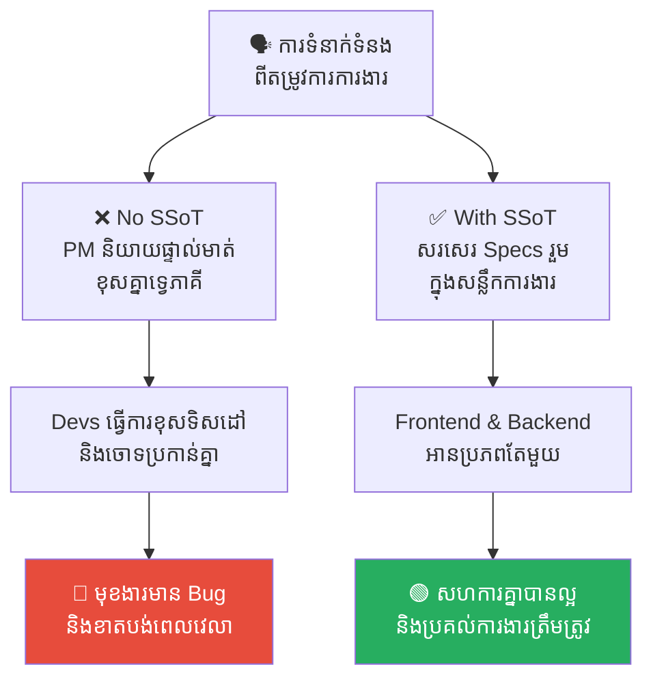
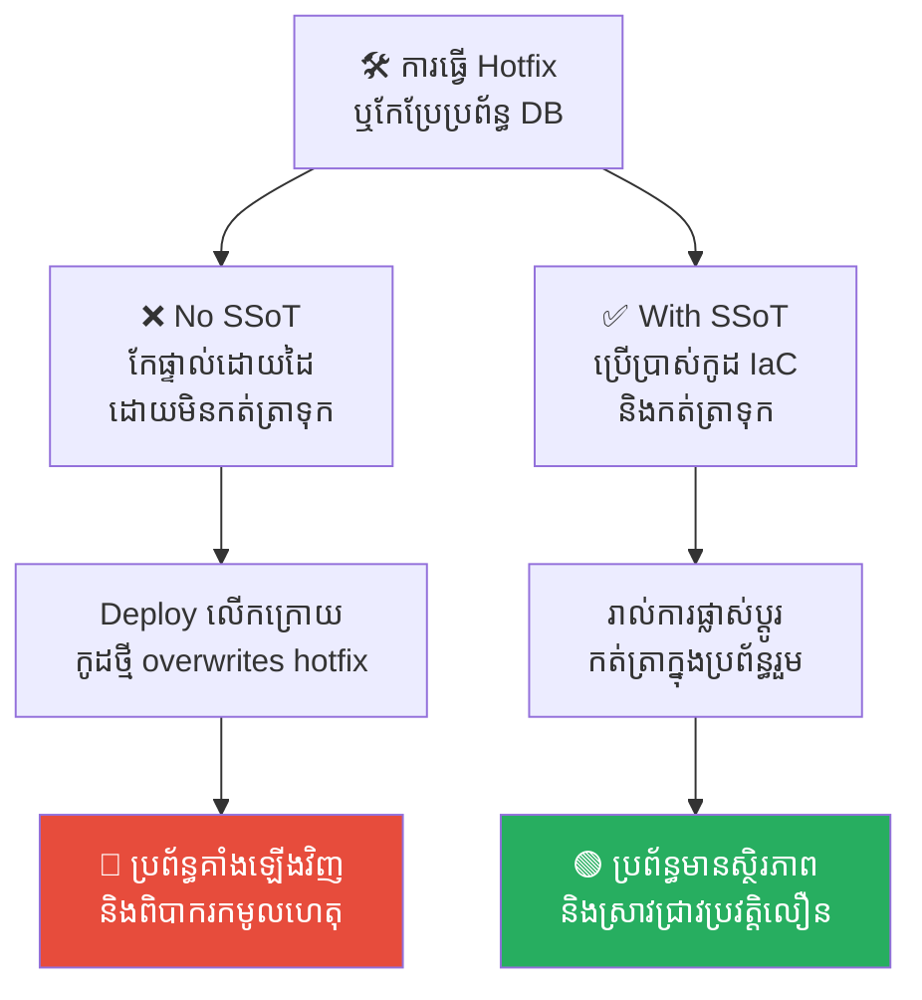
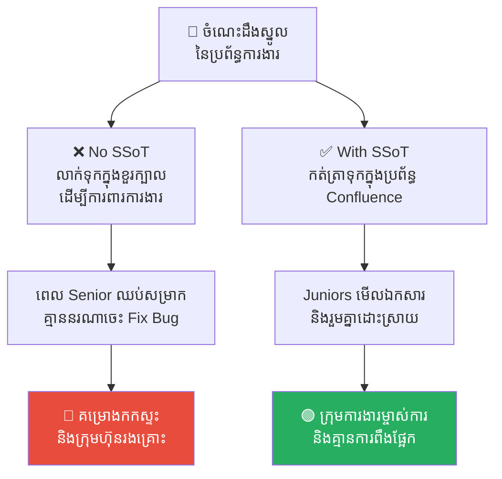
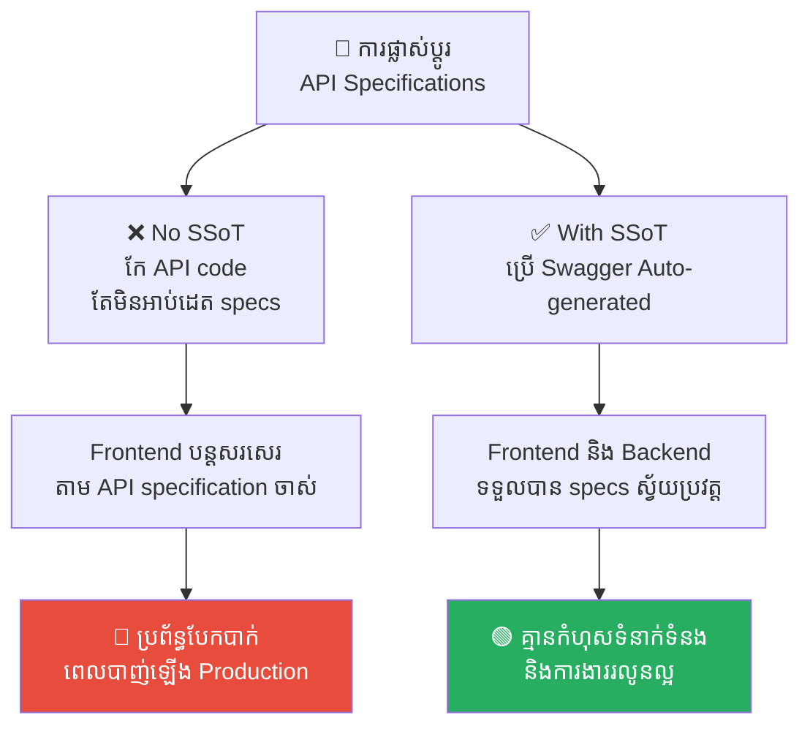
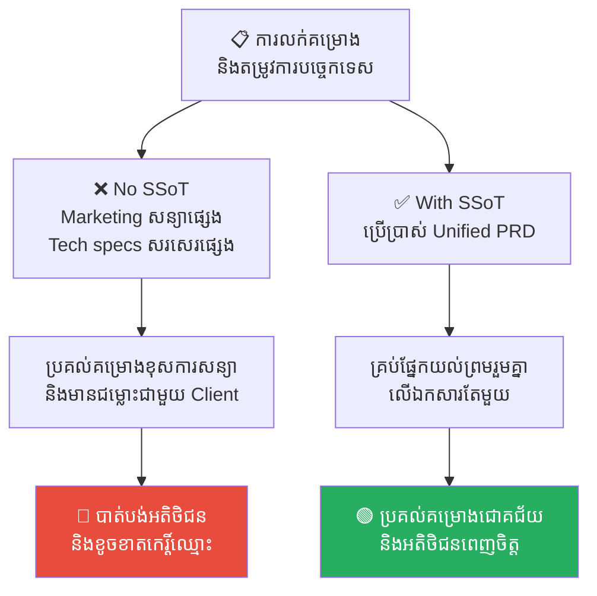

# Single Source of Truth vs. Toxic Knowledge Silos (ប្រភពព័ត៌មានតែមួយ និងវប្បធម៌លាក់ទុកចំណេះដឹង)

**Author:** ichamrong  
**Date:** 2026-05-17  
**Tags:** #single-source-of-truth #knowledge-silos #toxic-culture #documentation #agile #job-security  
**Category:** Concepts  
**Read Time:** ~15 min  

---

## 📌 មាតិកា (Table of Contents)
- [អន្ទាក់ផ្លូវចិត្ត (The Trap)](#អន្ទាក់ផ្លូវចិត្ត-the-trap)
- [១. បញ្ហា៖ ភាពវឹកវរនៃប្រភពព័ត៌មានដែលបែកបាក់ (The Issue: The Chaos of Fragmented Specs)](#១-បញ្ហា-ភាពវឹកវរនៃប្រភពព័ត៌មានដែលបែកបាក់-the-issue-the-chaos-of-fragmented-specs)
- [២. ឧទាហរណ៍ជាក់ស្តែងក្នុងពិភពពិត (Real World Examples)](#២-ឧទាហរណ៍ជាក់ស្តែងក្នុងពិភពពិត)
  - [ឧទាហរណ៍ទី ១ — កម្រិតស្រាល៖ អន្ទាក់ Specs ផ្ទាល់មាត់ខុសគ្នាទ្វេភាគី (The Mismatched Oral Specification)](#ឧទាហរណ៍ទី-១-កម្រិតស្រាល-អន្ទាក់-specs-ផ្ទាល់មាត់ខុសគ្នាទ្វេភាគី-the-mismatched-oral-specification)
  - [ឧទាហរណ៍ទី ២ — កម្រិតមធ្យម (បច្ចេកទេស)៖ ការកែប្រែប្រព័ន្ធដោយមិនកត់ត្រាទុក (The Undocumented Hotfix & Config Drift)](#ឧទាហរណ៍ទី-២-កម្រិតមធ្យម-បច្ចេកទេស-ការកែប្រែប្រព័ន្ធដោយមិនកត់ត្រាទុក-the-undocumented-hotfix-config-drift)
  - [ឧទាហរណ៍ទី ៣ — កម្រិតមធ្យម (ធុរកិច្ច)៖ ការលាក់ទុកចំណេះដឹងដើម្បីការពារការងារ (Toxic Job Security & Information Hoarding)](#ឧទាហរណ៍ទី-៣-កម្រិតមធ្យម-ធុរកិច្ច-ការលាក់ទុកចំណេះដឹងដើម្បីការពារការងារ-toxic-job-security-information-hoarding)
  - [ឧទាហរណ៍ទី ៤ — កម្រិតធ្ងន់៖ ឯកសារ API ហួសសម័យ (The Outdated Legacy API Specifications)](#ឧទាហរណ៍ទី-៤-កម្រិតធ្ងន់-ឯកសារ-api-ហួសសម័យ-the-outdated-legacy-api-specifications)
  - [ឧទាហរណ៍ទី ៥ — កម្រិតធ្ងន់៖ ជម្លោះរវាងការសន្យាលក់ និងសមត្ថភាពបច្ចេកទេស (The Sales Promise vs. Technical Reality)](#ឧទាហរណ៍ទី-៥-កម្រិតធ្ងន់-ជម្លោះរវាងការសន្យាលក់-និងសមត្ថភាពបច្ចេកទេស-the-sales-promise-vs-technical-reality)
- [៣. កត្តាជម្រុញ៖ វប្បធម៌ខ្សឹបតគ្នា និងការបំភាន់ព័ត៌មាន (The Aggravator: Whisper Culture and Weaponized Confusion)](#៣-កត្តាជម្រុញ-វប្បធម៌ខ្សឹបតគ្នា-និងការបំភាន់ព័ត៌មាន-the-aggravator-whisper-culture-and-weaponized-confusion)
- [៤. ដំណោះស្រាយទូទៅ (The General Solution)](#៤-ដំណោះស្រាយទូទៅ-the-general-solution)
  - [យុទ្ធសាស្ត្រ «បើមិនទាន់សរសេរទុក គឺមិនទាន់មានអត្ថិភាព» (If It's Not Written Down, It Doesn't Exist)](#យុទ្ធសាស្ត្រ-បើមិនទាន់សរសេរទុក-គឺមិនទាន់មានអត្ថិភាព-if-its-not-written-down-it-doesnt-exist)
  - [ការកម្ទេច «វីរបុរសបច្ចេកវិទ្យា» (Kill the Hero Culture)](#ការកម្ទេច-វីរបុរសបច្ចេកវិទ្យា-kill-the-hero-culture)
  - [ផ្តោតលើឯកសារនាំមុខ (Spec-Driven Development)](#ផ្តោតលើឯកសារនាំមុខ-spec-driven-development)
- [សេចក្តីសន្និដ្ឋាន (Conclusion)](#សេចក្តីសន្និដ្ឋាន-conclusion)
- [Related Posts](#related-posts)

---

## អន្ទាក់ផ្លូវចិត្ត (The Trap)

នៅក្នុងគម្រោងសូហ្វវែរភាគច្រើន តើអ្នកធ្លាប់ជួបប្រទះនឹងបញ្ហាដែលលក្ខខណ្ឌការងារ (Specs) ផ្លាស់ប្តូរជារៀងរាល់ថ្ងៃតាមរយៈមាត់ តាមរយៈសារក្នុង Slack/Telegram តាមរយៈការប្រជុំ ឬតាមរយៈឯកសារចាស់ៗដែលគ្មានអ្នកអាប់ដេតដែរឬទេ?

នៅពេលដែល Developer សួរថា៖ *«តើប៊ូតុងនេះគួរដំណើរការយ៉ាងដូចម្តេច?»*
* PM ឆ្លើយផ្សេង (តាមអ្វីដែលគាត់ចាំ)
* Team Lead ឆ្លើយផ្សេង (តាមអ្វីដែលធ្លាប់ស្តាប់ឮក្នុងម៉ោងកាហ្វេ)
* ឯកសារចាស់នៅលើ Jira សរសេរផ្សេង។

នេះគឺជាមហន្តរាយនៃការខ្វះ **Single Source of Truth (SSOT - ប្រភពព័ត៌មានតែមួយ)**។ ប៉ុន្តែបញ្ហានេះ ជារឿយៗមិនមែនកើតឡើងដោយសារតែភាពខ្ជិលច្រអូសនោះទេ តែវាបង្កឡើងដោយចេតនាអាក្រក់របស់បុគ្គលនៅក្នុងការិយាល័យ ដើម្បីយកព័ត៌មានធ្វើជាអំណាចផ្ទាល់ខ្លួន។

---

## ១. បញ្ហា៖ ភាពវឹកវរនៃប្រភពព័ត៌មានដែលបែកបាក់ (The Issue: The Chaos of Fragmented Specs)

នៅក្នុងស្ថាប័នដែលគ្មានតម្លាភាព បុគ្គលិកមួយចំនួន (អាចជា PM ឬ Senior Developer) តែងតែយក **«ព័ត៌មាន»** ធ្វើជា **«អំណាច» (Knowledge Silos)**។ 

ពួកគេមានចេតនាមិនសរសេរឯកសារឱ្យបានច្បាស់លាស់ឡើយ ដោយចងចាំរាល់ Business Logic ដ៏ស្មុគស្មាញ និងលក្ខខណ្ឌពិសេសៗនៅក្នុងខួរក្បាលរបស់ពួកគេតែម្នាក់ឯង។ នេះបង្កឱ្យមានការយល់ច្រឡំ ការសរសេរកូដខុសលំហូរការងារ និងការយល់ឃើញខុសៗគ្នា។

ការគិតថាកូដជាឯកសារយោង (Code is the Source of Truth) គឺជាទស្សនៈដែល **ខុសស្រឡះទាំងស្រុង**។ កូដគ្រាន់តែប្រាប់យើងពី **"អ្វីដែលប្រព័ន្ធកំពុងធ្វើនាពេលបច្ចុប្បន្ន" (Current State)** ប៉ុណ្ណោះ វាមិនបានប្រាប់យើងពី **"អ្វីដែលប្រព័ន្ធគួរតែធ្វើ" (Intended State)** ឡើយ។ ប្រសិនបើកូដមាន Bug ហើយយើងយកកូដនោះជាម៉ូដែលចម្លង យើងនឹងបន្តចម្លងកំហុសនោះទៅជំនាន់ក្រោយៗទៀត។

---

## ២. ឧទាហរណ៍ជាក់ស្តែងក្នុងពិភពពិត

សូមពិនិត្យមើល **ឧទាហរណ៍ជាក់ស្តែងចំនួន ៥** បង្ហាញពីរបៀបដែលអវត្តមាន និងវត្តមានរបស់ SSOT ជះឥទ្ធិពលលើដំណើរការគម្រោង៖

---

### ឧទាហរណ៍ទី ១ — កម្រិតស្រាល៖ អន្ទាក់ Specs ផ្ទាល់មាត់ខុសគ្នាទ្វេភាគី (The Mismatched Oral Specification)

**ស្ថានភាព៖** PM ចង់បង្កើតប្រព័ន្ធចុះឈ្មោះអ្នកប្រើប្រាស់ថ្មី (User Registration Flow)។

* **សកម្មភាព Low EQ (កំហុសឆ្គង)៖** PM ដើរទៅប្រាប់ Backend Developer ផ្ទាល់មាត់ថា៖ *«ធ្វើឱ្យ API ទទួលយកការចុះឈ្មោះជាលេខទូរស័ព្ទផង!»* រួចដើរទៅប្រាប់ Frontend Developer ម្នាក់ទៀតថា៖ *«រចនា UI ចុះឈ្មោះដោយប្រើតែអ៊ីមែលបានហើយ សាមញ្ញល្អ!»* គ្មានការបង្កើតសន្លឹកការងារ ឬឯកសារច្បាស់លាស់ឡើយ។ Mismatch នេះធ្វើឱ្យប្រព័ន្ធបែកបាក់ និងកើតមានជម្លោះចោទប្រកាន់គ្នាទៅវិញទៅមក។
* **សកម្មភាព High EQ (ដំណោះស្រាយ)៖** PM សរសេរ Specs រួម (User Story) ចូលក្នុងប្រព័ន្ធ Jira តែមួយ ដែលបញ្ជាក់ច្បាស់លាស់ថា ប្រព័ន្ធគាំទ្រទាំងការចុះឈ្មោះតាមអ៊ីមែល និងលេខទូរស័ព្ទ រួមទាំងមានគំរូ Figma ភ្ជាប់ជាមួយ។ ទាំង Frontend និង Backend អានប្រភពរួមគ្នាមុននឹងចាប់ផ្តើម។
* **លទ្ធផល៖** ការរំលង SSOT បង្កើតជា Bug ទំនាក់ទំនង និងខាតបង់ពេលវេលាធ្វើការឡើងវិញ។ ការមាន SSOT ជួយឱ្យសហការគ្នាល្អ និងប្រគល់ការងារបានជោគជ័យ។

---

### ឧទាហរណ៍ទី ២ — កម្រិតមធ្យម (បច្ចេកទេស)៖ ការកែប្រែប្រព័ន្ធដោយមិនកត់ត្រាទុក (The Undocumented Hotfix & Config Drift)

**ស្ថានភាព៖** ម៉ាស៊ីនបម្រើទិន្នន័យ (Database Server) របស់ Production ស្រាប់តែដើរយឺតខ្លាំងនៅពាក់កណ្តាលយប់។

* **សកម្មភាព Low EQ (កំហុសឆ្គង)៖** Senior Developer ម្នាក់ចូលទៅកែសម្រួល Configuration (Max Connections) និងបង្កើត Index ផ្ទាល់ដៃលើម៉ាស៊ីន Production DB ដោយមិនបានរាយការណ៍ គ្មានការកត់ត្រាទុកក្នុង Git repository ឬឯកសារណាមួយឡើយ។ ពីរថ្ងៃក្រោយមក ប្រព័ន្ធ CI/CD Deploy កូដកំណែទម្រង់ថ្មី ដែល overwrite configuration ចាស់ ធ្វើឱ្យប្រព័ន្ធគាំងឡើងវិញជាទីពីរ។
* **សកម្មភាព High EQ (ដំណោះស្រាយ)៖** អនុវត្តគោលការណ៍ **Infrastructure as Code (IaC)** និងកត់ត្រាការផ្លាស់ប្តូរទាំងអស់ក្នុង Git។ រាល់ការកែប្រែ database configurations ត្រូវតែឆ្លងកាត់ការបង្កើត Pull Request និងមានការកត់ត្រាប្រវត្តិ (Git Commits) ច្បាស់លាស់។
* **លទ្ធផល៖** ការធ្វើ Hotfix ផ្ទាល់ដៃដោយមិនកត់ត្រា បង្កើតជាគ្រោះថ្នាក់គាំងប្រព័ន្ធឡើងវិញ និងពិបាករកមូលហេតុ។ ការមាន IaC ជា SSOT ជួយរក្សាស្ថិរភាពប្រព័ន្ធ និងងាយស្រួលស្រាវជ្រាវប្រវត្តិផ្លាស់ប្តូរ។

---

### ឧទាហរណ៍ទី ៣ — កម្រិតមធ្យម (ធុរកិច្ច)៖ ការលាក់ទុកចំណេះដឹងដើម្បីការពារការងារ (Toxic Job Security & Information Hoarding)

**ស្ថានភាព៖** បុគ្គលិក Senior ម្នាក់បានគ្រប់គ្រងប្រព័ន្ធទូទាត់ប្រាក់ (Payment Engine) ដ៏ស្មុគស្មាញរបស់ក្រុមហ៊ុនអស់រយៈពេល ៣ ឆ្នាំ។

* **សកម្មភាព Low EQ (កំហុសឆ្គង)៖** Senior នាក់នេះចេតនាមិនសរសេរឯកសារណែនាំពី Architecture ឬ System integration ឡើយ ដើម្បីបង្កើត «ការពឹងផ្អែកផ្តាច់មុខ (Dependency)» ធានាថាក្រុមហ៊ុនមិនហ៊ានបញ្ឈប់គាត់ពីការងារ (Toxic Job Security)។ ពេលគាត់សុំច្បាប់សម្រាកវិស្សមកាល ប្រព័ន្ធ payment ស្រាប់តែគាំង ហើយ Juniors ទាំងអស់រួមទាំងក្រុមហ៊ុនរងការគាំងស្ទះការងារទាំងស្រុង។
* **សកម្មភាព High EQ (ដំណោះស្រាយ)៖** ក្រុមហ៊ុនចាត់ទុកការកត់ត្រាឯកសារបច្ចេកទេសក្នុង Confluence ជា KPI វាយតម្លៃសមត្ថភាព និងបង្កើតវប្បធម៌ចែករំលែកចំណេះដឹង។ Senior ត្រូវចងក្រងឯកសារណែនាំច្បាស់លាស់ និងធ្វើការបង្វឹក Juniors ឱ្យចេះដោះស្រាយប្រព័ន្ធនេះដូចគ្នា។
* **លទ្ធផល៖** ការ hoard ព័ត៌មានដើម្បីអំណាច បង្កើតជាគ្រោះថ្នាក់ដួលរលំគម្រោងពេលបាត់បង់បុគ្គលម្នាក់។ ការសរសេរ Confluence ជួយឱ្យក្រុមការងារម្ចាស់ការ និងកម្ទេចការពឹងផ្អែកលើបុគ្គលម្នាក់ៗ។

---

### ឧទាហរណ៍ទី ៤ — កម្រិតធ្ងន់៖ ឯកសារ API ហួសសម័យ (The Outdated Legacy API Specifications)

**ស្ថានភាព៖** ក្រុម Backend កំពុងធ្វើការផ្លាស់ប្តូរ និងបន្ថែម Parameters ថ្មីៗនៅក្នុង API Endpoints។

* **សកម្មភាព Low EQ (កំហុសឆ្គង)៖** Backend Developers កែប្រែកូដ API ភ្លាមៗ ប៉ុន្តែមិនបានអាប់ដេតឯកសារយោង API (Specs) ឡើយ ដោយគិតថាមិនសំខាន់។ ក្រុម Frontend បន្តសរសេរកូដ និងរចនា UI ផ្អែកលើ specs ចាស់ហួសសម័យ ធ្វើឱ្យប្រព័ន្ធទាំងមូលត្រូវបែកបាក់ទាំងស្រុងនៅពេលរុញឡើង Production។
* **សកម្មភាព High EQ (ដំណោះស្រាយ)៖** ប្រើប្រាស់ឧបករណ៍ auto-generated specifications ដូចជា **OpenAPI / Swagger** ភ្ជាប់ទៅនឹងកូដដោយផ្ទាល់។ រាល់ពេល Backend កែប្រែកូដ ឯកសារ API specs នឹងអាប់ដេតដោយស្វ័យប្រវត្តិតាមរយៈ CI/CD Pipeline ទៅកាន់ Frontend ដឹងភ្លាមៗ។
* **លទ្ធផល៖** ឯកសារ API ចាស់ហួសសម័យធ្វើឱ្យខូចខាតប្រព័ន្ធពេល release។ Swagger Auto-generated specs ធានាគ្មានកំហុសទំនាក់ទំនង និងធ្វើឱ្យល្បឿនអភិវឌ្ឍរលូនល្អ។

---

### ឧទាហរណ៍ទី ៥ — កម្រិតធ្ងន់៖ ជម្លោះរវាងការសន្យាលក់ និងសមត្ថភាពបច្ចេកទេស (The Sales Promise vs. Technical Reality)

**ស្ថានភាព៖** ក្រុមហ៊ុនលក់ប្រព័ន្ធគ្រប់គ្រងសណ្ឋាគារ ត្រូវការចុះកិច្ចសន្យាជាមួយអតិថិជន VIP ម្នាក់។

* **សកម្មភាព Low EQ (កំហុសឆ្គង)៖** ផ្នែកលក់ (Marketing / Sales) ចង់បានចំណូលលឿន ក៏សន្យាផ្ទាល់មាត់ជាមួយ Client ថាប្រព័ន្ធអាចគាំទ្រមុខងារ *«រាយការណ៍ហិរញ្ញវត្ថុស្វ័យប្រវត្តតាមតម្រូវការចិត្តចង់»*។ ប៉ុន្តែបច្ចេកទេសពិតប្រាកដមិនអាចធ្វើបានឡើយ។ ពេលក្រុម Tech ប្រគល់ផលិតផល Client ខឹងសម្បារព្រោះខុសពីការសន្យា និងគំរាមប្តឹងក្រុមហ៊ុន។
* **សកម្មភាព High EQ (ដំណោះស្រាយ)៖** បង្កើតឯកសារ **Unified Product Requirement Document (PRD)** ជា SSOT រួម។ រាល់ការសន្យា ឬលក្ខខណ្ឌការងារទាំងអស់ត្រូវតែឆ្លងកាត់ការពិនិត្យ យល់ព្រម និងចុះហត្ថលេខាពីទាំងប្រធានផ្នែកលក់ និងប្រធានក្រុមបច្ចេកវិទ្យា មុនពេលចុះកិច្ចសន្យាជាមួយ Client។
* **លទ្ធផល៖** ជម្លោះរវាងផ្នែកលក់ និងក្រុមបច្ចេកទេសធ្វើឱ្យបាត់បង់អតិថិជន និងខូចខាតកេរ្តិ៍ឈ្មោះធ្ងន់ធ្ងរ។ ការគោរព Unified PRD ធានាការប្រគល់គម្រោងជោគជ័យ និងបង្កើតទំនុកចិត្តខ្ពស់ជាមួយដៃគូ។

---

## ៣. កត្តាជម្រុញ៖ វប្បធម៌ខ្សឹបតគ្នា និងការបំភាន់ព័ត៌មាន (The Aggravator: Whisper Culture and Weaponized Confusion)

ហេតុអ្វីបានជាវប្បធម៌លាក់ទុកចំណេះដឹង និងការគ្មាន SSOT កើតឡើងក្នុងស្ថាប័ន?

1. **វប្បធម៌ខ្សឹបតគ្នា (The Whisper Culture)៖** PM ច្រើនតែនិយាយផ្ទាល់មាត់តែជាមួយ Team Lead ឬ Developer ម្នាក់ដែលគាត់ចូលចិត្ត។ បន្ទាប់មក Team Lead នោះក៏យកទៅប្រាប់ Developer ម្នាក់ទៀត ហើយ Developer នោះក៏យកទៅប្រាប់ QA។ នេះប្រៀបបាននឹងល្បែងខ្សឹបតគ្នា (Telephone Game) ដែលព័ត៌មាននឹងត្រូវបាត់បង់ ឬប្រែប្រួលអត្ថន័យនៅពេលទៅដល់អ្នកអនុវត្តចុងក្រោយ។
2. **កលល្បិចបំភាន់ព័ត៌មាន (Malicious Compliance / Weaponized Confusion)៖** បុគ្គលខ្លះមានចេតនាផ្តល់ឯកសារដែលមិនពេញលេញ ឬពន្យល់ដោយប្រើពាក្យបច្ចេកទេសដ៏សែនស្មុគស្មាញ ដើម្បីឱ្យអ្នកស្តាប់គិតថាប្រព័ន្ធនេះពិតជា "Magic" ដែលមានតែគាត់ម្នាក់គត់ទើបអាចយល់បាន។ ពួកគេព្យាយាមជាន់អ្នកដទៃ ដើម្បីលើកតម្កើងភាពអស្ចារ្យរបស់ខ្លួនឯង។

---

## ៤. ដំណោះស្រាយទូទៅ (The General Solution)

ដើម្បីលុបបំបាត់វប្បធម៌ដ៏ពុលនេះ ស្ថាប័នត្រូវតែអនុវត្តច្បាប់ដ៏តឹងរ៉ឹង៖

### យុទ្ធសាស្ត្រ «បើមិនទាន់សរសេរទុក គឺមិនទាន់មានអត្ថិភាព» (If It's Not Written Down, It Doesn't Exist)
រាល់លក្ខខណ្ឌការងារទាំងអស់ ទោះបីជានិយាយគ្នាច្បាស់ក្នុងកិច្ចប្រជុំ ឬក្នុង Slack ក៏ដោយ ត្រូវតែយកមកសរសេរអាប់ដេតចូលទៅក្នុង Ticket (Jira/Trello) ឬ Confluence ជាដាច់ខាត។ Ticket ឬឯកសារចុងក្រោយនៅក្នុងប្រព័ន្ធកត់ត្រារួម គឺជា SSOT!

### ការកម្ទេច «វីរបុរសបច្ចេកវិទ្យា» (Kill the Hero Culture)
ក្រុមហ៊ុនមិនត្រូវលើកតម្កើងបុគ្គលណាដែលយកចំណេះដឹងធ្វើជាចំណាប់ខ្មាំងឡើយ។ ការវាយតម្លៃបុគ្គលិក (KPI) គួរតែពឹងផ្អែកទៅលើ **"តើគាត់បានសរសេរឯកសារចែករំលែកចំណេះដឹងដល់អ្នកដទៃបានកម្រិតណា?"** មិនមែន "តើគាត់ខ្លាំងតែម្នាក់ឯងប៉ុណ្ណា?" នោះទេ។

### ផ្តោតលើឯកសារនាំមុខ (Spec-Driven Development)
មុននឹងសរសេរកូដ Developer និង QA ត្រូវតែផ្ទៀងផ្ទាត់លើឯកសារ SSOT ជាមុនជានិច្ច។ បើមាន Bug ត្រូវឆែកមើល Spec មុននឹងឆែកមើលកូដ ដើម្បីបញ្ចៀសការចម្លងកំហុស (Bugs duplication) តៗគ្នាទៅអនាគត។

---

## សេចក្តីសន្និដ្ឋាន (Conclusion)

សូហ្វវែរដ៏អស្ចារ្យ និងស្ថាប័នដ៏រឹងមាំ មិនមែនកើតចេញពីវិស្វករដ៏ឆ្នើមម្នាក់ ដែលលាក់កូដ និងចំណេះដឹងទុកក្នុងបន្ទប់ងងឹតម្នាក់ឯងនោះទេ ប៉ុន្តែវាកើតចេញពី **ការយល់ដឹងរួមគ្នាដ៏ច្បាស់លាស់ (Shared Understanding)** តាមរយៈប្រភពព័ត៌មានតែមួយ។ ការកសាង SSOT គឺជាការវិនិយោគលើសេរីភាព តម្លាភាព និងគុណតម្លៃរួមប្រកបដោយវិជ្ជាជីវៈខ្ពស់។

---

## Related Posts

* **[01-confirmation-bias.md](./01-confirmation-bias.md)** — របៀបដែលមនុស្សចងចាំព័ត៌មានខុសៗគ្នាដោយសារលម្អៀងការយល់ឃើញ។
* **[11-dor-and-dod-scrum-contracts.md](./11-dor-and-dod-scrum-contracts.md)** — ការបង្កើតកិច្ចសន្យា DoR និង DoD ដើម្បីបញ្ចៀសការខ្សឹបតគ្នា។
* **[12-multiplier-leadership.md](./12-multiplier-leadership.md)** — របៀបដែលមេដឹកនាំ Multiplier ចែករំលែកចំណេះដឹងផ្ទុយពីមេដឹកនាំ Diminisher។
* **[The Royal Physician and the Undocumented Antidote (គ្រូពេទ្យហ្លួង និងឱសថគ្មានកំណត់ត្រា)](../parables/22-the-royal-physician-and-the-undocumented-antidote.md)** — រឿងប្រៀបធៀបក្នុងសម័យចិនបុរាណ អំពីគ្រូពេទ្យលាក់រូបមន្តឱសថ។

---

*Last updated: 2026-05-26*
