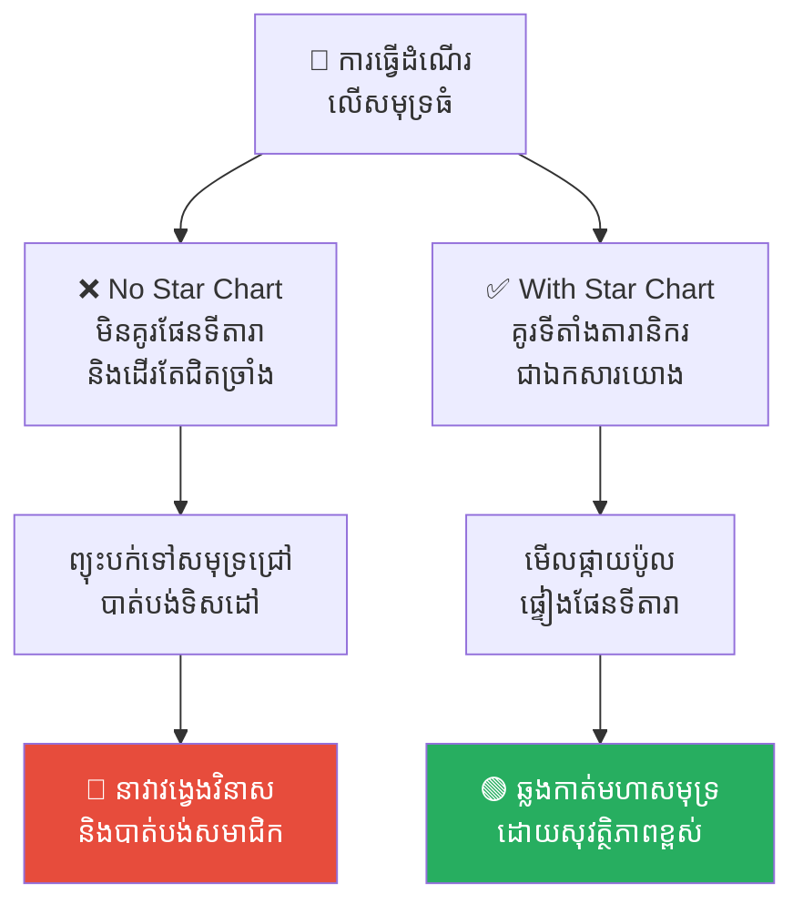
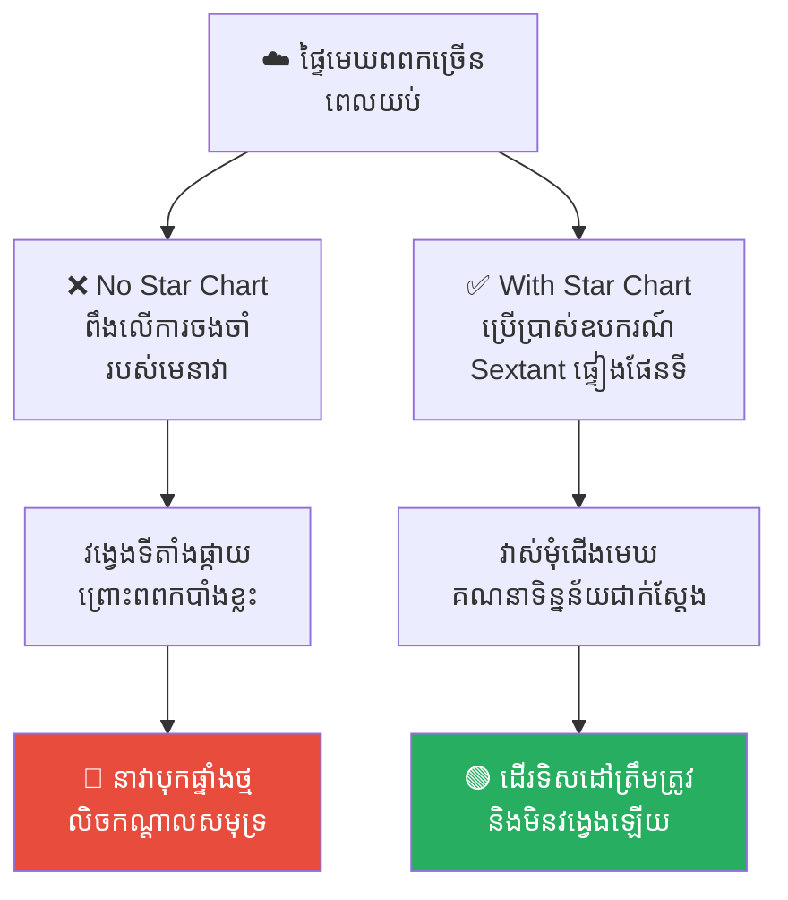
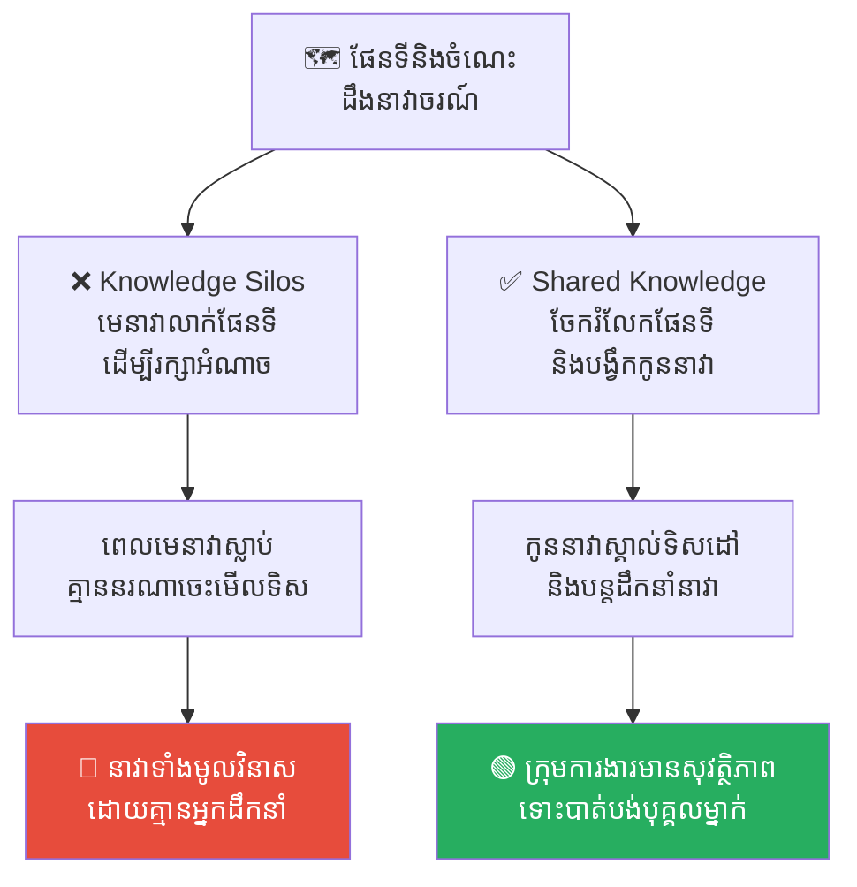
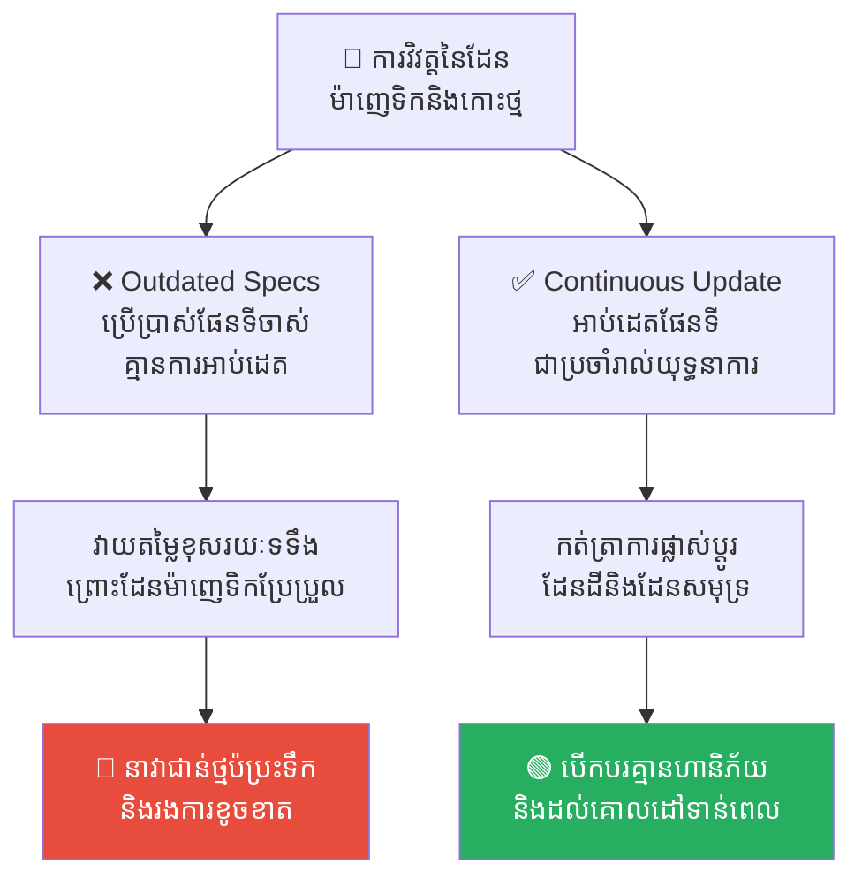
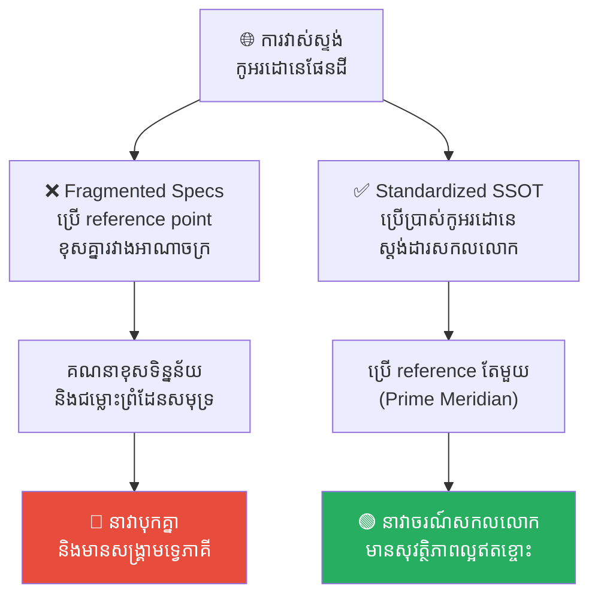

# The Evolution of Star Charts: From Ancient Navigation to Modern Data (ប្រវត្តិសាស្ត្រនៃផែនទីតារា៖ ពីការបើកសមុទ្របុរាណ ដល់ទិន្នន័យទំនើប)

**Author:** ichamrong  
**Date:** 2026-05-17  
**Tags:** #history #star-charts #navigation #data-visualization #single-source-of-truth  
**Category:** Concepts  
**Read Time:** ~15 min  

---

## 📌 មាតិកា (Table of Contents)
- [អន្ទាក់ផ្លូវចិត្ត (The Trap)](#អន្ទាក់ផ្លូវចិត្ត-the-trap)
- [១. បញ្ហា៖ ភាពស្មុគស្មាញនៃលំហ និងសេចក្តីត្រូវការរបស់មនុស្សជាតិ (The Issue: The Complexity of the Cosmos and Human Limitation)](#១-បញ្ហា-ភាពស្មុគស្មាញនៃលំហ-និងសេចក្តីត្រូវការរបស់មនុស្សជាតិ-the-issue-the-complexity-of-the-cosmos-and-human-limitation)
- [២. ឧទាហរណ៍ជាក់ស្តែងក្នុងប្រវត្តិសាស្ត្រនាវាចរណ៍ (Historical Navigation Examples)](#២-ឧទាហរណ៍ជាក់ស្តែងក្នុងប្រវត្តិសាស្ត្រនាវាចរណ៍)
  - [ឧទាហរណ៍ទី ១ — កម្រិតស្រាល៖ របាំងនៃការបើកបរឱបក្រសោបតាមឆ្នេរ (The Terrors of Coastal-Hugging Navigation)](#ឧទាហរណ៍ទី-១-កម្រិតស្រាល-របាំងនៃការបើកបរឱបក្រសោបតាមឆ្នេរ-the-terrors-of-coastal-hugging-navigation)
  - [ឧទាហរណ៍ទី ២ — កម្រិតមធ្យម៖ ភាពងងឹតនៃផ្ទៃមេឃពោរពេញដោយពពក (The Blindness of Cloud-Shrouded Nights)](#ឧទាហរណ៍ទី-២-កម្រិតមធ្យម-ភាពងងឹតនៃផ្ទៃមេឃពោរពេញដោយពពក-the-blindness-of-cloud-shrouded-nights)
  - [ឧទាហរណ៍ទី ៣ — កម្រិតមធ្យម៖ ការលាក់ទុកប្លង់មេឃដើម្បីអំណាចផ្ទាល់ខ្លួន (The Secret Star Chart & The Captain's Demise)](#ឧទាហរណ៍ទី-៣-កម្រិតមធ្យម-ការលាក់ទុកប្លង់មេឃដើម្បីអំណាចផ្ទាល់ខ្លួន-the-secret-star-chart-the-captains-demise)
  - [ឧទាហរណ៍ទី ៤ — កម្រិតធ្ងន់៖ ការប្រើប្រាស់គំនូរតារាហួសសម័យ (The Disaster of Century-Old Outdated Charts)](#ឧទាហរណ៍ទី-៤-កម្រិតធ្ងន់-ការប្រើប្រាស់គំនូរតារាហួសសម័យ-the-disaster-of-century-old-outdated-charts)
  - [ឧទាហរណ៍ទី ៥ — កម្រិតធ្ងន់៖ ជម្លោះនៃកូអរដោនេនិងការវាស់ស្ទង់ (The Territorial Conflict of Mismatched Coordinates)](#ឧទាហរណ៍ទី-៥-កម្រិតធ្ងន់-ជម្លោះនៃកូអរដោនេនិងការវាស់ស្ទង់-the-territorial-conflict-of-mismatched-coordinates)
- [៣. កត្តាជម្រុញ៖ ដែនកំណត់នៃការចងចាំ និងការចង់គ្រប់គ្រងផ្តាច់មុខ (The Aggravator: Fragile Memory and Exclusive Control)](#៣-កត្តាជម្រុញ-ដែនកំណត់នៃការចងចាំ-និងការចង់គ្រប់គ្រងផ្តាច់មុខ-the-aggravator-fragile-memory-and-exclusive-control)
- [៤. ដំណោះស្រាយទូទៅ (The General Solution)](#៤-ដំណោះស្រាយទូទៅ-the-general-solution)
  - [ការបង្កើតប្រភពព័ត៌មានតែមួយនៃដែនមេឃ (Celestial Single Source of Truth)](#ការបង្កើតប្រភពព័ត៌មានតែមួយនៃដែនមេឃ-celestial-single-source-of-truth)
  - [ការប្រើប្រាស់ឧបករណ៍វាស់ស្ទង់ជាស្តង់ដារ (Standardizing Navigation Tools)](#ការប្រើប្រាស់ឧបករណ៍វាស់ស្ទង់ជាស្តង់ដារ-standardizing-navigation-tools)
  - [ការបណ្តុះបណ្តាល និងផ្ទេរចំណេះដឹងជាប្រព័ន្ធ (Scalable Knowledge Sharing)](#ការបណ្តុះបណ្តាល-និងផ្ទេរចំណេះដឹងជាប្រព័ន្ធ-scalable-knowledge-sharing)
- [សេចក្តីសន្និដ្ឋាន (Conclusion)](#សេចក្តីសន្និដ្ឋាន-conclusion)
- [Related Posts](#related-posts)

---

## អន្ទាក់ផ្លូវចិត្ត (The Trap)

ស្រមៃថាអ្នកជាកាពីតែននាវាម្នាក់នៅក្នុងសតវត្សទី១៦ កំពុងដឹកនាំសមាជិក ៥០ នាក់ឆ្លងកាត់មហាសមុទ្រអាត្លង់ទិកដ៏ធំល្វឹងល្វើយ។ យប់នេះ ផ្ទៃសមុទ្រមានរលកខ្លាំង ហើយអ័ព្ទក្រាស់បានចាប់ផ្តើមគ្របដណ្តប់ជុំវិញ។

អ្នកមិនមានប្រព័ន្ធ GPS ដូចសម័យបច្ចុប្បន្នទេ, គ្មានត្រីវិស័យម៉ាញេទិកដែលអាចទុកចិត្តបាន ១០០% (ព្រោះវាប្រែប្រួលតាមដែនម៉ាញេទិកផែនដី), ហើយសម្លឹងទៅជុំវិញមានតែទឹកសមុទ្រខ្មៅងងឹត។ អ្វីដែលអ្នកមានគឺ **«ផ្ទៃមេឃពេលយប់»** និងចំណេះដឹងដែលចងចាំក្នុងខួរក្បាលរបស់អ្នក។

អ្នកព្យាយាមបើកបរដោយផ្អែកលើការស្មាន និងពឹងលើការចងចាំរឿងតារានិករ។ ស្រាប់តែមានព្យុះបោកបក់មក បង្វិលកប៉ាល់របស់អ្នកចេញពីគន្លងចាស់។ នៅពេលព្យុះស្ងប់ អ្នកសម្លឹងទៅមេឃ ក៏វង្វេងទីតាំងផ្កាយប៉ូល (Polaris) ព្រោះតែអ័ព្ទបាំងខ្លះ។ អ្នកបញ្ជាឱ្យកប៉ាល់បត់ទៅទិសខាងកើតដោយជឿថាជាផ្លូវត្រលប់ទៅផ្ទះ ប៉ុន្តែការពិតវាគឺជាទិសដៅឆ្ពោះទៅកាន់ថ្មប៉ប្រះទឹកដ៏មុតស្រួច។ កប៉ាល់ទាំងមូលត្រូវបុកកម្ទេច លិចកណ្តាលមហាសមុទ្រ សមាជិកទាំងអស់ត្រូវស្លាប់យ៉ាងអាណោចអាធ័ម។

នេះគឺជាលទ្ធផលនៃការធ្វើនាវាចរណ៍ដោយគ្មាន **Single Source of Truth (SSOT - ផែនទីតារាផ្លូវការ)**។

---

## ១. បញ្ហា៖ ភាពស្មុគស្មាញនៃលំហ និងសេចក្តីត្រូវការរបស់មនុស្សជាតិ (The Issue: The Complexity of the Cosmos and Human Limitation)

ផ្ទៃមេឃពេលយប់មានតារារាប់លានដួង ដែលផ្លាស់ប្តូរទីតាំង និងចលនាយ៉ាងស្មុគស្មាញទៅតាមរដូវកាលនីមួយៗ។ សម្រាប់មនុស្សជាតិសម័យបុរាណ ផ្ទៃមេឃគឺជា «ប្រព័ន្ធទិន្នន័យដ៏ធំមហិមា (Big Data)» ដំបូងគេដែលពួកគេត្រូវតែរៀនវិភាគ និងគ្រប់គ្រង។

ប្រសិនបើគ្មានការចងក្រង **ផែនទីតារា (Star Chart / Star Map)** ឱ្យទៅជាទិន្នន័យប្លង់រាបស្មើ និងជាឯកសារយោងផ្លូវការរួមគ្នាទេ៖
1. **Memory is Fragile៖** ខួរក្បាលមនុស្សមិនអាចចងចាំទីតាំងផ្កាយរាប់ពាន់ដួងបានត្រឹមត្រូវ ១០០% គ្រប់រដូវកាលឡើយ។ ការពឹងផ្អែកលើការចងចាំផ្ទាល់ខ្លួន ងាយនឹងបង្កកំហុសវង្វេងទិស។
2. **Knowledge Silos៖** ប្រសិនបើមេនាវាចងចាំទិសដៅផ្កាយតែម្នាក់ឯង ពេលគាត់ស្លាប់ ឬឈឺ នាវាទាំងមូលនឹងត្រូវវិនាសភ្លាមៗ។ ចំណេះដឹងមិនអាចពង្រីក (Scale) បានឡើយ។
3. **Misalignment៖** គ្មានឯកសាររួម ធ្វើឱ្យសមាជិកក្រុម និងមេនាវាជជែកប្រកែកគ្នាពីទិសដៅ បង្កើតជាជម្លោះ និងការបែកបាក់ទំនាក់ទំនងកណ្តាលមហាសមុទ្រ។

---

## ២. ឧទាហរណ៍ជាក់ស្តែងក្នុងប្រវត្តិសាស្ត្រនាវាចរណ៍

សូមពិនិត្យមើល **ឧទាហរណ៍ជាក់ស្តែងចំនួន ៥** បង្ហាញពីរបៀបដែលផែនទីតារា (Star Chart) ដើរតួជា SSOT ជួយសង្គ្រោះជីវិតមនុស្សជាតិ៖

---

### ឧទាហរណ៍ទី ១ — កម្រិតស្រាល៖ របាំងនៃការបើកបរឱបក្រសោបតាមឆ្នេរ (The Terrors of Coastal-Hugging Navigation)

**ស្ថានភាព៖** យុគសម័យដំបូងបង្អស់នៃនាវាចរណ៍ក្រិក និងរ៉ូមបុរាណ។

* **សកម្មភាព Low EQ (កំហុសឆ្គង)៖** អ្នកដើរសមុទ្របដិសេធមិនព្រមគូរផែនទីតារា ឬសិក្សាពីតារានិករឡើយ។ ពួកគេបើកបរកប៉ាល់ដោយ «ឱបក្រសោបតាមតែឆ្នេរ (Coastal-Hugging)» ព្រោះខ្លាចវង្វេងផ្លូវ។ ថ្ងៃមួយ ព្យុះសមុទ្រដ៏ធំមួយបានបោកបក់រុញនាវាពួកគេចេញទៅកាន់សមុទ្រជ្រៅ (Deep Ocean)។ ដោយគ្មានផែនទីមេឃជាទីពឹង ពួកគេភ័យស្លន់ស្លោ វង្វេងទិសដៅ និងស្លាប់ដោយសារខ្វះទឹកផឹកកណ្តាលសមុទ្រ។
* **សកម្មភាព High EQ (ដំណោះស្រាយ)៖** គូរកំណត់ត្រា និងប្លង់តារានិករនៅលើផ្ទាំងដីឥដ្ឋ (Clay Tablets) ដូចជនជាតិបាប៊ីឡូន ដើម្បីវាស់ស្ទង់ទិសដៅ និងផ្កាយប៉ូល។ ប្រើប្រាស់មេឃធ្វើជាត្រីវិស័យសកល ដែលអនុញ្ញាតឱ្យនាវាចាកចេញពីឆ្នេរ និងរុករកសមុទ្រជ្រៅដោយភាពជឿជាក់។
* **លទ្ធផល៖** ការរំលងផែនទីតារាឃុំឃាំងមនុស្សឱ្យនៅតែជិតឆ្នេរ និងប្រឈមគ្រោះថ្នាក់ពេលជួបព្យុះ។ ការមានផែនទីតារាជួយឱ្យពួកគេអាចធ្វើដំណើរឆ្លងកាត់សមុទ្រធំៗបានយ៉ាងសុវត្ថិភាព និងពង្រីកដែនដីពាណិជ្ជកម្ម។

---

### ឧទាហរណ៍ទី ២ — កម្រិតមធ្យម៖ ភាពងងឹតនៃផ្ទៃមេឃពោរពេញដោយពពក (The Blindness of Cloud-Shrouded Nights)

**ស្ថានភាព៖** នាវាចរណ៍ឆ្លងកាត់មហាសមុទ្រឥណ្ឌា ក្នុងរដូវមូសុង ដែលពោរពេញដោយពពក និងអ័ព្ទក្រាស់។

* **សកម្មភាព Low EQ (កំហុសឆ្គង)៖** មេនាវាពឹងផ្អែកតែលើ «ការចងចាំរាងរចនាតារានិករ» ក្នុងខួរក្បាលរបស់ខ្លួន។ នៅពេលផ្ទៃមេឃចាប់ផ្តើមមានពពកបាំងខ្លះៗ ធ្វើឱ្យរូបរាងផ្កាយប្រែប្រួល មេនាវាយល់ច្រឡំទីតាំងផ្កាយប៉ូល នាំឱ្យបញ្ជាឱ្យកប៉ាល់បត់ខុសទិសដៅ និងបុកនឹងថ្មប៉ប្រះទឹកលិចនាវាទាំងស្រុង។
* **សកម្មភាព High EQ (ដំណោះស្រាយ)៖** ប្រើប្រាស់ឧបករណ៍ **Sextant / Astrolabe** ដើម្បីវាស់ស្ទង់មុំកម្ពស់ផ្កាយធៀបនឹងជើងមេឃ រួចយកមកផ្ទៀងផ្ទាត់ជាមួយទិន្នន័យលេខគណិតវិទ្យានៅលើ **ផែនទីតារាក្រដាស (Physical Star Chart)** ផ្លូវការ ដើម្បីកំណត់ទីតាំងពិតប្រាកដ ទោះបីជាមានពពកបាំងខ្លះក៏ដោយ។
* **លទ្ធផល៖** ការពឹងលើការចងចាំភ្នែកទទេធ្វើឱ្យវង្វេងទីតាំងពេលមេឃប្រែប្រួល។ ការប្រើប្រាស់ឧបករណ៍និងផែនទីតារាជា SSOT ធានាការគណនាកូអរដោនេច្បាស់លាស់ និងរក្សាសុវត្ថិភាពនាវា។

---

### ឧទាហរណ៍ទី ៣ — កម្រិតមធ្យម៖ ការលាក់ទុកប្លង់មេឃដើម្បីអំណាចផ្ទាល់ខ្លួន (The Secret Star Chart & The Captain's Demise)

**ស្ថានភាព៖** យុគសម័យមាសនៃការរុករកសមុទ្រ (The Golden Age of Exploration)។

* **សកម្មភាព Low EQ (កំហុសឆ្គង)៖** កាពីតែននាវាលាក់ទុកផែនទីតារា និងបច្ចេកទេសគណនាកូអរដោនេជា «សម្ងាត់ផ្ទាល់ខ្លួន» មិនព្រមបង្រៀន ឬបង្ហាញដល់កូននាវាដទៃឡើយ (Knowledge Silos) ដើម្បីកុំឱ្យគេដកហូតតំណែងខ្លួនបាន។ ថ្ងៃមួយ កាពីតែនបានកើតជំងឺអាសន្នរោគស្លាប់ភ្លាមៗ។ គ្មានកូននាវាណាម្នាក់ចេះគណនាទិសដៅ ធ្វើឱ្យនាវាវង្វេងផ្លូវ និងវិនាសកណ្តាលមហាសមុទ្រប៉ាស៊ីហ្វិក។
* **សកម្មភាព High EQ (ដំណោះស្រាយ)៖** ចាត់ទុកផែនទីតារាជាទ្រព្យសម្បត្តិរួមរបស់នាវា។ បង្កើតថ្នាក់រៀននាវាចរណ៍ប្រចាំថ្ងៃលើកប៉ាល់ បង្រៀនកូននាវា និងសមាជិកជំនួយការឱ្យចេះវាស់ស្ទង់ Sextant និងអានផែនទីតារាបានស្ទាត់ជំនាញដូចគ្នា។
* **លទ្ធផល៖** ការលាក់ទុកចំណេះដឹងដើម្បីអំណាចផ្ទាល់ខ្លួន បង្កមហន្តរាយដល់ក្រុមការងារទាំងមូលពេលបាត់បង់បុគ្គលម្នាក់។ ការចែករំលែក និងកត់ត្រាផែនទីតារាជួយឱ្យក្រុមការងារមានសុវត្ថិភាព និងរក្សាស្ថិរភាពការធ្វើដំណើរជានិច្ច។

---

### ឧទាហរណ៍ទី ៤ — កម្រិតធ្ងន់៖ ការប្រើប្រាស់គំនូរតារាហួសសម័យ (The Disaster of Century-Old Outdated Charts)

**ស្ថានភាព៖** ក្រុមនាវាជំនួញអឺរ៉ុប ធ្វើដំណើរទៅកាន់តំបន់កោះស៊ូម៉ាត្រា ប្រទេសឥណ្ឌូនេស៊ី។

* **សកម្មភាព Low EQ (កំហុសឆ្គង)៖** មេនាវាប្រើប្រាស់ «ផែនទីតារាចាស់ហួសសម័យកាលពី ១០០ ឆ្នាំមុន» ដែលមិនទាន់ត្រូវបានអាប់ដេតពីការផ្លាស់ប្តូរដែនម៉ាញេទិកផែនដី (Magnetic Declination) និងការកើតឡើងនៃកោះភ្នំភ្លើងថ្មីៗ។ ការគណនាខុសរយៈទទឹង ធ្វើឱ្យនាវាជាន់លើថ្មប៉ប្រះទឹកបែកបាក់ក្បាលកប៉ាល់យ៉ាងធ្ងន់ធ្ងរ។
* **សកម្មភាព High EQ (ដំណោះស្រាយ)៖** អនុវត្តការអាប់ដេតផែនទីតារាជាប្រចាំ (Continuous Update Specs)។ រាល់ពេលនាវាចរណ៍ត្រលប់មកវិញ ត្រូវមានការចងក្រងទិន្នន័យផ្លាស់ប្តូរ និងបោះពុម្ពផ្សាយផែនទីតារាកំណែទម្រង់ថ្មីបំផុត (Latest Revision) ជូនដល់គ្រប់នាវាទាំងអស់ក្នុងអាណាចក្រ។
* **លទ្ធផល៖** ការប្រើប្រាស់ឯកសារ specs ចាស់ហួសសម័យនាំទៅរកការបំផ្លិចបំផ្លាញនាវា។ ការអាប់ដេតផែនទីជាប្រចាំ ធានាការបើកបរប្រកបដោយស្ថិរភាព និងគ្មានការភាន់ច្រឡំ។

---

### ឧទាហរណ៍ទី ៥ — កម្រិតធ្ងន់៖ ជម្លោះនៃកូអរដោនេនិងការវាស់ស្ទង់ (The Territorial Conflict of Mismatched Coordinates)

**ស្ថានភាព៖** យុគសម័យនៃការប្រជែងគ្នារវាងអាណាចក្រអេស្ប៉ាញ និងព័រទុយហ្គាល់ លើដែនទឹកពាណិជ្ជកម្ម។

* **សកម្មភាព Low EQ (កំហុសឆ្គង)៖** អេស្ប៉ាញប្រើប្រាស់ Reference Point ផ្អែកលើកោះ Canary ចំណែកព័រទុយហ្គាល់ប្រើ Reference Point ផ្អែកលើកោះ Cape Verde។ ការវាស់ស្ទង់ និងគូរផែនទីតារាខុសគ្នា បង្កឱ្យមានការគណនាកូអរដោនេខុសគ្នា ធ្វើឱ្យនាវានៃអាណាចក្រទាំងពីរបុកគ្នា និងកើតមានសង្គ្រាមជម្លោះព្រំដែនសមុទ្រជាញឹកញាប់។
* **សកម្មភាព High EQ (ដំណោះស្រាយ)៖** បង្កើតកិច្ចសន្យាវាស់ស្ទង់ជាស្តង់ដារសកល (Standardized SSOT)។ ប្រទេសទាំងពីរយល់ព្រមប្រើប្រាស់ reference point តែមួយ (ក្រោយមកគឺប្រព័ន្ធ Prime Meridian និង Greenwich Mean Time) ដើម្បីឱ្យរាល់ផែនទីតារា និងផែនទីផែនដីទាំងអស់នៅលើពិភពលោកវាស់វែងតាមស្តង់ដារតែមួយ។
* **លទ្ធផល៖** គូសផែនទីខុសស្តង់ដារគ្នាបង្កជាជម្លោះ និងគ្រោះថ្នាក់សមុទ្រធ្ងន់ធ្ងរ។ ស្តង់ដាររួមសកល ជួយឱ្យនាវាចរណ៍ពិភពលោកដំណើរការដោយគ្មានឧបសគ្គ និងមានសន្តិភាព។

---

## ៣. កត្តាជម្រុញ៖ ដែនកំណត់នៃការចងចាំ និងការចង់គ្រប់គ្រងផ្តាច់មុខ (The Aggravator: Fragile Memory and Exclusive Control)

ហេតុអ្វីបានជាមនុស្សជាតិជំនាន់មុន ជួបការលំបាកក្នុងការបង្កើត និងប្រើប្រាស់ផែនទីតារា?

1. **ដែនកំណត់នៃការចងចាំ (Fragile Human Memory)៖** ខួរក្បាលមនុស្សមិនអាចចងចាំ ឬរៀបចំទិន្នន័យដ៏ធំធេងនៃមេឃរាប់ពាន់ដួងបានច្បាស់លាស់ឡើយ។ យើងតែងតែគិតថាខ្លួនឯង «ចាំបាន» រហូតដល់ជួបគ្រោះអាសន្នទើបដឹងថាខួរក្បាលធ្លាក់ចូលក្នុងលម្អៀង។
2. **ការចង់រក្សាឥទ្ធិពល និងគ្រប់គ្រង (Information Hoarding for Power)៖** នៅក្នុងសង្គមបុរាណ ហោរាសាស្ត្រ និងការបើកសមុទ្រ គឺជាចំណេះដឹងវិទ្យាសាស្ត្រកម្រិតខ្ពស់។ បុគ្គលមួយចំនួនព្យាយាមលាក់បាំង មិនព្រមគូរជាប្លង់ ឬសរសេរទុក ដើម្បីរក្សាឋានៈ « indispensable (ខ្វះមិនបាន) » របស់ខ្លួននៅក្នុងរាជវាំង ឬលើនាវា។

---

## ៤. ដំណោះស្រាយទូទៅ (The General Solution)

ដើម្បីបញ្ចៀសការវង្វេងទិសដៅ និងធានាសុវត្ថិភាព មនុស្សជាតិបានបង្កើតយន្តការច្បាស់លាស់៖

### ការបង្កើតប្រភពព័ត៌មានតែមួយនៃដែនមេឃ (Celestial Single Source of Truth)
ការចងក្រង និងបោះពុម្ពផ្សាយផែនទីតារាផ្លូវការ (ដូចជា ផែនទីតារាដុនហ័ងរបស់ចិន ឬ Atlas Coelestis របស់អង់គ្លេស)។ រាល់កប៉ាល់ទាំងអស់ត្រូវមានកាតព្វកិច្ចផ្ទុកឯកសារនេះជាប់ខ្លួន និងចាត់ទុកវាជាអាជ្ញាកណ្តាលចុងក្រោយក្នុងការសម្រេចចិត្តរកទិសដៅ។

### ការប្រើប្រាស់ឧបករណ៍វាស់ស្ទង់ជាស្តង់ដារ (Standardizing Navigation Tools)
ការប្រើប្រាស់ឧបករណ៍វាស់មុំដូចជា Sextant, Octant, និង ត្រីវិស័យម៉ាញេទិក ដែលមានការវាស់វែងច្បាស់លាស់តាមស្តង់ដារគណិតវិទ្យា។ បញ្ឈប់ការសម្លឹងមើលភ្នែកទទេ ឬការវាស់វែងតាមអារម្មណ៍សន្មត់ផ្ទាល់ខ្លួន។

### ការបណ្តុះបណ្តាល និងផ្ទេរចំណេះដឹងជាប្រព័ន្ធ (Scalable Knowledge Sharing)
ការបង្កើតសាលានាវាចរណ៍ផ្លូវការ (Navigation Academy) ដើម្បីបង្ហាត់បង្រៀនយុវជនជំនាន់ក្រោយ។ ការប្រែក្លាយ «មន្តអាគមឯកជន» របស់កាពីតែន ឱ្យទៅជា «វិទ្យាសាស្ត្រសាធារណៈ» ដែលនរណាក៏អាចរៀនសូត្រ និងសង្គ្រោះនាវាបាននៅពេលជួបគ្រោះអាសន្ន។

---

## សេចក្តីសន្និដ្ឋាន (Conclusion)

ផែនទីតារា (Star Chart) មិនមែនគ្រាន់តែជាផ្ទាំងគំនូរដ៏ស្រស់ស្អាតនៃដែនមេឃនោះឡើយ ប៉ុន្តែវាគឺជា **បដិវត្តន៍នៃការគ្រប់គ្រងព័ត៌មានដំបូងគេបង្អស់របស់មនុស្សជាតិ**។ វាគឺជាភស្តុតាងដែលបង្ហាញថា ជោគជ័យនៃការឆ្លងកាត់ការលំបាក មិនមែនពឹងលើ «វីរបុរសម្នាក់» នោះឡើយ ប៉ុន្តែវាកើតចេញពី **ការចងក្រងឯកសារយោងរួមដ៏ច្បាស់លាស់ និងមានតម្លាភាព (Single Source of Truth)**។

---

## Related Posts

* **[13-single-source-of-truth-and-knowledge-silos.md](./13-single-source-of-truth-and-knowledge-silos.md)** — មូលហេតុដែលក្រុមការងារបច្ចេកវិទ្យា IT ត្រូវការឯកសាររួមជាកាតព្វកិច្ច។
* **[The Master Navigator and the Hidden Star Chart (មេនាវា និងផែនទីតារាដែលលាក់កំបាំង)](../parables/23-the-master-navigator-and-the-hidden-star-chart.md)** — រឿងប្រៀបធៀបដ៏រំភើប អំពីមេនាវាដែលលាក់ផែនទីតារាក្នុងខួរក្បាលរបស់ខ្លួន។
* **[15-the-history-of-the-first-computer-eniac.md](./15-the-history-of-the-first-computer-eniac.md)** — ប្រវត្តិសាស្ត្រនៃការបំប្លែងខ្សែភ្លើងរូបវន្ត ឱ្យទៅជាទិន្នន័យអរូបីក្នុងអង្គចងចាំ។

---

*Last updated: 2026-05-26*
