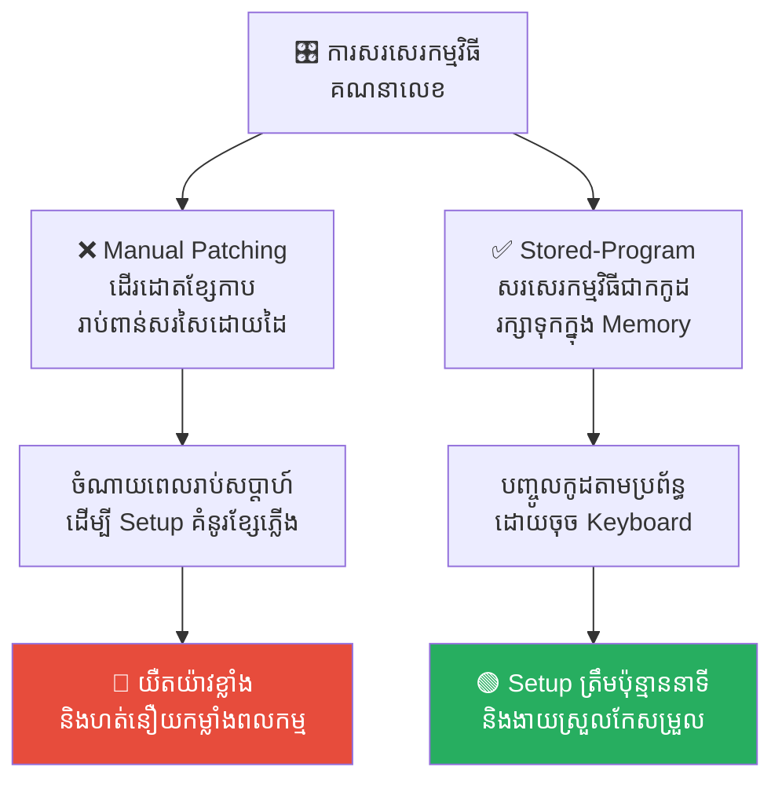
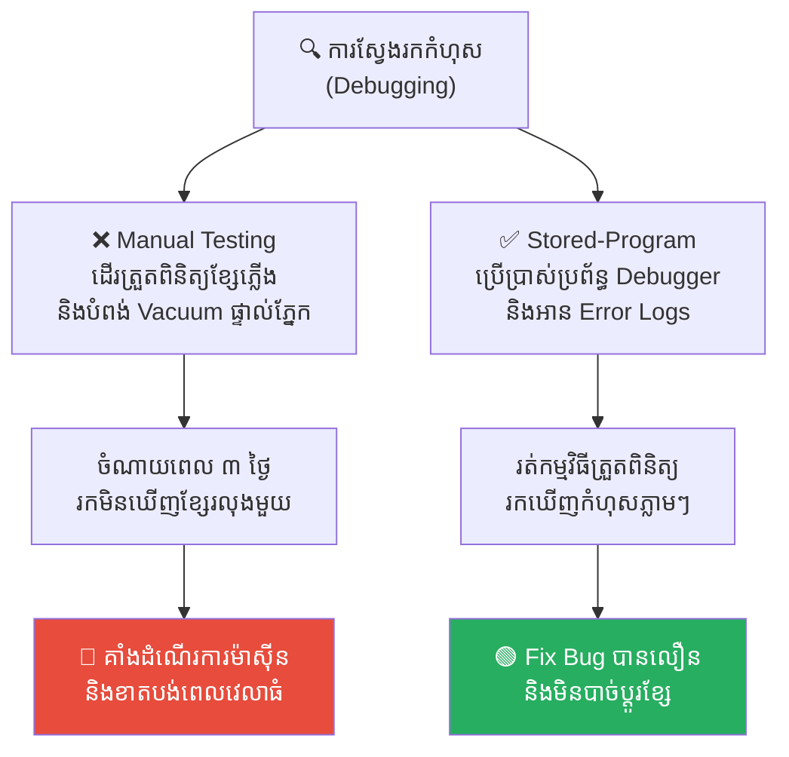
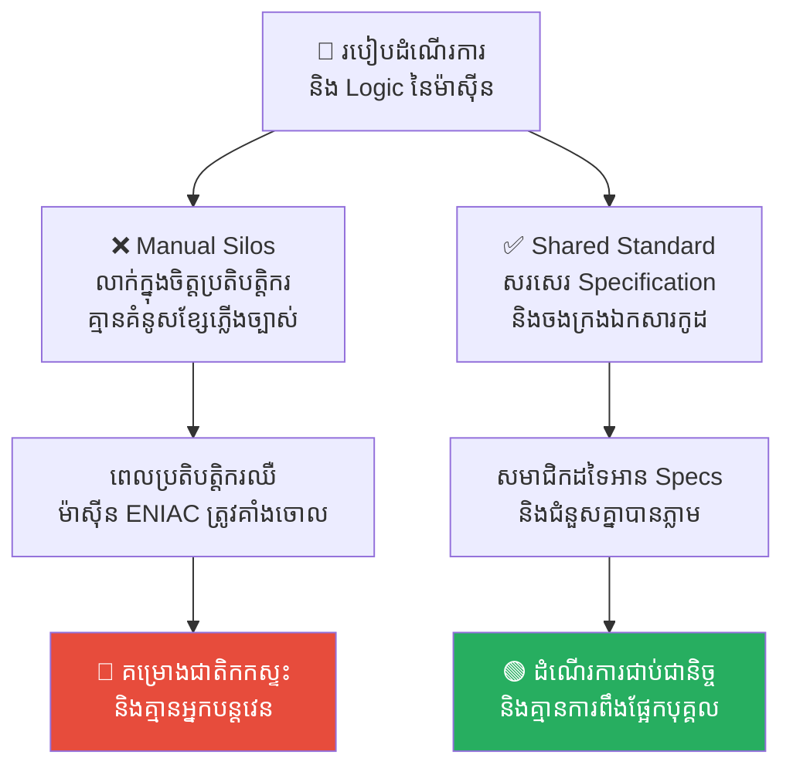
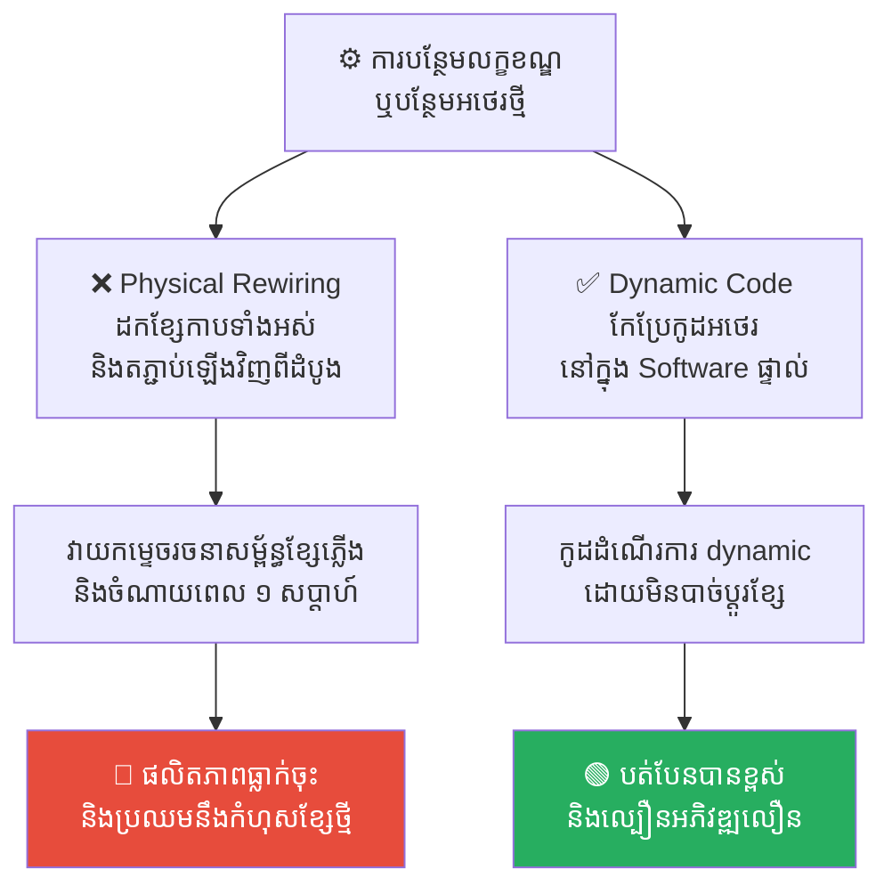
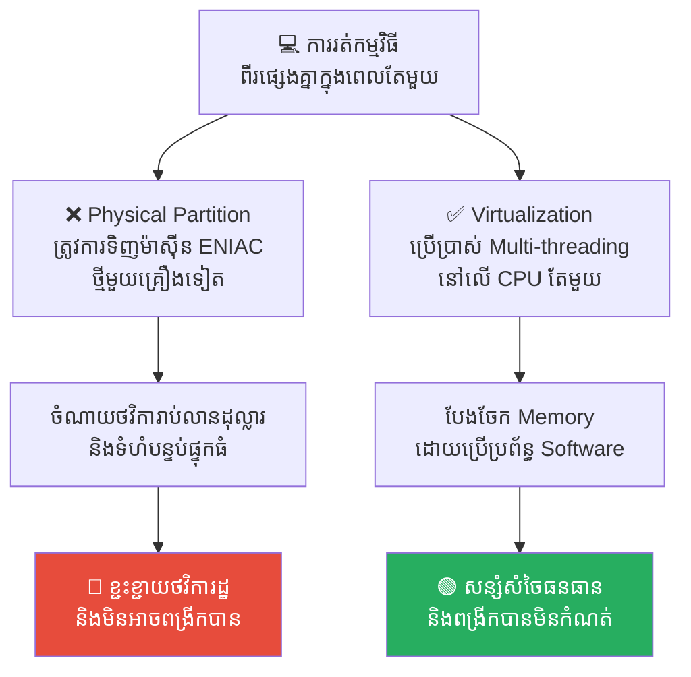

# The History of the First Computer: From Pulling Wires to Writing Code (ប្រវត្តិសាស្ត្រនៃកុំព្យូទ័រដំបូង៖ ពីការដោតខ្សែកាប ដល់ការសរសេរកូដ)

**Author:** ichamrong  
**Date:** 2026-05-17  
**Tags:** #history #eniac #programming #women-in-tech #hardware-vs-software  
**Category:** Concepts  
**Read Time:** ~15 min  

---

## 📌 មាតិកា (Table of Contents)
- [អន្ទាក់ផ្លូវចិត្ត (The Trap)](#អន្ទាក់ផ្លូវចិត្ត-the-trap)
- [១. បញ្ហា៖ យុគសម័យដែលកូដ និងគ្រឿងម៉ាស៊ីននៅមិនទាន់ដាច់ចេញពីគ្នា (The Issue: Hardware-Bound Programming)](#១-បញ្ហា-យុគសម័យដែលកូដ-និងគ្រឿងម៉ាស៊ីននៅមិនទាន់ដាច់ចេញពីគ្នា-the-issue-hardware-bound-programming)
- [២. ឧទាហរណ៍ជាក់ស្តែងក្នុងយុគសម័យ ENIAC (Historical Computing Examples)](#២-ឧទាហរណ៍ជាក់ស្តែងក្នុងយុគសម័យ-eniac)
  - [ឧទាហរណ៍ទី ១ — កម្រិតស្រាល៖ ការសរសេរកម្មវិធីដោយកម្លាំងពលកម្ម (Programming Through Physical Patching)](#ឧទាហរណ៍ទី-១-កម្រិតស្រាល-ការសរសេរកម្មវិធីដោយកម្លាំងពលកម្ម-programming-through-physical-patching)
  - [ឧទាហរណ៍ទី ២ — កម្រិតមធ្យម៖ ដំណើរការស្វែងរកកំហុសដ៏សែនហត់នឿយ (The Physical Debugging Nightmare)](#ឧទាហរណ៍ទី-២-កម្រិតមធ្យម-ដំណើរការស្វែងរកកំហុសដ៏សែនហត់នឿយ-the-physical-debugging-nightmare)
  - [ឧទាហរណ៍ទី ៣ — កម្រិតមធ្យម៖ ភាពអាស្រ័យលើប្រតិបត្តិករខ្សែភ្លើង (The Indispensable Wiring Hero Dependency)](#ឧទាហរណ៍ទី-៣-កម្រិតមធ្យម-ភាពអាស្រ័យលើប្រតិបត្តិករខ្សែភ្លើង-the-indispensable-wiring-hero-dependency)
  - [ឧទាហរណ៍ទី ៤ — កម្រិតធ្ងន់៖ ការបន្ថែមលក្ខខណ្ឌការងារ និងការពង្រីក Logic (The Nightmare of Scaling & Logical Modifications)](#ឧទាហរណ៍ទី-៤-កម្រិតធ្ងន់-ការបន្ថែមលក្ខខណ្ឌការងារ-និងការពង្រីក-logic-the-nightmare-of-scaling-logical-modifications)
  - [ឧទាហរណ៍ទី ៥ — កម្រិតធ្ងន់៖ ជម្លោះនៃការបែងចែកធនធានសម្រាប់គណនា (The Resource Conflict of Concurrent Executions)](#ឧទាហរណ៍ទី-៥-កម្រិតធ្ងន់-ជម្លោះនៃការបែងចែកធនធានសម្រាប់គណនា-the-resource-conflict-of-concurrent-executions)
- [៣. កត្តាជម្រុញ៖ ភាពទន់ខ្សោយនៃគ្រឿងម៉ាស៊ីន និងការមើលស្រាលលើទិន្នន័យអរូបី (The Aggravator: Fragile Hardware & Underestimating Abstract Software)](#៣-កត្តាជម្រុញ-ភាពទន់ខ្សោយនៃគ្រឿងម៉ាស៊ីន-និងការមើលស្រាលលើទិន្នន័យអរូបី-the-aggravator-fragile-hardware-underestimating-abstract-software)
- [៤. ដំណោះស្រាយទូទៅ (The General Solution)](#៤-ដំណោះស្រាយទូទៅ-the-general-solution)
  - [ស្ថាបត្យកម្ម វ៉ុន នូមាន និងការរក្សាទុកកម្មវិធីក្នុង Memory (The Von Neumann Architecture & Stored-Program Concept)](#ស្ថាបត្យកម្ម-វ៉ុន-នូមាន-និងការរក្សាទុកកម្មវិធីក្នុង-memory-the-von-neumann-architecture-stored-program-concept)
  - [ការបំបែកកូដចេញពីគ្រឿងម៉ាស៊ីន (Decoupling Software from Hardware)](#ការបំបែកកូដចេញពីគ្រឿងម៉ាស៊ីន-decoupling-software-from-hardware)
  - [ពីការចុច Config ដោយផ្ទាល់ដៃ មកកាន់ការសរសេរកូដបញ្ជា (From ClickOps to Infrastructure as Code)](#ពីការចុច-config-ដោយផ្ទាល់ដៃ-មកកាន់ការសរសេរកូដបញ្ជា-from-clickops-to-infrastructure-as-code)
- [សេចក្តីសន្និដ្ឋាន (Conclusion)](#សេចក្តីសន្និដ្ឋាន-conclusion)
- [Related Posts](#related-posts)

---

## អន្ទាក់ផ្លូវចិត្ត (The Trap)

ស្រមៃថាអ្នកជាអ្នកវិទ្យាសាស្ត្រគណិតវិទ្យាម្នាក់ ក្នុងឆ្នាំ ១៩៤៥ ត្រូវបានកងទ័ពសហរដ្ឋអាមេរិកប្រគល់ភារកិច្ចឱ្យធ្វើការគណនាគន្លងគ្រាប់កាំភ្លើងធំឱ្យបានលឿនបំផុត ដើម្បីជួយសង្គ្រោះជីវិតទាហាននៅសមរភូមិ។

អ្នកដើរចូលទៅក្នុងបន្ទប់ដ៏ធំមហិមាមួយ ដែលពោរពេញទៅដោយ «បិសាចមហាយក្ស ENIAC» ទម្ងន់ ៣០ តោន។ អ្នកមិនមានកុំព្យូទ័រយួរដៃសម្រាប់សរសេរកូដទេ, គ្មាន Keyboard សម្រាប់វាយអក្សរ, ហើយក៏គ្មានអេក្រង់សម្រាប់បង្ហាញលទ្ធផលឡើយ។ អ្វីដែលអ្នកមានគឺ ខ្សែកាបរាប់ម៉ឺនសរសៃ កុងតាក់រាប់ពាន់គ្រាប់ និងបន្ទះរន្ធដោត (Panels) ដែលក្តៅហួតហែងដូចចង្រ្កានបាយ។

ដើម្បីបញ្ជាឱ្យវាបូកលេខសាមញ្ញពីរ អ្នកត្រូវដើរដោតខ្សែភ្លើងរូបវន្តរាប់ម៉ោង ដកដោតខ្សែកាបចេញពីរន្ធមួយទៅរន្ធមួយទៀត រួចរត់ទៅបង្វិលកុងតាក់ Dials គ្រប់ទូ។ នៅពេលអ្នកចុចប៊ូតុង Run ស្រាប់តែម៉ាស៊ីនទាំងមូលមិនដំណើរការ ព្រោះតែមានខ្សែកាបមួយសរសៃក្នុងចំណោមរាប់ម៉ឺន បានធ្លាក់របូត ឬរលុងបន្តិច។ អ្នកត្រូវចំណាយពេល ៣ ថ្ងៃពេញ ដើរត្រួតពិនិត្យខ្សែភ្លើងម្តងមួយជួរៗទាំងបែកញើស ដោយមិនដឹងថាកំហុសនៅត្រង់ណាឡើយ។

នេះគឺជាអន្ទាក់នៃការសរសេរកម្មវិធីដែលចងភ្ជាប់នឹង **គ្រឿងម៉ាស៊ីនរូបវន្ត (Hardware-Bound Programming)**។

---

## ១. បញ្ហា៖ យុគសម័យដែលកូដ និងគ្រឿងម៉ាស៊ីននៅមិនទាន់ដាច់ចេញពីគ្នា (The Issue: Hardware-Bound Programming)

នៅក្នុងយុគសម័យដំបូងបង្អស់នៃវិទ្យាសាស្ត្រកុំព្យូទ័រ ពាក្យថា «Software» និង «Hardware» គឺមិនទាន់ត្រូវបានបំបែកចេញពីគ្នាឡើយ។ Logic នៃការគណនាត្រូវបានបង្កើតឡើងដោយការប្រើប្រាស់ «ខ្សែកាបរូបវន្ត» ដើម្បីតភ្ជាប់ចរន្តអគ្គិសនីបង្កើតជាសៀគ្វី។

ការសរសេរកម្មវិធីបែបនេះ បង្កឱ្យមានការលំបាកយ៉ាងខ្លាំង៖
1. **Manual Labor Block៖** ការ Setup កម្មវិធីនីមួយៗត្រូវចំណាយពេលរាប់សប្តាហ៍នៃការដោតខ្សែ និងបង្វិលកុងតាក់ដោយកម្លាំងពលកម្ម។ ផលិតភាពការងារមានកម្រិតទាបបំផុត។
2. **Physical Troubleshooting Nightmare៖** ពេលមានកំហុសឆ្គង (Bug) គ្មានប្រព័ន្ធ debugger ណាមកប្រាប់ឡើយ។ ពួកគេត្រូវដើរឆែកមើលខ្សែភ្លើង និងបំពង់កែវសុញ្ញកាស (Vacuum Tubes) ចំនួន ១៨,០០០ បំពង់ម្តងមួយៗដោយផ្ទាល់ភ្នែក។
3. **Ego and Knowledge Silos៖** មានតែប្រតិបត្តិករ (Operators) នារី ៦ រូប (ENIAC Girls) ប៉ុណ្ណោះដែលយល់ដឹងពីប្លង់សៀគ្វីស្មុគស្មាញនេះ។ គ្មានឯកសារ Specs រួម ធ្វើឱ្យការងារទាំងមូលពឹងផ្អែកទាំងស្រុងលើបុគ្គល។

---

## ២. ឧទាហរណ៍ជាក់ស្តែងក្នុងយុគសម័យ ENIAC

សូមពិនិត្យមើល **ឧទាហរណ៍ជាក់ស្តែងចំនួន ៥** បង្ហាញពីការតស៊ូរបស់ Software Engineers ជំនាន់ដំបូង និងបដិវត្តន៍ Stored-Program Concept៖

---

### ឧទាហរណ៍ទី ១ — កម្រិតស្រាល៖ ការសរសេរកម្មវិធីដោយកម្លាំងពលកម្ម (Programming Through Physical Patching)

**ស្ថានភាព៖** ត្រូវការ Setup គម្រោងគណនាគន្លងផ្លូវគ្រាប់កាំភ្លើងធំថ្មីមួយ។

* **សកម្មភាព Low EQ (កំហុសឆ្គង)៖** ប្រតិបត្តិករសរសេរកម្មវិធីដោយ «ដកដោតខ្សែកាបរូបវន្ត (Patch Cables)» រាប់ពាន់សរសៃ និងបង្វិលកុងតាក់កំណត់អថេរ (Dials) ផ្ទាល់ដៃលើ Panels។ ការងារប្រើកម្លាំងបែកញើសរាប់សប្តាហ៍នេះងាយនឹងបង្កកំហុសឆ្គងដោតខុសរន្ធ។
* **សកម្មភាព High EQ (ដំណោះស្រាយ)៖** បំប្លែង Instructions ឱ្យទៅជាទិន្នន័យអរូបី (Abstract Data) ហើយរក្សាទុកនៅក្នុង Memory របស់កុំព្យូទ័រ (Stored-Program Concept)។ អ្នកសរសេរកម្មវិធីគ្រាន់តែវាយកូដបញ្ជាតាមរយៈ Keyboard ឬ Punch Cards យ៉ាងងាយស្រួល។
* **លទ្ធផល៖** ការសរសេរកម្មវិធីដោយដៃផ្ទាល់ចំណាយពេលរាប់សប្តាហ៍ និងហត់នឿយខ្លាំង។ ការគោរពគោលការណ៍ Stored-Program ជួយឱ្យការ Setup ត្រឹមប៉ុន្មាននាទី និងកែសម្រួលបានលឿន។

---

### ឧទាហរណ៍ទី ២ — កម្រិតមធ្យម៖ ដំណើរការស្វែងរកកំហុសដ៏សែនហត់នឿយ (The Physical Debugging Nightmare)

**ស្ថានភាព៖** ម៉ាស៊ីនគណនា ENIAC ស្រាប់តែគាំងលែងដំណើរការ ឬផ្តល់លទ្ធផលខុសពាក់កណ្តាលទី។

* **សកម្មភាព Low EQ (កំហុសឆ្គង)៖** ប្រតិបត្តិករគ្មានប្រព័ន្ធ compiler ឬ debugger ប្រាប់កំហុសឡើយ។ ពួកគេត្រូវដើរពិនិត្យគំនរខ្សែភ្លើងរាប់ម៉ឺន និងបំពង់ Vacuum ១៨,០០០ គ្រាប់ម្តងមួយៗដោយដៃផ្ទាល់ និងប្រើឧបករណ៍វាស់ចរន្តអគ្គិសនី ធ្វើឱ្យខាតបង់ពេល ៣ ថ្ងៃពេញរកមិនឃើញកំហុសខ្សែរលុងមួយ។
* **សកម្មភាព High EQ (ដំណោះស្រាយ)៖** ប្រើប្រាស់ Software-based Debugging Tools ព្រមទាំងប្រព័ន្ធ Compiler ដែលអាចដំណើរការ scan កូដស្វែងរកកំហុស និងបាញ់ Error Logs ប្រាប់លេខបន្ទាត់កូដខុសឆ្គងភ្លាមៗ ទៅកាន់អេក្រង់ឱ្យ Developer ដឹង។
* **លទ្ធផល៖** ការស្វែងរកកំហុសលើ Hardware ផ្ទាល់ដៃប្រើពេលរាប់ថ្ងៃ និងគាំងដំណើរការម៉ាស៊ីន។ ការមាន Debugger ជួយឱ្យរកឃើញ និង Fix Bug បានលឿនក្នុងរយៈពេលប៉ុន្មានវិនាទីដោយមិនបាច់ប៉ះពាល់គ្រឿងម៉ាស៊ីនឡើយ។

---

### ឧទាហរណ៍ទី ៣ — កម្រិតមធ្យម៖ ភាពអាស្រ័យលើប្រតិបត្តិករខ្សែភ្លើង (The Indispensable Wiring Hero Dependency)

**ស្ថានភាព៖** ម៉ាស៊ីន ENIAC ត្រូវបានកងទ័ពអាមេរិកត្រូវការប្រើប្រាស់ជាបន្ទាន់សម្រាប់ដោះស្រាយសមីការសង្គ្រាមស្នូល។

* **សកម្មភាព Low EQ (កំហុសឆ្គង)៖** គ្មានការចងក្រងឯកសារ Specs នៃគំនូសសៀគ្វីច្បាស់លាស់ឡើយ (Knowledge Silos)។ ចំណេះដឹងទាំងអស់ស្ថិតនៅក្នុងខួរក្បាលប្រតិបត្តិករនារី ៦ រូបប៉ុណ្ណោះ។ នៅពេលប្រតិបត្តិករចម្បងម្នាក់មានជំងឺឈឺសម្រាកព្យាបាល ម៉ាស៊ីន ENIAC ទាំងមូលត្រូវគាំងចោល គ្មាននរណាចេះដំឡើងខ្សែភ្លើងជំនួសឡើយ។
* **សកម្មភាព High EQ (ដំណោះស្រាយ)៖** សរសេរ Specification នៃស្ថាបត្យកម្មប្រព័ន្ធរួមគ្នា និងប្រើប្រាស់កូដកម្មវិធីស្តង់ដារ (Standardized Stored-Program)។ រាល់កម្មវិធីទាំងអស់ត្រូវចងក្រងជា Text Files និងមានការ Review គ្នាទៅវិញទៅមក ធានាថានរណាក៏អាចអាន និងដំណើរការវាបានដែរ។
* **លទ្ធផល៖** ការពឹងផ្អែកលើ «វីរបុរសខ្សែភ្លើង» ធ្វើឱ្យគម្រោងជាតិងាយនឹងកកស្ទះ និងដួលរលំ។ ការកត់ត្រា Specs និងប្រើ Software ជួយឱ្យក្រុមការងារបន្តវេនគ្នាបានភ្លាមៗ និងគ្មានការពឹងផ្អែកឡើយ។

---

### ឧទាហរណ៍ទី ៤ — កម្រិតធ្ងន់៖ ការបន្ថែមលក្ខខណ្ឌការងារ និងការពង្រីក Logic (The Nightmare of Scaling & Logical Modifications)

**ស្ថានភាព៖** គម្រោងគណនាត្រូវបានអតិថិជនស្នើសុំបន្ថែមលក្ខខណ្ឌអថេរថ្មីមួយ (e.g. បន្ថែមកម្លាំងខ្យល់បោកបក់) ទៅលើសមីការចាស់។

* **សកម្មភាព Low EQ (កំហុសឆ្គង)៖** ដោយសារតែ Logic ត្រូវបានចាក់សោរលើខ្សែភ្លើង ប្រតិបត្តិករត្រូវបង្ខំចិត្ត «ដកខ្សែកាបរូបវន្តទាំងអស់» នៅលើទូ Panels រួចរៀបចំផែនការ និងដោតខ្សែភ្លើងថ្មីឡើងវិញទាំងអស់ពីដំបូង ធ្វើឱ្យខាតបង់ពេល ១ សប្តាហ៍ពេញ និងប្រឈមនឹងកំហុសសៀគ្វីថ្មីៗ។
* **សកម្មភាព High EQ (ដំណោះស្រាយ)៖** សរសេរកម្មវិធីបែបបត់បែន (Dynamic Programming)។ Developer គ្រាន់តែចូលទៅកែសម្រួលអថេរ (Variable `wind_speed`) នៅក្នុងកូដ Software និងបញ្ចូលលក្ខខណ្ឌ `if/else` ថ្មី រួចចុច Save ក្នុងរយៈពេល ១ នាទី។
* **លទ្ធផល៖** ការរៀបចំខ្សែភ្លើងឡើងវិញរាល់ពេលកែប្រែ Logic ធ្វើឱ្យផលិតភាពធ្លាក់ចុះ និងចំណាយពេលយូរ។ ការប្រើប្រាស់ Software ជួយឱ្យកូដបត់បែនបានខ្ពស់ និងអភិវឌ្ឍន៍លឿនបំផុត។

---

### ឧទាហរណ៍ទី ៥ — កម្រិតធ្ងន់៖ ជម្លោះនៃការបែងចែកធនធានសម្រាប់គណនា (The Resource Conflict of Concurrent Executions)

**ស្ថានភាព៖** កងទ័ពអាមេរិកត្រូវការរត់សមីការគណនាពីរផ្សេងគ្នា (មួយសម្រាប់កងទ័ពជើងទឹក និងមួយសម្រាប់កងទ័ពជើងគោក) ក្នុងពេលតែមួយ។

* **សកម្មភាព Low EQ (កំហុសឆ្គង)៖** ដោយសារតែ ENIAC ដំណើរការតែផ្នែក Hardware រូបវន្ត ពួកគេមិនអាចរត់កម្មវិធីពីរទន្ទឹមគ្នាបានឡើយ លុះត្រាតែ «សាងសង់ម៉ាស៊ីន ENIAC ថ្មីមួយគ្រឿងទៀត» ដែលចំណាយថវិការាប់លានដុល្លារ និងស៊ីទំហំបន្ទប់ផ្ទុកធំធេងបន្ថែម។
* **សកម្មភាព High EQ (ដំណោះស្រាយ)៖** ប្រើប្រាស់គំនិត **Memory Virtualization & Multi-threading**។ បង្កើតប្រព័ន្ធប្រតិបត្តិការ (Operating System) ដែលអាចបែងចែកអង្គចងចាំ (Virtual Memory) និងពេលវេលាដំណើរការរបស់ CPU ឱ្យទៅជា Process ច្រើន អាចដំណើរការគណនាបានរាប់សិបសមីការទន្ទឹមគ្នាលើម៉ាស៊ីនតែមួយ។
* **លទ្ធផល៖** ការពឹងផ្អែកលើផ្នែក Hardware តែម្ខាង នាំឱ្យខ្ជះខ្ជាយថវិការដ្ឋ និងមិនអាចពង្រីក (Scale) បាន។ ការមាន OS និង Software ជួយបែងចែកធនធានស្វ័យប្រវត្ត សន្សំសំចៃធនធាន និងពង្រីកសមត្ថភាពមិនកំណត់។

---

## ៣. កត្តាជម្រុញ៖ ភាពទន់ខ្សោយនៃគ្រឿងម៉ាស៊ីន និងការមើលស្រាលលើទិន្នន័យអរូបី (The Aggravator: Fragile Hardware & Underestimating Abstract Software)

ហេតុអ្វីបានជាយុគសម័យ ENIAC ត្រូវសរសេរកម្មវិធីដោយការដោតខ្សែកាបរូបវន្តជាច្រើនឆ្នាំ?

1. **ភាពទន់ខ្សោយនៃបច្ចេកវិទ្យាគ្រឿងម៉ាស៊ីន (Fragile Hardware Limitations)៖** នាយុគសម័យនោះ អង្គចងចាំ (RAM) ដែលមានល្បឿនលឿន និងទំហំធំ គឺមិនទាន់ត្រូវបានបង្កើតឡើងនៅឡើយ។ បច្ចេកវិទ្យាត្រូវបានចងសោរដោយសមត្ថភាពបំពង់ Vacuum Tubes ដែលងាយនឹងឆេះ និងខូចខាត។
2. **ការមើលស្រាលលើទិន្នន័យអរូបី (Underestimating Software)៖** វិស្វករបុរសៗជំនាន់នោះ ផ្តោតតែលើការសាងសង់គ្រឿងម៉ាស៊ីនធំៗ និងដែកថែប (Hardware) ដោយចាត់ទុកវាជា «ស្នូលពិតប្រាកដ»។ ពួកគេយល់ឃើញថា ការបញ្ជា ឬការរៀបចំ Logic (Software) គឺជាការងាររដ្ឋបាលកំប៉ិកកំប៉ុកដែលគ្មានតម្លៃ។ នេះជាការយល់ច្រឡំដ៏ធំធេងដែលពន្យារពេលកំណើតរបស់ Software Engineering អស់ជាច្រើនឆ្នាំ។

---

## ៤. ដំណោះស្រាយទូទៅ (The General Solution)

ដើម្បីដោះលែងសមត្ថភាព និងផ្លាស់ប្តូរពិភពលោកបច្ចេកវិទ្យា អ្នកវិទ្យាសាស្ត្របានអនុវត្តយុទ្ធសាស្ត្រស្នូល៖

### ស្ថាបត្យកម្ម វ៉ុន នូមាន និងការរក្សាទុកកម្មវិធីក្នុង Memory (The Von Neumann Architecture & Stored-Program Concept)
គំនិតបដិវត្តន៍របស់លោក **John von Neumann** គឺការរក្សាទុកទាំង Instructions (កូដកម្មវិធី) និង Data (ទិន្នន័យ) ឱ្យទៅជាទម្រង់អរូបី (Binary Numbers) នៅក្នុងអង្គចងចាំ (Memory / RAM) តែមួយ។ ម៉ាស៊ីនមិនចាំបាច់មានការផ្លាស់ប្តូរខ្សែភ្លើងរូបវន្តរាល់ពេលផ្លាស់ប្តូរកិច្ចការឡើយ។

### ការបំបែកកូដចេញពីគ្រឿងម៉ាស៊ីន (Decoupling Software from Hardware)
ការបង្កើតឡើងនូវប្រព័ន្ធប្រតិបត្តិការ (OS) និងភាសាសរសេរកម្មវិធីកម្រិតខ្ពស់ (High-level Programming Languages ដូចជា Fortran, C, Python)។ Developer សរសេរតែកូដអក្សរអរូបី រួចឱ្យប្រព័ន្ធ Compiler ឬ Interpreter ធ្វើការបកប្រែទៅជាចរន្តអគ្គិសនីជំនួសវិញ។

### ពីការចុច Config ដោយផ្ទាល់ដៃ មកកាន់ការសរសេរកូដបញ្ជា (From ClickOps to Infrastructure as Code)
មេរៀនប្រវត្តិសាស្ត្ររបស់ ENIAC បង្រៀនយើងថារាល់ការធ្វើការងារដោយដៃ (Manual configuration / ClickOps) ងាយនឹងបង្កកំហុស និងមិនអាចពង្រីកបានឡើយ។ នាសម័យទំនើប ការប្រើប្រាស់ **Infrastructure as Code (IaC / Terraform)** គឺជាការដើរតាមគន្លងរបស់ Stored-Program Concept ដោយប្រែក្លាយរាល់សកម្មភាពកំណត់ Cloud Configurations ឱ្យទៅជាឯកសារកូដអក្សរដែលអាចរក្សាទុក និងគ្រប់គ្រងក្នុង Git យ៉ាងមានសុវត្ថិភាព។

---

## សេចក្តីសន្និដ្ឋាន (Conclusion)

ប្រវត្តិសាស្ត្រដ៏អស្ចារ្យរបស់ **ENIAC Girls** និងមហាយក្ស **ENIAC** បង្រៀនយើងថា Software មិនមែនកើតចេញពីគ្រឿងម៉ាស៊ីននោះឡើយ ប៉ុន្តែវាគឺជា **គំនិតច្នៃប្រឌិត និងការគ្រប់គ្រង Logic ដ៏ស៊ីជម្រៅរបស់មនុស្សជាតិ**។ ការដោះលែងកូដចេញពីខ្សែកាបរូបវន្ត គឺជាជំហានដ៏អស្ចារ្យបំផុតដែលផ្តល់កំណើតដល់យុគសម័យព័ត៌មានវិទ្យា និងបង្កើតពិភពលោកឌីជីថលដ៏អស្ចារ្យជារៀងរហូត។

---

## Related Posts

* **[14-the-history-of-star-charts-and-navigation.md](./14-the-history-of-star-charts-and-navigation.md)** — ប្រវត្តិសាស្ត្រនៃការបំប្លែងភាពស្មុគស្មាញនៃលំហរមេឃ ឱ្យទៅជាឯកសារយោងរួម (SSOT)។
* **[13-single-source-of-truth-and-knowledge-silos.md](./13-single-source-of-truth-and-knowledge-silos.md)** — មូលហេតុដែលក្រុមការងារបច្ចេកវិទ្យា IT ត្រូវការកម្ទេចវប្បធម៌លាក់ទុកចំណេះដឹង។
* **[10-technical-debt-and-refactoring.md](./10-technical-debt-and-refactoring.md)** — របៀបគ្រប់គ្រងបំណុលបច្ចេកទេស ជៀសវាងការសរសេរកូដស្មុគស្មាញដូចសរសៃអំបោះ។
* **[The Two Architects and the Scroll of Creation (ស្ថាបត្យករពីររូប និងក្រាំងនៃកិច្ចការបង្កើត)](../parables/24-the-two-architects-and-the-scroll-of-creation.md)** — រឿងប្រៀបធៀបរវាងការ Setup Cloud Servers ដោយផ្ទាល់ដៃ (ClickOps) និងការប្រើប្រាស់កូដ (Terraform)។

---

*Last updated: 2026-05-26*
