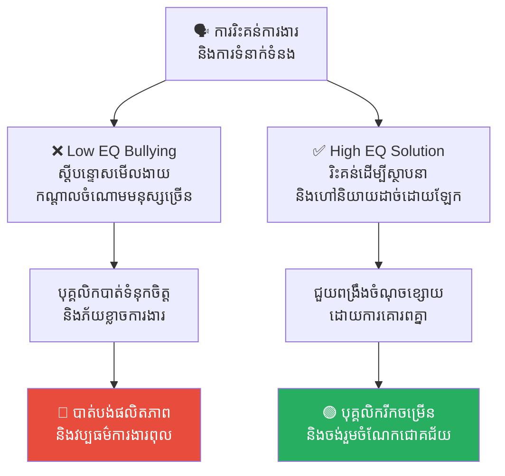
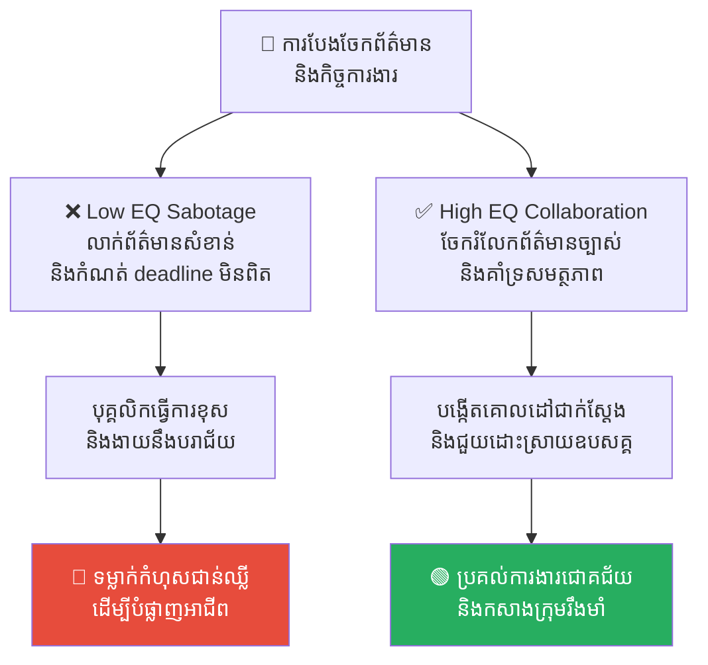
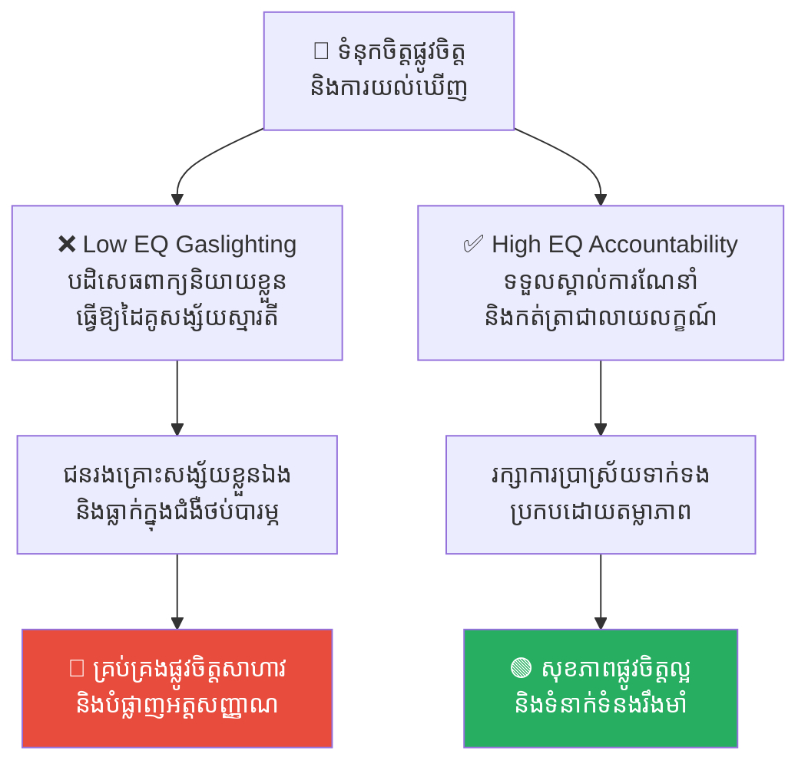
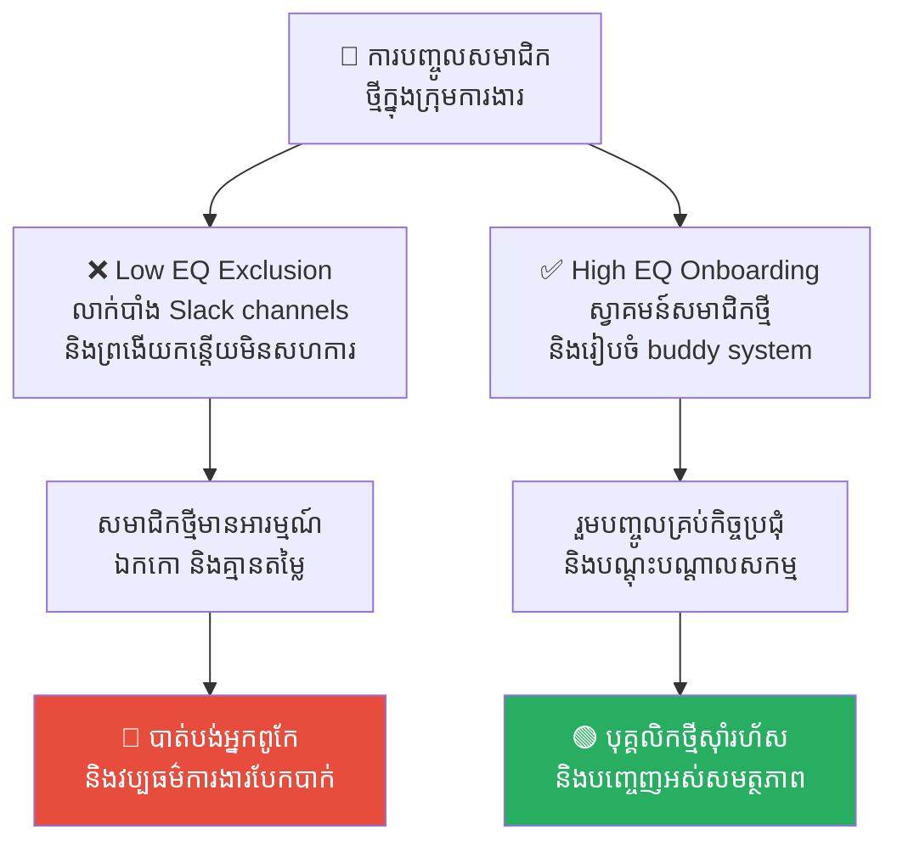
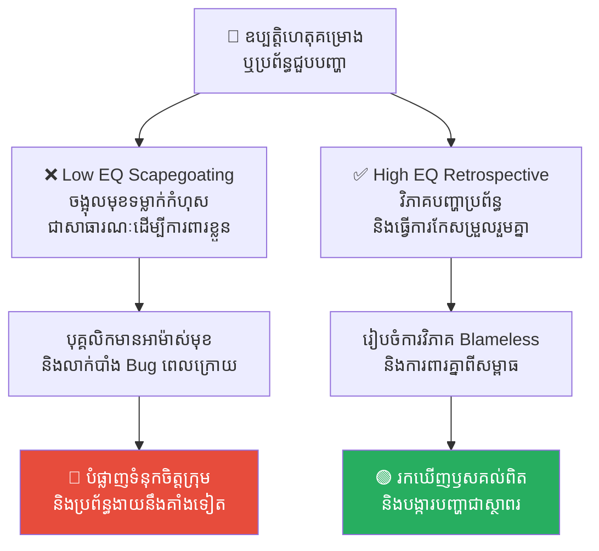

# Workplace Bullying: The Abuse of Power (ការគំរាមកំហែងនៅកន្លែងធ្វើការ៖ អន្ទាក់នៃអំណាច)

**Author:** ichamrong  
**Date:** 2026-05-17  
**Tags:** #workplace-bullying #toxic-culture #gaslighting #psychology #sabotage  
**Category:** Concepts  
**Read Time:** ~15 min  

---

## 📌 មាតិកា (Table of Contents)
- [អន្ទាក់ផ្លូវចិត្ត (The Trap)](#អន្ទាក់ផ្លូវចិត្ត-the-trap)
- [១. បញ្ហា៖ ការរំលោភអំណាចដោយលាក់មុខ (The Issue: Hidden Abuse of Power)](#១-បញ្ហា-ការរំលោភអំណាចដោយលាក់មុខ-the-issue-hidden-abuse-of-power)
- [២. ឧទាហរណ៍ជាក់ស្តែងក្នុងពិភពពិត (Real World Examples)](#២-ឧទាហរណ៍ជាក់ស្តែងក្នុងពិភពពិត)
  - [ឧទាហរណ៍ទី ១ — កម្រិតស្រាល៖ ការវាយប្រហារដោយពាក្យសម្តី និងផ្លូវចិត្ត (Verbal/Emotional Bullying)](#ឧទាហរណ៍ទី-១-កម្រិតស្រាល-ការវាយប្រហារដោយពាក្យសម្តី-និងផ្លូវចិត្ត-verbalemotional-bullying)
  - [ឧទាហរណ៍ទី ២ — កម្រិតមធ្យម៖ ការបំផ្លាញការងារ និងការទម្លាក់កំហុស (Systemic Sabotage)](#ឧទាហរណ៍ទី-២-កម្រិតមធ្យម-ការបំផ្លាញការងារ-និងការទម្លាក់កំហុស-systemic-sabotage)
  - [ឧទាហរណ៍ទី ៣ — កម្រិតមធ្យម៖ ការគ្រប់គ្រង និងការបំភាន់ផ្លូវចិត្ត (Gaslighting & Psychological Control)](#ឧទាហរណ៍ទី-៣-កម្រិតមធ្យម-ការគ្រប់គ្រង-និងការបំភាន់ផ្លូវចិត្ត-gaslighting-psychological-control)
  - [ឧទាហរណ៍ទី ៤ — កម្រិតធ្ងន់៖ ការផាត់ចេញ និងធ្វើឱ្យឯកកោក្នុងសង្គមការងារ (Social Ostracization & Exclusion)](#ឧទាហរណ៍ទី-៤-កម្រិតធ្ងន់-ការផាត់ចេញ-និងធ្វើឱ្យឯកកោក្នុងសង្គមការងារ-social-ostracization-exclusion)
  - [ឧទាហរណ៍ទី ៥ — កម្រិតធ្ងន់៖ ការចង្អុលមុខទម្លាក់កំហុសជាសាធារណៈ (Public Scapegoating & Blame Shifting)](#ឧទាហរណ៍ទី-៥-កម្រិតធ្ងន់-ការចង្អុលមុខទម្លាក់កំហុសជាសាធារណៈ-public-scapegoating-blame-shifting)
- [៣. កត្តាជម្រុញ៖ វប្បធម៌ស្ថាប័នទន់ខ្សោយ និងការផ្តោតលើលទ្ធផលជាជាងមនុស្ស (The Aggravator: Weak Corporate Culture and Results Over People)](#៣-កត្តាជម្រុញ-វប្បធម៌ស្ថាប័នទន់ខ្សោយ-និងការផ្តោតលើលទ្ធផលជាជាងមនុស្ស-the-aggravator-weak-corporate-culture-and-results-over-people)
- [៤. ដំណោះស្រាយទូទៅ (The General Solution)](#៤-ដំណោះស្រាយទូទៅ-the-general-solution)
  - [យុទ្ធសាស្ត្រការពារខ្លួនសម្រាប់បុគ្គល (Individual Defense Tactics)](#យុទ្ធសាស្ត្រការពារខ្លួនសម្រាប់បុគ្គល-individual-defense-tactics)
  - [យុទ្ធសាស្ត្រកែលម្អប្រព័ន្ធសម្រាប់ស្ថាប័ន (Systemic Organizational Reforms)](#យុទ្ធសាស្ត្រកែលម្អប្រព័ន្ធសម្រាប់ស្ថាប័ន-systemic-organizational-reforms)
- [សេចក្តីសន្និដ្ឋាន (Conclusion)](#សេចក្តីសន្និដ្ឋាន-conclusion)
- [Related Posts](#related-posts)

---

## អន្ទាក់ផ្លូវចិត្ត (The Trap)

តើអ្នកធ្លាប់មានអារម្មណ៍ភ័យខ្លាច ឬថប់បារម្ភក្នុងការដើរចូលការិយាល័យ ដោយសារតែបុគ្គលិក ឬប្រធានផ្នែកណាម្នាក់ជានិច្ចជាកាលតែងតែចាំចាប់កំហុស និយាយស្តីមើលងាយ ឬធ្វើឱ្យអ្នកបាក់មុខនៅចំពោះមុខអ្នកដទៃដែរឬទេ?

ដំបូងឡើយ អ្នកព្យាយាមសម្របសម្រួលដោយគិតថា៖ *«ប្រហែលជាការងារស្ត្រេសខ្លាំងទើបគាត់បែបនេះ»* ឬ *«មកពីខ្ញុំធ្វើការមិនទាន់បានល្អឥតខ្ចោះដូចគេចង់បាន»*។ ប៉ុន្តែទោះបីជាអ្នកព្យាយាមធ្វើការងាររហូតដល់ម៉ោង ១២ យប់ ឆ្លងកាត់ការពិនិត្យកូដត្រឹមត្រូវ និងប្រគល់ការងារបានល្អយ៉ាងណាក៏ដោយ ក៏ការរិះគន់ធ្ងន់ៗ សម្តីស្រួចៗ និងអាកប្បកិរិយាព្រងើយកន្តើយនៅតែបន្តមកលើរូបអ្នកដដែល។ យូរៗទៅ អ្នកចាប់ផ្តើមបាត់បង់ទំនុកចិត្តលើខ្លួនឯង ភ័យខ្លាចក្នុងការឆ្លើយតបសារសន្ទនា និងសង្ស័យលើសមត្ថភាពរបស់ខ្លួនទាំងស្រុង។

នេះគឺជាលទ្ធផលនៃការធ្លាក់ចូលក្នុងអន្ទាក់ **Workplace Bullying (ការគំរាមកំហែង និងការធ្វើបាបនៅកន្លែងធ្វើការ)**។ វាគឺជាការរំលោភបំពានផ្លូវចិត្តយ៉ាងស្ងៀមស្ងាត់ដែលបំផ្លាញសុខភាពរបស់អ្នកដទៃ ដើម្បីបម្រើអត្មារបស់បុគ្គលម្នាក់។

---

## ១. បញ្ហា៖ ការរំលោភអំណាចដោយលាក់មុខ (The Issue: Hidden Abuse of Power)

**Workplace Bullying** គឺជាការប្រើប្រាស់អំណាច (មិនថាតំណែងជាផ្លូវការ ឬឥទ្ធិពលផ្ទៃក្នុង) ដើម្បីវាយប្រហារ បន្ទាបបន្ថោក គ្រប់គ្រង និងធ្វើឱ្យបុគ្គលិកណាម្នាក់ឯកកោក្នុងរយៈពេលយូរអង្វែង។ វាអាចស្តែងចេញតាមរូបភាពនៃការប្រើប្រាស់ពាក្យសម្តី អាកប្បកិរិយា ឬសកម្មភាពផ្សេងៗដែលធ្វើឱ្យជនរងគ្រោះមានអារម្មណ៍ថាគ្មានសុវត្ថិភាពខាងផ្លូវចិត្ត (Lack of Psychological Safety)។

```
👑 អំណាច/តំណែង ───► [ ❌ ប្រើប្រាស់បែប Bullying ] ───► បាត់បង់ទំនុកចិត្ត, វប្បធម៌ការងារពុល
👑 អំណាច/តំណែង ───► [ ✅ ប្រើបែប Leader/Coach ] ───► លើកស្ទួយសមត្ថភាព, សុខភាពផ្លូវចិត្តល្អ
```

វាខុសស្រឡះទាំងស្រុងពី «ការរិះគន់ដើម្បីស្ថាបនា (Constructive Criticism)»៖
* **Constructive Criticism៖** ផ្តោតលើ **«ការងារ»** ដើម្បីស្វែងរកចំណុចកែលម្អឱ្យកាន់តែល្អឡើង។
* **Workplace Bullying៖** ផ្តោតលើ **«បុគ្គល»** ដើម្បីវាយប្រហារ បំបាក់មុខ និងសង្កត់សង្កិនផ្លូវចិត្ត ក្នុងគោលបំណងចង់បង្ហាញអំណាច ឬភាពខ្លាំងរបស់ពួកគេ។

---

## ២. ឧទាហរណ៍ជាក់ស្តែងក្នុងពិភពពិត

សូមពិនិត្យមើល **ឧទាហរណ៍ជាក់ស្តែងចំនួន ៥** បង្ហាញពីទម្រង់ផ្សេងៗគ្នានៃការគំរាមកំហែងនៅកន្លែងធ្វើការ និងរបៀបដោះស្រាយ៖

---

### ឧទាហរណ៍ទី ១ — កម្រិតស្រាល៖ ការវាយប្រហារដោយពាក្យសម្តី និងផ្លូវចិត្ត (Verbal/Emotional Bullying)

**ស្ថានភាព៖** ការប្រាស្រ័យទាក់ទងប្រចាំថ្ងៃ និងការវាយតម្លៃលទ្ធផលការងារក្នុងក្រុម។

* **សកម្មភាព Low EQ (កំហុសឆ្គង)៖** ប្រធានផ្នែកតែងតែប្រើប្រាស់សម្តីស្រួចៗ ការសើចចំអក ឬការរិះគន់ធ្ងន់ៗនៅចំពោះមុខសមាជិកដទៃ ដើម្បីបំបាក់មុខបុគ្គលិកថ្មីម្នាក់។ ពួកគេនិយាយថា៖ *«ការងារងាយៗប៉ុណ្ណឹងក៏ធ្វើមិនកើតដែរ? តើឯងរៀនចប់មកពីសាលាណា ទើបល្ងង់ខ្លៅបែបនេះ?»*
* **សកម្មភាព High EQ (ដំណោះស្រាយ)៖** ប្រធានផ្នែកហៅបុគ្គលិកមកជួបដាច់ដោយឡែកក្នុងបន្ទប់ប្រជុំស្ងាត់ ដើម្បីពិភាក្សា និងផ្តល់ការរិះគន់ស្ថាបនា៖ *«ខ្ញុំសម្គាល់ឃើញថា លទ្ធផលការងារ X របស់ប្អូនមានចំណុចខ្លះមិនទាន់ច្បាស់លាស់។ តើយើងអាចកែលម្អវាបន្ថែមដោយរបៀបណា? តើប្អូនត្រូវការជំនួយអ្វីខ្លះពីបង?»*
* **លទ្ធផល៖** ការស្តីបន្ទោសមើលងាយជាសាធារណៈធ្វើឱ្យបុគ្គលិកបាត់ទំនុកចិត្ត និងភ័យខ្លាចការងារ។ ការរិះគន់ស្ថាបនាដោយការគោរពគ្នា ជួយឱ្យបុគ្គលិកកែលម្អចំណុចខ្សោយ និងចង់រួមចំណែកជោគជ័យ។



---

### ឧទាហរណ៍ទី ២ — កម្រិតមធ្យម៖ ការបំផ្លាញការងារ និងការទម្លាក់កំហុស (Systemic Sabotage)

**ស្ថានភាព៖** ការសហការរៀបចំរបាយការណ៍ និងការងារប្រគល់គម្រោងឱ្យទាន់ពេលវេលា។

* **សកម្មភាព Low EQ (កំហុសឆ្គង)៖** មិត្តរួមការងារម្នាក់លាក់បាំងព័ត៌មានសំខាន់ៗដែលអ្នកត្រូវការដើម្បីបំពេញការងារ ឬផ្តល់តម្រូវការ Specs យឺតយ៉ាវ និងកំណត់ Deadline មិនពិត (Unrealistic Deadlines) ដើម្បីឱ្យអ្នកធ្វើការងារខុស ឬយឺតយ៉ាវ។ នៅពេលគម្រោងជួបបញ្ហា ពួកគេលោតទៅទម្លាក់កំហុសមកលើអ្នកទាំងស្រុងនៅមុខថ្នាក់លើ ដើម្បីការពារតំណែងខ្លួនឯង។
* **សកម្មភាព High EQ (ដំណោះស្រាយ)៖** បង្កើតយន្តការការងារដែលមានតម្លាភាពខ្ពស់។ រាល់ការបែងចែកភារកិច្ច ព័ត៌មានយោង និង Deadline ត្រូវតែសរសេរចងក្រងក្នុងប្រព័ន្ធរួមគ្នា (Jira/Trello/Shared Docs) ដែលសមាជិកទាំងអស់អាចចូលអាន និងផ្ទៀងផ្ទាត់បាន។ ប្រធានផ្នែកជួយគាំទ្រ និងដោះស្រាយឧបសគ្គទាន់ពេលវេលា។
* **លទ្ធផល៖** ការលាក់បាំងព័ត៌មាន និងទម្លាក់កំហុស (Sabotage) បំផ្លាញទំនុកចិត្ត និងការសហការក្នុងក្រុម។ តម្លាភាពព័ត៌មានជួយឱ្យការងារប្រគល់បានជោគជ័យ និងកសាងវប្បធម៌ការងារល្អ។



---

### ឧទាហរណ៍ទី ៣ — កម្រិតមធ្យម៖ ការគ្រប់គ្រង និងការបំភាន់ផ្លូវចិត្ត (Gaslighting & Psychological Control)

**ស្ថានភាព៖** ជម្លោះ ឬការយល់ច្រឡំលើកិច្ចសន្យា និងការណែនាំការងារពាក់កណ្តាលផ្លូវ។

* **សកម្មភាព Low EQ (កំហុសឆ្គង)៖** ប្រធានផ្នែកផ្តល់ការណែនាំផ្លាស់ប្តូរការងារតាមទូរស័ព្ទ ប៉ុន្តែនៅពេលការងារនោះជួបបញ្ហា ពួកគេបដិសេធដាច់អហង្ការ៖ *«ខ្ញុំមិនដែលនិយាយបែបនេះទេ! ឯងប្រាកដជាចាំខុស ឬគិតច្រើនពេកហើយ! ឯងនេះល្ងង់ខ្លៅ និងខ្សោយស្មារតីណាស់!»* (Gaslighting) ធ្វើឱ្យជនរងគ្រោះសង្ស័យការចងចាំ និងស្មារតីរបស់ខ្លួន។
* **សកម្មភាព High EQ (ដំណោះស្រាយ)៖** អនុវត្តការទំនាក់ទំនងប្រកបដោយទំនួលខុសត្រូវខ្ពស់។ រាល់ការណែនាំផ្លាស់ប្តូរការងារទាំងអស់ ត្រូវតែធ្វើឡើងតាមរយៈសារលាយលក្ខណ៍អក្សរ (Email ឬ Ticket Update)។ ប្រធានផ្នែកទទួលស្គាល់រាល់ការសម្រេចចិត្តរបស់ខ្លួន និងចូលរួមដោះស្រាយបញ្ហារួមគ្នា។
* **លទ្ធផល៖** ការប្រើល្បិចបំភាន់ផ្លូវចិត្ត (Gaslighting) បំផ្លាញអត្តសញ្ញាណជនរងគ្រោះ និងបង្កឱ្យមានជំងឺថប់បារម្ភធ្ងន់ធ្ងរ។ តម្លាភាព និងទំនួលខុសត្រូវជួយកសាងសុខភាពផ្លូវចិត្តល្អ និងរក្សាទំនាក់ទំនងការងាររឹងមាំ។



---

### ឧទាហរណ៍ទី ៤ — កម្រិតធ្ងន់៖ ការផាត់ចេញ និងធ្វើឱ្យឯកកោក្នុងសង្គមការងារ (Social Ostracization & Exclusion)

**ស្ថានភាព៖** ការិយាល័យបានជួលបុគ្គលិកថ្មីម្នាក់ដែលមានសមត្ថភាពខ្ពស់ និងឆ្លាតវៃ។

* **សកម្មភាព Low EQ (កំហុសឆ្គង)៖** បុគ្គលិកចាស់វស្សាម្នាក់មានអារម្មណ៍ច្រណែន និងខ្លាចបាត់បង់តំណែង ពួកគេក៏បង្កើតបក្សពួក (Cliques) ផាត់បុគ្គលិកថ្មីចេញ៖ ចេតនាមិនបន្ថែមឈ្មោះពួកគេទៅក្នុង Slack Channels ពិភាក្សាការងារសំខាន់ៗ, មិនបបួលទៅញ៉ាំអាហាររួមគ្នា, និងព្រងើយកន្តើយមិនសហការការងារ ឬមិនឆ្លើយតបសារសួរសំណួរការងារ ដើម្បីបង្ខំឱ្យពួកគេមានអារម្មណ៍ឯកកោ និងលាឈប់ចោល។
* **សកម្មភាព High EQ (ដំណោះស្រាយ)៖** បង្កើតប្រព័ន្ធ Onboarding ប្រកបដោយបរិយាបន្ន (Inclusive Culture)។ ក្រុមហ៊ុនចាត់តាំងសមាជិកម្នាក់ជា «មិត្តគ្រូបង្វឹក (Buddy)» ជួយណែនាំ និងរួមបញ្ចូលសមាជិកថ្មីទៅក្នុងគ្រប់ Slack channels, កិច្ចប្រជុំ និងសកម្មភាពក្រុមទាំងអស់ ដើម្បីជួយពួកគេស៊ាំនឹងការងារបានលឿន។
* **លទ្ធផល៖** ការផាត់ចេញ និងបង្កបង្កើតបក្សពួកបំផ្លាញវប្បធម៌ការងារ និងធ្វើឱ្យក្រុមហ៊ុនបាត់បង់ធនធានល្អៗ។ ការស្វាគមន៍ និងការគាំទ្រជួយឱ្យបុគ្គលិកថ្មីស៊ាំរហ័ស និងបញ្ចេញអស់សមត្ថភាពសម្រាប់ការងារ។



---

### ឧទាហរណ៍ទី ៥ — កម្រិតធ្ងន់៖ ការចង្អុលមុខទម្លាក់កំហុសជាសាធារណៈ (Public Scapegoating & Blame Shifting)

**ស្ថានភាព៖** នៅក្នុងអំឡុងពេលធ្វើការបង្ហាញគំរូសូហ្វវែរ (Client Demo) ស្រាប់តែប្រព័ន្ធជួបប្រទះ Bug និងគាំងដំណើរការ។

* **សកម្មភាព Low EQ (កំហុសឆ្គង)៖** ប្រធាននាយកដ្ឋានខឹងសម្បារ និងភ័យខ្លាចបាត់បង់មុខមាត់ជាមួយអតិថិជន ក៏ចង្អុលមុខ និងស្រែកស្តីបន្ទោសទម្លាក់កំហុសទៅលើ Developer ម្នាក់ជាសាធារណៈកណ្តាលប្រជុំ៖ *«នេះជាកំហុសរបស់ Developer ម្នាក់នេះដែលសរសេរកូដអន់!»* ពួកគេប្រើប្រាស់បុគ្គលិកជា «ពពែទទួលបាប (Scapegoat)» ដើម្បីបិទបាំងកង្វះការត្រួតពិនិត្យប្រព័ន្ធរបស់ខ្លួន។
* **សកម្មភាព High EQ (ដំណោះស្រាយ)៖** ថ្នាក់ដឹកនាំការពារសមាជិកពីអតិថិជនជាមុន៖ *«សុំទោសចំពោះបញ្ហាបច្ចេកទេសនេះ ក្រុមការងារយើងខ្ញុំនឹងត្រួតពិនិត្យ និងកែសម្រួលជូនជាបន្ទាន់។»* បន្ទាប់មក ដឹកនាំកិច្ចប្រជុំ Retrospective ស្ងប់ស្ងាត់ ដើម្បីវិភាគរកឫសគល់បញ្ហាប្រព័ន្ធ និងរៀបចំផែនការបង្ការរួមគ្នាដោយគ្មានការចោទប្រកាន់ (Blameless Retrospective)។
* **លទ្ធផល៖** ការចង្អុលមុខទម្លាក់កំហុសជាសាធារណៈធ្វើឱ្យបុគ្គលិកមានអាម៉ាស់មុខ ថប់បារម្ភ និងព្យាយាមលាក់បាំងកំហុសនៅពេលក្រោយ។ ការវិភាគ Blameless ជួយស្វែងរកឫសគល់បញ្ហាពិតប្រាកដ បង្ការបញ្ហាជាស្ថាពរ និងកសាងទំនុកចិត្តក្រុមឡើងវិញ។



---

## ៣. កត្តាជម្រុញ៖ វប្បធម៌ស្ថាប័នទន់ខ្សោយ និងការផ្តោតលើលទ្ធផលជាជាងមនុស្ស (The Aggravator: Weak Corporate Culture and Results Over People)

Workplace Bullying មិនអាចរីកដុះដាលបានឡើយ ប្រសិនបើស្ថាប័ននោះមានវប្បធម៌ការងារដ៏រឹងមាំ និងមានក្រមសីលធម៌ច្បាស់លាស់។ បញ្ហានេះច្រើនតែកើតឡើង និងកាន់តែអាក្រក់នៅពេល៖

1. **ការអត់ឱនចំពោះទង្វើមិនគប្បី (Tolerance of Bad Behavior)៖** នៅពេលដែលស្ថាប័ន ឬផ្នែកធនធានមនុស្ស (HR) មិនចាត់វិធានការដោះស្រាយ ឬព្រងើយកន្តើយចំពោះការរាយការណ៍អំពីការគំរាមកំហែង នោះវានឹងក្លាយជាការបើកភ្លើងខៀវឱ្យអ្នកប្រព្រឹត្តបន្តសកម្មភាពរបស់ពួកគេដោយមិនខ្លាចញញើតឡើយ។
2. **ការផ្តោតលើលទ្ធផលជាជាងមនុស្ស (Results Over People)៖** ប្រសិនបើអ្នក Bully គឺជាបុគ្គលិកឆ្នើមដែលនាំមកនូវចំណូលច្រើនដល់ក្រុមហ៊ុន ឬជាអ្នកជំនាញដែលខ្វះមិនបាន ថ្នាក់ដឹកនាំជាន់ខ្ពស់អាចនឹងមើលរំលងអាកប្បកិរិយាមិនល្អរបស់ពួកគេ ដោយយកលេសថា *«ការងារដើរ និងបានលុយគឺគ្រប់គ្រាន់ហើយ»* ដោយមិនខ្វល់ពីផលប៉ះពាល់ផ្លូវចិត្តរបស់បុគ្គលិកដទៃឡើយ។

---

## ៤. ដំណោះស្រាយទូទៅ (The General Solution)

ការដោះស្រាយបញ្ហា Workplace Bullying តម្រូវឱ្យមានការចូលរួមពីទាំងបុគ្គល និងស្ថាប័នទាំងមូល៖

### យុទ្ធសាស្ត្រការពារខ្លួនសម្រាប់បុគ្គល (Individual Defense Tactics)
1. **កត់ត្រាទុកគ្រប់ករណី (Document Everything)៖** កត់ត្រារាល់ឧប្បត្តិហេតុទាំងអស់ រួមមាន៖ ពេលវេលា ទីកន្លែង អ្វីដែលបានកើតឡើង និងសាក្សីដែលបានឃើញ។ រក្សាទុកអ៊ីមែល សារ Slack និងភស្តុតាងនានាជាលាយលក្ខណ៍អក្សរ។
2. **បង្កើតព្រំដែនដាច់ខាត (Set Direct Boundaries)៖** ប្រសិនបើមានសុវត្ថិភាពក្នុងការធ្វើបែបនេះ ត្រូវសម្លឹងមើលភ្នែកពួកគេត្រង់ៗ ហើយនិយាយដោយក្តីស្ងប់ស្ងាត់តែម៉ឺងម៉ាត់បំផុត៖ *«ខ្ញុំមិនទទួលយកការនិយាយស្តី ឬអាកប្បកិរិយាបែបនេះទេ បើចង់ពិភាក្សាការងារ សូមនិយាយដោយការគោរពគ្នា។»*
3. **ស្វែងរកការគាំទ្រ (Seek Support)៖** កុំលាក់ទុកបញ្ហានេះក្នុងចិត្តម្នាក់ឯង។ យកភស្តុតាងទៅជួប និងរាយការណ៍ទៅកាន់ HR ឬថ្នាក់លើដែលអ្នកទុកចិត្ត ដើម្បីស្វែងរកដំណោះស្រាយផ្លូវការ។

### យុទ្ធសាស្ត្រកែលម្អប្រព័ន្ធសម្រាប់ស្ថាប័ន (Systemic Organizational Reforms)
1. **បង្កើតគោលការណ៍គ្មានការអត់ឱន (Zero-Tolerance Policy)៖** ត្រូវមានគោលការណ៍ប្រឆាំងការធ្វើបាប និងគំរាមកំហែងនៅកន្លែងធ្វើការជាលាយលក្ខណ៍អក្សរច្បាស់លាស់ និងអនុវត្តជាធរមានស្មើៗគ្នា មិនថាបុគ្គលនោះមានតំណែងខ្ពស់ប៉ុណ្ណាឡើយ។
2. **បង្កើតយន្តការរាយការណ៍ប្រកបដោយសុវត្ថិភាព (Safe & Anonymous Reporting)៖** ធានាថាបុគ្គលិកអាចរាយការណ៍ពីការធ្វើបាបដោយសេរី ដោយមិនភ័យខ្លាចការគំរាមកំហែង ឬសងសឹកត្រលប់ក្រោយវិញពីសំណាក់អ្នកមានអំណាច។
3. **ការវាយតម្លៃអត្តចរិត និងវប្បធម៌ (EQ-Driven Evaluations)៖** ការវាយតម្លៃ និងតម្លើងឋានៈបុគ្គលិក មិនត្រូវពឹងផ្អែកតែលើលទ្ធផលចំណូល ឬបច្ចេកទេសតែម្ខាងនោះទេ ត្រូវគិតគូរពីពិន្ទុអាកប្បកិរិយា ការសហការ និងសមត្ថភាព EQ ក្នុងការដឹកនាំក្រុមការងារផងដែរ។

---

## សេចក្តីសន្និដ្ឋាន (Conclusion)

កន្លែងធ្វើការគួរតែជាកន្លែងដែលយើងអភិវឌ្ឍសមត្ថភាព កសាងទំនុកចិត្ត និងរួមចំណែកកសាងស្នាដៃរួម មិនមែនជាសមរភូមិដែលយើងត្រូវតស៊ូដើម្បីរស់រានមានជីវិតខាងផ្លូវចិត្តនោះឡើយ។ **គ្មានការងារ ឬតំណែងណាមួយ មានតម្លៃស្មើនឹងសុខភាពផ្លូវចិត្ត សេចក្តីថ្លៃថ្នូរ និងការគោរពតម្លៃរបស់មនុស្សជាដាច់ខាត។**

---

## Related Posts

* **[03-science-of-communication-eq-flaws.md](./03-science-of-communication-eq-flaws.md)** — ការវិភាគលើចំណុចខ្វះ EQ ទាំង ១០ ក្នុងកិច្ចសន្ទនា។
* **[12-multiplier-leadership.md](./12-multiplier-leadership.md)** — របៀបដែលមេដឹកនាំ Multiplier ដោះលែងសមត្ថភាពក្រុមការងារ ផ្ទុយពី Diminisher។
* **[17-everyday-sadism-and-the-joy-of-cruelty.md](./17-everyday-sadism-and-the-joy-of-cruelty.md)** — របៀបទប់ទល់ជាមួយមនុស្សដែលចូលចិត្តបង្កើតការឈឺចាប់ដល់អ្នកដទៃ។
* **[18-narcissism-and-the-ego-trap.md](./18-narcissism-and-the-ego-trap.md)** — ការយល់ដឹងពីអន្ទាក់អត្មា និងភាពវង្វេងនឹងខ្លួនឯង។

---

*Last updated: 2026-05-26*
