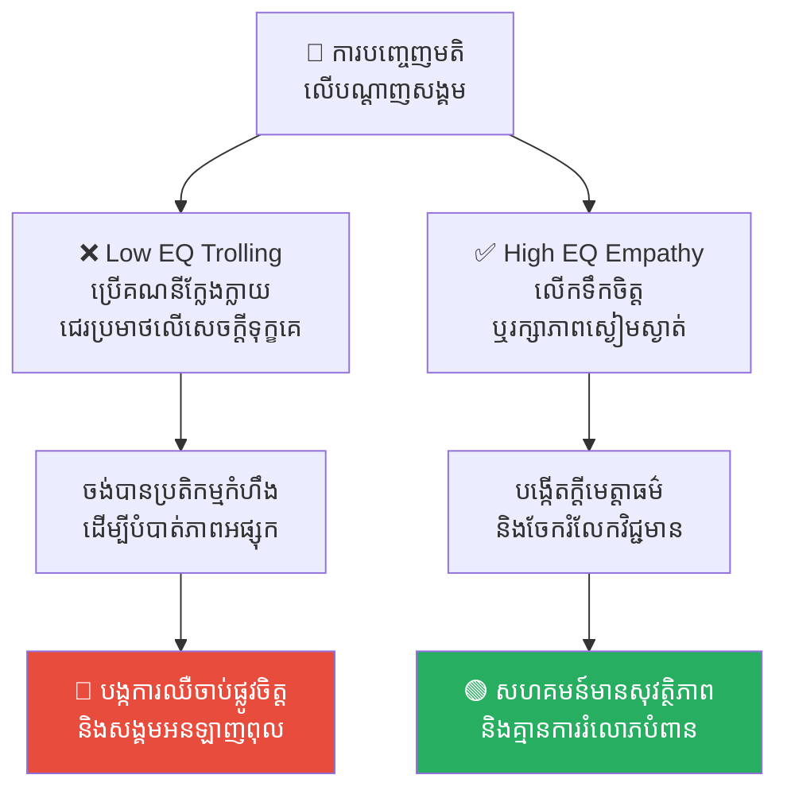
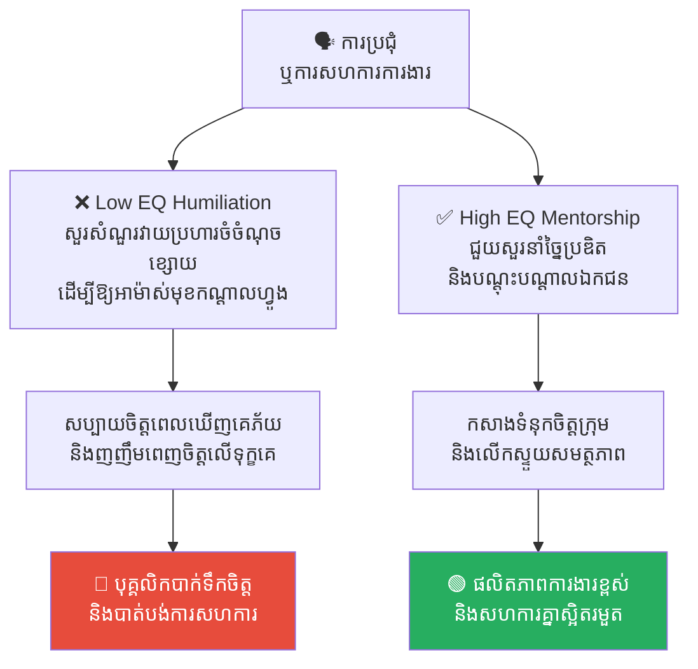
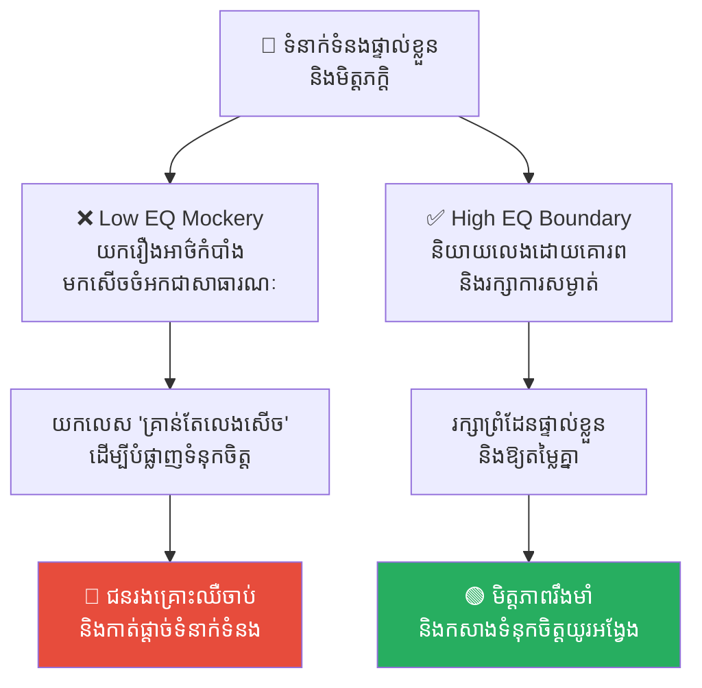
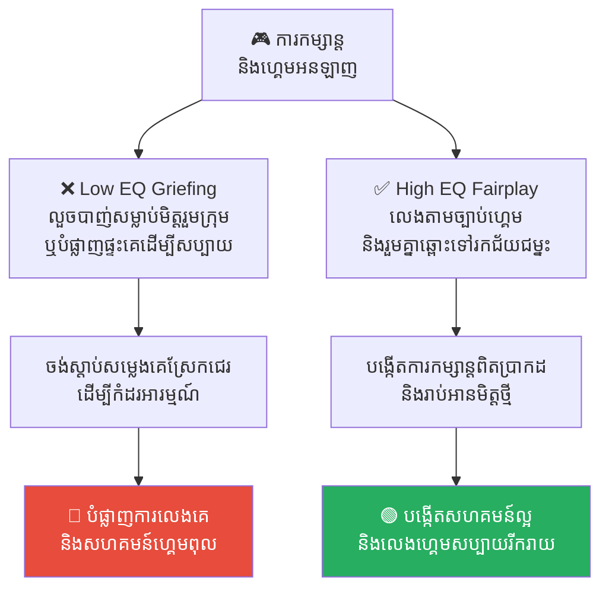
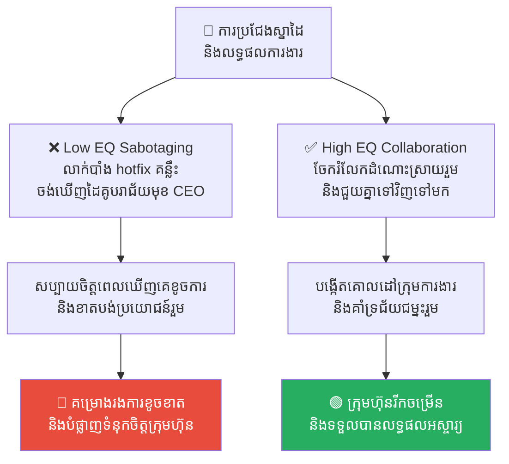

# Everyday Sadism: The Joy of Cruelty (ចំណូលចិត្តធ្វើបាបអ្នកដទៃ៖ អន្ទាក់នៃភាពឃោរឃៅ)

**Author:** ichamrong  
**Date:** 2026-05-17  
**Tags:** #everyday-sadism #dark-tetrad #toxic-behavior #psychology #empathy-deficit  
**Category:** Concepts  
**Read Time:** ~15 min  

---

## 📌 មាតិកា (Table of Contents)
- [សេចក្តីផ្តើម (Introduction)](#សេចក្តីផ្តើម-introduction)
- [១. បញ្ហា (The Issue): ភាពសប្បាយរីករាយលើគំនរទុក្ខ (The Empathy Deficit & Dark Tetrad)](#១-បញ្ហា-the-issue-ភាពសប្បាយរីករាយលើគំនរទុក្ខ-the-empathy-deficit-dark-tetrad)
- [២. ឧទាហរណ៍ជាក់ស្តែងក្នុងពិភពពិត (Real World Examples)](#២-ឧទាហរណ៍ជាក់ស្តែងក្នុងពិភពពិត)
  - [ឧទាហរណ៍ទី ១ — កម្រិតស្រាល៖ ពិភពអ៊ីនធឺណិត និងគណនីក្លែងក្លាយ (Online Trolls)](#ឧទាហរណ៍ទី-១-កម្រិតស្រាល-ពិភពអ៊ីនធឺណិត-និងគណនីក្លែងក្លាយ-online-trolls)
  - [ឧទាហរណ៍ទី ២ — កម្រិតមធ្យម៖ ការធ្វើឱ្យអាម៉ាស់មុខជាសាធារណៈនៅកន្លែងធ្វើការ (Public Humiliation at Work)](#ឧទាហរណ៍ទី-២-កម្រិតមធ្យម-ការធ្វើឱ្យអាម៉ាស់មុខជាសាធារណៈនៅកន្លែងធ្វើការ-public-humiliation-at-work)
  - [ឧទាហរណ៍ទី ៣ — កម្រិតមធ្យម៖ ទំនាក់ទំនងផ្ទាល់ខ្លួន និងលេសនៃការលេងសើច (Personal Relationships & "Just Kidding" Excuse)](#ឧទាហរណ៍ទី-៣-កម្រិតមធ្យម-ទំនាក់ទំនងផ្ទាល់ខ្លួន-និងលេសនៃការលេងសើច-personal-relationships-just-kidding-excuse)
  - [ឧទាហរណ៍ទី ៤ — កម្រិតធ្ងន់៖ ពិភពហ្គេមអនឡាញ និងការបំផ្លាញការលេងរបស់ដៃគូ (Video Games & Griefing)](#ឧទាហរណ៍ទី-៤-កម្រិតធ្ងន់-ពិភពហ្គេមអនឡាញ-និងការបំផ្លាញការលេងរបស់ដៃគូ-video-games-griefing)
  - [ឧទាហរណ៍ទី ៥ — កម្រិតធ្ងន់៖ ការលាក់បាំងដំណោះស្រាយដើម្បីចង់ឃើញដៃគូបរាជ័យ (Corporate Sabotaging & Schadenfreude)](#ឧទាហរណ៍ទី-៥-កម្រិតធ្ងន់-ការលាក់បាំងដំណោះស្រាយដើម្បីចង់ឃើញដៃគូបរាជ័យ-corporate-sabotaging-schadenfreude)
- [៣. កត្តាជំរុញ៖ ភាពអនាមិក និងវប្បធម៌ហ្វូងមនុស្ស (The Aggravator: Anonymity and Mob Mentality)](#៣-កត្តាជំរុញ-ភាពអនាមិក-និងវប្បធម៌ហ្វូងមនុស្ស-the-aggravator-anonymity-and-mob-mentality)
- [៤. ដំណោះស្រាយទូទៅ (The General Solution)](#៤-ដំណោះស្រាយទូទៅ-the-general-solution)
  - [យុទ្ធសាស្ត្រ «gray rock» សម្រាប់ជនរងគ្រោះ (Gray Rock Method)](#យុទ្ធសាស្ត្រ-gray-rock-សម្រាប់ជនរងគ្រោះ-gray-rock-method)
  - [ការស្វែងរកភស្តុតាង និងការកាត់ផ្តាច់ទំនាក់ទំនង (Set Firm Boundaries)](#ការស្វែងរកភស្តុតាង-និងការកាត់ផ្តាច់ទំនាក់ទំនង-set-firm-boundaries)
  - [ការបណ្តុះបណ្តាលក្តីមេត្តាធម៌ និងការស្វ័យត្រួតពិនិត្យ (Cultivating Empathy)](#ការបណ្តុះបណ្តាលក្តីមេត្តាធម៌-និងការស្វ័យត្រួតពិនិត្យ-cultivating-empathy)
- [សេចក្តីសន្និដ្ឋាន (Conclusion)](#សេចក្តីសន្និដ្ឋាន-conclusion)
- [Related Posts](#related-posts)

---

## សេចក្តីផ្តើម (Introduction)

**អន្ទាក់នៃភាពឃោរឃៅ៖ ការយកសេចក្តីសុខ លើសេចក្តីទុក្ខរបស់អ្នកដទៃ**

តើអ្នកធ្លាប់ឆ្ងល់ទេថា ហេតុអ្វីបានជាមនុស្សមួយចំនួនហាក់ដូចជាសប្បាយចិត្ត ញញឹម ឬចូលចិត្តបញ្ជោះបង់ នៅពេលដែលឃើញអ្នកដទៃជួបការលំបាក ខ្មាសអៀន ឬឈឺចាប់?

អ្នកប្រហែលជាគិតថា ពួកគេគ្រាន់តែ *«ចូលចិត្តលេងសើចច្រើន»* ឬ *«និយាយត្រង់ៗ»* ប៉ុន្តែនៅក្នុងផ្នែកចិត្តសាស្ត្រ អាកប្បកិរិយាដែលទាញយកភាពសប្បាយរីករាយពីការរងទុក្ខរបស់អ្នកដទៃបែបនេះ ត្រូវបានគេហៅថា **Everyday Sadism (ចំណូលចិត្តធ្វើបាបអ្នកដទៃប្រចាំថ្ងៃ)**។ វាគឺជាសមាជិកទី៤ នៃក្រុមអត្តចរិតងងឹត (The Dark Tetrad) នៃចិត្តសាស្ត្រមនុស្ស។

---

## ១. បញ្ហា (The Issue): ភាពសប្បាយរីករាយលើគំនរទុក្ខ (The Empathy Deficit & Dark Tetrad)

**Everyday Sadism** មិនមែនសំដៅលើឃាតករសៀរៀលនៅក្នុងរឿងហូលីវូដនោះទេ។ វាសំដៅលើ «មនុស្សធម្មតាៗ» ដែលរស់នៅជុំវិញខ្លួនយើង ដែលជារឿយៗទទួលបានអារម្មណ៍រំភើប សប្បាយចិត្ត ឬមានអារម្មណ៍ថាខ្លួនមានអំណាច តាមរយៈការបង្កើត ឬការទស្សនាការឈឺចាប់ផ្លូវកាយ ឬផ្លូវចិត្តរបស់អ្នកដទៃ។

វាខុសស្រឡះពីទម្លាប់ធម្មតា៖
* ❌ វាមិនមែនគ្រាន់តែជាការ «លេងសើច (Prank)» ដោយគ្មានចេតនាអាក្រក់នោះទេ។
* ✅ តាមពិត វាគឺជា **ការបិទភ្នែកមិនខ្វល់ពីក្តីមេត្តា (Empathy Deficit)** ហើយប្រើប្រាស់សេចក្តីឈឺចាប់របស់អ្នកដទៃជា «ប្រដាប់ក្មេងលេង» ដើម្បីកំដរអារម្មណ៍ខ្លួនឯង ឬបំបាត់ភាពអផ្សុក។ ភាពអាម៉ាស់របស់ជនរងគ្រោះ គឺជាពានរង្វាន់ផ្លូវចិត្តរបស់អ្នក Bully ប្រភេទនេះ។

---

## ២. ឧទាហរណ៍ជាក់ស្តែងក្នុងពិភពពិត

សូមពិនិត្យមើល **ឧទាហរណ៍ជាក់ស្តែងចំនួន ៥** បង្ហាញពីទម្រង់ផ្សេងៗគ្នានៃចំណូលចិត្តធ្វើបាបអ្នកដទៃ និងវិធីសាស្ត្រដោះស្រាយ៖

---

### ឧទាហរណ៍ទី ១ — កម្រិតស្រាល៖ ពិភពអ៊ីនធឺណិត និងគណនីក្លែងក្លាយ (Online Trolls)

**ស្ថានភាព៖** ការបញ្ចេញមតិ (Comments) លើបណ្តាញសង្គមនៅក្រោមផុសរបស់ជនរងគ្រោះ។

* **សកម្មភាព Low EQ (កំហុសឆ្គង)៖** ពួកគេចូលចិត្តប្រើគណនីក្លែងក្លាយ (Fake Accounts) ដើម្បីសរសេរជេរប្រមាថ បញ្ជោះបង់ ឬទាញទម្លាក់អ្នកដទៃដែលកំពុងមានទុក្ខ។ ឧទាហរណ៍៖ ពេលឃើញគេបង្ហោះរឿងបែកបាក់ស្នេហា ឬអាជីវកម្មបរាជ័យ ពួកគេចូលទៅខមិនថា៖ *«សមមុខហើយ! មុខអកុសលអញ្ចឹងសមតែគេបោះចោល!»* គ្រាន់តែចង់ឃើញម្ចាស់ផុសខឹងតបតវិញដើម្បីសប្បាយ។
* **សកម្មភាព High EQ (ដំណោះស្រាយ)៖** ប្រើប្រាស់បណ្តាញសង្គមប្រកបដោយក្តីយោគយល់ (Empathic Response)។ ផ្តល់ការលើកទឹកចិត្ត ឬការចូលរួមរំលែកទុក្ខដោយភាពស្ងប់ស្ងាត់ ឬរក្សាការមិនបញ្ចេញមតិយោបល់ ប្រសិនបើគ្មានពាក្យល្អៗសម្រាប់ស្ថាបនា។
* **លទ្ធផល៖** ការតបតដោយកំហឹងគឺជា «ចំណី» ដែល Online Trolls ចង់បាន ដែលធ្វើឱ្យសង្គមអនឡាញកាន់តែពុល។ វិធីល្អបំផុតគឺ Block, Report និងផាត់ចេញដោយមិនបាច់តបត។

---

### ឧទាហរណ៍ទី ២ — កម្រិតមធ្យម៖ ការធ្វើឱ្យអាម៉ាស់មុខជាសាធារណៈនៅកន្លែងធ្វើការ (Public Humiliation at Work)

**ស្ថានភាព៖** ការប្រជុំក្រុមការងារ ឬការឡើងធ្វើបទបង្ហាញ (Slide Presentation)។

* **សកម្មភាព Low EQ (កំហុសឆ្គង)៖** មិត្តរួមការងារ ឬមេដឹកនាំប្រភេទនេះ ចូលចិត្តសួរសំណួរវាយប្រហារចំចំណុចខ្សោយរបស់អ្នក ឬគាស់កកាយកំហុសចាស់របស់អ្នកនៅកណ្តាលចំណោមមនុស្សច្រើន ដើម្បីឱ្យអ្នកភ័យ ញ័រ ឬគាំងនិយាយលែងចេញ។ ពួកគេមានអារម្មណ៍ថាខ្លួនឯងពូកែ ហើយលួចញញឹមញញែមពេញចិត្តនៅពេលឃើញអ្នកបាក់មុខ។
* **សកម្មភាព High EQ (ដំណោះស្រាយ)៖** ជួយគាំទ្រ និងលើកស្ទួយសមត្ថភាពសមាជិក។ សួរសំណួរស្ថាបនា និងជួយបង្រៀន ឬណែនាំចំណុចខ្វះខាតដោយឡែក (One-on-One) ប្រកបដោយក្រមសីលធម៌វិជ្ជាជីវៈខ្ពស់។
* **លទ្ធផល៖** ការបំបាក់មុខជាសាធារណៈបំផ្លាញទំនុកចិត្ត និងការសហការក្នុងក្រុម។ វប្បធម៌គ្រូបង្វឹក (Mentorship) ជួយកសាងសមាជិករឹងមាំ និងបង្កើនផលិតភាពការងារ។

---

### ឧទាហរណ៍ទី ៣ — កម្រិតមធ្យម៖ ទំនាក់ទំនងផ្ទាល់ខ្លួន និងលេសនៃការលេងសើច (Personal Relationships & "Just Kidding" Excuse)

**ស្ថានភាព៖** ការជួបជុំសន្ទនាក្នុងចំណោមមិត្តភក្តិជិតស្និទ្ធ ឬដៃគូស្នេហា។

* **សកម្មភាព Low EQ (កំហុសឆ្គង)៖** ពួកគេយកចំណុចខ្សោយ ឬរឿងខ្មាសអៀនបំផុតរបស់អ្នក (ដូចជារូបរាងកាយ ភាពក្រីក្រ ឬរឿងបរាជ័យអតីតកាល) មកនិយាយលេងសើចជាសាធារណៈឱ្យគេឯងសើចចំអក។ ពេលអ្នកខឹង ឬយំ ពួកគេបង្វែរកំហុសមកអ្នកវិញ៖ *«យី! គ្រាន់តែលេងសើចសោះ ខឹងមែនទែន? ឯងនេះគិតច្រើនពេកហើយ!»*
* **សកម្មភាព High EQ (ដំណោះស្រាយ)៖** គោរពព្រំដែនផ្ទាល់ខ្លួន (Boundaries) និងរក្សាការសម្ងាត់របស់មិត្តភក្តិ។ ជជែកលេងកម្សាន្តដោយមិនលើកយកចំណុចឈឺចាប់របស់អ្នកដទៃមកធ្វើជាល្បែងសើចឡើយ។
* **លទ្ធផល៖** ការសើចចំអកចំណុចខ្សោយបំផ្លាញមិត្តភាព និងធ្វើឱ្យជនរងគ្រោះឯកកោ។ ការគោរពព្រំដែនផ្ទាល់ខ្លួនជួយកសាងមិត្តភាពរឹងមាំ និងទំនុកចិត្តយូរអង្វែង។

---

### ឧទាហរណ៍ទី ៤ — កម្រិតធ្ងន់៖ ពិភពហ្គេមអនឡាញ និងការបំផ្លាញការលេងរបស់ដៃគូ (Video Games & Griefing)

**ស្ថានភាព៖** ការលេងហ្គេមអនឡាញជាក្រុម (Multiplayer Online Games)។

* **សកម្មភាព Low EQ (កំហុសឆ្គង)៖** ពួកគេចូលលេងហ្គេមមិនមែនដើម្បីចង់ឈ្នះតាមច្បាប់ទេ តែដើម្បីបំផ្លាញការលេងរបស់សមាជិកដទៃ (Griefers) ដូចជា៖ ដេញបាញ់សម្លាប់មិត្តរួមក្រុមឯង ឬលួចបំផ្លាញសំណង់ ឬផ្ទះដែលគេខំសាងសង់រាប់ម៉ោង គ្រាន់តែដើម្បីចង់ស្តាប់សម្លេងគេស្រែកយំ ឬខឹងជេរប្រមាថតាមម៉ៃក្រូហ្វូន។
* **សកម្មភាព High EQ (ដំណោះស្រាយ)៖** លេងហ្គេមប្រកបដោយក្រមសីលធម៌ (Fairplay)។ សហការគ្នាយ៉ាងស្អិតរមួតដើម្បីជ័យជម្នះរួម និងលើកទឹកចិត្តមិត្តរួមក្រុមទោះបីជាលេងចាញ់ក៏ដោយ។
* **លទ្ធផល៖** សកម្មភាព Griefing បំផ្លាញការកម្សាន្តរបស់អតិថិជន និងបង្កើតសហគមន៍ហ្គេមដ៏ពុល។ ការលេងប្រកបដោយក្រមសីលធម៌បង្កើតបរិយាកាសរីករាយ និងបានមិត្តភក្តិល្អៗ។

---

### ឧទាហរណ៍ទី ៥ — កម្រិតធ្ងន់៖ ការលាក់បាំងដំណោះស្រាយដើម្បីចង់ឃើញដៃគូបរាជ័យ (Corporate Sabotaging & Schadenfreude)

**ស្ថានភាព៖** ការប្រកួតប្រជែងស្នាដៃ ឬការឡើងធ្វើបទបង្ហាញជូនអគ្គនាយក (CEO Presentation)។

* **សកម្មភាព Low EQ (កំហុសឆ្គង)៖** បុគ្គលិកម្នាក់បានរកឃើញ Bug ឬ Configuration ខុសធ្ងន់ធ្ងរនៅលើ Slide ឬកូដរបស់មិត្តរួមការងារម្នាក់ទៀតដែលបម្រុងនឹងឡើងបង្ហាញ CEO នៅម៉ោងបន្ទាប់។ ពួកគេមានចិត្តច្រណែន ក៏សម្រេចចិត្ត «លាក់បាំងមិនប្រាប់ដំណោះស្រាយ ឬ hotfix» ដោយសង្ឃឹម និងចង់ឃើញមិត្តរួមការងារម្នាក់នោះត្រូវរងការស្តីបន្ទោស បាក់មុខ ឬរងបរាជ័យជាសាធារណៈ ដើម្បីឱ្យខ្លួនសប្បាយរីករាយ (Schadenfreude)។
* **សកម្មភាព High EQ (ដំណោះស្រាយ)៖** ជួយគ្នាយ៉ាងសកម្ម (Proactive Collaboration)។ រាយការណ៍ និងប្រាប់ដំណោះស្រាយកែសម្រួលភ្លាមៗទៅកាន់មិត្តរួមការងារ៖ *«បងទើបរកឃើញចំណុចខុសនេះនៅលើ Slide ប្អូន សុំកែសម្រួលវាភ្លាមមុនពេល CEO ចូលរួម។»* ជួយគាំទ្រគ្នាដើម្បីជោគជ័យរួមរបស់ក្រុមហ៊ុន។
* **លទ្ធផល៖** ការលាក់បាំងចង់ឃើញគេបរាជ័យធ្វើឱ្យក្រុមហ៊ុនខាតបង់ប្រយោជន៍ និងបំផ្លាញទំនុកចិត្តផ្ទៃក្នុង។ ការសហការ និងជួយគ្នាបង្កើតបរិយាកាសការងាររីករាយ និងទទួលបានលទ្ធផលអស្ចារ្យ។

---

## ៣. កត្តាជំរុញ៖ ភាពអនាមិក និងវប្បធម៌ហ្វូងមនុស្ស (The Aggravator: Anonymity and Mob Mentality)

Everyday Sadism កាន់តែមានឱកាសរីកដុះដាលខ្លាំងនៅក្នុងបរិបទសង្គមបច្ចុប្បន្ន ដោយសារកត្តា ២ យ៉ាង៖

1. **ភាពអនាមិក (The Mask of the Internet)៖** អេក្រង់កុំព្យូទ័រ និងគណនីក្លែងក្លាយ ធ្វើឱ្យមនុស្សមានអារម្មណ៍ថា ខ្លួនមិនចាំបាច់ទទួលខុសត្រូវចំពោះទង្វើរបស់ខ្លួន (No Consequences)។ វាដោះលែងសភាវៈឃោរឃៅដែលពួកគេលាក់ទុកក្នុងចិត្តនៅពេលនៅក្នុងសង្គមពិត ឱ្យចេញមកក្រៅយ៉ាងសេរី។
2. **វប្បធម៌ហ្វូងមនុស្ស (Mob Justice / Cancel Culture)៖** នៅពេលមនុស្សម្នាក់ធ្វើខុស មនុស្សដែលមានអត្តចរិត Sadist តែងតែឆ្លៀតឱកាសលោតចូលទៅជាន់ពន្លិច ជេរប្រមាថ និងគំរាមកំហែងយ៉ាងសាហាវ ដោយយកលេសថាខ្លួនកំពុងធ្វើ «យុត្តិធម៌សង្គម» ប៉ុន្តែការពិតពួកគេកំពុងបម្រើចំណង់ឃោរឃៅរបស់ខ្លួនឯងតែប៉ុណ្ណោះ។

---

## ៤. ដំណោះស្រាយទូទៅ (The General Solution)

ការទប់ទល់ជាមួយមនុស្ស Everyday Sadist ទាមទារឱ្យមានការយល់ដឹងផ្លូវចិត្តច្បាស់លាស់៖

### យុទ្ធសាស្ត្រ «gray rock» សម្រាប់ជនរងគ្រោះ (Gray Rock Method)
រង្វាន់តែមួយគត់របស់ Sadist គឺការឈឺចាប់ និងការខឹងសម្បាររបស់អ្នក។ វិធីសាស្ត្រ Gray Rock (ធ្វើខ្លួនឱ្យសាបដូចដុំថ្មពណ៌ប្រផេះ) គឺមានប្រសិទ្ធភាពបំផុត៖
* កុំបង្ហាញប្រតិកម្ម កុំយំ កុំបង្ហាញការភ័យខ្លាច ឬកំហឹងឱ្យពួកគេឃើញ។
* ឆ្លើយតបដោយភាពខ្លី សាមញ្ញ និងគ្មានអារម្មណ៍។ ពេលពួកគេមិនឃើញមានប្រតិកម្មឈឺចាប់ ពួកគេនឹងអផ្សុក ហើយដើរចេញទៅរកជនរងគ្រោះផ្សេងទៀត។

### ការស្វែងរកភស្តុតាង និងការកាត់ផ្តាច់ទំនាក់ទំនង (Set Firm Boundaries)
* កុំព្យាយាមបកស្រាយរកហេតុផល ឬពន្យល់ពីមេត្តាធម៌ ទៅកាន់មនុស្សដែលគ្មានមេត្តាធម៌ឱ្យសោះ ព្រោះវានឹងមិនបានផល និងខាតកម្លាំងរបស់អ្នក។
* សន្សំកម្លាំង និងពេលវេលារបស់អ្នក ដោយកាត់ផ្តាច់ទំនាក់ទំនង ឬនៅឱ្យឆ្ងាយពីពួកគេឱ្យបានច្រើនតាមដែលអាចធ្វើទៅបាន។

### ការបណ្តុះបណ្តាលក្តីមេត្តាធម៌ និងការស្វ័យត្រួតពិនិត្យ (Cultivating Empathy)
* **សួរខ្លួនឯង៖** តើខ្ញុំធ្លាប់សើចសប្បាយពេលឃើញមិត្តភក្តិដួល ឬពេលឃើញសត្រូវជួបរឿងអាក្រក់ដែរឬទេ? (វាជារឿងធម្មតាដែលមនុស្សមានអារម្មណ៍ Schadenfreude - សប្បាយចិត្តពេលឃើញអ្នកដែលខ្លួនស្អប់ធ្លាក់ដុនដាប ប៉ុន្តែវានឹងក្លាយជាបញ្ហាធ្ងន់ធ្ងរបើអ្នកជាអ្នក «បង្កើត» ទុក្ខនោះដោយផ្ទាល់)។
* **បណ្តុះក្តីមេត្តាធម៌៖** ហ្វឹកហាត់ខ្លួនឯងឱ្យចេះយល់ពីការឈឺចាប់របស់អ្នកដទៃ មុននឹងបញ្ចេញមតិ ឬធ្វើសកម្មភាពណាមួយ។

---

## សេចក្តីសន្និដ្ឋាន (Conclusion)

**ភាពខ្លាំង និងអំណាចពិតប្រាកដ មិនមែនបានមកពីសមត្ថភាពក្នុងការធ្វើឱ្យអ្នកដទៃភ័យខ្លាច អាម៉ាស់ ឬឈឺចាប់នោះឡើយ។** អំណាចដែលអស្ចារ្យ និងមានតម្លៃបំផុតរបស់មនុស្សជាតិ គឺសមត្ថភាពក្នុងការយល់ចិត្ត យោគយល់ និងជួយលើកស្ទួយអ្នកដទៃដែលកំពុងដួលឱ្យក្រោកឈរឡើងវិញប្រកបដោយសេចក្តីថ្លៃថ្នូរ។

---

## Related Posts

* **[16-workplace-bullying-and-the-abuse-of-power.md](./16-workplace-bullying-and-the-abuse-of-power.md)** — ការគំរាមកំហែង និងការធ្វើបាបនៅកន្លែងធ្វើការ៖ អន្ទាក់នៃអំណាច។
* **[03-science-of-communication-eq-flaws.md](./03-science-of-communication-eq-flaws.md)** — ការវិភាគលើចំណុចខ្វះ EQ ទាំង ១០ ក្នុងកិច្ចសន្ទនា។
* **[18-narcissism-and-the-ego-trap.md](./18-narcissism-and-the-ego-trap.md)** — ភាពវង្វេងនឹងខ្លួនឯង៖ អន្ទាក់នៃអត្មា។

---

*Last updated: 2026-05-26*
