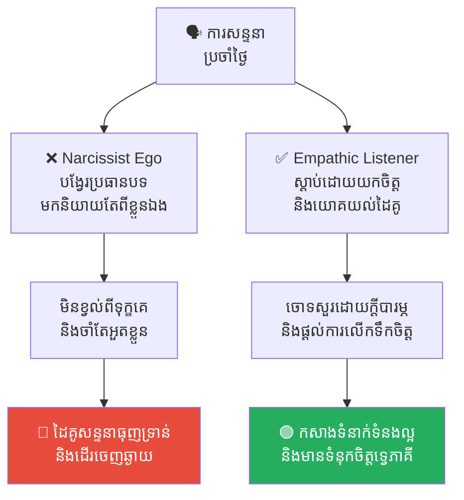
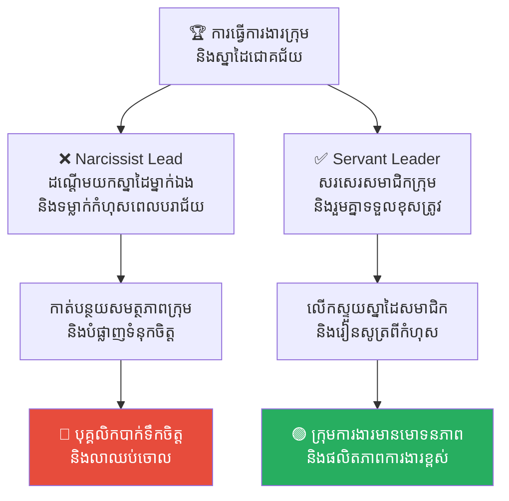
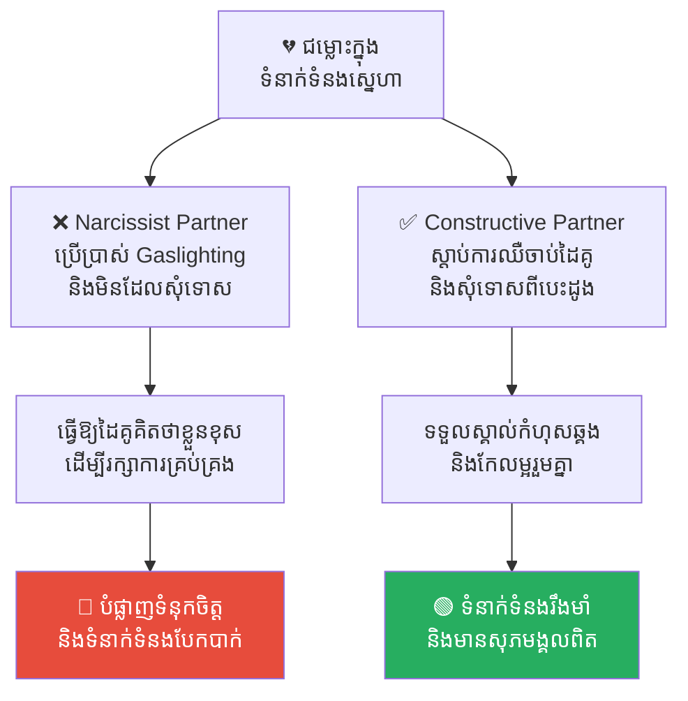
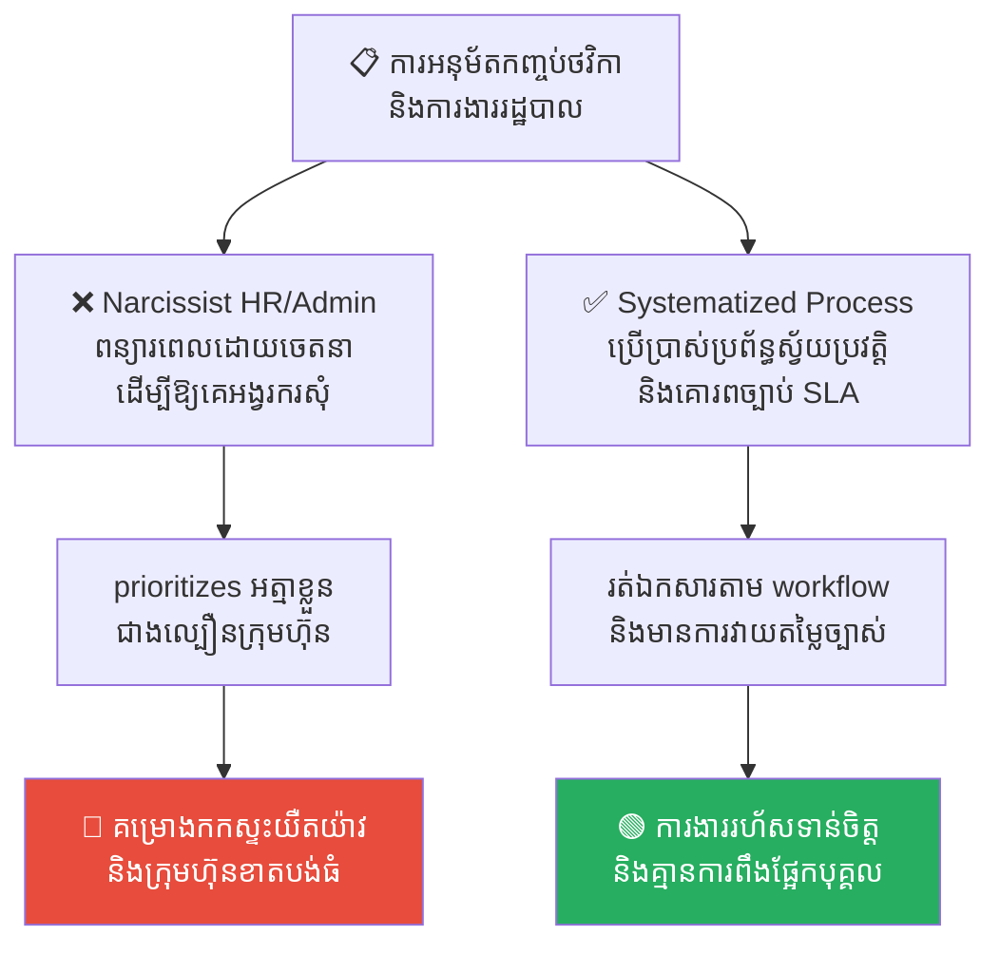
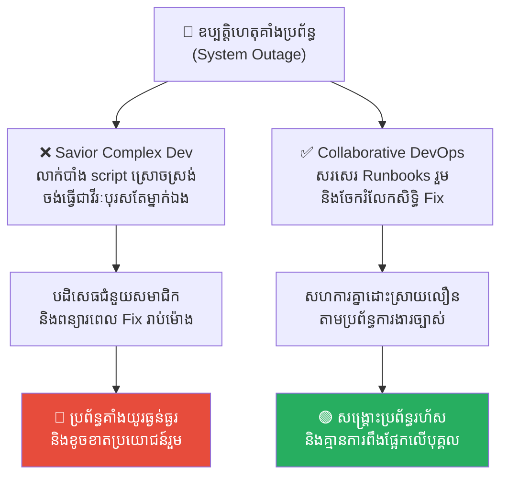

# Narcissism: The Ego Trap (ភាពវង្វេងនឹងខ្លួនឯង៖ អន្ទាក់នៃអត្មា)

**Author:** ichamrong  
**Date:** 2026-05-17  
**Tags:** #narcissism #dark-triad #gaslighting #toxic-leadership #psychology  
**Category:** Concepts  
**Read Time:** ~15 min  

---

## 📌 មាតិកា (Table of Contents)
- [សេចក្តីផ្តើម (Introduction)](#សេចក្តីផ្តើម-introduction)
- [១. បញ្ហា (The Issue): "កញ្ចក់ឆ្លុះតែរូបឯង" (The Self-Centered Mirror & Lack of Empathy)](#១-បញ្ហា-the-issue-កញ្ចក់ឆ្លុះតែរូបឯង-the-self-centered-mirror-lack-of-empathy)
- [២. ឧទាហរណ៍ជាក់ស្តែងក្នុងពិភពពិត (Real World Examples)](#២-ឧទាហរណ៍ជាក់ស្តែងក្នុងពិភពពិត)
  - [ឧទាហរណ៍ទី ១ — កម្រិតស្រាល៖ ការសន្ទនាប្រចាំថ្ងៃ និងការអួតពីខ្លួនឯង (The Self-Referencing Conversation)](#ឧទាហរណ៍ទី-១-កម្រិតស្រាល-ការសន្ទនាប្រចាំថ្ងៃ-និងការអួតពីខ្លួនឯង-the-self-referencing-conversation)
  - [ឧទាហរណ៍ទី ២ — កម្រិតមធ្យម៖ ការដណ្តើមស្នាដៃ និងការទម្លាក់កំហុសការងារ (Credit Stealing & Blame Shifting)](#ឧទាហរណ៍ទី-២-កម្រិតមធ្យម-ការដណ្តើមស្នាដៃ-និងការទម្លាក់កំហុសការងារ-credit-stealing-blame-shifting)
  - [ឧទាហរណ៍ទី ៣ — កម្រិតមធ្យម៖ ការគ្រប់គ្រងផ្លូវចិត្ត និងការមិនចេះសុំទោស (Gaslighting & The Refusal to Apologize)](#ឧទាហរណ៍ទី-៣-កម្រិតមធ្យម-ការគ្រប់គ្រងផ្លូវចិត្ត-និងការមិនចេះសុំទោស-gaslighting-the-refusal-to-apologize)
  - [ឧទាហរណ៍ទី ៤ — កម្រិតធ្ងន់៖ ការប្រើប្រាស់អំណាចរដ្ឋបាលដើម្បីឱ្យគេអង្វរករ (Administrative Gatekeeping & Blocking)](#ឧទាហរណ៍ទី-៤-កម្រិតធ្ងន់-ការប្រើប្រាស់អំណាចរដ្ឋបាលដើម្បីឱ្យគេអង្វរករ-administrative-gatekeeping-blocking)
  - [ឧទាហរណ៍ទី ៥ — កម្រិតធ្ងន់៖ អន្ទាក់ចង់ធ្វើជាវីរៈបុរសសង្គ្រោះប្រព័ន្ធតែម្នាក់ឯង (The Savior Complex in Outages)](#ឧទាហរណ៍ទី-៥-កម្រិតធ្ងន់-អន្ទាក់ចង់ធ្វើជាវីរៈបុរសសង្គ្រោះប្រព័ន្ធតែម្នាក់ឯង-the-savior-complex-in-outages)
- [៣. កត្តាជំរុញ៖ អំណាច តំណែង និងការបញ្ចើចបញ្ចើជុំវិញខ្លួន (The Aggravator: Power, Title, and Flattery)](#៣-កត្តាជំរុញ-អំណាច-តំណែង-និងការបញ្ចើចបញ្ចើជុំវិញខ្លួន-the-aggravator-power-title-and-flattery)
- [៤. ដំណោះស្រាយទូទៅ (The General Solution)](#៤-ដំណោះស្រាយទូទៅ-the-general-solution)
  - [យុទ្ធសាស្ត្រការពារខ្លួនពីបុគ្គល Narcissist (Strict Boundaries Setting)](#យុទ្ធសាស្ត្រការពារខ្លួនពីបុគ្គល-narcissist-strict-boundaries-setting)
  - [ការបណ្តុះបណ្តាលការដាក់ខ្លួន និងការស្តាប់ (Humility and Active Listening)](#ការបណ្តុះបណ្តាលការដាក់ខ្លួន-និងការស្តាប់-humility-and-active-listening)
- [សេចក្តីសន្និដ្ឋាន (Conclusion)](#សេចក្តីសន្និដ្ឋាន-conclusion)
- [Related Posts](#related-posts)

---

## សេចក្តីផ្តើម (Introduction)

**អន្ទាក់នៃអត្មា៖ យើងមើលឃើញតែខ្លួនឯង មិនខ្វល់ពីអ្នកដទៃ**

តើអ្នកធ្លាប់ឆ្ងល់ទេថា ហេតុអ្វីបានជាមនុស្សខ្លះតែងតែគិតថាខ្លួនឯងអស្ចារ្យជាងគេ ហើយមិនខ្វល់ពីអារម្មណ៍អ្នកដទៃទាល់តែសោះ ទោះបីជាពេលខ្លះទង្វើរបស់ពួកគេធ្វើឱ្យអ្នកដទៃឈឺចាប់ក៏ដោយ?

នេះមិនមែនមកពីពួកគេមិនដឹងខ្លួននោះទេ ប៉ុន្តែមកពីខួរក្បាល និងផ្នត់គំនិតរបស់ពួកគេកំពុងដំណើរការកម្មវិធីមួយឈ្មោះថា **Narcissism (ភាពវង្វេងនឹងខ្លួនឯង)**។ វាគឺជាអន្ទាក់ផ្លូវចិត្តដ៏កាចសាហាវដែលចងសោរមនុស្សឱ្យមើលឃើញតែខ្លួនឯង និងជាន់ឈ្លីគុណតម្លៃអ្នកដទៃដោយគ្មានក្តីមេត្តា។

---

## ១. បញ្ហា (The Issue): "កញ្ចក់ឆ្លុះតែរូបឯង" (The Self-Centered Mirror & Lack of Empathy)

**Narcissism** គឺជាទម្រង់នៃបុគ្គលិកលក្ខណៈដែលមនុស្សម្នាក់មាន ការវាយតម្លៃខ្លួនឯងខ្ពស់ជ្រុល, ត្រូវការការកោតសរសើរខ្លាំង, និង ខ្វះការយោគយល់ (Empathy Deficit) ដល់អ្នកដទៃទាល់តែសោះ។

```
❌ ផ្នត់គំនិត Narcissist៖ ខ្លួនឯងជាចំណុចកណ្តាល ──► ត្រូវការការលើកជើងជានិច្ច ──► ខ្វះការយោគយល់ (No Empathy)
✅ ផ្នត់គំនិតអ្នកដឹកនាំល្អ៖ គោរពអ្នកដទៃ ──► ស្តាប់ដោយយកចិត្តទុកដាក់ ──► លើកស្ទួយសមត្ថភាពក្រុមរួមគ្នា
```

និយាយឱ្យសាមញ្ញ៖
* ❌ ពួកគេមិនមែនជា «សមាជិកក្រុម» ដែលចង់ឃើញគ្រប់គ្នាជោគជ័យជាមួយគ្នានោះទេ។
* ✅ តាមពិត ពួកគេគឺជា «តួឯក» ដែលគិតថាពិភពលោកត្រូវតែវិលជុំវិញពួកគេ ហើយអ្នកដទៃគ្រាន់តែជា «ឧបករណ៍ ឬកម្រាលព្រំ» សម្រាប់ជួយលើកតម្កើងភាពអស្ចារ្យរបស់ពួកគេប៉ុណ្ណោះ។

---

## ២. ឧទាហរណ៍ជាក់ស្តែងក្នុងពិភពពិត

សូមពិនិត្យមើល **ឧទាហរណ៍ជាក់ស្តែងចំនួន ៥** បង្ហាញពីអាកប្បកិរិយារបស់មនុស្ស Narcissist នៅក្នុងស្ថានភាពផ្សេងៗគ្នា៖

---

### ឧទាហរណ៍ទី ១ — កម្រិតស្រាល៖ ការសន្ទនាប្រចាំថ្ងៃ និងការអួតពីខ្លួនឯង (The Self-Referencing Conversation)

**ស្ថានភាព៖** ការសន្ទនាកម្សាន្ត ឬការចែករំលែករឿងរ៉ាវលំបាកប្រចាំថ្ងៃរវាងមិត្តភក្តិ។

* **សកម្មភាព Low EQ (កំហុសឆ្គង)៖** នៅពេលអ្នកកំពុងនិយាយពីបញ្ហាលំបាករបស់អ្នក (ឧ. ឈឺ, ពិបាកចិត្តរឿងការងារ) ពួកគេមិនស្តាប់យកចិត្តទុកដាក់ឡើយ។ ពួកគេតែងតែបង្វែរប្រធានបទមកនិយាយពីខ្លួនឯងវិញភ្លាមៗ៖ *«អូ! ហ្នឹងធម្មតាទេ! បងកាលពីមុនជួបទុក្ខលំបាកជាងហ្នឹង ១០ ដងទៀត... ចុះរឿងបងវិញ ម្សិលមិញទើបតែទិញឡានថ្មីស្អាតណាស់...»*
* **សកម្មភាព High EQ (ដំណោះស្រាយ)៖** ស្តាប់ដៃគូសន្ទនាដោយក្តីបារម្ភ និងប្រើប្រាស់ **Active Listening**។ សួរនាំ និងលើកទឹកចិត្តដោយក្តីបារម្ភ៖ *«បងពិតជាសោកស្តាយណាស់ដែលឮរឿងនេះ។ តើពេលនេះប្អូនមានអារម្មណ៍យ៉ាងណាដែរ? តើបងអាចជួយអ្វីខ្លះបាន?»*
* **លទ្ធផល៖** ការបង្វែរសាច់រឿងនិយាយតែពីខ្លួនឯងធ្វើឱ្យដៃគូសន្ទនាធុញទ្រាន់ និងដើរចេញឆ្ងាយ។ ការស្តាប់ដោយក្តីបារម្ភជួយកសាងទំនាក់ទំនងល្អ និងកសាងទំនុកចិត្តទ្វេភាគី។



---

### ឧទាហរណ៍ទី ២ — កម្រិតមធ្យម៖ ការដណ្តើមស្នាដៃ និងការទម្លាក់កំហុសការងារ (Credit Stealing & Blame Shifting)

**ស្ថានភាព៖** ការធ្វើការងារជាក្រុម និងការទទួលស្គាល់ស្នាដៃនៅចំពោះមុខថ្នាក់លើ។

* **សកម្មភាព Low EQ (កំហុសឆ្គង)៖** ប្រសិនបើគម្រោងទទួលបានជោគជ័យ ពួកគេលោតទៅទទួលយកស្នាដៃទាំងអស់តែម្នាក់ឯងដោយគ្មានការអៀនខ្មាស៖ *«នេះជាស្នាដៃដឹកនាំរបស់ខ្ញុំផ្ទាល់!»* ដោយមិនសរសើរ ឬទទួលស្គាល់ការខិតខំរបស់ក្រុមឡើយ។ ផ្ទុយទៅវិញ បើមានកំហុសឆ្គង ពួកគេចង្អុលដៃបន្ទោសកូនចៅ ឬផ្នែកផ្សេងភ្លាមៗដើម្បីការពារតំណែងខ្លួនឯង។
* **សកម្មភាព High EQ (ដំណោះស្រាយ)៖** ដឹកនាំបែប **Servant Leadership**។ នៅពេលជោគជ័យ ផ្ទេរពានរង្វាន់ និងការសរសើរទៅកាន់សមាជិកក្រុម៖ *«ជោគជ័យនេះបានមកពីការលះបង់ និងការសរសេរកូដដ៏អស្ចារ្យរបស់ក្រុមការងារខ្ញុំទាំងមូល។»* នៅពេលបរាជ័យ ឈរឡើងទទួលខុសត្រូវរួម និងរួមគ្នាស្វែងរកដំណោះស្រាយ។
* **លទ្ធផល៖** ការដណ្តើមស្នាដៃ និងទម្លាក់កំហុសបំផ្លាញទំនុកចិត្តការងារ និងធ្វើឱ្យសមាជិកល្អៗលាឈប់។ ការលើកស្ទួយស្នាដៃសមាជិកជួយឱ្យក្រុមការងារមានមោទនភាព និងផលិតភាពការងារខ្ពស់។



---

### ឧទាហរណ៍ទី ៣ — កម្រិតមធ្យម៖ ការគ្រប់គ្រងផ្លូវចិត្ត និងការមិនចេះសុំទោស (Gaslighting & The Refusal to Apologize)

**ស្ថានភាព៖** ជម្លោះ ឬការយល់ច្រឡំនៅក្នុងទំនាក់ទំនងស្នេហា និងគ្រួសារ។

* **សកម្មភាព Low EQ (កំហុសឆ្គង)៖** ពេលខ្លួនធ្វើខុស ឬនិយាយស្តីអាក្រក់ៗប៉ះពាល់អារម្មណ៍ដៃគូ ពួកគេមិនដែលសុំទោសឡើយ។ ផ្ទុយទៅវិញ ពួកគេប្រើប្រាស់ល្បិច **Gaslighting** ធ្វើឱ្យដៃគូគិតថាខ្លួនឯងជាអ្នកខុសវិញ៖ *«មកពីឯងរករឿងពេកទើបខ្ញុំធ្វើបែបនេះ! ឯងឆ្កួតខ្លួនឯងទេតើ ខ្ញុំអត់ដែលនិយាយចឹងសោះ!»* ដើម្បីរក្សាការគ្រប់គ្រងផ្លូវចិត្ត។
* **សកម្មភាព High EQ (ដំណោះស្រាយ)៖** ទទួលស្គាល់កំហុស និងសុំទោសដោយភាពស្មោះត្រង់ពីបេះដូង៖ *«សុំទោសផងដែលបងបាននិយាយពាក្យមិនល្អប៉ះពាល់អារម្មណ៍អូនកាលពីម្សិលមិញ បងនឹងព្យាយាមមិនឱ្យកើតមានរឿងនេះបន្តទៀតឡើយ។»*
* **លទ្ធផល៖** ការប្រើ Gaslighting បំផ្លាញទំនុកចិត្ត និងធ្វើឱ្យទំនាក់ទំនងបែកបាក់ដោយស្ត្រេស។ ការទទួលស្គាល់កំហុស និងសុំទោសជួយឱ្យទំនាក់ទំនងរឹងមាំ និងមានសុភមង្គលពិតប្រាកដ។



---

### ឧទាហរណ៍ទី ៤ — កម្រិតធ្ងន់៖ ការប្រើប្រាស់អំណាចរដ្ឋបាលដើម្បីឱ្យគេអង្វរករ (Administrative Gatekeeping & Blocking)

**ស្ថានភាព៖** ការស្នើសុំអនុម័តកញ្ចប់ថវិកា (Budget) ឬសិទ្ធិចូលប្រើប្រាស់ប្រព័ន្ធ (System Access) ពីផ្នែករដ្ឋបាល/ធនធានមនុស្ស។

* **សកម្មភាព Low EQ (កំហុសឆ្គង)៖** ប្រធានផ្នែករដ្ឋបាលមានអត្តចរិត Narcissist ចូលចិត្តពន្យារពេល ឬបង្កកកិច្ចការដោយចេតនា ទោះបីជាឯកសារគ្រប់លក្ខខណ្ឌក៏ដោយ គ្រាន់តែចង់បង្ខំឱ្យប្រធានក្រុមដទៃត្រូវដើរចូលបន្ទប់មកជួប និយាយលើកជើង និងអង្វរករសុំសិទ្ធិពីខ្លួន ដើម្បីបម្រើអត្មា និងអារម្មណ៍ថា «ខ្លួនពិតជាសំខាន់ និងមានអំណាចខ្លាំង» នៅក្នុងក្រុមហ៊ុន។
* **សកម្មភាព High EQ (ដំណោះស្រាយ)៖** បង្កើតប្រព័ន្ធការងារស្វ័យប្រវត្ត (Automated Workflows) និងច្បាប់កិច្ចសន្យាសេវាកម្មច្បាស់លាស់ (**SLA - Service Level Agreement**)។ រាល់ការស្នើសុំត្រូវបានរត់ និងអនុម័តតាមលំហូរប្រព័ន្ធស្វ័យប្រវត្តតាមលក្ខខណ្ឌ ធានាគ្មានការពឹងផ្អែកលើអត្តចរិតបុគ្គលម្នាក់ឡើយ។
* **លទ្ធផល៖** ការរារាំងការងារដើម្បីបម្រើ Ego ធ្វើឱ្យគម្រោងកកស្ទះ យឺតយ៉ាវ និងក្រុមហ៊ុនខាតបង់ធំ។ ប្រព័ន្ធស្វ័យប្រវត្ត និង SLA ធានាការងាររហ័សទាន់ចិត្ត និងគ្មានការពឹងផ្អែកលើបុគ្គលម្នាក់ឡើយ។



---

### ឧទាហរណ៍ទី ៥ — កម្រិតធ្ងន់៖ អន្ទាក់ចង់ធ្វើជាវីរៈបុរសសង្គ្រោះប្រព័ន្ធតែម្នាក់ឯង (The Savior Complex in Outages)

**ស្ថានភាព៖** ម៉ាស៊ីនបម្រើសេវាស្នូល (Production DB) ជួបប្រទះ Bug និងគាំងដំណើរការនៅពាក់កណ្តាលយប់។

* **សកម្មភាព Low EQ (កំហុសឆ្គង)៖** Senior Developer ម្នាក់មានអត្តចរិត Narcissist និងមាន «Ego Savior Complex» ចូលមកដោះស្រាយបញ្ហា ប៉ុន្តែបដិសេធមិនចែករំលែក Script ស្រោចស្រង់ ឬសិទ្ធិចូលទៅកាន់ server ដល់ Developers ផ្សេងទៀតឡើយ ដោយចង់ឱ្យប្រព័ន្ធគាំងអូសបន្លាយដល់ពាក់កណ្តាលអធ្រាត្រ ដើម្បីឱ្យគ្រប់គ្នា (រួមទាំង CEO) សម្លឹងមើលមកខ្លួនជា «វីរៈបុរសសង្គ្រោះក្រុមហ៊ុនតែម្នាក់ឯង» និងទទួលបានការកោតសរសើរខ្ពស់នៅថ្ងៃស្អែក ទោះជាត្រូវខាតបង់ប្រយោជន៍ក្រុមហ៊ុនក៏ដោយ។
* **សកម្មភាព High EQ (ដំណោះស្រាយ)៖** បង្កើតវប្បធម៌សហការ **Collaborative DevOps & Shared Runbooks**។ រាល់ការដោះស្រាយបញ្ហាគ្រោះអាសន្ន ត្រូវតែមានចងក្រងឯកសារដោះស្រាយរួម និងចែករំលែកសិទ្ធិចូលទៅកាន់ Server ដល់ក្រុម On-call ទាំងអស់ ធានាថាការសង្គ្រោះប្រព័ន្ធគឺធ្វើឡើងជាក្រុមប្រកបដោយប្រសិទ្ធភាពខ្ពស់បំផុត។
* **លទ្ធផល៖** អន្ទាក់ចង់ធ្វើជាវីរៈបុរសរបស់បុគ្គលម្នាក់ធ្វើឱ្យប្រព័ន្ធគាំងយូរ ខូចខាតប្រយោជន៍រួម និងខាតបង់ថវិកា។ កិច្ចសហការ និង Runbooks រួមជួយសង្គ្រោះប្រព័ន្ធបានរហ័ស និងគ្មានការពឹងផ្អែកលើបុគ្គលម្នាក់ឡើយ។



---

## ៣. កត្តាជំរុញ៖ អំណាច តំណែង និងការបញ្ចើចបញ្ចើជុំវិញខ្លួន (The Aggravator: Power, Title, and Flattery)

Narcissism អាចមានប្រភពខ្លះពីសភាវៈផ្លូវចិត្តផ្ទាល់ខ្លួន ប៉ុន្តែវាកាន់តែរីកដុះដាលខ្លាំងនៅក្នុងស្ថាប័នដោយសារ៖

1. **អំណាច និងតំណែងជាជីជាតិ (Power as a Catalyst)៖** នៅពេលបុគ្គល Narcissist ក្លាយជាមេដឹកនាំ ឬមានអំណាចក្នុងដៃ ពួកគេមានអារម្មណ៍ថាគ្មានអ្នកណាហ៊ានប៉ះពាល់ពួកគេបានឡើយ។ នេះធ្វើឱ្យអាកប្បកិរិយាជាន់ឈ្លី និងមើលស្រាលអ្នកដទៃកាន់តែបញ្ចេញមកក្រៅយ៉ាងខ្លាំង។
2. **អ្នកជុំវិញខ្លួនចាំតែបញ្ចើចបញ្ចើ (Toxic Flattery / Yes-Men Culture)៖** ប្រសិនបើអ្នកនៅជុំវិញខ្លួនពួកគេ (កូនចៅ, មិត្តភក្តិ) តែងតែខ្លាចរអា និងចាំតែយល់ស្របតាមពួកគេជានិច្ច នោះវាកាន់តែពង្រឹងជំនឿខុសឆ្គងរបស់ពួកគេថា *«ខ្លួនពិតជាអស្ចារ្យ តែងតែត្រូវជានិច្ច និងមានសិទ្ធិធ្វើបាបអ្នកដទៃបាន»*។

---

## ៤. ដំណោះស្រាយទូទៅ (The General Solution)

ការទប់ទល់ជាមួយមនុស្ស Narcissist គឺពិបាកណាស់ ព្រោះពួកគេមិនដែលគិតថាខ្លួនឯងមានបញ្ហាឡើយ។ ប៉ុន្តែខាងក្រោមនេះជាអ្វីដែលអ្នកអាចធ្វើបាន៖

### យុទ្ធសាស្ត្រការពារខ្លួនពីបុគ្គល Narcissist (Strict Boundaries Setting)
* **ដាក់ព្រំដែនឱ្យច្បាស់ (Set Strict Boundaries)៖** កុំឱ្យពួកគេរំលោភសិទ្ធិ ឬប្រើប្រាស់អ្នកជាឧបករណ៍បាន។ ប្រសិនបើពួកគេនិយាយស្តីមើលងាយ ចូរប្រាប់ពួកគេឱ្យចំៗថាអ្នកមិនទទួលយកការនិយាយស្តីបែបនេះទេ រួចដើរចេញភ្លាម។
* **កុំរំពឹងចង់បានការយោគយល់ (Don't Expect Empathy)៖** ត្រូវទទួលស្គាល់ការពិតថា ពួកគេមិនមានសមត្ថភាពយល់ចិត្ត ឬឈឺចាប់ជាមួយអារម្មណ៍អ្នកឡើយ។ កុំខាតពេលព្យាយាមពន្យល់ពីការឈឺចាប់របស់អ្នកប្រាប់ពួកគេ ព្រោះវានឹងមិនបានផលអ្វីឡើយ។
* **កត់ត្រាទុកជាភស្តុតាង (Keep Records)៖** ជាពិសេសនៅកន្លែងធ្វើការ ចូរកត់ត្រារាល់ការសម្រេចចិត្ត ឬកិច្ចការងារតាមរយៈអ៊ីមែលជាភស្តុតាង ដើម្បីការពារខ្លួននៅពេលពួកគេព្យាយាមទម្លាក់កំហុសមកលើអ្នក។

### ការបណ្តុះបណ្តាលការដាក់ខ្លួន និងការស្តាប់ (Humility and Active Listening)
* **ហ្វឹកហាត់ការដាក់ខ្លួន (Practice Humility)៖** ត្រូវចាំថា ជោគជ័យណាមួយក៏តែងតែមានការចូលរួមចំណែកពីសមាជិកដទៃដែរ។ រៀនសរសើរ និងទទួលស្គាល់ស្នាដៃអ្នកដទៃដោយចិត្តទូលាយ។
* **ហ្វឹកហាត់ការស្តាប់ដោយការយល់ចិត្ត (Active & Empathic Listening)៖** ពេលនិយាយជាមួយអ្នកដទៃ ចូរស្តាប់ដោយយកចិត្តទុកដាក់ និងចង់ដឹងពីអារម្មណ៍របស់គេពិតប្រាកដ ជាជាងស្តាប់គ្រាន់តែដើម្បីរង់ចាំវេនខ្លួនឯងនិយាយអួត។

---

## សេចក្តីសន្និដ្ឋាន (Conclusion)

**ភាពអស្ចារ្យពិតប្រាកដរបស់មនុស្សម្នាក់ មិនមែនកើតចេញពីការជាន់ឈ្លីអ្នកដទៃដើម្បីឱ្យខ្លួនឯងមើលទៅខ្ពស់នោះឡើយ។** ភាពអស្ចារ្យ និងមានតម្លៃជាទីគោរពបំផុត គឺកើតចេញពីសមត្ថភាពក្នុងការបន្ទាបខ្លួន យល់ចិត្ត និងលើកស្ទួយអ្នកនៅជុំវិញខ្លួនឱ្យខ្ពស់ឡើង និងឆ្លាតវៃទៅជាមួយគ្នាទាំងអស់គ្នា។

---

## Related Posts

* **[03-science-of-communication-eq-flaws.md](./03-science-of-communication-eq-flaws.md)** — ការវិភាគលើចំណុចខ្វះ EQ ទាំង ១០ ក្នុងកិច្ចសន្ទនា។
* **[12-multiplier-leadership.md](./12-multiplier-leadership.md)** — របៀបដែលមេដឹកនាំ Multiplier ដោះលែងសមត្ថភាពក្រុមការងារ។
* **[16-workplace-bullying-and-the-abuse-of-power.md](./16-workplace-bullying-and-the-abuse-of-power.md)** — ការគំរាមកំហែងនៅកន្លែងធ្វើការ៖ អន្ទាក់នៃអំណាច។
* **[17-everyday-sadism-and-the-joy-of-cruelty.md](./17-everyday-sadism-and-the-joy-of-cruelty.md)** — ចំណូលចិត្តធ្វើបាបអ្នកដទៃ៖ អន្ទាក់នៃភាពឃោរឃៅ។

---

*Last updated: 2026-05-26*
