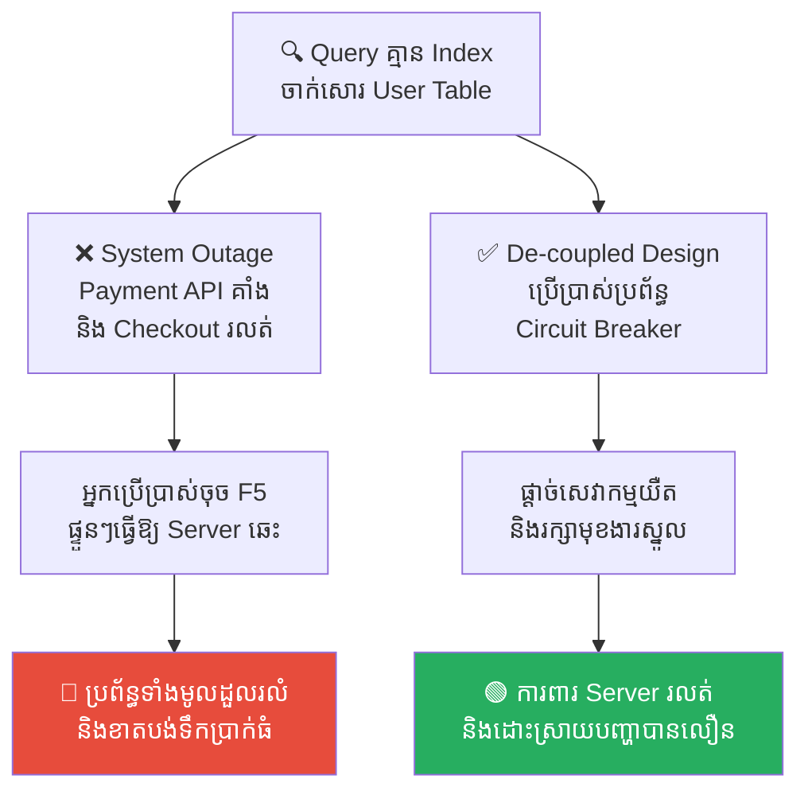
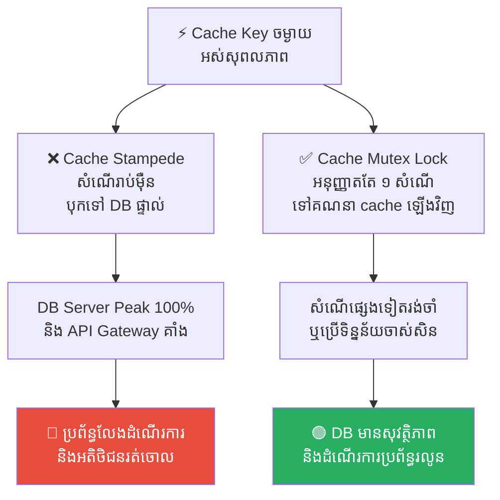
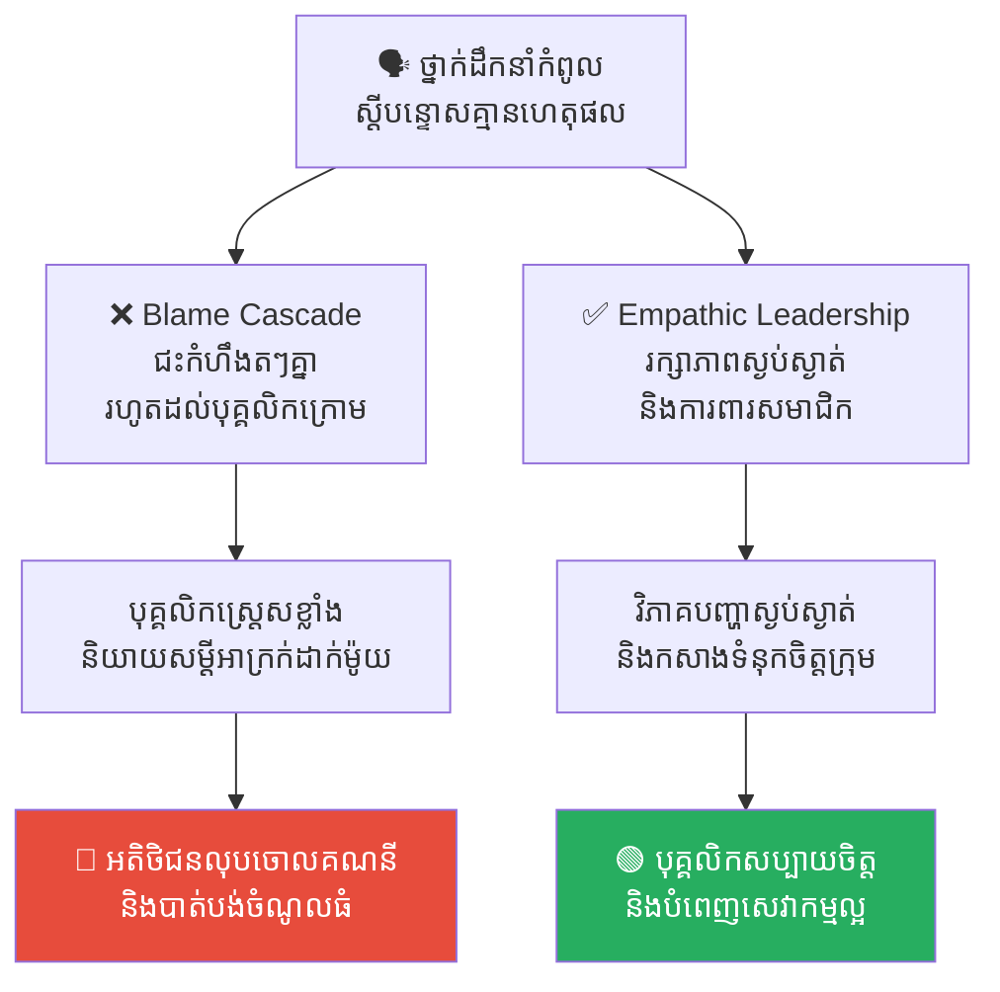
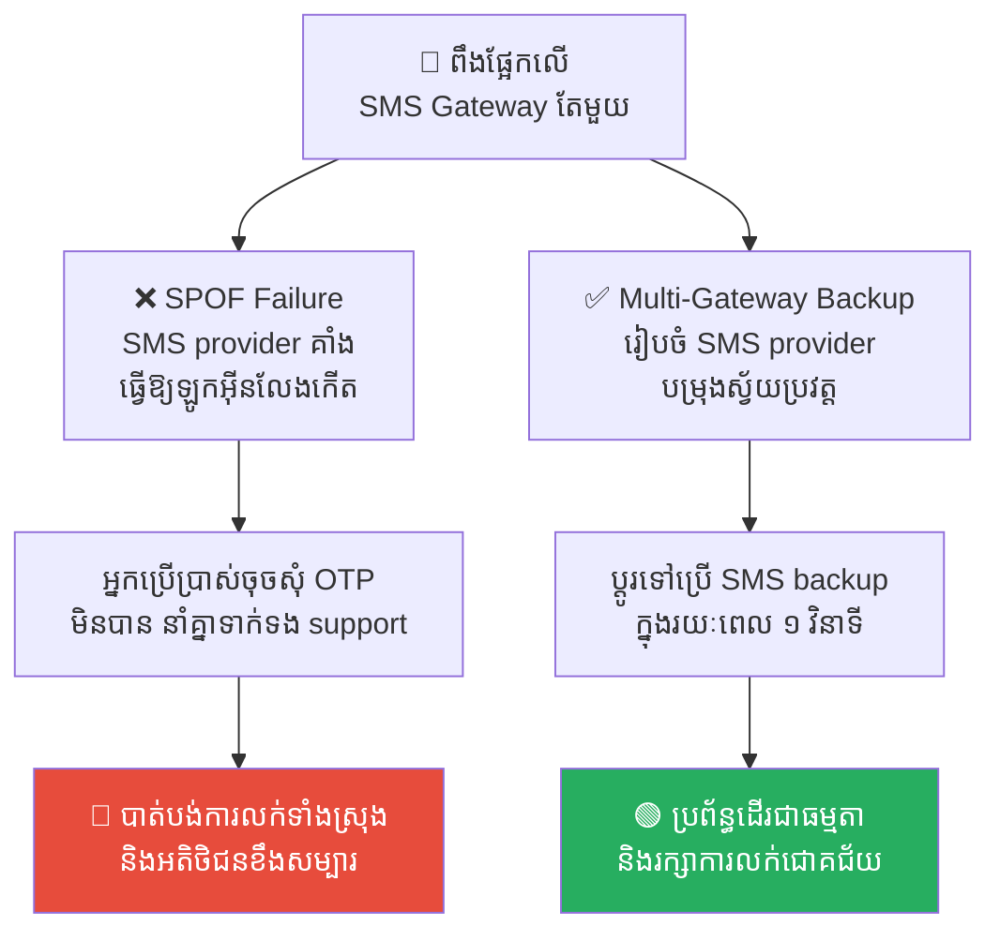
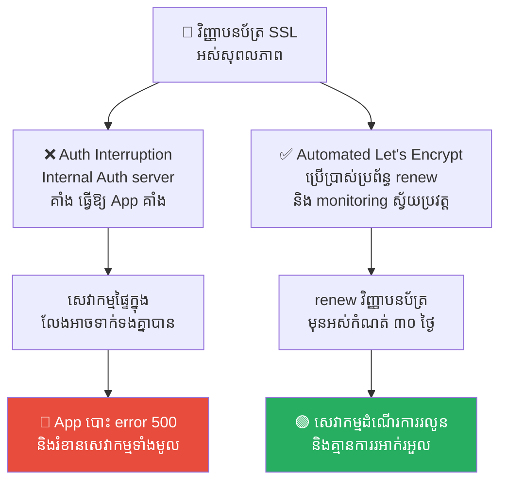

# The Domino Effect: How Small Failures Collapse Large Systems (ឥទ្ធិពលដូមីណូ៖ របៀបដែលកំហុសតូចតាចរុញរំលំប្រព័ន្ធដ៏ធំ)

**Author:** ichamrong  
**Date:** 2026-05-17  
**Tags:** #domino-effect #cascading-failures #system-design #circuit-breaker #root-cause  
**Category:** Concepts  
**Read Time:** ~15 min  

---

## 📌 មាតិកា (Table of Contents)
- [សេចក្តីផ្តើម (Introduction)](#សេចក្តីផ្តើម-introduction)
- [១. អ្វីទៅជាឥទ្ធិពលដូមីណូ ឬការដួលរលំតៗគ្នា? (What is the Domino Effect or Cascading Failure?)](#១-អ្វីទៅជាឥទ្ធិពលដូមីណូ-ឬការដួលរលំតៗគ្នា-what-is-the-domino-effect-or-cascading-failure)
- [២. ឧទាហរណ៍ជាក់ស្តែងក្នុងពិភពបច្ចេកវិទ្យា និងការគ្រប់គ្រង (Real World Examples)](#២-ឧទាហរណ៍ជាក់ស្តែងក្នុងពិភពបច្ចេកវិទ្យា-និងការគ្រប់គ្រង)
  - [ឧទាហរណ៍ទី ១ — កម្រិតស្រាល (បច្ចេកទេស)៖ ការកកស្ទះទិន្នន័យនាំឱ្យម៉ាស៊ីនបម្រើគាំង (The Database Lock Outage Cascade)](#ឧទាហរណ៍ទី-១-កម្រិតស្រាល-បច្ចេកទេស-ការកកស្ទះទិន្នន័យនាំឱ្យម៉ាស៊ីនបម្រើគាំង-the-database-lock-outage-cascade)
  - [ឧទាហរណ៍ទី ២ — កម្រិតមធ្យម (បច្ចេកទេស)៖ ការបាត់បង់ Cache នាំឱ្យ DB ឆេះ (The Cache Stampede Disaster)](#ឧទាហរណ៍ទី-២-កម្រិតមធ្យម-បច្ចេកទេស-ការបាត់បង់-cache-នាំឱ្យ-db-ឆេះ-the-cache-stampede-disaster)
  - [ឧទាហរណ៍ទី ៣ — កម្រិតមធ្យម (គ្រប់គ្រង)៖ វដ្តនៃការជះកំហឹង និងការបាត់បង់អតិថិជន (The Emotional Blame Cascade)](#ឧទាហរណ៍ទី-៣-កម្រិតមធ្យម-គ្រប់គ្រង-វដ្តនៃការជះកំហឹង-និងការបាត់បង់អតិថិជន-the-emotional-blame-cascade)
  - [ឧទាហរណ៍ទី ៤ — កម្រិតធ្ងន់ (បច្ចេកទេស)៖ ភាពអាស្រ័យលើច្រកទ្វារតែមួយ (The Single Point of Failure Outage)](#ឧទាហរណ៍ទី-៤-កម្រិតធ្ងន់-បច្ចេកទេស-ភាពអាស្រ័យលើច្រកទ្វារតែមួយ-the-single-point-of-failure-outage)
  - [ឧទាហរណ៍ទី ៥ — កម្រិតធ្ងន់ (បច្ចេកទេស)៖ ការភ្លេចអាប់ដេតវិញ្ញាបនប័ត្រ SSL (The Forgotten SSL Certificate Expiration)](#ឧទាហរណ៍ទី-៥-កម្រិតធ្ងន់-បច្ចេកទេស-ការភ្លេចអាប់ដេតវិញ្ញាបនប័ត្រ-ssl-the-forgotten-ssl-certificate-expiration)
- [៣. កត្តាជម្រុញ៖ ភាពអាស្រ័យគ្នាស្អិតរមួត និងកង្វះការត្រួតពិនិត្យ (The Aggravator: Tightly Coupled Architecture & Lack of Observability)](#៣-កត្តាជម្រុញ-ភាពអាស្រ័យគ្នាស្អិតរមួត-និងកង្វះការត្រួតពិនិត្យ-the-aggravator-tightly-coupled-architecture-lack-of-observability)
- [៤. ដំណោះស្រាយទូទៅ (The General Solution)](#៤-ដំណោះស្រាយទូទៅ-the-general-solution)
  - [ការបំបែកភាពអាស្រ័យ និងការប្រើប្រាស់ Message Queue (Decoupling & Asynchronous Processing)](#ការបំបែកភាពអាស្រ័យ-និងការប្រើប្រាស់-message-queue-decoupling-asynchronous-processing)
  - [ការប្រើប្រាស់ Circuit Breaker (កុងតាក់ផ្តាច់ចរន្តស្វ័យប្រវត្ត)](#ការប្រើប្រាស់-circuit-breaker-កុងតាក់ផ្តាច់ចរន្តស្វ័យប្រវត្ត)
  - [ការធ្វើឱ្យមានប្រព័ន្ធបម្រុង និងការត្រួតពិនិត្យ (Redundancy & Active Monitoring)](#ការធ្វើឱ្យមានប្រព័ន្ធបម្រុង-និងការត្រួតពិនិត្យ-redundancy-active-monitoring)
- [សេចក្តីសន្និដ្ឋាន (Conclusion)](#សេចក្តីសន្និដ្ឋាន-conclusion)
- [Related Posts](#related-posts)

---

## សេចក្តីផ្តើម (Introduction)

ធ្លាប់ឃើញគេរៀបកូនអុកដូមីណូ (Dominoes) រាប់ពាន់គ្រាប់ជាជួរដែរឬទេ? កូនអុកនីមួយៗឈរយ៉ាងរឹងមាំ និងមានរបៀបរៀបរយ។ ប៉ុន្តែគ្រាន់តែអ្នកយកចង្អុលដៃទៅប៉ះផ្តួលកូនអុកទីមួយស្រាលៗ វានឹងរុញផ្តួលកូនអុកទីពីរ ទីបី បន្តបន្ទាប់គ្នា រហូតដល់កូនអុករាប់ពាន់គ្រាប់នោះដួលរលំដល់ដីទាំងអស់ក្នុងរយៈពេលប៉ុន្មានវិនាទី។

នៅក្នុងការងារ អាជីវកម្ម និងប្រព័ន្ធបច្ចេកវិទ្យា **ឥទ្ធិពលដូមីណូ (The Domino Effect ឬ Cascading Failure)** គឺជាបាតុភូតដ៏គ្រោះថ្នាក់បំផុត ដែលកំហុសតូចតាចមួយនៅដើមទី អាចបង្កជាមហន្តរាយដ៏ធំធេងដល់ប្រព័ន្ធទាំងមូល។

---

## ១. អ្វីទៅជាឥទ្ធិពលដូមីណូ ឬការដួលរលំតៗគ្នា? (What is the Domino Effect or Cascading Failure?)

**ឥទ្ធិពលដូមីណូ** គឺជាសង្វាក់នៃប្រតិកម្ម (Chain Reaction) ដែលកើតឡើងនៅពេលដែលព្រឹត្តិការណ៍មួយបង្កឱ្យមានព្រឹត្តិការណ៍មួយទៀតកើតឡើងបន្តបន្ទាប់គ្នា។ លក្ខណៈពិសេសរបស់វាគឺ **«ភាពអាស្រ័យគ្នាស្អិតរមួត (Tightly Coupled)»**។ ប្រសិនបើប្រព័ន្ធ (A) ដួលរលំ វានឹងទាញប្រព័ន្ធ (B) ឱ្យរលំតាម ហើយ (B) នឹងទាញ (C) បន្តទៀត។

អ្វីដែលគួរឱ្យខ្លាចនោះគឺ កូនអុកដូមីណូមួយគ្រាប់ អាចមានកម្លាំងរុញផ្តួលកូនអុកមួយទៀតដែលមានទំហំធំជាងវាដល់ទៅ ១.៥ ដង។ ដូច្នេះ កំហុសតូចមួយ មិនត្រឹមតែបង្កើតកំហុសថ្មីទេ តែវា **ពង្រីកទំហំ (Amplification)** នៃកំហុសនោះឱ្យកាន់តែធំទៅៗ ឥតឈប់ឈរ។

---

## ២. ឧទាហរណ៍ជាក់ស្តែងក្នុងពិភពបច្ចេកវិទ្យា និងការគ្រប់គ្រង

សូមពិនិត្យមើល **ឧទាហរណ៍ជាក់ស្តែងចំនួន ៥** បង្ហាញពីរបៀបដែលកំហុសតូចតាចដួលរលំប្រព័ន្ធធំ និងវិធីទប់ស្កាត់៖

---

### ឧទាហរណ៍ទី ១ — កម្រិតស្រាល (បច្ចេកទេស)៖ ការកកស្ទះទិន្នន័យនាំឱ្យម៉ាស៊ីនបម្រើគាំង (The Database Lock Outage Cascade)

**ស្ថានភាព៖** កម្មវិធី E-Commerce ដំណើរការលក់ទំនិញប្រចាំថ្ងៃ។

* **សកម្មភាព Low EQ (កំហុសឆ្គង)៖** Developer ភ្លេចសរសេរ Index លើ Query ស្វែងរកទិន្នន័យ (Database Query)។ ពេលមានសំណើច្រើន Query នោះចាប់ផ្តើមដំណើរការយឺត និងចាក់សោរតារាងទិន្នន័យ (User Table Lock) ធ្វើឱ្យប្រព័ន្ធ Payment API គាំង ហើយប្រព័ន្ធ Checkout រលត់ទាំងស្រុង។ អតិថិជននាំគ្នាចុច Refresh (F5) ផ្ទួនៗ ធ្វើឱ្យ Server ឡើងកម្តៅខ្លាំង និងឆេះរលត់ម៉ាស៊ីនទាំងស្រុង។
* **សកម្មភាព High EQ (ដំណោះស្រាយ)៖** អនុវត្ត **De-coupled Architecture** និងប្រើប្រាស់ប្រព័ន្ធ **Circuit Breaker**។ កំណត់ Index លើ Database ឱ្យបានត្រឹមត្រូវ។ ពេលប្រព័ន្ធ DB ដំណើរការយឺត Circuit Breaker នឹងលោតកាត់ផ្តាច់សេវាកម្មដែលយឺតភ្លាមៗ (Fail Fast) និងបង្ហាញសារ «ប្រព័ន្ធកំពុងមមាញឹក» ដើម្បីការពារកុំឱ្យ Server ទាំងមូលត្រូវគាំងរលត់។
* **លទ្ធផល៖** ការរំលង Index និង Circuit Breaker ធ្វើឱ្យប្រព័ន្ធទាំងមូលដួលរលំ និងបាត់បង់ការលក់។ ការ de-couple ប្រព័ន្ធការពារ Server រលត់ និងរក្សាមុខងារស្នូលឱ្យនៅរស់ជានិច្ច។

---

### ឧទាហរណ៍ទី ២ — កម្រិតមធ្យម (បច្ចេកទេស)៖ ការបាត់បង់ Cache នាំឱ្យ DB ឆេះ (The Cache Stampede Disaster)

**ស្ថានភាព៖** គេហទំព័រព័ត៌មានដ៏ល្បីល្បាញដែលមានអ្នកចូលមើលរាប់សែននាក់ក្នុងមួយវិនាទី។

* **សកម្មភាព Low EQ (កំហុសឆ្គង)៖** ប្រព័ន្ធកំណត់ពេលវេលាផុតកំណត់ Cache (Cache Expiry) នៃព័ត៌មានក្តៅគគុកចម្បង ឱ្យផុតកំណត់ក្នុងពេលតែមួយ។ ស្រាប់តែ Cache នោះបាត់បង់ (Cache Miss) ធ្វើឱ្យសំណើ (Requests) រាប់ម៉ឺនបុកទម្លុះទៅកាន់ Database Server ផ្ទាល់ក្នុងវិនាទីតែមួយ (Cache Stampede) ធ្វើឱ្យ DB server peak 100% គាំង Gateway និងគេហទំព័រទាំងមូលរលត់លែងដំណើរការ។
* **សកម្មភាព High EQ (ដំណោះស្រាយ)៖** ប្រើប្រាស់យន្តការ **Cache Mutex Lock (ឬ Semaphore)**។ ពេល Cache ផុតកំណត់ អនុញ្ញាតឱ្យតែសំណើដំបូងគេ ១ គត់ទៅទាញទិន្នន័យពី DB យកមកគណនា និងសរសេរចូល cache ឡើងវិញ ចំណែកសំណើដទៃទៀតត្រូវបានបង្ខំឱ្យរង់ចាំ ឬប្រើប្រាស់ទិន្នន័យចាស់បណ្តោះអាសន្នសិន ដើម្បីការពារ DB។
* **លទ្ធផល៖** ការរំលង Mutex Lock ធ្វើឱ្យ DB ឆេះរលត់ពេលបាត់បង់ cache។ យន្តការ Mutex Lock ការពារ DB ឱ្យមានសុវត្ថិភាព និងដំណើរការប្រព័ន្ធរលូនល្អឥតខ្ចោះ។

---

### ឧទាហរណ៍ទី ៣ — កម្រិតមធ្យម (គ្រប់គ្រង)៖ វដ្តនៃការជះកំហឹង និងការបាត់បង់អតិថិជន (The Emotional Blame Cascade)

**ស្ថានភាព៖** ទំនាក់ទំនងការងារផ្ទៃក្នុង និងបរិយាកាសសេវាកម្មអតិថិជន។

* **សកម្មភាព Low EQ (កំហុសឆ្គង)៖** អគ្គនាយកខឹងរឿងចំណូលធ្លាក់ចុះ ក៏ជះកំហឹង និងស្តីបន្ទោសប្រធានផ្នែកដោយគ្មានហេតុផល។ ប្រធានផ្នែកស្ត្រេស ក៏យកកំហឹងនោះទៅ micromanage និងគំរាមកំហែងប្រធានក្រុម។ ប្រធានក្រុមភ័យខ្លាច ក៏ទៅបង្ខំ និងស្តីបន្ទោសបុគ្គលិកផ្នែក Support។ បុគ្គលិកបាក់ទឹកចិត្ត ក៏និយាយសម្តីអាក្រក់ និងព្រងើយកន្តើយដាក់អតិថិជន ធ្វើឱ្យអតិថិជនខឹងសម្បារ និងនាំគ្នាលុបចោលគណនីប្រើប្រាស់ទាំងអស់។
* **សកម្មភាព High EQ (ដំណោះស្រាយ)៖** អនុវត្ត **Empathic Leadership** និងសុវត្ថិភាពផ្លូវចិត្ត។ ថ្នាក់ដឹកនាំគ្រប់ជាន់ថ្នាក់ត្រូវធ្វើជា «ឆ័ត្រការពារ» ត្រង និងចម្រោះរាល់កំហឹង និងសម្ពាធថ្នាក់លើចោលទាំងអស់។ រៀបចំការវិភាគបញ្ហាស្ងប់ស្ងាត់ និងកសាងទំនុកចិត្តក្រុមការងារ ដើម្បីឱ្យបុគ្គលិកបំពេញការងារសប្បាយចិត្ត និងបម្រើអតិថិជនបានល្អបំផុត។
* **លទ្ធផល៖** វដ្តជះកំហឹង (Blame Cascade) បំផ្លាញវប្បធម៌ការងារ និងបាត់បង់អតិថិជនធំ។ ភាពជាអ្នកដឹកនាំយល់ចិត្តជួយរក្សាបរិយាកាសការងារវិជ្ជមាន និងរក្សាចំណូលក្រុមហ៊ុនប្រកបដោយស្ថិរភាព។

---

### ឧទាហរណ៍ទី ៤ — កម្រិតធ្ងន់ (បច្ចេកទេស)៖ ភាពអាស្រ័យលើច្រកទ្វារតែមួយ (The Single Point of Failure Outage)

**ស្ថានភាព៖** ប្រព័ន្ធចុះឈ្មោះ និងឡូកអ៊ីន (Authentication Engine) របស់កម្មវិធីធនាគារឌីជីថល។

* **សកម្មភាព Low EQ (កំហុសឆ្គង)៖** ប្រព័ន្ធធនាគារពឹងផ្អែកទាំងស្រុងលើ «SMS Gateway API តែមួយគត់» សម្រាប់ការផ្ញើលេខកូដ OTP ដើម្បីឡូកអ៊ីន។ ថ្ងៃមួយ SMS provider នោះជួបប្រទះការដាច់ចរន្តអគ្គិសនី ធ្វើឱ្យគ្មានអតិថិជនណាម្នាក់អាចទទួលបាន OTP ឡូកអ៊ីនចូលប្រើប្រាស់ App ធនាគារបានឡើយ ធ្វើឱ្យបាត់បង់ការលក់ទាំងស្រុង និងអតិថិជនខឹងសម្បារសម្រុកទៅ Support គាំងប្រព័ន្ធបន្ថែម។
* **សកម្មភាព High EQ (ដំណោះស្រាយ)៖** រៀបចំឱ្យមានប្រព័ន្ធបម្រុងស្វ័យប្រវត្ត (**Multi-Gateway Redundancy**)។ ភ្ជាប់ទៅកាន់ SMS Providers ៣ ផ្សេងគ្នា។ ពេល Gateway ទីមួយគាំង ប្រព័ន្ធដកដូមីណូនេះចោល និងប្តូរទៅប្រើ SMS Provider ទីពីរស្វ័យប្រវត្តក្នុងរយៈពេល ១ វិនាទី ដើម្បីរក្សាដំណើរការឡូកអ៊ីន។
* **លទ្ធផល៖** ភាពអាស្រ័យលើច្រកទ្វារតែមួយ (SPOF) ងាយនឹងធ្វើឱ្យប្រព័ន្ធទាំងមូលគាំងពេលជួបបញ្ហា។ ប្រព័ន្ធបម្រុងស្វ័យប្រវត្តធានាដំណើរការអាជីវកម្មជាប់ជានិច្ច និងគ្មានហានិភ័យ។

---

### ឧទាហរណ៍ទី ៥ — កម្រិតធ្ងន់ (បច្ចេកទេស)៖ ការភ្លេចអាប់ដេតវិញ្ញាបនប័ត្រ SSL (The Forgotten SSL Certificate Expiration)

**ស្ថានភាព៖** សេវាកម្មផ្ទៀងផ្ទាត់សិទ្ធិផ្ទៃក្នុង (Internal Authentication Service) នៃប្រព័ន្ធ Microservices។

* **សកម្មភាព Low EQ (កំហុសឆ្គង)៖** ក្រុមការងារបដិសេធមិនប្រើប្រាស់ប្រព័ន្ធ renew វិញ្ញាបនប័ត្រស្វ័យប្រវត្តឡើយ។ ថ្ងៃមួយ វិញ្ញាបនប័ត្រ SSL (SSL Certificate) នៃ auth server ផ្ទៃក្នុងមួយបានផុតកំណត់។ សេវាកម្ម Microservices ទាំងអស់លែងអាចទាក់ទងគ្នាបាន ធ្វើឱ្យ App ទាំងមូលបោះ Error 500 គាំងដំណើរការសេវាកម្មទាំងមូលរបស់ក្រុមហ៊ុន។
* **សកម្មភាព High EQ (ដំណោះស្រាយ)៖** ប្រើប្រាស់ប្រព័ន្ធស្វ័យប្រវត្ត **Automated Let's Encrypt** រួមជាមួយប្រព័ន្ធត្រួតពិនិត្យសកម្ម (Active Monitoring Alerts)។ ប្រព័ន្ធនឹងធ្វើការ renew វិញ្ញាបនប័ត្រដោយស្វ័យប្រវត្តមុនរយៈពេលផុតកំណត់ ៣០ ថ្ងៃ និងបាញ់សារព្រមានទៅកាន់ Slack របស់ក្រុម On-call ភ្លាមៗបើជួបបញ្ហា។
* **លទ្ធផល៖** ការភ្លេច renew វិញ្ញាបនប័ត្រ SSL បង្កគ្រោះមហន្តរាយដល់ប្រព័ន្ធទាំងមូលដោយរអាក់រអួលសេវាកម្ម។ ប្រព័ន្ធស្វ័យប្រវត្ត និង monitoring ធានាសេវាកម្មដំណើរការរលូន និងមានស្ថិរភាពខ្ពស់។

---

## ៣. កត្តាជម្រុញ៖ ភាពអាស្រ័យគ្នាស្អិតរមួត និងកង្វះការត្រួតពិនិត្យ (The Aggravator: Tightly Coupled Architecture & Lack of Observability)

ហេតុអ្វីបានជាឥទ្ធិពលដូមីណូងាយនឹងកើតមាន និងបំផ្លាញប្រព័ន្ធធំៗបាន?

1. **ស្ថាបត្យកម្មអាស្រ័យគ្នាស្អិតរមួត (Tightly Coupled Architecture)៖** ប្រព័ន្ធត្រូវបានរចនាឡើងដោយគ្មានការបែងចែកព្រំដែនច្បាស់លាស់។ ប្រសិនបើសេវាកម្ម A ជួបបញ្ហា វានឹងអូសទាញសេវាកម្ម B, C, D ឱ្យគាំងទៅជាមួយគ្នាភ្លាមៗដោយគ្មានយន្តការការពារខ្លួន (Fail-Safe)។
2. **កង្វះការត្រួតពិនិត្យ និងការព្រមាន (Lack of Observability)៖** ក្រុមហ៊ុនគ្មានប្រព័ន្ធ Dashboard សម្រាប់បង្ហាញទិន្នន័យ (CPU, Memory, API latency) និងគ្មានប្រព័ន្ធ Alerting ព្រមានឡើយ។ ពួកគេដឹងថាប្រព័ន្ធគាំង លុះត្រាតែអតិថិជនទូរស័ព្ទមកជេរប្រមាថ ដែលធ្វើឱ្យកំហុសតូចតាចមានពេលរីករាលដាលរំលំប្រព័ន្ធទាំងមូលជាស្ថាពរ។

---

## ៤. ដំណោះស្រាយទូទៅ (The General Solution)

ដើម្បីការពារ និងបញ្ឈប់ខ្សែសង្វាក់ដូមីណូពីការរំលំប្រព័ន្ធដ៏ធំ យើងត្រូវប្រើប្រាស់យុទ្ធសាស្ត្រស្នូល៖

### ការបំបែកភាពអាស្រ័យ និងការប្រើប្រាស់ Message Queue (Decoupling & Asynchronous Processing)
បើយើងឃើញកូនអុកកំពុងតែដួលតៗគ្នា វិធីបញ្ឈប់គឺ **ដកកូនអុកនៅកណ្តាលចោលមួយ** ដើម្បីផ្តាច់ខ្សែសង្វាក់។ នៅក្នុង Software គឺការប្រើប្រាស់ Message Queue (ដូចជា Kafka ឬ RabbitMQ)។ ពេលកូនអុក A រលំ វាធ្លាក់ចូលទៅក្នុង Queue ជាជាងទៅវាយប្រហារកូនអុក B ដោយផ្ទាល់។ ការបំបែកភាពអាស្រ័យ (Decoupling) ធ្វើឱ្យប្រព័ន្ធនីមួយៗអាចរស់រានមានជីវិតដោយឯករាជ្យ ទោះបីជាប្រព័ន្ធផ្សេងគាំងក៏ដោយ។

### ការប្រើប្រាស់ Circuit Breaker (កុងតាក់ផ្តាច់ចរន្តស្វ័យប្រវត្ត)
នេះគឺជា Design Pattern ដ៏ល្បីល្បាញ។ នៅពេលដែលភ្លើងសរសៃតូចមួយឆក់ កុងតាក់អគ្គិសនី (Circuit Breaker) នៅក្នុងផ្ទះរបស់អ្នកនឹងលោតកាត់ផ្តាច់ចរន្តភ្លើងទាំងមូលដោយស្វ័យប្រវត្តិ ដើម្បីកុំឱ្យផ្ទះទាំងមូលត្រូវភ្លើងឆេះ។ ដូចគ្នាដែរ នៅក្នុង Software បើ `Payment Service` ចាប់ផ្តើមគាំង ប្រព័ន្ធត្រូវចេះ **«កាត់ផ្តាច់ខ្លួនឯង (Fail Fast)»** ដោយលោតប្រាប់អតិថិជនថា *«ប្រព័ន្ធកំពុងមមាញឹក»* ជាជាងព្យាយាមដើររហូតដល់ឆេះ Server ទាំងមូល។

### ការធ្វើឱ្យមានប្រព័ន្ធបម្រុង និងការត្រួតពិនិត្យ (Redundancy & Active Monitoring)
* **Redundancy៖** ធានាឱ្យមានម៉ាស៊ីនបម្រុង ឬសេវាកម្មជំនួសស្វ័យប្រវត្តិ (Multi-region deployment, Backup gateways) ជានិច្ច។
* **Active Monitoring៖** រៀបចំឱ្យមានប្រព័ន្ធ Grafana/Prometheus និង Alert manager ដើម្បីតាមដាន និងបាញ់សារព្រមានពីកំហុសតូចតាចភ្លាមៗ មុនពេលវាមានឱកាសរីករាលដាលទៅជាគ្រោះមហន្តរាយដូមីណូ។

---

## សេចក្តីសន្និដ្ឋាន (Conclusion)

មេរៀនដ៏មានតម្លៃរបស់ដូមីណូបង្រៀនយើងថា ស្ថិរភាព និងភាពរឹងមាំនៃប្រព័ន្ធដ៏ធំមួយ មិនមែនស្ថិតនៅលើ «ការរំពឹងថានឹងគ្មានកំហុសកើតឡើង» នោះឡើយ ប៉ុន្តែវាស្ថិតនៅលើ **សមត្ថភាពក្នុងការទប់ស្កាត់ និងផ្តាច់ខ្សែសង្វាក់កំហុសមិនឱ្យរីករាលដាល (Cascading Failure Isolation)**។ តាមរយៈការកសាងប្រព័ន្ធ De-coupled, Circuit Breakers, និងការសហការប្រកបដោយក្តីយោគយល់ យើងអាចការពារអាណាចក្របច្ចេកវិទ្យារបស់យើងឱ្យរឹងមាំជារៀងរហូត។

---

## Related Posts

* **[10-technical-debt-and-refactoring.md](./10-technical-debt-and-refactoring.md)** — របៀបគ្រប់គ្រងបំណុលបច្ចេកវិទ្យាដើម្បីបញ្ចៀសការរអាក់រអួលប្រព័ន្ធ។
* **[11-dor-and-dod-scrum-contracts.md](./11-dor-and-dod-scrum-contracts.md)** — ការបង្កើតកិច្ចសន្យា DoR និង DoD ក្នុងការគ្រប់គ្រងគម្រោង។
* **[The Missing Horseshoe Nail and the Fallen Kingdom (ដែកគោលបាត់មួយដើម និងការបាត់បង់អាណាចក្រ)](../parables/28-the-horseshoe-nail-and-the-fallen-kingdom.md)** — រឿងប្រៀបធៀបដ៏ល្បីល្បាញ អំពីកំហុសតូចតាចដែលរុញរំលំអាណាចក្រទាំងមូល។
* **[The Cracked Pot and the 5 Whys (ក្អមប្រេះ និងការស្វែងរកឫសគល់បញ្ហា)](../parables/14-the-cracked-pot-and-the-five-whys.md)** — វិធីសាស្ត្រ 5 Whys ដើម្បីបញ្ឈប់ឥទ្ធិពលដូមីណូត្រង់ឫសគល់។

---

*Last updated: 2026-05-26*
