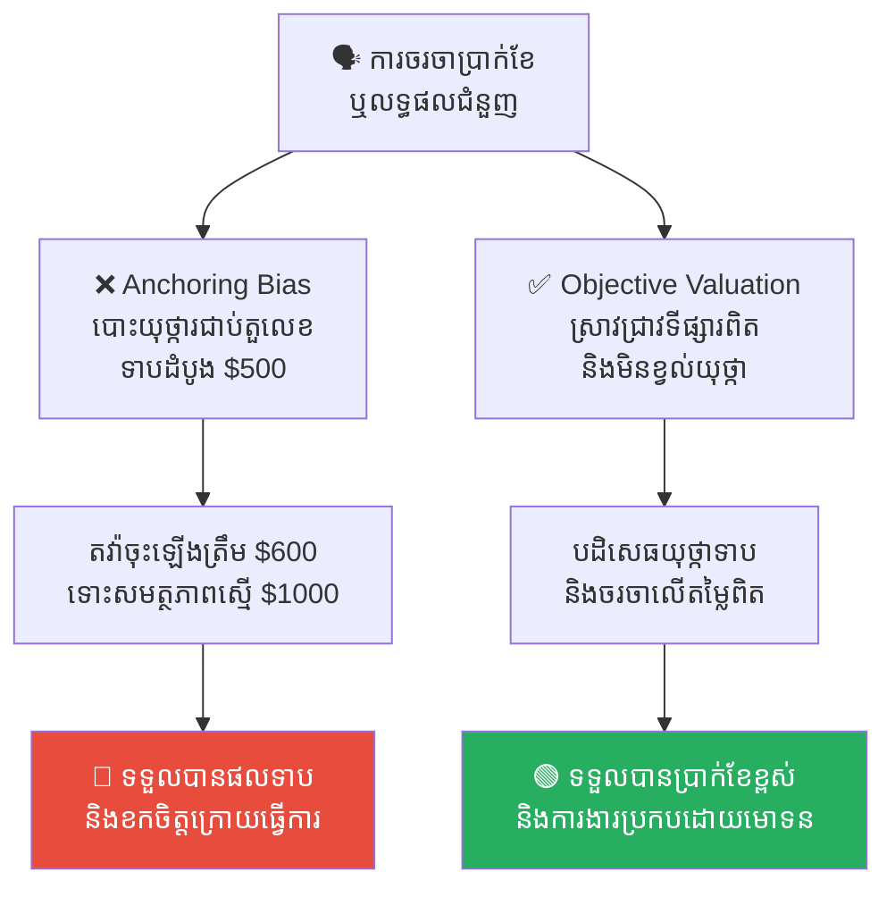
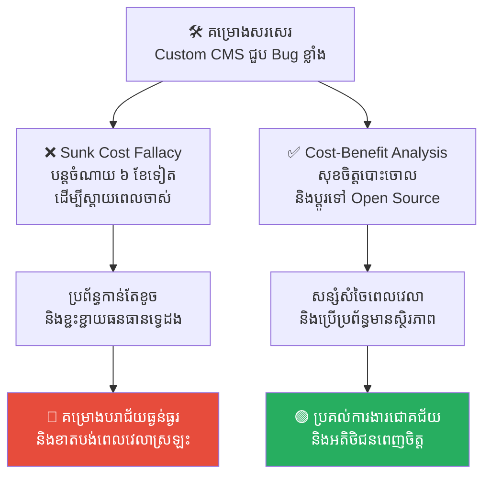
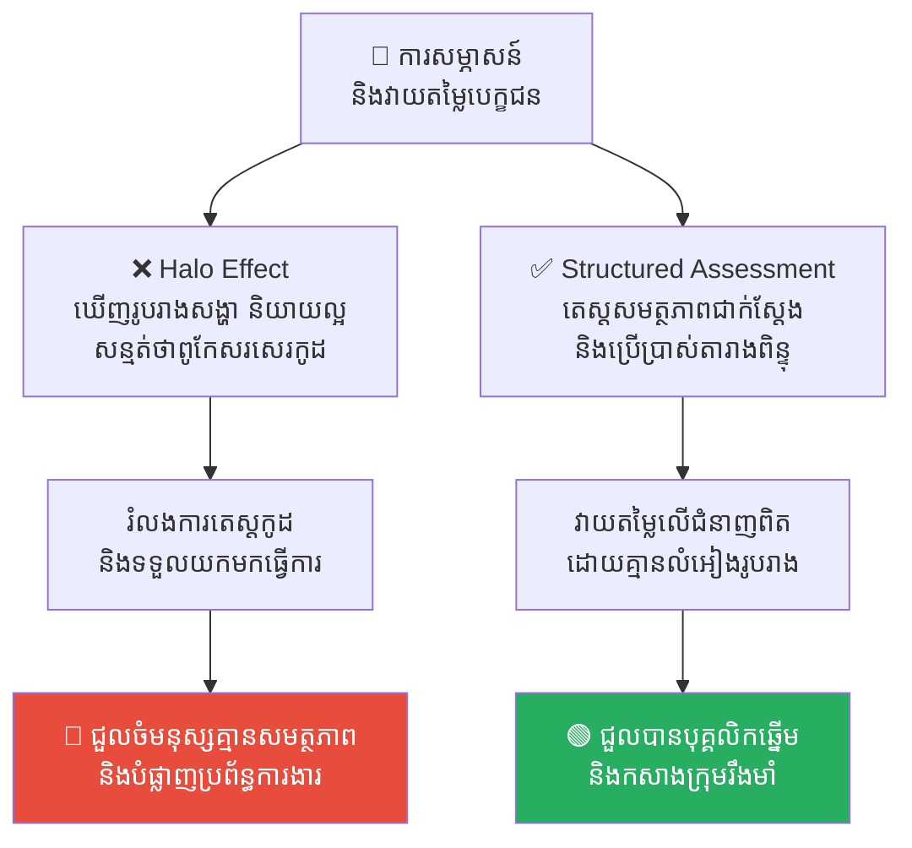
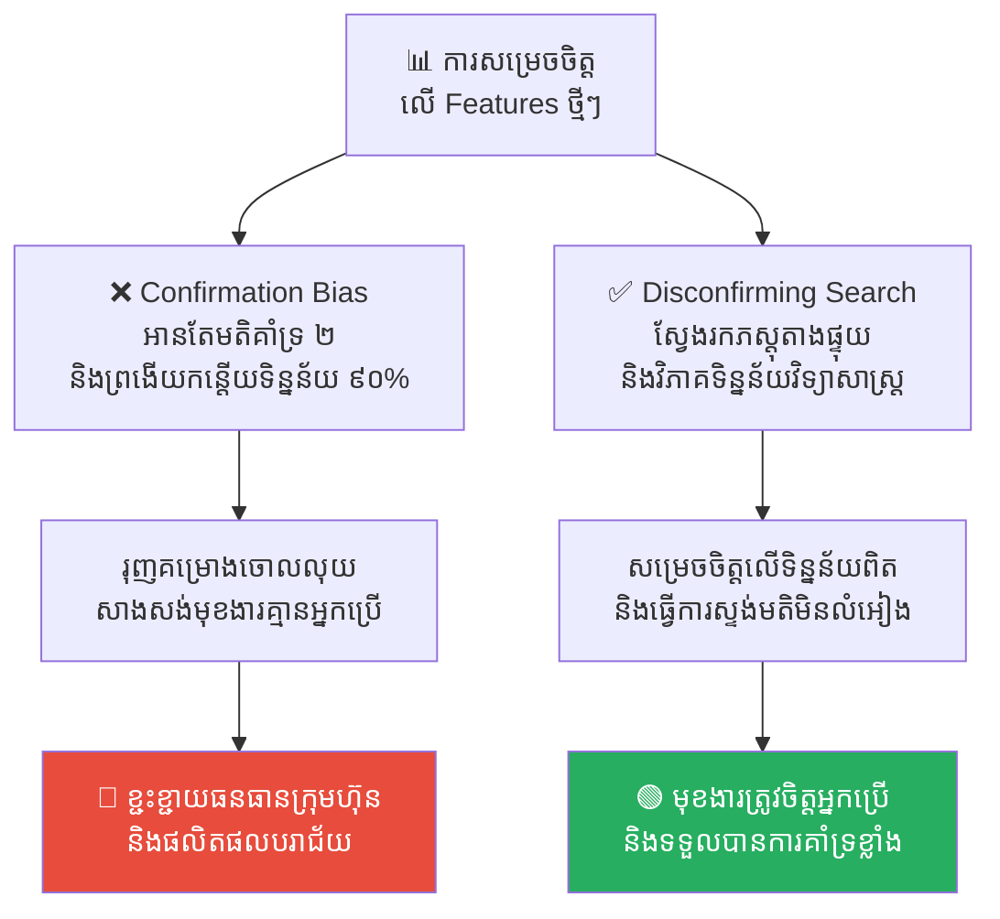
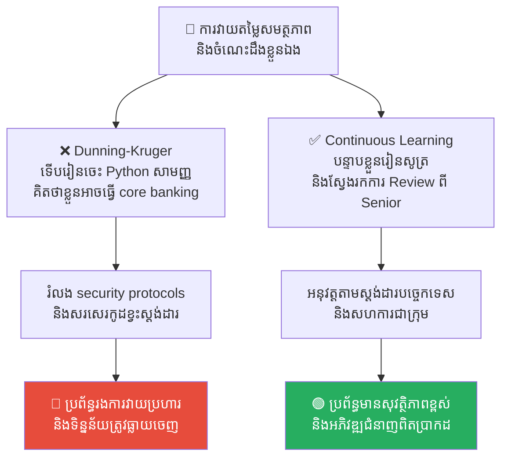

# Cognitive Biases: The Hidden Flaws in Human Thinking (លម្អៀងការយល់ឃើញ៖ កំហុសលាក់កំបាំងក្នុងការគិតរបស់មនុស្ស)

**Author:** ichamrong  
**Date:** 2026-05-17  
**Tags:** #cognitive-bias #psychology #decision-making #anchoring #sunk-cost  
**Category:** Concepts  
**Read Time:** ~15 min  

---

## 📌 មាតិកា (Table of Contents)
- [សេចក្តីផ្តើម (Introduction)](#សេចក្តីផ្តើម-introduction)
- [១. បញ្ហា៖ ហេតុអ្វីបានជាខួរក្បាលយើងមានលម្អៀង? (The Issue: System 1 vs. System 2 & The Mental Shortcuts)](#១-បញ្ហា-ហេតុអ្វីបានជាខួរក្បាលយើងមានលម្អៀង-the-issue-system-1-vs-system-2-the-mental-shortcuts)
- [២. ឧទាហរណ៍ជាក់ស្តែងនៃលម្អៀងការយល់ឃើញ (Real World Examples)](#២-ឧទាហរណ៍ជាក់ស្តែងនៃលម្អៀងការយល់ឃើញ)
  - [ឧទាហរណ៍ទី ១ — លម្អៀងជាប់យុថ្កា (Anchoring Bias in Salary Negotiation)](#ឧទាហរណ៍ទី-១-លម្អៀងជាប់យុថ្កា-anchoring-bias-in-salary-negotiation)
  - [ឧទាហរណ៍ទី ២ — លម្អៀងស្តាយរបស់ខូច (Sunk Cost Fallacy in Legacy Code)](#ឧទាហរណ៍ទី-២-លម្អៀងស្តាយរបស់ខូច-sunk-cost-fallacy-in-legacy-code)
  - [ឧទាហរណ៍ទី ៣ — លម្អៀងពន្លឺបំភាន់ភ្នែក (The Halo Effect in Tech Hiring)](#ឧទាហរណ៍ទី-៣-លម្អៀងពន្លឺបំភាន់ភ្នែក-the-halo-effect-in-tech-hiring)
  - [ឧទាហរណ៍ទី ៤ — លម្អៀងជឿអ្វីដែលចង់ជឿ (Confirmation Bias in Product Design)](#ឧទាហរណ៍ទី-៤-លម្អៀងជឿអ្វីដែលចង់ជឿ-confirmation-bias-in-product-design)
  - [ឧទាហរណ៍ទី ៥ — យល់ច្រឡំថាខ្លួនឯងពូកែ (Dunning-Kruger Effect in Junior Developer)](#ឧទាហរណ៍ទី-៥-យល់ច្រឡំថាខ្លួនឯងពូកែ-dunning-kruger-effect-in-junior-developer)
- [៣. កត្តាជម្រុញ៖ ភាពមមាញឹក និងការសន្សំសំចៃថាមពលរបស់ខួរក្បាល (The Aggravator: Cognitive Load & Energy Conservation)](#៣-កត្តាជម្រុញ-ភាពមមាញឹក-និងការសន្សំសំចៃថាមពលរបស់ខួរក្បាល-the-aggravator-cognitive-load-energy-conservation)
- [៤. ដំណោះស្រាយទូទៅ (The General Solution)](#៤-ដំណោះស្រាយទូទៅ-the-general-solution)
  - [បង្អង់ល្បឿន និងប្រើប្រាស់ការគិតវិភាគ (Slow Down & Invoke System 2)](#បង្អង់ល្បឿន-និងប្រើប្រាស់ការគិតវិភាគ-slow-down-invoke-system-2)
  - [ការស្វែងរកភស្តុតាងផ្ទុយ (Seek Disconfirming Evidence)](#ការស្វែងរកភស្តុតាងផ្ទុយ-seek-disconfirming-evidence)
  - [ការវាស់ស្ទង់ផ្អែកលើទិន្នន័យជាស្តង់ដារ (Data-Driven Standardized Systems)](#ការវាស់ស្ទង់ផ្អែកលើទិន្នន័យជាស្តង់ដារ-data-driven-standardized-systems)
- [សេចក្តីសន្និដ្ឋាន (Conclusion)](#សេចក្តីសន្និដ្ឋាន-conclusion)
- [Related Posts](#related-posts)

---

## សេចក្តីផ្តើម (Introduction)

តើអ្នកធ្លាប់គិតថា ខ្លួនឯងតែងតែធ្វើការសម្រេចចិត្តបានយ៉ាងត្រឹមត្រូវ និងមានហេតុផលសមរម្យដែរឬទេ? តាមពិតទៅ ទោះបីជាអ្នកឆ្លាត ឬមានបទពិសោធន៍ការងារខ្ពស់ប៉ុណ្ណាក៏ដោយ ខួរក្បាលរបស់អ្នកតែងតែលួចបោកប្រាស់អ្នកជារៀងរាល់ថ្ងៃ តាមរយៈអ្វីដែលអ្នកវិទ្យាសាស្ត្រហៅថា **Cognitive Biases (លម្អៀងការយល់ឃើញ)**។

វាគឺជាកំហុសប្រព័ន្ធ (Systematic Errors) នៅក្នុងការគិតរបស់យើង ដែលធ្វើឱ្យយើងមើលឃើញពិភពលោកខុសពីការពិត និងធ្វើការសម្រេចចិត្តដោយអសនិទានភាព (Irrationality) ដែលនាំឱ្យកើតមានជម្លោះការងារ ការខាតបង់ធនធាន និងការរចនាប្រព័ន្ធការងារខុសឆ្គង។

---

## ១. បញ្ហា៖ ហេតុអ្វីបានជាខួរក្បាលយើងមានលម្អៀង? (The Issue: System 1 vs. System 2 & The Mental Shortcuts)

ខួរក្បាលមនុស្សស៊ីថាមពលរហូតដល់ ២០% នៃថាមពលរាងកាយទាំងមូល។ ជារៀងរាល់ថ្ងៃ យើងត្រូវទទួលព័ត៌មានរាប់លាន ដូចជាការសម្រេចចិត្តទិញម្ហូប អានព័ត៌មាន ឬឆ្លើយតបការងារ។ ប្រសិនបើខួរក្បាលត្រូវយកព័ត៌មានទាំងអស់នោះមកវិភាគយ៉ាងល្អិតល្អន់ វានឹងឆេះ (Overload) មិនខាន។

យោងតាមទ្រឹស្តីរបស់អ្នកចិត្តសាស្ត្រល្បីល្បាញ **Daniel Kahneman** ខួរក្បាលមនុស្សដំណើរការតាមប្រព័ន្ធពីរ៖
1. **System 1 (លឿន/ស្វ័យប្រវត្ត)៖** ធ្វើការសម្រេចចិត្តភ្លាមៗដោយផ្អែកលើអារម្មណ៍ ផ្លូវកាត់ (Mental Shortcuts ឬ Heuristics) និងការចងចាំរហ័ស ដើម្បីសន្សំសំចៃថាមពលខួរក្បាល។ ប៉ុន្តែដោយសារតែវាជាផ្លូវកាត់ វាងាយនឹងបង្កជា **កំហុសលម្អៀង (Cognitive Biases)**។
2. **System 2 (យឺត/វិភាគ)៖** ត្រូវការការផ្ដោតអារម្មណ៍ខ្ពស់ ការវិភាគទិន្នន័យជាក់ស្តែង និងការគិតគណនាស្មុគស្មាញ។ វាមានភាពត្រឹមត្រូវខ្ពស់ ប៉ុន្តែស៊ីថាមពលខួរក្បាលខ្លាំង និងដំណើរការយឺត។

```
🧠 ព័ត៌មានរាប់លាន ──► [ System 1: លឿន/សន្សំថាមពល ] ──► ផ្លូវកាត់ (Heuristics) ──► 🔴 កំហុសលម្អៀង (Biases)
🧠 ព័ត៌មានរាប់លាន ──► [ System 2: យឺត/វិភាគទិន្នន័យ ] ──► ផ្ទៀងផ្ទាត់ទិន្នន័យ ──► 🟢 ការសម្រេចចិត្តត្រឹមត្រូវ
```

---

## ២. ឧទាហរណ៍ជាក់ស្តែងនៃលម្អៀងការយល់ឃើញ

សូមពិនិត្យមើល **ឧទាហរណ៍ជាក់ស្តែងចំនួន ៥** បង្ហាញពីរបៀបដែលលម្អៀងការយល់ឃើញបោកប្រាស់យើង និងវិធីសាស្ត្រដោះស្រាយ៖

---

### ឧទាហរណ៍ទី ១ — លម្អៀងជាប់យុថ្កា (Anchoring Bias in Salary Negotiation)

**ស្ថានភាព៖** ការចរចាប្រាក់ខែរបស់ Developer ឆ្នើមម្នាក់ជាមួយផ្នែកធនធានមនុស្ស (HR)។

* **សកម្មភាព Low EQ (កំហុសឆ្គង)៖** នៅពេលចាប់ផ្តើមចរចា HR និយាយតួលេខដំបូងថា៖ *«តំណែងនេះជាទូទៅយើងផ្តល់ប្រាក់ខែត្រឹម ៥០០ ដុល្លារ។»* ខួរក្បាលរបស់ Developer ឆ្លងកាត់ System 1 បោះយុថ្ការជាប់នឹងតួលេខ ៥០០ នោះភ្លាម។ ទោះបីជាពួកគេមានសមត្ថភាពខ្ពស់អាចទាមទារបាន ១,០០០ ដុល្លារក៏ដោយ ពួកគេចាប់ផ្តើមតវ៉ាត្រឹម ៦០០ ឬ ៦៥០ ដុល្លារប៉ុណ្ណោះ ព្រោះពួកគេត្រូវបានចាក់សោរការគិតដោយតួលេខដំបូង។
* **សកម្មភាព High EQ (ដំណោះស្រាយ)៖** អនុវត្ត **Objective Valuation**។ មុនពេលចូលរួមសម្ភាសន៍ ត្រូវស្រាវជ្រាវទិន្នន័យទីផ្សារការងារឱ្យបានច្បាស់លាស់។ ប្រសិនបើ HR លើកឡើងតួលេខទាប បដិសេធមិនយកតួលេខនោះជាយុថ្ការ៖ *«៥០០ ដុល្លារខុសពីតម្លៃទីផ្សារសម្រាប់ជំនាញនេះ។ ផ្អែកលើលទ្ធផលការងារ និងទីផ្សារ តម្លៃពិតប្រាកដគឺ ១,០០០ ដុល្លារ។»*
* **លទ្ធផល៖** ការធ្លាក់ចូលក្នុងលម្អៀងជាប់យុថ្កានាំឱ្យទទួលបានផលប្រយោជន៍ទាប និងខកចិត្តក្រោយពេលធ្វើការងារ។ ការបដិសេធយុថ្កាទាបជួយឱ្យទទួលបានប្រាក់ខែខ្ពស់ និងសក្តិសមនឹងសមត្ថភាពពិត។



---

### ឧទាហរណ៍ទី ២ — លម្អៀងស្តាយរបស់ខូច (Sunk Cost Fallacy in Legacy Code)

**ស្ថានភាព៖** ក្រុមហ៊ុនបានចំណាយពេល ៦ ខែ និងថវិការាប់ម៉ឺនដុល្លារដើម្បីសរសេរកម្មវិធី Custom CMS មួយ ដែលដើរយឺត និងពោរពេញដោយ Bug។

* **សកម្មភាព Low EQ (កំហុសឆ្គង)៖** Lead Developer សម្រេចចិត្តបន្តចំណាយពេល ៦ ខែបន្ថែមទៀត និងជួលមនុស្សបន្ថែមដើម្បីព្យាយាម «ជួសជុល» វា គ្រាន់តែព្រោះតែស្តាយក្រោយនឹងពេលវេលា និងថវិកាដែលបានបាត់បង់ទៅហើយ (Sunk Cost) ជំនួសឱ្យការទទួលស្គាល់បរាជ័យ និងប្តូរទៅប្រើប្រព័ន្ធ Open Source ដ៏មានស្ថិរភាព។
* **សកម្មភាព High EQ (ដំណោះស្រាយ)៖** អនុវត្ត **Cost-Benefit Analysis** ប្រកបដោយភាពចាស់ទុំ។ ទទួលស្គាល់ថាពេលវេលា ៦ ខែមុនគឺបានបាត់បង់ជាស្ថាពរ (Sunk Cost) ហើយវានឹងមិនត្រលប់មកវិញឡើយ។ ផ្តោតលើការសម្រេចចិត្តអនាគត៖ បោះចោល custom CMS នោះ រួចប្តូរទៅប្រើប្រព័ន្ធ Open Source ភ្លាមៗ ដើម្បីសន្សំសំចៃធនធាន និងពេលវេលាអនាគត។
* **លទ្ធផល៖** ការបន្តធ្វើរឿងខុសឆ្គងព្រោះស្តាយរបស់ចាស់នាំឱ្យគម្រោងបរាជ័យទ្វេដង និងខាតបង់ធនធានទាំងស្រុង។ ការបោះចោលប្រព័ន្ធចាស់ជួយឱ្យសន្សំសំចៃធនធាន និងសម្រេចការងារបានជោគជ័យ។



---

### ឧទាហរណ៍ទី ៣ — លម្អៀងពន្លឺបំភាន់ភ្នែក (The Halo Effect in Tech Hiring)

**ស្ថានភាព៖** ការសម្ភាសន៍ជ្រើសរើសបុគ្គលិក Senior Backend Developer សម្រាប់ក្រុមហ៊ុន។

* **សកម្មភាព Low EQ (កំហុសឆ្គង)៖** អ្នកសម្ភាសន៍ឃើញបេក្ខជនម្នាក់មានរូបរាងសង្ហា ស្លៀកពាក់ស្អាតបាត និយាយស្តីភាសាអង់គ្លេសបានលះល្អឥតខ្ចោះ និងរៀនចប់មកពីសកលវិទ្យាល័យល្បីល្បាញ។ អ្នកសម្ភាសន៍ឆ្លងកាត់ System 1 សន្និដ្ឋានស្វ័យប្រវត្តថា៖ *«គាត់ពិតជាឆ្លាត និងពូកែសរសេរកូដណាស់!»* រួចក៏យល់ព្រមទទួលយកមកធ្វើការដោយរំលងការតេស្តសរសេរកូដជាក់ស្តែង។ ពេលចូលធ្វើការ ពួកគេស្រាប់តែដឹងថា បេក្ខជននោះគ្មានជំនាញសរសេរកូដទាល់តែសោះ។
* **សកម្មភាព High EQ (ដំណោះស្រាយ)៖** អនុវត្ត **Structured & Objective Assessment**។ ការវាយតម្លៃបេក្ខជនត្រូវតែផ្អែកលើការតេស្តជំនាញបច្ចេកទេសជាក់ស្តែង (Coding Test) និងប្រើប្រាស់ប្រព័ន្ធពិន្ទុ (Rubrics) ច្បាស់លាស់ ធានាគ្មានការលំអៀងរូបរាង ឬរបៀបនិយាយឡើយ។
* **លទ្ធផល៖** លម្អៀង Halo Effect នាំឱ្យជួលចំមនុស្សគ្មានសមត្ថភាព និងបំផ្លាញប្រព័ន្ធការងារក្រុមហ៊ុន។ ការវាយតម្លៃលើជំនាញពិតជួយឱ្យជួលបានបុគ្គលិកឆ្នើម និងកសាងក្រុមរឹងមាំ។



---

### ឧទាហរណ៍ទី ៤ — លម្អៀងជឿអ្វីដែលចង់ជឿ (Confirmation Bias in Product Design)

**ស្ថានភាព៖** PM ចង់សម្រេចចិត្តបន្ថែមមុខងារបណ្តាញសង្គម (Social Sharing Feature) ទៅលើកម្មវិធី FinTech។

* **សកម្មភាព Low EQ (កំហុសឆ្គង)៖** PM ជឿជាក់ខ្លាំងថាអតិថិជនចង់បានមុខងារនេះ។ ទោះបីជាលទ្ធផលស្ទង់មតិបង្ហាញថា អតិថិជន ៩០% បដិសេធ និងមិនខ្វល់ខ្វាយក៏ដោយ ក៏ PM រើសអានតែមតិគាំទ្រចំនួន ២ នាក់ រួចយកវាមកបង្ហាញកណ្តាលប្រជុំ៖ *«មើលចុះ! អតិថិជនពិតជាគាំទ្រមុខងារនេះខ្លាំងណាស់!»* ពួកគេលំអៀងជឿតែអ្វីដែលខ្លួនចង់ជឿ និងរុញគម្រោងចោលលុយរាប់ម៉ឺនដុល្លារដែលគ្មាននរណាប្រើប្រាស់។
* **សកម្មភាព High EQ (ដំណោះស្រាយ)៖** អនុវត្តយុទ្ធសាស្ត្រ **Disconfirming Evidence Search**។ ស្វែងរកភស្តុតាងផ្ទុយដើម្បីបដិសេធជំនឿខ្លួនឯង៖ *«ចុះបើការគិតរបស់ខ្ញុំនេះខុស តើទិន្នន័យស្ថិតិអ្វីខ្លះដែលបង្ហាញថាមុខងារនេះមិនគួរធ្វើ?»* សម្រេចចិត្តផ្អែកលើទិន្នន័យស្ថិតិធំជាជាងមតិឯកជនតិចតួច។
* **លទ្ធផល៖** ការរើសអានទិន្នន័យគាំទ្រផ្ទាល់ខ្លួនធ្វើឱ្យខ្ជះខ្ជាយធនធាន និងផលិតផលបរាជ័យ។ ការសម្រេចចិត្តលើទិន្នន័យពិតជួយឱ្យបង្កើតមុខងារត្រូវចិត្តអ្នកប្រើ និងទទួលបានជោគជ័យខ្ពស់។



---

### ឧទាហរណ៍ទី ៥ — យល់ច្រឡំថាខ្លួនឯងពូកែ (Dunning-Kruger Effect in Junior Developer)

**ស្ថានភាព៖** ក្រុមហ៊ុនត្រូវការអភិវឌ្ឍប្រព័ន្ធសុវត្ថិភាពធនាគារស្នូល (Core Banking Security Engine)។

* **សកម្មភាព Low EQ (កំហុសឆ្គង)៖** Junior Developer ម្នាក់ដែលទើបរៀនចេះ Python កម្រិតដំបូង យល់ច្រឡំថាខ្លួនឯងមានសមត្ថភាពអស្ចារ្យ (Dunning-Kruger Effect) ក៏ដើរទៅប្រាប់ CEO ថា៖ *«ខ្ញុំអាចសរសេរប្រព័ន្ធនេះបានជោគជ័យក្នុងរយៈពេល ២ សប្តាហ៍!»* ពួកគេរំលងរាល់ security protocols ធ្ងន់ៗ និងសរសេរកូដខ្វះស្តង់ដារ ធ្វើឱ្យប្រព័ន្ធរងការវាយប្រហារ និងធ្លាយទិន្នន័យធនាគារភ្លាមៗក្រោយពេលដាក់ដំណើរការ។
* **សកម្មភាព High EQ (ដំណោះស្រាយ)៖** អនុវត្តការបន្ទាបខ្លួនរៀនសូត្រ (Humility & Continuous Learning) និងការត្រួតពិនិត្យតឹងរ៉ឹងពី Senior Engineers។ Junior ត្រូវទទួលស្គាល់ព្រំដែនចំណេះដឹងរបស់ខ្លួន និងសហការក្រោមការណែនាំពី Senior ព្រមទាំងអនុវត្តតាមស្តង់ដារបច្ចេកទេសច្បាស់លាស់។
* **លទ្ធផល៖** ភាពល្ងង់ខ្លៅអំនួតខ្ពស់ (Dunning-Kruger) បង្កគ្រោះមហន្តរាយដល់សន្តិសុខប្រព័ន្ធ និងក្រុមហ៊ុន។ ការបន្ទាបខ្លួនរៀនសូត្រជួយការពារប្រព័ន្ធឱ្យមានសុវត្ថិភាពខ្ពស់ និងអភិវឌ្ឍជំនាញពិតប្រាកដ។



---

## ៣. កត្តាជម្រុញ៖ ភាពមមាញឹក និងការសន្សំសំចៃថាមពលរបស់ខួរក្បាល (The Aggravator: Cognitive Load & Energy Conservation)

ហេតុអ្វីបានជាមនុស្សឆ្លាតៗនៅតែធ្លាក់ចូលក្នុងអន្ទាក់លម្អៀងការយល់ឃើញជារៀងរាល់ថ្ងៃ?

1. **ការសន្សំសំចៃថាមពលរបស់ខួរក្បាល (Cognitive Energy Conservation)៖** ខួរក្បាលមនុស្សមានទម្លាប់ស្អប់ខ្ពើមការងារស្មុគស្មាញដែលស៊ីថាមពល (System 2)។ ដូច្នេះ វាតែងតែលួចដំណើរការតាមរយៈ System 1 ដោយស្វ័យប្រវត្តិ និងប្រើប្រាស់ផ្លូវកាត់ដើម្បីកាត់សេចក្តីភ្លាមៗ បង្កើតជាលម្អៀងការយល់ឃើញ។
2. **សម្ពាធការងារ និងភាពមមាញឹក (High Cognitive Load)៖** នៅពេលយើងស្ថិតក្រោមសម្ពាធពេលវេលា ស្ត្រេសខ្លាំង ឬត្រូវធ្វើការសម្រេចចិត្តរាប់សិបក្នុងពេលតែមួយ ខួរក្បាលគ្មានសមត្ថភាពហៅ System 2 មកវិភាគឡើយ ធ្វើឱ្យយើងកាន់តែងាយនឹងសម្រេចចិត្តខុសឆ្គងប្រកបដោយអសនិទានភាពខ្ពស់បំផុត។

---

## ៤. ដំណោះស្រាយទូទៅ (The General Solution)

យើងមិនអាចលុបបំបាត់លម្អៀងការយល់ឃើញចេញពីខួរក្បាលទាំងស្រុងបានឡើយ ព្រោះវាជាធម្មជាតិរបស់មនុស្ស ប៉ុន្តែយើងអាចការពារ និងកាត់បន្ថយឥទ្ធិពលរបស់វាបានតាមរយៈ៖

### បង្អង់ល្បឿន និងប្រើប្រាស់ការគិតវិភាគ (Slow Down & Invoke System 2)
នៅពេលត្រូវធ្វើការសម្រេចចិត្តសំខាន់ៗ (ដូចជាការជួលមនុស្ស ការផ្លាស់ប្តូរ Architecture ប្រព័ន្ធ ឬការចុះកិច្ចសន្យា) ហាមសម្រេចចិត្តភ្លាមៗតាមអារម្មណ៍ System 1 ដាច់ខាត។ ត្រូវបង្អង់ល្បឿន ចំណាយពេលគិតគូរ គូរគំនូសប្លង់ និងសរសេរវិភាគទិន្នន័យជាក់ស្តែងដើម្បីហៅ System 2 មកដំណើរការជំនួស។

### ការស្វែងរកភស្តុតាងផ្ទុយ (Seek Disconfirming Evidence)
រាល់ពេលអ្នកជឿជាក់លើគំនិតណាមួយ ចូរចោទសួរខ្លួនឯងដោយភាពស្មោះត្រង់៖
* *«ចុះបើគំនិតខ្ញុំនេះខុសស្រឡះ តើមានភស្តុតាង ឬទិន្នន័យពិតប្រាកដអ្វីខ្លះដែលបញ្ជាក់ថាវាខុស?»*
* ការស្វែងរកភស្តុតាងផ្ទុយនឹងជួយឱ្យអ្នកកម្ទេច **Confirmation Bias** និងមើលឃើញការពិតជាក់ស្តែង។

### ការវាស់ស្ទង់ផ្អែកលើទិន្នន័យជាស្តង់ដារ (Data-Driven Standardized Systems)
លុបបំបាត់ការវាស់វែងផ្អែកលើ «អារម្មណ៍សន្មត់ផ្ទាល់ខ្លួន»។ នៅក្នុងស្ថាប័ន ត្រូវរៀបចំស្តង់ដារការងារច្បាស់លាស់៖
* សម្រាប់ការជួលមនុស្ស ត្រូវតែមាន coding tests និង structured interview rubrics (កម្ទេច Halo Effect)។
* សម្រាប់ការសម្រេចចិត្តលើ Features ត្រូវមាន data analytics និងសន្ទស្សន៍ A/B testing ជាក់ស្តែង។

---

## សេចក្តីសន្និដ្ឋាន (Conclusion)

លម្អៀងការយល់ឃើញ (Cognitive Biases) គឺជាកញ្ចក់ឆ្លុះបញ្ចាំងបញ្ឆោតភ្នែកដែលខួរក្បាលរបស់យើងបង្កើតឡើង ដើម្បីរស់រានមានជីវិតក្នុងភាពងាយស្រួល។ **ភាពវៃឆ្លាតពិតប្រាកដរបស់មនុស្ស មិនមែនជាការគិតថាខ្លួនឯងគ្មានលម្អៀងនោះឡើយ ប៉ុន្តែវាជាការដឹងខ្លួនពីកំហុសផ្លូវចិត្តទាំងនេះ និងមានភាពបន្ទាបខ្លួនក្នុងការបង្កើតប្រព័ន្ធការងារច្បាស់លាស់ (SSOT, Standards, Peer Reviews) ដើម្បីជួយកែសម្រួលការគិតរបស់ខ្លួនឱ្យត្រឹមត្រូវជារៀងរហូត។**

---

## Related Posts

* **[01-confirmation-bias.md](./01-confirmation-bias.md)** — លម្អៀងការយល់ឃើញ៖ របៀបដែលយើងជ្រើសរើសជឿតែព័ត៌មានដែលស្របនឹងគំនិតខ្លួន។
* **[13-single-source-of-truth-and-knowledge-silos.md](./13-single-source-of-truth-and-knowledge-silos.md)** — មូលហេតុដែលក្រុមការងារបច្ចេកវិទ្យាត្រូវការប្រភពព័ត៌មានតែមួយ ដើម្បីកាត់បន្ថយលម្អៀងការគិត។
* **[The Merchant and the Golden Anchor (សេដ្ឋី និងយុថ្កាមាស)](../parables/29-the-merchant-and-the-golden-anchor.md)** — រឿងប្រៀបធៀបដ៏រំភើប អំពីរបៀបដែល Anchoring Bias ត្រូវបានប្រើក្នុងការចរចាជំនួញ។
* **[The Lost Axe and the Filter of Mind (ពូថៅដែលបាត់ និងកញ្ចក់ចម្រោះនៃចិត្ត)](../parables/13-the-lost-axe-and-the-filter-of-mind.md)** — រឿងប្រៀបធៀបបុរាណ អំពីឥទ្ធិពលបំភាន់របស់ Confirmation Bias លើការរស់នៅប្រចាំថ្ងៃ។

---

*Last updated: 2026-05-26*
