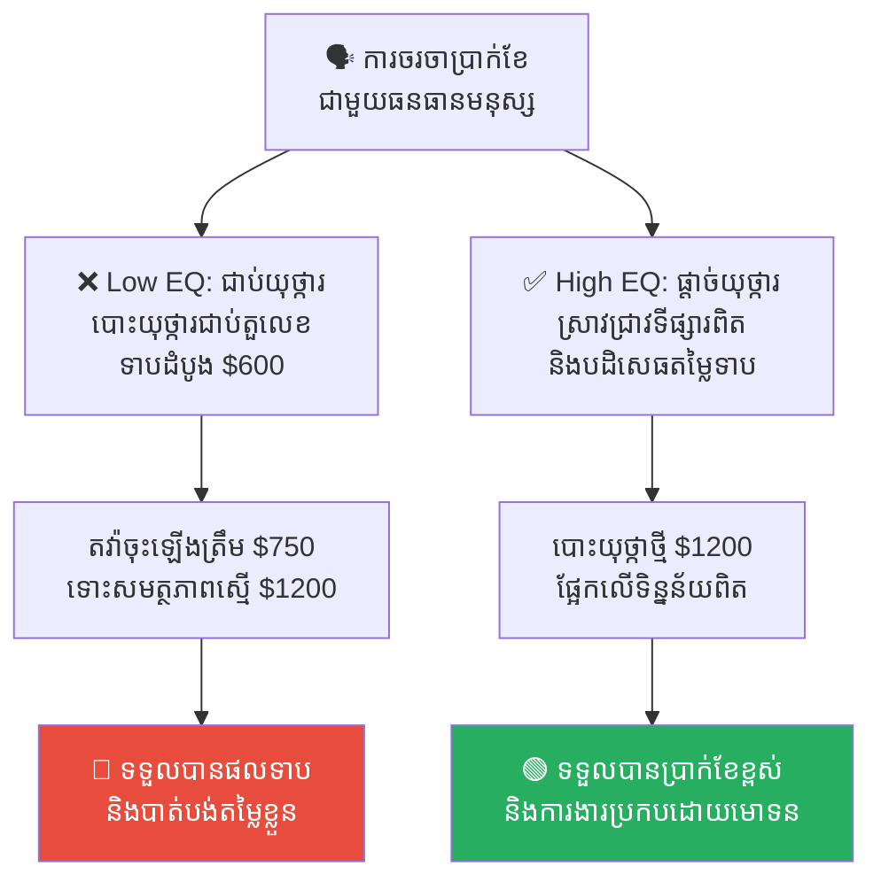
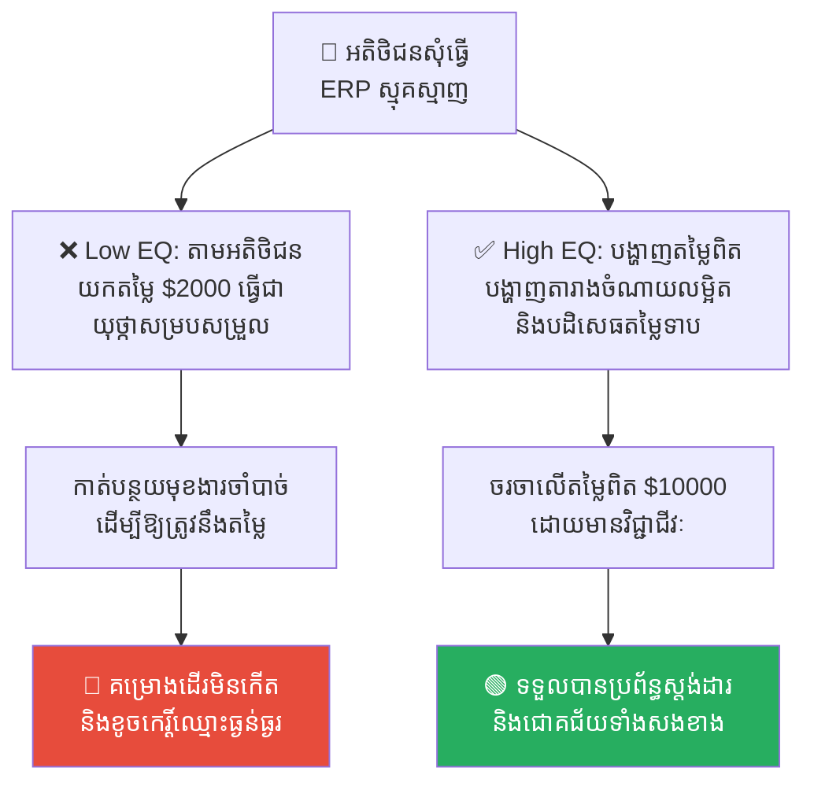
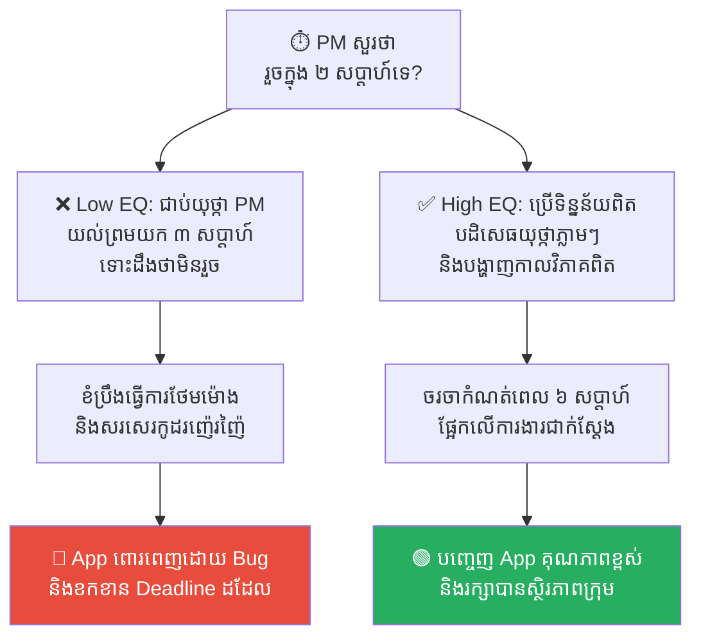
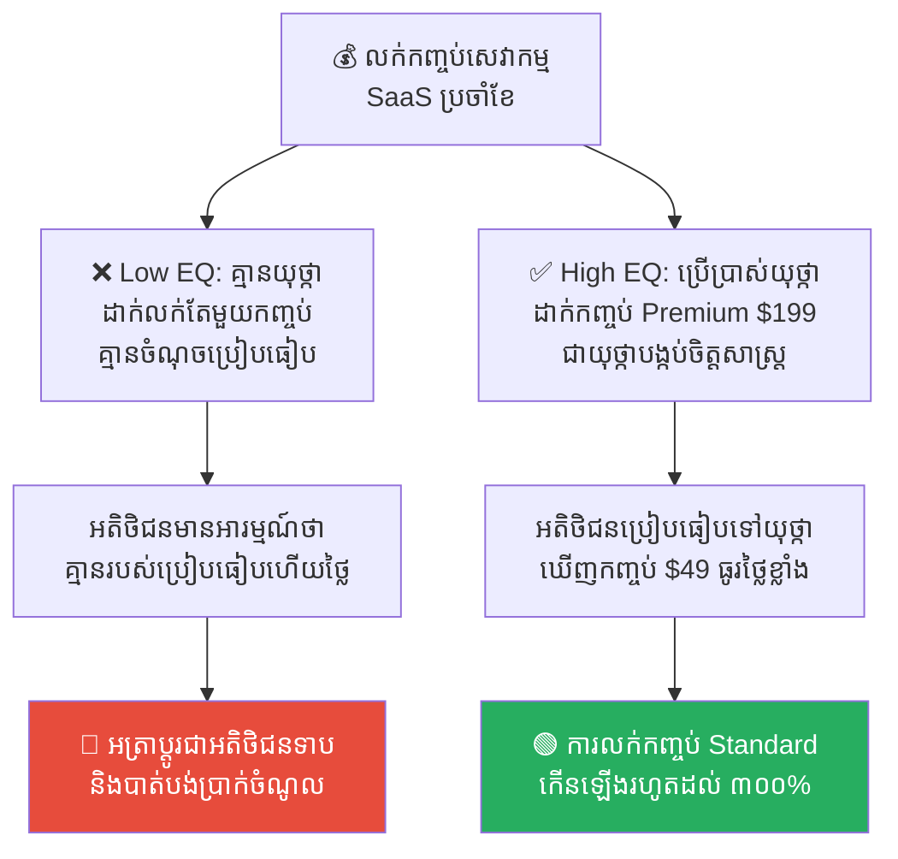
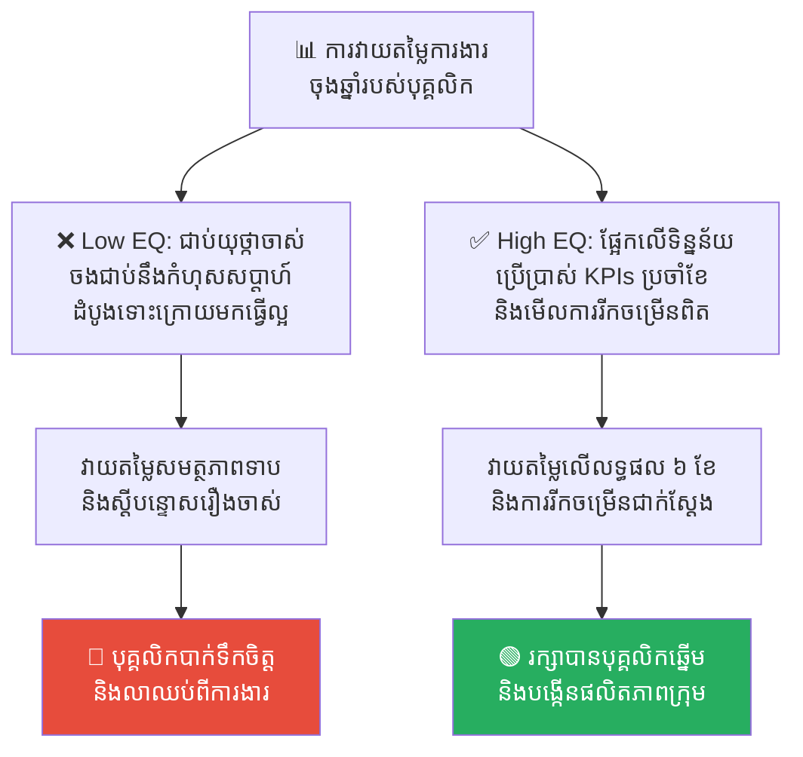

# Anchoring Bias: The Trap of the First Information (លម្អៀងជាប់យុថ្កា៖ អន្ទាក់នៃព័ត៌មានដំបូង)

**Author:** ichamrong  
**Date:** 2026-05-17  
**Tags:** #cognitive-bias #anchoring-bias #negotiation #decision-making  
**Category:** Concepts  
**Read Time:** ~15 min  

---

## 📌 មាតិកា (Table of Contents)
- [លំនាំបញ្ហា (The Pattern)](#លំនាំបញ្ហា-the-pattern)
- [១. បញ្ហា៖ ហេតុអ្វីបានជាខួរក្បាលយើងជាប់យុថ្កា? (The Issue: The Psychology of Anchoring)](#១-បញ្ហា-ហេតុអ្វីបានជាខួរក្បាលយើងជាប់យុថ្កា-the-issue-the-psychology-of-anchoring)
- [២. ឧទាហរណ៍ជាក់ស្តែងក្នុងពិភពពិត (Real World Examples)](#២-ឧទាហរណ៍ជាក់ស្តែងក្នុងពិភពពិត)
  - [ឧទាហរណ៍ទី ១ — ការចរចាប្រាក់ខែ (Salary Negotiation)](#ឧទាហរណ៍ទី-១-ការចរចាប្រាក់ខែ-salary-negotiation)
  - [ឧទាហរណ៍ទី ២ — ការប៉ាន់ស្មានថវិកាគម្រោង (Project Cost Estimation)](#ឧទាហរណ៍ទី-២-ការប៉ាន់ស្មានថវិកាគម្រោង-project-cost-estimation)
  - [ឧទាហរណ៍ទី ៣ — ការកំណត់ពេលវេលាបញ្ចប់កូដ (Software Timeline Commitment)](#ឧទាហរណ៍ទី-៣-ការកំណត់ពេលវេលាបញ្ចប់កូដ-software-timeline-commitment)
  - [ឧទាហរណ៍ទី ៤ — យុទ្ធសាស្ត្រកំណត់តម្លៃផលិតផល (Decoy Product Pricing)](#ឧទាហរណ៍ទី-៤-យុទ្ធសាស្ត្រកំណត់តម្លៃផលិតផល-decoy-product-pricing)
  - [ឧទាហរណ៍ទី ៥ — ការវាយតម្លៃលទ្ធផលការងារ (Performance Review Bias)](#ឧទាហរណ៍ទី-៥-ការវាយតម្លៃលទ្ធផលការងារ-performance-review-bias)
- [៣. កត្តាជម្រុញ៖ ភាពស្រពិចស្រពិល និងកង្វះព័ត៌មាន (The Aggravator: Ambiguity & Information Scarcity)](#៣-កត្តាជម្រុញ-ភាពស្រពិចស្រពិល-និងកង្វះព័ត៌មាន-the-aggravator-ambiguity-information-scarcity)
- [៤. ដំណោះស្រាយទូទៅ៖ របៀបផ្តាច់យុថ្កាចេញពីខួរក្បាល (The General Solution: How to Shatter the Anchor)](#៤-ដំណោះស្រាយទូទៅ-របៀបផ្តាច់យុថ្កាចេញពីខួរក្បាល-the-general-solution-how-to-shatter-the-anchor)
- [សេចក្តីសន្និដ្ឋាន (Conclusion)](#សេចក្តីសន្និដ្ឋាន-conclusion)
- [Related Posts](#related-posts)

---

## លំនាំបញ្ហា (The Pattern)

តើអ្នកធ្លាប់មានអារម្មណ៍ថារំភើបខ្លាំង នៅពេលឃើញអាវមួយតម្លៃ ៥០ ដុល្លារ ដែលចុះថ្លៃពី ១៥០ ដុល្លារដែរឬទេ? ខួរក្បាលរបស់អ្នកមិនបានគិតវិភាគស៊ីជម្រៅទេថា គុណភាពអាវនោះពិតជាសមនឹងតម្លៃ ៥០ ដុល្លារឬអត់។ អ្វីដែលខួរក្បាលរបស់អ្នកចងចាំ និងប្រៀបធៀបគឺ៖ *«ខ្ញុំចំណេញបាន ១០០ ដុល្លារពីតម្លៃដើម ១៥០ ដុល្លារ!»*

តួលេខ **១៥០ ដុល្លារ** នោះហើយគឺជា **«យុថ្កា (Anchor)»** ដែលបានចាក់សោរការយល់ឃើញរបស់អ្នកឱ្យជាប់នៅមួយកន្លែង។ 

នេះគឺជាកំហុសក្នុងការគិតដ៏មានឥទ្ធិពលបំផុតមួយ ដែលហៅថា **Anchoring Bias (លម្អៀងជាប់យុថ្កា)**។ ប្រសិនបើយើងមិនដឹងខ្លួនពីអន្ទាក់នេះទេ យើងនឹងតែងតែធ្វើការសម្រេចចិត្តខុសឆ្គង ទាំងក្នុងការចរចាធុរកិច្ច ការគ្រប់គ្រងគម្រោងបច្ចេកវិទ្យា និងការរស់នៅប្រចាំថ្ងៃ។

---

## ១. បញ្ហា៖ ហេតុអ្វីបានជាខួរក្បាលយើងជាប់យុថ្កា? (The Issue: The Psychology of Anchoring)

ខួរក្បាលមនុស្សតែងតែស្វែងរកវិធីសន្សំសំចៃថាមពលជានិច្ច។ នៅពេលយើងត្រូវធ្វើការប៉ាន់ស្មាន ឬសម្រេចចិត្តលើរឿងរ៉ាវដែលមិនច្បាស់លាស់ ខួរក្បាលរបស់យើងនឹងចាប់យក **«ព័ត៌មានដំបូងគេបង្អស់ (The First Piece of Information)»** ដែលខ្លួនទទួលបានភ្លាមៗ ដើម្បីយកមកធ្វើជាចំណុចយោង ឬបង្គោលសម្រាប់ប្រៀបធៀប។

ទោះបីជាព័ត៌មានដំបូងនោះជាលេខចៃដន្យ គ្មានហេតុផល ឬជាការបោកបញ្ឆោតក៏ដោយ ក៏ខួរក្បាលរបស់យើងពិបាកនឹងផ្តាច់ខ្លួនចេញពីវានាស់។ រាល់ការសម្រេចចិត្តបន្ទាប់ នឹងត្រូវទាញយកមកប្រៀបធៀបក្បែរៗយុថ្កានេះជានិច្ច។

```
🧠 ព័ត៌មានដំបូងបង្អស់ ──► ⚓ ចងជាប់ក្នុងខួរក្បាល ──► ការសម្រេចចិត្តបន្ទាប់ ──► 🔴 លម្អៀងតាមយុថ្កាដំបូង
```

នៅក្នុងវិស័យការងារ និងបច្ចេកវិទ្យា លម្អៀងជាប់យុថ្កាគឺជាអាវុធដ៏គ្រោះថ្នាក់មួយដែលអាចប្រើប្រាស់ដើម្បីកេងចំណេញពីអ្នកដទៃ ឬវាអាចក្លាយជាអន្ទាក់សម្លាប់គុណភាពការងារដោយមិនដឹងខ្លួន។

---

## ២. ឧទាហរណ៍ជាក់ស្តែងក្នុងពិភពពិត

សូមពិនិត្យមើល **ឧទាហរណ៍ជាក់ស្តែងចំនួន ៥** បង្ហាញពីរបៀបដែលលម្អៀងជាប់យុថ្កាបំផ្លាញការសម្រេចចិត្ត និងវិធីសាស្ត្រដោះស្រាយ៖

---

### ឧទាហរណ៍ទី ១ — ការចរចាប្រាក់ខែ (Salary Negotiation)

**ស្ថានភាព៖** ការចរចាប្រាក់ខែរបស់ Developer ឆ្នើមម្នាក់ជាមួយផ្នែកធនធានមនុស្ស (HR) នៃក្រុមហ៊ុនថ្មីមួយ។

*   **សកម្មភាពអសកម្ម / Low EQ / កំហុសឆ្គង៖** នៅពេលចាប់ផ្តើមសម្ភាសន៍ HR និយាយជាមុនថា៖ *«តំណែងនេះជាទូទៅយើងផ្តល់ថវិកាត្រឹមតែ ៦០០ ដុល្លារប៉ុណ្ណោះ។»* ខួរក្បាលរបស់ Developer ត្រូវបានបោះយុថ្ការជាប់នឹងតួលេខ ៦០០ ដុល្លារនោះភ្លាម។ ទោះបីជាពួកគេមានសមត្ថភាពខ្ពស់អាចទាមទារបាន ១,២០០ ដុល្លារក៏ដោយ ក៏ពួកគេចាប់ផ្តើមតវ៉ាដណ្តើមយកត្រឹមតែ ៧០០ ឬ ៧៥០ ដុល្លារប៉ុណ្ណោះ ព្រោះខួរក្បាលរបស់ពួកគេត្រូវបានចាក់សោរដោយតួលេខដំបូង។
*   **សកម្មភាពស្ថាបនា / High EQ / ដំណោះស្រាយ៖** បដិសេធមិនយកតួលេខនោះជាយុថ្ការ និងបង្កើតយុថ្កាផ្ទាល់ខ្លួនផ្អែកលើទិន្នន័យពិត៖ *«ថវិកា ៦០០ ដុល្លារគឺខុសពីតម្លៃទីផ្សារសម្រាប់បេក្ខជនដែលមានជំនាញកម្រិតនេះ។ ផ្អែកលើការស្រាវជ្រាវទីផ្សារ និងតម្លៃដែលខ្ញុំអាចផ្តល់ជូនក្រុមហ៊ុន ថវិកាសមរម្យគឺ ១,២០០ ដុល្លារ។»*
*   **លទ្ធផល៖** ការធ្លាក់ចូលក្នុងយុថ្ការបស់គេនាំឱ្យបាត់បង់ឱកាសទទួលបានចំណូលសមរម្យ និងខកចិត្តក្រោយពេលធ្វើការងារ។ ការផ្តាច់យុថ្កាទាបចោល និងលើកតម្លៃខ្លួនពិតប្រាកដជួយឱ្យទទួលបានប្រាក់ខែខ្ពស់សក្តិសមនឹងសមត្ថភាព។



---

### ឧទាហរណ៍ទី ២ — ការប៉ាន់ស្មានថវិកាគម្រោង (Project Cost Estimation)

**ស្ថានភាព៖** ក្រុមហ៊ុនមួយចង់ជួល Software Agency ដើម្បីអភិវឌ្ឍប្រព័ន្ធ ERP ដ៏ស្មុគស្មាញមួយ។

*   **សកម្មភាពអសកម្ម / Low EQ / កំហុសឆ្គង៖** អតិថិជនបានលើកឡើងតួលេខដំបូងថា៖ *«ពួកយើងចង់ធ្វើ App នេះក្នុងថវិកា ២,០០០ ដុល្លារ។»* Agency ខ្លាចបាត់បង់ភ្ញៀវ ក៏ចាប់ផ្តើមយកតួលេខ ២,០០០ ដុល្លារនេះជាយុថ្កា ហើយព្យាយាមកាត់បន្ថយមុខងារគម្រោងឱ្យត្រូវនឹងថវិកានេះ ទោះដឹងច្បាស់ថាប្រព័ន្ធនឹងដើរមិនកើតក៏ដោយ។
*   **សកម្មភាពស្ថាបនា / High EQ / ដំណោះស្រាយ៖** ផ្តាច់យុថ្ការបស់អតិថិជនចោលភ្លាមៗ ដោយបង្ហាញពីទិន្នន័យចំណាយពិតប្រាកដ (Granular Breakdown)៖ *«ERP ដែលមានស្ថិរភាព និងសុវត្ថិភាព មិនអាចធ្វើបានក្នុងតម្លៃ ២,០០០ ដុល្លារបានឡើយ។ ការចំណាយអប្បបរមាផ្អែកលើកម្លាំងពលកម្មពិតគឺ ១០,០០0 ដុល្លារ។ នេះជាតារាងចំណាយលម្អិត...»*
*   **លទ្ធផល៖** ការទទួលយកយុថ្ការថោករបស់អតិថិជននាំឱ្យគម្រោងបរាជ័យទាក់ទើរ និងខាតបង់កម្លាំងពលកម្មឥតប្រយោជន៍។ ការបង្ហាញតម្លៃពិតប្រាកដជួយរក្សាគុណភាព និងបង្កើតទំនាក់ទំនងធុរកិច្ចដែលមានវិជ្ជាជីវៈ។



---

### ឧទាហរណ៍ទី ៣ — ការកំណត់ពេលវេលាបញ្ចប់កូដ (Software Timeline Commitment)

**ស្ថានភាព៖** Project Manager (PM) សួរ Lead Developer នៅក្នុងកិច្ចប្រជុំផែនការថា៖ *«តើគម្រោងដំឡើងមុខងារថ្មីនេះ អាចធ្វើរួចក្នុងរយៈពេល ២ សប្តាហ៍បានទេ?»*

*   **សកម្មភាពអសកម្ម / Low EQ / កំហុសឆ្គង៖** Developer យកពាក្យ «២ សប្តាហ៍» ធ្វើជាយុថ្កា។ ពួកគេមានអារម្មណ៍ភ័យខ្លាចក្នុងការនិយាយការពិត ហើយព្យាយាមចរចាឡើងត្រឹម «៣ សប្តាហ៍» ទោះបីជាតាមការពិត គម្រោងនេះត្រូវចំណាយពេលដល់ទៅ ៦ សប្តាហ៍ទើបរួចរាល់ និងមានស្ថិរភាពក៏ដោយ។
*   **សកម្មភាពស្ថាបនា / High EQ / ដំណោះស្រាយ៖** កម្ទេចយុថ្កា ២ សប្តាហ៍ចោលភ្លាមៗ ដោយប្រើប្រាស់ប្រវត្តិទិន្នន័យ (Historical Data) និង WBS (Work Breakdown Structure)៖ *«២ សប្តាហ៍ជាយុថ្កាមិនពិតប្រាកដឡើយ។ ផ្អែកលើទិន្នន័យគម្រោងមុនៗ និងការងារលម្អិតដែលត្រូវធ្វើ រយៈពេលអប្បបរមាគឺ ៦ សប្តាហ៍។ នេះជាការបែងចែកភារកិច្ច...»*
*   **លទ្ធផល៖** ការជាប់អន្ទាក់យុថ្កាខ្លីនាំឱ្យក្រុមការងារបាក់កម្លាំង ធ្វើការថែមម៉ោង និងបញ្ចេញកូដពោរពេញដោយ Bug។ ការកំណត់ពេលវេលាពិតប្រាកដជួយឱ្យការបញ្ចេញគម្រោងមានស្ថិរភាព និងគ្មានភាពតានតឹង។



---

### ឧទាហរណ៍ទី ៤ — យុទ្ធសាស្ត្រកំណត់តម្លៃផលិតផល (Decoy Product Pricing)

**ស្ថានភាព៖** ក្រុមហ៊ុនសរសេរកម្មវិធី SaaS ចង់លក់កញ្ចប់សេវាកម្មប្រចាំខែឱ្យទទួលបានប្រាក់ចំណេញខ្ពស់បំផុត។

*   **សកម្មភាពអសកម្ម / Low EQ / កំហុសឆ្គង៖** ក្រុមហ៊ុនដាក់លក់តែកញ្ចប់ Standard តម្លៃ ១៥ ដុល្លារ/ខែ តែមួយគត់។ អតិថិជនគ្មានចំណុចប្រៀបធៀប (No Anchor) ពួកគេគិតថា ១៥ ដុល្លារគឺថ្លៃ ហើយស្ទាក់ស្ទើរក្នុងការទិញ។
*   **សកម្មភាពស្ថាបនា / High EQ / ដំណោះស្រាយ៖** អនុវត្ត **Decoy Pricing Strategy**។ បង្កើតកញ្ចប់ Premium តម្លៃ ១៩៩ ដុល្លារ/ខែ (យុថ្កាបង្កប់) រួចដាក់តាំងក្បែរកញ្ចប់ Standard តម្លៃ ៤៩ ដុល្លារ/ខែ។ ភ្លាមៗនោះ អតិថិជនយកតម្លៃ ១៩៩ ដុល្លារជាយុថ្កា ហើយមើលឃើញថាកញ្ចប់ ៤៩ ដុល្លារជាតម្លៃដ៏ថោក និងមានតម្លៃខ្ពស់បំផុត (High Value)។
*   **លទ្ធផល៖** ការគ្មានយុថ្កានាំឱ្យអតិថិជនស្ទាក់ស្ទើរ និងលក់ផលិតផលមិនសូវដាច់។ ការប្រើប្រាស់យុថ្កាឆ្លាតវៃជួយបង្កើនការលក់ និងជួយឱ្យអតិថិជនសម្រេចចិត្តទិញបានយ៉ាងរហ័ស។



---

### ឧទាហរណ៍ទី ៥ — ការវាយតម្លៃលទ្ធផលការងារ (Performance Review Bias)

**ស្ថានភាព៖** បុគ្គលិកថ្មីម្នាក់បានធ្វើឱ្យមានកំហុសបច្ចេកទេសធំមួយនៅក្នុងសប្តាហ៍ដំបូងនៃការងារ (បណ្តាលឱ្យ Server គាំង ២ ម៉ោង)។ ប៉ុន្តែក្នុងរយៈពេល ៦ ខែបន្ទាប់ ពួកគេបានខិតខំប្រឹងប្រែង និងបង្កើតលទ្ធផលការងារដ៏អស្ចារ្យ។

*   **សកម្មភាពអសកម្ម / Low EQ / កំហុសឆ្គង៖** អ្នកគ្រប់គ្រងយកកំហុសសប្តាហ៍ដំបូងធ្វើជាយុថ្កា (First Impression Anchor)។ ក្នុងការវាយតម្លៃចុងឆ្នាំ ទោះបីជាមានទិន្នន័យល្អៗជាច្រើនក៏ដោយ ក៏អ្នកគ្រប់គ្រងនៅតែផ្តល់ពិន្ទុទាប និងវាយតម្លៃថាបុគ្គលិកនេះ «មិនសូវពូកែ និងឧស្សាហ៍បង្កកំហុស»។
*   **សកម្មភាពស្ថាបនា / High EQ / ដំណោះស្រាយ៖** អនុវត្ត **Data-Driven Assessment**។ កម្ទេចយុថ្កាចំណាប់អារម្មណ៍ដំបូងចោល ដោយការប្រើប្រាស់តារាងវាស់ស្ទង់សមត្ថភាពប្រចាំខែ (Monthly KPIs) និងវាយតម្លៃដោយផ្អែកលើការផ្លាស់ប្តូរវិជ្ជមានជាក់ស្តែង។
*   **លទ្ធផល៖** ការជាប់យុថ្ការកំហុសចាស់នាំឱ្យវាយតម្លៃបុគ្គលិកខុស និងបាត់បង់បុគ្គលិកល្អៗពីស្ថាប័ន។ ការវាយតម្លៃដោយមិនលម្អៀងជួយលើកទឹកចិត្ត និងរក្សាបាននូវធនធានមនុស្សដ៏មានតម្លៃ។



---

## ៣. កត្តាជម្រុញ៖ ភាពស្រពិចស្រពិល និងកង្វះព័ត៌មាន (The Aggravator: Ambiguity & Information Scarcity)

ហេតុអ្វីបានជាយើងងាយនឹងធ្លាក់ចូលក្នុងអន្ទាក់លម្អៀងជាប់យុថ្កាខ្លាំងម្ល៉េះ? កត្តាជម្រុញដ៏ធំបំផុតគឺ៖

1.  **កង្វះព័ត៌មានជាក់លាក់ (Information Asymmetry)៖** នៅពេលយើងមិនដឹងពីតម្លៃពិតប្រាកដ ឬមិនមានទិន្នន័យនៅក្នុងដៃ ខួរក្បាលយើងគ្មានជម្រើសអ្វីក្រៅតែពីការចាប់យកតួលេខណាមួយដែលនៅជិតខ្លួនបំផុតដើម្បីធ្វើជាបង្គោលបង្អែក។
2.  **ការប្រញាប់ប្រញាល់សម្រេចចិត្ត (Cognitive Urgency)៖** ភាពតានតឹង និងពេលវេលាដេញតាមពីក្រោយ ធ្វើឱ្យយើងខ្ជិលប្រើប្រាស់ប្រព័ន្ធវិភាគយឺត (System 2) ហើយសម្រេចចិត្តយកតាមផ្លូវកាត់ (System 1) ដែលគេបានរៀបចំទុកជាមុន។
3.  **ភាពមិនប្រាកដប្រជា (Ambiguity)៖** កាលណាស្ថានភាពកាន់តែស្រពិចស្រពិល យុថ្ការបស់អ្នកដទៃកាន់តែមានឥទ្ធិពលខ្លាំងមកលើការសម្រេចចិត្តរបស់យើង។

---

## ៤. ដំណោះស្រាយទូទៅ៖ របៀបផ្តាច់យុថ្កាចេញពីខួរក្បាល (The General Solution: How to Shatter the Anchor)

ដើម្បីការពារខ្លួន និងផ្តាច់យុថ្កាដែលគេបោះចូលក្នុងខួរក្បាលរបស់យើង ចូរអនុវត្តគោលការណ៍សំខាន់ៗ ៣ យ៉ាង៖

1.  **ធ្វើការស្រាវជ្រាវជាមុនជានិច្ច (Always Conduct Pre-Research)៖** មុននឹងចូលរួមការចរចា ឬការប៉ាន់ស្មានណាមួយ ត្រូវប្រមូលទិន្នន័យ និងព័ត៌មានទីផ្សារសេរីឱ្យបានច្រើនបំផុត។ ព័ត៌មាន និងចំណេះដឹងគឺជាខែលការពារខួរក្បាលរបស់អ្នកមិនឱ្យគេបោះយុថ្កាដាក់បាន។
2.  **ផ្តាច់យុថ្កាចោលភ្លាមៗ (Reject the Anchor Promptly)៖** ប្រសិនបើតួលេខដំបូងដែលដៃគូចរចាលើកឡើងគឺមានភាពលម្អៀងខ្លាំង ឬទាបពេក កុំបន្តជជែកដោយយកតួលេខនោះជាមូលដ្ឋាន។ ចូរនិយាយដោយចំៗថា៖ *«តួលេខនេះមិនអាចយកមកធ្វើជាមូលដ្ឋានពិភាក្សាបានទេ។ យើងគួរចាប់ផ្តើមគិតសាជាថ្មីដោយផ្អែកលើទិន្នន័យពិត។»*
3.  **ចោទសួរពីមុំផ្ទុយ (Consider the Opposite)៖** សួរខ្លួនឯងថា៖ *«ចុះបើព័ត៌មានដំបូងនេះខុសទាំងស្រុង? តើមានកត្តាអ្វីខ្លះដែលផ្ទុយពីតួលេខនេះ?»* ការបង្ខំខួរក្បាលឱ្យរកហេតុផលផ្ទុយ ជួយឱ្យ System 2 ដំណើរការ និងជួយកម្ទេចឥទ្ធិពលយុថ្ការបស់សត្រូវ។

---

## សេចក្តីសន្និដ្ឋាន (Conclusion)

**លម្អៀងជាប់យុថ្កា (Anchoring Bias)** គឺជាសភាវគតិធម្មជាតិរបស់ខួរក្បាលមនុស្ស ប៉ុន្តែវាមិនមែនជាលេសដែលយើងត្រូវបណ្តោយឱ្យវាមកគ្រប់គ្រងការសម្រេចចិត្តរបស់យើងនោះទេ។ មិនថានៅក្នុងការចរចាប្រាក់ខែ ការប៉ាន់ស្មានពេលវេលាគម្រោង ឬការវាយតម្លៃមនុស្សឡើយ គន្លឹះដើម្បីទទួលបានជោគជ័យគឺ **«ការប្រើប្រាស់ទិន្នន័យពិតប្រាកដ និងការបដិសេធមិនយកចំណាប់អារម្មណ៍ដំបូងមកធ្វើជាសេចក្តីសម្រេចចិត្តចុងក្រោយ»**។

ចូរចងចាំថា៖ **«អ្នកណាដែលបញ្ចេញទិន្នន័យដែលមានការស្រាវជ្រាវច្បាស់លាស់មុនគេ គឺជាអ្នកបោះយុថ្ការគ្រប់គ្រងស្ថានការណ៍ទាំងមូល។»**

---

## Related Posts

*   **[29 The Merchant and the Golden Anchor](../parables/29-the-merchant-and-the-golden-anchor.md)** — រឿងប្រៀបធៀបដ៏អស្ចារ្យអំពីឈ្មួញឆ្លាតវៃដែលប្រើប្រាស់យុថ្កាមាស ដើម្បីលក់ដាវធម្មតាក្នុងតម្លៃខ្ពស់។
*   **[20 Cognitive Biases Overview](./20-cognitive-biases-the-flaws-in-human-thinking.md)** — អត្ថបទសង្ខេប និងទិដ្ឋភាពទូទៅអំពីលម្អៀងការយល់ឃើញរបស់ខួរក្បាលមនុស្ស។

---

*Last updated: 2026-05-26*
