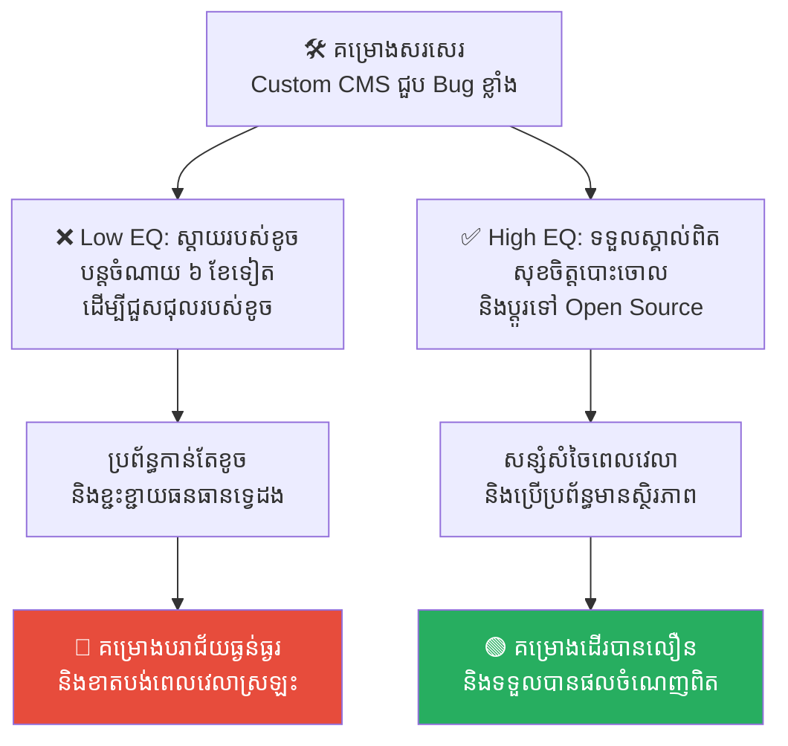
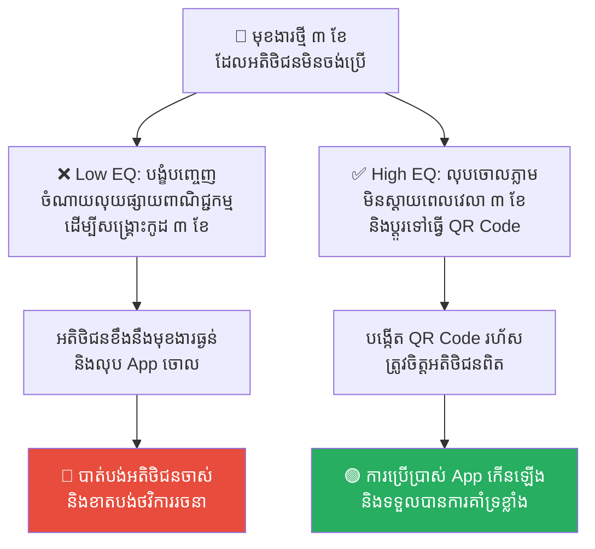
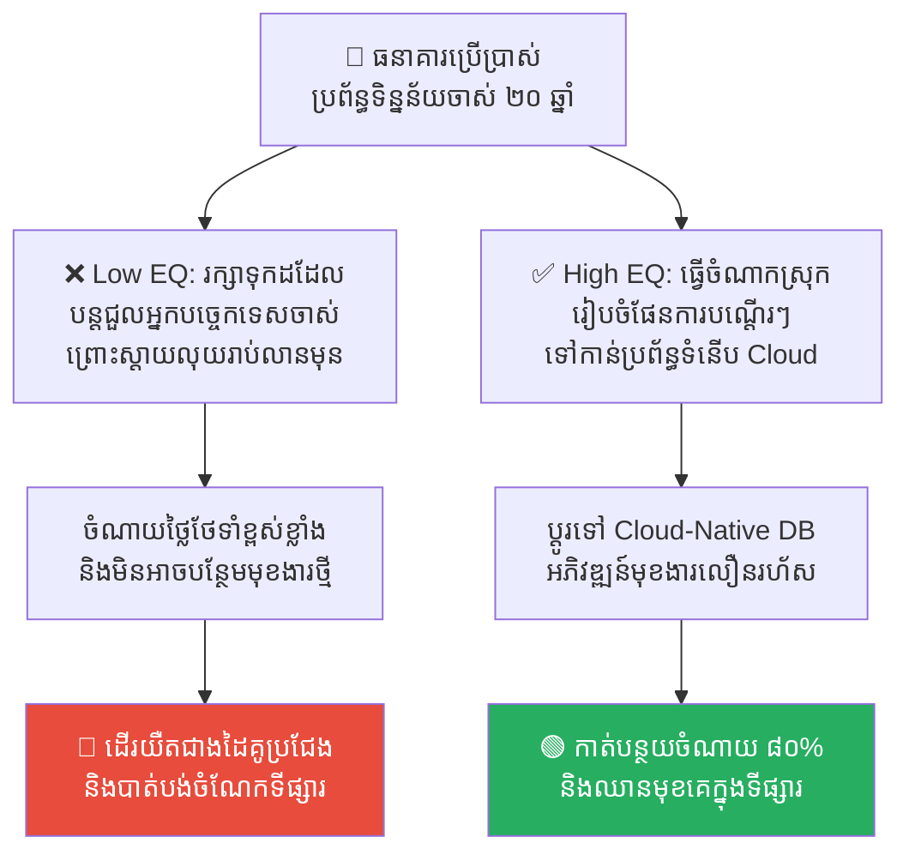
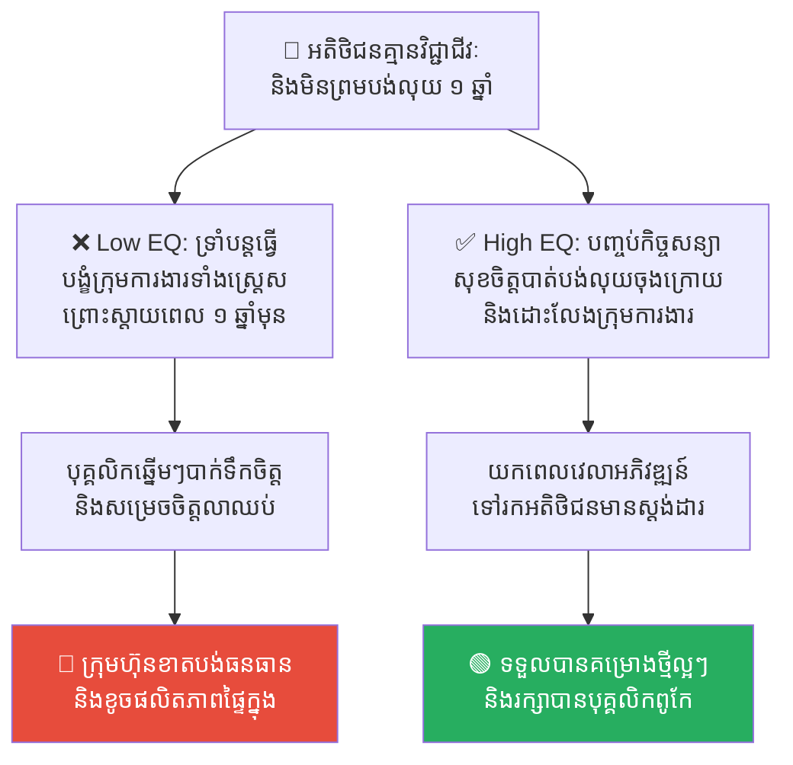
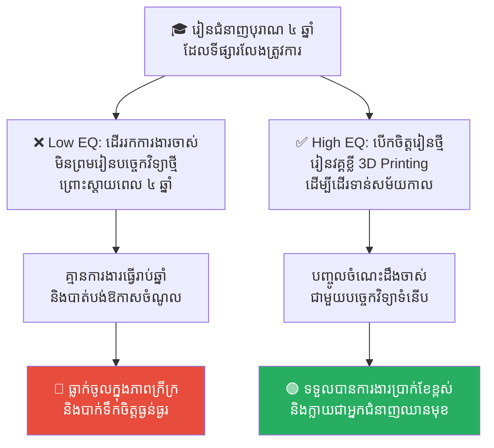

# Sunk Cost Fallacy: The Trap of Past Investments (លម្អៀងស្តាយរបស់ខូច៖ អន្ទាក់នៃការវិនិយោគអតីតកាល)

**Author:** ichamrong  
**Date:** 2026-05-17  
**Tags:** #cognitive-bias #sunk-cost-fallacy #decision-making #project-management  
**Category:** Concepts  
**Read Time:** ~15 min  

---

## 📌 មាតិកា (Table of Contents)
- [លំនាំបញ្ហា (The Pattern)](#លំនាំបញ្ហា-the-pattern)
- [១. បញ្ហា៖ តើអ្វីទៅជា Sunk Cost Fallacy? (The Issue: The Sunk Cost Trap)](#១-បញ្ហា-តើអ្វីទៅជា-sunk-cost-fallacy-the-issue-the-sunk-cost-trap)
- [២. ឧទាហរណ៍ជាក់ស្តែងក្នុងពិភពពិត (Real World Examples)](#២-ឧទាហរណ៍ជាក់ស្តែងក្នុងពិភពពិត)
  - [ឧទាហរណ៍ទី ១ — ការកែប្រែកូដចាស់ៗដែលខូច (Legacy Software Refactoring)](#ឧទាហរណ៍ទី-១-ការកែប្រែកូដចាស់ៗដែលខូច-legacy-software-refactoring)
  - [ឧទាហរណ៍ទី ២ — ការព្យាយាមបង្កើតមុខងារដែលគ្មានអ្នកប្រើប្រាស់ (Product Feature Development)](#ឧទាហរណ៍ទី-២-ការព្យាយាមបង្កើតមុខងារដែលគ្មានអ្នកប្រើប្រាស់-product-feature-development)
  - [ឧទាហរណ៍ទី ៣ — ការបន្តវិនិយោគលើបច្ចេកវិទ្យាហួសសម័យ (Tech Stack Investment)](#ឧទាហរណ៍ទី-៣-ការបន្តវិនិយោគលើបច្ចេកវិទ្យាហួសសម័យ-tech-stack-investment)
  - [ឧទាហរណ៍ទី ៤ — ទំនាក់ទំនងដៃគូធុរកិច្ចដែលមានជាតិពុល (Toxic Client/Partner Relationship)](#ឧទាហរណ៍ទី-៤-ទំនាក់ទំនងដៃគូធុរកិច្ចដែលមានជាតិពុល-toxic-clientpartner-relationship)
  - [ឧទាហរណ៍ទី ៥ — ការប្រកាន់ខ្ជាប់ជំនាញដែលហួសសម័យ (Personal Education/Career Path)](#ឧទាហរណ៍ទី-៥-ការប្រកាន់ខ្ជាប់ជំនាញដែលហួសសម័យ-personal-educationcareer-path)
- [៣. កត្តាជម្រុញ៖ ការខ្លាចខាតបង់ និងអំនួតខុសរឿង (The Aggravator: Loss Aversion & Ego Pride)](#៣-កត្តាជម្រុញ-ការខ្លាចខាតបង់-និងអំនួតខុសរឿង-the-aggravator-loss-aversion-ego-pride)
- [៤. ដំណោះស្រាយទូទៅ៖ របៀបរំដោះខ្លួនតាមរយៈ Zero-Based Thinking (The General Solution: Breaking Free)](#៤-ដំណោះស្រាយទូទៅ-របៀបរំដោះខ្លួនតាមរយៈ-zero-based-thinking-the-general-solution-breaking-free)
- [សេចក្តីសន្និដ្ឋាន (Conclusion)](#សេចក្តីសន្និដ្ឋាន-conclusion)
- [Related Posts](#related-posts)

---

## លំនាំបញ្ហា (The Pattern)

អ្នកបានទិញសំបុត្រកុនមួយសន្លឹកតម្លៃ ១០ ដុល្លារ។ មើលបាន ៣០ នាទី អ្នកដឹងច្បាស់ថារឿងនេះអន់មើលបំផុត គួរឱ្យធុញទ្រាន់ និងគ្មានខ្លឹមសារអ្វីទាំងអស់។ 

តើអ្នកគួរក្រោកដើរចេញពី រោងកុនភ្លាម ដើម្បីយកពេលវេលា ២ ម៉ោងដែលនៅសល់ទៅធ្វើអ្វីផ្សេងដែលសប្បាយចិត្ត ឬក៏អ្នកសុខចិត្តទ្រាំអង្គុយមើលរហូតដល់ចប់ទាំងឈឺក្បាល គ្រាន់តែព្រោះតែ៖ *«ស្តាយលុយ ១០ ដុល្លារដែលបានទិញសំបុត្ររួចហើយ»*?

ប្រសិនបើអ្នករើសយកការទ្រាំអង្គុយមើល នោះមានន័យថាអ្នកកំពុងធ្លាក់ចូលក្នុងអន្ទាក់ **Sunk Cost Fallacy (លម្អៀងស្តាយរបស់ខូច)**។ 

អ្នកបានបាត់បង់ ១០ ដុល្លាររួចជាស្ថាពរទៅហើយ (មិនអាចយកមកវិញបានទេ) ប៉ុន្តែអ្នកបែរជាសម្រេចចិត្តបំផ្លាញពេលវេលា ២ ម៉ោងបន្ថែមទៀត ដែលជាការខាតបង់ទ្វេដង។ នេះហើយជាអន្ទាក់នៃការគិតដែលបំផ្លាញធនធាន និងគម្រោងរាប់ពាន់នៅក្នុងវិស័យបច្ចេកវិទ្យា និងធុរកិច្ច។

---

## ១. បញ្ហា៖ តើអ្វីទៅជា Sunk Cost Fallacy? (The Issue: The Sunk Cost Trap)

នៅក្នុងសេដ្ឋកិច្ច **Sunk Cost (ថ្លៃដើមលិចលង់)** គឺជាការចំណាយ (ទោះជាពេលវេលា លុយកាក់ ឬកម្លាំងពលកម្ម) ដែលបានចំណាយទៅហើយ និងមិនអាចស្រង់ត្រឡប់មកវិញបានឡើយ ទោះក្នុងកាលៈទេសៈណាក៏ដោយ។

**Sunk Cost Fallacy** គឺជាកំហុសនៃការគិត ដែលធ្វើឱ្យមនុស្សបន្តប្រកាន់ខ្ជាប់ ឬបន្តបោះទុនបន្ថែមទៅលើគម្រោង ទំនាក់ទំនង ឬការសម្រេចចិត្តដែលកំពុងបរាជ័យ គ្រាន់តែដោយសារតែពួកគេបានចំណាយធនធានលើវារួចមកហើយពីអតីតកាល។

ខួរក្បាលរបស់មនុស្សយើងតែងតែយល់ច្រឡំថា ការបោះបង់គម្រោងចោល ស្មើនឹងការទទួលស្គាល់ថាខ្លួនឯង «បរាជ័យ»។ ដូច្នេះ យើងខំប្រឹងបោះលុយ និងពេលវេលាបន្ថែម ដើម្បីសង្ឃឹមថានឹងអាចកែប្រែស្ថានភាពបាន ដែលការពិតវាប្រៀបដូចជា៖

> 💡 **«ការបន្តជិះទូកដែលកំពុងលិច គ្រាន់តែព្រោះតែអ្នកបានទិញសំបុត្រទូកនោះក្នុងតម្លៃថ្លៃពេក។»**

---

## ២. ឧទាហរណ៍ជាក់ស្តែងក្នុងពិភពពិត

សូមពិនិត្យមើល **ឧទាហរណ៍ជាក់ស្តែងចំនួន ៥** បង្ហាញពីរបៀបដែលលម្អៀងស្តាយរបស់ខូចបំផ្លាញការងារ និងវិធីសាស្ត្រដោះស្រាយ៖

---

### ឧទាហរណ៍ទី ១ — ការកែប្រែកូដចាស់ៗដែលខូច (Legacy Software Refactoring)

**ស្ថានភាព៖** ក្រុមហ៊ុនមួយបានចំណាយពេល ៦ ខែ និងថវិការាប់ម៉ឺនដុល្លារដើម្បីសរសេរកម្មវិធី Custom CMS មួយ ដែលដើរយឺត និងពោរពេញដោយ Bug។

*   **សកម្មភាពអសកម្ម / Low EQ / កំហុសឆ្គង៖** Lead Developer សម្រេចចិត្តបន្តចំណាយពេល ៦ ខែបន្ថែមទៀត និងជួលមនុស្សបន្ថែមដើម្បីព្យាយាម «ជួសជុល» វា គ្រាន់តែព្រោះតែស្តាយក្រោយនឹងពេលវេលា និងថវិកាដែលបានបាត់បង់ទៅហើយ (Sunk Cost) ជំនួសឱ្យការទទួលស្គាល់បរាជ័យ និងប្តូរទៅប្រើប្រព័ន្ធ Open Source ដ៏មានស្ថិរភាព។
*   **សកម្មភាពស្ថាបនា / High EQ / ដំណោះស្រាយ៖** ទទួលស្គាល់ថាពេលវេលា ៦ ខែមុនគឺបានបាត់បង់ជាស្ថាពរ (Sunk Cost) ហើយវានឹងមិនត្រលប់មកវិញឡើយ។ ផ្តោតលើការសម្រេចចិត្តអនាគត៖ បោះចោល custom CMS នោះ រួចប្តូរទៅប្រើប្រព័ន្ធ Open Source ភ្លាមៗ ដើម្បីសន្សំសំចៃធនធាន និងពេលវេលាអនាគត។
*   **លទ្ធផល៖** ការបន្តធ្វើរឿងខុសឆ្គងព្រោះស្តាយរបស់ចាស់នាំឱ្យគម្រោងបរាជ័យទ្វេដង និងខាតបង់ធនធានទាំងស្រុង។ ការបោះចោលប្រព័ន្ធចាស់ជួយឱ្យសន្សំសំចៃធនធាន និងសម្រេចការងារបានជោគជ័យ។

---

### ឧទាហរណ៍ទី ២ — ការព្យាយាមបង្កើតមុខងារដែលគ្មានអ្នកប្រើប្រាស់ (Product Feature Development)

**ស្ថានភាព៖** ក្រុមការងារផលិតផល (Product Team) បានចំណាយពេល ៣ ខែ ដើម្បីរចនា និងសរសេរកូដសម្រាប់មុខងារ «ស្កេនមុខដើម្បីបង់ប្រាក់» នៅក្នុង App ទិញទំនិញ។ ពេលតេស្តសាកល្បង អតិថិជន ៩០% និយាយថាពួកគេមិនចង់ប្រើវាទេ ព្រោះពួកគេបារម្ភពីសុវត្ថិភាពឯកជនភាព។

*   **សកម្មភាពអសកម្ម / Low EQ / កំហុសឆ្គង៖** Product Manager បង្ខំចិត្តឱ្យក្រុមការងារបន្តបញ្ចេញមុខងារនេះទៅផលិតកម្មពិត (Production) និងចំណាយលុយលើការផ្សាយពាណិជ្ជកម្មបន្ថែម ដើម្បីបង្ខំឱ្យគេប្រើ ព្រោះ៖ *«ពួកយើងបានចំណាយពេលសរសេរកូដវា ៣ ខែមកហើយ មិនអាចទុកវាចោលឥតប្រយោជន៍ទេ!»*
*   **សកម្មភាពស្ថាបនា / High EQ / ដំណោះស្រាយ៖** សម្រេចចិត្តបង្កក ឬលុបចោលមុខងារនេះភ្លាមៗ (Kill the feature) ដោយមិនស្តាយស្រណោះ រួចយកកម្លាំងក្រុមការងារទៅអភិវឌ្ឍមុខងារ «បង់លុយរហ័សតាម QR Code» ដែលជាតម្រូវការពិតរបស់អតិថិជនវិញ។
*   **លទ្ធផល៖** ការបង្ហូរថវិកាថែមដើម្បីសង្គ្រោះមុខងារដែលគ្មាននរណាត្រូវការ នាំឱ្យខាតបង់ធនធានទីផ្សារ និងធ្វើឱ្យ App កាន់តែធ្ងន់ និងស្មុគស្មាញ។ ការលុបចោលមុខងារអសកម្មជួយឱ្យផលិតផលផ្តោតចំគោលដៅ និងកើនឡើងចំនួនអ្នកប្រើប្រាស់ពិតប្រាកដ។

---

### ឧទាហរណ៍ទី ៣ — ការបន្តវិនិយោគលើបច្ចេកវិទ្យាហួសសម័យ (Tech Stack Investment)

**ស្ថានភាព៖** ធនាគារមួយបានប្រើប្រាស់ប្រព័ន្ធគ្រប់គ្រងទិន្នន័យ COBOL ចាស់ជរារយៈពេល ២០ ឆ្នាំមកហើយ។ រាល់ពេលចង់បន្ថែមមុខងារថ្មី ធនាគារត្រូវជួលវិស្វករចាស់ៗដែលជិតចូលនិវត្តន៍មកសរសេរក្នុងតម្លៃថ្លៃខ្លាំង និងចំណាយពេលយូរ។

*   **សកម្មភាពអសកម្ម / Low EQ / កំហុសឆ្គង៖** ថ្នាក់ដឹកនាំមិនព្រមធ្វើការផ្លាស់ប្តូរទៅកាន់ Cloud-Native Databases (ដូចជា PostgreSQL ឬ DynamoDB) ឡើយ ព្រោះ៖ *«យើងបានវិនិយោគលុយរាប់លានដុល្លាររួចទៅហើយលើប្រព័ន្ធ COBOL នេះ មិនអាចបោះបង់វាចោលបានទេ!»*
*   **សកម្មភាពស្ថាបនា / High EQ / ដំណោះស្រាយ៖** រៀបចំផែនការបណ្តើរៗរយៈពេល ២ ឆ្នាំ ដើម្បីធ្វើចំណាកស្រុកទិន្នន័យ (Data Migration) ទៅកាន់ប្រព័ន្ធទំនើប ដោយទទួលស្គាល់ថាលុយរាប់លានពីមុនគឺបានជួយធនាគារដើររយៈពេល ២០ ឆ្នាំរួចហើយ តែវាមិនអាចយកមកធ្វើជាយុថ្កាចងជើងការអភិវឌ្ឍន៍អនាគតបានឡើយ។
*   **លទ្ធផល៖** ការរងសម្ពាធបច្ចេកវិទ្យាចាស់នាំឱ្យធនាគារដើរយឺតជាងដៃគូប្រកួតប្រជែង និងចំណាយថ្លៃថែទាំកាន់តែខ្ពស់ទៅៗជារៀងរាល់ឆ្នាំ។ ការផ្លាស់ប្តូរទៅកាន់ប្រព័ន្ធថ្មីជួយឱ្យការបង្កើតមុខងារថ្មីលឿន និងកាត់បន្ថយការចំណាយបាន ៨០%។

---

### ឧទាហរណ៍ទី ៤ — ទំនាក់ទំនងដៃគូធុរកិច្ចដែលមានជាតិពុល (Toxic Client/Partner Relationship)

**ស្ថានភាព៖** Software Agency មួយទទួលបានគម្រោងពីអតិថិជនម្នាក់ដែលតែងតែផ្លាស់ប្តូរតម្រូវការការងារជានិច្ច និយាយស្តីគ្មានសីលធម៌ និងមិនព្រមបង់លុយតាមកាលកំណត់។ គម្រោងនេះពន្យារពេល ១ ឆ្នាំមកហើយ។

*   **សកម្មភាពអសកម្ម / Low EQ / កំហុសឆ្គង៖** ម្ចាស់ Agency សុខចិត្តទ្រាំបន្តធ្វើការងារឱ្យអតិថិជននោះ និងបង្ខំបុគ្គលិកឱ្យធ្វើការទាំងស្ត្រេស ព្រោះ៖ *«យើងបានធ្វើការងារនេះអស់រយៈពេល ១ ឆ្នាំហើយ បើបោះបង់ចោលឥឡូវនេះ យើងនឹងមិនទទួលបានលុយដំណាក់កាលចុងក្រោយឡើយ!»*
*   **សកម្មភាពស្ថាបនា / High EQ / ដំណោះស្រាយ៖** ធ្វើការវាយតម្លៃថ្លៃដើមនិងផលប្រយោជន៍ (Cost-Benefit Analysis)។ សម្រេចចិត្តបញ្ចប់កិច្ចសន្យាជាមួយអតិថិជននោះភ្លាម (Fire the client) ដោយសុខចិត្តបាត់បង់លុយដំណាក់កាលចុងក្រោយ ដើម្បីយកធនធាន និងពេលវេលារបស់បុគ្គលិកទៅបម្រើអតិថិជនថ្មីៗដែលមានវិជ្ជាជីវៈ និងផ្តល់ផលចំណេញខ្ពស់ជាង។
*   **លទ្ធផល៖** ការទ្រាំធ្វើការក្នុងបរិយាកាសពុលនាំឱ្យបុគ្គលិកឆ្នើមៗលាឈប់ពីការងារ និងខាតបង់ពេលវេលាអភិវឌ្ឍន៍ធុរកិច្ច។ ការផ្តាច់ទំនាក់ទំនងពុលជួយឱ្យក្រុមការងារមានទឹកចិត្ត ធ្វើការសប្បាយចិត្ត និងទាក់ទាញបានគម្រោងល្អៗជាច្រើន។

---

### ឧទាហរណ៍ទី ៥ — ការប្រកាន់ខ្ជាប់ជំនាញដែលហួសសម័យ (Personal Education/Career Path)

**ស្ថានភាព៖** បុគ្គលម្នាក់បានចំណាយពេល ៤ ឆ្នាំ និងថវិការាប់ពាន់ដុល្លាររៀនជំនាញកាត់ដេរស្បែកជើងតាមបែបបុរាណដោយដៃ។ ពេលបញ្ចប់ការសិក្សា ទីផ្សារការងារបានផ្លាស់ប្តូរទាំងស្រុងទៅជាការប្រើប្រាស់ម៉ាស៊ីន 3D Printing ស្វ័យប្រវត្ត។

*   **សកម្មភាពអសកម្ម / Low EQ / កំហុសឆ្គង៖** បុគ្គលនោះបដិសេធមិនព្រមទៅរៀនជំនាញ 3D Printing ឡើយ ហើយបន្តចំណាយពេលរាប់ឆ្នាំដើរស្វែងរកហាងកាត់ស្បែកជើងដោយដៃដែលស្ទើរតែគ្មានក្នុងទីក្រុង ព្រោះ៖ *«ខ្ញុំបានចំណាយពេល ៤ ឆ្នាំរៀនវាហើយ បើមិនធ្វើការងារនេះទេ ៤ ឆ្នាំរបស់ខ្ញុំនឹងក្លាយជាអាសារបង់!»*
*   **សកម្មភាពស្ថាបនា / High EQ / ដំណោះស្រាយ៖** ទទួលស្គាល់ថាមេរៀន ៤ ឆ្នាំកន្លងមកបានផ្តល់ចំណេះដឹងផ្នែករចនាម៉ូដរួចហើយ។ បញ្ឈប់ការរត់តាមរបៀបបុរាណ រួចចុះឈ្មោះរៀនវគ្គខ្លី 3D Printing រយៈពេល ៣ ខែ ដើម្បីបញ្ចូលចំណេះដឹងចាស់ជាមួយបច្ចេកវិទ្យាថ្មី។
*   **លទ្ធផល៖** ការប្រកាន់ខ្ជាប់របស់ចាស់នាំឱ្យគ្មានការងារធ្វើ និងធ្លាក់ចូលក្នុងភាពក្រីក្រ។ ការបើកចិត្តរៀនបច្ចេកវិទ្យាថ្មីជួយឱ្យទទួលបានការងារភ្លាមៗ និងក្លាយជាអ្នកជំនាញរចនាម៉ូដស្បែកជើងបែបឌីជីថលឈានមុខគេ។

---

## ៣. កត្តាជម្រុញ៖ ការខ្លាចខាតបង់ និងអំនួតខុសរឿង (The Aggravator: Loss Aversion & Ego Pride)

ហេតុអ្វីបានជាយើងពិបាកក្នុងការបោះបង់របស់ដែលខូចចោលខ្លាំងម្ល៉េះ? កត្តាជម្រុញចិត្តសាស្ត្ររួមមាន៖

1.  **ការខ្លាចខាតបង់ (Loss Aversion)៖** មនុស្សយើងស្អប់ការបាត់បង់ខ្លាំងជាងការចង់បានជោគជ័យ។ ការបោះបង់ចោលគម្រោងមួយ ធ្វើឱ្យយើងមានអារម្មណ៍ថា «យើងកំពុងបាត់បង់លុយ និងពេលវេលាភ្លាមៗ» ទោះបីជាការពិតវានឹងជួយការពារយើងកុំឱ្យខាតបង់ថែមទៀតក៏ដោយ។
2.  **អំនួត និងកេរ្តិ៍ឈ្មោះ (Ego and Reputation)៖** ថ្នាក់ដឹកនាំ ឬវិស្វករច្រើនតែបារម្ភពី «មុខមាត់» របស់ខ្លួននៅក្នុងក្រុមហ៊ុន។ ពួកគេខ្លាចអ្នកដទៃនិយាយថាពួកគេសម្រេចចិត្តខុស ទើបពួកគេខំប្រឹងរុញគម្រោងដែលបរាជ័យឱ្យទៅមុខទៀត ដើម្បីបិទបាំងកំហុសដំបូង។
3.  **ការយល់ច្រឡំលើតម្លៃ (The IKEA Effect)៖** យើងតែងតែផ្តល់តម្លៃខ្ពស់ហួសហេតុទៅលើរបស់ដែលយើងបានចូលរួមបង្កើត ឬចំណាយកម្លាំងសាងសង់ ទោះបីជារបស់នោះមានគុណភាពអន់ខ្លាំងក៏ដោយ។

---

## ៤. ដំណោះស្រាយទូទៅ៖ របៀបរំដោះខ្លួនតាមរយៈ Zero-Based Thinking (The General Solution: Breaking Free)

ដើម្បីកម្ចាត់ភាពលម្អៀងនេះ និងធ្វើការសម្រេចចិត្តប្រកបដោយភាពចាស់ទុំ ចូរអនុវត្តគោលការណ៍សំខាន់ៗ ៣ យ៉ាង៖

1.  **គោលការណ៍គិតពីចំណុចសូន្យ (Zero-Based Thinking)៖** រាល់ពេលដែលអ្នកត្រូវសម្រេចចិត្តថាតើគួរដកខ្លួន ឬបន្ត ចូរចោទសួរខ្លួនឯងថា៖ *«ប្រសិនបើថ្ងៃនេះ ខ្ញុំមិនទាន់បានចំណាយលុយ ឬពេលវេលាលើគម្រោងនេះសូម្បីតែមួយសេន តើខ្ញុំនឹងយល់ព្រមបោះទុនធ្វើវាដែរឬទេ?»* ប្រសិនបើចម្លើយគឺ **«ទេ»** ➡️ ចូរបញ្ឈប់វាភ្លាមឥឡូវនេះ!
2.  **បំបែកតួនាទីអ្នកសម្រេចចិត្ត (Separate the Decision Maker)៖** ជារឿយៗ មនុស្សដែលបានសម្រេចចិត្តបោះទុនដំបូង ពិបាកនឹងបោះបង់វាចោលណាស់ ព្រោះមានអំនួតជាប់ពាក់ព័ន្ធ។ ចូរនាំយកមនុស្សទី៣ (ដូចជា ទីប្រឹក្សា ឬគណៈកម្មការឯករាជ្យ) ដែលគ្មានមនោសញ្ចេតនាជាមួយគម្រោង មកធ្វើការវាយតម្លៃ និងធ្វើសេចក្តីសម្រេចចិត្ត។
3.  **បង្រួញនិយមន័យនៃជោគជ័យ (Redefining Sunk Cost as Tuition Fees)៖** ផ្លាស់ប្តូរការគិតរបស់អ្នកពី៖ *«ខ្ញុំបានខាតបង់ពេល ៦ ខែ»* ទៅជា *«ខ្ញុំបានចំណាយពេល ៦ ខែដើម្បីរៀនសូត្រពីរបៀបដែលមិនដំណើរការ។ ឥឡូវនេះខ្ញុំមានចំណេះដឹងដើម្បីចាប់ផ្តើមជាថ្មីឱ្យកាន់តែល្អជាងមុន។»*

---

## សេចក្តីសន្និដ្ឋាន (Conclusion)

**លម្អៀងស្តាយរបស់ខូច (Sunk Cost Fallacy)** គឺជាអន្ទាក់ដែលសម្លាប់ក្រុមហ៊ុន និងអាជីវកម្មជាច្រើនរៀងរាល់ថ្ងៃ។ អតីតកាលគឺកន្លងហួសទៅហើយ ហើយធនធានដែលបានបាត់បង់ទៅគឺបានបាត់បង់ជាស្ថាពរ។ ការសម្រេចចិត្តដែលមានហេតុផល ត្រូវតែផ្តោតលើ **«ការចំណាយ និងផលប្រយោជន៍អនាគតតែមួយគត់»** មិនមែនផ្អែកលើការស្តាយស្រណោះរបស់ដែលខូចរួចទៅហើយនោះទេ។

ចូរចងចាំថា៖ **«កុំស្តាយទឹកដោះគោដែលកំពប់ទៅហើយ តែត្រូវប្រយ័ត្នកុំឱ្យកំពប់ទឹកដោះគោកែវទីពីរ។»**

---

## Related Posts

*   **[30 The King and the Bridge to Nowhere](../parables/30-the-bridge-to-nowhere.md)** — រឿងប្រៀបធៀបដ៏អស្ចារ្យអំពីស្តេចដែលបន្តសាងសង់ស្ពានទៅកាន់ទីទទេស្អាត ដោយសារតែការស្តាយប្រាក់ដែលបានចំណាយរួចហើយ។
*   **[20 Cognitive Biases Overview](./20-cognitive-biases-the-flaws-in-human-thinking.md)** — ទិដ្ឋភាពទូទៅនៃលម្អៀងការយល់ឃើញ និងរបៀបដែលវាបិទបាំងខួរក្បាលរបស់យើងក្នុងការធ្វើសេចក្តីសម្រេចចិត្ត។

---

*Last updated: 2026-05-26*
