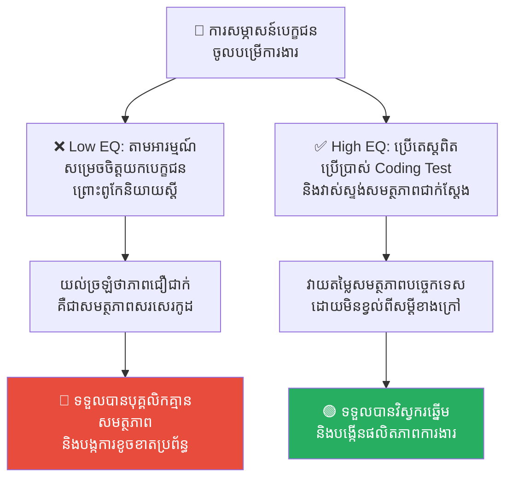
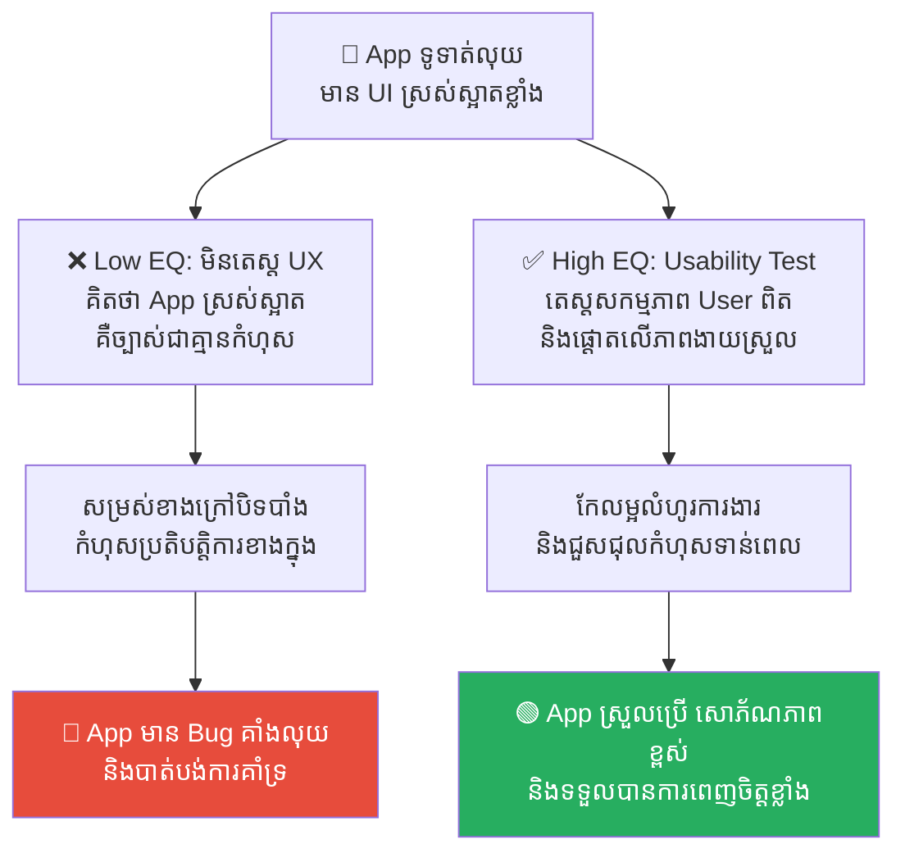
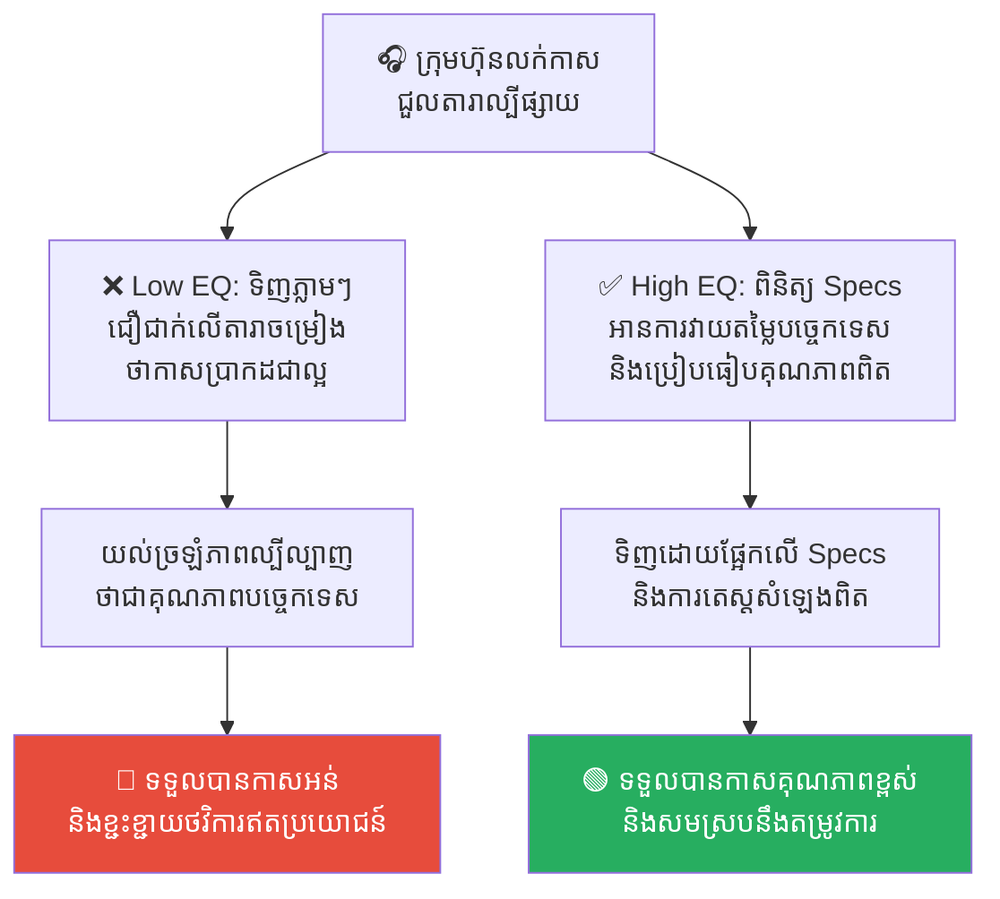
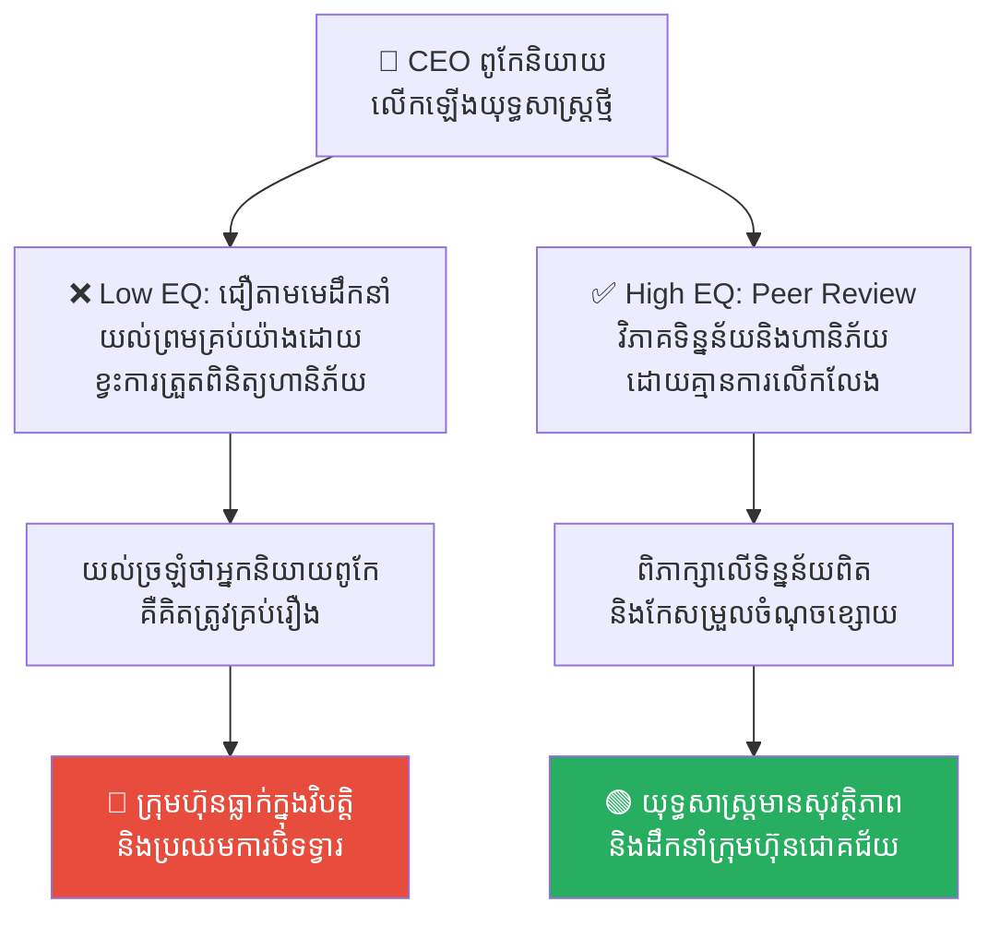
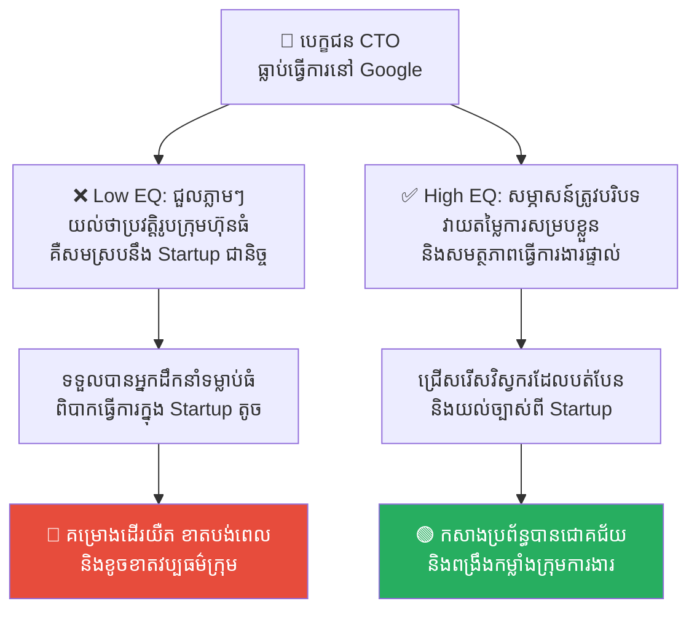

# The Halo Effect: The Illusion of Perfection (លម្អៀងពន្លឺបំភាន់ភ្នែក៖ ការយល់ច្រឡំលើភាពល្អឥតខ្ចោះ)

**Author:** ichamrong  
**Date:** 2026-05-17  
**Tags:** #cognitive-bias #halo-effect #psychology #hiring #ui-ux  
**Category:** Concepts  
**Read Time:** ~15 min  

---

## 📌 មាតិកា (Table of Contents)
- [លំនាំបញ្ហា (The Pattern)](#លំនាំបញ្ហា-the-pattern)
- [១. បញ្ហា៖ តើអ្វីទៅជា The Halo Effect? (The Issue: The Halo Illusion)](#១-បញ្ហា-តើអ្វីទៅជា-the-halo-effect-the-issue-the-halo-illusion)
- [២. ឧទាហរណ៍ជាក់ស្តែងក្នុងពិភពពិត (Real World Examples)](#២-ឧទាហរណ៍ជាក់ស្តែងក្នុងពិភពពិត)
  - [ឧទាហរណ៍ទី ១ — ការជ្រើសរើសបុគ្គលិកដោយផ្អែកលើការនិយាយស្តី (Technical Hiring Charisma)](#ឧទាហរណ៍ទី-១-ការជ្រើសរើសបុគ្គលិកដោយផ្អែកលើការនិយាយស្តី-technical-hiring-charisma)
  - [ឧទាហរណ៍ទី ២ — App ស្រស់ស្អាតតែគ្មានគុណភាព (Beautiful UI vs. Broken UX)](#ឧទាហរណ៍ទី-២-app-ស្រស់ស្អាតតែគ្មានគុណភាព-beautiful-ui-vs-broken-ux)
  - [ឧទាហរណ៍ទី ៣ — ការគាំទ្រផលិតផលតាមតារាល្បីៗ (Celebrity Endorsement)](#ឧទាហរណ៍ទី-៣-ការគាំទ្រផលិតផលតាមតារាល្បីៗ-celebrity-endorsement)
  - [ឧទាហរណ៍ទី ៤ — ការជឿជាក់លើមេដឹកនាំដោយខ្វះការពិចារណា (Charismatic Leadership)](#ឧទាហរណ៍ទី-៤-ការជឿជាក់លើមេដឹកនាំដោយខ្វះការពិចារណា-charismatic-leadership)
  - [ឧទាហរណ៍ទី ៥ — លំអៀងប្រវត្តិរូបសង្ខេបមកពីក្រុមហ៊ុនធំ (Prestigious Resume Bias)](#ឧទាហរណ៍ទី-៥-លំអៀងប្រវត្តិរូបសង្ខេបមកពីក្រុមហ៊ុនធំ-prestigious-resume-bias)
- [៣. កត្តាជម្រុញ៖ ចំណាប់អារម្មណ៍ដំបូង និងការស្វែងរកផ្លូវកាត់ (The Aggravator: First Impression & Mental Shortcuts)](#៣-កត្តាជម្រុញ-ចំណាប់អារម្មណ៍ដំបូង-និងការស្វែងរកផ្លូវកាត់-the-aggravator-first-impression-mental-shortcuts)
- [៤. ដំណោះស្រាយទូទៅ៖ របៀបបំបែកពន្លឺបំភាន់ភ្នែក (The General Solution: Shattering the Halo)](#៤-ដំណោះស្រាយទូទៅ-របៀបបំបែកពន្លឺបំភាន់ភ្នែក-the-general-solution-shattering-the-halo)
- [សេចក្តីសន្និដ្ឋាន (Conclusion)](#សេចក្តីសន្និដ្ឋាន-conclusion)
- [Related Posts](#related-posts)

---

## លំនាំបញ្ហា (The Pattern)

នៅពេលដែលអ្នកជួបបុគ្គលិកថ្មីម្នាក់ដែលស្លៀកពាក់ឈុតអាវធំយ៉ាងសង្ហា និយាយស្តីផ្អែមល្ហែម និងមានស្នាមញញឹមដ៏ទាក់ទាញ តើអ្នកធ្លាប់លួចគិតក្នុងចិត្តទេថា៖ *«គាត់ប្រាកដជាមនុស្សដែលពូកែធ្វើការងារ មានវិន័យខ្ពស់ ឆ្លាតវៃ និងមានសីលធម៌ល្អណាស់»*?

ផ្ទុយទៅវិញ ប្រសិនបើអ្នកឃើញបុគ្គលិកម្នាក់ទៀត ស្លៀកពាក់ខោអាវធម្មតា សក់ក្បាលរញ៉េរញ៉ៃ និងនិយាយស្តីអៀនប្រៀន តើអ្នកនឹងលួចវាយតម្លៃភ្លាមៗថា៖ *«គាត់ច្បាស់ជាមនុស្សខ្ជិលច្រអូស និងមិនសូវឆ្លាតទេ»* មែនទេ?

ការវាយតម្លៃមនុស្សម្នាក់ ឬផលិតផលមួយជាទូទៅល្អឥតខ្ចោះ ផ្អែកលើ «លក្ខណៈលេចធ្លោវិជ្ជមានតែមួយចំណុចខាងក្រៅ» ត្រូវបានគេស្គាល់ថាជា **The Halo Effect (លម្អៀងពន្លឺបំភាន់ភ្នែក)**។ 

ចំណែកឯឥទ្ធិពលផ្ទុយពីវា គឺការវាយតម្លៃអាក្រក់គ្រប់យ៉ាងផ្អែកលើចំណុចអវិជ្ជមានតែមួយចំណុច ហៅថា **The Horn Effect (ឥទ្ធិពលស្នែងបិសាច)**។ ទាំងពីរនេះ គឺជាអន្ទាក់យល់ឃើញដែលធ្វើឱ្យយើងមើលរំលងការពិតជាក់ស្តែង និងបង្កជាកំហុសដ៏ធ្ងន់ធ្ងរក្នុងការគ្រប់គ្រងការងារ។

---

## ១. បញ្ហា៖ តើអ្វីទៅជា The Halo Effect? (The Issue: The Halo Illusion)

ពាក្យថា **Halo** សំដៅលើ «រស្មី ឬរង្វង់ពន្លឺ» ដែលនៅពីលើក្បាលរបស់ទេវតា ឬព្រះ។ នៅពេលនរណាម្នាក់មាន Halo យើងនឹងមើលឃើញពួកគេល្អ និងបរិសុទ្ធគ្រប់យ៉ាង។

**The Halo Effect** គឺជាការលម្អៀងការយល់ឃើញ (Cognitive Bias) ដែលកើតឡើងនៅពេលដែលចំណាប់អារម្មណ៍វិជ្ជមានដំបូងរបស់យើងទៅលើ **«ចំណុចលេចធ្លោមួយ»** របស់មនុស្ស ឬផលិតផល បានជះឥទ្ធិពលរាលដាលធ្វើឱ្យយើងមើលឃើញ «ចំណុចផ្សេងៗទៀត» ល្អទាំងអស់ដែរ ដោយគ្មានមូលដ្ឋានហេតុផលពិតប្រាកដ។

ជាភាសាសាមញ្ញ៖ 

> ❌ **«បើគាត់ស្អាត ឬពូកែនិយាយ គាត់ប្រាកដជាធ្វើការងារពូកែ និងជាមនុស្សល្អ!»**

ខួរក្បាលរបស់មនុស្សយើងខ្ជិលក្នុងការបែងចែកលក្ខណៈសម្បត្តិនីមួយៗដោយឡែកពីគ្នា។ វាងាយស្រួលជាងក្នុងការបូកសរុបអ្វីៗគ្រប់យ៉ាងឱ្យទៅជា «វិជ្ជមានទាំងស្រុង» ឬ «អវិជ្ជមានទាំងស្រុង»។ នេះនាំឱ្យកើតមានភាពអយុត្តិធម៌ការងារ និងការសម្រេចចិត្តវិនិយោគខុសឆ្គង។

---

## ២. ឧទាហរណ៍ជាក់ស្តែងក្នុងពិភពពិត

សូមពិនិត្យមើល **ឧទាហរណ៍ជាក់ស្តែងចំនួន ៥** បង្ហាញពីរបៀបដែលលម្អៀងពន្លឺបំភាន់ភ្នែកបោកប្រាស់យើង និងវិធីសាស្ត្រដោះស្រាយ៖

---

### ឧទាហរណ៍ទី ១ — ការជ្រើសរើសបុគ្គលិកដោយផ្អែកលើការនិយាយស្តី (Technical Hiring Charisma)

**ស្ថានភាព៖** ក្រុមហ៊ុនចង់ជ្រើសរើស Senior JavaScript Developer ម្នាក់។ បេក្ខជនម្នាក់ឈ្មោះ សុខា និយាយស្តីបានយ៉ាងស្ទាត់ជំនាញ មានភាពទាក់ទាញ (Charismatic) និងមានទំនុកចិត្តលើខ្លួនឯងខ្ពស់ខ្លាំងក្នុងពេលសម្ភាសន៍។

*   **សកម្មភាពអសកម្ម / Low EQ / កំហុសឆ្គង៖** អ្នកសម្ភាសន៍ (Interviewer) ធ្លាក់ចូលក្នុងលំអៀង Halo Effect ដោយយល់ច្រឡំថា «ភាពមានទំនុកចិត្ត និងពូកែនិយាយ» គឺស្មើនឹង «សមត្ថភាពសរសេរកូដដ៏ពូកែ»។ ពួកគេសម្រេចចិត្តយក សុខា ចូលធ្វើការដោយមិនបានធ្វើតេស្តសរសេរកូដជាក់ស្តែងឡើយ។ ក្រោយមក ទើបដឹងថា សុខា សរសេរកូដមូលដ្ឋានមិនកើត និងសរសេរកូដពោរពេញដោយកំហុស។
*   **សកម្មភាពស្ថាបនា / High EQ / ដំណោះស្រាយ៖** អនុវត្ត **Structured Technical Assessment**។ ត្រូវវាយតម្លៃបេក្ខជនដោយបំបែកលក្ខណៈនីមួយៗដាច់ពីគ្នា។ ប្រើប្រាស់តេស្តសរសេរកូដជាក់ស្តែង (Coding Test) មិនចាំបាច់ខ្វល់ពីភាពរស់រវើកនៃការនិយាយស្តី ដើម្បីវាស់ស្ទង់សមត្ថភាពពិតរបស់បេក្ខជន។
*   **លទ្ធផល៖** ការជ្រើសរើសមនុស្សតាមសម្ដីនាំឱ្យទទួលបានបុគ្គលិកគ្មានសមត្ថភាពពិត និងខាតបង់ពេលវេលាបណ្តុះបណ្តាល។ ការប្រើតេស្តបច្ចេកទេសជួយឱ្យក្រុមហ៊ុនទទួលបានវិស្វករឆ្នើមពិតប្រាកដ ទោះបីជាពួកគេជា Introvert មិនសូវពូកែនិយាយក៏ដោយ។

---

### ឧទាហរណ៍ទី ២ — App ស្រស់ស្អាតតែគ្មានគុណភាព (Beautiful UI vs. Broken UX)

**ស្ថានភាព៖** ក្រុមការងារបានបង្កើត App ទូទាត់ប្រាក់មួយដែលមាន Design ស្រស់ស្អាតខ្លាំង (Stunning UI) ពណ៌ស៊ីគ្នាយ៉ាង premium និងមាន Micro-animations ទាក់ទាញភ្នែកបំផុត។

*   **សកម្មភាពអសកម្ម / Low EQ / កំហុសឆ្គង៖** ក្រុមការងារសន្និដ្ឋានថា App នេះពិតជាអស្ចារ្យ និងងាយស្រួលប្រើប្រាស់ណាស់ ដោយសារតែពួកគេឃើញវាស្អាត (Aesthetic-Usability Effect)។ ពួកគេមិនបានចំណាយពេលតេស្ត User Journey ស៊ីជម្រៅឡើយ។ ពេលបញ្ចេញទៅទីផ្សារ អតិថិជនជាច្រើនខឹងសម្បារ ព្រោះប៊ូតុងទូទាត់លុយស្មុគស្មាញរកមិនឃើញ និងមាន Bug គាំងលុយជានិច្ច។
*   **សកម្មភាពស្ថាបនា / High EQ / ដំណោះស្រាយ៖** ផ្តាច់ភាពស្អាតខាងក្រៅចេញពីមុខងារការងារ (Functionality)។ ធ្វើការតេស្តសាកល្បងជាមួយអ្នកប្រើប្រាស់ពិត (User Testing & Usability Audit) ដោយផ្តោតលើល្បឿន និងភាពងាយស្រួលនៃការបំពេញភារកិច្ច (Task Completion Rate) មិនមែនមើលតែសម្រស់ UI ឡើយ។
*   **លទ្ធផល៖** សម្រស់ខាងក្រៅបិទបាំងកំហុសប្រព័ន្ធនាំឱ្យអតិថិជនខកចិត្ត និងឈប់ប្រើប្រាស់ App ទាំងស្រុង។ ការធ្វើតេស្តមុខងារជាក់ស្តែងជួយឱ្យ App មានទាំងសម្រស់ និងភាពងាយស្រួលប្រើប្រាស់ប្រកបដោយស្ថិរភាព។

---

### ឧទាហរណ៍ទី ៣ — ការគាំទ្រផលិតផលតាមតារាល្បីៗ (Celebrity Endorsement)

**ស្ថានភាព៖** ក្រុមហ៊ុនបច្ចេកវិទ្យាមួយបានជួលតារាចម្រៀងល្បីបំផុតក្នុងប្រទេស ឱ្យមកផ្សព្វផ្សាយពាណិជ្ជកម្មកាសស្តាប់ត្រចៀកឥតខ្សែ (Wireless Earbuds) ថ្មីរបស់ខ្លួន។

*   **សកម្មភាពអសកម្ម / Low EQ / កំហុសឆ្គង៖** អតិថិជនរាប់ម៉ឺននាក់ ធ្លាក់ចូលក្នុងលំអៀង Halo Effect។ ពួកគេគិតថា៖ *«បើគាត់ជាតារាចម្រៀងដ៏អស្ចារ្យ របស់ដែលគាត់ប្រើ និងផ្សព្វផ្សាយប្រាកដជាមានសំឡេងពីរោះ និងគុណភាពខ្ពស់បំផុត!»* ពួកគេសម្រេចចិត្តទិញភ្លាមដោយមិនបានអាន Review បច្ចេកទេស។ ក្រោយមក ទើបដឹងថាកាសនោះមានសំឡេងបែក និងថ្មប្រើបានត្រឹម ១ ម៉ោងប៉ុណ្ណោះ។
*   **សកម្មភាពស្ថាបនា / High EQ / ដំណោះស្រាយ៖** អនុវត្ត **Objective Research**។ មុននឹងទិញឧបករណ៍បច្ចេកទេស ត្រូវសិក្សាពីលក្ខណៈបច្ចេកទេសពិតប្រាកដ (Specifications ដូចជា Battery life, Frequency response) និងអានការវាយតម្លៃពីអ្នកជំនាញសំឡេងឯករាជ្យ (Tech Reviewers)។
*   **លទ្ធផល៖** ការទិញរបស់តាមឥទ្ធិពលរស្មីតារានាំឱ្យខាតបង់ថវិកា និងទទួលបានរបស់គ្មានគុណភាពប្រើប្រាស់។ ការស្រាវជ្រាវព័ត៌មានបច្ចេកទេសច្បាស់លាស់ជួយឱ្យទទួលបានឧបករណ៍មានគុណភាពសក្តិសមនឹងតម្លៃទឹកប្រាក់។

---

### ឧទាហរណ៍ទី ៤ — ការជឿជាក់លើមេដឹកនាំដោយខ្វះការពិចារណា (Charismatic Leadership)

**ស្ថានភាព៖** នាយកប្រតិបត្តិ (CEO) ម្នាក់ជាមនុស្សដែលមានមន្តស្នេហ៍ (Charismatic Speaker) និយាយបំផុសគំនិតបានយ៉ាងអស្ចារ្យ និងមានបុគ្គលិកលក្ខណៈគួរឱ្យគោរពកោតសរសើរខ្លាំង។

*   **សកម្មភាពអសកម្ម / Low EQ / កំហុសឆ្គង៖** ក្រុមប្រឹក្សាភិបាល និងបុគ្គលិកទាំងអស់ជឿជាក់លើគាត់ដោយខ្វះការត្រិះរិះពិចារណា។ នៅពេលគាត់លើកឡើងពីយុទ្ធសាស្ត្រហិរញ្ញវត្ថុថ្មីមួយដ៏ប្រថុយប្រថាន មនុស្សគ្រប់គ្នាគិតថា៖ *«គាត់ជាអ្នកដឹកនាំដ៏អស្ចារ្យ យុទ្ធសាស្ត្ររបស់គាត់ច្បាស់ជាគ្មានកំហុសឡើយ!»* គ្មាននរណាម្នាក់ហ៊ានជំទាស់ ឬសួរដេញដោលឡើយ រហូតដល់ក្រុមហ៊ុនធ្លាក់ចូលក្នុងវិបត្តិហិរញ្ញវត្ថុបាក់ស្រុត។
*   **សកម្មភាពស្ថាបនា / High EQ / ដំណោះស្រាយ៖** គោរពបុគ្គល តែត្រូវត្រួតពិនិត្យគំនិតការងារ (Decouple Person from Strategy)។ បង្កើតប្រព័ន្ធការងារដែលតម្រូវឱ្យរាល់យុទ្ធសាស្ត្រធំៗ ត្រូវឆ្លងកាត់ការវិភាគទិន្នន័យជាក់ស្តែង (Peer Review & Risk Assessment) ពីក្រុមការងារពាក់ព័ន្ធ ដោយគ្មានការលើកលែងចំពោះអំណាចរបស់នរណាម្នាក់ឡើយ។
*   **លទ្ធផល៖** ការដើរតាមពន្លឺបំភាន់ភ្នែកមេដឹកនាំនាំឱ្យស្ថាប័នធ្លាក់ជ្រោះ និងខាតបង់ធនធានទាំងស្រុង។ ការត្រួតពិនិត្យគំនិតការងារដោយតម្លាភាពជួយការពារហានិភ័យ និងរក្សាបាននូវស្ថិរភាពធុរកិច្ចរយៈពេលវែង។

---

### ឧទាហរណ៍ទី ៥ — លំអៀងប្រវត្តិរូបសង្ខេបមកពីក្រុមហ៊ុនធំ (Prestigious Resume Bias)

**ស្ថានភាព៖** ក្រុមហ៊ុន Startup មួយចង់ជួល CTO ម្នាក់។ បេក្ខជនម្នាក់មានប្រវត្តិរូបសង្ខេប (Resume) គួរឱ្យរំភើបខ្លាំង ធ្លាប់ធ្វើការងារជាវិស្វករនៅក្រុមហ៊ុន FAANG (Facebook/Google) រយៈពេល ៥ ឆ្នាំ។

*   **សកម្មភាពអសកម្ម / Low EQ / កំហុសឆ្គង៖** ម្ចាស់ Startup ធ្លាក់ចូលក្នុងលំអៀង Halo Effect នៃពាក្យ «Google/Facebook»។ ពួកគេសន្និដ្ឋានថា បេក្ខជននេះច្បាស់ជាដឹងពីរបៀបកសាងប្រព័ន្ធ Startup ពីចំណុចសូន្យបានយ៉ាងល្អឥតខ្ចោះ និងសម្រេចចិត្តជួលភ្លាមៗ។ ក្រោយមក ទើបដឹងថា បេក្ខជននោះធ្លាប់តែធ្វើការងារលើមុខងារតូចមួយនៅក្នុងក្រុមហ៊ុនយក្ស ដែលមានធនធានស្រាប់ ហើយពិបាកសម្របខ្លួនខ្លាំងក្នុងបរិយាកាស Startup ដែលខ្វះខាតធនធាន និងត្រូវការភាពបត់បែនលឿន។
*   **សកម្មភាពស្ថាបនា / High EQ / ដំណោះស្រាយ៖** អនុវត្ត **Context-Fit Assessment**។ សួរដេញដោល និងវាយតម្លៃលើសមត្ថភាពដោះស្រាយបញ្ហាក្នុងស្ថានភាពជាក់ស្តែងរបស់ Startup៖ *«តើអ្នកធ្លាប់កសាងប្រព័ន្ធពីចំណុចសូន្យដោយគ្មានធនធានជំនួយពីមុនមកដែរឬទេ? តើអ្នកដោះស្រាយបញ្ហាលឿនដោយរបៀបណា?»*
*   **លទ្ធផល៖** ការវាយតម្លៃមនុស្សតាមតែឈ្មោះក្រុមហ៊ុននាំឱ្យទទួលបានអ្នកដឹកនាំមិនត្រូវនឹងបរិបទការងារ និងបង្កការខូចខាតវប្បធម៌ Startup។ ការសម្ភាសន៍ផ្អែកលើស្ថានភាពជាក់ស្តែងជួយឱ្យទទួលបានអ្នកដឹកនាំដែលបត់បែន និងសមស្របបំផុតជាមួយក្រុមហ៊ុន។

---

## ៣. កត្តាជម្រុញ៖ ចំណាប់អារម្មណ៍ដំបូង និងការស្វែងរកផ្លូវកាត់ (The Aggravator: First Impression & Mental Shortcuts)

ហេតុអ្វីបានជាលម្អៀងពន្លឺបំភាន់ភ្នែកមានអំណាចខ្លាំងមកលើការសម្រេចចិត្តរបស់យើង? កត្តាជម្រុញរួមមាន៖

1.  **អំណាចនៃចំណាប់អារម្មណ៍ដំបូង (Primacy Effect)៖** ព័ត៌មាន ឬរូបភាពដំបូងដែលយើងទទួលបានអំពីនរណាម្នាក់ បង្កើតជាយុថ្កាដ៏រឹងមាំនៅក្នុងខួរក្បាលរបស់យើង។ រាល់ព័ត៌មានបន្ទាប់ពីនោះ នឹងត្រូវខួរក្បាលច្រោះយកតែអ្វីដែលស្របនឹងចំណាប់អារម្មណ៍ដំបូងប៉ុណ្ណោះ។
2.  **Cognitive Laziness (ភាពខ្ជិលច្រអូសនៃការគិត)៖** ការវិភាគមនុស្សម្នាក់ជាផ្នែកៗយ៉ាងល្អិតល្អន់ ត្រូវការថាមពលខួរក្បាលខ្ពស់ (System 2)។ ខួរក្បាលរបស់យើងរើសយកផ្លូវកាត់ (System 1) ដោយសន្និដ្ឋានថា៖ *«បើគាត់ស្អាត គាត់ប្រាកដជាល្អ»* ដើម្បីសន្សំសំចៃថាមពល។
3.  **ភាពមិនច្បាស់លាស់នៃព័ត៌មាន (Information Scarcity)៖** នៅពេលយើងមិនមានទិន្នន័យវាស់ស្ទង់សមត្ថភាពច្បាស់លាស់ យើងគ្មានជម្រើសអ្វីក្រៅតែពីការយក «រូបរាង និងបុគ្គលិកលក្ខណៈខាងក្រៅ» មកធ្វើជាបង្គោលសម្រាប់វាយតម្លៃសមត្ថភាពការងាររបស់គេឡើយ។

---

## ៤. ដំណោះស្រាយទូទៅ៖ របៀបបំបែកពន្លឺបំភាន់ភ្នែក (The General Solution: Shattering the Halo)

ដើម្បីការពារខ្លួន និងធ្វើការវាយតម្លៃប្រកបដោយភាពត្រឹមត្រូវ និងយុត្តិធម៌ ចូរអនុវត្តគោលការណ៍សំខាន់ៗ ៣ យ៉ាង៖

1.  **បំបែកការវាយតម្លៃជាផ្នែកៗ (Evaluate Traits Independently)៖** ជំនួសឱ្យការសន្និដ្ឋានជាទូទៅថា «បុគ្គលិកនេះល្អណាស់» ចូរប្រើប្រាស់តារាងវាយតម្លៃដែលមានលក្ខណៈវិនិច្ឆ័យដាច់ដោយឡែកពីគ្នា (ដូចជា សមត្ថភាពបច្ចេកទេស, ភាពទាន់ពេលវេលា, ជំនាញទំនាក់ទំនង, វិន័យការងារ) និងផ្តល់ពិន្ទុដាច់ពីគ្នា។
2.  **ការសម្ភាសន៍ និងការវាយតម្លៃដោយខ្វាក់ (Blind Evaluations)៖** នៅក្នុងដំណើរការជ្រើសរើសបុគ្គលិក ត្រូវអនុវត្តការត្រួតពិនិត្យប្រវត្តិរូបសង្ខេប ឬកូដតេស្តដោយមិនបង្ហាញឈ្មោះ រូបថត ឬភេទរបស់បេក្ខជន (Blind Audits) ដើម្បីលុបបំបាត់លម្អៀងរូបរាង និងប្រវត្តិខាងក្រៅ។
3.  **ពឹងផ្អែកលើទិន្នន័យវាស់ស្ទង់ជាស្តង់ដារ (Rely on Objective Data Metrics)៖** កុំប្រើ «អារម្មណ៍ស្រលាញ់ ឬពេញចិត្ត» មកធ្វើជាសេចក្តីសម្រេចចិត្តការងារ។ ចូរប្រើប្រាស់ KPIs, ទិន្នន័យផលិតភាពការងារ និងការស្ទង់មតិពីមិត្តរួមការងារជុំទិស (360-degree feedback) ដើម្បីទទួលបានរូបភាពពិតប្រាកដ និងមានតម្លាភាពបំផុត។

---

## សេចក្តីសន្និដ្ឋាន (Conclusion)

**លម្អៀងពន្លឺបំភាន់ភ្នែក (The Halo Effect)** គឺជាអន្ទាក់ចិត្តសាស្ត្រដ៏ស្រទន់ ដែលអាចធ្វើឱ្យយើងមើលរំលងចំណុចខ្សោយដ៏ធ្ងន់ធ្ងរ ឬរំលងមនុស្សឆ្នើមៗដែលមិនចេះសម្ដែង។ ភាពជាអ្នកដឹកនាំប្រកបដោយភាពចាស់ទុំ និងការគ្រប់គ្រងប្រព័ន្ធការងារដែលមានវិជ្ជាជីវៈ ត្រូវតែមានសមត្ថភាព **«មើលធ្លុះពន្លឺរស្មីខាងក្រៅ ដើម្បីស្វែងរកតម្លៃ និងសមត្ថភាពពិតប្រាកដដែលនៅខាងក្នុង»**។

ចូរចងចាំថា៖ **«កុំវាយតម្លៃសៀវភៅ ផ្អែកលើភាពស្រស់ស្អាតនៃក្របរបស់វាឡើយ។»**

---

## Related Posts

*   **[31 The Golden Armor and the Scarred Veteran](../parables/31-the-golden-armor-and-the-scarred-veteran.md)** — រឿងប្រៀបធៀបដ៏អស្ចារ្យអំពីព្រះរាជាដែលជ្រើសរើសមេទ័ពដោយផ្អែកលើពន្លឺនៃអាវក្រោះមាស ជាជាងសមត្ថភាពពិតរបស់វីរជន។
*   **[20 Cognitive Biases Overview](./20-cognitive-biases-the-flaws-in-human-thinking.md)** — ការស្វែងយល់លម្អិតអំពីកំហុសប្រព័ន្ធក្នុងការគិត និងរបៀបដែលខួរក្បាលរបស់យើងបោកប្រាស់យើងជារៀងរាល់ថ្ងៃ។

---

*Last updated: 2026-05-26*
