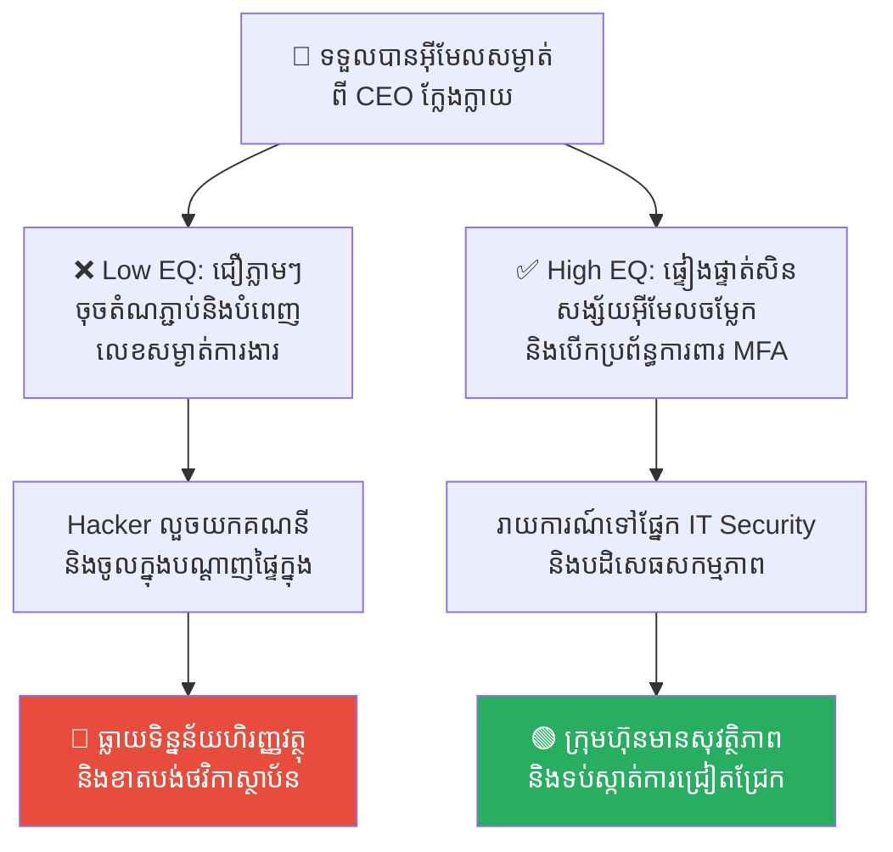
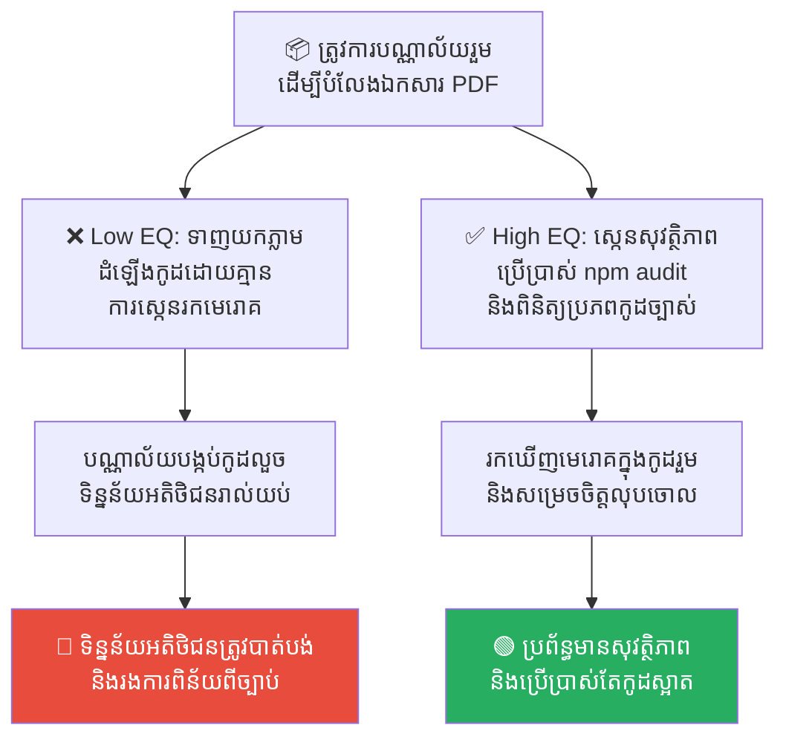
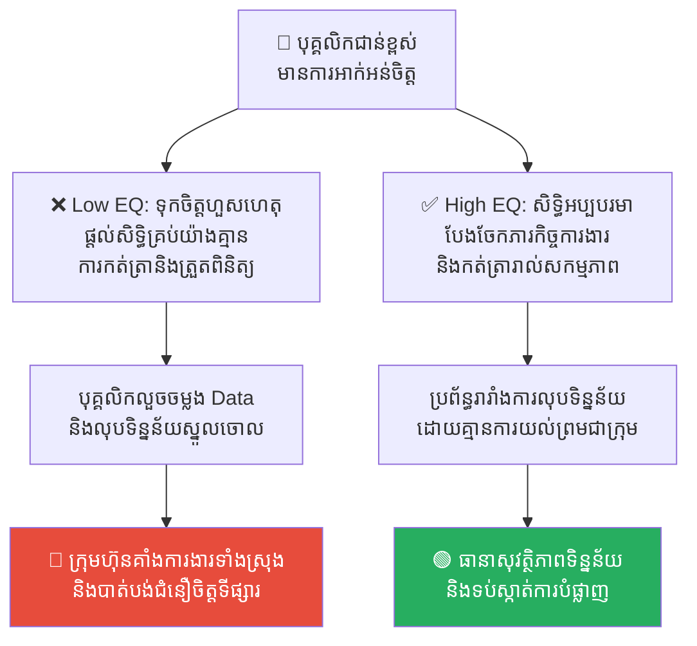
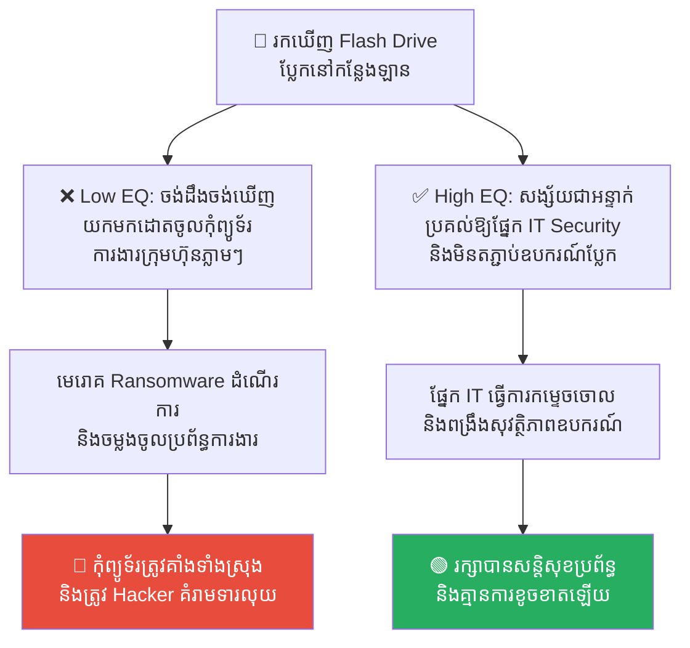

# The Trojan Horse: Social Engineering and Insider Threats (សេះឈើក្រុងទ្រយ៖ ការវាយប្រហារផ្លូវចិត្ត និងការគំរាមកំហែងពីខាងក្នុង)

**Author:** ichamrong  
**Date:** 2026-05-17  
**Tags:** #cybersecurity #social-engineering #trojan-horse #insider-threat #greek-history  
**Category:** Concepts  
**Read Time:** ~15 min  

---

## 📌 មាតិកា (Table of Contents)
- [លំនាំបញ្ហា (The Pattern)](#លំនាំបញ្ហា-the-pattern)
- [១. បញ្ហា៖ ហេតុអ្វីបានជាសត្រូវអាចចូលក្នុងទីក្រុងរបស់យើងបាន? (The Issue: The Anatomy of Deception)](#១-បញ្ហា-ហេតុអ្វីបានជាសត្រូវអាចចូលក្នុងទីក្រុងរបស់យើងបាន-the-issue-the-anatomy-of-deception)
- [២. ឧទាហរណ៍ជាក់ស្តែងក្នុងពិភពពិត (Real World Examples)](#២-ឧទាហរណ៍ជាក់ស្តែងក្នុងពិភពពិត)
  - [ឧទាហរណ៍ទី ១ — ការវាយប្រហារបោកប្រាស់តាមអ៊ីមែល (Phishing Email Trap)](#ឧទាហរណ៍ទី-១-ការវាយប្រហារបោកប្រាស់តាមអ៊ីមែល-phishing-email-trap)
  - [ឧទាហរណ៍ទី ២ — ការទាញយកកូដរួមដែលមានបង្កប់មេរោគ (Malicious Third-Party Package)](#ឧទាហរណ៍ទី-២-ការទាញយកកូដរួមដែលមានបង្កប់មេរោគ-malicious-third-party-package)
  - [ឧទាហរណ៍ទី ៣ — ការគំរាមកំហែងពីបុគ្គលិកផ្ទៃក្នុង (Disgruntled Insider Threat)](#ឧទាហរណ៍ទី-៣-ការគំរាមកំហែងពីបុគ្គលិកផ្ទៃក្នុង-disgruntled-insider-threat)
  - [ឧទាហរណ៍ទី ៤ — ការតភ្ជាប់ឧបករណ៍ផ្ទាល់ខ្លួនដែលគ្មានសុវត្ថិភាព (BYOD & Malicious USB Device)](#ឧទាហរណ៍ទី-៤-ការតភ្ជាប់ឧបករណ៍ផ្ទាល់ខ្លួនដែលគ្មានសុវត្ថិភាព-byod-malicious-usb-device)
  - [ឧទាហរណ៍ទី ៥ — ការលួចចូលបន្ទប់ Server តាមរយៈរូបរាងបោកបញ្ឆោត (Physical Social Engineering & Tailgating)](#ឧទាហរណ៍ទី-៥-ការលួចចូលបន្ទប់-server-តាមរយៈរូបរាងបោកបញ្ឆោត-physical-social-engineering-tailgating)
- [៣. កត្តាជម្រុញ៖ ភាពជឿជាក់ងាយៗ និងកង្វះការយល់ដឹង (The Aggravator: Blind Trust & Lack of Security Awareness)](#៣-កត្តាជម្រុញ-ភាពជឿជាក់ងាយៗ-និងកង្វះការយល់ដឹង-the-aggravator-blind-trust-lack-of-security-awareness)
- [៤. ដំណោះស្រាយទូទៅ៖ របៀបការពារទីក្រុងរបស់អ្នកតាម Zero Trust (The General Solution: Defending Your City)](#៤-ដំណោះស្រាយទូទៅ-របៀបការពារទីក្រុងរបស់អ្នកតាម-zero-trust-the-general-solution-defending-your-city)
- [សេចក្តីសន្និដ្ឋាន (Conclusion)](#សេចក្តីសន្និដ្ឋាន-conclusion)
- [Related Posts](#related-posts)

---

## លំនាំបញ្ហា (The Pattern)

នៅក្នុងវិស័យសន្តិសុខព័ត៌មានវិទ្យា (Cybersecurity) និងការគ្រប់គ្រងស្ថាប័ន មានច្បាប់មាសមួយចែងថា៖ 

> 💡 **«ប្រព័ន្ធមួយ មិនត្រូវបានកម្ទេចដោយសារតែការវាយបំបែកជញ្ជាំងកំពែងដ៏រឹងមាំរបស់វានោះឡើយ ប៉ុន្តែវាត្រូវបានបំផ្លាញដោយសារតែអ្នកយាមទ្វាររបស់ខ្លួន បានបើកទ្វារឱ្យសត្រូវចូលមកដោយផ្ទាល់ដៃ។»**

គំនិតនេះមានប្រភពចេញពីព្រឹត្តិការណ៍ប្រវត្តិសាស្ត្រក្រិកបុរាណដ៏ល្បីល្បាញបំផុត គឺ **យុទ្ធសាស្ត្រសេះឈើក្រុងទ្រយ (The Trojan Horse)**។ ជនជាតិក្រិកបានឡោមព័ទ្ធក្រុងទ្រយអស់រយៈពេល ១០ ឆ្នាំ តែមិនអាចវាយបំបែកកំពែងក្រុងដ៏រឹងមាំបានឡើយ។ ទីបំផុត ពួកគេបានសម្រេចចិត្តប្រើប្រាស់ «ភាពបោកប្រាស់» ដោយសាងសង់សេះឈើដ៏ធំមួយ រួចលាក់ខ្លួនខាងក្នុង ដោយធ្វើពុតជាដកទ័ពថយ និងបន្សល់ទុកសេះឈើនោះជា «អំណោយនៃការចុះចាញ់»។

ជនជាតិទ្រយមានក្តីរំភើប និងជឿជាក់ ក៏បានអូសសេះឈើនោះចូលទៅក្នុងទីក្រុងដោយផ្ទាល់ដៃ។ នៅពេលយប់ងងឹតមកដល់ ទាហានក្រិកដែលលាក់ខ្លួនខាងក្នុង ក៏បានចេញមកបើកទ្វារក្រុងឱ្យកងទ័ពក្រិកចូលមកវាយកម្ទេចទីក្រុងទាំងមូលយ៉ាងងាយស្រួល។

នៅក្នុងពិភពឌីជីថល និងស្ថាប័នទំនើប «សេះឈើក្រុងទ្រយ» នៅតែដំណើរការជារៀងរាល់ថ្ងៃ តាមរយៈវិធីសាស្ត្រដែលយើងហៅថា **Social Engineering (ការវាយប្រហារផ្លូវចិត្ត)** និង **Insider Threats (ការគំរាមកំហែងពីខាងក្នុង)**។

---

## ១. បញ្ហា៖ ហេតុអ្វីបានជាសត្រូវអាចចូលក្នុងទីក្រុងរបស់យើងបាន? (The Issue: The Anatomy of Deception)

ទោះបីជាក្រុមហ៊ុនចំណាយថវិការាប់លានដុល្លារ ដើម្បីទិញប្រព័ន្ធការពារបច្ចេកវិទ្យាទំនើបៗ (ដូចជា Firewalls, Intrusion Detection Systems ឬ Antivirus) យ៉ាងណាក៏ដោយ ក៏ប្រព័ន្ធទាំងនោះនៅតែអាចត្រូវវាយបំបែកបានយ៉ាងងាយ ប្រសិនបើ Hacker វាយប្រហារលើ **«ចំណុចខ្សោយបំផុតនៃប្រព័ន្ធសន្តិសុខ គឺ មនុស្ស (Human Element)»**។

Hacker មិនចាំបាច់ខ្ជះខ្ជាយពេលវេលាវាយបំបែកកំពែងកូដដ៏ស្មុគស្មាញឡើយ។ ពួកគេគ្រាន់តែបង្កើត «សេះឈើ» មួយ ដែលមើលទៅដូចជាអំណោយ ឯកសារការងារ ឬកម្មវិធីមានប្រយោជន៍ ដើម្បីបញ្ឆោតបុគ្គលិករបស់អ្នកឱ្យចុចទាញយក ឬផ្តល់ព័ត៌មានសម្ងាត់ដោយផ្ទាល់ខ្លួន។

```
👤 Hacker ──► 🎁 បង្កើតសេះឈើ (បោកបញ្ឆោត) ──► 🚪 បុគ្គលិកបើកទ្វារទទួល (ចុច Link) ──► 🔴 ប្រព័ន្ធខាងក្នុងត្រូវវាយលុក
```

ការគំរាមកំហែងនេះ មិនត្រឹមតែមកពីខាងក្រៅនោះទេ តែវាក៏អាចកើតឡើងពី «មនុស្សខាងក្នុង» ដែលមានសិទ្ធិចូលប្រើប្រាស់ប្រព័ន្ធរួចជាស្រេច ហើយបានសម្រេចចិត្តក្បត់នឹងស្ថាប័នដើម្បីផលប្រយោជន៍ផ្ទាល់ខ្លួន។

---

## ២. ឧទាហរណ៍ជាក់ស្តែងក្នុងពិភពពិត

សូមពិនិត្យមើល **ឧទាហរណ៍ជាក់ស្តែងចំនួន ៥** បង្ហាញពីរបៀបដែលសេះឈើក្រុងទ្រយវាយប្រហារស្ថាប័ន និងវិធីសាស្ត្រការពារ៖

---

### ឧទាហរណ៍ទី ១ — ការវាយប្រហារបោកប្រាស់តាមអ៊ីមែល (Phishing Email Trap)

**ស្ថានភាព៖** ក្រុមហ៊ុនមួយមានប្រព័ន្ធ Firewall ការពារបណ្តាញអ៊ីនធឺណិតយ៉ាងរឹងមាំបំផុត។ ថ្ងៃមួយ បុគ្គលិកផ្នែកគណនេយ្យម្នាក់បានទទួលអ៊ីមែលមួយដែលមើលទៅដូចជាមកពី «ប្រធានក្រុមហ៊ុន (CEO)» ដោយសរសេរថា៖ *«សូមចុចទីនេះ ដើម្បីបំពេញលេខសម្ងាត់ការងារឡើងវិញជាបន្ទាន់ ដើម្បីទទួលបានប្រាក់រង្វាន់ចុងឆ្នាំ។»*

*   **សកម្មភាពអសកម្ម / Low EQ / កំហុសឆ្គង៖** បុគ្គលិកមានក្តីរំភើប និងជឿជាក់ទាំងស្រុង (គ្មានការសង្ស័យ) ក៏បានចុចលើតំណភ្ជាប់ (Link) នោះ រួចបញ្ចូលលេខសម្ងាត់ការងាររបស់ខ្លួនភ្លាមៗ។ តំណភ្ជាប់នោះគឺជា «សេះឈើ» ដែល Hacker បង្កើតឡើងដើម្បីលួចយកគណនីការងារ រួចចូលទៅលួចទិន្នន័យហិរញ្ញវត្ថុធនាគាររបស់ក្រុមហ៊ុនទាំងស្រុង។
*   **សកម្មភាពស្ថាបនា / High EQ / ដំណោះស្រាយ៖** អនុវត្ត **Phishing Awareness Training** និង **Multi-Factor Authentication (MFA)**។ បុគ្គលិកត្រូវតែសង្ស័យរាល់អ៊ីមែលដែលទាមទារសកម្មភាពបន្ទាន់ ឬទាមទារព័ត៌មានសម្ងាត់ និងធ្វើការផ្ទៀងផ្ទាត់ដោយផ្ទាល់ជាមួយប្រភពដើម។ ក្រុមហ៊ុនត្រូវតែប្រើ MFA ដើម្បីធានាថា ទោះបីជា Hacker ដឹងលេខសម្ងាត់ ក៏មិនអាចចូលគណនីបានដែរ បើគ្មានលេខកូដទូរស័ព្ទដៃផ្ទាល់ខ្លួន។
*   **លទ្ធផល៖** ការចុច Link ដោយខ្វះការពិចារណានាំឱ្យក្រុមហ៊ុនបាត់បង់ថវិការាប់សែនដុល្លារ និងធ្លាយព័ត៌មានសម្ងាត់។ ការប្រើប្រាស់ MFA និងការអប់រំបុគ្គលិកជួយរារាំងរាល់ការវាយប្រហារ Phishing បានទាន់ពេលវេលា។



---

### ឧទាហរណ៍ទី ២ — ការទាញយកកូដរួមដែលមានបង្កប់មេរោគ (Malicious Third-Party Package)

**ស្ថានភាព៖** វិស្វករសរសេរកូដម្នាក់ត្រូវការមុខងារមួយ ដើម្បីបំលែងទិន្នន័យជាឯកសារ PDF។ ដើម្បីចំណេញពេលវេលា ពួកគេបានដើរស្វែងរកបណ្ណាល័យឥតគិតថ្លៃ (Open-Source NPM Package) នៅលើអ៊ីនធឺណិត។

*   **សកម្មភាពអសកម្ម / Low EQ / កំហុសឆ្គង៖** វិស្វករបានទាញយកបណ្ណាល័យមួយឈ្មោះថា `pdf-generator-fast` ដែលមើលទៅដូចជាមានប្រយោជន៍ និងមានសុវត្ថិភាពល្អ។ ពួកគេបានដំឡើងវាភ្លាមៗដោយគ្មានការពិនិត្យ (Scan)។ បណ្ណាល័យនោះគឺជា «សេះឈើ» ដែលបង្កប់កូដមេរោគ (Malicious Payload) នៅពីក្រោយខ្នង ដែលលួចបញ្ជូនទិន្នន័យអតិថិជនចេញទៅក្រៅរៀងរាល់យប់។
*   **សកម្មភាពស្ថាបនា / High EQ / ដំណោះស្រាយ៖** អនុវត្ត **Dependency Security Scanning**។ មុននឹងដំឡើងកូដរួមណាមួយ ត្រូវពិនិត្យមើលប្រភពដើម (Source Code) ចំនួនអ្នកប្រើប្រាស់ពិត និងប្រើប្រាស់ឧបករណ៍ស្កេនកំហុសស្វ័យប្រវត្ត (ដូចជា `npm audit` ឬ Snyk) ដើម្បីធានាថាកូដនោះគ្មានបង្កប់មេរោគ។
*   **លទ្ធផល៖** ការដំឡើងកូដដោយគ្មានការត្រួតពិនិត្យនាំឱ្យប្រព័ន្ធមាន «ទ្វារក្រោយ (Backdoor)» ដែលជាគ្រោះថ្នាក់ដ៏ធំដល់ទិន្នន័យក្រុមហ៊ុន។ ការប្រើប្រាស់ឧបករណ៍ស្កេនជួយឱ្យការអភិវឌ្ឍន៍កម្មវិធីមានសុវត្ថិភាព និងស្អាតស្អំ។



---

### ឧទាហរណ៍ទី ៣ — ការគំរាមកំហែងពីបុគ្គលិកផ្ទៃក្នុង (Disgruntled Insider Threat)

**ស្ថានភាព៖** បុគ្គលិកជាន់ខ្ពស់ម្នាក់ដែលគ្រប់គ្រងប្រព័ន្ធទិន្នន័យ (Database Administrator) មានការអាក់អន់ចិត្តជាមួយក្រុមហ៊ុន ព្រោះមិនទទួលបានការដំឡើងតំណែងការងារ។

*   **សកម្មភាពអសកម្ម / Low EQ / កំហុសឆ្គង៖** ក្រុមហ៊ុនទុកចិត្តគាត់ ១០០% និងផ្តល់សិទ្ធិឱ្យគាត់គ្រប់គ្រងប្រព័ន្ធទាំងអស់ដោយគ្មានការត្រួតពិនិត្យ (Over-privileged Access)។ មុនពេលគាត់ដាក់ពាក្យលាឈប់ គាត់បានប្រើប្រាស់សិទ្ធិផ្ទាល់ខ្លួនលួចចម្លងទិន្នន័យ Backup របស់ក្រុមហ៊ុនទាំងអស់ដាក់ក្នុង Flash drive រួចលុបទិន្នន័យនៅលើម៉ាស៊ីន Server ចោល ដើម្បីបង្កការខូចខាតដល់ក្រុមហ៊ុន។
*   **សកម្មភាពស្ថាបនា / High EQ / ដំណោះស្រាយ៖** អនុវត្តគោលការណ៍ **Least Privilege (សិទ្ធិអប្បបរមា)** និង **Separation of Duties (ការបែងចែកភារកិច្ច)**។ គ្មានបុគ្គលិកណាម្នាក់មានសិទ្ធិគ្រប់គ្រងប្រព័ន្ធតែម្នាក់ឯងដោយគ្មានការត្រួតពិនិត្យឡើយ។ រាល់សកម្មភាពលុប ឬទាញយកទិន្នន័យធំៗ ត្រូវតែមានការយល់ព្រមពីមនុស្សពីរនាក់ (Four-Eyes Principle) និងមានការកត់ត្រាទុក (Audit Logs) ជានិច្ច។
*   **លទ្ធផល៖** ការផ្តល់សិទ្ធិគ្មានដែនកំណត់ដល់បុគ្គលិកផ្ទៃក្នុងនាំឱ្យក្រុមហ៊ុនបាត់បង់ទិន្នន័យស្នូល និងរលំអាជីវកម្មមួយរំពេច។ ការបែងចែកភារកិច្ច និងការកត់ត្រាជួយការពារប្រព័ន្ធពីការបំផ្លិចបំផ្លាញពីខាងក្នុង។



---

### ឧទាហរណ៍ទី ៤ — ការតភ្ជាប់ឧបករណ៍ផ្ទាល់ខ្លួនដែលគ្មានសុវត្ថិភាព (BYOD & Malicious USB Device)

**ស្ថានភាព៖** បុគ្គលិកម្នាក់បានរកឃើញ Flash Drive មួយដ៏ស្រស់ស្អាតនៅក្បែរចំណតឡានរបស់ក្រុមហ៊ុន។ ពួកគេមានការចង់ដឹងចង់ឃើញថាមានអ្វីនៅខាងក្នុង។

*   **សកម្មភាពអសកម្ម / Low EQ / កំហុសឆ្គង៖** បុគ្គលិកយក Flash Drive នោះមកដោតផ្ទាល់ចូលក្នុងកុំព្យូទ័រការងាររបស់ក្រុមហ៊ុន ដោយគ្មានការសង្ស័យ។ Flash Drive នោះគឺជា «សេះឈើ» ដែល Hacker បានបោះចោលដោយចេតនា។ គ្រាន់តែដោតចូលភ្លាម កូដស្វ័យប្រវត្ត (BadUSB script) បានដំណើរការលួចចម្លងទិន្នន័យគណនីការងារ និងចម្លងមេរោគ Ransomware ទៅកាន់កុំព្យូទ័រទាំងអស់ក្នុងក្រុមហ៊ុនភ្លាមៗ។
*   **សកម្មភាពស្ថាបនា / High EQ / ដំណោះស្រាយ៖** គោរពតាមច្បាប់ **Device Security Policy** និងការបិទច្រក USB (USB Port Blocking) លើកុំព្យូទ័រក្រុមហ៊ុន។ បុគ្គលិកត្រូវយល់ដឹងថា មិនត្រូវដោតឧបករណ៍ប្លែកៗដែលមិនមែនជាកម្មសិទ្ធិរបស់ក្រុមហ៊ុនចូលក្នុងប្រព័ន្ធការងារឡើយ។
*   **លទ្ធផល៖** ការចង់ដឹងចង់ឃើញគ្មានសុវត្ថិភាពនាំឱ្យប្រព័ន្ធកុំព្យូទ័រក្រុមហ៊ុនទាំងមូលត្រូវជាប់គាំង និងរងការទាមទារលុយលោះពី Hacker។ ការរឹតបន្តឹងឧបករណ៍តភ្ជាប់ជួយរក្សាស្ថិរភាព និងធានាគ្មានមេរោគជ្រៀតចូល។



---

### ឧទាហរណ៍ទី ៥ — ការលួចចូលបន្ទប់ Server តាមរយៈរូបរាងបោកបញ្ឆោត (Physical Social Engineering & Tailgating)

**ស្ថានភាព៖** បុគ្គលិកម្នាក់កំពុងដើរកាន់ប្រអប់កាហ្វេដ៏ធំមួយ និងនំដូណាត់ជាច្រើនពេញដៃ តម្រង់ទៅកាន់ទ្វារបន្ទប់ Server របស់ក្រុមហ៊ុន ដែលទាមទារការស្កេនកាតដើម្បីចូល។

*   **សកម្មភាពអសកម្ម / Low EQ / កំហុសឆ្គង៖** ជនប្លែកមុខម្នាក់ ស្លៀកពាក់ខោអាវសមរម្យ បានដើរមកពីក្រោយ។ បុគ្គលិកមានអារម្មណ៍អាណិត និងគិតថាគាត់ជាសហការី ក៏បានបើកទ្វារឱ្យគាត់ដើរចូលមកជាមួយគ្នា (Tailgating) ដោយមិនបានតម្រូវឱ្យគាត់ស្កេនកាតឡើយ។ ជនប្លែកមុខនោះគឺជា Hacker ដែលក្លែងខ្លួនដើម្បីចូលមកបន្ទប់ Server និងដោតឧបករណ៍លួចបញ្ជូនទិន្នន័យ (Network Sniffer) ដោយផ្ទាល់នៅលើ Switch កណ្តាលរបស់ក្រុមហ៊ុន។
*   **សកម្មភាពស្ថាបនា / High EQ / ដំណោះស្រាយ៖** គោរពតាមច្បាប់ **No-Tailgating Policy** យ៉ាងតឹងរ៉ឹងបំផុត៖ *«មនុស្សម្នាក់ ស្កេនកាតម្តង (One Badge, One Person)។»* ទោះបីជាមានរបស់ពេញដៃ ឬស្គាល់គ្នាក៏ដោយ ក៏មនុស្សគ្រប់គ្នាត្រូវតែស្កេនកាតដោយផ្ទាល់ខ្លួនដើម្បីឆ្លងកាត់ទ្វារសុវត្ថិភាព។
*   **លទ្ធផល៖** ការយោគយល់ខុសកន្លែងនាំឱ្យសន្តិសុខរូបវន្តរបស់ក្រុមហ៊ុនត្រូវធ្លាយ និងបង្កហានិភ័យខ្ពស់ដល់ Server ស្នូល។ ការគោរពវិន័យស្កេនកាតជួយធានាថា មានតែមនុស្សដែលមានសិទ្ធិពិតប្រាកដប៉ុណ្ណោះដែលអាចចូលបន្ទប់សម្ងាត់បាន។


---

## ៣. កត្តាជម្រុញ៖ ភាពជឿជាក់ងាយៗ និងកង្វះការយល់ដឹង (The Aggravator: Blind Trust & Lack of Security Awareness)

ហេតុអ្វីបានជាសេះឈើក្រុងទ្រយ និងការវាយប្រហារផ្លូវចិត្តនៅតែទទួលបានជោគជ័យរៀងរាល់ថ្ងៃ? កត្តាជម្រុញរួមមាន៖

1.  **សភាវគតិជឿជាក់លើគ្នា (Human Desire to Trust)៖** មនុស្សយើងចង់ជួយគ្នា និងចង់ជឿជាក់លើគ្នាជារៀងរាល់ថ្ងៃ។ Hacker ប្រើប្រាស់សភាវគតិនេះដើម្បីបោកបញ្ឆោតយើង។
2.  **ការខ្លាចអំណាច (Fear of Authority)៖** នៅពេលទទួលបានសារ ឬអ៊ីមែលក្លែងបន្លំពី «ប្រធាន ឬនាយក» បុគ្គលិកភាគច្រើនមានការភ័យខ្លាច និងប្រញាប់ប្រញាល់ធ្វើតាមដោយមិនហ៊ានសួរដេញដោល ឬផ្ទៀងផ្ទាត់ឡើយ។
3.  **កង្វះវប្បធម៌សន្តិសុខ (Lack of Security Culture)៖** ប្រសិនបើក្រុមហ៊ុនផ្តោតតែលើបច្ចេកវិទ្យា តែមិនធ្លាប់បណ្តុះបណ្តាលបុគ្គលិកពីរបៀបសង្កេត និងសង្ស័យ នោះបុគ្គលិកនឹងនៅតែជា «ច្រកចូលដ៏ងាយស្រួលបំផុត» សម្រាប់សត្រូវជានិច្ច។

---

## ៤. ដំណោះស្រាយទូទៅ៖ របៀបការពារទីក្រុងរបស់អ្នកតាម Zero Trust (The General Solution: Defending Your City)

ដើម្បីការពារស្ថាប័នរបស់អ្នកពីសេះឈើ និងការគំរាមកំហែងពីខាងក្នុង ចូរអនុវត្តគោលការណ៍ **Zero Trust Architecture (គ្មានការជឿជាក់ទុកជាមុន)**៖

1.  **គោលការណ៍កុំជឿទុកចិត្តនរណាម្នាក់ (Never Trust, Always Verify)៖** មិនថាសកម្មភាព ឬទិន្នន័យនោះមកពីខាងក្រៅ ឬមកពីបុគ្គលិកផ្ទៃក្នុងឡើយ ត្រូវតែឆ្លងកាត់ការផ្ទៀងផ្ទាត់សិទ្ធិ (Authentication) និងត្រួតពិនិត្យជានិច្ច មុននឹងអនុញ្ញាតឱ្យចូលក្នុងប្រព័ន្ធ។
2.  **កសាងកំពែងមនុស្ស (Build a Human Firewall)៖** ធ្វើការបណ្តុះបណ្តាលបុគ្គលិកជាប្រចាំពីការសង្កេតមើលអ៊ីមែល Phishing, វិធីសង្ស័យរាល់សកម្មភាពចម្លែក និងការបង្កើតវប្បធម៌ការងារដែលអនុញ្ញាតឱ្យបុគ្គលិកហ៊ានសួរដេញដោលមេដឹកនាំនៅពេលមានសកម្មភាពគួរឱ្យសង្ស័យ។
3.  **ការដាក់កម្រិតការងារ និងការបែងចែកបណ្តាញ (Segment & Isolation)៖** កុំឱ្យកុំព្យូទ័ររបស់បុគ្គលិកម្នាក់ អាចភ្ជាប់ទៅកាន់ Server ស្នូលទាំងអស់ដោយគ្មានដែនកំណត់។ ត្រូវបែងចែកបណ្តាញការងារជាផ្នែកៗ (Network Segmentation) ដើម្បីធានាថា ប្រសិនបើកុំព្យូទ័រម្នាក់ត្រូវរងការ Hack គឺមេរោគមិនអាចរាលដាលទៅបំផ្លាញម៉ាស៊ីន Server ស្នូលបានឡើយ។

---

## សេចក្តីសន្និដ្ឋាន (Conclusion)

**យុទ្ធសាស្ត្រសេះឈើក្រុងទ្រយ (The Trojan Horse)** បង្រៀនយើងថា កំពែងការពារដែលរឹងមាំបំផុត នឹងគ្មានតម្លៃអ្វីឡើយ ប្រសិនបើយើងខ្វះការប្រុងប្រយ័ត្ន និងបើកទ្វារឱ្យសត្រូវចូលមកដោយផ្ទាល់ដៃ។ សន្តិសុខព័ត៌មានវិទ្យា និងការគ្រប់គ្រងស្ថាប័នប្រកបដោយជោគជ័យ ត្រូវតែចាប់ផ្តើមពី **«ការយល់ដឹងពីចិត្តសាស្ត្រមនុស្ស និងការបង្កើតប្រព័ន្ធការងារដែលមិនពឹងផ្អែកលើការទុកចិត្តងាយៗ»**។

ចូរចងចាំថា៖ **«ចូរប្រុងប្រយ័ត្នជានិច្ច ចំពោះសត្រូវដែលកាន់អំណោយ ឬស្នាមញញឹមមកឱ្យអ្នក។»**

---

## Related Posts

*   **[32 The Trojan Horse and the Fall of the Impregnable City](../parables/32-the-trojan-horse.md)** — រឿងប្រៀបធៀបប្រវត្តិសាស្ត្រក្រិកដ៏រំភើប អំពីយុទ្ធសាស្ត្រសេះឈើ និងការដួលរលំនៃទីក្រុងដ៏រឹងមាំ។
*   **[27 The Maginot Line and Security Theater](./27-the-maginot-line-and-security-theater.md)** — របៀបដែលប្រព័ន្ធការពារត្រូវបានសត្រូវដើរវាង (ភាពខុសគ្នារវាងការការពារតែផ្ទៃមុខ និងការការពារជុំទិស)។

---

*Last updated: 2026-05-26*
