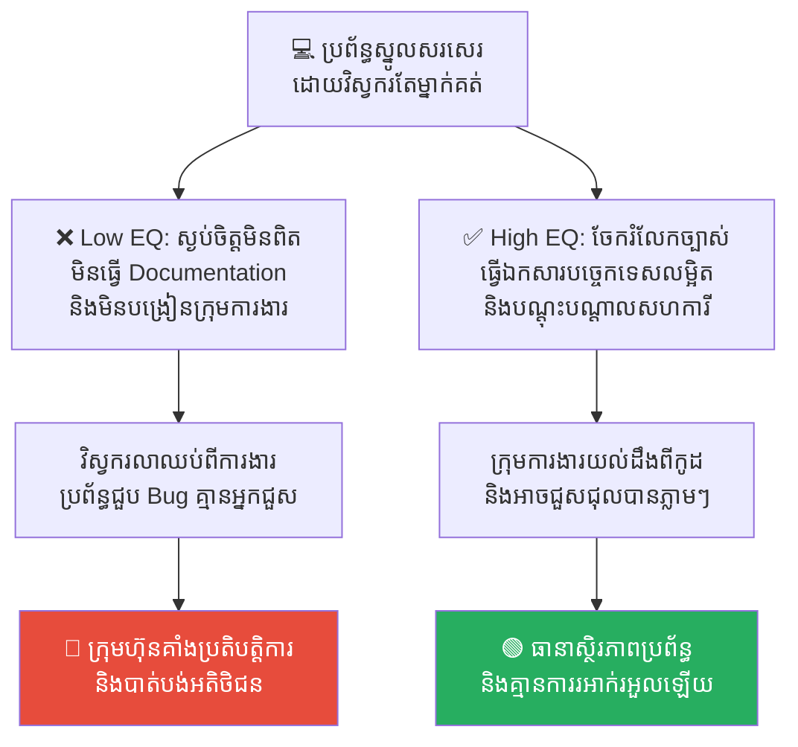
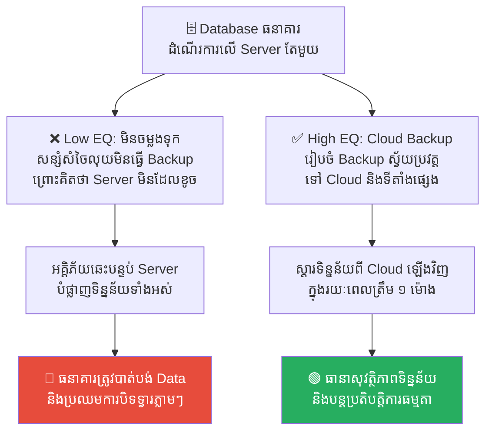
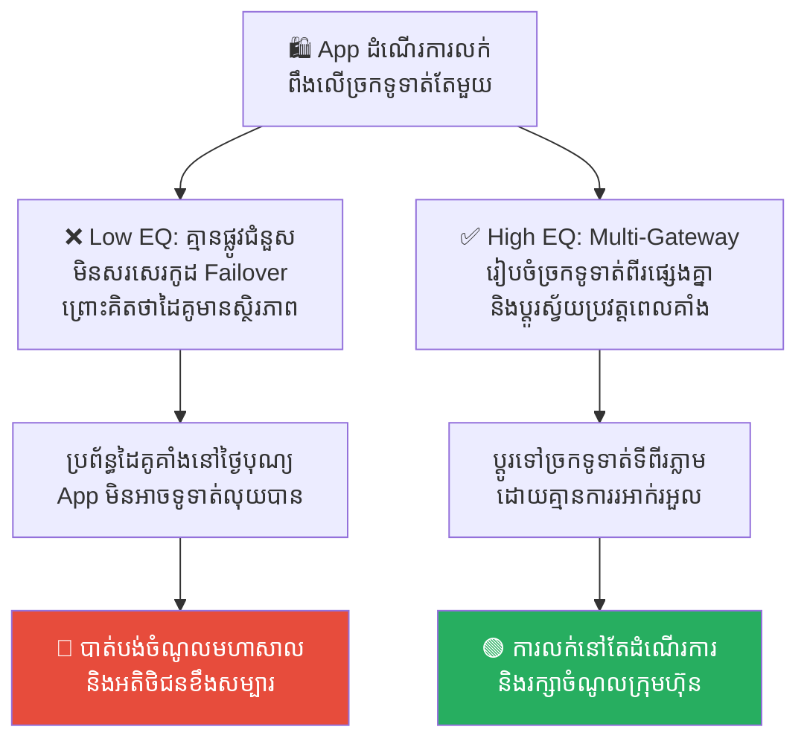
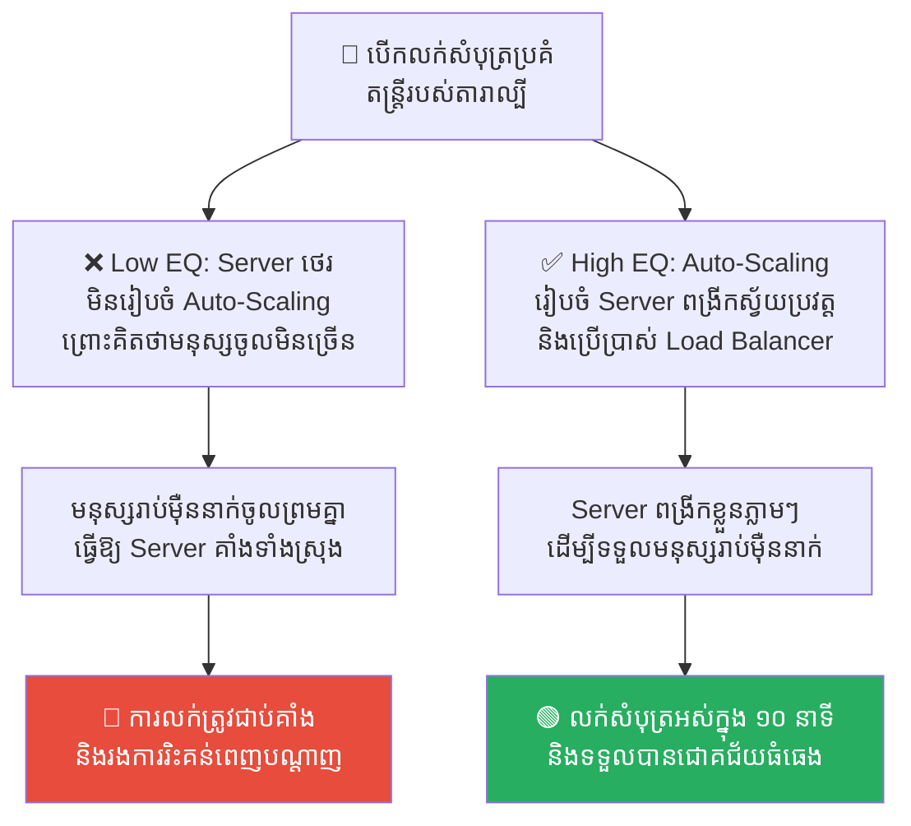
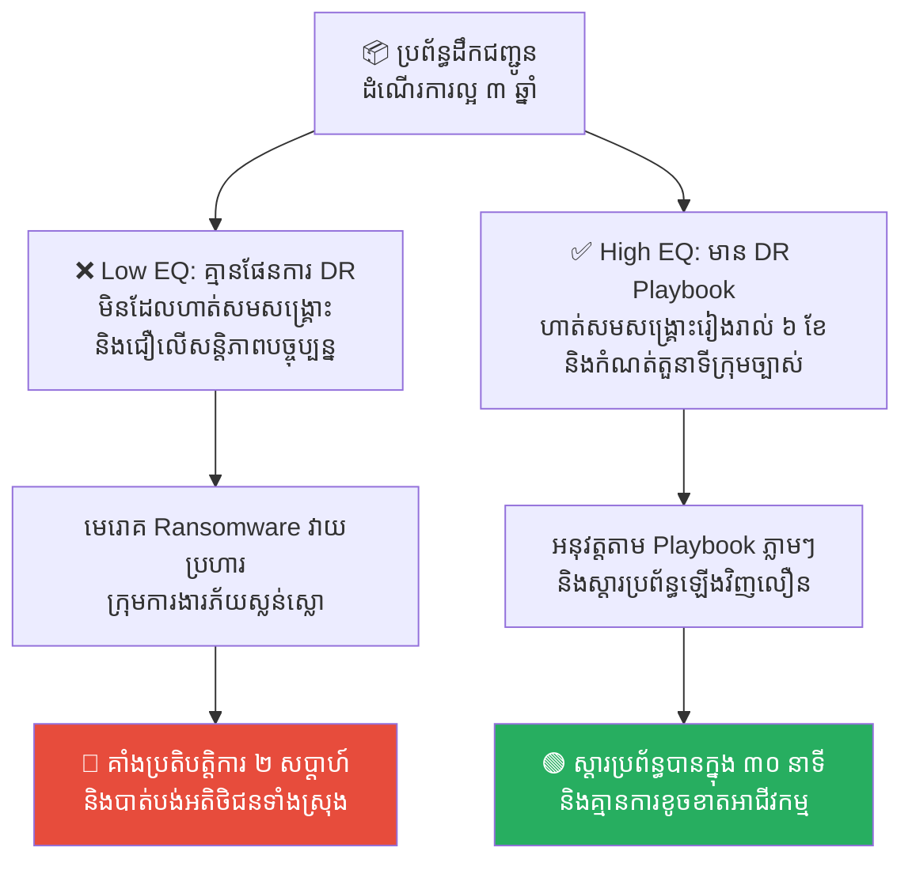

# The Sword of Damocles: The Hidden Burden of Leadership (ដាវរបស់ដាម៉ូក្លេស៖ បន្ទុកលាក់កំបាំងនៃអំណាច និងហានិភ័យ)

**Author:** ichamrong  
**Date:** 2026-05-17  
**Tags:** #risk-management #leadership #technical-debt #greek-history #system-design  
**Category:** Concepts  
**Read Time:** ~15 min  

---

## 📌 មាតិកា (Table of Contents)
- [លំនាំបញ្ហា (The Pattern)](#លំនាំបញ្ហា-the-pattern)
- [១. បញ្ហា៖ ហេតុអ្វីបានជាអំណាចមកជាមួយដាវព្យួរក្បាល? (The Issue: The Ever-Present Peril)](#១-បញ្ហា-ហេតុអ្វីបានជាអំណាចមកជាមួយដាវព្យួរក្បាល-the-issue-the-ever-present-peril)
- [២. ឧទាហរណ៍ជាក់ស្តែងក្នុងពិភពពិត (Real World Examples)](#២-ឧទាហរណ៍ជាក់ស្តែងក្នុងពិភពពិត)
  - [ឧទាហរណ៍ទី ១ — ប្រព័ន្ធស្នូលចាស់ដែលគ្មានឯកសារ (Legacy Core System & Single Point of Knowledge)](#ឧទាហរណ៍ទី-១-ប្រព័ន្ធស្នូលចាស់ដែលគ្មានឯកសារ-legacy-core-system-single-point-of-knowledge)
  - [ឧទាហរណ៍ទី ២ — ម៉ាស៊ីនផ្ទុកទិន្នន័យគ្មានការចម្លងទុក (Single-Server Database & No Backup)](#ឧទាហរណ៍ទី-២-ម៉ាស៊ីនផ្ទុកទិន្នន័យគ្មានការចម្លងទុក-single-server-database-no-backup)
  - [ឧទាហរណ៍ទី ៣ — ការពឹងផ្អែកលើ API ខាងក្រៅតែមួយ (Single Third-Party API Dependency)](#ឧទាហរណ៍ទី-៣-ការពឹងផ្អែកលើ-api-ខាងក្រៅតែមួយ-single-third-party-api-dependency)
  - [ឧទាហរណ៍ទី ៤ — ហេដ្ឋារចនាសម្ព័ន្ធគ្មានប្រព័ន្ធពង្រីកស្វ័យប្រវត្ត (Overloaded Infrastructure & No Auto-Scaling)](#ឧទាហរណ៍ទី-៤-ហេដ្ឋារចនាសម្ព័ន្ធគ្មានប្រព័ន្ធពង្រីកស្វ័យប្រវត្ត-overloaded-infrastructure-no-auto-scaling)
  - [ឧទាហរណ៍ទី ៥ — កង្វះផែនការស្តារឡើងវិញពីគ្រោះមហន្តរាយ (No Disaster Recovery Plan)](#ឧទាហរណ៍ទី-៥-កង្វះផែនការស្តារឡើងវិញពីគ្រោះមហន្តរាយ-no-disaster-recovery-plan)
- [៣. កត្តាជម្រុញ៖ ភាពស្ងប់ចិត្តមិនពិត និងការសន្សំសំចៃថ្លៃដើមខុសរឿង (The Aggravator: False Comfort & Bad Cost-Cutting)](#៣-កត្តាជម្រុញ-ភាពស្ងប់ចិត្តមិនពិត-និងការសន្សំសំចៃថ្លៃដើមខុសរឿង-the-aggravator-false-comfort-bad-cost-cutting)
- [៤. ដំណោះស្រាយទូទៅ៖ របៀបប្តូរសរសៃសក់សេះ ឱ្យទៅជាខ្សែពួរដែកថែប (The General Solution: Replacing the Horsehair)](#៤-ដំណោះស្រាយទូទៅ-របៀបប្តូរសរសៃសក់សេះ-ឱ្យទៅជាខ្សែពួរដែកថែប-the-general-solution-replacing-the-horsehair)
- [សេចក្តីសន្និដ្ឋាន (Conclusion)](#សេចក្តីសន្និដ្ឋាន-conclusion)
- [Related Posts](#related-posts)

---

## លំនាំបញ្ហា (The Pattern)

មនុស្សភាគច្រើនតែងតែសម្លឹងមើលទៅមេដឹកនាំកំពូល (CEO) ឬប្រធានវិស្វករបច្ចេកវិទ្យា (CTO) ដោយក្តីច្រណែន។ ពួកគេមើលឃើញពីប្រាក់ខែខ្ពស់ អំណាចបញ្ជា និងភាពហ៊ឺហាខាងក្រៅ ប៉ុន្តែពួកគេកម្រនឹងមើលឃើញពី «ហានិភ័យ និងបន្ទុកដ៏ធំធេង» ដែលកំពុងតែព្យួរនៅពីលើក្បាលអ្នកដឹកនាំទាំងនោះណាស់។

ស្ថានភាពនេះ ត្រូវបានតំណាងយ៉ាងល្អឥតខ្ចោះដោយរឿងព្រេងក្រិកបុរាណមួយ ដែលមានឈ្មោះថា **The Sword of Damocles (ដាវរបស់ដាម៉ូក្លេស)**។ ដាម៉ូក្លេស គឺជាអ្នកហែហមដែលតែងតែនិយាយបញ្ជោរ និងសរសើរស្តេចឌីអូនីស៊ូស ថាជាមនុស្សដែលមានសុភមង្គលបំផុតព្រោះមានអំណាច និងទ្រព្យសម្បត្តិ។

ស្តេចបានឆ្លើយតបថា៖ *«ប្រសិនបើអ្នកចង់សាកល្បងជីវិតស្តេច ចូរមកអង្គុយលើបល្ល័ង្កនេះចុះ។»* 

ដាម៉ូក្លេសបានអង្គុយលើបល្ល័ង្កមាស ទទួលទានអាហារដ៏មានឱជារសយ៉ាងសប្បាយចិត្ត។ ប៉ុន្តែនៅពេលដែលគាត់សម្លឹងមើលទៅលើ គាត់ស្រាប់តែភ័យស្លន់ស្លោ និងញ័រពេញខ្លួន ព្រោះមាន **«ដាវដ៏មុតស្រួចមួយ ព្យួរចំពីលើក្បាលរបស់គាត់ ដោយចងភ្ជាប់ជាមួយនឹងសរសៃសក់សេះតែមួយសរសៃប៉ុណ្ណោះ»**។ 

គាត់លែងមានអារម្មណ៍ចង់ហូបអាហារ ឬរីករាយនឹងអំណាចមាសទៀតហើយ ព្រោះគាត់ដឹងច្បាស់ថា សេចក្តីស្លាប់អាចធ្លាក់មកដល់គ្រប់វិនាទី បើសរសៃសក់សេះនោះដាច់។

នៅក្នុងវិស័យបច្ចេកវិទ្យា និងការគ្រប់គ្រងស្ថាប័ន «ដាវរបស់ដាម៉ូក្លេស» គឺជានិមិត្តរូបនៃហានិភ័យលាក់កំបាំង ដែលអាចបំផ្លាញគម្រោង ឬក្រុមហ៊ុនទាំងស្រុងត្រឹមមួយប៉ប្រិចភ្នែក ប្រសិនបើយើងធ្វេសប្រហែស។

---

## ១. បញ្ហា៖ ហេតុអ្វីបានជាអំណាចមកជាមួយដាវព្យួរក្បាល? (The Issue: The Ever-Present Peril)

**The Sword of Damocles** គឺជានិមិត្តរូបតំណាងឱ្យ **«ហានិភ័យដែលតែងតែមានវត្តមានជាប់ជានិច្ច (Ever-present Peril)»** ជាពិសេសសម្រាប់អ្នកដែលគ្រប់គ្រងប្រព័ន្ធធំៗ ឬដឹកនាំស្ថាប័ន។

សម្លឹងមើលពីខាងក្រៅ ក្រុមហ៊ុនកំពុងរកចំណូលបានរាល់ថ្ងៃ កូដកំពុងដំណើរការយ៉ាងរលូន ហើយអតិថិជនកំពុងពេញចិត្ត។ ប៉ុន្តែការពិត ប្រព័ន្ធការងារទាំងមូលកំពុងតែព្យួរលើ «សរសៃសក់សេះ» នៃចន្លោះប្រហោងបច្ចេកវិទ្យា ឬកង្វះធនធាន។ បើមានខ្យល់បក់ខុសបច្ចេកទេសតែបន្តិច (ដូចជា Server គាំង, Database ខូច ឬបុគ្គលិកគន្លឹះលាឈប់) នោះដាវនឹងធ្លាក់ចុះមកបំផ្លាញអ្វីៗគ្រប់យ៉ាងភ្លាមៗ។

```
👑 បល្ល័ង្កមាស (ភាពជោគជ័យខាងក្រៅ) ──► ⚓ ព្យួរដោយសរសៃសក់សេះ (ហានិភ័យលាក់កំបាំង) ──► 🔴 ដាច់សក់សេះ ──► មហន្តរាយធ្លាក់ដល់ក្បាល
```

ការគ្រប់គ្រងហានិភ័យប្រកបដោយភាពចាស់ទុំ មិនមែនជាការបិទភ្នែកមិនមើលដាវនោះទេ ប៉ុន្តែវាជាការស្វែងរកវិធី **«ប្តូរសរសៃសក់សេះ ឱ្យទៅជាខ្សែពួរដែកថែប»** ដើម្បីធានាស្ថិរភាពយូរអង្វែង។

---

## ២. ឧទាហរណ៍ជាក់ស្តែងក្នុងពិភពពិត

សូមពិនិត្យមើល **ឧទាហរណ៍ជាក់ស្តែងចំនួន ៥** បង្ហាញពីរបៀបដែលដាវរបស់ដាម៉ូក្លេសព្យួរលើប្រព័ន្ធ និងវិធីសាស្ត្រដោះស្រាយ៖

---

### ឧទាហរណ៍ទី ១ — ប្រព័ន្ធស្នូលចាស់ដែលគ្មានឯកសារ (Legacy Core System & Single Point of Knowledge)

**ស្ថានភាព៖** ក្រុមហ៊ុនមានប្រព័ន្ធទូទាត់ប្រាក់ស្នូល (Core Payment System) មួយដែលត្រូវបានសរសេរដោយវិស្វករម្នាក់ឈ្មោះ វិបុល។ វិបុលបានសរសេរកូដនោះរយៈពេល ៥ ឆ្នាំមកហើយ ដោយគ្មានការសរសេរឯកសារពន្យល់ (No Documentation) និងគ្មានអ្នកណាផ្សេងក្នុងក្រុមយល់ដឹងពីកូដនោះឡើយ។

*   **សកម្មភាពអសកម្ម / Low EQ / កំហុសឆ្គង៖** ថ្នាក់ដឹកនាំមានភាពស្ងប់ចិត្ត ព្រោះប្រព័ន្ធដំណើរការបានល្អរាល់ថ្ងៃ។ នេះគឺជា «ដាវរបស់ដាម៉ូក្លេស»។ នៅថ្ងៃមួយ វិបុលបានសម្រេចចិត្តលាឈប់ពីការងារភ្លាមៗដើម្បីទៅរស់នៅបរទេស។ មួយសប្តាហ៍ក្រោយមក ប្រព័ន្ធជួប Bug ធំគាំងលុយអតិថិជន ហើយគ្មាននរណាម្នាក់ក្នុងក្រុមហ៊ុនដឹងពីរបៀបជួសជុលវាឡើយ ធ្វើឱ្យក្រុមហ៊ុនត្រូវជាប់គាំងប្រតិបត្តិការ។
*   **សកម្មភាពស្ថាបនា / High EQ / ដំណោះស្រាយ៖** អនុវត្ត **Knowledge Sharing & Mandatory Documentation**។ ក្រុមហ៊ុនត្រូវតែបង្ខំឱ្យមានការសរសេរឯកសារបច្ចេកទេសលម្អិត និងធ្វើការត្រួតពិនិត្យកូដជាក្រុម (Peer Reviews) ដើម្បីធានាថា មានមនុស្សយ៉ាងហោចណាស់ ២ ទៅ ៣ នាក់ យល់ដឹងពីប្រព័ន្ធស្នូលនោះច្បាស់លាស់។
*   **លទ្ធផល៖** ការពឹងផ្អែកលើខួរក្បាលមនុស្សតែម្នាក់នាំឱ្យប្រព័ន្ធងាយរងគ្រោះថ្នាក់ និងគាំងការងារទាំងស្រុង។ ការចែកចាយចំណេះដឹងជួយឱ្យប្រព័ន្ធដំណើរការប្រកបដោយស្ថិរភាព ទោះបីជាបុគ្គលិកគន្លឹះលាឈប់ក៏ដោយ។



---

### ឧទាហរណ៍ទី ២ — ម៉ាស៊ីនផ្ទុកទិន្នន័យគ្មានការចម្លងទុក (Single-Server Database & No Backup)

**ស្ថានភាព៖** Database របស់ធនាគារខ្នាតតូចមួយដំណើរការលើម៉ាស៊ីន Server តែមួយគត់នៅក្នុងការិយាល័យកណ្តាល។ វាដំណើរការលឿន និងរលូនល្អណាស់។

*   **សកម្មភាពអសកម្ម / Low EQ / កំហុសឆ្គង៖** ថ្នាក់ដឹកនាំបដិសេធមិនចំណាយថវិកាទិញ Server ទីពីរ ឬប្រព័ន្ធ Backup លើ Cloud ឡើយ ព្រោះ៖ *«ម៉ាស៊ីននេះដំណើរការល្អណាស់ មិនដែលខូចម្តងណាឡើយ មិនបាច់ខ្ជះខ្ជាយលុយធ្វើ Backup ទេ!»* នេះគឺជា «ដាវដាម៉ូក្លេស»។ ថ្ងៃមួយ មានអគ្គិភ័យឆេះបន្ទប់ការិយាល័យកណ្តាល បំផ្លាញម៉ាស៊ីន Server នោះទាំងស្រុង ធ្វើឱ្យធនាគារបាត់បង់ទិន្នន័យគណនីអតិថិជនទាំងអស់ជាស្ថាពរ និងត្រូវបិទទ្វារធនាគារ។
*   **សកម្មភាពស្ថាបនា / High EQ / ដំណោះស្រាយ៖** អនុវត្ត **Automated Offsite Backup & Replication**។ ត្រូវរៀបចំឱ្យមានប្រព័ន្ធ Backup ទិន្នន័យស្វ័យប្រវត្តទៅកាន់ Server ទីពីរ (Replica) នៅទីតាំងផ្សេងគ្នា និងរក្សាទុកនៅលើ Cloud ដែលមានសុវត្ថិភាពខ្ពស់បំផុតជារៀងរាល់ម៉ោង។
*   **លទ្ធផល៖** ការសន្សំសំចៃលើប្រព័ន្ធ Backup នាំឱ្យបាត់បង់អាជីវកម្មទាំងស្រុងក្រោយគ្រោះថ្នាក់។ ការរៀបចំប្រព័ន្ធ Backup ច្រើនទីតាំងជួយធានាសុវត្ថិភាពទិន្នន័យ ១០០% ទោះបីជាមានគ្រោះមហន្តរាយរូបវន្តកើតឡើងក៏ដោយ។



---

### ឧទាហរណ៍ទី ៣ — ការពឹងផ្អែកលើ API ខាងក្រៅតែមួយ (Single Third-Party API Dependency)

**ស្ថានភាព៖** App ទិញទំនិញអនឡាញមួយ ពឹងផ្អែកទាំងស្រុងលើដៃគូច្រកទូទាត់ប្រាក់ (Payment Gateway API) តែមួយគត់ ដើម្បីដំណើរការលក់ដូរ។

*   **សកម្មភាពអសកម្ម / Low EQ / កំហុសឆ្គង៖** វិស្វករមិនបានសរសេរកូដគម្រោងដើម្បីត្រៀមខ្លួនសម្រាប់ករណីដៃគូនោះមានបញ្ហាឡើយ។ នេះគឺជា «ដាវព្យួរក្បាល»។ នៅថ្ងៃបុណ្យអុំទូក ដែលជាថ្ងៃលក់ដាច់បំផុតប្រចាំឆ្នាំ ប្រព័ន្ធរបស់ដៃគូទូទាត់ប្រាក់នោះស្រាប់តែគាំង មិនអាចទូទាត់ប្រាក់បាន។ App របស់ក្រុមហ៊ុនត្រូវគាំងដំណើរការលក់ទាំងស្រុង បាត់បង់ប្រាក់ចំណូលរាប់ម៉ឺនដុល្លារក្នុងមួយថ្ងៃ។
*   **សកម្មភាពស្ថាបនា / High EQ / ដំណោះស្រាយ៖** អនុវត្ត **Multi-Gateway Fallback System**។ រៀបចំប្រព័ន្ធឱ្យភ្ជាប់ជាមួយច្រកទូទាត់ប្រាក់ពីរ ឬបីផ្សេងគ្នា។ ប្រសិនបើច្រកទីមួយដួលរលំ ប្រព័ន្ធនឹងប្តូរចរាចរណ៍ទៅកាន់ច្រកទីពីរដោយស្វ័យប្រវត្ត (Automated Failover) ភ្លាមៗដើម្បីរក្សាប្រតិបត្តិការ។
*   **លទ្ធផល៖** ការពឹងផ្អែកលើដៃគូតែមួយនាំឱ្យបាត់បង់ការគ្រប់គ្រងលើអាជីវកម្មខ្លួនឯង។ ការរៀបចំប្រព័ន្ធ Fallback ជួយធានាថាការលក់ដូរនៅតែបន្តទៅមុខ ទោះបីជាដៃគូណាមួយជួបបញ្ហាក៏ដោយ Longevity។



---

### ឧទាហរណ៍ទី ៤ — ហេដ្ឋារចនាសម្ព័ន្ធគ្មានប្រព័ន្ធពង្រីកស្វ័យប្រវត្ត (Overloaded Infrastructure & No Auto-Scaling)

**ស្ថានភាព៖** ក្រុមហ៊ុនលក់សំបុត្រប្រគំតន្ត្រីមួយ ដំណើរការ Server លើទំហំថេរ (Fixed Capacity Hardware) ដែលអាចទ្រទ្រង់អ្នកចូលមើលបានត្រឹម ១,០០០ នាក់ក្នុងពេលតែមួយ។

*   **សកម្មភាពអសកម្ម / Low EQ / កំហុសឆ្គង៖** ថ្នាក់ដឹកនាំផ្សព្វផ្សាយលក់សំបុត្រតារាល្បីបំផុត ដែលទាក់ទាញមនុស្សរាប់សែននាក់។ ពួកគេមិនបានដំឡើងប្រព័ន្ធពង្រីក Server ស្វ័យប្រវត្ត (Auto-Scaling) ឡើយ ព្រោះគិតថាប្រព័ន្ធធ្លាប់ដើរស្រួលធម្មតា។ នៅម៉ោងបើកលក់ភ្លាម មនុស្សរាប់ម៉ឺននាក់ចូលមកព្រមគ្នា បណ្តាលឱ្យ Server ឆេះ និងគាំងទាំងស្រុង ធ្វើឱ្យអតិថិជនមិនអាចទិញសំបុត្របាន និងផ្ទុះកំហឹងពេញបណ្តាញសង្គម។
*   **សកម្មភាពស្ថាបនា / High EQ / ដំណោះស្រាយ៖** អនុវត្ត **Cloud Auto-Scaling & Load Balancing**។ រៀបចំហេដ្ឋារចនាសម្ព័ន្ធនៅលើ Cloud (ដូចជា AWS หรือ Google Cloud) ដែលអាចពង្រីកចំនួន Server ពី ១ ទៅ ១០០ ម៉ាស៊ីនដោយស្វ័យប្រវត្តិ នៅពេលមានចរាចរណ៍អតិថិជនលោតឡើងខ្ពស់ និងបង្រួញមកវិញនៅពេលធម្មតា។
*   **លទ្ធផល៖** ការធ្វេសប្រហែសនឹងកម្លាំងចរាចរណ៍នាំឱ្យប្រព័ន្ធគាំង និងខូចខាតកេរ្តិ៍ឈ្មោះធ្ងន់ធ្ងរ។ ការប្រើប្រាស់ Auto-Scaling ជួយឱ្យការលក់សំបុត្ររលូនល្អ និងបង្កើតចំណូលដ៏អស្ចារ្យ។



---

### ឧទាហរណ៍ទី ៥ — កង្វះផែនការស្តារឡើងវិញពីគ្រោះមហន្តរាយ (No Disaster Recovery Plan)

**ស្ថានភាព៖** ក្រុមហ៊ុនគ្រប់គ្រងទិន្នន័យដឹកជញ្ជូនមួយ មានប្រព័ន្ធ និង Server ដំណើរការបានយ៉ាងល្អឥតខ្ចោះរយៈពេល ៣ ឆ្នាំ។

*   **សកម្មភាពអសកម្ម / Low EQ / កំហុសឆ្គង៖** ក្រុមហ៊ុនគ្មានផែនការស្តារឡើងវិញពីគ្រោះមហន្តរាយ (No Disaster Recovery Plan) និងមិនដែលធ្លាប់សាកល្បងធ្វើតេស្តសង្គ្រោះប្រព័ន្ធ (Disaster Drill) ឡើយ ដោយជឿជាក់លើស្ថិរភាពបច្ចុប្បន្ន។ នេះគឺជា «ដាវរបស់ដាម៉ូក្លេស»។ ថ្ងៃមួយ មានការវាយប្រហារមេរោគ Ransomware កម្រិតធ្ងន់ធ្ងរចាក់សោរប្រព័ន្ធទាំងអស់។ ក្រុមការងារគ្មានការត្រៀមខ្លួន ភ័យស្លន់ស្លោ និងមិនដឹងត្រូវចាប់ផ្តើមសង្គ្រោះប្រព័ន្ធពីណាឡើយ ធ្វើឱ្យក្រុមហ៊ុនត្រូវគាំងប្រតិបត្តិការអស់រយៈពេល ២ សប្តាហ៍។
*   **សកម្មភាពស្ថាបនា / High EQ / ដំណោះស្រាយ៖** បង្កើត **Disaster Recovery (DR) Playbook** និងធ្វើការតេស្តសាកល្បងគ្រោះមហន្តរាយ (DR Drills) រៀងរាល់ ៦ ខែម្តង។ ក្រុមការងារត្រូវតែដឹងច្បាស់ពីតួនាទី និងជំហាននីមួយៗក្នុងការស្តារប្រព័ន្ធឡើងវិញពីការវាយប្រហារ ក្នុងរយៈពេលលឿនបំផុត (RTO/RPO targets)។
*   **លទ្ធផល៖** ការរស់នៅដោយផ្អែកលើ «ក្តីសង្ឃឹម» នាំឱ្យប្រព័ន្ធងាយស្រួលរងការបំផ្លាញទាំងស្រុង។ ការមានផែនការ DR និងការហាត់សមជាប្រចាំជួយឱ្យក្រុមការងារមានភាពជឿជាក់ និងអាចស្តារប្រព័ន្ធឡើងវិញបានយ៉ាងរហ័សក្នុងរយៈពេលប៉ុន្មាននាទី។



---

## ៣. កត្តាជម្រុញ៖ ភាពស្ងប់ចិត្តមិនពិត និងការសន្សំសំចៃថ្លៃដើមខុសរឿង (The Aggravator: False Comfort & Bad Cost-Cutting)

ហេតុអ្វីបានជាដាវរបស់ដាម៉ូក្លេសនៅតែព្យួរលើស្ថាប័នរបស់យើងជានិច្ច? កត្តាជម្រុញរួមមាន៖

1.  **ភាពស្ងប់ចិត្តមិនពិត (Complacency)៖** នៅពេលប្រព័ន្ធដំណើរការបានល្អរយៈពេលយូរ មនុស្សយើងចាប់ផ្តើមស៊ាំនឹងភាពស្ងប់ស្ងាត់ រហូតដល់ភ្លេចខ្លួន និងខ្វះការប្រុងប្រយ័ត្ន។ យើងយល់ច្រឡំថា៖ *«សន្តិភាពកាលពីម្សិលមិញ ធានាសន្តិភាពនៅថ្ងៃស្អែក។»*
2.  **ការកាត់បន្ថយចំណាយខុសគោលដៅ (Misaligned Cost-Cutting)៖** ដើម្បីបង្កើនប្រាក់ចំណេញចុងឆ្នាំ ថ្នាក់ដឹកនាំតែងតែកាត់បន្ថយថវិកាលើផ្នែកដែលមើលមិនឃើញផ្ទាល់ភ្នែក (ដូចជា ប្រព័ន្ធសុវត្ថិភាព Cyber, ប្រព័ន្ធ Backup, ឬការថែទាំកូដចាស់ៗ) ដោយមិនដឹងខ្លួនថាពួកគេកំពុងតែកាត់ខ្សែសក់សេះឱ្យកាន់តែស្តើងទៅៗ។
3.  **កង្វះការយល់ដឹងពីបច្ចេកទេស (Tech-Chasm in Leadership)៖** ថ្នាក់ដឹកនាំផ្នែកអាជីវកម្មច្រើនតែមិនយល់ពី «បំណុលបច្ចេកវិទ្យា (Technical Debt)» ឡើយ។ ពួកគេមើលឃើញតែមុខងារថ្មីៗដែលរកលុយបាន តែមើលមិនឃើញដាវដែលកំពុងព្យួរលើកូដចាស់ៗឡើយ។

---

## ៤. ដំណោះស្រាយទូទៅ៖ របៀបប្តូរសរសៃសក់សេះ ឱ្យទៅជាខ្សែពួរដែកថែប (The General Solution: Replacing the Horsehair)

ដើម្បីគ្រប់គ្រងហានិភ័យ និងដកដាវរបស់ដាម៉ូក្លេសចេញពីក្បាលរបស់អ្នក ចូរអនុវត្តគោលការណ៍សំខាន់ៗ ៣ យ៉ាង៖

1.  **កំណត់អត្តសញ្ញាណចំណុចខ្សោយតែមួយ (Identify Single Points of Failure - SPOF)៖** ធ្វើការត្រួតពិនិត្យប្រព័ន្ធការងារទាំងស្រុងជារៀងរាល់ឆ្នាំ ដើម្បីស្វែងរកចំណុចណាដែលថា បើខូចចំណុចនោះមួយ នឹងធ្វើឱ្យរលំទាំងស្រុង (ទោះជា បុគ្គលិក, ម៉ាស៊ីន Server, ឬដៃគូអាជីវកម្ម) រួចត្រូវបង្កើតប្រព័ន្ធការពារ ឬផ្លូវជំនួសភ្លាមៗ។
2.  **វិនិយោគលើប្រព័ន្ធស្វ័យប្រវត្តិកម្ម និងភាពធន់ (Invest in Automation & Redundancy)៖** កុំពឹងផ្អែកលើការចងចាំ ឬសកម្មភាពដោយដៃរបស់មនុស្ស។ ចូរប្រើប្រាស់ប្រព័ន្ធ Backup ស្វ័យប្រវត្ត, Auto-Scaling និងស្វ័យប្រវត្តិកម្មផ្សេងៗ ដើម្បីធានាស្ថិរភាពប្រព័ន្ធការងារ។
3.  **កសាងវប្បធម៌ការងារនិយាយការពិត (Psychological Safety & Transparency)៖** អ្នកដឹកនាំត្រូវតែបង្កើតបរិយាកាសការងារដែលមានសុវត្ថិភាព ដែលអនុញ្ញាតឱ្យវិស្វករហ៊ានប្រាប់ពី «ការពិតនៃហានិភ័យ» និង «បំណុលបច្ចេកវិទ្យា» ដោយគ្មានការភ័យខ្លាចការស្តីបន្ទោស ដើម្បីដឹង និងដោះស្រាយទាន់ពេលវេលា មុនពេលដាវធ្លាក់ចុះមក។

---

## សេចក្តីសន្និដ្ឋាន (Conclusion)

**ដាវរបស់ដាម៉ូក្លេស (The Sword of Damocles)** បង្រៀនយើងថា ភាពជោគជ័យ និងអំណាច តែងតែមកជាមួយហានិភ័យ និងការទទួលខុសត្រូវដ៏ធំធេងជានិច្ច។ ភាពជាអ្នកដឹកនាំដ៏ឆ្លាតវៃ មិនមែនជាការភ័យខ្លាចរហូតដល់មិនហ៊ានធ្វើអ្វីសោះនោះទេ ប៉ុន្តែវាគឺការយល់ដឹងច្បាស់ពីហានិភ័យ និង **«ការរៀបចំកំពែងការពារដ៏រឹងមាំ ដើម្បីប្តូរសរសៃសក់សេះដ៏ទន់ខ្សោយ ឱ្យទៅជាខ្សែពួរដែកថែបដែលមានស្ថិរភាពខ្ពស់បំផុត»**។

ចូរចងចាំថា៖ **«តម្លៃនៃភាពជាម្ចាស់ និងអំណាច គឺការប្រុងប្រយ័ត្ន និងការត្រៀមខ្លួនជានិច្ចចំពោះហានិភ័យ។»**

---

## Related Posts

*   **[33 The Sword of Damocles (ដាវរបស់ដាម៉ូក្លេស)](../parables/33-the-sword-of-damocles.md)** — រឿងប្រៀបធៀបប្រវត្តិសាស្ត្រក្រិកដ៏ល្បីល្បាញ អំពីការដោះដូរអំណាច និងបន្ទុកហានិភ័យលាក់កំបាំង។
*   **[ Dom Domino Effect and Systemic Failures](./19-the-domino-effect-and-systemic-failures.md)** — របៀបដែលហានិភ័យតូចតាចដែលគ្មានការការពារ អាចបង្កជាការដួលរលំប្រព័ន្ធធំធេងជាសង្វាក់។

---

*Last updated: 2026-05-26*
