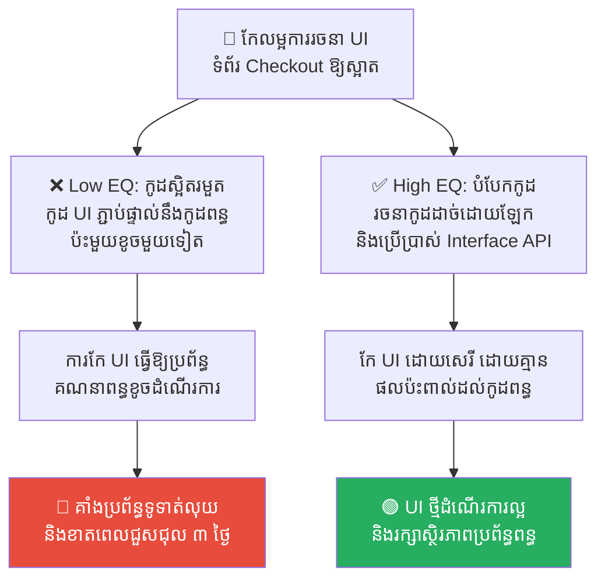
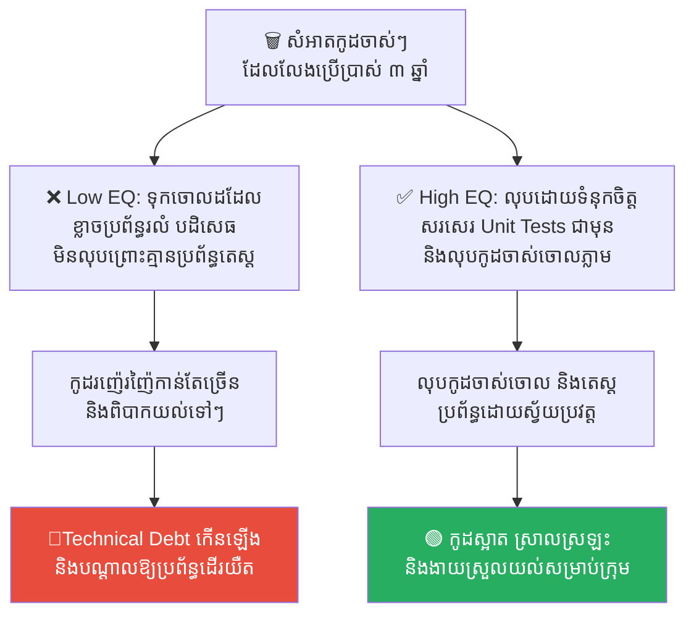
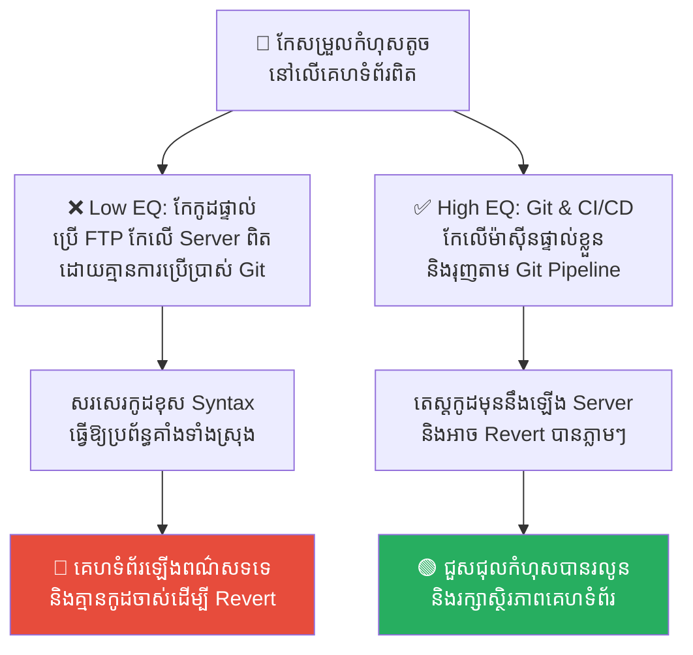
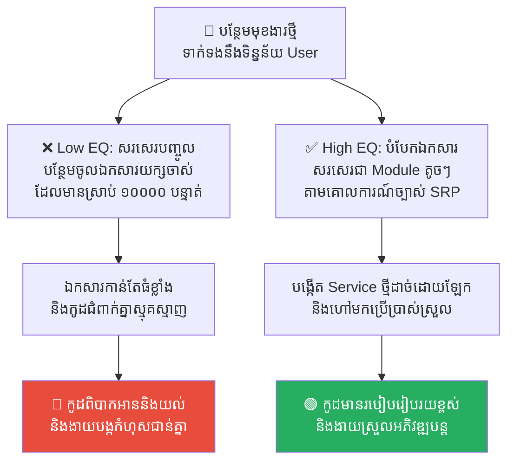
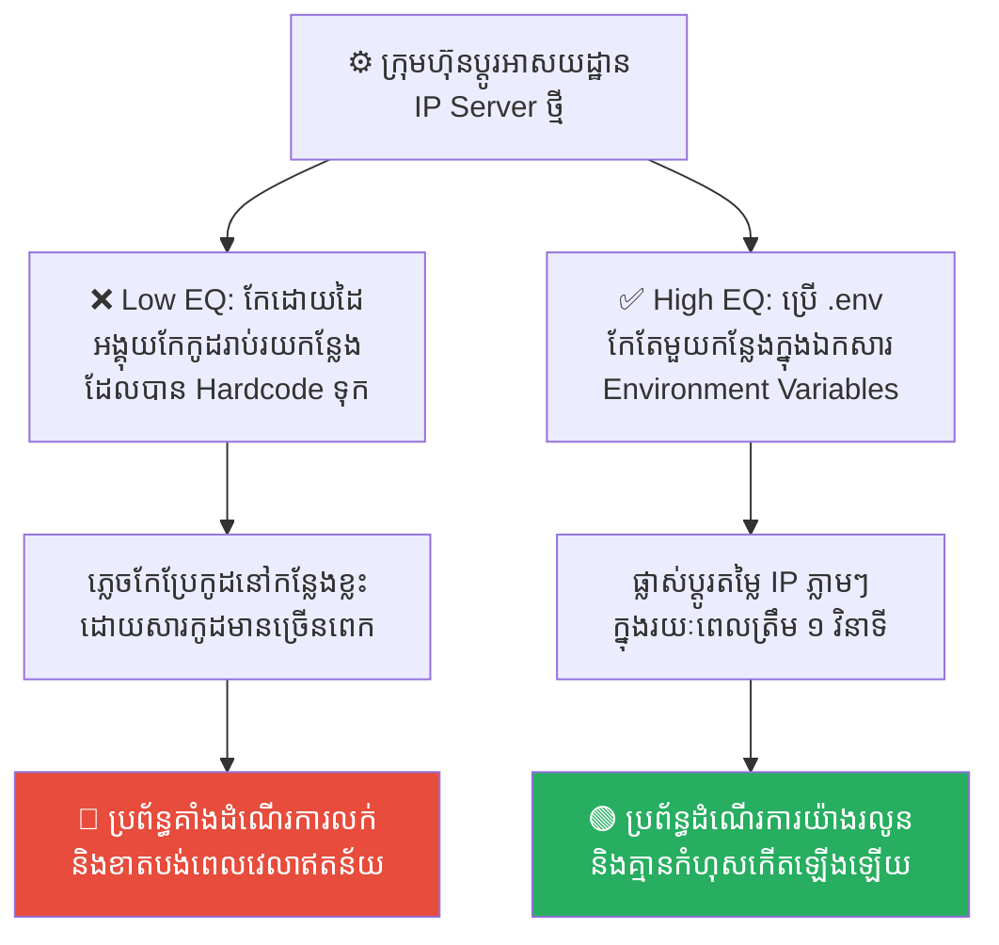

# The Labyrinth and the Minotaur: Navigating Spaghetti Code (គុកវង្វេងផ្លូវ និងកូដរញ៉េរញ៉ៃ)

**Author:** ichamrong  
**Date:** 2026-05-17  
**Tags:** #spaghetti-code #technical-debt #clean-code #unit-testing #greek-history  
**Category:** Concepts  
**Read Time:** ~15 min  

---

## 📌 មាតិកា (Table of Contents)
- [លំនាំបញ្ហា (The Pattern)](#លំនាំបញ្ហា-the-pattern)
- [១. បញ្ហា៖ ហេតុអ្វីបានជាកូដរបស់យើងក្លាយជាគុកវង្វេងផ្លូវ? (The Issue: The Labyrinth of Code)](#១-បញ្ហា-ហេតុអ្វីបានជាកូដរបស់យើងក្លាយជាគុកវង្វេងផ្លូវ-the-issue-the-labyrinth-of-code)
- [២. ឧទាហរណ៍ជាក់ស្តែងក្នុងពិភពពិត (Real World Examples)](#២-ឧទាហរណ៍ជាក់ស្តែងក្នុងពិភពពិត)
  - [ឧទាហរណ៍ទី ១ — កូដដែលទាក់ទងគ្នាស្អិតរមួត (Tightly Coupled Modules)](#ឧទាហរណ៍ទី-១-កូដដែលទាក់ទងគ្នាស្អិតរមួត-tightly-coupled-modules)
  - [ឧទាហរណ៍ទី ២ — ការសរសេរកូដដោយភាពភ័យខ្លាច (Fear-Driven Development & Dead Code)](#ឧទាហរណ៍ទី-២-ការសរសេរកូដដោយភាពភ័យខ្លាច-fear-driven-development-dead-code)
  - [ឧទាហរណ៍ទី ៣ — ការកែប្រែកូដផ្ទាល់លើ Server ពិត (No Version Control & Direct FTP Editing)](#ឧទាហរណ៍ទី-៣-ការកែប្រែកូដផ្ទាល់លើ-server-ពិត-no-version-control-direct-ftp-editing)
  - [ឧទាហរណ៍ទី ៤ — ឯកសារកូដយក្សគ្រប់គ្រងរាល់កិច្ចការងារ (Huge God Classes)](#ឧទាហរណ៍ទី-៤-ឯកសារកូដយក្សគ្រប់គ្រងរាល់កិច្ចការងារ-huge-god-classes)
  - [ឧទាហរណ៍ទី ៥ — ការសរសេរតម្លៃកូដរឹងគ្មានលំនាំ (Magic Numbers & Hardcoded Configurations)](#ឧទាហរណ៍ទី-៥-ការសរសេរតម្លៃកូដរឹងគ្មានលំនាំ-magic-numbers-hardcoded-configurations)
- [៣. កត្តាជម្រុញ៖ ភាពប្រញាប់ប្រញាល់ និងកង្វះការរចនាប្រព័ន្ធ (The Aggravator: Rush Delivery & Lack of Architecture)](#៣-កត្តាជម្រុញ-ភាពប្រញាប់ប្រញាល់-និងកង្វះការរចនាប្រព័ន្ធ-the-aggravator-rush-delivery-lack-of-architecture)
- [៤. ដំណោះស្រាយទូទៅ៖ ខ្សែអំបោះអារីយ៉ាដនីសម្រាប់វិស្វករ (The General Solution: Ariadne's Thread for Developers)](#៤-ដំណោះស្រាយទូទៅ-ខ្សែអំបោះអារីយ៉ាដនីសម្រាប់វិស្វករ-the-general-solution-ariadnes-thread-for-developers)
- [សេចក្តីសន្និដ្ឋាន (Conclusion)](#សេចក្តីសន្និដ្ឋាន-conclusion)
- [Related Posts](#related-posts)

---

## លំនាំបញ្ហា (The Pattern)

តើអ្នកធ្លាប់ចូលទៅកែប្រែ Code នៅក្នុងគម្រោងចាស់ (Legacy Project) មួយ ហើយស្រាប់តែមានអារម្មណ៍ភ័យខ្លាច ហាក់ដូចជាកំពុងដើរចូលទៅក្នុងរូងភ្នំដ៏ងងឹតដែលពោរពេញដោយផ្លូវខ្វាត់ខ្វែង និងរកច្រកចេញមិនឃើញដែរឬទេ? 

គ្រាន់តែអ្នកកែប្រែកូដតែមួយបន្ទាត់នៅកន្លែងនេះ ស្រាប់តែមានកំហុស (Error/Bug) លោតចេញមកនៅកន្លែងផ្សេងមួយទៀត ដែលមើលទៅមិនពាក់ព័ន្ធគ្នាទាល់តែសោះ។ 

នៅក្នុងវិស័យវិស្វកម្មកម្មវិធី (Software Engineering) ស្ថានភាពនេះត្រូវបានគេហៅថា **Spaghetti Code** (កូដដែលជំពាក់វាក់វិនស្មុគស្មាញដូចសរសៃមី)។ វាប្រៀបបានទៅនឹងគុកវង្វេងផ្លូវដ៏ល្បីល្បាញបំផុតនៅក្នុងរឿងព្រេងក្រិកបុរាណ ដែលមានឈ្មោះថា **The Labyrinth**។

គុកវង្វេងផ្លូវនេះ ត្រូវបានសាងសង់ឡើងយ៉ាងស្មុគស្មាញបំផុត ដើម្បីបង្ខាំងសត្វចម្លែកស៊ីសាច់មនុស្សឈ្មោះ **Minotaur (មីណូត័រ)**។ អ្នកណាដែលដើរចូលទៅខាងក្នុង គឺគ្មានថ្ងៃអាចស្វែងរកផ្លូវចេញមកក្រៅវិញបានឡើយ ហើយនឹងត្រូវ Minotaur ស៊ីជាអាហារ។

នៅពេលកូដរបស់អ្នកក្លាយជា Spaghetti Code នោះគម្រោងរបស់អ្នកនឹងក្លាយជា «Labyrinth» មួយ ដែលសូម្បីតែវិស្វករដែលបង្កើតវាដំបូង ក៏វង្វេងផ្លូវរកច្រកចេញមិនឃើញដែរ។

---

## ១. បញ្ហា៖ ហេតុអ្វីបានជាកូដរបស់យើងក្លាយជាគុកវង្វេងផ្លូវ? (The Issue: The Labyrinth of Code)

Spaghetti Code ឬកូដរញ៉េរញ៉ៃ កើតឡើងនៅពេលដែលវិស្វករសរសេរកូដដោយគ្មានការរៀបចំរចនាសម្ព័ន្ធច្បាស់លាស់ (No Architecture)។ ពួកគេសរសេរកូដភ្ជាប់ពីផ្នែកមួយទៅផ្នែកមួយទៀតដោយផ្ទាល់ និងគ្មានរបៀបរៀបរយ។

យូរៗទៅ នៅពេលគម្រោងកាន់តែធំឡើងៗ និងមានមុខងារកាន់តែច្រើន ទំនាក់ទំនងរវាងកូដនីមួយៗនឹងកាន់តែស្មុគស្មាញឡើងៗ រហូតដល់គ្មាននរណាម្នាក់អាចមើលឃើញជារូបភាពធំ (Big Picture) ឡើយ។ 

គ្រោះថ្នាក់ដ៏ធំបំផុតនៅក្នុង Labyrinth គឺការលាក់ខ្លួននៃសត្វចម្លែក Minotaur ដែលជានិមិត្តរូបនៃ **Hidden Bugs (កំហុសលាក់កំបាំងដ៏ធ្ងន់ធ្ងរ)**។ វិស្វករចាប់ផ្តើមមានភាពភ័យខ្លាចក្នុងការកែប្រែកូដចាស់ៗ (Fear-driven Development) ព្រោះខ្លាចប៉ះចំ Minotaur ហើយធ្វើឱ្យប្រព័ន្ធទាំងមូលត្រូវបាក់ស្រុតចុះ។ ទីបំផុត ក្រុមហ៊ុនត្រូវចំណាយថវិការាប់សែនដុល្លារជារៀងរាល់ខែ ដើម្បីគ្រាន់តែថែទាំប្រព័ន្ធដែលលែងចង់ដើរទៅមុខនេះ (Technical Debt)។

---

## ២. ឧទាហរណ៍ជាក់ស្តែងក្នុងពិភពពិត

សូមពិនិត្យមើល **ឧទាហរណ៍ជាក់ស្តែងចំនួន ៥** បង្ហាញពីរបៀបដែលកូដរញ៉េរញ៉ៃបំផ្លាញផលិតភាពការងារ និងវិធីសាស្ត្រដោះស្រាយ៖

---

### ឧទាហរណ៍ទី ១ — កូដដែលទាក់ទងគ្នាស្អិតរមួត (Tightly Coupled Modules)

**ស្ថានភាព៖** នៅក្នុង App លក់ទំនិញមួយ មុខងារគណនាប្រាក់ពន្ធ (Tax Module) ត្រូវបានសរសេរភ្ជាប់ដោយផ្ទាល់ (Hard-coupled) ទៅនឹងទំព័ររចនាការទូទាត់ប្រាក់ (Checkout UI Container)។

*   **សកម្មភាពអសកម្ម / Low EQ / កំហុសឆ្គង៖** វិស្វករចង់កែលម្អការរចនាទំព័រ Checkout ឱ្យស្អាតជាងមុន។ គ្រាន់តែពួកគេកែប្រែ UI ស្រាប់តែប្រព័ន្ធគណនាប្រាក់ពន្ធត្រូវគាំងមិនដំណើរការ ដោយសារតែកូដទាំងពីរផ្នែកនេះមានការពាក់ព័ន្ធគ្នាស្អិតរមួតខ្លាំងពេក (Spaghetti dependency)។ ពួកគេត្រូវចំណាយពេល ៣ ថ្ងៃ ដើម្បីតាមស្វែងរក និងជួសជុលកូដឡើងវិញ។
*   **សកម្មភាពស្ថាបនា / High EQ / ដំណោះស្រាយ៖** អនុវត្ត **Decoupling (Loose Coupling) & Interface Design**។ ត្រូវរចនាឱ្យមុខងារគណនាពន្ធ ដំណើរការដាច់ដោយឡែកពី UI ទាំងស្រុងតាមរយៈ API ឬ Interface ច្បាស់លាស់។ ទំព័រ Checkout គ្រាន់តែហៅមុខងារពន្ធមកប្រើ តែមិនខ្វល់ពីរបៀបដែលវាដំណើរការខាងក្នុងឡើយ។
*   **លទ្ធផល៖** ការសរសេរកូដជំពាក់គ្នាដូចសរសៃមីនាំឱ្យប៉ះកន្លែងមួយ ខូចខាតកន្លែងមួយទៀតគ្មានឈប់ឈរ។ ការបំបែកកូដឱ្យមានឯករាជ្យភាពជួយឱ្យការកែលម្អការរចនា UI មានភាពងាយស្រួល លឿនរហ័ស និងគ្មានផលប៉ះពាល់ដល់ប្រព័ន្ធស្នូល។

---

### ឧទាហរណ៍ទី ២ — ការសរសេរកូដដោយភាពភ័យខ្លាច (Fear-Driven Development & Dead Code)

**ស្ថានភាព៖** នៅក្នុងប្រព័ន្ធទិន្នន័យចាស់មួយ មានឯកសារកូដ (Function) ចំនួន ២០ ដែលមើលទៅហាក់ដូចជាលែងប្រើប្រាស់រយៈពេល ៣ ឆ្នាំមកហើយ។

*   **សកម្មភាពអសកម្ម / Low EQ / កំហុសឆ្គង៖** វិស្វករថ្មីចង់លុបកូដចាស់ៗទាំងនោះចោល ដើម្បីឱ្យប្រព័ន្ធស្រាល និងស្អាត។ ប៉ុន្តែ វិស្វករជាន់ខ្ពស់បានស្រែកឃាត់ភ្លាមៗថា៖ *«កុំលុបឱ្យសោះ! ទោះបីជាយើងមិនដឹងថាវាប្រើសម្រាប់ធ្វើអ្វីក៏ដោយ តែបើលុបចោល ខ្លាចក្រែងវាធ្វើឱ្យប្រព័ន្ធទាំងមូលដួលរលំ ទុកវាចោលបែបហ្នឹងទៅ!»* នេះជាការរស់នៅជាមួយ Minotaur ក្នុង Labyrinth ដោយសារគ្មាន Unit Tests ការពារ។
*   **សកម្មភាពស្ថាបនា / High EQ / ដំណោះស្រាយ៖** សរសេរ **Unit Tests** គ្របដណ្តប់លើប្រព័ន្ធការងារចាស់ៗ រួចប្រើប្រាស់ឧបករណ៍វិភាគកូដ (Static Analysis Tools) ដើម្បីស្វែងរកកូដដែលលែងដំណើរការ (Dead Code)។ ធ្វើការលុបចោលដោយមានទំនុកចិត្ត ព្រោះបើមានកំហុស Unit Tests នឹងលោតពណ៌ក្រហមប្រាប់ភ្លាមៗ។
*   **លទ្ធផល៖** ការទុកកូដចាស់ៗចោលព្រោះតែខ្លាចនាំឱ្យប្រព័ន្ធកាន់តែធ្ងន់ ស្មុគស្មាញ និងពិបាកយល់ទៅៗជារៀងរាល់ឆ្នាំ។ ការលុបកូដចាស់ចោលដោយមានប្រព័ន្ធតេស្តជួយឱ្យប្រព័ន្ធស្អាត ស្រាល និងងាយស្រួលថែទាំ។

---

### ឧទាហរណ៍ទី ៣ — ការកែប្រែកូដផ្ទាល់លើ Server ពិត (No Version Control & Direct FTP Editing)

**ស្ថានភាព៖** ក្រុមហ៊ុនមួយមានប្រព័ន្ធគេហទំព័រលក់ទំនិញមួយ។ ថ្ងៃមួយ មានកំហុសតូចមួយកើតឡើងលើទំព័រទាក់ទងរបស់អតិថិជន។

*   **សកម្មភាពអសកម្ម / Low EQ / កំហុសឆ្គង៖** វិស្វករម្នាក់បានប្រើប្រាស់ FTP ចូលទៅបើកឯកសារកូដ រួចធ្វើការកែប្រែកូដផ្ទាល់នៅលើ Server ផលិតកម្មពិត (Production Server) ដោយគ្មានការប្រើប្រាស់ Git ឬប្រព័ន្ធ Version Control ឡើយ ព្រោះគិតថាកែតែមួយភ្លែតរួចហើយ។ គាត់បានវាយអក្សរខុសឃ្លា (Syntax Error) ធ្វើឱ្យគេហទំព័រទាំងមូលត្រូវគាំងដួលរលំ (White Screen of Death) ហើយគាត់មិនដឹងត្រូវ Revert ត្រឡប់មកកូដចាស់វិញដោយរបៀបណាឡើយ។
*   **សកម្មភាពស្ថាបនា / High EQ / ដំណោះស្រាយ៖** បង្ហាត់ក្រុមការងារឱ្យប្រើប្រាស់ **Git Version Control & CI/CD Pipeline** យ៉ាងតឹងរ៉ឹងបំផុត។ គ្មាននរណាម្នាក់មានសិទ្ធិកែប្រែកូដផ្ទាល់លើ Server ពិតឡើយ។ រាល់ការកែប្រែត្រូវធ្វើនៅលើម៉ាស៊ីនផ្ទាល់ខ្លួន (Local) រួចរុញទៅកាន់ Git Branch និងឆ្លងកាត់ការតេស្តស្វ័យប្រវត្តមុននឹងដំឡើងទៅ Server។
*   **លទ្ធផល៖** ការកែកូដផ្ទាល់លើ Server នាំឱ្យប្រព័ន្ធងាយរងគ្រោះថ្នាក់ដួលរលំភ្លាមៗ និងពិបាកស្តារឡើងវិញ។ ការប្រើប្រាស់ Git និង CI/CD ជួយធានាសុវត្ថិភាពកូដ និងអនុញ្ញាតឱ្យស្តារប្រព័ន្ធឡើងវិញត្រឹម ១ វិនាទីបើមានបញ្ហា។

---

### ឧទាហរណ៍ទី ៤ — ឯកសារកូដយក្សគ្រប់គ្រងរាល់កិច្ចការងារ (Huge God Classes)

**ស្ថានភាព៖** នៅក្នុងគម្រោងអភិវឌ្ឍន៍ App មួយ ឯកសារឈ្មោះ `UserController.js` មានប្រវែងដល់ទៅ ១០,០០០ បន្ទាត់។ វាគ្រប់គ្រងតាំងពី ការចុះឈ្មោះបុគ្គលិក, ការផ្ញើអ៊ីមែល, ការគណនាប្រាក់ខែ, ការទូទាត់លុយ រហូតដល់ការបង្កើតរបាយការណ៍។

*   **សកម្មភាពអសកម្ម / Low EQ / កំហុសឆ្គង៖** រាល់ពេលចង់បន្ថែមមុខងារថ្មីទាក់ទងនឹងបុគ្គលិក វិស្វករគ្រាន់តែសរសែរកូដបន្ថែមចូលទៅក្នុងឯកសារយក្សនោះជារៀងរាល់ថ្ងៃ ព្រោះងាយស្រួលមិនបាច់បង្កើតឯកសារថ្មី។ យូរៗទៅ គ្មាននរណាម្នាក់ហ៊ានបើកឯកសារនោះឡើយ ព្រោះវាធំពេក ដើរយឺត និងពោរពេញដោយកូដស្មុគស្មាញរកផ្លូវមិនឃើញ (A Labyrinth within a file)។
*   **សកម្មភាពស្ថាបនា / High EQ / ដំណោះស្រាយ៖** អនុវត្តគោលការណ៍ **Single Responsibility Principle (SRP)**។ ធ្វើការបំបែកឯកសារយក្សនោះជាឯកសារតូចៗដែលមានភារកិច្ចតែមួយច្បាស់លាស់ (ដូចជា `RegistrationService`, `EmailNotifier`, `PayrollCalculator`) ដើម្បីឱ្យងាយស្រួលយល់ និងតេស្ត។
*   **លទ្ធផល៖** ការសរសេរកូដរាប់ម៉ឺនបន្ទាត់ក្នុងឯកសារតែមួយនាំឱ្យកូដពិបាកអាន ពិបាកយល់ និងងាយបង្កកំហុសជាន់គ្នា។ ការបំបែកកូដតាមគោលការណ៍ SRP ជួយឱ្យកូដមានរបៀបរៀបរយ ស្អាត និងងាយស្រួលអភិវឌ្ឍន៍បន្ត។

---

### ឧទាហរណ៍ទី ៥ — ការសរសេរតម្លៃកូដរឹងគ្មានលំនាំ (Magic Numbers & Hardcoded Configurations)

**ស្ថានភាព៖** នៅក្នុងកូដគម្រោងទូទាត់ប្រាក់ វិស្វករបានសរសេរតម្លៃរឹង (Hardcoded) ដូចជា IP Address របស់ Server ផលិតកម្ម និង API Keys សម្ងាត់ផ្ទាល់នៅក្នុងកូដរាប់រយកន្លែង។

*   **សកម្មភាពអសកម្ម / Low EQ / កំហុសឆ្គង៖** នៅពេលក្រុមហ៊ុនប្តូរម៉ាស៊ីន Server ទៅកាន់អាសយដ្ឋាន IP ថ្មី ក្រុមវិស្វករត្រូវចំណាយពេលពេញមួយយប់ អង្គុយបើកឯកសារកូដរាប់រយ ដើម្បីកែប្រែលេខ IP នោះម្តងមួយៗ។ ពួកគេបានភ្លេចកែប្រែកូដនៅកន្លែងមួយចំនួន ធ្វើឱ្យអតិថិជនមិនអាចទូទាត់ប្រាក់បាននៅព្រឹកបន្ទាប់។
*   **សកម្មភាពស្ថាបនា / High EQ / ដំណោះស្រាយ៖** អនុវត្ត **Centralized Environment Variables (`.env`)**។ មិនត្រូវសរសេរតម្លៃសម្ងាត់ ឬការកំណត់រចនាសម្ព័ន្ធរឹងនៅក្នុងកូដឡើយ។ ត្រូវប្រមូលផ្តុំវានៅក្នុងឯកសារកំណត់តែមួយ (`config.js` ឬ `.env`) ដើម្បីឱ្យងាយស្រួលកែប្រែតែមួយកន្លែង និងមានសុវត្ថិភាពខ្ពស់។
*   **លទ្ធផល៖** ការសរសេរតម្លៃរឹងក្នុងកូដនាំឱ្យប្រព័ន្ធពិបាកបត់បែន និងងាយធ្លាយព័ត៌មានសម្ងាត់ទៅកាន់ខាងក្រៅ។ ការគ្រប់គ្រងការកំណត់កណ្តាលជួយឱ្យប្រព័ន្ធបត់បែនលឿន និងមានសុវត្ថិភាពខ្ពស់បំផុត។

---

## ៣. កត្តាជម្រុញ៖ ភាពប្រញាប់ប្រញាល់ និងកង្វះការរចនាប្រព័ន្ធ (The Aggravator: Rush Delivery & Lack of Architecture)

ហេតុអ្វីបានជាកូដដ៏ស្អាតស្អំរបស់យើង ងាយនឹងប្រែប្រួលទៅជា Spaghetti Code ដ៏គួរឱ្យខ្លាចខ្លាំងម្ល៉េះ? កត្តាជម្រុញរួមមាន៖

1.  **សម្ពាធពេលវេលាប្រញាប់ប្រញាល់ (Feature Rush)៖** ប្រធានផ្នែកអាជីវកម្មតែងតែចង់បានមុខងារថ្មីឱ្យបានលឿនបំផុត។ ពួកគេសង្កត់ក្បាលវិស្វករឱ្យសរសេរកូដរុញទៅមុខដោយគ្មានពេលវេលារចនា៖ *«សរសេរកូដឱ្យដើរទៅរួចសិនទៅ រឿងស្អាតចាំធ្វើ Refactoring ពេលក្រោយ!»* (ដែលការពិត ពេលវេលាក្រោយនោះមិនដែលមកដល់ឡើយ)។
2.  **កង្វះប្រព័ន្ធតេស្តស្វ័យប្រវត្ត (No Testing Culture)៖** នៅពេលគ្មាន Unit Tests វិស្វករគ្មានខែលការពារឡើយ។ ពួកគេមិនហ៊ានកែប្រែកូដឱ្យស្អាត (Refactoring) ព្រោះខ្លាចធ្វើឱ្យខូចខាតប្រព័ន្ធ ទើបសម្រេចចិត្តសរសេរកូដរញ៉េរញ៉ៃបន្ថែមពីលើរបស់ចាស់ជារៀងរាល់ថ្ងៃ។
3.  **កង្វះការរៀបចំរចនាសម្ព័ន្ធ (Lack of Architectural Oversight)៖** ការខ្វះតួនាទីរបស់ Software Architect ឬ Senior Code Reviews ធ្វើឱ្យវិស្វករម្នាក់ៗសរសេរកូដតាមតែចិត្តខ្លួនឯង ដោយគ្មានបទដ្ឋានរួម។

---

## ៤. ដំណោះស្រាយទូទៅ៖ ខ្សែអំបោះអារីយ៉ាដនីសម្រាប់វិស្វករ (The General Solution: Ariadne's Thread for Developers)

នៅក្នុងរឿងព្រេងក្រិក វីរបុរស Theseus អាចរស់រានមានជីវិត និងសម្លាប់ Minotaur នៅក្នុង Labyrinth បាន ដោយសារតែគាត់ប្រើប្រាស់ **«សរសៃអំបោះ (Ariadne's Thread)»** ដែលអារីយ៉ាដនីបានផ្តល់ឱ្យ។ គាត់ចងខ្សែអំបោះនោះពីមាត់ទ្វារចូល រួចដើរចូលទៅខាងក្នុង។ ពេលសម្លាប់ Minotaur រួច គាត់គ្រាន់តែដើរត្រឡប់ថយក្រោយតាមខ្សែអំបោះនោះមករកច្រកចេញវិញដោយសុវត្ថិភាព។

នៅក្នុងវិស័យ Software Engineering យើងក៏មាន **«Ariadne's Thread»** របស់ពួកយើងដែរ៖

1.  **សរសេរ Unit Tests មុននឹងកែប្រែកូដ (Tests as Your Thread)៖** មុននឹងដើរចូលទៅកែប្រែកូដចាស់ៗ ត្រូវសរសេរ Unit Tests ព័ទ្ធជុំវិញវាជាមុនសិន។ វាប្រៀបដូចជាការចងសរសៃអំបោះអ៊ីចឹង។ ប្រសិនបើអ្នកកែកូដខុស នោះ Test នឹងលោតពណ៌ក្រហម (Alert) ប្រាប់អ្នកឱ្យត្រឡប់ថយក្រោយ (Undo) តាមខ្សែអំបោះមកវិញភ្លាមៗ មុនពេលវាធ្លាយទៅដល់ដៃអតិថិជន។
2.  **ការរៀបចំកូដឱ្យស្អាតជាប្រចាំ (Regular Refactoring & Boy Scout Rule)៖** ប្រកាន់ខ្ជាប់គោលការណ៍ Boy Scout៖ *«ចូរទុកឱ្យកន្លែងបោះជំរំ ស្អាតជាងមុនពេលដែលអ្នកមកដល់ជានិច្ច។»* រាល់ពេលដែលអ្នកចូលទៅកែកូដ ចូរឆ្លៀតពេលជម្រះកូដរញ៉េរញ៉ៃតូចមួយចោល ដើម្បីកុំឱ្យគុកវង្វេងផ្លូវនោះធំឡើង។
3.  **ការគ្រប់គ្រងកំណែកូដច្បាស់លាស់ (Strict Git Workflow)៖** ប្រើប្រាស់ Git Commits ឱ្យបានល្អ និងញឹកញាប់។ Commit នីមួយៗ គឺជាចំណុចសុវត្ថិភាពនៅលើខ្សែអំបោះរបស់អ្នក ដែលអនុញ្ញាតឱ្យអ្នករត់ថយក្រោយ (Revert) បានជានិច្ចនៅពេលវង្វេងផ្លូវ។

---

## សេចក្តីសន្និដ្ឋាន (Conclusion)

**គុកវង្វេងផ្លូវ និងកូដរញ៉េរញ៉ៃ (Spaghetti Code)** គឺជាជំងឺរាតត្បាតដ៏ធំបំផុតនៅក្នុងវិស័យ Software។ វាមិនត្រឹមតែបំផ្លាញផលិតភាពការងាររបស់វិស្វករប៉ុណ្ណោះទេ តែវាថែមទាំងសម្លាប់អាជីវកម្មទាំងមូលផងដែរ ព្រោះក្រុមហ៊ុនដើរយឺតជាងដៃគូប្រកួតប្រជែង។ វិស្វករដ៏ឆ្នើម មិនមែនជាអ្នកសរសេរកូដស្មុគស្មាញបំផុតដែលគ្មានអ្នកណាយល់នោះទេ ប៉ុន្តែវាគឺ **«អ្នកសរសេរកូដដ៏សាមញ្ញ ស្អាត និងមានរបៀបរៀបរយ ដែលមនុស្សគ្រប់គ្នាមើលយល់ និងអាចអភិវឌ្ឍបន្តបានយ៉ាងរលូនបំផុត»**។

ចូរចងចាំថា៖ **«កុំដើរចូលទៅក្នុងកូដចាស់ៗ ដោយគ្មានខ្សែអំបោះ (Unit Tests) ឱ្យសោះ។»**

---

## Related Posts

*   **[34 The Labyrinth and Ariadne's Thread](../parables/34-the-labyrinth-and-the-thread.md)** — រឿងប្រៀបធៀបប្រវត្តិសាស្ត្រក្រិក អំពីវីរបុរស និងសត្វចម្លែកនៅក្នុងគុកវង្វេងផ្លូវដ៏អស្ចារ្យ។
*   **[10 Technical Debt and Refactoring](./10-technical-debt-and-refactoring.md)** — ការស្វែងយល់លម្អិតអំពីការបង់ការប្រាក់ និងផលវិបាកនៃការទុកកូដរញ៉េរញ៉ៃក្នុងប្រព័ន្ធ។

---

*Last updated: 2026-05-26*
