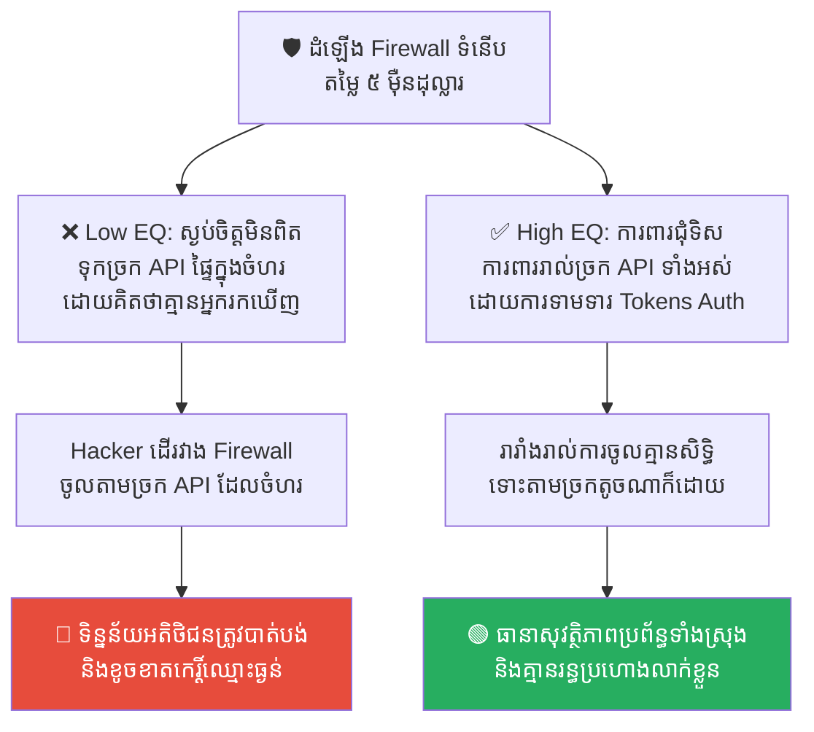
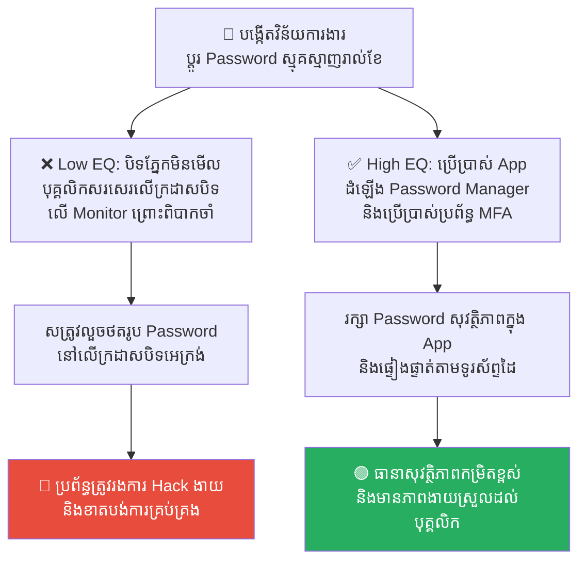
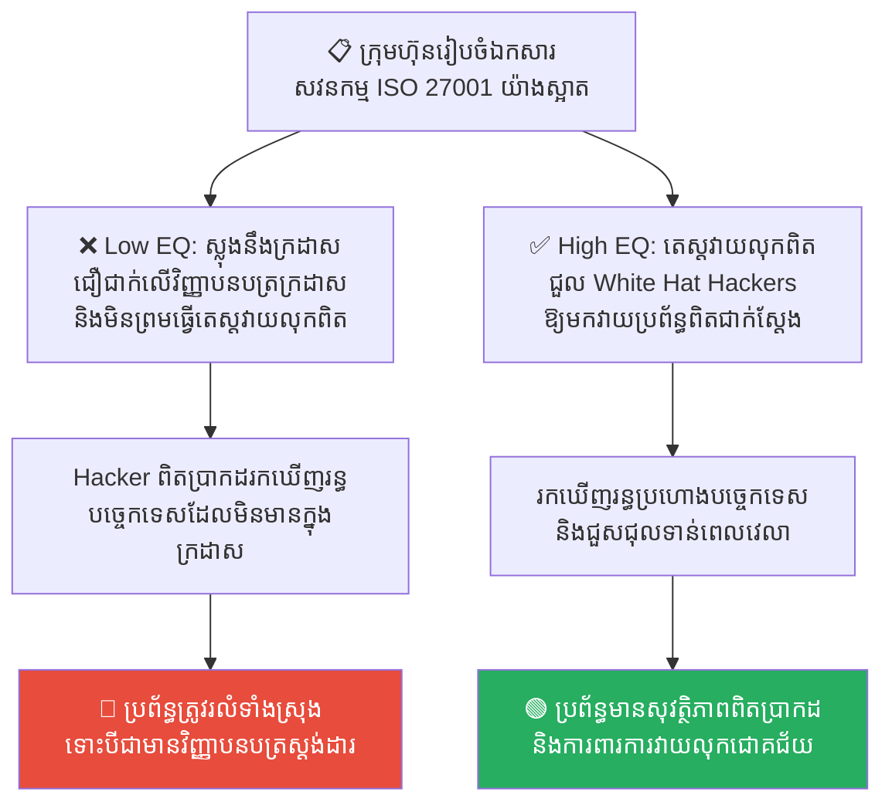
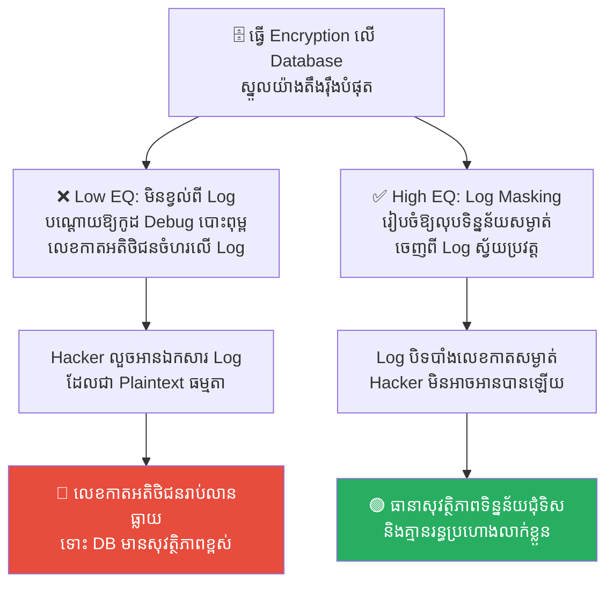
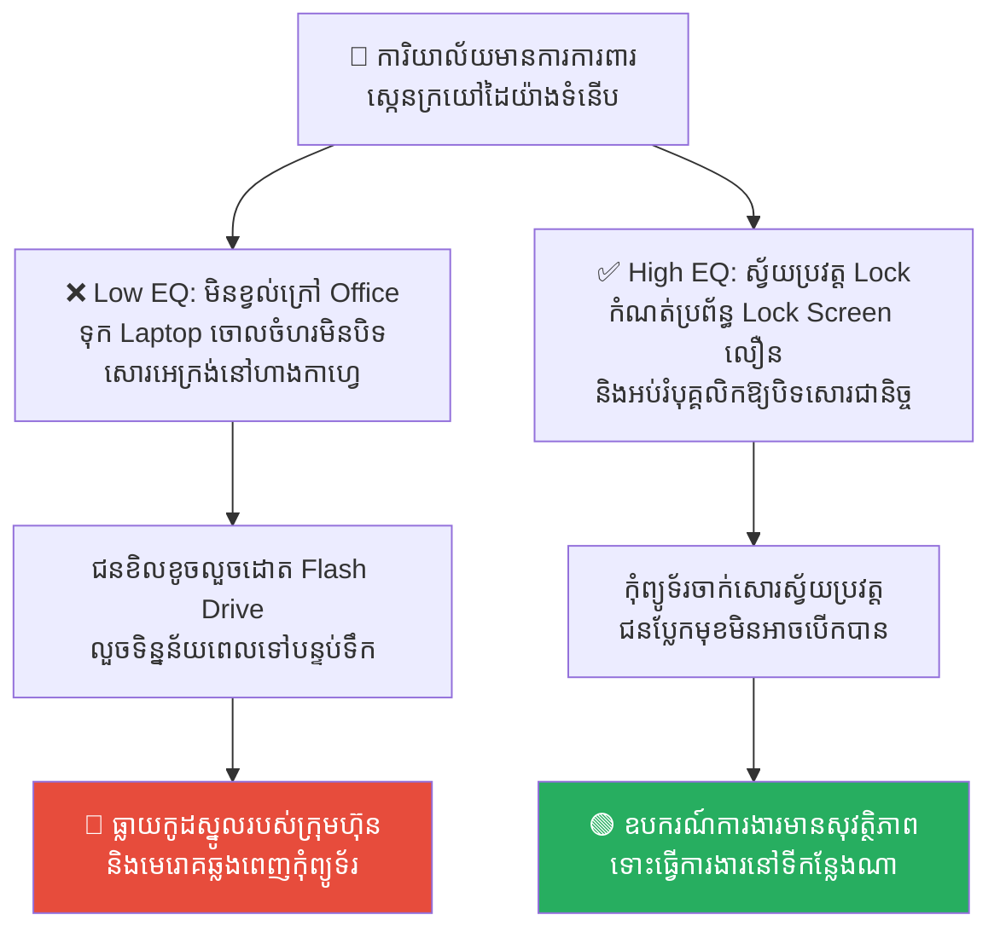

# The Maginot Line: Security Theater and the Weakest Link (ខ្សែបន្ទាត់ម៉ាហ្ស៊ីណូត៖ ការការពារមិនជុំទិស និងរន្ធប្រហោង)

**Author:** ichamrong  
**Date:** 2026-05-17  
**Tags:** #cybersecurity #maginot-line #security-theater #backdoor #system-design  
**Category:** Concepts  
**Read Time:** ~15 min  

---

## 📌 មាតិកា (Table of Contents)
- [លំនាំបញ្ហា (The Pattern)](#លំនាំបញ្ហា-the-pattern)
- [១. បញ្ហា៖ ហេតុអ្វីបានជាកំពែងដ៏រឹងមាំត្រូវសត្រូវដើរវាងបាន? (The Issue: The Illusion of Perimeter Security)](#១-បញ្ហា-ហេតុអ្វីបានជាកំពែងដ៏រឹងមាំត្រូវសត្រូវដើរវាងបាន-the-issue-the-illusion-of-perimeter-security)
- [២. ឧទាហរណ៍ជាក់ស្តែងក្នុងពិភពពិត (Real World Examples)](#២-ឧទាហរណ៍ជាក់ស្តែងក្នុងពិភពពិត)
  - [ឧទាហរណ៍ទី ១ — ជញ្ជាំង Firewall រឹងមាំ តែទ្វារ API ចំហរ (Firewall vs. Unprotected API Endpoints)](#ឧទាហរណ៍ទី-១-ជញ្ជាំង-firewall-រឹងមាំ-តែទ្វារ-api-ចំហរ-firewall-vs-unprotected-api-endpoints)
  - [ឧទាហរណ៍ទី ២ — ការបង្ខំឱ្យប្តូរលេខសម្ងាត់ស្មុគស្មាញ (Strict Password Rotation vs. Sticky Notes)](#ឧទាហរណ៍ទី-២-ការបង្ខំឱ្យប្តូរលេខសម្ងាត់ស្មុគស្មាញ-strict-password-rotation-vs-sticky-notes)
  - [ឧទាហរណ៍ទី ៣ — ឯកសារអនុលោមភាពសន្តិសុខលើក្រដាស (Compliance Audits vs. Live Penetration Tests)](#ឧទាហរណ៍ទី-៣-ឯកសារអនុលោមភាពសន្តិសុខលើក្រដាស-compliance-audits-vs-live-penetration-tests)
  - [ឧទាហរណ៍ទី ៤ — Database ការពារខ្ពស់ តែ Log ធ្លាយចំហរ (Encrypted Database vs. Plaintext Debug Logs)](#ឧទាហរណ៍ទី-៤-database-ការពារខ្ពស់-តែ-log-ធ្លាយចំហរ-encrypted-database-vs-plaintext-debug-logs)
  - [ឧទាហរណ៍ទី ៥ — កាតស្កេនអាគារទំនើប តែទុកកុំព្យូទ័រចោលចំហរ (Strong Physical Access vs. Unlocked Laptops)](#ឧទាហរណ៍ទី-៥-កាតស្កេនអាគារទំនើប-តែទុកកុំព្យូទ័រចោលចំហរ-strong-physical-access-vs-unlocked-laptops)
- [៣. កត្តាជម្រុញ៖ គំនិតលួងចិត្តខ្លួនឯង និងល្ខោនសន្តិសុខ (The Aggravator: False Peace of Mind & Security Theater)](#៣-កត្តាជម្រុញ-គំនិតលួងចិត្តខ្លួនឯង-និងល្ខោនសន្តិសុខ-the-aggravator-false-peace-of-mind-security-theater)
- [៤. ដំណោះស្រាយទូទៅ៖ របៀបការពារប្រព័ន្ធច្រើនស្រទាប់ (The General Solution: Defense in Depth)](#៤-ដំណោះស្រាយទូទៅ-របៀបការពារប្រព័ន្ធច្រើនស្រទាប់-the-general-solution-defense-in-depth)
- [សេចក្តីសន្និដ្ឋាន (Conclusion)](#សេចក្តីសន្និដ្ឋាន-conclusion)
- [Related Posts](#related-posts)

---

## លំនាំបញ្ហា (The Pattern)

ដូចគ្នាទៅនឹង «សេះឈើក្រុងទ្រយ» ដែរ នៅក្នុងប្រវត្តិសាស្ត្រសង្គ្រាមលោកលើកទី២ មានមេរៀនមួយដ៏ល្បីល្បាញបំផុតអំពីការសាងសង់ប្រព័ន្ធការពារដ៏ធំ និងរឹងមាំបំផុតក្នុងលោក ប៉ុន្តែនៅតែត្រូវសត្រូវវាយកម្ទេចបានយ៉ាងងាយស្រួល។ នោះគឺ **ខ្សែបន្ទាត់ម៉ាហ្ស៊ីណូត (The Maginot Line)** របស់ប្រទេសបារាំង។

បារាំងបានចំណាយថវិការាប់ពាន់លានហ្វ្រង់ និងពេលរាប់ឆ្នាំ ដើម្បីសាងសង់កំពែងការពារបេតុងដ៏ក្រាស់ កាំភ្លើងធំទំនើប និងបន្ទាយក្រោមដី តាមបណ្តោយព្រំដែនបារាំង-អាល្លឺម៉ង់ ដើម្បីការពារការឈ្លានពាន។ កំពែងនេះរឹងមាំខ្លាំង រហូតដល់គ្មានកងទ័ពណាអាចវាយទម្លុះចំពីមុខបានឡើយ។

ប៉ុន្តែ អាល្លឺម៉ង់មិនបានវាយទម្លុះចំពីមុខឡើយ។ ពួកគេគ្រាន់តែ **«ដើរវាង (Bypassed)»** ខ្សែបន្ទាត់ម៉ាហ្ស៊ីណូត តាមរយៈការវាយលុកកាត់តាម **ព្រៃ Ardennes** នៃប្រទេសប៊ែលហ្សិក ដែលជាច្រកចំហរគ្មានការការពារព្រោះបារាំងសន្និដ្ឋានថា *«ព្រៃក្រាស់នេះគ្មាននរណាអាចឆ្លងកាត់បានឡើយ»*។ លទ្ធផលគឺ កងទ័ពបារាំងត្រូវឡោមព័ទ្ធ និងបរាជ័យទាំងស្រុងក្នុងរយៈពេលត្រឹមតែប៉ុន្មានសប្តាហ៍។

មេរៀននេះបង្រៀនយើងនៅក្នុងពិភពឌីជីថលថា៖

> 💡 **«Hacker មិនដែលចំណាយពេលវាយប្រហារចំកន្លែងដែលរឹងមាំបំផុតរបស់អ្នកឡើយ ពួកគេគ្រាន់តែស្វែងរកកន្លែងដែលអ្នកភ្លេចការពារប៉ុណ្ណោះ។»**

---

## ១. បញ្ហា៖ ហេតុអ្វីបានជាកំពែងដ៏រឹងមាំត្រូវសត្រូវដើរវាងបាន? (The Issue: The Illusion of Perimeter Security)

នៅក្នុងវិស័យ Cybersecurity ក្រុមហ៊ុនជាច្រើនធ្លាក់ចូលក្នុងលំអៀង «ខ្សែបន្ទាត់ម៉ាហ្ស៊ីណូត» ដោយការចំណាយថវិការាប់សែនដុល្លារទិញ Firewall ទំនើបៗ និងរចនាកំពែងការពារបណ្តាញអ៊ីនធឺណិតយ៉ាងរឹងមាំ (Perimeter Security)។ 

ពួកគេមានអារម្មណ៍ថាខ្លួនឯងមានសុវត្ថិភាពខ្លាំងណាស់។ ប៉ុន្តែ ពួកគេបែរជាទុកឱ្យកុំព្យូទ័ររបស់បុគ្គលិក មិនមានការដំឡើងប្រព័ន្ធការពារ, ទុកឱ្យច្រកទិន្នន័យ (API) ផ្ទៃក្នុងចំហរចោលដោយគ្មាន Password ឬទុកឱ្យបុគ្គលិកប្រើប្រាស់ Password ងាយៗទៅវិញ។

Hacker គ្រាន់តែវាង Firewall ដ៏ទំនើបនោះ រួចវាយប្រហារលើ «រន្ធប្រហោងតូចមួយ» ដែលមិនមានការការពារ ហើយលួចទាញយកទិន្នន័យទាំងអស់របស់ក្រុមហ៊ុនទៅក្រៅយ៉ាងងាយស្រួល។ នេះហើយជាអ្វីដែលយើងហៅថា **Security Theater (ល្ខោនសន្តិសុខ)** គឺការធ្វើឱ្យប្រព័ន្ធមើលទៅដូចជាមានសុវត្ថិភាពខ្លាំងខាងក្រៅ តែការពិតវាគ្រាន់តែជាការលួងចិត្តខ្លួនឯងប៉ុណ្ណោះ។

---

## ២. ឧទាហរណ៍ជាក់ស្តែងក្នុងពិភពពិត

សូមពិនិត្យមើល **ឧទាហរណ៍ជាក់ស្តែងចំនួន ៥** បង្ហាញពីរបៀបដែលលំអៀងខ្សែបន្ទាត់ម៉ាហ្ស៊ីណូតបំផ្លាញប្រព័ន្ធ និងវិធីសាស្ត្រដោះស្រាយ៖

---

### ឧទាហរណ៍ទី ១ — ជញ្ជាំង Firewall រឹងមាំ តែទ្វារ API ចំហរ (Firewall vs. Unprotected API Endpoints)

**ស្ថានភាព៖** ក្រុមហ៊ុនមួយបានដំឡើង Enterprise Firewall ដ៏មានឥទ្ធិពលបំផុតតម្លៃ ៥ ម៉ឺនដុល្លារ ដើម្បីការពារប្រព័ន្ធបណ្តាញកុំព្យូទ័រទាំងស្រុងរបស់ក្រុមហ៊ុន។

*   **សកម្មភាពអសកម្ម / Low EQ / កំហុសឆ្គង៖** ក្រុមការងារមានមោទនភាព និងសន្និដ្ឋានថាគ្មាននរណាអាច Hack ចូលបានឡើយ។ ប៉ុន្តែ វិស្វករម្នាក់បានបង្កើត API Endpoint មួយឈ្មោះថា `/api/internal/users` ទុកសម្រាប់តេស្តការងារផ្ទៃក្នុង ដោយសារខ្ជិលវាយ Password ពួកគេបានទុកវាចោលចំហរគ្មានការការពារ (Public IP) ដោយសន្និដ្ឋានថា *«កន្លែងនេះគ្មាននរណារកឃើញឡើយ»*។ Hacker គ្រាន់តែដើរវាង Firewall រួចទាញយកទិន្នន័យ User ទាំងអស់តាមរយៈ API ច្រកចំហរនោះយ៉ាងងាយស្រួល។
*   **សកម្មភាពស្ថាបនា / High EQ / ដំណោះស្រាយ៖** អនុវត្ត **Least Privilege & Unified Authentication**។ គ្មានច្រក API ណាដែលត្រូវបានអនុញ្ញាតឱ្យបើកចំហរដោយគ្មានការការពារ Password និងការផ្ទៀងផ្ទាត់សិទ្ធិ (OAuth2/Tokens) ឡើយ ទោះបីជាប្រើសម្រាប់តែការងារផ្ទៃក្នុងក៏ដោយ។
*   **លទ្ធផល៖** ការពឹងផ្អែកលើកំពែង Firewall តែមួយមុខនាំឱ្យធ្លាយទិន្នន័យក្រុមហ៊ុនទាំងស្រុងដោយងាយ។ ការការពារគ្រប់ច្រក API ជួយធានាសុវត្ថិភាពប្រព័ន្ធបានជុំទិស។

---

### ឧទាហរណ៍ទី ២ — ការបង្ខំឱ្យប្តូរលេខសម្ងាត់ស្មុគស្មាញ (Strict Password Rotation vs. Sticky Notes)

**ស្ថានភាព៖** នាយកដ្ឋានព័ត៌មានវិទ្យា (IT Dept) បានដាក់ចេញនូវគោលនយោបាយរឹតបន្តឹង Password៖ *«បុគ្គលិកត្រូវតែប្តូរ Password ជារៀងរាល់ខែ ដោយប្រើប្រាស់យ៉ាងហោចណាស់ ១៦ តួអក្សរ រួមមានអក្សរធំ អក្សរតូច និងសញ្ញាពិសេសចម្រុះគ្នា។»*

*   **សកម្មភាពអសកម្ម / Low EQ / កំហុសឆ្គង៖** ក្រុមហ៊ុនមានអារម្មណ៍ថាខ្លួនមានសុវត្ថិភាពខ្លាំងណាស់ (Security Theater)។ ប៉ុន្តែដោយសារតែវាស្មុគស្មាញខ្លាំងពេក និងពិបាកចងចាំ បុគ្គលិក ៩០% បែរជាសរសេរ Password ថ្មីនោះលើក្រដាស (Sticky Note) រួចបិទនៅលើអេក្រង់កុំព្យូទ័រ ឬក្រោមបន្ទះក្តារចុចទៅវិញ! ទីបំផុត អ្នកបោសសំអាតម្នាក់លួចថតរូបយកទៅលក់ឱ្យសត្រូវ។
*   **សកម្មភាពស្ថាបនា / High EQ / ដំណោះស្រាយ៖** អនុវត្ត **Password Manager & Multi-Factor Authentication (MFA)**។ ជំនួសឱ្យការបង្ខំឱ្យចាំ Password វែងៗដែលនាំឱ្យកើតមានកំហុសរូបវន្ត ត្រូវអនុញ្ញាតឱ្យបុគ្គលិកប្រើប្រាស់កម្មវិធីរក្សាទុក Password (ដូចជា 1Password) រួមជាមួយការដំឡើងប្រព័ន្ធ MFA (លេខកូដទូរស័ព្ទ)។
*   **លទ្ធផល៖** ការរឹតបន្តឹងដោយខ្វះភាពបត់បែនខាងចិត្តសាស្ត្រនាំឱ្យកើតមានចន្លោះប្រហោងសន្តិសុខរូបវន្តធ្ងន់ធ្ងរ។ ការប្រើប្រាស់ Password Manager និង MFA ជួយឱ្យបុគ្គលិកធ្វើការងារស្រួល និងមានសុវត្ថិភាពខ្ពស់។

---

### ឧទាហរណ៍ទី ៣ — ឯកសារអនុលោមភាពសន្តិសុខលើក្រដាស (Compliance Audits vs. Live Penetration Tests)

**ស្ថានភាព៖** ក្រុមហ៊ុនមួយចង់ទទួលបានវិញ្ញាបនបត្រសុវត្ថិភាព ISO 27001។ ពួកគេបានជួលបុគ្គលិកសរសេរឯកសារគោលនយោបាយរាប់រយទំព័រយ៉ាងស្អាត។

*   **សកម្មភាពអសកម្ម / Low EQ / កំហុសឆ្គង៖** ក្រុមហ៊ុនគិតថាខ្លួនមានសុវត្ថិភាពណាស់ ព្រោះប្រលងជាប់សវនកម្ម (Audits) និងមានបោះត្រាលើក្រដាសរួចរាល់។ ប៉ុន្តែ ពួកគេបដិសេធមិនព្រមជួលក្រុមហ៊ុន Hacker ល្អ (White Hat Hackers) ឱ្យមកធ្វើការសាកល្បងវាយលុកប្រព័ន្ធពិត (Live Penetration Testing) ឡើយ ព្រោះខ្លាចខូចទម្រង់ក្រដាសគោលនយោបាយ។ មួយខែក្រោយមក Hacker ពិតប្រាកដវាយលុកប្រព័ន្ធទាញយកទិន្នន័យបានយ៉ាងងាយ ដោយសាររន្ធប្រហោងបច្ចេកទេសដែលមិនមានចែងក្នុងក្រដាស Audits។
*   **សកម្មភាពស្ថាបនា / High EQ / ដំណោះស្រាយ៖** អនុវត្ត **Continuous Penetration Testing & Vulnerability Management**។ មិនត្រូវពឹងផ្អែកលើការវាយតម្លៃលើក្រដាសតែមួយមុខឡើយ។ ត្រូវធ្វើការសាកល្បងវាយលុកប្រព័ន្ធពិតជាក់ស្តែងជារៀងរាល់ឆ្នាំ ដើម្បីស្វែងរកចន្លោះប្រហោងបច្ចេកវិទ្យាដែលលាក់ខ្លួន។
*   **លទ្ធផល៖** ការរស់នៅជាមួយក្រដាសអនុលោមភាពនាំឱ្យកើតមាន «ល្ខោនសន្តិសុខ» ដែលងាយរងគ្រោះថ្នាក់។ ការធ្វើតេស្តវាយលុកពិតជាក់ស្តែងជួយឱ្យប្រព័ន្ធរឹងមាំ និងមានស្ថិរភាពពិតប្រាកដ។

---

### ឧទាហរណ៍ទី ៤ — Database ការពារខ្ពស់ តែ Log ធ្លាយចំហរ (Encrypted Database vs. Plaintext Debug Logs)

**ស្ថានភាព៖** ធនាគារមួយបានដំឡើងប្រព័ន្ធការពារការលួចទិន្នន័យ និងធ្វើកូដនីយកម្មទិន្នន័យ (Encryption) យ៉ាងតឹងរ៉ឹងបំផុតនៅលើ Database ស្នូល។

*   **សកម្មភាពអសកម្ម / Low EQ / កំហុសឆ្គង៖** ថ្នាក់ដឹកនាំជឿជាក់ថា ទោះបីជា Hacker ចូលក្នុងម៉ាស៊ីន Server ក៏មិនអាចអានទិន្នន័យបានដែរ ព្រោះវាត្រូវបាន Encrypted។ តែពួកគេធ្វេសប្រហែសមិនបានពិនិត្យមើលប្រព័ន្ធ Log (Application Logs) ឡើយ។ វិស្វករម្នាក់បានសរសេរកូដ Debug ឱ្យបោះពុម្ពទិន្នន័យអតិថិជន (លេខកាត, លេខសម្ងាត់) ជាអក្សរធម្មតា (Plaintext) ទៅក្នុងឯកសារ Log ដើម្បីងាយស្រួលអានកំហុស។ Hacker គ្រាន់តែចូលទៅលួចអានឯកសារ Log ធម្មតានោះយ៉ាងងាយស្រួល។
*   **សកម្មភាពស្ថាបនា / High EQ / ដំណោះស្រាយ៖** អនុវត្ត **Strict Log Redaction & Security Monitoring**។ រាល់ព័ត៌មានសម្ងាត់ (SSN, Passwords, Cards) ត្រូវតែត្រូវបានលុបចោល ឬបិទបាំង (Masking/Redaction) ស្វ័យប្រវត្ត មុននឹងសរសេរចូលទៅក្នុងប្រព័ន្ធ Log ណាមួយ និងមានការការពារ Log Files ស្មើនឹង Database។
*   **លទ្ធផល៖** ការការពារតែមាត់ទ្វារធំ តែទុកច្រកបង្អួចឱ្យចំហរនាំឱ្យបាត់បង់ទិន្នន័យសម្ងាត់អតិថិជន។ ការគ្រប់គ្រងប្រព័ន្ធ Log ឱ្យមានសុវត្ថិភាពជួយបិទរាល់រន្ធប្រហោងដែលមើលមិនឃើញ។

---

### ឧទាហរណ៍ទី ៥ — កាតស្កេនអាគារទំនើប តែទុកកុំព្យូទ័រចោលចំហរ (Strong Physical Access vs. Unlocked Laptops)

**ស្ថានភាព៖** ក្រុមហ៊ុនបច្ចេកវិទ្យាមួយបានរៀបចំប្រព័ន្ធការពារសន្តិសុខរូបវន្តយ៉ាងទំនើប។ បុគ្គលិកត្រូវមានកាតស្កេនក្រយៅដៃ និងឆ្លងកាត់ទ្វារដែកពីរជាន់ដើម្បីចូលក្នុងការិយាល័យ។

*   **សកម្មភាពអសកម្ម / Low EQ / កំហុសឆ្គង៖** ក្រុមហ៊ុនមានមោទនភាពលើការការពាររូបវន្តនេះខ្លាំងណាស់។ ប៉ុន្តែ វិស្វករម្នាក់បានយកកុំព្យូទ័រយួរដៃការងារ (Laptop) ទៅធ្វើការងារនៅហាងកាហ្វេខាងក្រៅ។ គាត់បានក្រោកដើរទៅបន្ទប់ទឹក ៣ នាទី ដោយមិនបានបិទសោរអេក្រង់កុំព្យូទ័រឡើយ (Unlocked Screen)។ ជនខិលខូចម្នាក់បានដើរមកអង្គុយ រួចដោត Flash Drive លួចចម្លងទិន្នន័យសម្ងាត់ និងដំឡើងកូដមេរោគចូលក្នុងម៉ាស៊ីនរបស់គាត់ភ្លាមៗ។
*   **សកម្មភាពស្ថាបនា / High EQ / ដំណោះស្រាយ៖** អនុវត្ត **Auto-Lock Screen Policy & Physical Security Awareness**។ ក្រុមហ៊ុនត្រូវកំណត់ឱ្យម៉ាស៊ីនកុំព្យូទ័រទាំងអស់ចាក់សោរអេក្រង់ដោយស្វ័យប្រវត្តក្នុងរយៈពេល ១ នាទីនៅពេលគ្មានសកម្មភាព និងអប់រំបុគ្គលិកឱ្យបិទសោរអេក្រង់ជានិច្ច (`Win+L` ឬ `Cmd+Ctrl+Q`) រាល់ពេលក្រោកចេញពីកៅអី។
*   **លទ្ធផល៖** ការការពារតែការិយាល័យកណ្តាល តែធ្វេសប្រហែសការការពារឧបករណ៍ចល័តនាំឱ្យប្រព័ន្ធរងការវាយលុកយ៉ាងងាយស្រួល។ ការបង្កើតទម្លាប់បិទសោរកុំព្យូទ័រជួយការពារសុវត្ថិភាពឧបករណ៍ការងារនៅគ្រប់ទីកន្លែង។

---

## ៣. កត្តាជម្រុញ៖ គំនិតលួងចិត្តខ្លួនឯង និងល្ខោនសន្តិសុខ (The Aggravator: False Peace of Mind & Security Theater)

ហេតុអ្វីបានជាយើងងាយនឹងធ្លាក់ចូលក្នុងអន្ទាក់ខ្សែបន្ទាត់ម៉ាហ្ស៊ីណូតខ្លាំងម្ល៉េះ? កត្តាជម្រុញរួមមាន៖

1.  **ល្ខោនសន្តិសុខ (Security Theater)៖** យើងចូលចិត្តធ្វើសកម្មភាពណាដែលមើលទៅដូចជាមានសុវត្ថិភាពខ្លាំង និងបង្ហាញឱ្យគេឯងឃើញ (ដូចជា ការប្តូរ Password ញឹកញាប់, ការប្រើប្រាស់កាតស្កេនទំនើប) ដើម្បីឱ្យខ្លួនឯងមានអារម្មណ៍ស្ងប់ចិត្ត ទោះបីជាសកម្មភាពទាំងនោះមិនបានជួយការពារហានិភ័យពិតប្រាកដក៏ដោយ។
2.  **ការសន្និដ្ឋានដោយខ្វះភស្តុតាង (Unverified Assumptions)៖** យើងតែងតែសន្និដ្ឋានថា ច្រកតូចៗ ឬច្រកផ្ទៃក្នុងគឺគ្មាននរណាអាចរកឃើញឡើយ (ដូចជា ព្រៃ Ardennes) ទើបយើងមិនបារម្ភ និងធ្វេសប្រហែសមិនដាក់ប្រព័ន្ធការពារ។
3.  **ភាពមិនស៊ីគ្នារវាងការការពារ និងការរស់នៅ (Usability Friction)៖** នៅពេលយើងបង្កើតប្រព័ន្ធការពារដែលស្មុគស្មាញពេក និងបង្កផលលំបាកខ្លាំងដល់ការធ្វើការងារប្រចាំថ្ងៃរបស់បុគ្គលិក បុគ្គលិកនឹងស្វែងរក «ច្រកវាង» ដើម្បីធ្វើការងារឱ្យលឿន ដែលច្រកវាងនោះហើយគឺជាច្រកដែល Hacker ចូលមក។

---

## ៤. ដំណោះស្រាយទូទៅ៖ របៀបការពារប្រព័ន្ធច្រើនស្រទាប់ (The General Solution: Defense in Depth)

ដើម្បីជៀសវាងការធ្លាក់ចូលក្នុងអន្ទាក់ខ្សែបន្ទាត់ម៉ាហ្ស៊ីណូត ចូរវិវឌ្ឍប្រព័ន្ធការពាររបស់អ្នកទៅជា **Defense in Depth (ការការពារច្រើនស្រទាប់)**៖

1.  **កុំពឹងផ្អែកលើជញ្ជាំងតែមួយ (No Silver Bullets)៖** ត្រូវទទួលស្គាល់ថា គ្មានកំពែងការពារណាដែលអាចការពារបាន ១០០% ឡើយ។ ត្រូវរៀបចំផែនការការពារច្រើនជាន់៖ *«ទោះបីជា Hacker ទម្លុះ Firewall ចូលមកបាន ក៏ត្រូវមានប្រព័ន្ធតម្រូវឱ្យវាយ Password មួយជាន់ទៀត (Internal MFA) និងមានការធ្វើកូដនីយកម្មទិន្នន័យ (Encryption) ការពារជានិច្ច។»*
2.  **សន្មតថាជញ្ជាំងនឹងត្រូវបាក់ (Assume Breach Mentality)៖** ជានិច្ចកាល ត្រូវសួរខ្លួនឯងថា៖ *«ចុះបើ Hacker អាចចូលមកដល់ក្នុងម៉ាស៊ីន Server នេះបាន តើពួកគេអាចធ្វើអ្វីបានខ្លះ?»* រួចត្រូវដាក់កម្រិតសិទ្ធិ (Least Privilege) ដើម្បីកុំឱ្យពួកគេរាលដាលទៅកន្លែងផ្សេងទៀតបាន។
3.  **ការពារគ្រប់ច្រកល្ហក (Secure the Forest)៖** កុំមើលស្រាលច្រកតូចៗ ឬច្រកផ្ទៃក្នុង។ រាល់ API ទាំងអស់ ទោះប្រើសម្រាប់តែការងារផ្ទៃក្នុងក៏ដោយ ក៏ត្រូវតែមានការត្រួតពិនិត្យសិទ្ធិយ៉ាងតឹងរ៉ឹងបំផុត និងមិនត្រូវទុកចំហរចោលឡើយ។

---

## សេចក្តីសន្និដ្ឋាន (Conclusion)

**ខ្សែបន្ទាត់ម៉ាហ្ស៊ីណូត (The Maginot Line)** បង្រៀនយើងថា ប្រព័ន្ធការពារដ៏រឹងមាំបំផុត នឹងគ្មានតម្លៃអ្វីឡើយ ប្រសិនបើវាមាន «រន្ធប្រហោងតែមួយចំណុច» ដែលគ្មានការការពារ។ សន្តិសុខព័ត៌មានវិទ្យា និងការគ្រប់គ្រងស្ថាប័នប្រកបដោយវិជ្ជាជីវៈ ត្រូវតែមានសមត្ថភាព **«កសាងការការពារប្រព័ន្ធការងារឱ្យបានស៊ីជម្រៅ ច្រើនស្រទាប់ និងជុំទិស ដើម្បីធានាថា គ្មានចំណុចខ្សោយណាមួយដែលអាចឱ្យសត្រូវដើរវាងបានឡើយ»**។

ចូរចងចាំថា៖ **«ខ្សែសង្វាក់មួយ គឺរឹងមាំស្មើនឹងកង់ដែលទន់ខ្សោយបំផុតរបស់វា។»**

---

## Related Posts

*   **[35 The Maginot Line and the Unguarded Forest](../parables/35-the-maginot-line.md)** — រឿងប្រៀបធៀបប្រវត្តិសាស្ត្រពិត អំពីប្រទេសបារាំង និងការបរាជ័យនៃខ្សែបន្ទាត់ម៉ាហ្ស៊ីណូតដ៏ល្បីល្បាញ។
*   **[24 The Trojan Horse: Social Engineering and Insider Threats](./24-the-trojan-horse-and-insider-threats.md)** — យុទ្ធសាស្ត្រវាយប្រហារមួយទៀតដែល Hacker ប្រើប្រាស់ដើម្បីបញ្ឆោតឱ្យយើងបើកទ្វារ។

---

*Last updated: 2026-05-26*
