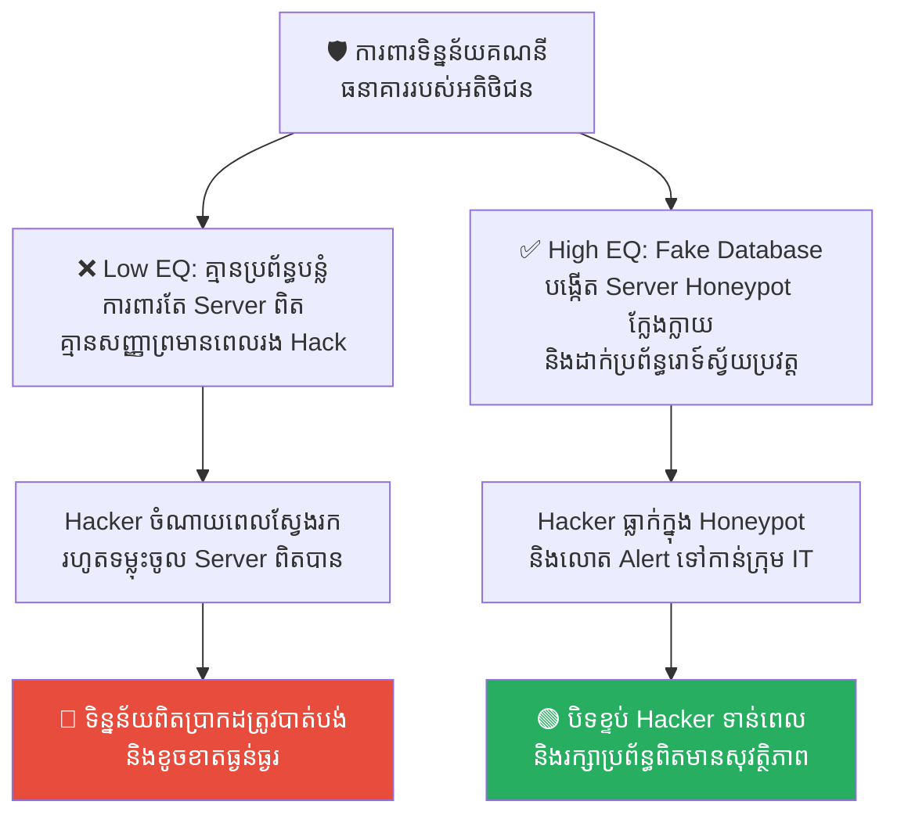
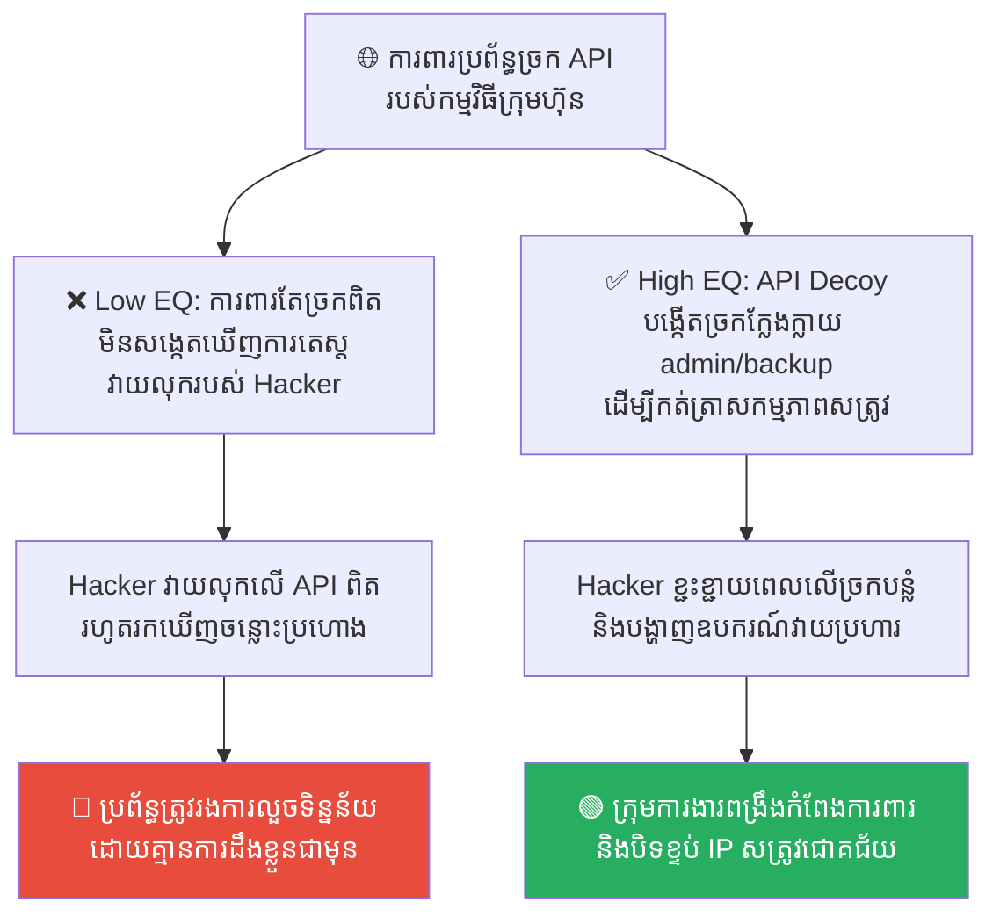
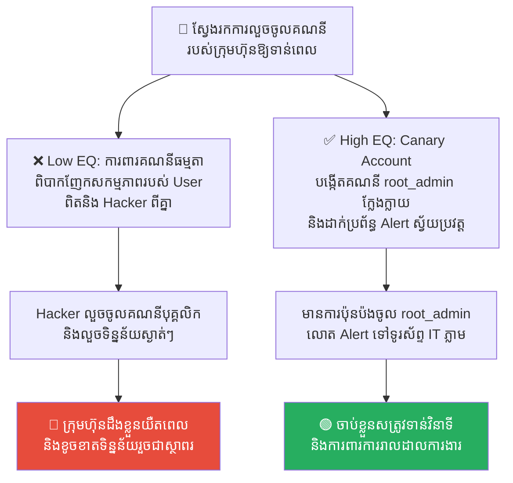
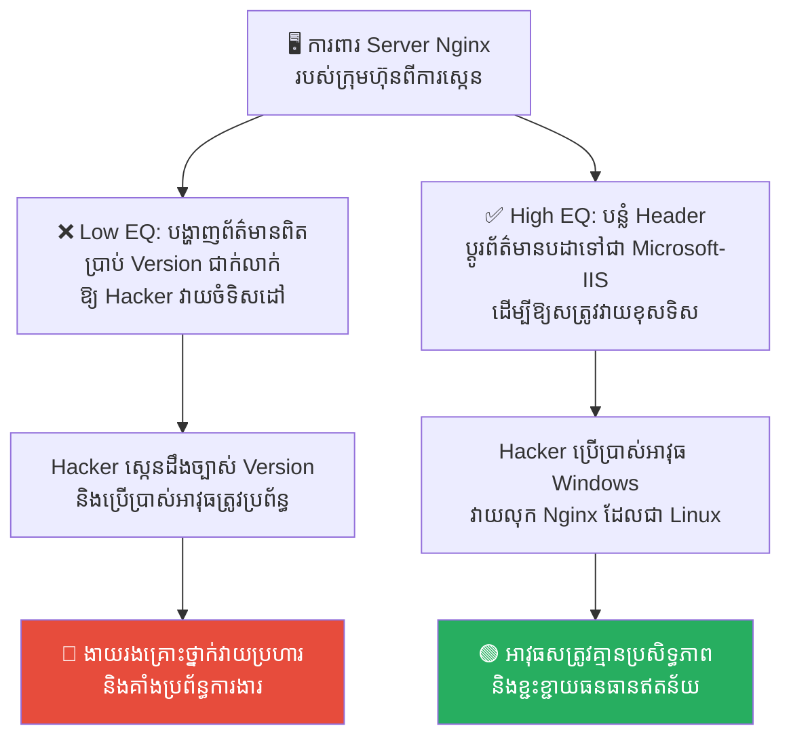
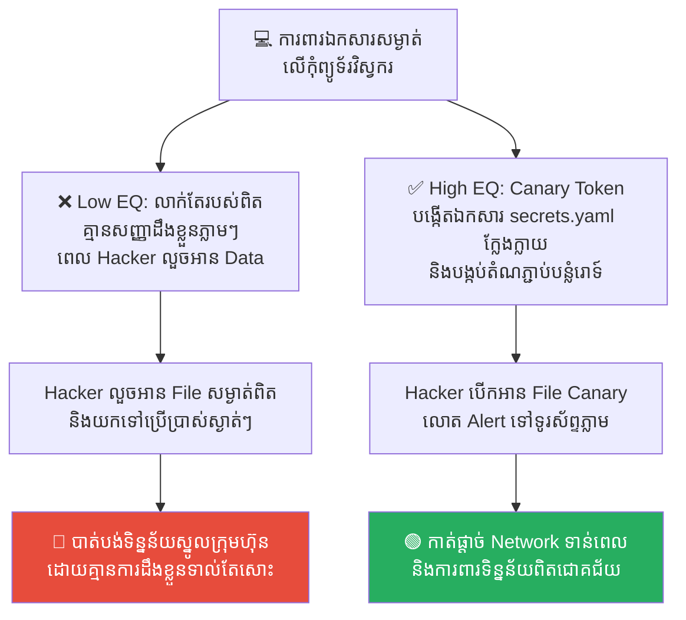

# The Empty City Strategy: Psychological Warfare and Honeypots (យុទ្ធសាស្ត្រក្រុងទទេ៖ សង្គ្រាមចិត្តសាស្ត្រ និងការដាក់អន្ទាក់បញ្ឆោត)

**Author:** ichamrong  
**Date:** 2026-05-17  
**Tags:** #cybersecurity #honeypots #empty-city-strategy #psychological-warfare #three-kingdoms  
**Category:** Concepts  
**Read Time:** ~15 min  

---

## 📌 មាតិកា (Table of Contents)
- [លំនាំបញ្ហា (The Pattern)](#លំនាំបញ្ហា-the-pattern)
- [១. បញ្ហា៖ ហេតុអ្វីបានជាការបន្លំគឺជាអាវុធការពារដ៏ល្អបំផុត? (The Issue: The Power of Deception)](#១-បញ្ហា-ហេតុអ្វីបានជាការបន្លំគឺជាអាវុធការពារដ៏ល្អបំផុត-the-issue-the-power-of-deception)
- [២. ឧទាហរណ៍ជាក់ស្តែងក្នុងពិភពពិត (Real World Examples)](#២-ឧទាហរណ៍ជាក់ស្តែងក្នុងពិភពពិត)
  - [ឧទាហរណ៍ទី ១ — ម៉ាស៊ីនផ្ទុកទិន្នន័យក្លែងក្លាយ (Fake Database Honeypot)](#ឧទាហរណ៍ទី-១-ម៉ាស៊ីនផ្ទុកទិន្នន័យក្លែងក្លាយ-fake-database-honeypot)
  - [ឧទាហរណ៍ទី ២ — ច្រក API បញ្ឆោតទាក់ទាញ Hacker (API Decoy Endpoint)](#ឧទាហរណ៍ទី-២-ច្រក-api-បញ្ឆោតទាក់ទាញ-hacker-api-decoy-endpoint)
  - [ឧទាហរណ៍ទី ៣ — គណនីគ្រប់គ្រងក្លែងក្លាយសម្រាប់ព្រមានទុកជាមុន (Fake Admin/Canary Account)](#ឧទាហរណ៍ទី-៣-គណនីគ្រប់គ្រងក្លែងក្លាយសម្រាប់ព្រមានទុកជាមុន-fake-admincanary-account)
  - [ឧទាហរណ៍ទី ៤ — ការបន្លំព័ត៌មានបដា Server ដើម្បីឱ្យសត្រូវវាយខុសទិស (Misleading Server Banner Information)](#ឧទាហរណ៍ទី-៤-ការបន្លំព័ត៌មានបដា-server-ដើម្បីឱ្យសត្រូវវាយខុសទិស-misleading-server-banner-information)
  - [ឧទាហរណ៍ទី ៥ — ឯកសារសម្ងាត់ក្លែងក្លាយក្នុងប្រព័ន្ធរួម (Decoy Config Files & Canary Tokens)](#ឧទាហរណ៍ទី-៥-ឯកសារសម្ងាត់ក្លែងក្លាយក្នុងប្រព័ន្ធរួម-decoy-config-files-canary-tokens)
- [៣. កត្តាជម្រុញ៖ ភាពលោភលន់ និងការសង្ស័យរបស់សត្រូវ (The Aggravator: Attacker Greed & Paranoia)](#៣-កត្តាជម្រុញ-ភាពលោភលន់-និងការសង្ស័យរបស់សត្រូវ-the-aggravator-attacker-greed-paranoia)
- [៤. ដំណោះស្រាយទូទៅ៖ របៀបបង្កើតក្រុងទទេផ្ទាល់ខ្លួន (The General Solution: Setting Up Honeypots)](#៤-ដំណោះស្រាយទូទៅ-របៀបបង្កើតក្រុងទទេផ្ទាល់ខ្លួន-the-general-solution-setting-up-honeypots)
- [សេចក្តីសន្និដ្ឋាន (Conclusion)](#សេចក្តីសន្និដ្ឋាន-conclusion)
- [Related Posts](#related-posts)

---

## លំនាំបញ្ហា (The Pattern)

ការការពារប្រព័ន្ធបច្ចេកវិទ្យា និងអាជីវកម្ម មិនមែនមានន័យថាត្រូវតែប្រើប្រាស់ជញ្ជាំងបេតុងដ៏រឹងមាំ ឬការប្រើប្រាស់កម្លាំងបាយតែម៉្យាងនោះឡើយ។ ជារឿយៗ អាវុធដ៏មានប្រសិទ្ធភាព និងឆ្លាតវៃបំផុតក្នុងការទប់ទល់នឹងសត្រូវ គឺ **«ការលេងសង្គ្រាមចិត្តសាស្ត្រ (Psychological Warfare)»** ដើម្បីធ្វើឱ្យពួកគេមានភាពភ័យខ្លាច សង្ស័យ ឬធ្លាក់ចូលក្នុងអន្ទាក់ដែលយើងបានរៀបចំទុកជាមុន។

យុទ្ធសាស្ត្រនេះត្រូវបានដកស្រង់ចេញពីប្រវត្តិសាស្ត្រសាមកុកដ៏ល្បីល្បាញបំផុត គឺ **យុទ្ធសាស្ត្រក្រុងទទេ (The Empty City Strategy)** របស់ ខុងមិញ (ជូកឺលៀង)។ 

ខុងមិញកំពុងស្នាក់នៅក្នុងទីក្រុងតូចមួយជាមួយទាហានតែ ២,០០០ នាក់។ ស្រាប់តែពេលនោះ កងទ័ពសត្រូវដឹកនាំដោយ ស៊ីម៉ាអ៊ី មានគ្នាដល់ទៅ ១៥ ម៉ឺននាក់ បានមកឡោមព័ទ្ធទីក្រុង។ បើវាយទល់ទល់ គឺច្បាស់ជាស្លាប់ និងបរាជ័យទាំងស្រុង។

ខុងមិញបានសម្រេចចិត្តប្រើប្រាស់សង្គ្រាមចិត្តសាស្ត្រ៖ គាត់បានបញ្ជាឱ្យទាហានបើកទ្វារក្រុងទាំង ៤ ចំហរចោល ឱ្យទាហានបន្លំខ្លួនជាអ្នកបោសសំអាតថ្នល់ធម្មតានៅមាត់ទ្វារ រួចគាត់ឡើងទៅអង្គុយលេងពិណយ៉ាងស្ងប់ស្ងៀមនៅលើកំពែងក្រុង។

ស៊ីម៉ាអ៊ីបានដឹកនាំទ័ពមកដល់ ឃើញទ្វារក្រុងចំហរ និងឮសំឡេងពិណដ៏ស្ងប់ស្ងាត់ ក៏ចាប់ផ្តើមសង្ស័យ៖ *«ខុងមិញជាមនុស្សដែលប្រុងប្រយ័ត្នបំផុត មិនដែលធ្វេសប្រហែសឡើយ។ ការបើកទ្វារក្រុងចំហរនេះ ច្បាស់ជាមានការបង្កប់កងទ័ពអន្ទាក់ដ៏ធំនៅខាងក្នុងមិនខាន!»* ដោយសារភាពភ័យខ្លាច និងសង្ស័យ ស៊ីម៉ាអ៊ីបានសម្រេចចិត្តដកថយទ័ពទាំង ១៥ ម៉ឺននាក់ទៅវិញភ្លាមៗ។

នៅក្នុងពិភពឌីជីថល និងសន្តិសុខព័ត៌មានវិទ្យា យុទ្ធសាស្ត្រក្រុងទទេត្រូវបានបង្កើតឡើងជាទម្រង់នៃការ **បន្លំ (Deception)** ដែលហៅថា **Honeypot (ក្រឡទឹកឃ្មុំ)**។

---

## ១. បញ្ហា៖ ហេតុអ្វីបានជាការបន្លំគឺជាអាវុធការពារដ៏ល្អបំផុត? (The Issue: The Power of Deception)

Hacker តែងតែស្វែងរករបស់ណាដែល «ស្រួល Hack និងមានតម្លៃបំផុត»។ ពួកការការពារបែបអកម្ម (Passive Defense ដូចជា Firewalls) ប្រៀបដូចជាការបិទទ្វារផ្ទះជិតឈឹង ដែលធ្វើឱ្យ Hacker កាន់តែចង់ដឹង និងចង់វាយបំបែកចូល។

ផ្ទុយទៅវិញ យុទ្ធសាស្ត្រក្រុងទទេ ឬ **Honeypot** ដំណើរការដោយការ **«បើកទ្វារចំហរដោយចេតនា»**។ យើងបង្កើត Server ក្លែងក្លាយ, ទិន្នន័យក្លែងក្លាយ ឬច្រក API ក្លែងក្លាយ ដែលមើលទៅទន់ខ្សោយ និងងាយស្រួលវាយលុកបំផុត ដើម្បីទាក់ទាញចំណាប់អារម្មណ៍ Hacker ឱ្យមករកវា ជំនួសឱ្យការទៅរក Server ពិតប្រាកដ។

```
👤 Hacker ──► 🚪 ឃើញទ្វារ Honeypot ចំហរ ──► 🎁 ចូលទៅលួច Data ក្លែងក្លាយ ──► 🔴 ជាប់អន្ទាក់ (ក្រុមហ៊ុនដឹងខ្លួន)
```

នៅពេល Hacker ចូលមកក្នុង Honeypot ពួកគេនឹង៖
1.  **ខ្ជះខ្ជាយពេលវេលា និងធនធាន** លើទិន្នន័យដែលគ្មានតម្លៃ (Fake Data)។
2.  **បង្ហាញអត្តសញ្ញាណ និងឧបករណ៍វាយប្រហារ** ឱ្យប្រព័ន្ធការពាររបស់យើងបានដឹងខ្លួន និងកត់ត្រាទុកជាមុន។
3.  **ផ្តល់សញ្ញាព្រមានទុកជាមុន (Early Warning)** ដល់ក្រុមការងារសន្តិសុខ ដើម្បីរៀបចំប្រព័ន្ធការពារ Server ពិតប្រាកដបានទាន់ពេលវេលា។

---

## ២. ឧទាហរណ៍ជាក់ស្តែងក្នុងពិភពពិត

សូមពិនិត្យមើល **ឧទាហរណ៍ជាក់ស្តែងចំនួន ៥** បង្ហាញពីរបៀបដែលយុទ្ធសាស្ត្រក្រុងទទេ និង Honeypots ជួយការពារប្រព័ន្ធ៖

---

### ឧទាហរណ៍ទី ១ — ម៉ាស៊ីនផ្ទុកទិន្នន័យក្លែងក្លាយ (Fake Database Honeypot)

**ស្ថានភាព៖** ក្រុមហ៊ុនចង់ការពារទិន្នន័យគណនីធនាគាររបស់អតិថិជន (Core Bank Database) ពីការលួចចូលរបស់ Hacker។

*   **សកម្មភាពអសកម្ម / Low EQ / កំហុសឆ្គង៖** ក្រុមហ៊ុនរចនាប្រព័ន្ធដោយការពារតែ Database ពិតប្រាកដតែមួយមុខ ដោយគ្មានការរៀបចំប្រព័ន្ធបន្លំឡើយ។ Hacker អាចនឹងចំណាយពេលស្វែងរក រហូតដល់រកឃើញ Database ពិតនោះ ហើយទម្លុះលួចយកបានដោយជោគជ័យ ដោយគ្មានការរំខាន ឬសញ្ញាព្រមានជាមុនឡើយ។
*   **សកម្មភាពស្ថាបនា / High EQ / ដំណោះស្រាយ៖** បង្កើត **Fake Database Server (Honeypot)** មួយចំហរចោល ដែលមានឈ្មោះថា `customer_credit_cards` ដែលពោរពេញដោយលេខកាតធនាគារក្លែងក្លាយ (មើលទៅដូចពិត) រួចដំឡើងប្រព័ន្ធរោទ៍ស្វ័យប្រវត្ត (Intrusion Alarm System) លើ Server នោះ។
*   **លទ្ធផល៖** Hacker ឃើញទ្វារចំហរ ក៏ប្រញាប់រត់ចូលទៅលួចទាញយកទិន្នន័យក្លែងក្លាយនោះ។ គ្រាន់តែពួកគេប៉ះនឹងប្រព័ន្ធភ្លាម ប្រព័ន្ធរោទ៍បានលោត Alert ទៅកាន់ក្រុមការងារ IT Security ឱ្យដឹងខ្លួនភ្លាមៗ និងធ្វើការបិទខ្ទប់ IP របស់ Hacker មុនពេលពួកគេរកឃើញ Database ពិតប្រាកដ។



---

### ឧទាហរណ៍ទី ២ — ច្រក API បញ្ឆោតទាក់ទាញ Hacker (API Decoy Endpoint)

**ស្ថានភាព៖** ក្រុមហ៊ុនមាន App ធុរកិច្ចមួយ ដែលមានប្រព័ន្ធទ្វារ API ការពារយ៉ាងតឹងរ៉ឹងបំផុត។

*   **សកម្មភាពអសកម្ម / Low EQ / កំហុសឆ្គង៖** ក្រុមហ៊ុនមិនបានបង្កើតច្រក API ក្លែងក្លាយដើម្បីជាចំណុចព្រមានឡើយ។ Hacker អាចនឹងធ្វើការវាយប្រហារសាកល្បងលើ API ពិតប្រាកដបណ្តើរៗរហូតដល់ទទួលបានជោគជ័យ ដោយគ្មាននរណាដឹងខ្លួន។
*   **សកម្មភាពស្ថាបនា / High EQ / ដំណោះស្រាយ៖** បង្កើតច្រក API ក្លែងក្លាយមួយចំហរចោល ដែលមានឈ្មោះទាក់ទាញភ្នែកខ្លាំង ដូចជា `/api/v1/admin/backup-db`។ ច្រកនេះមើលទៅដូចជាគ្មានការការពារ Password ទេ ប៉ុន្តែតាមពិត វាត្រូវបានសរសេរកូដទុកសម្រាប់កត់ត្រារាល់ឧបករណ៍ និង IP Address របស់សត្រូវដែលបានចូលមក។
*   **លទ្ធផល៖** Hacker ឃើញច្រក API នោះ ក៏ព្យាយាមបញ្ចូលឧបករណ៍វាយលុក (Exploits)។ ពួកគេមិនបានទទួលទិន្នន័យពិតឡើយ តែប្រព័ន្ធបន្លំបានកត់ត្រាទុកនូវវិធីសាស្ត្រវាយប្រហាររបស់ពួកគេ និងផ្តល់ពេលវេលាឱ្យក្រុមវិស្វការពង្រឹងប្រព័ន្ធការពារ API ពិតប្រាកដបានយ៉ាងរឹងមាំបំផុត។



---

### ឧទាហរណ៍ទី ៣ — គណនីគ្រប់គ្រងក្លែងក្លាយសម្រាប់ព្រមានទុកជាមុន (Fake Admin/Canary Account)

**ស្ថានភាព៖** ក្រុមហ៊ុនចង់ដឹងជាបន្ទាន់ ប្រសិនបើមាន Hacker ឬបុគ្គលិកខិលខូចណាម្នាក់ កំពុងព្យាយាមលួចវាយកូដសម្ងាត់ចូលក្នុងប្រព័ន្ធ (Brute-Force Attack)។

*   **សកម្មភាពអសកម្ម / Low EQ / កំហុសឆ្គង៖** ក្រុមហ៊ុនវាយតម្លៃតែលើគណនីដែលបុគ្គលិកកំពុងប្រើប្រាស់ពិតប្រាកដប៉ុណ្ណោះ។ ជួនកាល មានការលួចចូលដោយជោគជ័យលើគណនីមួយ តែគ្មាននរណាដឹងខ្លួនភ្លាមៗឡើយ ព្រោះសកម្មភាពមើលទៅដូចជាធម្មតា។
*   **សកម្មភាពស្ថាបនា / High EQ / ដំណោះស្រាយ៖** អនុវត្ត **Canary Account**។ បង្កើតគណនីគ្រប់គ្រងក្លែងក្លាយមួយឈ្មោះថា `root_admin` ឬ `finance_director` ដែលមាន Password ពិបាកខ្លាំង និងមិនដែលត្រូវបានប្រើប្រាស់ដោយបុគ្គលិកពិតប្រាកដឡើយ។ ដំឡើងប្រព័ន្ធរោទ៍ឱ្យផ្ញើសារ SMS ឬ Slack Alert ភ្លាមៗទៅកាន់ប្រធាន IT Security ប្រសិនបើមានការប៉ុនប៉ងចូលគណនីនេះសូម្បីតែម្តង។
*   **លទ្ធផល៖** ធម្មតា គ្មានបុគ្គលិកណាចូលប្រើប្រាស់គណនីនេះឡើយ។ ដូច្នេះ ប្រសិនបើមាន Alert លោតឡើង គឺក្រុមហ៊ុនដឹងច្បាស់ ១០០% ភ្លាមៗថា មានសត្រូវកំពុងវាយលុក និងអាចចាត់វិធានការការពារបានភ្លាមៗក្នុងរយៈពេលប៉ុន្មានវិនាទី។



---

### ឧទាហរណ៍ទី ៤ — ការបន្លំព័ត៌មានបដា Server ដើម្បីឱ្យសត្រូវវាយខុសទិស (Misleading Server Banner Information)

**ស្ថានភាព៖** ក្រុមហ៊ុនដំណើរការ Server គេហទំព័រលើប្រព័ន្ធ Nginx Version 1.18 ទំនើប និងមានសុវត្ថិភាពខ្ពស់។

*   **សកម្មភាពអសកម្ម / Low EQ / កំហុសឆ្គង៖** ក្រុមហ៊ុនបង្ហាញព័ត៌មានបដា Server (Server Banner Header) ពិតប្រាកដទៅកាន់អ៊ីនធឺណិតខាងក្រៅ។ Hacker អាចដឹងច្បាស់ពី Version របស់ Server រួចស្វែងរកឧបករណ៍វាយប្រហារ (Exploits) ត្រូវចំគោលដៅតែម្តង។
*   **សកម្មភាពស្ថាបនា / High EQ / ដំណោះស្រាយ៖** កែសម្រួលព័ត៌មានបដា Server ឱ្យទៅជាតម្លៃបោកបញ្ឆោត (Misleading Header) ដូចជា៖ `Server: Microsoft-IIS/6.0` (ដែលជា Server របស់ប្រព័ន្ធផ្សេងគ្នា និងចាស់ជរា)។
*   **លទ្ធផល៖** Hacker ជឿជាក់លើព័ត៌មានបដានោះ (យុទ្ធសាស្ត្រក្រុងទទេ) ក៏ចំណាយពេលស្រាវជ្រាវ និងប្រើប្រាស់អាវុធសម្រាប់តែវាយប្រហារប្រព័ន្ធ Windows IIS 6.0 តែមួយគត់។ រាល់ការវាយប្រហាររបស់ពួកគេគឺបរាជ័យទាំងស្រុង ព្រោះប្រព័ន្ធពិតប្រាកដរបស់ក្រុមហ៊ុនគឺ Nginx ដែលជា Linux ធ្វើឱ្យពួកគេខ្ជះខ្ជាយពេលវេលា និងបង្ហាញខ្លួនឱ្យយើងដឹងខ្លួន។



---

### ឧទាហរណ៍ទី ៥ — ឯកសារសម្ងាត់ក្លែងក្លាយក្នុងប្រព័ន្ធរួម (Decoy Config Files & Canary Tokens)

**ស្ថានភាព៖** វិស្វករចង់ដឹង ប្រសិនបើមាន Hacker ណាម្នាក់អាចទម្លុះចូលក្នុងកុំព្យូទ័រអភិវឌ្ឍន៍របស់ពួកគេ (Developer Laptop) និងកំពុងលួចបើកមើលឯកសារសម្ងាត់។

*   **សកម្មភាពអសកម្ម / Low EQ / កុសកំហុស៖** វិស្វករលាក់ទុកតែឯកសារសម្ងាត់ពិតប្រាកដ។ ប្រសិនបើ Hacker ចូលមកបាន ពួកគេនឹងចំណាយពេលស្វែងរក រហូតដល់រកឃើញឯកសារពិត រួចលួចយកទៅប្រើប្រាស់ដោយស្ងាត់ៗបំផុត។
*   **សកម្មភាពស្ថាបនា / High EQ / ដំណោះស្រាយ៖** អនុវត្ត **Canary Tokens**។ បង្កើតឯកសារសម្ងាត់ក្លែងក្លាយមួយឈ្មោះថា `secrets.yaml.bak` ឬ `aws_credentials.txt` ដាក់ក្នុងថតឯកសារទូទៅ។ នៅក្នុងឯកសារនោះ បង្កប់នូវ Canary Token (តំណភ្ជាប់បន្លំដែលផ្តល់សញ្ញារោទ៍ភ្លាមៗនៅពេលមានការបើកអាន)។
*   **លទ្ធផល៖** Hacker ចូលមក ឃើញឯកសារសម្ងាត់ ក៏ប្រញាប់បើកអាន។ គ្រាន់តែពួកគេបើកឯកសារភ្លាម Canary Token បានផ្ញើសារ Alert ទៅកាន់ទូរស័ព្ទរបស់វិស្វករភ្លាមៗថា៖ *«មានការបើកអានឯកសារ secrets.yaml ពី IP Address [XXX]!»* វិស្វករអាចធ្វើការកាត់ផ្តាច់ប្រព័ន្ធ Network និងបិទកុំព្យូទ័រដើម្បីការពារទិន្នន័យពិតប្រាកដបានទាន់ពេលវេលា។



---

## ៣. កត្តាជម្រុញ៖ ភាពលោភលន់ និងការសង្ស័យរបស់សត្រូវ (The Aggravator: Attacker Greed & Paranoia)

ហេតុអ្វីបានជាយុទ្ធសាស្ត្រក្រុងទទេ និង Honeypots មានប្រសិទ្ធភាពខ្ពស់ម៉្លេះ? កត្តាជម្រុញចិត្តសាស្ត្ររួមមាន៖

1.  **ភាពលោភលន់របស់សត្រូវ (Attacker Greed)៖** Hacker តែងតែចង់បានទិន្នន័យលឿន និងស្រួល។ នៅពេលឃើញទ្វារចំហរ ឬឯកសារសម្ងាត់ដែលហាក់ដូចជាងាយស្រួលលួច ពួកគេនឹងរត់ចូលទៅរកវាភ្លាមៗដោយខ្វះការប្រុងប្រយ័ត្ន។
2.  **ការសង្ស័យ និងខ្លាចអន្ទាក់ (Attacker Paranoia)៖** Hacker ឆ្លាតវៃតែងតែខ្លាចធ្លាក់ក្នុងអន្ទាក់ជានិច្ច។ នៅពេលយើងប្រើប្រាស់យុទ្ធសាស្ត្របន្លំប្រកបដោយភាពស្មុគស្មាញ ពួកគេនឹងចាប់ផ្តើមមិនទុកចិត្តលើរាល់ទិន្នន័យ ឬច្រកចូលដែលពួកគេរកឃើញ ហើយអាចសម្រេចចិត្តដកថយ (ដូចជា ស៊ីម៉ាអ៊ី) ព្រោះខ្លាចជាអន្ទាក់។
3.  **កង្វះព័ត៌មានពិត (Information Asymmetry)៖** Hacker ឈរនៅខាងក្រៅ មិនដឹងច្បាស់ថាប្រព័ន្ធខាងក្នុងរបស់ពួកយើងមានរចនាសម្ព័ន្ធបែបណាឡើយ។ ភាពងងឹតងងល់នេះធ្វើឱ្យពួកគេងាយនឹងជឿជាក់លើរាល់ព័ត៌មានបន្លំដែលពួកយើងបង្ហាញ។

---

## ៤. ដំណោះស្រាយទូទៅ៖ របៀបបង្កើតក្រុងទទេផ្ទាល់ខ្លួន (The General Solution: Setting Up Honeypots)

ដើម្បីប្រើប្រាស់យុទ្ធសាស្ត្របន្លំការពារអាជីវកម្ម និងប្រព័ន្ធរបស់អ្នក ចូរអនុវត្តគោលការណ៍សំខាន់ៗ ៣ យ៉ាង៖

1.  **ធ្វើឱ្យរបស់បន្លំមើលទៅដូចរបស់ពិតបំផុត (Make Decoys Realistic)៖** Honeypot គ្មានតម្លៃអ្វីឡើយ ប្រសិនបើវាមើលទៅធូររលុង និងក្លែងក្លាយពេក ដែលធ្វើឱ្យ Hacker ដឹងខ្លួនភ្លាម។ ត្រូវរចនាទិន្នន័យក្លែងក្លាយឱ្យមានទម្រង់ ល្បឿន និងសកម្មភាពដូចជាប្រព័ន្ធពិតប្រាកដ ១០០%។
2.  **បំបែក Honeypots ឱ្យដាច់ពីប្រព័ន្ធពិត (Isolate the Decoys)៖** នេះជាគោលការណ៍សំខាន់បំផុត។ ទីក្រុងទទេត្រូវតែមានទ្វារដែកលាក់កំបាំងមួយជាន់ទៀត។ ត្រូវធានាថា Honeypot ស្ថិតនៅក្នុង Sandbox ឬ Network ដាច់ដោយឡែកទាំងស្រុង ដើម្បីកុំឱ្យ Hacker ប្រើប្រាស់វាធ្វើជាស្ពានចម្លងទៅវាយប្រហារ Server ពិតប្រាកដបាន។
3.  **កំណត់ប្រព័ន្ធរោទ៍ព្រមានកម្រិតអាទិភាពខ្ពស់ (Zero False Alarm Alerts)៖** ធម្មតា គ្មានបុគ្គលិកធម្មណាចូលទៅលេងក្នុង Honeypots ឬបើកឯកសារ Canary ឡើយ។ ដូច្នេះ រាល់សកម្មភាពដែលកើតឡើងលើរបស់បន្លំទាំងនេះ ត្រូវតែកំណត់ជា **Critical Alert (អាទិភាពខ្ពស់បំផុត)** ដែលទាមទារឱ្យក្រុមការងារចុះពិនិត្យភ្លាមៗដោយគ្មានការយឺតយ៉ាវ។

---

## សេចក្តីសន្និដ្ឋាន (Conclusion)

**យុទ្ធសាស្ត្រក្រុងទទេ (The Empty City Strategy)** និង **Honeypot** បង្រៀនយើងថា ក្នុងការគ្រប់គ្រង និងការការពារ ប្រាជ្ញា និងសង្គ្រាមចិត្តសាស្ត្រ ជារឿយៗមានអំណាចជាងជញ្ជាំងដែកថែប។ វិស្វករ និងអ្នកដឹកនាំដ៏ឆ្លាតវៃ ត្រូវតែមានសមត្ថភាព **«លេងសង្គ្រាម Deception បង្វែរទិសដៅសត្រូវ បង្កើតភាពភ័យខ្លាចដល់ដៃគូប្រកួតប្រជែង និងការពារទ្រព្យសម្បត្តិពិតប្រាកដរបស់ខ្លួនដោយភាពស្ងប់ស្ងៀមបំផុត»**។

ចូរចងចាំថា៖ **«សន្តិភាព និងស្ថិរភាពដ៏អស្ចារ្យ ជួនកាលកើតឡើងដោយសារតែការបើកទ្វារក្រុងឱ្យចំហរយ៉ាងឆ្លាតវៃបំផុត។»**

---

## Related Posts

*   **[36 Zhuge Liang and the Empty City Strategy](../parables/36-the-empty-city-strategy.md)** — រឿងប្រៀបធៀបប្រវត្តិសាស្ត្រសាមកុកដ៏រំភើប អំពីភាពក្លាហាន និងសង្គ្រាមចិត្តសាស្ត្ររបស់ខុងមិញ។
*   **[27 The Maginot Line and Security Theater](./27-the-maginot-line-and-security-theater.md)** — របៀបដែលកំពែងការពារត្រូវសត្រូវដើរវាង (ភាពខុសគ្នារវាងការការពារបែបអកម្ម និងការការពារបែប Deception)។

---

*Last updated: 2026-05-26*
