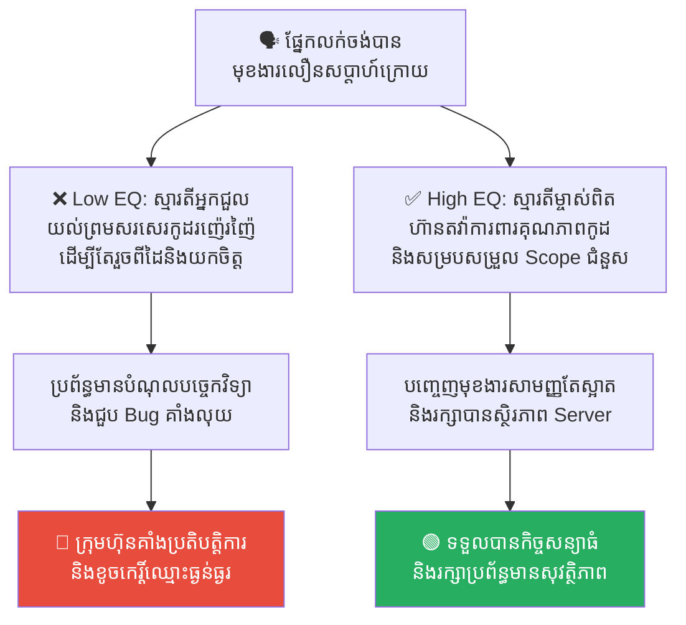
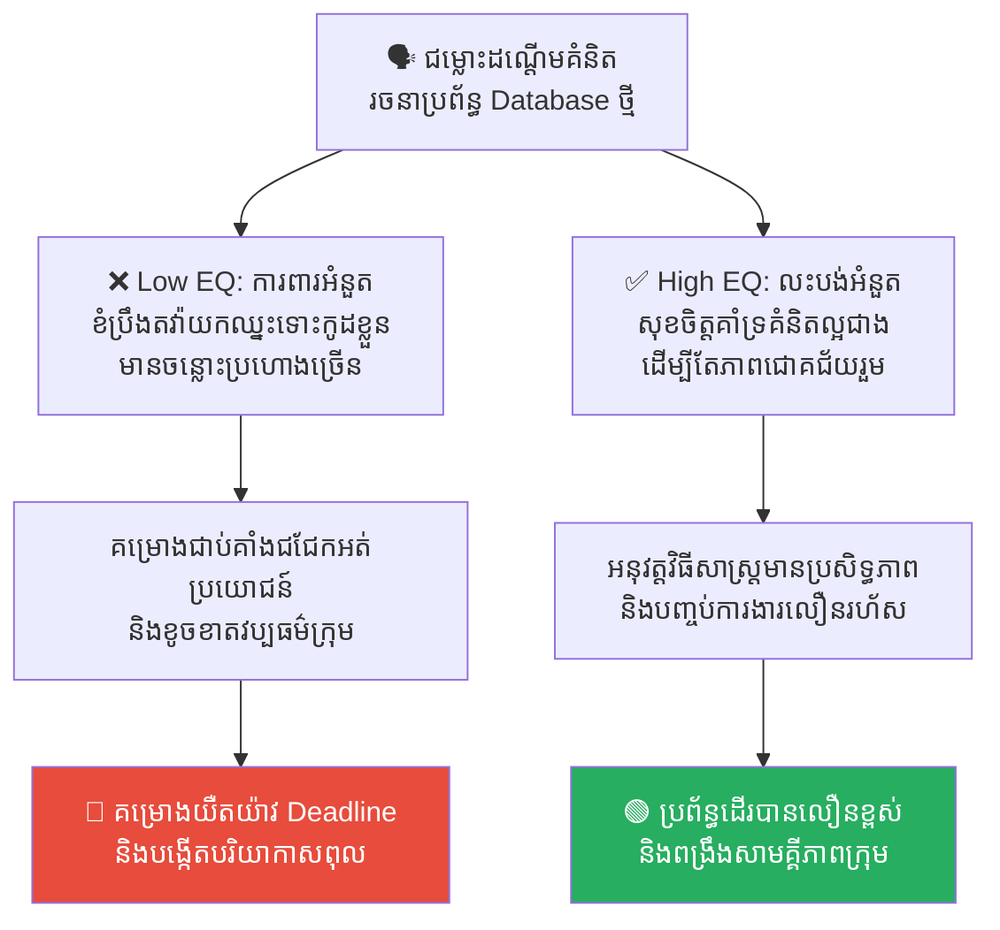
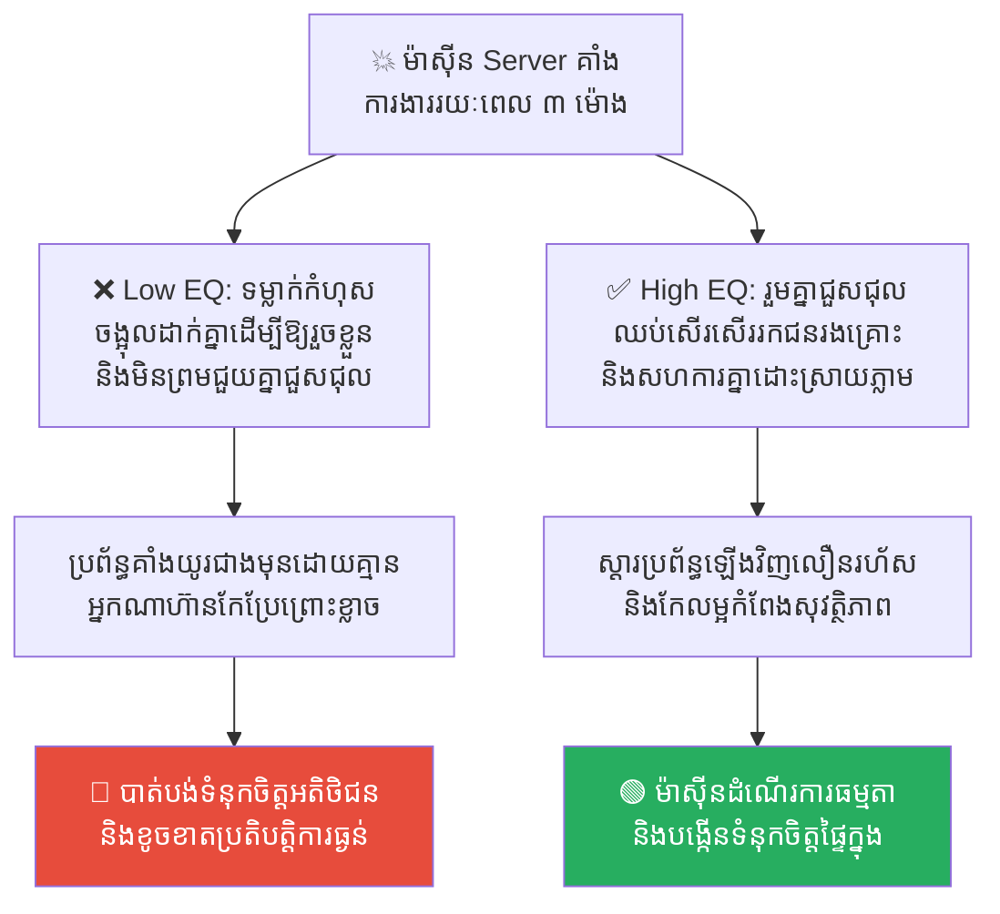
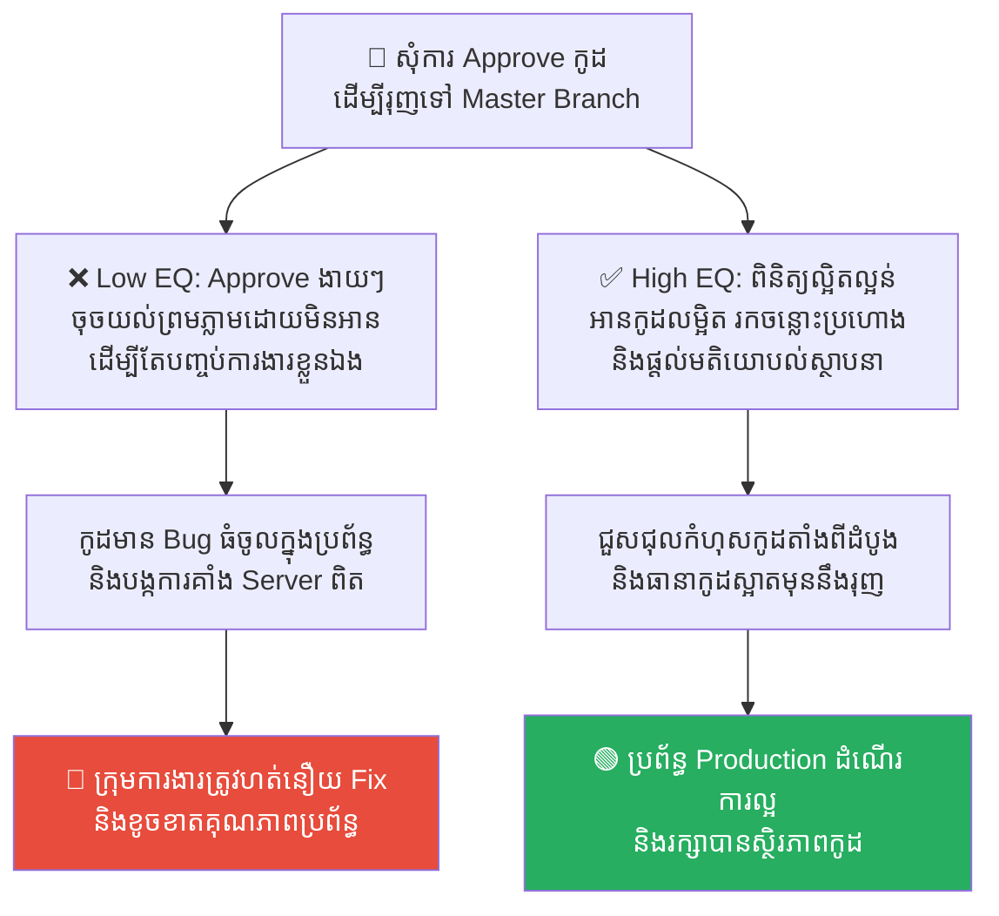
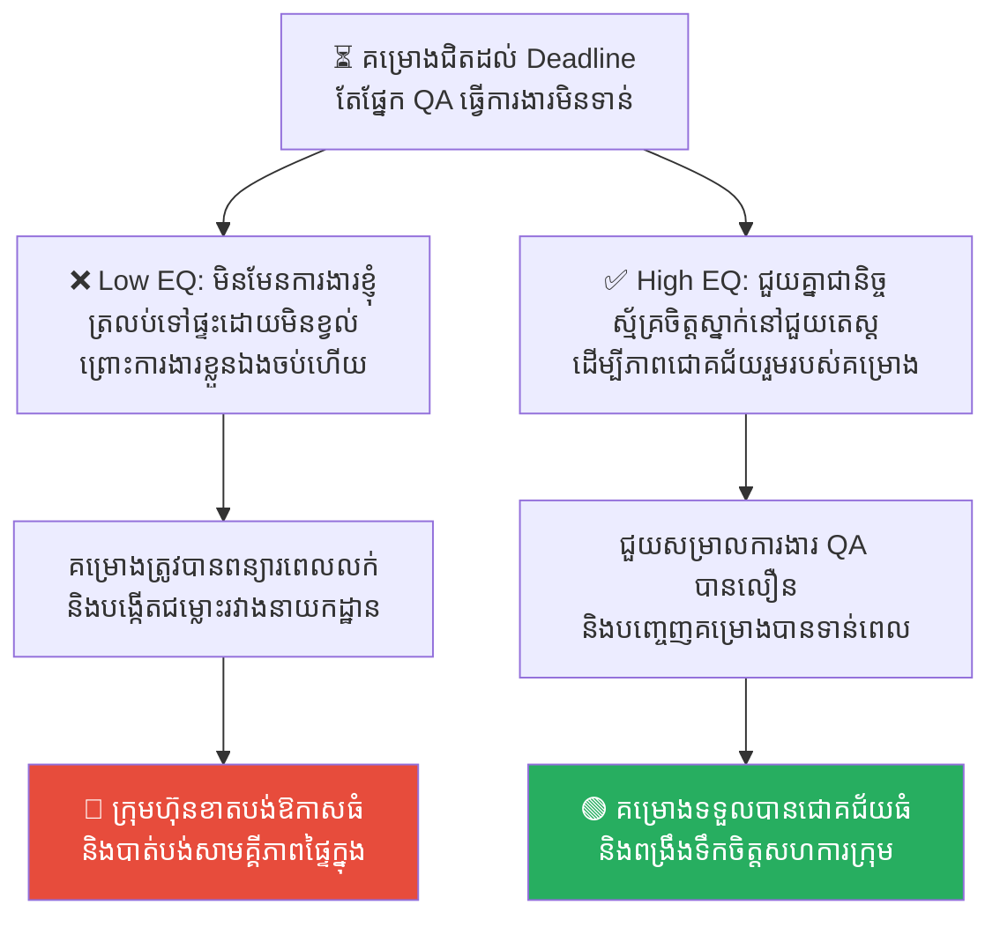

# Solomon's Judgment: The Principle of True Ownership (ការកាត់ក្តីរបស់សាឡូម៉ូន៖ គោលការណ៍នៃភាពជាម្ចាស់ពិតប្រាកដ)

**Author:** ichamrong  
**Date:** 2026-05-17  
**Tags:** #ownership #leadership #solomon #software-architecture #responsibility  
**Category:** Concepts  
**Read Time:** ~15 min  

---

## 📌 មាតិកា (Table of Contents)
- [លំនាំបញ្ហា (The Pattern)](#លំនាំបញ្ហា-the-pattern)
- [១. បញ្ហា៖ តើអ្នកជា «ម្ចាស់ពិត» ឬគ្រាន់តែជា «អ្នកជួល»? (The Issue: Owners vs. Renters)](#១-បញ្ហា-តើអ្នកជា-ម្ចាស់ពិត-ឬគ្រាន់តែជា-អ្នកជួល-the-issue-owners-vs-renters)
- [២. ឧទាហរណ៍ជាក់ស្តែងក្នុងពិភពពិត (Real World Examples)](#២-ឧទាហរណ៍ជាក់ស្តែងក្នុងពិភពពិត)
  - [ឧទាហរណ៍ទី ១ — ល្បឿនលក់ដូរ ទល់នឹងស្ថិរភាពប្រព័ន្ធ (Architectural Integrity vs. Sales Speed)](#ឧទាហរណ៍ទី-១-ល្បឿនលក់ដូរ-ទល់នឹងស្ថិរភាពប្រព័ន្ធ-architectural-integrity-vs-sales-speed)
  - [ឧទាហរណ៍ទី ២ — ការការពារគំនិតផ្ទាល់ខ្លួន និងភាពជោគជ័យគម្រោង (Ego-Driven Arguments vs. Project Success)](#ឧទាហរណ៍ទី-២-ការការពារគំនិតផ្ទាល់ខ្លួន-និងភាពជោគជ័យគម្រោង-ego-driven-arguments-vs-project-success)
  - [ឧទាហរណ៍ទី ៣ — ការទទួលខុសត្រូវពេលប្រព័ន្ធជួបវិបត្តិ (Incident Blame Game vs. Blameless Ownership)](#ឧទាហរណ៍ទី-៣-ការទទួលខុសត្រូវពេលប្រព័ន្ធជួបវិបត្តិ-incident-blame-game-vs-blameless-ownership)
  - [ឧទាហរណ៍ទី ៤ — គុណភាពនៃការពិនិត្យកូដ (Passive Code Approval vs. Thorough Code Reviews)](#ឧទាហរណ៍ទី-៤-គុណភាពនៃការពិនិត្យកូដ-passive-code-approval-vs-thorough-code-reviews)
  - [ឧទាហរណ៍ទី ៥ — ការជួយគ្នារំលងតួនាទីឯកជន (Not My KPI vs. Cross-Functional Collaboration)](#ឧទាហរណ៍ទី-៥-ការជួយគ្នារំលងតួនាទីឯកជន-not-my-kpi-vs-cross-functional-collaboration)
- [៣. កត្តាជម្រុញ៖ វប្បធម៌ស្តីបន្ទោស និងការលើកទឹកចិត្តខុសគោលដៅ (The Aggravator: Blame Culture & Misaligned Incentives)](#៣-កត្តាជម្រុញ-វប្បធម៌ស្តីបន្ទោស-និងការលើកទឹកចិត្តខុសគោលដៅ-the-aggravator-blame-culture-misaligned-incentives)
- [៤. ដំណោះស្រាយទូទៅ៖ របៀបបង្កើត «ម្តាយពិត» នៅក្នុងក្រុមហ៊ុន (The General Solution: Cultivating True Ownership)](#៤-ដំណោះស្រាយទូទៅ-របៀបបង្កើត-ម្តាយពិត-នៅក្នុងក្រុមហ៊ុន-the-general-solution-cultivating-true-ownership)
- [សេចក្តីសន្និដ្ឋាន (Conclusion)](#សេចក្តីសន្និដ្ឋាន-conclusion)
- [Related Posts](#related-posts)

---

## លំនាំបញ្ហា (The Pattern)

នៅក្នុងការគ្រប់គ្រងក្រុមហ៊ុន គម្រោងបច្ចេកវិទ្យា ឬស្ថាប័នណាក៏ដោយ បញ្ហាដ៏ធំបំផុតមួយដែលអ្នកដឹកនាំតែងតែជួបប្រទះគឺ៖ **«ការបែងចែកឱ្យដាច់រវាង បុគ្គលិកដែលធ្វើការងារគ្រាន់តែដើម្បីប្រាក់ខែ (Mercenaries/Renters) និងបុគ្គលិកដែលធ្វើការងារដោយមានស្មារតីជាម្ចាស់ពិតប្រាកដ (True Owners)»**។

ប្រវត្តិសាស្ត្រនៃការកាត់ក្តីដ៏ល្បីល្បាញបំផុតរបស់ស្តេចសាឡូម៉ូន (King Solomon) បានផ្តល់នូវមេរៀនចិត្តសាស្ត្រដ៏អស្ចារ្យ ដើម្បីដោះស្រាយបញ្ហានេះ។

ស្រ្តីពីរនាក់បានមករកស្តេចសាឡូម៉ូន ដើម្បីឱ្យទ្រង់កាត់ក្តីដណ្តើមកូនប្រុសទើបនឹងកើតម្នាក់។ ស្រ្តីម្នាក់និយាយថានេះជាកូនរបស់នាង ចំណែកស្រ្តីម្នាក់ទៀតក៏និយាយថានេះជាកូនរបស់នាងដូចគ្នា។ ដោយសារគ្មានភស្តុតាងជាក់ស្តែង ស្តេចសាឡូម៉ូនបានប្រើល្បិចចិត្តសាស្ត្រ៖

*«ចូរយកដាវមក! កាត់ទារកនេះជាពីរចំណែកទៅ ហើយចែកឱ្យស្រ្តីទាំងពីរនាក់នេះម្នាក់មួយចំហៀងស្មើគ្នា!»*

នៅពេលឮសេចក្តីសម្រេចនោះភ្លាម៖
*   **ម្តាយក្លែងក្លាយ** បាននិយាយយល់ព្រមភ្លាមៗ៖ *«ល្អហើយ! កុំឱ្យខ្ញុំបាន ហើយក៏កុំឱ្យនាងបានដែរ ចូរកាត់ជាពីរទៅ!»* (នាងចង់ឈ្នះជម្លោះ ជាងការខ្វល់ពីជីវិតរបស់ទារក)។
*   **ម្តាយពិតប្រាកដ** ស្រាប់តែយំស្រែក និងសំពះអង្វរ៖ *«សូមទ្រង់កុំសម្លាប់កូនអី! ខ្ញុំសុខចិត្តបោះបង់សិទ្ធិ ហើយប្រគល់កូននេះឱ្យទៅនាងចុះ ឱ្យតែទារកនេះមានជីវិតរស់រានមានជីវិត!»* (នាងសុខចិត្តចុះចាញ់ និងបាត់បង់មុខមាត់ ឱ្យតែកូនរបស់នាងមានសុវត្ថិភាព)។

ស្តេចសាឡូម៉ូនបានដឹងភ្លាមថា ស្រ្តីដែលសុខចិត្តលះបង់ដើម្បីជីវិតទារក គឺជា **«ម្តាយពិតប្រាកដ»** ហើយបានប្រគល់ទារកនោះទៅឱ្យនាងវិញ។

---

## ១. បញ្ហា៖ តើអ្នកជា «ម្ចាស់ពិត» ឬគ្រាន់តែជា «អ្នកជួល»? (The Issue: Owners vs. Renters)

មានពាក្យស្លោកដ៏ល្បីល្បាញមួយនៅក្នុងពិភពធុរកិច្ចចែងថា៖ 

> 💡 **«គ្មាននរណាម្នាក់ ចំណាយលុយផ្ទាល់ខ្លួន ដើម្បីយកឡានជួលទៅលាងសម្អាតឡើយ។»**

*   **អ្នកជួល (Renters/Mercenaries)៖** គឺជានិមិត្តរូបនៃ «ម្តាយក្លែងក្លាយ»។ ពួកគេធ្វើការងារដើម្បីតែប្រាក់ខែ មុខមាត់ ឬដើម្បីឱ្យរួចពីដៃទៅ។ ពួកគេមិនខ្វល់ពីសុខភាពរយៈពេលវែងរបស់គម្រោង ឬប្រព័ន្ធបច្ចេកវិទ្យារបស់ក្រុមហ៊ុនឡើយ។ ឱ្យតែពួកគេឈ្នះការជជែកដេញដោល ឱ្យតែការងាររួចទាន់ពេល (ដើម្បីបាន Bonus) ទោះបីជាត្រូវ «កាត់គម្រោងជាពីរ (បំផ្លាញគុណភាពប្រព័ន្ធ)» ក៏ពួកគេយល់ព្រមដែរ។
*   **ម្ចាស់ពិតប្រាកដ (True Owners)៖** គឺជានិមិត្តរូបនៃ «ម្តាយពិត»។ ពួកគេស្រលាញ់គម្រោង និងប្រព័ន្ធដែលខ្លួនសាងសង់ដូចជាកូនបង្កើត។ ពួកគេសុខចិត្តទទួលរងការរិះគន់ សុខចិត្តចុះចាញ់ការជជែកដេញដោល ឬសុខចិត្តលះបង់ «អំនួតផ្ទាល់ខ្លួន (Ego)» ឱ្យតែគម្រោង និងប្រព័ន្ធរបស់ក្រុមហ៊ុនមានស្ថិរភាព និងភាពជោគជ័យរយៈពេលវែង។

---

## ២. ឧទាហរណ៍ជាក់ស្តែងក្នុងពិភពពិត

សូមពិនិត្យមើល **ឧទាហរណ៍ជាក់ស្តែងចំនួន ៥** បង្ហាញពីរបៀបដែលស្មារតីជាម្ចាស់ពិតប្រាកដការពារគុណភាពការងារ និងវិធីសាស្ត្របង្កើតវា៖

---

### ឧទាហរណ៍ទី ១ — ល្បឿនលក់ដូរ ទល់នឹងស្ថិរភាពប្រព័ន្ធ (Architectural Integrity vs. Sales Speed)

**ស្ថានភាព៖** ប្រធានផ្នែកលក់ (Sales Director) ចង់បានមុខងារថ្មីមួយនៅសប្តាហ៍ក្រោយ ដើម្បីយកទៅបង្ហាញអតិថិជនដណ្តើមយកកិច្ចសន្យាធំ។ វិស្វករដឹងច្បាស់ថា បើសរសេរកូដប្រញាប់បែបនេះ កូដនឹងក្លាយជា Spaghetti (កូដរញ៉េរញ៉ៃ) ហើយប្រព័ន្ធស្នូលអាចនឹងគាំងនៅថ្ងៃអនាគត។

*   **សកម្មភាពអសកម្ម / Low EQ / កំហុសឆ្គង (អ្នកជួល)៖** វិស្វករយល់ព្រមសរសេរកូដរញ៉េរញ៉ៃ (កាត់កូនជាពីរ) ភ្លាមៗដើម្បីសម្របសម្រួលយកចិត្តប្រធានផ្នែកលក់ និងគេចវេសពីការប្រឈមមុខដាក់គ្នា ព្រោះពួកគេគិតថា៖ *«ធ្វើៗឱ្យតែរួចទៅ ខែក្រោយខ្ញុំលាឈប់បាត់ទៅហើយ Server គាំងជាប្រធានបទរបស់ក្រុមហ៊ុន មិនមែនរបស់ខ្ញុំឡើយ!»*
*   **សកម្មភាពស្ថាបនា / High EQ / ដំណោះស្រាយ (ម្ចាស់ពិត)៖** ហ៊ានតវ៉ា និងពន្យល់ហេតុផលបច្ចេកទេសយ៉ាងដាច់អហង្ការ៖ *«យើងមិនអាចកាត់គុណភាពប្រព័ន្ធបែបនេះឡើយ។ ប្រសិនបើយើងត្រូវការល្បឿន យើងត្រូវតែកាត់បន្ថយទំហំមុខងារការងារ (Scope) មកនៅត្រឹមកម្រិតសាមញ្ញសិន តែត្រូវរក្សាទុកនូវគុណភាព និងសុវត្ថិភាពកូដជានិច្ច។»*
*   **លទ្ធផល៖** ស្មារតីអ្នកជួលនាំឱ្យប្រព័ន្ធការងារពោរពេញដោយបំណុលបច្ចេកវិទ្យា (Technical Debt) និងរលំនៅអនាគត។ ស្មារតីជាម្ចាស់ពិតជួយការពារប្រព័ន្ធស្នូលឱ្យមានស្ថិរភាព និងបង្កើតទំនុកចិត្តអតិថិជនរយៈពេលវែង។

---

### ឧទាហរណ៍ទី ២ — ការការពារគំនិតផ្ទាល់ខ្លួន និងភាពជោគជ័យគម្រោង (Ego-Driven Arguments vs. Project Success)

**ស្ថានភាព៖** នៅក្នុងកិច្ចប្រជុំរចនាប្រព័ន្ធ (System Design Review) វិស្វករជាន់ខ្ពស់ពីរនាក់បានឈ្លោះប្រកែកគ្នាដណ្តើមយកវិធីសាស្ត្ររៀបចំ Database ផ្ទាល់ខ្លួន។

*   **សកម្មភាពអសកម្ម / Low EQ / កំហុសឆ្គង (អ្នកជួល)៖** វិស្វករម្នាក់ព្យាយាមតវ៉ា និងវាយប្រហារគំនិតរបស់ដៃគូដើម្បីតែចង់ «ឈ្នះការជជែកដេញដោល និងរក្សាមុខមាត់ខ្លួនឯង (Ego)» ទោះបីជាគាត់ដឹងច្បាស់ថាវិធីសាស្ត្ររបស់គាត់មានគុណវិបត្តិ និងធ្វើឱ្យប្រព័ន្ធដើរយឺតជាងក៏ដោយ (ម្តាយក្លែងក្លាយ សុខចិត្តឱ្យកូនស្លាប់ ឱ្យតែខ្លួនឈ្នះ)។
*   **សកម្មភាពស្ថាបនា / High EQ / ដំណោះស្រាយ (ម្ចាស់ពិត)៖** សុខចិត្តដកថយ លះបង់អំនួតផ្ទាល់ខ្លួនចោលភ្លាមៗ នៅពេលដែលគាត់ឃើញថា វិធីសាស្ត្ររបស់មិត្តរួមការងារមានភាពល្អប្រសើរ និងផ្តល់ផលប្រយោជន៍ខ្ពស់ជាងដល់គម្រោង៖ *«វិធីសាស្ត្ររបស់អ្នកល្អជាង និងមានល្បឿនលឿនជាង ខ្ញុំយល់ព្រមគាំទ្រគំនិតរបស់អ្នកដើម្បីជោគជ័យរបស់ក្រុម។»*
*   **លទ្ធផល៖** ជម្លោះដណ្តើមអំនួតនាំឱ្យគម្រោងអូសបន្លាយពេល យឺតយ៉ាវ និងខូចខាតទំនាក់ទំនងផ្ទៃក្នុង។ ការលះបង់អំនួតដើម្បីជោគជ័យរួម ជួយឱ្យគម្រោងដើរលឿន និងបង្កើតវប្បធម៌ការងារដ៏អស្ចារ្យ។

---

### ឧទាហរណ៍ទី ៣ — ការទទួលខុសត្រូវពេលប្រព័ន្ធជួបវិបត្តិ (Incident Blame Game vs. Blameless Ownership)

**ស្ថានភាព៖** ម៉ាស៊ីន Server ផលិតកម្ម (Production Server) របស់ក្រុមហ៊ុនស្រាប់តែគាំងដំណើរការរយៈពេល ៣ ម៉ោង បណ្តាលឱ្យបាត់បង់ទិន្នន័យប្រតិបត្តិការមួយចំនួន។

*   **សកម្មភាពអសកម្ម / Low EQ / កំហុសឆ្គង (អ្នកជួល)៖** ក្រុមការងារ IT និងក្រុមការងារ Software ចាប់ផ្តើមធ្វើការចោទប្រកាន់ និងទម្លាក់កំហុសដាក់គ្នាទៅវិញទៅមក (Blame Game) ដើម្បីឱ្យរួចខ្លួនរៀងៗខ្លួន៖ *«នេះមិនមែនជាកំហុសកូដរបស់ខ្ញុំទេ គឺមកពីខាង IT មិនចេះរៀបចំ Server!»* ឬ *«មកពីខាង Dev សរសេរកូដធូររលុង!»* (ម្តាយក្លែងក្លាយ មិនខ្វល់ពីការជួសជុល គឺខ្វល់តែពីការរួចខ្លួន)។
*   **សកម្មភាពស្ថាបនា / High EQ / ដំណោះស្រាយ (ម្ចាស់ពិត)៖** ឈប់ចង្អុលបង្ហាញកំហុសបុគ្គល និងសហការគ្នាភ្លាមៗដើម្បីជួសជុលប្រព័ន្ធ (Blameless Incident Response)៖ *«ឥឡូវនេះរឿងសំខាន់គឺការសង្គ្រោះប្រព័ន្ធឱ្យដើរវិញ។ ពួកយើងរួមគ្នាដោះស្រាយការងារនេះ រួចនឹងធ្វើការស៊ើបអង្កេតប្រព័ន្ធការងាររួមគ្នាដើម្បីកុំឱ្យវាកើតឡើងម្តងទៀត។»*
*   **លទ្ធផល៖** ការទម្លាក់កំហុសដាក់គ្នានាំឱ្យប្រព័ន្ធគាំងយូរជាងមុន និងបំផ្លាញទឹកចិត្តការងារក្រុមការងារទាំងស្រុង។ ការរួមគ្នាដោះស្រាយ និងទទួលខុសត្រូវជួយឱ្យប្រព័ន្ធដើរឡើងវិញលឿន និងបង្កើនស្ថិរភាពការងារ។

---

### ឧទាហរណ៍ទី ៤ — គុណភាពនៃការពិនិត្យកូដ (Passive Code Approval vs. Thorough Code Reviews)

**ស្ថានភាព៖** វិស្វករម្នាក់ចង់រុញមុខងារថ្មីមួយទៅកាន់ Branch មេ (Master Branch) ដែលទាមទារឱ្យមានការយល់ព្រម (Approve) ពីសហការីម្នាក់ទៀត។

*   **សកម្មភាពអសកម្ម / Low EQ / កំហុសឆ្គង (អ្នកជួល)៖** សហការីដែលជាអ្នកជួល បានចុចប៊ូតុង «Approve» ភ្លាមៗដោយមិនបានអាន ឬពិនិត្យមើលកូដសូម្បីតែមួយបន្ទាត់ ដើម្បីគ្រាន់តែចង់បញ្ចប់សន្លឹកកិច្ចការងារ (Jira Ticket) របស់ខ្លួនឱ្យបានលឿន និងគ្មានភាពតានតឹង៖ *«កូដនេះមិនមែនជារបស់ខ្ញុំទេ បើមាន Bug គឺគាត់ជាអ្នកទទួលខុសត្រូវ មិនមែនខ្ញុំឡើយ!»*
*   **សកម្មភាពស្ថាបនា / High EQ / ដំណោះស្រាយ (ម្ចាស់ពិត)៖** ធ្វើការពិនិត្យកូដយ៉ាងល្អិតល្អន់ (Thorough Code Review)។ សរសេរមតិយោបល់ស្ថាបនា និងចង្អុលបង្ហាញពីចន្លោះប្រហោងសុវត្ថិភាព ដើម្បីធានាថា រាល់កូដដែលចូលទៅក្នុង Master Branch គឺជាកូដដែលមានគុណភាពខ្ពស់បំផុត ទោះបីជាត្រូវចំណាយពេលបន្ថែម និងធ្វើឱ្យសហការីអាក់អន់ចិត្តបន្តិចក៏ដោយ។
*   **លទ្ធផល៖** ការចុច Approve ងាយៗនាំឱ្យ Master Branch ពោរពេញដោយ Bug និងបង្កការរំខានដល់ប្រព័ន្ធ Production។ ការពិនិត្យកូដយ៉ាងតឹងរ៉ឹងជួយធានាសុវត្ថិភាពប្រព័ន្ធ និងជួយបង្កើនសមត្ថភាពបច្ចេកទេសរបស់ក្រុមការងារទាំងមូល។

---

### ឧទាហរណ៍ទី ៥ — ការជួយគ្នារំលងតួនាទីឯកជន (Not My KPI vs. Cross-Functional Collaboration)

**ស្ថានភាព៖** ក្រុមហ៊ុនកំពុងជិតដល់ថ្ងៃ Deadline បញ្ចេញ App ថ្មី។ ក្រុមការងារ Software បានបញ្ចប់ការងារអស់ហើយ ប៉ុន្តែក្រុមការងារ QA (តេស្តកម្មវិធី) កំពុងតែលិចលង់ និងលើសចំណុះការងារ មិនអាចតេស្តទាន់ពេលវេលាឡើយ។

*   **សកម្មភាពអសកម្ម / Low EQ / កំហុសឆ្គង (អ្នកជួល)៖** វិស្វករ Software ខ្ចប់កាបូបដើរទៅផ្ទះដោយសប្បាយចិត្តនៅម៉ោង ៥ ល្ងាច ព្រោះ៖ *«ការងារសរសេរកូដរបស់ខ្ញុំគឺចប់រួចរាល់ ១០០% ហើយ រឿងតេស្តយឺតយ៉ាវជាកិច្ចការងាររបស់ផ្នែក QA មិនមែនជា KPIs របស់ខ្ញុំឡើយ!»* (ម្តាយក្លែងក្លាយ មិនខ្វល់ពីជីវិតរួម)។
*   **សកម្មភាពស្ថាបនា / High EQ / ដំណោះស្រាយ (ម្ចាស់ពិត)៖** ស្ម័គ្រចិត្តស្នាក់នៅជួយក្រុមការងារ QA ធ្វើការតេស្តសាកល្បងដោយផ្ទាល់ដៃ ឬសរសេរស្វ័យប្រវត្តិតេស្ត (Automation Tests) ជួយសម្រាលការងារ ទោះបីជាវាមិនមែនជាភារកិច្ចចែងក្នុងកិច្ចសន្យាការងាររបស់ខ្លួនក៏ដោយ ព្រោះគោលដៅចុងក្រោយគឺ **«ភាពជោគជ័យរួមរបស់ក្រុមហ៊ុន»**។
*   **លទ្ធផល៖** ស្មារតី «មិនមែនជាការងារខ្ញុំ» នាំឱ្យគម្រោងត្រូវពន្យារពេល និងបង្កើតឱ្យមានKnowledge Silos រវាងនាយកដ្ឋាន។ ស្មារតីជាម្ចាស់រួមជួយឱ្យគម្រោងបញ្ចប់ទាន់ពេលវេលា និងបង្កើតវប្បធម៌សហការគ្នាដ៏រឹងមាំបំផុត។

---

## ៣. កត្តាជម្រុញ៖ វប្បធម៌ស្តីបន្ទោស និងការលើកទឹកចិត្តខុសគោលដៅ (The Aggravator: Blame Culture & Misaligned Incentives)

ហេតុអ្វីបានជាបុគ្គលិកភាគច្រើនជ្រើសរើសធ្វើខ្លួនជា «អ្នកជួល» ជាជាង «ម្ចាស់ពិត»? កត្តាជម្រុញរួមមាន៖

1.  **វប្បធម៌ស្វែងរកអ្នកខុសដើម្បីស្តីបន្ទោស (Blame Culture)៖** ប្រសិនបើក្រុមហ៊ុនមានទម្លាប់ដាក់ទណ្ឌកម្ម ឬស្តីបន្ទោសធ្ងន់ធ្ងររាល់ពេលមានកំហុសបច្ចេកទេស បុគ្គលិកនឹងចាប់ផ្តើមការពារខ្លួនដោយការ «រួចខ្លួនជាមុន» និងមិនហ៊ានទទួលខុសត្រូវអ្វីទាំងអស់ ដែលជាការសម្លាប់ស្មារតីជាម្ចាស់ពិតប្រាកដ។
2.  **ការវាយតម្លៃលទ្ធផលការងារផ្អែកលើបុគ្គលហួសហេតុ (Siloed Incentives)៖** ការផ្តល់រង្វាន់ ឬវាស់ស្ទង់សមត្ថភាព (KPIs) តែលើលទ្ធផលឯកជន ដោយមិនខ្វល់ពីលទ្ធផលក្រុម ធ្វើឱ្យបុគ្គលិកគិតតែពីផលប្រយោជន៍ផ្ទាល់ខ្លួន និងបោះបង់ចោលការជួយគ្នាទៅវិញទៅមក។
3.  **កង្វះអំណាចក្នុងការសម្រេចចិត្ត (Lack of Autonomy)៖** ប្រសិនបើបុគ្គលិកគ្រាន់តែជាអ្នកធ្វើតាមបញ្ជារបស់មេដឹកនាំដោយគ្មានសិទ្ធិបញ្ចេញមតិ ឬកែប្រែអ្វីឡើយ ពួកគេនឹងមានអារម្មណ៍ថាខ្លួនគ្រាន់តែជា «ម៉ាស៊ីនស៊ីឈ្នួល» និងលែងខ្វល់ពីគុណភាពរយៈពេលវែងរបស់ក្រុមហ៊ុន។

---

## ៤. ដំណោះស្រាយទូទៅ៖ របៀបបង្កើត «ម្តាយពិត» នៅក្នុងក្រុមហ៊ុន (The General Solution: Cultivating True Ownership)

ដើម្បីបង្កើត និងបណ្តុះបណ្តាលបុគ្គលិកឱ្យមានស្មារតីជាម្ចាស់ពិតប្រាកដ ចូរអនុវត្តគោលការណ៍សំខាន់ៗ ៣ យ៉ាង៖

1.  **លុបបំបាត់វប្បធម៌ស្តីបន្ទោស (Establish Blameless Culture)៖** នៅពេលមានកំហុស ឬប្រព័ន្ធគាំង មិនត្រូវសួររក៖ *«តើនរណាជាអ្នកធ្វើឱ្យខូច?»* ត្រូវសួររក៖ *«តើប្រព័ន្ធការងារយើងមានចន្លោះប្រហោងត្រង់ណា? តើពួកយើងរួមគ្នាការពារដោយរបៀបណា?»* ការលុបភាពភ័យខ្លាច ជួយឱ្យមនុស្សហ៊ានទទួលខុសត្រូវ និងហ៊ានបង្កើតថ្មី។
2.  **ផ្តល់សិទ្ធិសម្រេចចិត្ត និងស្វ័យភាពការងារ (Empowerment & Autonomy)៖** ផ្តល់អំណាច និងសិទ្ធិសម្រេចចិត្តដល់ក្រុមការងារលើការជ្រើសរើសបច្ចេកវិទ្យា និងរបៀបសរសេរកកូដ។ កាលណាពួកគេមានសិទ្ធិកសាង ពួកគេនឹងមានអារម្មណ៍ថាខ្លួនជា «ម្ចាស់នៃកូដនោះ» និងខិតខំការពារគុណភាពរបស់វាដោយផ្ទាល់ដៃ។
3.  **វាស់ស្ទង់លទ្ធផលផ្អែកលើភាពជោគជ័យរួម (Align Incentives with Shared Goals)៖** កែសម្រួលប្រព័ន្ធរង្វាន់ និង KPIs ឱ្យមានការពាក់ព័ន្ធនឹង «ភាពជោគជ័យរបស់គម្រោង ឬផលិតផលរួម» មិនមែនវាស់តែសន្លឹកកិច្ចការងារបុគ្គលឡើយ ដើម្បីជម្រុញឱ្យមានការសហការគ្នា និងការជួយគ្នាទៅវិញទៅមកជុំទិស។

---

## សេចក្តីសន្និដ្ឋាន (Conclusion)

**ការកាត់ក្តីរបស់ស្តេចសាឡូម៉ូន (Solomon's Judgment)** បង្រៀនយើងថា ភាពជាម្ចាស់ពិតប្រាកដ (True Ownership) មិនអាចក្លែងបន្លំបានឡើយ។ វាកើតឡើងចេញពីក្តីស្រលាញ់ ភាពស្មោះត្រង់ និងការហ៊ានលះបង់អំនួតផ្ទាល់ខ្លួនដើម្បីបុព្វហេតុរួម។ នៅក្នុងស្ថាប័នការងារទំនើប ក្រុមហ៊ុនដែលទទួលបានជោគជ័យខ្លាំង និងមានស្ថិរភាពយូរអង្វែង គឺក្រុមហ៊ុនដែល **«ឈប់ជួលតែអ្នកស៊ីឈ្នួលធ្វើការងារ តែជាអ្នកកសាងបរិយាកាសការងារដែលបណ្តុះបណ្តាល និងបង្កើតមនុស្សគ្រប់គ្នាឱ្យក្លាយជាម្ចាស់ពិតប្រាកដនៃគម្រោង»**។

ចូរចងចាំថា៖ **«ម្តាយពិតប្រាកដ ហ៊ានចុះចាញ់ការជជែកដើម្បីឱ្យកូនរបស់នាងមានជីវិតរស់រាន។»**

---

## Related Posts

*   **[37 King Solomon and the Divided Child](../parables/37-king-solomon-and-the-divided-child.md)** — រឿងប្រៀបធៀបប្រវត្តិសាស្ត្រនៃការកាត់ក្តីដ៏ល្បីល្បាញរបស់ស្តេចសាឡូម៉ូន។
*   **[22 Sunk Cost Fallacy: The Trap of Past Investments](./22-sunk-cost-fallacy.md)** — របៀបដែលម្ចាស់ពិតប្រាកដហ៊ានបោះបង់កូដចាស់ៗរបស់ខ្លួនចោល ដើម្បីសង្គ្រោះគម្រោងអនាគត។

---

*Last updated: 2026-05-26*
