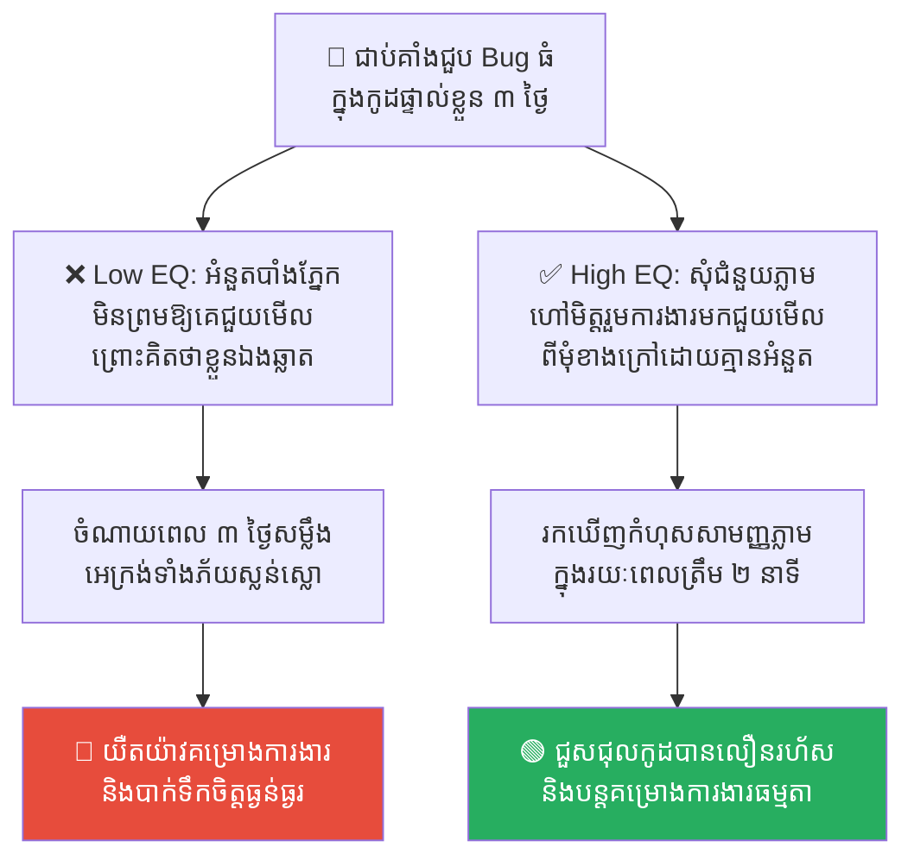
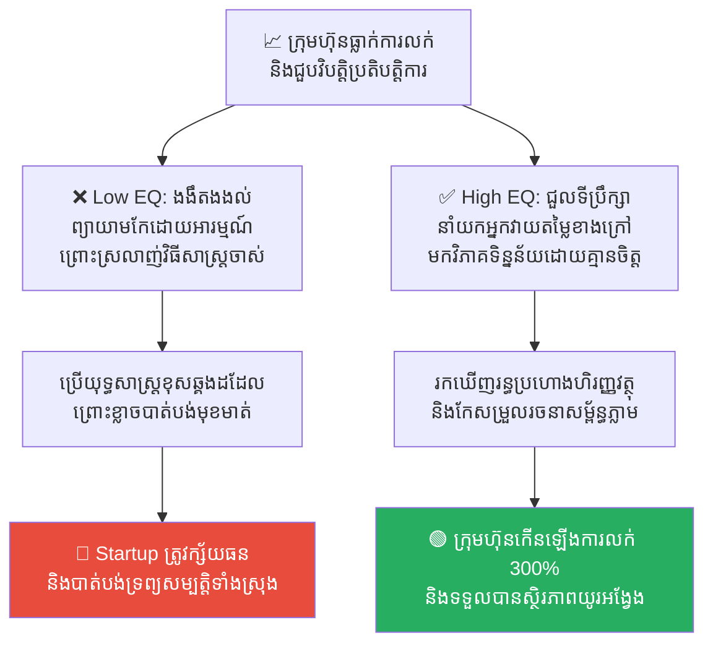
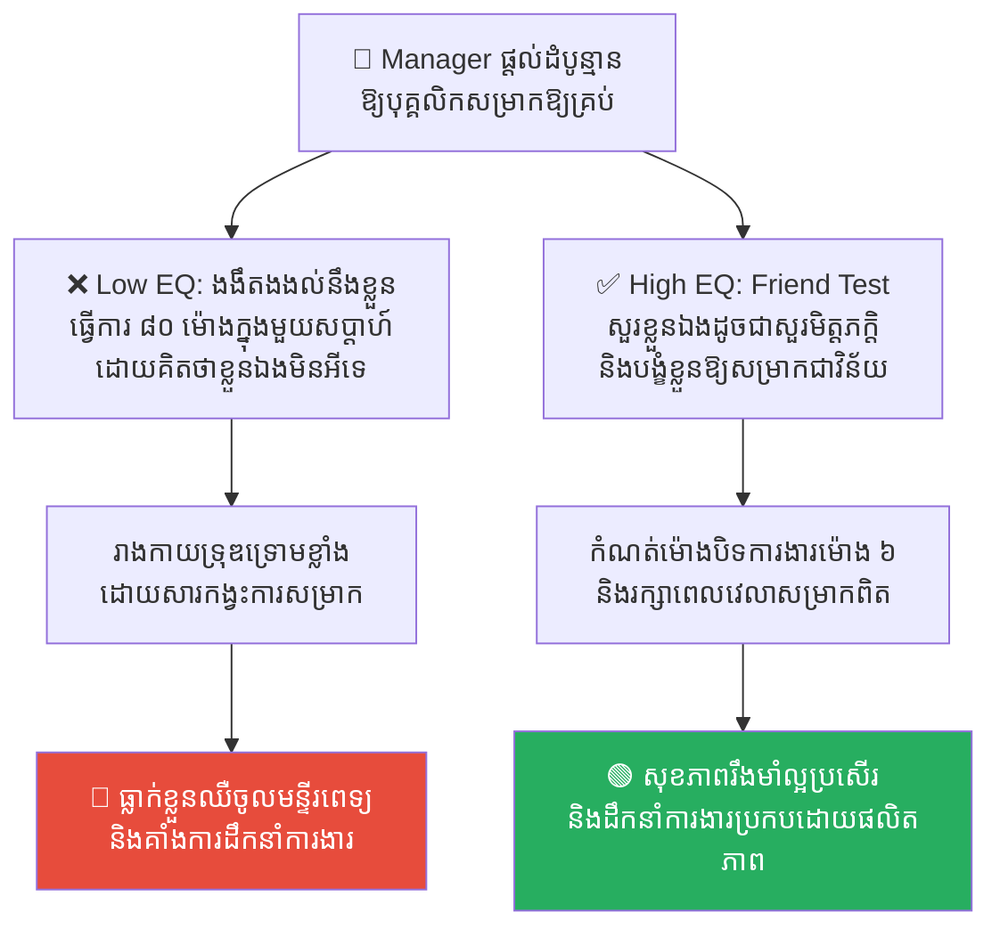
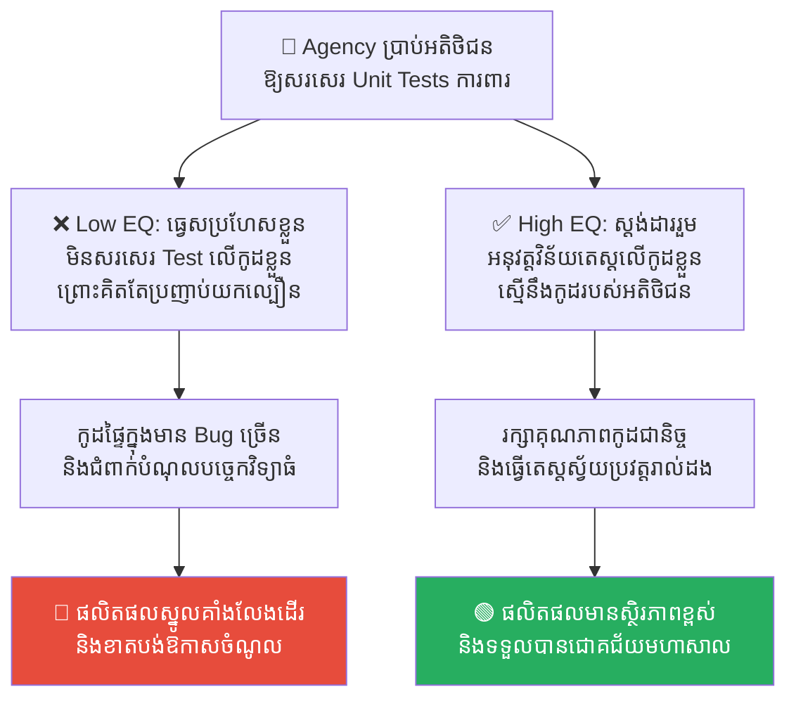
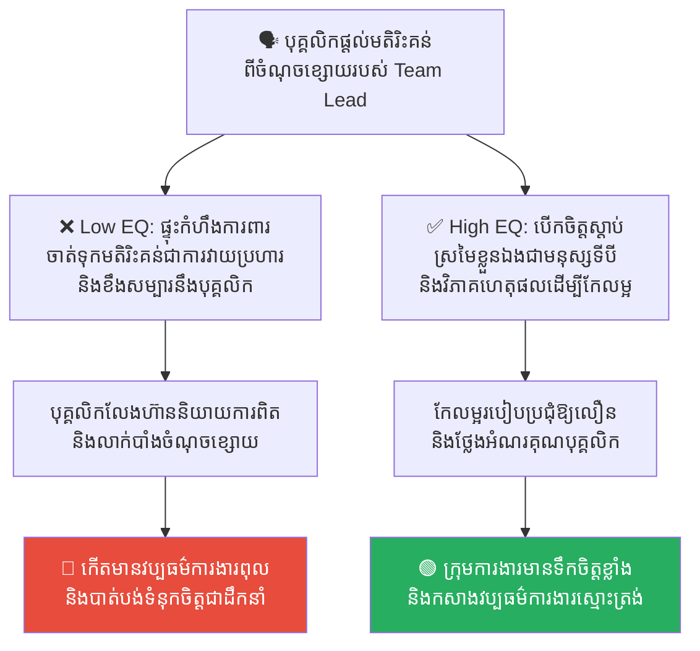

# Solomon's Paradox: Why We Cannot Help Ourselves (បដិវាទកម្មសាឡូម៉ូន៖ ភាពឆ្លាតវៃក្នុងការជួយអ្នកដទៃ តែងងឹតងងល់នឹងខ្លួនឯង)

**Author:** ichamrong  
**Date:** 2026-05-17  
**Tags:** #solomons-paradox #psychology #decision-making #blind-spots #consulting  
**Category:** Concepts  
**Read Time:** ~15 min  

---

## 📌 មាតិកា (Table of Contents)
- [លំនាំបញ្ហា (The Pattern)](#លំនាំបញ្ហា-the-pattern)
- [១. បញ្ហា៖ តើអ្វីទៅជាបដិវាទកម្មសាឡូម៉ូន? (The Issue: What is Solomon's Paradox?)](#១-បញ្ហា-តើអ្វីទៅជាបដិវាទកម្មសាឡូម៉ូន-the-issue-what-is-solomons-paradox)
- [២. ឧទាហរណ៍ជាក់ស្តែងក្នុងពិភពពិត (Real World Examples)](#២-ឧទាហរណ៍ជាក់ស្តែងក្នុងពិភពពិត)
  - [ឧទាហរណ៍ទី ១ — ការពិនិត្យកូដរបស់មិត្តរួមការងារ និងកំហុសកូដរបស់ខ្លួនឯង (Code Review Objectivity vs. Self Blind Spot)](#ឧទាហរណ៍ទី-១-ការពិនិត្យកូដរបស់មិត្តរួមការងារ-និងកំហុសកូដរបស់ខ្លួនឯង-code-review-objectivity-vs-self-blind-spot)
  - [ឧទាហរណ៍ទី ២ — តម្លៃនៃទីប្រឹក្សាអាជីវកម្មខាងក្រៅ (The Value of External Business Consultants)](#ឧទាហរណ៍ទី-២-តម្លៃនៃទីប្រឹក្សាអាជីវកម្មខាងក្រៅ-the-value-of-external-business-consultants)
  - [ឧទាហរណ៍ទី ៣ — ដំបូន្មានគ្រប់គ្រងពេលវេលាការងារ (Work-Life Balance Advice vs. Self Burnout)](#ឧទាហរណ៍ទី-៣-ដំបូន្មានគ្រប់គ្រងពេលវេលាការងារ-work-life-balance-advice-vs-self-burnout)
  - [ឧទាហរណ៍ទី ៤ — ការវាយតម្លៃបំណុលបច្ចេកវិទ្យារបស់អតិថិជន និងប្រព័ន្ធខ្លួនឯង (Advising Clients vs. Ignoring Own Tech Debt)](#ឧទាហរណ៍ទី-៤-ការវាយតម្លៃបំណុលបច្ចេកវិទ្យារបស់អតិថិជន-និងប្រព័ន្ធខ្លួនឯង-advising-clients-vs-ignoring-own-tech-debt)
  - [ឧទាហរណ៍ទី ៥ — ការសម្រុះសម្រួលជម្លោះអ្នកដទៃ និងការទទួលយកមតិរិះគន់ផ្ទាល់ខ្លួន (Mediating Peer Disputes vs. Defensive Ego)](#ឧទាហរណ៍ទី-៥-ការសម្រុះសម្រួលជម្លោះអ្នកដទៃ-និងការទទួលយកមតិរិះគន់ផ្ទាល់ខ្លួន-mediating-peer-disputes-vs-defensive-ego)
- [៣. កត្តាជម្រុញ៖ គម្លាតផ្លូវចិត្ត និងអំនួតបាំងភ្នែក (The Aggravator: Psychological Distance & Ego Blindness)](#៣-កត្តាជម្រុញ-គម្លាតផ្លូវចិត្ត-និងអំនួតបាំងភ្នែក-the-aggravator-psychological-distance-ego-blindness)
- [៤. ដំណោះស្រាយទូទៅ៖ របៀបដោះស្រាយបដិវាទកម្មសាឡូម៉ូន (The General Solution: Overcoming Solomon's Paradox)](#៤-ដំណោះស្រាយទូទៅ-របៀបដោះស្រាយបដិវាទកម្មសាឡូម៉ូន-the-general-solution-overcoming-solomons-paradox)
- [សេចក្តីសន្និដ្ឋាន (Conclusion)](#សេចក្តីសន្និដ្ឋាន-conclusion)
- [Related Posts](#related-posts)

---

## លំនាំបញ្ហា (The Pattern)

តើអ្នកធ្លាប់ឆ្ងល់ទេ ហេតុអ្វីបានជានៅពេលដែលមិត្តភក្តិ ឬសហការីរបស់អ្នកជួបវិបត្តិការងារ ឬបញ្ហាជីវិត អ្នកអាចផ្តល់ដំបូន្មាន និងដំណោះស្រាយឱ្យពួកគេបានយ៉ាងល្អឥតខ្ចោះ ហាក់ដូចជាទស្សនវិទូដ៏ឆ្លាតវៃ? 

ប៉ុន្តែ ផ្ទុយទៅវិញ នៅពេលដែលខ្លួនអ្នកផ្ទាល់ជួបប្រទះនឹងបញ្ហាស្រដៀងគ្នានេះបេះបិទ អ្នកបែរជាគិតអ្វីលែងចេញ ធ្វើការសម្រេចចិត្តខុសឆ្គងទាំងស្រុង និងធ្វើឱ្យជីវិតខ្លួនឯងកាន់តែរញ៉េរញ៉ៃទៅវិញ?

នៅក្នុងវិទ្យាសាស្ត្រចិត្តសាស្ត្រ បាតុភូតនេះត្រូវបានគេដាក់ឈ្មោះតាមស្តេចដ៏ល្បីល្បាញបំផុតក្នុងប្រវត្តិសាស្ត្រថា៖ **Solomon's Paradox (បដិវាទកម្មសាឡូម៉ូន)**។

ស្តេចសាឡូម៉ូន ត្រូវបានគេកត់ត្រាក្នុងប្រវត្តិសាស្ត្រថាជាមនុស្សដែលមានប្រាជ្ញាឈ្លាសវៃបំផុតនៅលើលោក។ មេដឹកនាំមកពីគ្រប់ទិសទីតែងតែធ្វើដំណើររាប់ពាន់គីឡូម៉ែត្រ មកទីក្រុងយេរូសាឡឹម ដើម្បីសុំដំបូន្មានកាត់ក្តីពីទ្រង់។ ទ្រង់អាចដោះស្រាយបញ្ហារបស់អ្នកដទៃបានយ៉ាងយុត្តិធម៌ និងអស្ចារ្យបំផុត។

ប៉ុន្តែ ជីវិតផ្ទាល់ខ្លួនរបស់ស្តេចសាឡូម៉ូន គឺពោរពេញដោយការសម្រេចចិត្តខុសឆ្គងដ៏ធ្ងន់ធ្ងរ។ ទ្រង់ប្រមូលផ្តុំទ្រព្យសម្បត្តិដោយលោភលន់ មានប្រពន្ធរាប់រយនាក់ដែលនាំឱ្យមានជម្លោះសាសនា និងនយោបាយផ្ទៃក្នុង ហើយទីបំផុត ការដឹកនាំដ៏ខ្វះការគិតគូរវែងឆ្ងាយចំពោះអាណាចក្រខ្លួនឯង បានធ្វើឱ្យអាណាចក្ររបស់ទ្រង់ត្រូវបែកបាក់គ្នាក្រោយពេលទ្រង់សុគត។

បដិវាទកម្មសាឡូម៉ូន បង្រៀនយើងថា៖ **«មនុស្សយើងមានសមត្ថភាពគិតបានយ៉ាងច្បាស់លាស់ និងមានហេតុផលនៅពេលដោះស្រាយបញ្ហារបស់អ្នកដទៃ ប៉ុន្តែយើងមានភាពងងឹតងងល់ និងល្ងង់ខ្លៅបំផុតនៅពេលដោះស្រាយបញ្ហារបស់ខ្លួនឯង»**។

---

## ១. បញ្ហា៖ តើអ្វីទៅជាបដិវាទកម្មសាឡូម៉ូន? (The Issue: What is Solomon's Paradox?)

បដិវាទកម្មសាឡូម៉ូន កើតឡើងដោយសារតែវត្តមាន ឬអវត្តមាននៃ **«គម្លាតផ្លូវចិត្ត (Psychological Distance)»**៖

*   **នៅពេលយើងជួយដោះស្រាយបញ្ហាអ្នកដទៃ៖** យើងឈរនៅខាងក្រៅបញ្ហា។ យើងគ្មាន «អារម្មណ៍ភ័យខ្លាច ការស្តាយស្រណោះ ឬអំនួតផ្ទាល់ខ្លួន (Ego)» ជាប់ពាក់ព័ន្ធនៅក្នុងនោះឡើយ។ គម្លាតផ្លូវចិត្តនេះ អនុញ្ញាតឱ្យខួរក្បាលរបស់យើងមើលឃើញបញ្ហាជារូបភាពធំ និងវាយតម្លៃដោយប្រើហេតុផលសុទ្ធសាធ (System 2 Thinking)។
*   **នៅពេលយើងដោះស្រាយបញ្ហាខ្លួនឯង៖** យើងឈរនៅចំកណ្តាលព្យុះ។ អារម្មណ៍ស្ត្រេស ភាពខ្មាសអៀន និងអំនួតផ្ទាល់ខ្លួន បានចូលមកបាំងភ្នែករបស់យើងទាំងស្រុង (**Blind Spots**)។ យើងផ្តោតខ្លាំងពេកទៅលើព័ត៌មានលម្អិតតូចតាចដែលគ្មានប្រយោជន៍ និងធ្វើការសម្រេចចិត្តដោយក្តីភ័យខ្លាច (System 1 Thinking)។

```
👁️ បញ្ហាអ្នកដទៃ ──► 📏 មានគម្លាតផ្លូវចិត្ត ──► 🧠 គិតវិភាគហេតុផល (System 2) ──► 🟢 សម្រេចចិត្តត្រឹមត្រូវ
👁️ បញ្ហាខ្លួនឯង ──► ❌ គ្មានគម្លាតផ្លូវចិត្ត ──► 💥 អារម្មណ៍និងអំនួតបាំងភ្នែក (System 1) ──► 🔴 សម្រេចចិត្តខុសឆ្គង
```

នៅក្នុងវិស័យបច្ចេកវិទ្យា និងអាជីវកម្ម បដិវាទកម្មនេះបង្កផលប៉ះពាល់ដល់ការវាយតម្លៃគុណភាពកូដ ការរៀបចំយុទ្ធសាស្ត្រក្រុមហ៊ុន និងវប្បធម៌ការងារជារៀងរាល់ថ្ងៃ។

---

## ២. ឧទាហរណ៍ជាក់ស្តែងក្នុងពិភពពិត

សូមពិនិត្យមើល **ឧទាហរណ៍ជាក់ស្តែងចំនួន ៥** បង្ហាញពីរបៀបដែលបដិវាទកម្មសាឡូម៉ូនបោកប្រាស់យើង និងវិធីសាស្ត្រដោះស្រាយ៖

---

### ឧទាហរណ៍ទី ១ — ការពិនិត្យកូដរបស់មិត្តរួមការងារ និងកំហុសកូដរបស់ខ្លួនឯង (Code Review Objectivity vs. Self Blind Spot)

**ស្ថានភាព៖** វិស្វករជាន់ខ្ពស់ (Senior Engineer) ម្នាក់ឈ្មោះ ធារ៉ា។ ធារ៉ា ពូកែខ្លាំងណាស់ក្នុងការពិនិត្យកូដ (Code Review) របស់វិស្វករដទៃ។ គាត់អាចចំណាយពេលត្រឹម ៥ នាទី ដើម្បីមើលធ្លុះ និងចង្អុលប្រាប់ពីចន្លោះប្រហោងសុវត្ថិភាព ឬកំហុស Syntax ក្នុងកូដរបស់គេបានយ៉ាងលម្អិត។

*   **សកម្មភាពអសកម្ម / Low EQ / កំហុសឆ្គង៖** នៅពេល ធារ៉ា សរសេរកូដដោយផ្ទាល់ខ្លួន គាត់ជួប Bug ធំមួយដែលធ្វើឱ្យកូដរបស់គាត់ដើរមិនកើត។ គាត់បានចំណាយពេល ៣ ថ្ងៃ សម្លឹងមើលអេក្រង់កុំព្យូទ័រទាំងស្ត្រេស និងភ័យស្លន់ស្លោ ដោយមិនដឹងថាកូដខ្លួនឯងខុសត្រង់ណាឡើយ ព្រោះអារម្មណ៍ជឿជាក់លើខ្លួនឯងពេក (Ego) បានបិទបាំងភ្នែករបស់គាត់មិនឱ្យឃើញកំហុសសាមញ្ញមួយ។
*   **សកម្មភាពស្ថាបនា / High EQ / ដំណោះស្រាយ៖** អនុវត្ត **Peer Review for Self & Decoupling**។ ធារ៉ា លះបង់អំនួតចោល រួចហៅវិស្វករម្នាក់ទៀតមកជួយមើលកូដរបស់គាត់៖ *«ខ្ញុំជាប់គាំងកន្លែងនេះ ៣ ថ្ងៃហើយ ចូរសាកល្បងជួយមើលវាពីមុំខាងក្រៅបន្តិចចុះ។»*
*   **លទ្ធផល៖** ការប្រកាន់អំនួតមិនព្រមឱ្យគេជួយនាំឱ្យខាតបង់ពេលវេលា ៣ ថ្ងៃឥតប្រយោជន៍។ ការហៅមិត្តរួមការងារមកជួយមើល ជួយឱ្យរកឃើញកំហុសបច្ចេកទេសបានភ្លាមៗក្នុងរយៈពេលត្រឹមតែ ២ នាទី។



---

### ឧទាហរណ៍ទី ២ — តម្លៃនៃទីប្រឹក្សាអាជីវកម្មខាងក្រៅ (The Value of External Business Consultants)

**ស្ថានភាព៖** ស្ថាបនិកក្រុមហ៊ុន Startup ម្នាក់ មានការស្រលាញ់ និងខិតខំកសាងក្រុមហ៊ុនរបស់ខ្លួនយ៉ាងខ្លាំងអស់រយៈពេល ៣ ឆ្នាំ។ ឥឡូវនេះ ក្រុមហ៊ុនកំពុងធ្លាក់ចុះការលក់ដូរ និងជួបវិបត្តិប្រតិបត្តិការ។

*   **សកម្មភាពអសកម្ម / Low EQ / កំហុសឆ្គង៖** ស្ថាបនិកងងឹតងងល់ដោយសារក្តីស្រលាញ់ និងមនោសញ្ចេតនាជ្រាលជ្រៅជាមួយក្រុមហ៊ុនខ្លួនឯង។ គាត់មិនព្រមផ្លាស់ប្តូររបៀបធ្វើការងារចាស់ៗឡើយ និងព្យាយាមដោះស្រាយបញ្ហាដដែលៗ ព្រោះបារម្ភពី «កេរ្តិ៍ឈ្មោះ» និង «របស់ដែលខ្លួនបានសាងសង់មក»។
*   **សកម្មភាពស្ថាបនា / High EQ / ដំណោះស្រាយ៖** យល់ព្រមចំណាយថវិកាជួល **ក្រុមហ៊ុនទីប្រឹក្សាខាងក្រៅ (External Business Consultant)** ដើម្បីមកធ្វើការត្រួតពិនិត្យ និងវាយតម្លៃក្រុមហ៊ុនរបស់ខ្លួនពីមុំខាងក្រៅ ព្រោះដឹងច្បាស់ថាពួកគេគ្មានមនោសញ្ចេតនា និងមាន «គម្លាតផ្លូវចិត្ត» ដែលអាចមើលឃើញចំណុចខ្សោយពិតប្រាកដរបស់ក្រុមហ៊ុនបានច្បាស់បំផុត។
*   **លទ្ធផល៖** ការព្យាយាមដោះស្រាយបញ្ហាដោយងងឹតងងល់នាំឱ្យ Startup ត្រូវក្ស័យធនជាស្ថាពរ។ ការស្តាប់ដំបូន្មានរបស់ទីប្រឹក្សាខាងក្រៅ ជួយឱ្យរកឃើញច្រកចរន្តហិរញ្ញវត្ថុដែលខូចខាត និងជួយសង្គ្រោះក្រុមហ៊ុនឱ្យមានការរីកចម្រើនឡើងវិញ ៣០០%។



---

### ឧទាហរណ៍ទី ៣ — ដំបូន្មានគ្រប់គ្រងពេលវេលាការងារ (Work-Life Balance Advice vs. Self Burnout)

**ស្ថានភាព៖** Manager ជាន់ខ្ពស់ម្នាក់ តែងតែផ្តល់ដំបូន្មានដ៏អស្ចារ្យទៅកាន់បុគ្គលិកក្រោមបង្គាប់៖ *«ពួកអ្នកមិនត្រូវធ្វើការងារហួសកម្លាំងឡើយ។ ត្រូវបែងចែកពេលវេលាសម្រាកឱ្យបានល្អ គេងឱ្យគ្រប់គ្រាន់ និងចំណាយពេលជាមួយគ្រួសារ ដើម្បីកុំឱ្យធ្លាក់ក្នុងភាពស្ត្រេស (Burnout)។»*

*   **សកម្មភាពអសកម្ម / Low EQ / កំហុសឆ្គង៖** សម្រាប់ខ្លួនឯងផ្ទាល់ Manager នោះធ្វើការងារ ៨០ ម៉ោងក្នុងមួយសប្តាហ៍ អង្គុយឆ្លើយអ៊ីមែលការងាររហូតដល់ម៉ោង ២ យប់ជារៀងរាល់ថ្ងៃ និងគ្មានពេលវេលាសម្រាកសូម្បីតែថ្ងៃអាទិត្យ។ គាត់គិតថា៖ *«ខ្ញុំជាមេដឹកនាំ ខ្ញុំត្រូវតែធ្វើបែបហ្នឹង ខ្ញុំមិនអាចសម្រាកបានឡើយ!»* ទីបំផុត គាត់ធ្លាក់ខ្លួនឈឺធ្ងន់ និងត្រូវចូលសម្រាកព្យាបាលនៅមន្ទីរពេទ្យរយៈពេលមួយខែ។
*   **សកម្មភាពស្ថាបនា / High EQ / ដំណោះស្រាយ៖** អនុវត្ត **The Friend Test** លើខ្លួនឯង។ សួរខ្លួនឯងថា៖ *«ប្រសិនបើសហការីល្អបំផុតរបស់ខ្ញុំ ធ្វើការងារ ៨០ ម៉ោងក្នុងមួយសប្តាហ៍ និងមិនសូវគេងដូចខ្ញុំ តើខ្ញុំនឹងប្រាប់គេឱ្យធ្វើអ្វី?»* រួចត្រូវបង្ខំខ្លួនឯងឱ្យអនុវត្តតាមដំបូន្មាននោះភ្លាមៗ។
*   **លទ្ធផល៖** ការមិនខ្វល់ពីសុខភាពខ្លួនឯងនាំឱ្យរាងកាយទ្រុឌទ្រោម និងគាំងប្រតិបត្តិការដឹកនាំការងារ។ ការគោរពវិន័យសម្រាកផ្ទាល់ខ្លួនជួយឱ្យមានថាមពលដឹកនាំការងារបានយ៉ាងល្អ និងយូរអង្វែង។



---

### ឧទាហរណ៍ទី ៤ — ការវាយតម្លៃបំណុលបច្ចេកវិទ្យារបស់អតិថិជន និងប្រព័ន្ធខ្លួនឯង (Advising Clients vs. Ignoring Own Tech Debt)

**ស្ថានភាព៖** Software Agency មួយ តែងតែផ្តល់ប្រឹក្សាដល់អតិថិជនយ៉ាងឆ្លាតវៃ៖ *«អ្នកត្រូវតែសរសេរ Unit Tests ឱ្យបាន ៨០% នៃកូដ និងឧស្សាហ៍ធ្វើ Refactoring កូដចាស់ៗចោល ដើម្បីកុំឱ្យប្រព័ន្ធមានបំណុលបច្ចេកវិទ្យា (Technical Debt)។»*

*   **សកម្មភាពអសកម្ម / Low EQ / កំហុសឆ្គង៖** សម្រាប់គម្រោងផ្ទៃក្នុង (Internal Products) របស់ Agency ផ្ទាល់ខ្លួនវិញ ពួកគេមិនដែលសរសេរ Unit Tests សូម្បីតែមួយបន្ទាត់ឡើយ និងសរសេរកូដរញ៉េរញ៉ៃឡើងគោក ព្រោះពួកគេគិតថា៖ *«ពួកយើងគ្មានពេលទេ ត្រូវតែប្រញាប់ប្រញាល់បញ្ចេញមុខងារថ្មីសិន!»* យូរៗទៅ ប្រព័ន្ធរបស់ពួកគេគាំង និងមាន Bug ច្រើនខ្លាំងរហូតដល់លែងអាចអភិវឌ្ឍន៍មុខងារថ្មីបន្តបាន។
*   **សកម្មភាពស្ថាបនា / High EQ / ដំណោះស្រាយ៖** អនុវត្ត **Objective Standard Audit**។ វាយតម្លៃប្រព័ន្ធរបស់ខ្លួនឯងដោយប្រើប្រាស់ «ស្តង់ដារវាស់ស្ទង់ដូចគ្នាទៅនឹងស្តង់ដារដែលប្រើសម្រាប់វាយតម្លៃអតិថិជន» ដោយគ្មានការយោគយល់ ឬការលើកលែងឡើយ។
*   **លទ្ធផល៖** ការធ្វេសប្រហែសនឹងប្រព័ន្ធផ្ទាល់ខ្លួននាំឱ្យផលិតផលស្នូលគាំង និងខាតបង់ការជឿទុកចិត្តពីទីផ្សារ។ ការគោរពស្តង់ដារបច្ចេកទេសជុំទិសជួយឱ្យផលិតផលផ្ទៃក្នុងមានគុណភាព និងការរីកចម្រើនខ្លាំង។



---

### ឧទាហរណ៍ទី ៥ — ការសម្រុះសម្រួលជម្លោះអ្នកដទៃ និងការទទួលយកមតិរិះគន់ផ្ទាល់ខ្លួន (Mediating Peer Disputes vs. Defensive Ego)

**ស្ថានភាព៖** Team Lead ម្នាក់ ឆ្លាតវៃខ្លាំងណាស់ក្នុងការដោះស្រាយវិម្លោះរវាងសហការី (Conflict Resolution)។ គាត់អាចអង្គុយស្តាប់ភាគីទាំងសងខាង សម្រុះសម្រួល និងស្វែងរកដំណោះស្រាយដោយយុត្តិធម៌ និងមាន EQ ខ្ពស់បំផុត។

*   **សកម្មភាពអសកម្ម / Low EQ / កំហុសឆ្គង៖** នៅពេលដែលសមាជិកក្រុមម្នាក់បានផ្តល់មតិរិះគន់វិជ្ជមាន (Constructive Feedback) ទៅកាន់គាត់ផ្ទាល់ថា៖ *«របៀបប្រជុំរបស់អ្នកមានភាពយឺតយ៉ាវ និងខ្ជះខ្ជាយពេលវេលាពេក គួរតែកែលម្អ...»* គាត់ស្រាប់តែផ្ទុះកំហឹង និយាយការពារខ្លួនភ្លាមៗ (Defensive) និងចាត់ទុកថាបុគ្គលិកនោះជាសត្រូវដែលចង់វាយប្រហារគាត់ទៅវិញ។
*   **សកម្មភាពស្ថាបនា / High EQ / ដំណោះស្រាយ៖** អនុវត្ត **Third-Person Reflection**។ មុននឹងឆ្លើយតប ចូរស្រមៃថាខ្លួនឯងជា «មជ្ឈត្តករខាងក្រៅ» ដែលកំពុងសង្កេតមើលមតិរិះគន់នេះ រួចវាយតម្លៃដោយហេតុផល៖ *«តើមតិរិះគន់នេះមានទិន្នន័យត្រឹមត្រូវដែរឬទេ? តើខ្ញុំអាចកែលម្អប្រព័ន្ធការងារដោយរបៀបណា?»*
*   **លទ្ធផល៖** ការការពារអំនួតខ្លួនឯងនាំឱ្យបាក់ស្រុតទំនាក់ទំនង និងបង្កើតឱ្យមានបរិយាកាសការងារស្ងប់ស្ងាត់គួរឱ្យខ្លាច (Lack of Psychological Safety)។ ការបើកចិត្តទទួលយកមតិរិះគន់ជួយឱ្យខ្លួនឯងមានការរីកចម្រើន និងទទួលបានការគោរពស្រលាញ់កាន់តែខ្លាំងពីក្រុមការងារ។



---

## ៣. កត្តាជម្រុញ៖ គម្លាតផ្លូវចិត្ត និងអំនួតបាំងភ្នែក (The Aggravator: Psychological Distance & Ego Blindness)

ហេតុអ្វីបានជាបដិវាទកម្មសាឡូម៉ូនមានអំណាចគ្រប់គ្រងចិត្តសាស្ត្ររបស់យើងខ្លាំងម្ល៉េះ? កត្តាជម្រុញរួមមាន៖

1.  **អវត្តមាននៃគម្លាតផ្លូវចិត្ត (Lack of Self-Distancing)៖** នៅពេលបញ្ហានោះជារបស់យើង យើងឈរជិតវាពេក។ យើងមើលមិនឃើញរូបភាពធំ (Big Picture) ឡើយ គឺឃើញតែអារម្មណ៍ភ័យខ្លាច និងការខាតបង់នៅចំពោះមុខ។
2.  **ការវាយប្រហារលើអំនួតផ្ទាល់ខ្លួន (Ego Threat)៖** នៅពេលយើងត្រូវសម្រេចចិត្តលើរឿងរបស់ខ្លួន យើងខ្លាចការវាយតម្លៃថា «យើងជាមនុស្សអន់ ឬបរាជ័យ»។ ភាពភ័យខ្លាចនេះ បង្ខំឱ្យខួរក្បាលប្រើប្រាស់ការការពារខ្លួនឯងភ្លាមៗដោយខ្វះហេតុផល។
3.  **មនោសញ្ចេតនា និងក្តីស្រលាញ់ជ្រុល (Emotional Attachment)៖** យើងមានចិត្តស្រលាញ់ និងចងភ្ជាប់នឹងគំនិត កូដ ឬក្រុមហ៊ុនដែលយើងបង្កើត ទើបយើងមើលមិនឃើញ «ចំណុចខ្សោយ និងការពិតជាក់ស្តែង» ដែលនៅពីមុខ។

---

## ៤. ដំណោះស្រាយទូទៅ៖ របៀបដោះស្រាយបដិវាទកម្មសាឡូម៉ូន (The General Solution: Overcoming Solomon's Paradox)

ដើម្បីការពារខ្លួនពីភាពងងឹតងងល់ និងធ្វើការសម្រេចចិត្តបានយ៉ាងឆ្លាតវៃដូចជាការជួយអ្នកដទៃ ចូរអនុវត្តបច្ចេកទេសចិត្តសាស្ត្រ **Self-Distancing (ការដកខ្លួនចេញពីខ្លួនឯង)** ដូចខាងក្រោម៖

1.  **គោលការណ៍មិត្តភក្តិ (The Friend Test)៖** ជារៀងរាល់ដងដែលអ្នកជួបបញ្ហាធំ ឬវិបត្តិការងារ ចូរចោទសួរខ្លួនឯងថា៖ *«ប្រសិនបើមិត្តល្អបំផុតរបស់ខ្ញុំ ជួបស្ថានភាពដូចខ្ញុំបេះបិទ តើខ្ញុំនឹងផ្តល់ដំបូន្មានឱ្យគេធ្វើអ្វី?»* ចម្លើយដែលអ្នកផ្តល់ឱ្យមិត្តភក្តិ គឺស្ទើរតែតែងតែជា «ចម្លើយដែលត្រឹមត្រូវ និងមានហេតុផលបំផុត» សម្រាប់ខ្លួនអ្នកផ្ទាល់។
2.  **សួរខ្លួនឯងជាបុគ្គលទី៣ (Third-Person Self-Talk)៖** ជំនួសឱ្យការសួរថា៖ *«តើ ខ្ញុំ គួរធ្វើបែបណាពេលនេះ?»* ចូរប្រើប្រាស់ឈ្មោះខ្លួនឯងដើម្បីសួរ៖ *«តើ [ឈ្មោះរបស់អ្នក] គួរធ្វើបែបណា?»* ការប្តូរសព្វនាមពី «ខ្ញុំ» ទៅជា «ឈ្មោះរបស់អ្នក» ជួយបោកបញ្ឆោតខួរក្បាលឱ្យគិតថា អ្នកកំពុងដោះស្រាយបញ្ហាឱ្យអ្នកដទៃ ដែលជួយកាត់បន្ថយអារម្មណ៍ស្ត្រេស និងបង្កើនហេតុផលវិភាគ។
3.  **ស្វែងរកអ្នកវាយតម្លៃពីខាងក្រៅជានិច្ច (Seek External Peer Reviews)៖** កុំជឿជាក់លើការសម្រេចចិត្តរបស់ខ្លួនឯង ១០០% លើរឿងសំខាន់ៗ។ ត្រូវតែមានមនុស្សទី៣ (ដូចជា ទីប្រឹក្សា, មិត្តរួមការងារ, ឬអ្នកសវនកម្មឯករាជ្យ) ដែលគ្មានមនោសញ្ចេតនាជាមួយគម្រោង មកជួយត្រួតពិនិត្យ និងផ្តល់ដំបូន្មានជានិច្ច ដើម្បីលុបបំបាត់ Blind Spots របស់អ្នក។

---

## សេចក្តីសន្និដ្ឋាន (Conclusion)

**បដិវាទកម្មសាឡូម៉ូន (Solomon's Paradox)** បង្រៀនយើងថា ប្រាជ្ញាដ៏ពិតប្រាកដមិនមែនគ្រាន់តែជាការដឹងពីវិធីជួយអ្នកដទៃប៉ុណ្ណោះទេ ប៉ុន្តែវាគឺការមាន **«ភាពបន្ទាបខ្លួន និងការប្រើប្រាស់ចិត្តសាស្ត្រដើម្បីដកខ្លួនចេញពីអំនួតផ្ទាល់ខ្លួន ដើម្បីមើលឃើញ និងដោះស្រាយបញ្ហារបស់ខ្លួនឯងបានយ៉ាងច្បាស់លាស់បំផុត»**។

ចូរចងចាំថា៖ **«អ្នកដឹកនាំដ៏ឆ្លាតវៃបំផុត គឺអ្នកដឹកនាំដែលហ៊ានដើរទៅសុំដំបូន្មានពីអ្នកដទៃជារៀងរាល់ថ្ងៃ។»**

---

## Related Posts

*   **[38 Solomon's Paradox: The King Who Could Not Save Himself](../parables/38-solomons-paradox.md)** — រឿងប្រៀបធៀបប្រវត្តិសាស្ត្រ អំពីស្តេចដែលមានប្រាជ្ញាលើសលប់ តែបរាជ័យក្នុងការគ្រប់គ្រងជីវិតខ្លួនឯង។
*   **[20 Cognitive Biases Overview](./20-cognitive-biases-the-flaws-in-human-thinking.md)** — ការស្វែងយល់លម្អិតអំពីកំហុសប្រព័ន្ធ និងអន្ទាក់នៃការគិតដែលបិទបាំងប្រាជ្ញារបស់យើង។

---

*Last updated: 2026-05-26*
