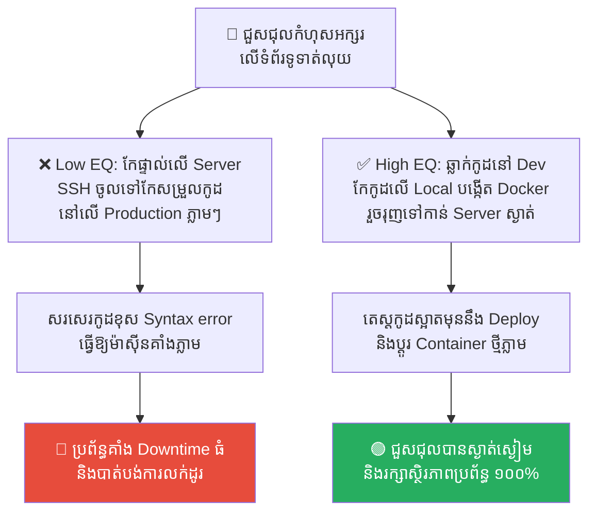
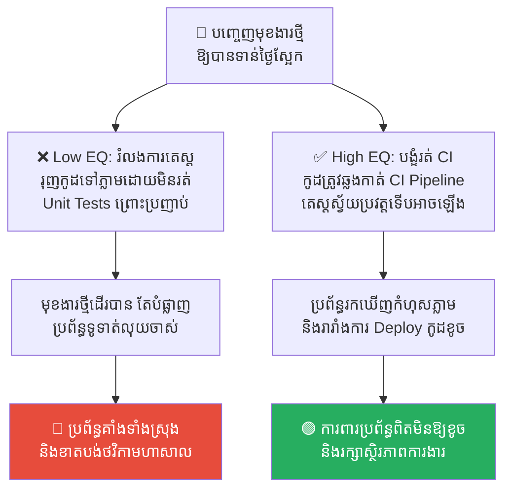
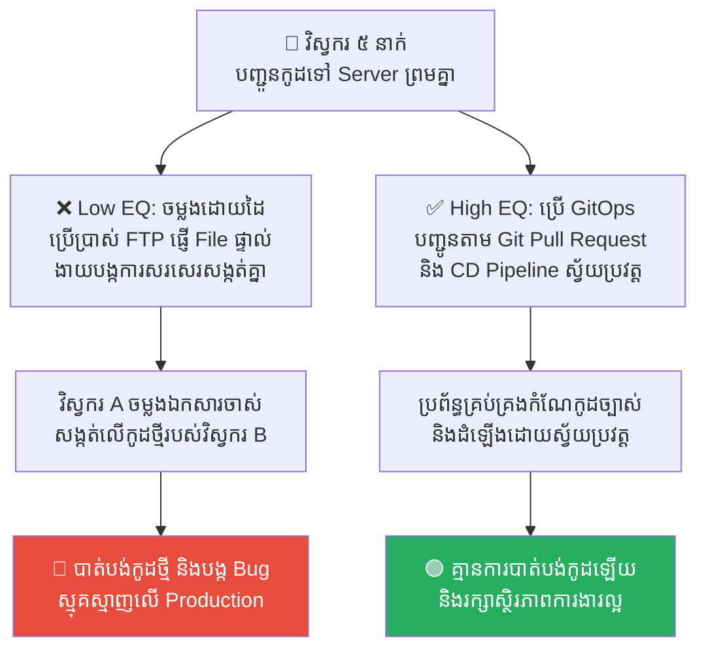
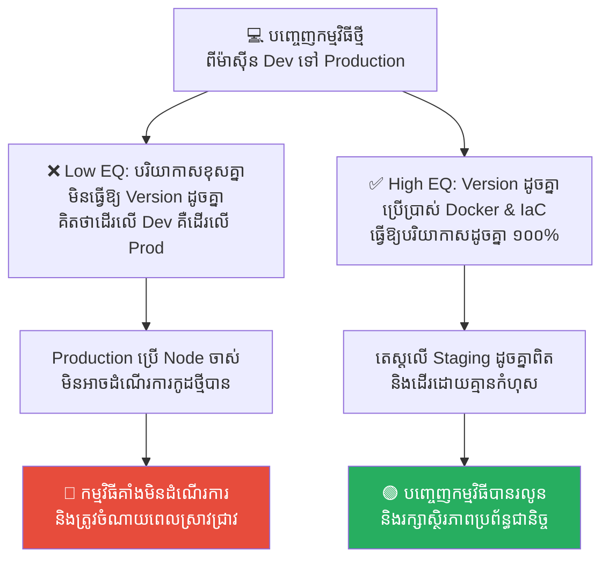
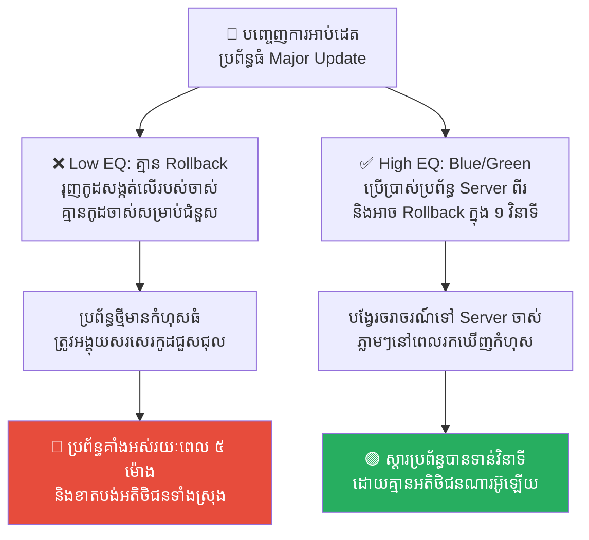

# Solomon's Temple and the Philosophy of CI/CD (ប្រាសាទសាឡូម៉ូន និងទស្សនវិជ្ជានៃការដាក់ពង្រាយកូដស្ងាត់ស្ងៀម)

**Author:** ichamrong  
**Date:** 2026-05-17  
**Tags:** #ci-cd #devops #system-architecture #solomon #deployment #zero-downtime  
**Category:** Concepts  
**Read Time:** ~15 min  

---

## 📌 មាតិកា (Table of Contents)
- [លំនាំបញ្ហា (The Pattern)](#លំនាំបញ្ហា-the-pattern)
- [១. បញ្ហា៖ ហេតុអ្វីបានជាការសាងសង់ប្រព័ន្ធត្រូវតែគ្មានសំឡេង? (The Issue: The Philosophy of Silent Build)](#១-បញ្ហា-ហេតុអ្វីបានជាការសាងសង់ប្រព័ន្ធត្រូវតែគ្មានសំឡេង-the-issue-the-philosophy-of-silent-build)
- [២. ឧទាហរណ៍ជាក់ស្តែងក្នុងពិភពពិត (Real World Examples)](#២-ឧទាហរណ៍ជាក់ស្តែងក្នុងពិភពពិត)
  - [ឧទាហរណ៍ទី ១ — ការកែប្រែកូដផ្ទាល់លើ Server ពិត (Direct Hot-Patching vs. Docker Deployment)](#ឧទាហរណ៍ទី-១-ការកែប្រែកូដផ្ទាល់លើ-server-ពិត-direct-hot-patching-vs-docker-deployment)
  - [ឧទាហរណ៍ទី ២ — ការរំលងតេស្តស្វ័យប្រវត្តព្រោះប្រញាប់ (Skipping Automated Tests vs. Mandatory CI Pipeline)](#ឧទាហរណ៍ទី-២-ការរំលងតេស្តស្វ័យប្រវត្តព្រោះប្រញាប់-skipping-automated-tests-vs-mandatory-ci-pipeline)
  - [ឧទាហរណ៍ទី ៣ — ការដាក់ពង្រាយកូដដោយដៃតាម FTP (Manual FTP Uploads vs. Git Git-Based Deployment)](#ឧទាហរណ៍ទី-៣-ការដាក់ពង្រាយកូដដោយដៃតាម-ftp-manual-ftp-uploads-vs-git-git-based-deployment)
  - [ឧទាហរណ៍ទី ៤ — បរិយាកាសការងារខុសគ្នា (Mismatched Environments vs. Staging-Prod Synchronization)](#ឧទាហរណ៍ទី-៤-បរិយាកាសការងារខុសគ្នា-mismatched-environments-vs-staging-prod-synchronization)
  - [ឧទាហរណ៍ទី ៥ — កង្វះយុទ្ធសាស្ត្រថយក្រោយពេលកូដខូច (No Rollback Strategy vs. Blue-Green Switchback)](#ឧទាហរណ៍ទី-៥-កង្វះយុទ្ធសាស្ត្រថយក្រោយពេលកូដខូច-no-rollback-strategy-vs-blue-green-switchback)
- [៣. កត្តាជម្រុញ៖ ភាពស្ងប់ចិត្តមិនពិត និងការគិតយកតែលឿន (The Aggravator: False Safety Sense & Velocity Focus)](#៣-កត្តាជម្រុញ-ភាពស្ងប់ចិត្តមិនពិត-និងការគិតយកតែលឿន-the-aggravator-false-safety-sense-velocity-focus)
- [៤. ដំណោះស្រាយទូទៅ៖ របៀបរៀបចំការដ្ឋានគ្មានញញួរ (The General Solution: Establishing CI/CD Pipelines)](#៤-ដំណោះស្រាយទូទៅ-របៀបរៀបចំការដ្ឋានគ្មានញញួរ-the-general-solution-establishing-cicd-pipelines)
- [សេចក្តីសន្និដ្ឋាន (Conclusion)](#សេចក្តីសន្និដ្ឋាន-conclusion)
- [Related Posts](#related-posts)

---

## លំនាំបញ្ហា (The Pattern)

នៅក្នុងការអភិវឌ្ឍន៍កម្មវិធី (Software Development) ពេលវេលាដែលគួរឱ្យភ័យខ្លាចបំផុតសម្រាប់វិស្វករ គឺពេលដែលត្រូវបញ្ជូនកូដថ្មីទៅកាន់ម៉ាស៊ីនពិត (**Production Deployment**)។ ជារឿយៗ ការទម្លាក់កូដថ្មីតែងតែអមមកជាមួយនឹង «សំឡេងរំខានដ៏គួរឱ្យព្រួយបារម្ភ» ដូចជា៖ ប្រព័ន្ធត្រូវគាំង (Downtime), កូដថ្មីនិងចាស់ជម្លោះគ្នា (Conflicts) ឬអតិថិជនរអ៊ូរទាំពីបញ្ហាប្រព័ន្ធ។

ដើម្បីដោះស្រាយបញ្ហានេះ វិស្វករបានបង្កើតប្រព័ន្ធ **CI/CD (Continuous Integration & Continuous Deployment)**។ អ្វីដែលគួរឱ្យភ្ញាក់ផ្អើលនោះគឺ ទស្សនវិជ្ជានៃ CI/CD នេះ ត្រូវបានអនុវត្តតាំងពី ៣,០០0 ឆ្នាំមុនមកម្ល៉េះ ដោយស្តេចសាឡូម៉ូន នៅក្នុងការសាងសង់មហាប្រាសាទដ៏អស្ចារ្យបំផុតរបស់ទ្រង់។

យោងតាមប្រវត្តិសាស្ត្រ នៅពេលស្តេចសាឡូម៉ូនសាងសង់មហាប្រាសាទទីមួយនៅយេរូសាឡឹម ទ្រង់បានចេញបទបញ្ជាដ៏តឹងរ៉ឹងមួយថា៖ 

> 💡 **«រាល់ផ្ទាំងថ្មទាំងអស់ ត្រូវតែឆ្លាក់ ដុសខាត់ និងវាស់ទំហំឱ្យរួចរាល់តាំងពីកន្លែងយកថ្ម (Quarry)។ នៅពេលនាំយកមកដល់ការដ្ឋានសាងសង់ប្រាសាទ គេមិនត្រូវឮសំឡេងញញួរ ទ្វារ ឬឧបករណ៍ដែកណាមួយឡើយ។»**

ការដ្ឋានប្រាសាទត្រូវតែមានភាពស្ងប់ស្ងាត់ និងបរិសុទ្ធ។ ថ្មនីមួយៗ ត្រូវតែរុញបញ្ចូលគ្នាឱ្យជិតឈឹង (Perfect Fit) ដោយមិនចាំបាច់មានការកែច្នៃបន្ថែមនៅនឹងកន្លែងនោះទេ។

---

## ១. បញ្ហា៖ ហេតុអ្វីបានជាការសាងសង់ប្រព័ន្ធត្រូវតែគ្មានសំឡេង? (The Issue: The Philosophy of Silent Build)

នៅក្នុងវិស័យបច្ចេកវិទ្យា គោលការណ៍ «សាងសង់ដោយគ្មានសំឡេង» របស់ស្តេចសាឡូម៉ូន គឺជារូបមន្តដ៏ល្អឥតខ្ចោះសម្រាប់ការរៀបចំប្រព័ន្ធ Server៖

*   **កន្លែងវាយថ្ម (The Quarry) = Development & Staging Environment៖** នេះគឺជាកន្លែងដែលអ្នកសរសេរកូដ (Developers) អាចឆ្លាក់កូដ កែកូដ និងធ្វើឱ្យប្រព័ន្ធគាំងរាប់មិនអស់។ ការកែច្នៃ និងការឆ្លាក់កូដ ត្រូវតែបញ្ចប់ទាំងស្រុងនៅទីនេះ។
*   **ការដ្ឋានប្រាសាទ (The Temple Site) = Production Environment៖** នេះគឺជាកន្លែងដែលអតិថិជនពិតប្រាកដកំពុងប្រើប្រាស់ (Live App)។ ទីនេះត្រូវតែ «ស្ងាត់ស្ងៀម (Zero Downtime)»។ មិនត្រូវមានវិស្វករណាម្នាក់ ចូលមកវាយកូដ ឬតេស្តកូដថ្មីដោយផ្ទាល់នៅលើ Server នេះឡើយ (No hammer should be heard in Production)។

ប្រសិនបើយើងមិនមានប្រព័ន្ធ CI/CD ស្វ័យប្រវត្តទេ យើងនឹងត្រូវយក «ញញួរ» ទៅវាយថ្មនៅលើការដ្ឋានពិត បង្កជាកំហុសរញ៉េរញ៉ៃ និងបំផ្លាញអាជីវកម្មរបស់ក្រុមហ៊ុន។

---

## ២. ឧទាហរណ៍ជាក់ស្តែងក្នុងពិភពពិត

សូមពិនិត្យមើល **ឧទាហរណ៍ជាក់ស្តែងចំនួន ៥** បង្ហាញពីរបៀបដែលទស្សនវិជ្ជានៃការសាងសង់ដោយគ្មានសំឡេងជួយការពារប្រព័ន្ធ និងវិធីសាស្ត្រដោះស្រាយ៖

---

### ឧទាហរណ៍ទី ១ — ការកែប្រែកូដផ្ទាល់លើ Server ពិត (Direct Hot-Patching vs. Docker Deployment)

**ស្ថានភាព៖** គេហទំព័រលក់ទំនិញរបស់ក្រុមហ៊ុន ជួបប្រទះបញ្ហាកំហុសអក្សរ (Typo Error) នៅលើទំព័រទូទាត់ប្រាក់។

*   **សកម្មភាពអសកម្ម / Low EQ / កំហុសឆ្គង (វាយថ្មលើការដ្ឋាន)៖** វិស្វករបានប្រើប្រាស់ FTP ឬ SSH ចូលទៅកាន់ Server ពិតប្រាកដ រួចបើក Editor កែកូដផ្ទាល់នៅលើ Server នោះតែម្តង ព្រោះគិតថាកែតែមួយពាក្យលឿនជាង។ គាត់បានវាយខុសអក្សរ Syntax បន្តិចបណ្តាលឱ្យ Server គាំង (Downtime) ទាំងស្រុងភ្លាមៗ ធ្វើឱ្យអតិថិជនរាប់ពាន់នាក់មិនអាចទិញទំនិញបាន។
*   **សកម្មភាពស្ថាបនា / High EQ / ដំណោះស្រាយ (ឆ្លាក់នៅកន្លែងយកថ្ម)៖** អនុវត្ត **Docker Containerization**។ វិស្វករត្រូវធ្វើការកែប្រែកូដនៅលើម៉ាស៊ីនផ្ទាល់ខ្លួន (Local) រួចបង្កើតឯកសារ Image ថ្មីមួយ (Docker Image) ដែលត្រូវបានធ្វើតេស្តសាកល្បងយ៉ាងត្រឹមត្រូវ។ បន្ទាប់មក យក Image ដែលរួចរាល់នោះទៅដាក់ពង្រាយជំនួសរបស់ចាស់ភ្លាមៗ ដោយគ្មានការកែកូដនៅលើ Server ពិតឡើយ។
*   **លទ្ធផល៖** ការកែកូដផ្ទាល់លើ Server ពិតនាំឱ្យប្រព័ន្ធងាយរលំ និងបង្កការរំខានដល់អតិថិជន។ ការប្រើប្រាស់ Docker Image ជួយឱ្យការដាក់ពង្រាយកូដស្ងាត់ស្ងៀម រហ័ស និងមានស្ថិរភាពខ្ពស់។

---

### ឧទាហរណ៍ទី ២ — ការរំលងតេស្តស្វ័យប្រវត្តព្រោះប្រញាប់ (Skipping Automated Tests vs. Mandatory CI Pipeline)

**ស្ថានភាព៖** ក្រុមហ៊ុនត្រូវប្រញាប់ប្រញាល់បញ្ចេញមុខងារ «បញ្ចុះតម្លៃពិសេស» នៅយប់ថ្ងៃស្អែក ដើម្បីដណ្តើមយកអតិថិជន។

*   **សកម្មភាពអសកម្ម / Low EQ / កំហុសឆ្គង (វាយថ្មលើការដ្ឋាន)៖** Lead Developer សម្រេចចិត្តរំលង (Skip) ការធ្វើតេស្តបច្ចេកទេស និងមិនរង់ចាំការរត់តេស្តស្វ័យប្រវត្ត (Unit Tests) ឡើយ ព្រោះ៖ *«យើងប្រញាប់ណាស់ មុខងារនេះខ្ញុំបានមើលដោយភ្នែកហើយ គឺគ្មានបញ្ហាអ្វីឡើយ រុញវាទៅ Production ភ្លាមទៅ!»* ពេលបញ្ចេញទៅ មុខងារថ្មីដើរបាន តែវាបានទៅបំផ្លាញប្រព័ន្ធទូទាត់ប្រាក់ចាស់ (Regression Bug) ធ្វើឱ្យប្រព័ន្ធគាំងទាំងស្រុង។
*   **សកម្មភាពស្ថាបនា / High EQ / ដំណោះស្រាយ (ឆ្លាក់នៅកន្លែងយកថ្ម)៖** អនុវត្ត **Mandatory CI Pipeline (GitHub Actions/GitLab CI)**។ រាល់កូដដែលត្រូវរុញទៅកាន់ Production ត្រូវតែឆ្លងកាត់ការរត់តេស្តស្វ័យប្រវត្ត (Automated Tests Suite) ជាដាច់ខាត បើមានតេស្តណាមួយបរាជ័យ នោះប្រព័ន្ធនឹងរារាំង (Block) មិនឱ្យបញ្ចេញកូដនោះឡើយ។
*   **លទ្ធផល៖** ការរំលងប្រព័ន្ធតេស្តព្រោះតែល្បឿននាំឱ្យកើតមាន Bug ធំធ្លាក់ដល់ដៃ User។ ការបង្ខំឱ្យរត់ CI Pipeline ជួយធានាថា រាល់កូដដែលឡើងទៅ Server គឺមានគុណភាពខ្ពស់ និងមិនប៉ះពាល់មុខងារចាស់ៗឡើយ។

---

### ឧទាហរណ៍ទី ៣ — ការដាក់ពង្រាយកូដដោយដៃតាម FTP (Manual FTP Uploads vs. Git Git-Based Deployment)

**ស្ថានភាព៖** ក្រុមហ៊ុនអភិវឌ្ឍន៍ App មួយ មានវិស្វករ ៥ នាក់ ធ្វើការងារលើគម្រោងរួមគ្នា។

*   **សកម្មភាពអសកម្ម / Low EQ / កំហុសឆ្គង (វាយថ្មលើការដ្ឋាន)៖** វិស្វករម្នាក់ៗ បញ្ជូនកូដទៅ Server ផលិតកម្ម ដោយការចម្លងឯកសារ (Copy-Paste) តាមរយៈកម្មវិធី FTP ដោយផ្ទាល់ដៃជារៀងរាល់ល្ងាច។ ថ្ងៃមួយ វិស្វករ A បានលួចចម្លងឯកសារចាស់របស់ខ្លួន ទៅសង្កត់លើឯកសារថ្មីរបស់វិស្វករ B (File Overwrite Conflict) ធ្វើឱ្យបាត់បង់មុខងារថ្មីរបស់វិស្វករ B និងបង្កជា Bug ស្មុគស្មាញដែលពិបាករកឃើញ។
*   **សកម្មភាពស្ថាបនា / High EQ / ដំណោះស្រាយ (ឆ្លាក់នៅកន្លែងយកថ្ម)៖** អនុវត្ត **Git-Based Deployment (GitOps)**។ រាល់ការផ្លាស់ប្តូរកូដ ត្រូវតែធ្វើឡើងតាមរយៈ Git Commits និង Pull Requests។ នៅពេលកូដត្រូវបាន Merge ចូលទៅកាន់ Branch មេ ប្រព័ន្ធ CD នឹងទាញយកកូដនោះទៅដំឡើងនៅលើ Server ដោយស្វ័យប្រវត្ត ដោយគ្មានការលូកដៃដោយដៃរបស់មនុស្សឡើយ។
*   **លទ្ធផល៖** ការប្រើដៃចម្លងកូដនាំឱ្យកើតមានជម្លោះកូដ និងបាត់បង់ឯកសារការងារ។ ការប្រើប្រាស់ GitOps ជួយឱ្យការដាក់ពង្រាយកូដមានរបៀបរៀបរយ មានប្រវត្តិច្បាស់លាស់ និងគ្មានកំហុសជាន់គ្នា។

---

### ឧទាហរណ៍ទី ៤ — បរិយាកាសការងារខុសគ្នា (Mismatched Environments vs. Staging-Prod Synchronization)

**ស្ថានភាព៖** វិស្វករបានបង្កើតកម្មវិធីថ្មីមួយ ដែលដំណើរការយ៉ាងល្អឥតខ្ចោះនៅលើកុំព្យូទ័រផ្ទាល់ខ្លួនរបស់គាត់ (Local Environment)។

*   **សកម្មភាពអសកម្ម / Low EQ / កំហុសឆ្គង (វាយថ្មលើការដ្ឋាន)៖** វិស្វករនិយាយដោយមោទនភាពថា៖ *«នៅលើម៉ាស៊ីនរបស់ខ្ញុំគឺដើរល្អណាស់!»* រួចរុញកូដនោះទៅ Production Server ភ្លាម។ ប៉ុន្តែ Production Server ដំណើរការលើ Node.js Version 14 (ខណៈម៉ាស៊ីន Dev ដំណើរការលើ Node.js Version 18)។ ភាពខុសគ្នានៃ Version នេះ បណ្តាលឱ្យកម្មវិធីមិនអាចដំណើរការបាន និងគាំងភ្លាមៗនៅពេលដំណើរការលើ Production។
*   **សកម្មភាពស្ថាបនា / High EQ / ដំណោះស្រាយ (ឆ្លាក់នៅកន្លែងយកថ្ម)៖** អនុវត្ត **Environment Synchronization** និងការប្រើប្រាស់ **Infrastructure as Code (IaC)**។ ត្រូវធានាថា បរិយាកាសការងាររបស់ Dev, Staging និង Production គឺមានសភាពដូចគ្នាបេះបិទ ១០០% (ដូចជាការប្រើប្រាស់ Docker-compose និង IaC ដូចជា Terraform) ដើម្បីឱ្យរាល់ការតេស្តនៅលើ Staging ឆ្លុះបញ្ចាំងពីលទ្ធផលពិតនៅលើ Production។
*   **លទ្ធផល៖** ភាពខុសគ្នានៃបរិយាកាសការងារនាំឱ្យកើតមាន «Bug ខ្មោចលង» ដែលពិបាករកឃើញ។ ការធ្វើឱ្យបរិយាកាសការងារដូចគ្នាជួយឱ្យការតេស្តមានភាពត្រឹមត្រូវ និងការបញ្ចេញកូដគ្មានភាពរអាក់រអួល។

---

### ឧទាហរណ៍ទី ៥ — កង្វះយុទ្ធសាស្ត្រថយក្រោយពេលកូដខូច (No Rollback Strategy vs. Blue-Green Switchback)

**ស្ថានភាព៖** ក្រុមហ៊ុនដំឡើងប្រព័ន្ធថ្មីមួយដែលមានការកែប្រែចំណុចធំៗជាច្រើន (Major Update) ទៅកាន់ម៉ាស៊ីនពិត Production។

*   **សកម្មភាពអសកម្ម / Low EQ / កំហុសឆ្គង (វាយថ្មលើការដ្ឋាន)៖** ក្រុមហ៊ុនរុញកូដថ្មីទៅសង្កត់លើកូដចាស់ផ្ទាល់ (In-place Deployment) ដោយគ្មានការរៀបចំយុទ្ធសាស្ត្រថយក្រោយ (No Rollback Strategy) ឡើយ។ ពេលបញ្ចេញទៅ ស្រាប់តែប្រព័ន្ធជួបកំហុសធ្ងន់ធ្ងរ។ ក្រុមការងារគ្មានកូដចាស់ដើម្បីជំនួសវិញភ្លាមៗឡើយ និងត្រូវចំណាយពេល ៥ ម៉ោង អង្គុយសរសេរកូដជួសជុលទាំងស្ត្រេសបំផុត ខណៈអតិថិជនប្រើប្រាស់កម្មវិធីមិនកើត។
*   **សកម្មភាពស្ថាបនា / High EQ / ដំណោះស្រាយ (ឆ្លាក់នៅកន្លែងយកថ្ម)៖** អនុវត្ត **Blue/Green Deployment Strategy**។ រក្សាម៉ាស៊ីនចាស់ (Blue) ឱ្យដំណើរការធម្មតា រួចរៀបចំដំឡើងកូដថ្មីលើម៉ាស៊ីនថ្មី (Green) ឱ្យរួចរាល់ និងធ្វើតេស្តស្ងាត់ស្ងៀម។ ពេលជោគជ័យ គ្រាន់តែប្តូរចរាចរណ៍ (Router Switch) ពី Blue ទៅ Green។ ប្រសិនបើមានបញ្ហា គ្រាន់តែបង្វែរចរាចរណ៍ត្រឡប់ទៅ Blue (Rollback) វិញភ្លាមៗក្នុងរយៈពេលត្រឹម ១ វិនាទី។
*   **លទ្ធផល៖** កង្វះផែនការ Rollback នាំឱ្យក្រុមហ៊ុនរងការខូចខាតធ្ងន់ធ្ងរ និងស្ត្រេសខ្លាំងពេលមានបញ្ហា។ ការប្រើប្រាស់ Blue/Green Deployment ជួយធានាថា ការបញ្ចេញកូដ ឬការថយក្រោយគឺមានល្បឿនលឿន និងគ្មានផលប៉ះពាល់ដល់អតិថិជនឡើយ។

---

## ៣. កត្តាជម្រុញ៖ ភាពស្ងប់ចិត្តមិនពិត និងការគិតយកតែលឿន (The Aggravator: False Safety Sense & Velocity Focus)

ហេតុអ្វីបានជាយើងឧស្សាហ៍យកញញួរទៅវាយថ្មនៅលើការដ្ឋាន Production ផ្ទាល់ខ្លាំងម្ល៉េះ? កត្តាជម្រុញរួមមាន៖

1.  **ការយល់ច្រឡំលើភាពសាមញ្ញ (Illusion of Simplicity)៖** យើងតែងតែគិតថា៖ *«កូដនេះសាមញ្ញណាស់ កែកែបន្តិចទៅមិនអីទេ មិនបាច់ឆ្លងកាត់ប្រព័ន្ធ CI/CD នាំតែយឺតយូរឡើយ!»*
2.  **សម្ពាធពីផ្នែកអាជីវកម្ម (Business Speed Pressure)៖** ការចង់បានមុខងារថ្មីឱ្យបានលឿនបំផុតពីថ្នាក់ដឹកនាំ បង្ខំឱ្យវិស្វករត្រូវរំលងប្រព័ន្ធសុវត្ថិភាព និងប្រព័ន្ធតេស្តដើម្បីដេញតាម Deadline។
3.  **កង្វះការវិនិយោគលើប្រព័ន្ធ DevOps (Neglecting DevOps)៖** ក្រុមហ៊ុនជាច្រើនមិនព្រមចំណាយពេល ឬថវិកាដើម្បីកសាងប្រព័ន្ធ CI/CD ស្វ័យប្រវត្តឡើយ ដោយចាត់ទុកថាវាជាការចំណាយឥតប្រយោជន៍ រហូតដល់ថ្ងៃដែលប្រព័ន្ធរលំធ្ងន់ធ្ងរទើបដឹងខ្លួន។

---

## ៤. ដំណោះស្រាយទូទៅ៖ របៀបរៀបចំការដ្ឋានគ្មានញញួរ (The General Solution: Establishing CI/CD Pipelines)

ដើម្បីសម្រេចបាននូវ «ការសាងសង់ដោយគ្មានសំឡេង» ដូចមហាប្រាសាទរបស់ស្តេចសាឡូម៉ូន ចូរអនុវត្តគោលការណ៍សំខាន់ៗ ៣ យ៉ាង៖

1.  **ការរៀបចំកូដឱ្យរួចរាល់មុនដំឡើង (Immutable Artifacts)៖** រាល់កូដដែលត្រូវឡើងទៅ Production ត្រូវតែត្រូវបានសាងសង់ជាកញ្ចប់កូដដែលមិនអាចកែប្រែបាន (ដូចជា Docker Images ឬ Build Packages)។ ហាមដាច់ខាតការកែប្រែកូដផ្ទាល់នៅលើ Server ពិត។
2.  **ស្វ័យប្រវត្តិកម្មនៃការតេស្ត (Mandatory Automated Testing)៖** បង្កើតប្រព័ន្ធ CI/CD ដែលរារាំងកូដទាំងឡាយណាដែលមិនទាន់ឆ្លងកាត់ការតេស្តស្វ័យប្រវត្ត (Unit, Integration, Security Tests) មិនឱ្យទៅដល់ដៃអតិថិជនឡើយ។
3.  **ការដាក់ពង្រាយដោយគ្មានការរំខាន (Zero-Downtime Deployment)៖** ប្រើប្រាស់យុទ្ធសាស្ត្រ Blue/Green Deployments ឬ Canary Releases ដើម្បីធានាថា រាល់ការបញ្ចេញកូដថ្មី គឺមានភាពរលូន និងអាចបង្វែរត្រឡប់មកកូដចាស់វិញបានភ្លាមៗ (Instant Rollback) ប្រសិនបើមានបញ្ហា។

---

## សេចក្តីសន្និដ្ឋាន (Conclusion)

**ប្រាសាទសាឡូម៉ូន និងទស្សនវិជ្ជានៃ CI/CD** បង្រៀនយើងថា ស្ថិរភាព និងភាពស្រស់ស្អាតនៃប្រព័ន្ធការងារ មិនមែនកើតឡើងដោយចៃដន្យឡើយ ប៉ុន្តែវាកើតឡើងចេញពីការរៀបចំទុកជាមុន និងការគោរពវិន័យការងារយ៉ាងតឹងរ៉ឹងបំផុត។ វិស្វករដ៏ឆ្នើម មិនមែនជាអ្នកដែលពូកែរត់ទៅជួសជុលប្រព័ន្ធទាំងភ័យស្លន់ស្លោនៅលើ Production នោះទេ ប៉ុន្តែវាគឺ **«អ្នកដែលសាងសង់ប្រព័ន្ធការងារ និងប្រព័ន្ធ CI/CD ដ៏រឹងមាំ ដែលអនុញ្ញាតឱ្យការអភិវឌ្ឍន៍ប្រព័ន្ធមានភាពស្ងប់ស្ងាត់ និងគ្មានសំឡេងរំខានដល់អតិថិជនសូម្បីតែបន្តិច»**។

ចូរចងចាំថា៖ **«គ្មានញញួរ ឬឧបករណ៍ដែកណាមួយ គួរតែត្រូវបានឮនៅលើ Production ឡើយ។»**

---

## Related Posts

*   **[39 Solomon's Temple and the Silent Build](../parables/39-solomons-temple-and-the-silent-build.md)** — រឿងប្រៀបធៀបប្រវត្តិសាស្ត្រ អំពីការសាងសង់ប្រាសាទដ៏អស្ចារ្យដោយមិនប្រើញញួរ ឬឧបករណ៍ដែកនៅលើការដ្ឋានសង់។
*   **[10 Technical Debt and Refactoring](./10-technical-debt-and-refactoring.md)** — របៀបដែលការកែកូដរញ៉េរញ៉ៃបង្កើតបំណុលបច្ចេកវិទ្យាដល់ប្រព័ន្ធអនាគត។

---

*Last updated: 2026-05-26*
