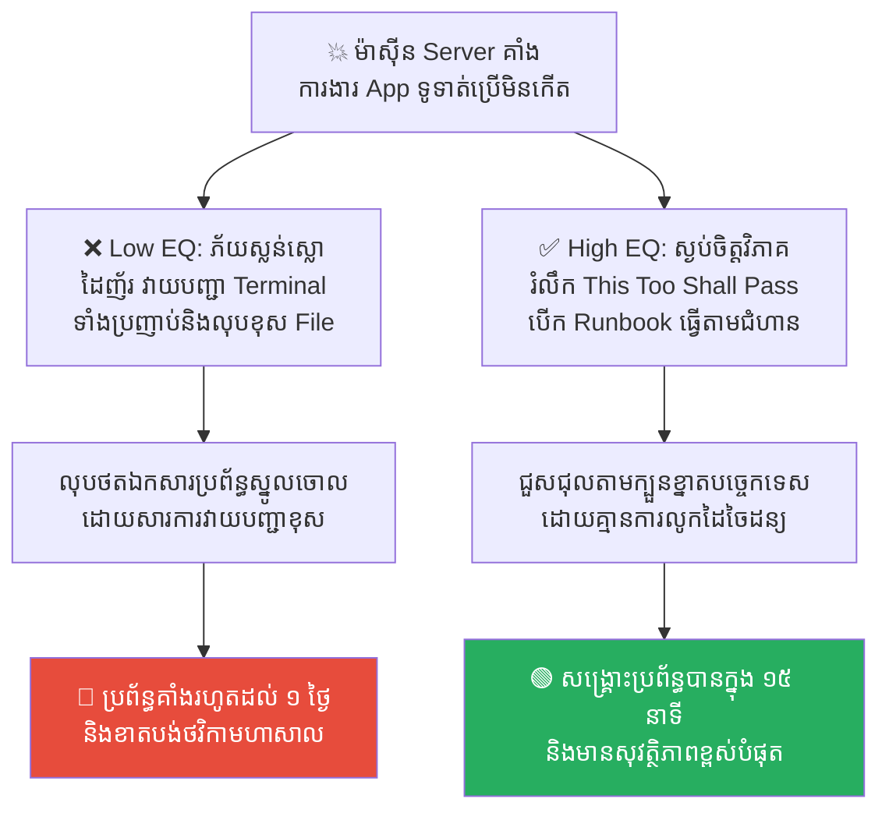
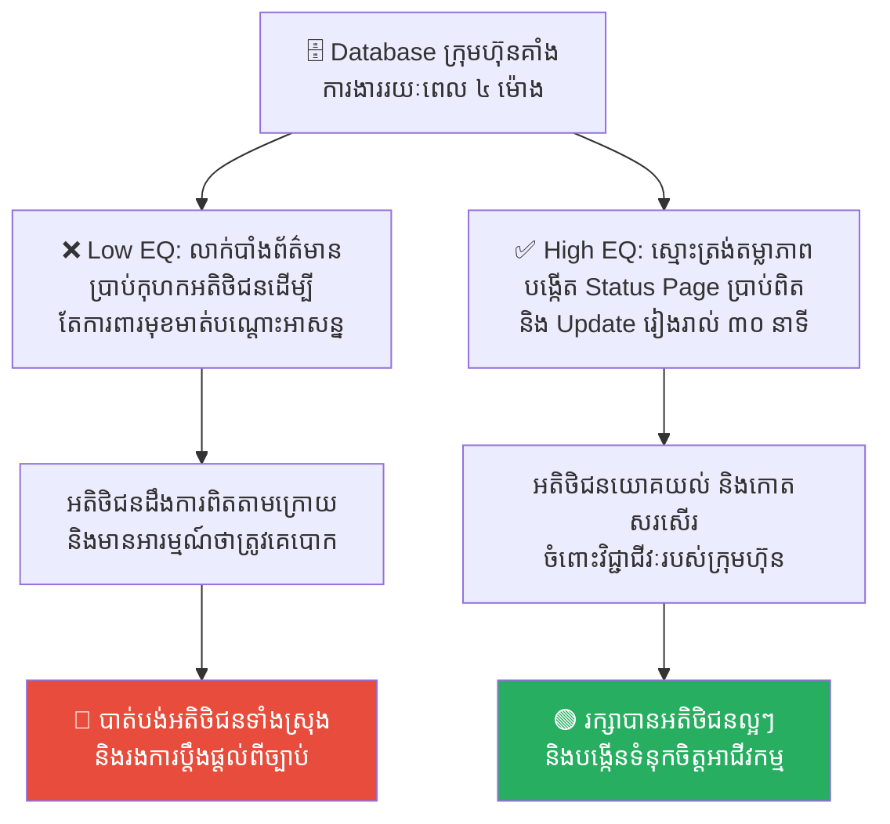
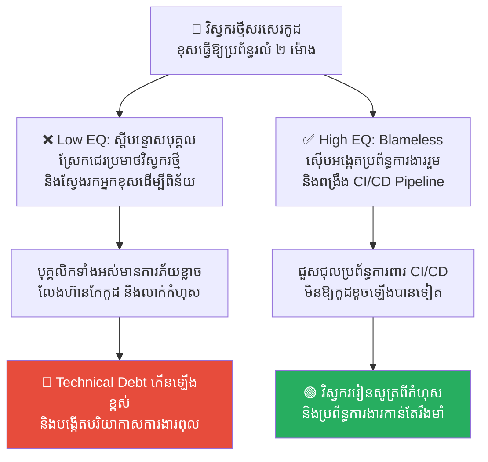
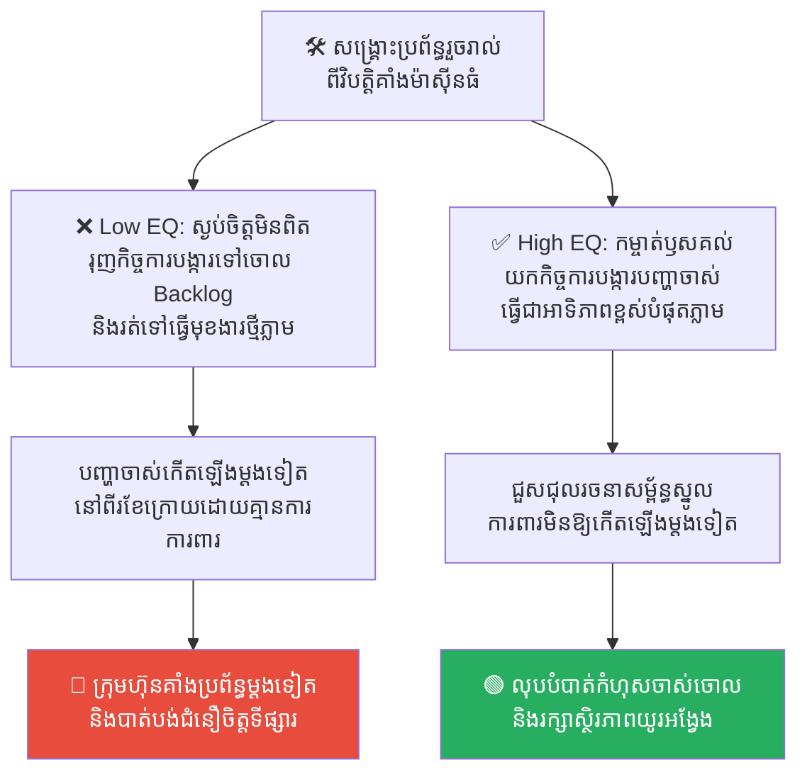
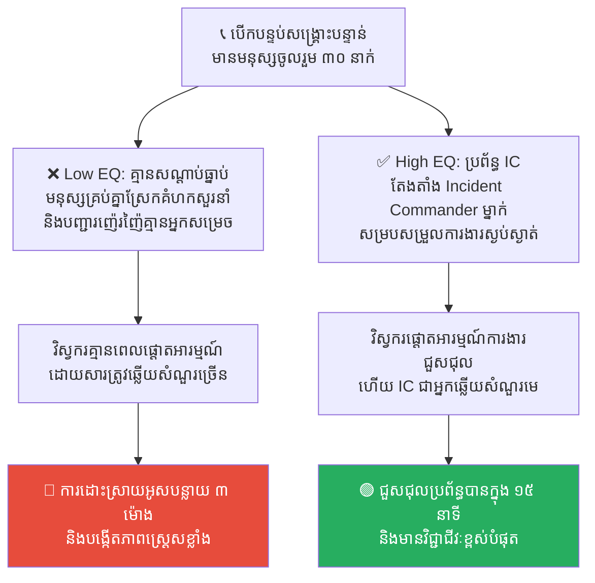

# Solomon's Ring: Emotional Resilience in Incident Management (ចិញ្ចៀនរបស់សាឡូម៉ូន៖ ភាពរឹងមាំផ្លូវចិត្តក្នុងការគ្រប់គ្រងវិបត្តិ)

**Author:** ichamrong  
**Date:** 2026-05-17  
**Tags:** #solomon #incident-management #resilience #psychology #stoicism #burnout  
**Category:** Concepts  
**Read Time:** ~15 min  

---

## 📌 មាតិកា (Table of Contents)
- [លំនាំបញ្ហា (The Pattern)](#លំនាំបញ្ហា-the-pattern)
- [១. បញ្ហា៖ ហេតុអ្វីបានជាអារម្មណ៍ជ្រុលនិយមសម្លាប់ប្រព័ន្ធ? (The Issue: The Tech Emotional Rollercoaster)](#១-បញ្ហា-ហេតុអ្វីបានជាអារម្មណ៍ជ្រុលនិយមសម្លាប់ប្រព័ន្ធ-the-issue-the-tech-emotional-rollercoaster)
- [២. ឧទាហរណ៍ជាក់ស្តែងក្នុងពិភពពិត (Real World Examples)](#២-ឧទាហរណ៍ជាក់ស្តែងក្នុងពិភពពិត)
  - [ឧទាហរណ៍ទី ១ — ការភ័យស្លន់ស្លោលុបឯកសារពេល Server គាំង (Panic Outage Response vs. Calm Runbook Execution)](#ឧទាហរណ៍ទី-១-ការភ័យស្លន់ស្លោលុបឯកសារពេល-server-គាំង-panic-outage-response-vs-calm-runbook-execution)
  - [ឧទាហរណ៍ទី ២ — ការលាក់បាំងវិបត្តិពីអតិថិជន (Hiding Incidents vs. Transparent Status Communication)](#ឧទាហរណ៍ទី-២-ការលាក់បាំងវិបត្តិពីអតិថិជន-hiding-incidents-vs-transparent-status-communication)
  - [ឧទាហរណ៍ទី ៣ — ការស្វែងរកពពែទទួលបាបក្នុងបន្ទប់សង្គ្រោះបន្ទាន់ (Blame Attribution vs. Blameless Post-Mortem)](#ឧទាហរណ៍ទី-៣-ការស្វែងរកពពែទទួលបាបក្នុងបន្ទប់សង្គ្រោះបន្ទាន់-blame-attribution-vs-blameless-post-mortem)
  - [ឧទាហរណ៍ទី ៤ — ការទុកចោលកិច្ចការបង្ការកំហុសចាស់ (Ignoring Post-Incident Tickets vs. Root-Cause Prioritization)](#ឧទាហរណ៍ទី-៤-ការទុកចោលកិច្ចការបង្ការកំហុសចាស់-ignoring-post-incident-tickets-vs-root-cause-prioritization)
  - [ឧទាហរណ៍ទី ៥ — ភាពច្របូកច្របល់ក្នុងបន្ទប់សង្គ្រោះបន្ទាន់ (War-Room Chaos vs. Incident Commander System)](#ឧទាហរណ៍ទី-៥-ភាពច្របូកច្របល់ក្នុងបន្ទប់សង្គ្រោះបន្ទាន់-war-room-chaos-vs-incident-commander-system)
- [៣. កត្តាជម្រុញ៖ ភាពតក់ក្រហល់ និងការភ័យខ្លាចការស្តីបន្ទោស (The Aggravator: Urgency & Blame Fear)](#៣-កត្តាជម្រុញ-ភាពតក់ក្រហល់-និងការភ័យខ្លាចការស្តីបន្ទោស-the-aggravator-urgency-blame-fear)
- [៤. ដំណោះស្រាយទូទៅ៖ របៀបរចនាចិញ្ចៀនរបស់សាឡូម៉ូនលើប្រព័ន្ធ (The General Solution: Practical Emotional Resilience)](#៤-ដំណោះស្រាយទូទៅ-របៀបរចនាចិញ្ចៀនរបស់សាឡូម៉ូនលើប្រព័ន្ធ-the-general-solution-practical-emotional-resilience)
- [សេចក្តីសន្និដ្ឋាន (Conclusion)](#សេចក្តីសន្និដ្ឋាន-conclusion)
- [Related Posts](#related-posts)

---

## លំនាំបញ្ហា (The Pattern)

ការធ្វើការងារនៅក្នុងវិស័យបច្ចេកវិទ្យា (Software Engineering / DevOps / SRE) គឺជាការប្រឈមមុខនឹងភាពតានតឹងដ៏ខ្លាំងក្លាជារៀងរាល់ថ្ងៃ។ ថ្ងៃខ្លះ អ្នកមានអារម្មណ៍ថាខ្លួនឯងជាមនុស្សឆ្លាត និងអស្ចារ្យបំផុតក្នុងលោក (នៅពេលកូដដើររលូន និងមានការកោតសរសើរ)។ តែថ្ងៃខ្លះទៀត អ្នកស្រាប់តែមានអារម្មណ៍ថាខ្លួនឯងជាមនុស្សអន់ និងល្ងង់ខ្លៅបំផុត (នៅពេលកូដមានបញ្ហា និងប្រព័ន្ធគាំង)។

នៅពេលដែលប្រព័ន្ធធំៗរបស់ក្រុមហ៊ុនត្រូវគាំងទាំងស្រុង (**Severity-1 Outage**) បណ្តាលឱ្យខាតបង់ថវិការាប់ម៉ឺនដុល្លារ មនុស្សគ្រប់គ្នា ចាប់ពីថ្នាក់ដឹកនាំរហូតដល់អ្នកបច្ចេកទេស តែងតែមានភាពភ័យស្លន់ស្លោ និងបាក់ទឹកចិត្ត។

ដើម្បីទប់ទល់នឹងស្ថានភាពទាំងនេះ អ្នកដឹកនាំបច្ចេកវិទ្យាត្រូវប្រកាន់យកទស្សនវិជ្ជាផ្លូវចិត្តមួយ ដែលមានប្រភពចេញពីរឿងព្រេងរបស់ស្តេចសាឡូម៉ូន គឺទស្សនវិជ្ជា **«រឿងនេះ ក៏នឹងកន្លងផុតទៅដែរ (This Too Shall Pass)»**។

នៅក្នុងរឿងព្រេង ស្តេចសាឡូម៉ូនបានសួរទៅកាន់អ្នកបំរើរបស់ទ្រង់ឱ្យស្វែងរកចិញ្ចៀនមួយវង់ ដែលអាចធ្វើឱ្យមនុស្សមានក្តីសប្បាយចិត្តត្រឡប់ជាស្រងូតស្រងាត់ និងធ្វើឱ្យមនុស្សដែលស្រងូតស្រងាត់មានក្តីសង្ឃឹមឡើងវិញ។ អ្នកបំរើបានរកឃើញចិញ្ចៀនមាសសាមញ្ញមួយវង់ ដែលឆ្លាក់ពាក្យថា៖ *«រឿងនេះ ក៏នឹងកន្លងផុតទៅដែរ។»*

នៅពេលស្តេចសាឡូម៉ូនសម្លឹងមើលចិញ្ចៀននេះ៖
*   នៅពេលដែលទ្រង់ស្ថិតក្នុង **ចំណុចកំពូល (ជោគជ័យ/អំណាច)** វាទាញទ្រង់ឱ្យមក **ដាក់ខ្លួន (Humble)** ដោយរំលឹកថា ភាពជោគជ័យនេះមិននៅស្ថិតស្ថេររហូតទេ កុំធ្វេសប្រហែសឱ្យសោះ។
*   នៅពេលដែលទ្រង់ស្ថិតក្នុង **ចំណុចសូន្យ (វិបត្តិ/បរាជ័យ)** វាទាញទ្រង់ឱ្យមាន **ក្តីសង្ឃឹម (Hope)** ដោយរំលឹកថា បញ្ហាដ៏គួរឱ្យខ្លាចនេះ វានឹងកន្លងផុតទៅ ទ្រង់នឹងមិនស្លាប់ដោយសាររឿងនេះឡើយ។

---

## ១. បញ្ហា៖ ហេតុអ្វីបានជាអារម្មណ៍ជ្រុលនិយមសម្លាប់ប្រព័ន្ធ? (The Issue: The Tech Emotional Rollercoaster)

នៅក្នុងវិស័យបច្ចេកវិទ្យា វិស្វករតែងតែជួបប្រទះនូវអារម្មណ៍ជ្រុលនិយមពីរយ៉ាង ដែលសុទ្ធតែបង្កគ្រោះថ្នាក់ដល់ប្រព័ន្ធការងារ៖

1.  **អំនួតជ្រុល (The Hubris of Success)៖** នៅពេលប្រព័ន្ធដំណើរការបានល្អរយៈពេលយូរ វិស្វករចាប់ផ្តើមមានអំនួត ធ្វេសប្រហែស លែងសរសេរ Unit Tests លែងខ្វល់ពី Technical Debt និងលែងធ្វើការងារត្រួតពិនិត្យប្រព័ន្ធសុវត្ថិភាព ព្រោះគិតថា៖ *«ពួកយើងពូកែណាស់ ប្រព័ន្ធយើងរឹងមាំ មិនអាចរលំបានឡើយ!»*
2.  **ភាពភ័យស្លន់ស្លោ (The Despair of Failure)៖** នៅពេល Server គាំងពិតប្រាកដនៅម៉ោង ២ យប់ ថ្ងៃអាទិត្យ វិស្វករមានអារម្មណ៍ភ័យខ្លាច តក់ក្រហល់ ដៃញ័រ និងធ្វើការសម្រេចចិត្តខុសឆ្គងទាំងស្រុង (ដូចជា ការលុបកូដចោលចៃដន្យ ឬការរុញកូដក្តៅដែលពោរពេញដោយកំហុសដើម្បីដោះស្រាយបន្ទាន់) ដែលនាំឱ្យបញ្ហាកាន់តែធ្ងន់ធ្ងរជាងមុនទៅទៀត។

ការគ្រប់គ្រងវិបត្តិដែលមានប្រសិទ្ធភាព គឺការរក្សាបាននូវ **«ភាពស្ងប់ស្ងាត់ និងសមធម៌ផ្លូវចិត្ត (Equanimity)»** ដោយដឹងច្បាស់ថា ទាំងភាពជោគជ័យ និងភាពបរាជ័យ សុទ្ធតែជារឿងបណ្តោះអាសន្ន។

---

## ២. ឧទាហរណ៍ជាក់ស្តែងក្នុងពិភពពិត

សូមពិនិត្យមើល **ឧទាហរណ៍ជាក់ស្តែងចំនួន ៥** បង្ហាញពីរបៀបដែលចិញ្ចៀនរបស់សាឡូម៉ូន និងការគ្រប់គ្រងវិបត្តិប្រកបដោយភាពចាស់ទុំជួយសង្គ្រោះប្រព័ន្ធ៖

---

### ឧទាហរណ៍ទី ១ — ការភ័យស្លន់ស្លោលុបឯកសារពេល Server គាំង (Panic Outage Response vs. Calm Runbook Execution)

**ស្ថានភាព៖** ម៉ាស៊ីន Server ស្នូលរបស់ក្រុមហ៊ុនស្រាប់តែគាំងដំណើរការ (Outage) បណ្តាលឱ្យ App ទូទាត់លុយមិនអាចប្រើប្រាស់បាន។

*   **សកម្មភាពអសកម្ម / Low EQ / កំហុសឆ្គង៖** វិស្វករបច្ចេកវិទ្យាភ័យស្លន់ស្លោខ្លាំង ព្រោះប្រធានក្រុមហ៊ុនទូរស័ព្ទមកស្រែកជេរពីក្បាល។ គាត់ចាប់ផ្តើមវាយបញ្ជា (Terminal Command) ទាំងដៃញ័រប្រឡាក់ភ្នែក ដោយគ្មានការពិចារណា រហូតដល់ចៃដន្យលុបថតឯកសារប្រព័ន្ធស្នូលចោល (លុបខុស File) ធ្វើឱ្យប្រព័ន្ធកាន់តែខូចខាតធ្ងន់ធ្ងរ និងអូសបន្លាយពេលគាំងរហូតដល់ ១ ថ្ងៃ។
*   **សកម្មភាពស្ថាបនា / High EQ / ដំណោះស្រាយ៖** ផ្តាច់អារម្មណ៍ភ័យខ្លាចចេញពីខ្លួន (Detach Emotionally) ដោយរំលឹកខ្លួនឯងថា៖ *«រឿងនេះក៏នឹងកន្លងផុតទៅដែរ។»* ដកដង្ហើមវែងៗ យកក្បាលត្រជាក់មកដោះស្រាយ និងបើកឯកសារ **Runbook (សៀវភៅណែនាំសង្គ្រោះបន្ទាន់)** រួចធ្វើតាមការណែនាំបច្ចេកវិទ្យាម្តងមួយជំហានៗយ៉ាងស្ងប់ស្ងាត់។
*   **លទ្ធផល៖** ការសម្រេចចិត្តទាំងភ័យខ្លាចនាំឱ្យបំផ្លាញឯកសារប្រព័ន្ធស្នូលចោលទាំងស្រុង។ ការរក្សាភាពស្ងប់ស្ងាត់ និងធ្វើតាម Runbook ជួយឱ្យរកឃើញកំហុសបណ្តាញ និងជួសជុលប្រព័ន្ធឱ្យដើរឡើងវិញបានយ៉ាងរហ័សក្នុងរយៈពេលត្រឹមតែ ១៥ នាទី។

---

### ឧទាហរណ៍ទី ២ — ការលាក់បាំងវិបត្តិពីអតិថិជន (Hiding Incidents vs. Transparent Status Communication)

**ស្ថានភាព៖** Database របស់ក្រុមហ៊ុនរងការវាយលុក និងគាំងដំណើរការរយៈពេល ៤ ម៉ោង បណ្តាលឱ្យអតិថិជនមិនអាចចូលប្រើប្រាស់ទិន្នន័យបាន។

*   **សកម្មភាពអសកម្ម / Low EQ / កំហុសឆ្គង៖** ថ្នាក់ដឹកនាំបារម្ភពីមុខមាត់ និងកេរ្តិ៍ឈ្មោះ បានសម្រេចចិត្តលាក់បាំងព័ត៌មាន (Hiding the Outage) និងប្រាប់អតិថិជនដែលមកសួរនាំថា៖ *«ប្រព័ន្ធយើងគ្មានបញ្ហាអ្វីឡើយ គឺមកពីអ៊ីនធឺណិតរបស់អ្នកប្រើប្រាស់យឺតខ្លួនឯង!»*។ អតិថិជនដឹងការពិត ផ្ទុះកំហឹង និងចោទប្រកាន់ក្រុមហ៊ុនថាគ្មានភាពស្មោះត្រង់។
*   **សកម្មភាពស្ថាបនា / High EQ / ដំណោះស្រាយ៖** អនុវត្ត **Transparent Incident Communication**។ បង្កើតទំព័រស្ថានភាពប្រព័ន្ធ (**Public Status Page**) រួចផ្ញើសារប្រាប់អតិថិជនភ្លាមៗដោយតម្លាភាព៖ *«ពួកយើងកំពុងជួបប្រទះបញ្ហាបច្ចេកវិទ្យាលើ Database។ ក្រុមវិស្វករកំពុងខិតខំដោះស្រាយ និងធ្វើបច្ចុប្បន្នភាពរៀងរាល់ ៣០ នាទីម្តង។ ពួកយើងសូមអភ័យទោសដោយស្មោះ។»*
*   **លទ្ធផល៖** ការលាក់បាំងការពិតនាំឱ្យបាត់បង់ការជឿទុកចិត្តពីទីផ្សារ និងខូចកេរ្តិ៍ឈ្មោះធ្ងន់ធ្ងរ។ ភាពស្មោះត្រង់ និងការប្រាស្រ័យទាក់ទងច្បាស់លាស់ ជួយឱ្យអតិថិជនមានការយោគយល់ អាណិតអាសូរ និងគាំទ្រក្រុមហ៊ុនបន្ត។

---

### ឧទាហរណ៍ទី ៣ — ការស្វែងរកពពែទទួលបាបក្នុងបន្ទប់សង្គ្រោះបន្ទាន់ (Blame Attribution vs. Blameless Post-Mortem)

**ស្ថានភាព៖** វិស្វករចំណូលថ្មី (Junior Developer) ម្នាក់ បានសរសេរកូដខុស Syntax ធ្វើឱ្យប្រព័ន្ធ Production ដួលរលំអស់រយៈពេល ២ ម៉ោង។

*   **សកម្មភាពអសកម្ម / Low EQ / កំហុសឆ្គង៖** នៅពេលប្រជុំដោះស្រាយ ថ្នាក់ដឹកនាំបានស្រែកគំហក និងស្តីបន្ទោសវិស្វករថ្មីនោះជាសាធារណៈ៖ *«មកពីភាពធូររលុង និងភាពល្ងង់ខ្លៅរបស់អ្នក ទើបក្រុមហ៊ុនត្រូវខាតបង់លុយ! ខ្ញុំនឹងពិន័យអ្នក!»*។ វិស្វករដទៃទៀតមានការភ័យខ្លាច លែងហ៊ានសរសេរកូដថ្មីៗ និងលាក់បាំងរាល់ចន្លោះប្រហោងប្រព័ន្ធចោលអស់។
*   **សកម្មភាពស្ថាបនា / High EQ / ដំណោះស្រាយ៖** អនុវត្ត **Blameless Post-Mortem (ការវិភាគកំហុសដោយគ្មានការស្តីបន្ទោស)**។ សន្និដ្ឋានថា កំហុសរបស់មនុស្សគឺជាកំហុសរបស់ប្រព័ន្ធការងាររួម៖ *«រឿងនេះវាបានកើតឡើងហើយ វានឹងកន្លងផុតទៅ។ អ្វីដែលសំខាន់ គឺតើប្រព័ន្ធការងារយើងមានចន្លោះប្រហោងត្រង់ណាខ្លះ ដែលអនុញ្ញាតឱ្យកូដខូចអាចឡើងទៅដល់ Production បាន? តើពួកយើងរួមគ្នាជួសជុល CI/CD Pipeline ដោយរបៀបណា?»*
*   **លទ្ធផល៖** ការស្តីបន្ទោសបុគ្គលនាំឱ្យបាត់បង់ផលិតភាពការងារ និងបង្កើតបរិយាកាសការងារពោរពេញដោយភាពភ័យខ្លាច។ ការវិភាគដោយគ្មានការស្តីបន្ទោសជួយពង្រឹងកំពែងការពារប្រព័ន្ធការងារឱ្យកាន់តែរឹងមាំទ្វេដង។

---

### ឧទាហរណ៍ទី ៤ — ការទុកចោលកិច្ចការបង្ការកំហុសចាស់ (Ignoring Post-Incident Tickets vs. Root-Cause Prioritization)

**ស្ថានភាព៖** ក្រុមហ៊ុនទើបតែបានសង្គ្រោះប្រព័ន្ធឡើងវិញពីវិបត្តិគាំង Server ដ៏ធំមួយកាលពីម្សិលមិញ (Recovery Completed)។

*   **សកម្មភាពអសកម្ម / Low EQ / កំហុសឆ្គង៖** គ្រាន់តែប្រព័ន្ធដើរឡើងវិញភ្លាម ក្រុមការងារមានក្តីត្រេកអរ និងមានអារម្មណ៍ថាខ្លួនពូកែខ្លាំងណាស់។ ពួកគេមិនបានសរសេរឯកសារវិភាគឫសគល់បញ្ហា (Root Cause Analysis) ឡើយ និងរុញសំបុត្រកិច្ចការបង្ការកំហុសចាស់ (Prevention Tickets) ទៅគរចោលក្នុង Backlog ជារៀងរហូត ព្រោះគិតថា៖ *«ប្រព័ន្ធដើរវិញហើយ មិនអីទេ ទៅធ្វើមុខងារថ្មីរកលុយវិញលឿនជាង!»*។ ពីរខែក្រោយមក បញ្ហាចាស់ដដែលបានលេចឡើងម្តងទៀត និងបំផ្លាញប្រព័ន្ធជាថ្មី។
*   **សកម្មភាពស្ថាបនា / High EQ / ដំណោះស្រាយ៖** អនុវត្ត **Root-Cause Prioritization**។ ដឹងខ្លួនថាស្ថិរភាពបច្ចុប្បន្នជារឿងបណ្តោះអាសន្ន។ បន្ទាប់ពីវិបត្តិត្រូវបានដោះស្រាយ ត្រូវតែដកស្រង់កិច្ចការបង្ការឫសគល់នៃបញ្ហានោះ យកមកដាក់ជា «អាទិភាពខ្ពស់បំផុត (Top Priority)» នៅក្នុង Sprint បន្ទាប់ភ្លាម ដើម្បីជួសជុលឱ្យបានជាស្ថាពរ។
*   **លទ្ធផល៖** ការធ្វេសប្រហែសនឹងកំហុសចាស់នាំឱ្យប្រព័ន្ធជួបវិបត្តិដដែលៗគ្មានទីបញ្ចប់ និងខាតបង់ធនធាន។ ការបង្ការឫសគល់ជួយលុបបំបាត់បញ្ហាចាស់ចោលទាំងស្រុងពីប្រព័ន្ធ។

---

### ឧទាហរណ៍ទី ៥ — ភាពច្របូកច្របល់ក្នុងបន្ទប់សង្គ្រោះបន្ទាន់ (War-Room Chaos vs. Incident Commander System)

**ស្ថានភាព៖** ប្រព័ន្ធស្នូលរបស់ក្រុមហ៊ុនដួលរលំ។ ក្រុមការងារបានបើកកិច្ចប្រជុំបន្ទាន់ (Incident War-Room Call) ដោយមានមនុស្សចូលរួមចំនួន ៣០ នាក់ រួមទាំងប្រធាន និងនាយកគ្រប់ផ្នែក។

*   **សកម្មភាពអសកម្ម / Low EQ / កំហុសឆ្គង៖** បន្ទប់ប្រជុំពោរពេញដោយភាពច្របូកច្របល់ (Chaos)។ មនុស្សគ្រប់គ្នាស្រែកសួរនាំ និយាយកាត់គ្នា និងបញ្ជាឱ្យធ្វើនេះធ្វើនោះដដែលៗគ្មានសណ្តាប់ធ្នាប់៖ *«កន្លែងនេះខូចមែនទេ? សាក Reset ម៉ាស៊ីន Server មើល!»* ឬ *«តើរួចរាល់នៅ?»*។ វិស្វករដែលកំពុងជួសជុលគ្មានពេលផ្តោតអារម្មណ៍ការងារឡើយ និងត្រូវឆ្លើយសំណួរម្តងហើយម្តងទៀត ធ្វើឱ្យការដោះស្រាយអូសបន្លាយពេល ៣ ម៉ោង។
*   **សកម្មភាពស្ថាបនា / High EQ / ដំណោះស្រាយ៖** អនុវត្តប្រព័ន្ធ **Incident Commander (IC) System (ប្រធានបញ្ជាការវិបត្តិ)**។ តែងតាំងមនុស្សម្នាក់ជា IC ដែលមានតួនាទីសម្របសម្រួល និងបញ្ជាតែម្នាក់គត់។ តែងតាំងម្នាក់ទៀតជា Communications Lead សម្រាប់ឆ្លើយសំណួរ និងផ្ញើដំណឹងទៅកាន់អ្នកគ្រប់គ្រង។ វិស្វករផ្សេងទៀត (Responders) ត្រូវមានភាពស្ងប់ស្ងាត់ និងផ្តោតអារម្មណ៍ជួសជុលកូដដោយគ្មានការរំខាន។
*   **លទ្ធផល៖** ភាពច្របូកច្របល់គ្មានតួនាទីច្បាស់លាស់នាំឱ្យការដោះស្រាយយឺតយ៉ាវ និងស្ត្រេសខ្លាំង។ ការរៀបចំតួនាទី IC ច្បាស់លាស់ជួយឱ្យការសម្រេចចិត្តមានសណ្តាប់ធ្នាប់ ស្ងប់ស្ងាត់ និងជួសជុលប្រព័ន្ធបានយ៉ាងលឿនរហ័ស។

---

## ៣. កត្តាជម្រុញ៖ ភាពតក់ក្រហល់ និងការភ័យខ្លាចការស្តីបន្ទោស (The Aggravator: Urgency & Blame Fear)

ហេតុអ្វីបានជាយើងងាយនឹងបាត់បង់សមធម៌ផ្លូវចិត្ត និងភ័យស្លន់ស្លោពេលប្រព័ន្ធមានបញ្ហាខ្លាំងម្ល៉េះ? កត្តាជម្រុញរួមមាន៖

1.  **ភាពតក់ក្រហល់នៃពេលវេលា (Time Urgency)៖** រាល់វិនាទីដែលប្រព័ន្ធគាំង គឺក្រុមហ៊ុនកំពុងបាត់បង់លុយ និងទំនុកចិត្ត។ សម្ពាធហិរញ្ញវត្ថុនេះ បង្ខំឱ្យខួរក្បាលប្រើប្រាស់ការគិតស្ទុះស្ទារភ្លាមៗ (System 1) ដែលងាយនឹងបង្កកំហុស។
2.  **ការខ្លាចរងការស្តីបន្ទោស (Fear of Punishment)៖** ប្រសិនបើក្រុមហ៊ុនមានវប្បធម៌ស្តីបន្ទោស និងគ្មានសុវត្ថិភាពផ្លូវចិត្ត (Psychological Safety) វិស្វករនឹងមានការភ័យខ្លាចខ្លាំងថានឹងត្រូវបាត់បង់ការងារ ឬរងការអាប់អោនកេរ្តិ៍ឈ្មោះ ទើបពួកគេព្យាយាមជួសជុលប្រព័ន្ធទាំងតក់ក្រហល់បំផុតដើម្បីបិទបាំងកំហុស។
3.  **អវត្តមាននៃ Runbooks ច្បាស់លាស់ (Lack of Runbooks)៖** នៅពេលគ្មានក្បួនណែនាំសង្គ្រោះបន្ទាន់ច្បាស់លាស់ វិស្វករគ្មានបង្គោលបង្អែកផ្លូវចិត្តឡើយ ទើបពួកគេធ្វើការសម្រេចចិត្តដោយការទាយស្មាន និងអារម្មណ៍ប្រថុយប្រថាន។

---

## ៤. ដំណោះស្រាយទូទៅ៖ របៀបរចនាចិញ្ចៀនរបស់សាឡូម៉ូនលើប្រព័ន្ធ (The General Solution: Practical Emotional Resilience)

ដើម្បីកសាងភាពរឹងមាំផ្លូវចិត្ត និងគ្រប់គ្រងវិបត្តិបច្ចេកវិទ្យាប្រកបដោយភាពចាស់ទុំ ចូរអនុវត្តគោលការណ៍សំខាន់ៗ ៣ យ៉ាង៖

1.  **គោរពវិន័យ «ដកដង្ហើមវែង និង detatching» (Take a Breath & Detach)៖** ជារៀងរាល់ដងដែលប្រព័ន្ធគាំងធំ ចូរនិយាយទៅកាន់ខ្លួនឯង និងក្រុមការងារភ្លាមៗថា៖ *«រឿងនេះវាបានកើតឡើងហើយ វានឹងកន្លងផុតទៅ។ ពួកយើងមានសមត្ថភាពគ្រប់គ្រាន់ក្នុងការដោះស្រាយវា។ ចូររក្សាភាពស្ងប់ស្ងាត់។»*
2.  **បង្កើតប្រព័ន្ធ Incident Commander (Establish IC Roles)៖** ក្នុងពេលមានវិបត្តិ ត្រូវតែបែងចែកតួនាទីឱ្យបានច្បាស់លាស់ភ្លាមៗ។ ម្នាក់គ្រប់គ្រងការសម្រេចចិត្ត (Incident Commander) ម្នាក់គ្រប់គ្រងការទំនាក់ទំនង (Communications Lead) និងវិស្វករផ្តោតលើការជួសជុល (Responders) ដើម្បីលុបបំបាត់ភាពច្របូកច្របល់។
3.  **វាយតម្លៃកំហុសដោយគ្មានការស្តីបន្ទោស (Cultivate Blameless Culture)៖** បង្កើតបរិយាកាសការងារដែលមានសុវត្ថិភាព ដែលអនុញ្ញាតឱ្យបុគ្គលិកហ៊ានរាយការណ៍ពីកំហុសភ្លាមៗដោយគ្មានការភ័យខ្លាច។ ផ្តោតការស៊ើបអង្កេតទៅលើ «ប្រព័ន្ធ និងរចនាសម្ព័ន្ធការងារ» មិនមែនលើ «បុគ្គល» ឡើយ ដើម្បីរៀនសូត្រ និងការពារកំហុសអនាគត។

---

## សេចក្តីសន្និដ្ឋាន (Conclusion)

**ចិញ្ចៀនរបស់សាឡូម៉ូន និងការគ្រប់គ្រងវិបត្តិ (Incident Management)** បង្រៀនយើងថា វិបត្តិបច្ចេកវិទ្យាជារឿងដែលមិនអាចចៀសផុតឡើយ ប៉ុន្តែរបៀបដែលយើងប្រឈមមុខនឹងវា គឺជាអ្វីដែលបែងចែករវាង «អ្នកបច្ចេកទេសទន់ខ្សោយ និងអ្នកដឹកនាំប្រកបដោយភាពចាស់ទុំ»។ ស្ថិរភាពផ្លូវចិត្ត និងការរក្សាភាពស្ងប់ស្ងៀមក្នុងព្យុះ ជួយឱ្យយើងមើលឃើញការពិតជាក់ស្តែង និងអាចសង្គ្រោះប្រព័ន្ធការងារឡើងវិញបានយ៉ាងមានប្រសិទ្ធភាពខ្ពស់បំផុត។

ចូរចងចាំថា៖ **«កុំឱ្យភាពជោគជ័យធ្វើឱ្យអ្នកធ្វេសប្រហែស ហើយក៏កុំឱ្យភាពបរាជ័យធ្វើឱ្យអ្នកភ័យស្លន់ស្លោឡើយ។ ព្រោះអ្វីៗទាំងអស់ សុទ្ធតែនឹងកន្លងផុតទៅ។»**

---

## Related Posts

*   **[40 Solomon's Ring and the Mantra of Kings](../parables/40-solomons-ring.md)** — រឿងប្រៀបធៀបប្រវត្តិសាស្ត្រ អំពីចិញ្ចៀនមាសដ៏សាមញ្ញដែលអាចសម្រាលរាល់អារម្មណ៍ជ្រុលនិយមទាំងអស់របស់ស្តេច។
*   **[38 Apollo 13: Incident Response and Blameless Post-Mortems](./38-apollo-13-and-incident-response.md)** — របៀបដែលការរក្សាភាពស្ងប់ស្ងាត់របស់ក្រុមការងារណាសា អាចសង្គ្រោះអវកាសយានិកពីគ្រោះមហន្តរាយអវកាស។

---

*Last updated: 2026-05-26*
