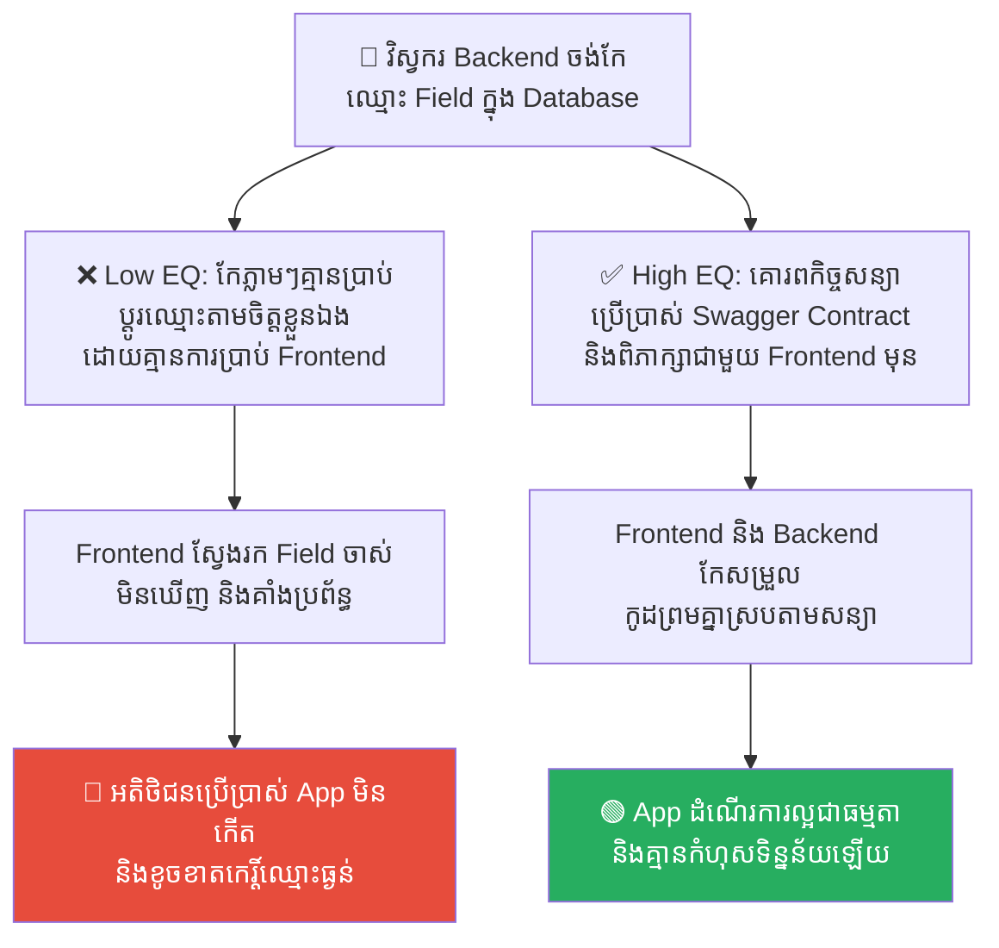
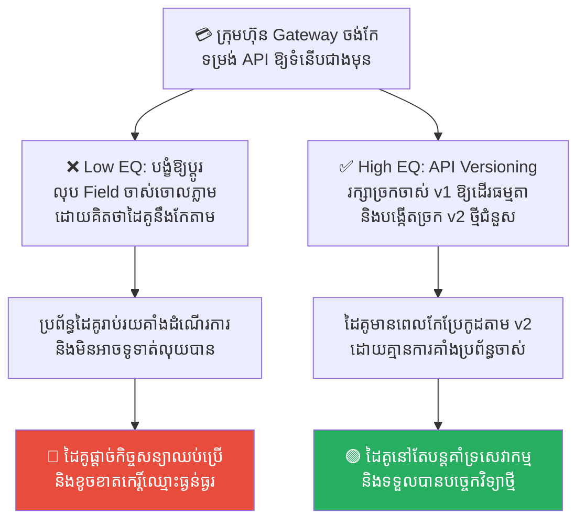
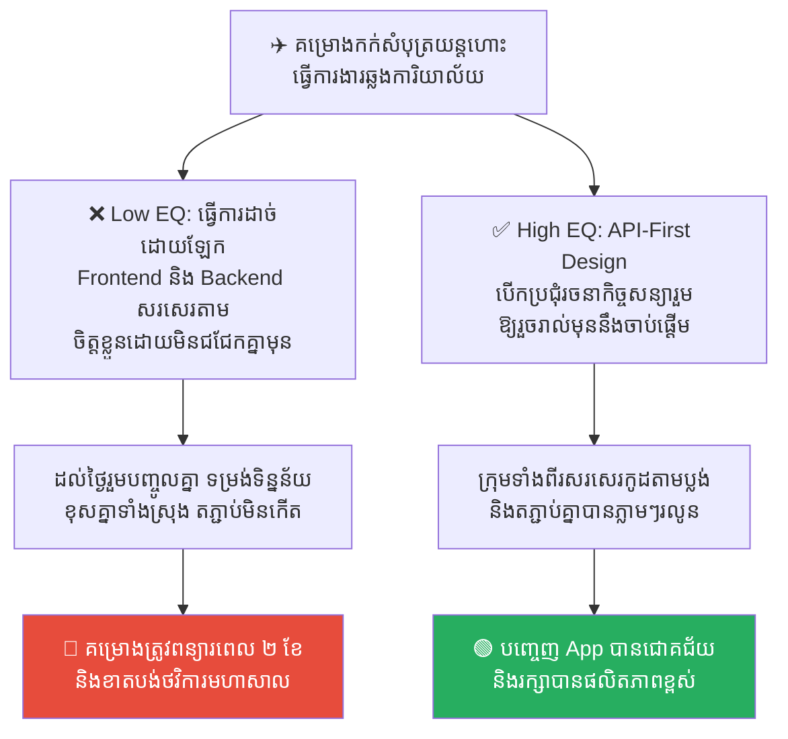
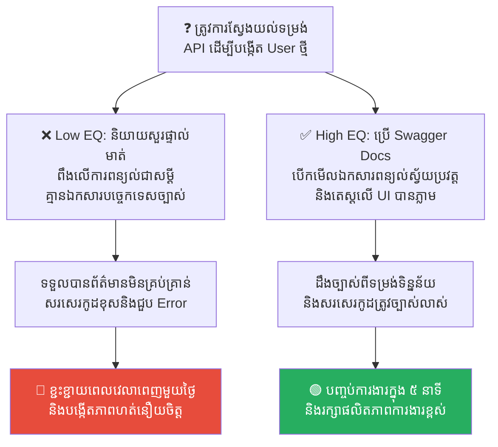
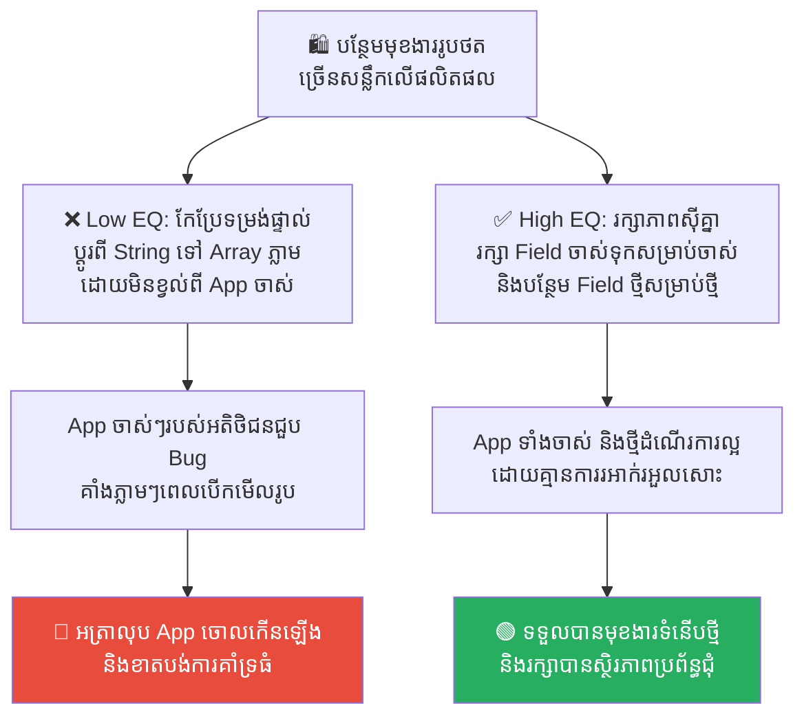

# The Tower of Babel: Cross-Team Communication and API Contracts (ប៉មបាបិល៖ ការប្រាស្រ័យទាក់ទងឆ្លងក្រុម និងកិច្ចសន្យា API)

**Author:** ichamrong  
**Date:** 2026-05-17  
**Tags:** #system-architecture #api-contracts #conways-law #communication #tower-of-babel  
**Category:** Concepts  
**Read Time:** ~15 min  

---

## 📌 មាតិកា (Table of Contents)
- [លំនាំបញ្ហា (The Pattern)](#លំនាំបញ្ហា-the-pattern)
- [១. បញ្ហា៖ ហេតុអ្វីបានជាមហាគម្រោងត្រូវដួលរលំដោយសារភាសាខុសគ្នា? (The Issue: The Confusion of Tongues in Tech)](#១-បញ្ហា-ហេតុអ្វីបានជាមហាគម្រោងត្រូវដួលរលំដោយសារភាសាខុសគ្នា-the-issue-the-confusion-of-tongues-in-tech)
- [២. ឧទាហរណ៍ជាក់ស្តែងក្នុងពិភពពិត (Real World Examples)](#២-ឧទាហរណ៍ជាក់ស្តែងក្នុងពិភពពិត)
  - [ឧទាហរណ៍ទី ១ — ការផ្លាស់ប្តូរទម្រង់ទិន្នន័យពីក្រោយខ្នង (Frontend/Backend Field Name Mismatch)](#ឧទាហរណ៍ទី-១-ការផ្លាស់ប្តូរទម្រង់ទិន្នន័យពីក្រោយខ្នង-frontendbackend-field-name-mismatch)
  - [ឧទាហរណ៍ទី ២ — ការផ្លាស់ប្តូរច្រកទូទាត់លុយរបស់ភាគីទីបី (Broken Third-Party Integration)](#ឧទាហរណ៍ទី-២-ការផ្លាស់ប្តូរច្រកទូទាត់លុយរបស់ភាគីទីបី-broken-third-party-integration)
  - [ឧទាហរណ៍ទី ៣ — ក្រុមការងារអភិវឌ្ឍន៍ដាច់ដោយឡែកពីគ្នា (Siloed Teams & No API-First Design)](#ឧទាហរណ៍ទី-៣-ក្រុមការងារអភិវឌ្ឍន៍ដាច់ដោយឡែកពីគ្នា-siloed-teams-no-api-first-design)
  - [ឧទាហរណ៍ទី ៤ — ការពឹងផ្អែកលើការនិយាយប្រាប់ជាជាងឯកសារ (Oral Specifications vs. Automated OpenAPI Docs)](#ឧទាហរណ៍ទី-៤-ការពឹងផ្អែកលើការនិយាយប្រាប់ជាជាងឯកសារ-oral-specifications-vs-automated-openapi-docs)
  - [ឧទាហរណ៍ទី ៥ — ការផ្លាស់ប្តូរប្រព័ន្ធដែលប៉ះពាល់ដល់របស់ចាស់ (Breaking API Changes vs. Semantic Versioning)](#ឧទាហរណ៍ទី-៥-ការផ្លាស់ប្តូរប្រព័ន្ធដែលប៉ះពាល់ដល់របស់ចាស់-breaking-api-changes-vs-semantic-versioning)
- [៣. កត្តាជម្រុញ៖ ច្បាប់ខនវេយ៍ និងការខ្វះកិច្ចសហការ (The Aggravator: Conway's Law & Silo Culture)](#៣-កត្តាជម្រុញ-ច្បាប់ខនវេយ៍-និងការខ្វះកិច្ចសហការ-the-aggravator-conways-law-silo-culture)
- [៤. ដំណោះស្រាយទូទៅ៖ របៀបសាងសង់ភាសារួមតាម API Contracts (The General Solution: Establishing API Contracts)](#៤-ដំណោះស្រាយទូទៅ-របៀបសាងសង់ភាសារួមតាម-api-contracts-the-general-solution-establishing-api-contracts)
- [សេចក្តីសន្និដ្ឋាន (Conclusion)](#សេចក្តីសន្និដ្ឋាន-conclusion)
- [Related Posts](#related-posts)

---

## លំនាំបញ្ហា (The Pattern)

នៅក្នុងវិស័យវិស្វកម្មកម្មវិធី (Software Engineering) និងការគ្រប់គ្រងស្ថាប័ន មានការពិតមួយដ៏លាក់កំបាំង៖ 

> 💡 **«គម្រោងបច្ចេកវិទ្យាដ៏ធំមហិមាភាគច្រើនដែលបរាជ័យ មិនមែនបរាជ័យដោយសារតែកង្វះបច្ចេកវិទ្យា ឬកង្វះអ្នកពូកែនោះឡើយ ប៉ុន្តែវាបរាជ័យដោយសារតែកង្វះការប្រាស្រ័យទាក់ទងគ្នា (Communication Breakdown)។»**

នៅពេលដែលក្រុមការងារមានគ្នាកាន់តែច្រើន ហើយបែងចែកជានាយកដ្ឋានផ្សេងៗគ្នា ពួកគេនឹងចាប់ផ្តើមនិយាយភាសាខុសៗគ្នា។ បាតុភូតនេះ ត្រូវបានឆ្លុះបញ្ចាំងយ៉ាងល្អឥតខ្ចោះ តាមរយៈរឿងព្រេងព្រះគម្ពីរដ៏ល្បីល្បាញបំផុតមួយ គឺរឿង **ប៉មបាបិល (The Tower of Babel)**។

មនុស្សជាតិកាលពីសម័យបុរាណ មានភាសាតែមួយ និងនិយាយស្តាប់គ្នាបានយ៉ាងល្អឥតខ្ចោះ។ ពួកគេបានសហការគ្នាដើម្បីសាងសង់មហាគំរោងមួយ គឺ «ប៉មបាបិល» ឱ្យខ្ពស់ទៅដល់ឋានសួគ៌ ដើម្បីបង្ហាញពីអំណាចរបស់ខ្លួន។ ព្រះជាម្ចាស់បានឃើញដូច្នោះ ក៏បានដាក់ទណ្ឌកម្មដោយការ **«ផ្លាស់ប្តូរភាសារបស់ពួកគេឱ្យទៅជាខុសៗគ្នា»** ភ្លាមៗ។ 

ជាងសំណង់សុំដីឥដ្ឋ តែអ្នកយាមហុចកំបោរឱ្យ ជាងឈើសុំឈើ តែអ្នកជំនួយហុចដែកឱ្យ។ ដោយសារតែការភាន់ច្រឡំនៃភាសា និងការស្តាប់គ្នាលែងបាន គម្រោងសាងសង់ប៉មបាបិលក៏ត្រូវជាប់គាំង និងដួលរលំទៅវិញជាស្ថាពរ។

នៅក្នុងពិភពឌីជីថល ប៉មបាបិលកើតឡើងជារៀងរាល់ថ្ងៃនៅពេលដែលក្រុមការងារនីមួយៗអភិវឌ្ឍន៍កម្មវិធីដោយប្រើប្រាស់ភាសា និងទម្រង់យល់ឃើញខុសៗគ្នា ដោយគ្មានកិច្ចព្រមព្រៀងរួម។

---

## ១. បញ្ហា៖ ហេតុអ្វីបានជាមហាគម្រោងត្រូវដួលរលំដោយសារភាសាខុសគ្នា? (The Issue: The Confusion of Tongues in Tech)

នៅក្នុងក្រុមហ៊ុនបច្ចេកវិទ្យា «ការភ័ន្តច្រឡំនៃភាសា» កើតឡើងជារៀងរាល់ថ្ងៃ៖
*   **Frontend Team** និយាយភាសា UI/UX, React, JavaScript, និង JSON Payload។
*   **Backend Team** និយាយភាសា Database Schemas, API Endpoints, ស្ថិរភាព Server និង SQL queries។
*   **Data Science Team** និយាយភាសា Python, Jupyter Notebooks, Data Pipelines, និង ML Models។

នៅពេលដែលប្រព័ន្ធបច្ចេកវិទ្យាកាន់តែស្មុគស្មាញ ប្រសិនបើយើងមិនមាន «ភាសាកណ្តាល» មួយដែលគ្រប់គ្នាត្រូវគោរពតាមយ៉ាងតឹងរ៉ឹងបំផុតនោះទេ ក្រុមនីមួយៗនឹងសាងសង់ប្រព័ន្ធការងារតាមតែគំនិតខ្លួនឯង។ 

 Frontend យល់ច្រឡំពីទម្រង់ទិន្នន័យរបស់ Backend, Backend កែសម្រួលកូដពីក្រោយខ្នងដោយមិនបានប្រាប់ Frontend មុន។ លទ្ធផលគឺ ប្រព័ន្ធនឹងជួបកំហុសរដុប បាក់ស្រុតចុះ ហើយសហការីចាប់ផ្តើមចង្អុលមុខចោទប្រកាន់ និងឈ្លោះប្រកែកគ្នា មិនខុសពីរឿងរ៉ាវរបស់ប៉មបាបិលឡើយ។

---

## ២. ឧទាហរណ៍ជាក់ស្តែងក្នុងពិភពពិត

សូមពិនិត្យមើល **ឧទាហរណ៍ជាក់ស្តែងចំនួន ៥** បង្ហាញពីរបៀបដែលកង្វះការប្រាស្រ័យទាក់ទងគ្នាបំផ្លាញប្រព័ន្ធ និងវិធីសាស្ត្រដោះស្រាយ៖

---

### ឧទាហរណ៍ទី ១ — ការផ្លាស់ប្តូរទម្រង់ទិន្នន័យពីក្រោយខ្នង (Frontend/Backend Field Name Mismatch)

**ស្ថានភាព៖** ក្រុមហ៊ុនកំពុងដំណើរការ App ទូរស័ព្ទដៃមួយ។ ថ្ងៃមួយ វិស្វករ Backend ម្នាក់បានសម្រេចចិត្តប្តូរឈ្មោះ Field នៅក្នុង Database ពី `user_phone` ទៅជា `phoneNumber` ដើម្បីឱ្យមើលទៅស្អាត និងមានរបៀបរៀបរយជាងមុន។

*   **សកម្មភាពអសកម្ម / Low EQ / កំហុសឆ្គង (ភាសាខុសគ្នា)៖** Backend កែសម្រួលទិន្នន័យ និង Deploy ទៅកាន់ Production ភ្លាមៗដោយគ្មានការប្រាប់ដំណឹង ឬការសរសេរកិច្ចសន្យារួមជាមួយក្រុម Frontend ឡើយ។ នៅព្រឹកបន្ទាប់ អតិថិជនរាប់ម៉ឺននាក់បើក App មក ស្រាប់តែមិនអាចមើលឃើញលេខទូរស័ព្ទរបស់ខ្លួន និងមិនអាចទូទាត់លុយបាន ព្រោះ Frontend នៅតែស្វែងរកពាក្យ `user_phone` ដដែល។
*   **សកម្មភាពស្ថាបនា / High EQ / ដំណោះស្រាយ (ភាសារួម)៖** អនុវត្ត **API Contract (Swagger/OpenAPI Specification)**។ មុននឹងកែប្រែកូដ Backend និង Frontend ត្រូវតែព្រមព្រៀងលើឯកសារសន្យារួម (Contract File)។ រាល់ការផ្លាស់ប្តូរត្រូវតែមានការយល់ព្រមពីភាគីទាំងសងខាង និងឆ្លងកាត់ការតេស្តស្វ័យប្រវត្ត (Contract Testing) មុននឹងឡើង Server។
*   **លទ្ធផល៖** ការកែកូដតាមចិត្តដោយគ្មានសន្យានាំឱ្យ App គាំង និងខាតបង់ចំណូលធំ។ ការប្រើប្រាស់ API Contract ជួយការពារកំហុសទិន្នន័យ និងរក្សាការភ្ជាប់ប្រព័ន្ធបានយ៉ាងល្អឥតខ្ចោះ។

---

### ឧទាហរណ៍ទី ២ — ការផ្លាស់ប្តូរច្រកទូទាត់លុយរបស់ភាគីទីបី (Broken Third-Party Integration)

**ស្ថានភាព៖** ក្រុមហ៊ុនសរសេរប្រព័ន្ធទូទាត់ប្រាក់ (Payment Gateway) មួយ ដែលមានក្រុមហ៊ុនដៃគូរាប់រយ (Clients) កំពុងតភ្ជាប់ប្រើប្រាស់ API របស់ខ្លួនជារៀងរាល់ថ្ងៃ។

*   **សកម្មភាពអសកម្ម / Low EQ / កំហុសឆ្គង (ភាសាខុសគ្នា)៖** ក្រុមហ៊ុនបានបញ្ចេញ API Version ថ្មីមួយ ដោយលុបចោល Field `client_id` ចោល និងជំនួសដោយ `app_id` វិញ ដោយសន្និដ្ឋានថាដៃគូទាំងអស់នឹងដឹងខ្លួន និងកែប្រែកូដតាម។ គ្រាន់តែបញ្ចេញភ្លាម ប្រព័ន្ធទូទាត់លុយរបស់ក្រុមហ៊ុនដៃគូរាប់រយត្រូវគាំងលែងដើរទាំងអស់ ធ្វើឱ្យពួកគេខឹងសម្បារ និងនាំគ្នាផ្តាច់កិច្ចសន្យាឈប់ប្រើប្រាស់សេវាកម្ម។
*   **សកម្មភាពស្ថាបនា / High EQ / ដំណោះស្រាយ (ភាសារួម)៖** អនុវត្ត **Backward Compatibility & Semantic Versioning**។ ហាមដាច់ខាតការលុប ឬកែប្រែ API ដែលកំពុងដំណើរការចោលភ្លាមៗ។ ត្រូវបង្កើតជា Version ថ្មីដាច់ដោយឡែក (ដូចជា `/api/v2/` សម្រាប់ `app_id`) ខណៈពេលដែលរក្សាទុក `/api/v1/` ឱ្យដំណើរការធម្មតាសម្រាប់ដៃគូចាស់ៗ និងប្រកាសជូនដំណឹងជាមុនរយៈពេល ៦ ខែ ដើម្បីឱ្យពួកគេមានពេលផ្លាស់ប្តូរ។
*   **លទ្ធផល៖** ការផ្លាស់ប្តូរដោយបង្ខំនាំឱ្យបាត់បង់អតិថិជន និងបំផ្លាញទំនុកចិត្តទីផ្សារទាំងស្រុង។ ការប្រើប្រាស់ API Versioning ជួយរក្សាស្ថិរភាពអាជីវកម្ម និងដៃគូសហការរយៈពេលវែង។

---

### ឧទាហរណ៍ទី ៣ — ក្រុមការងារអភិវឌ្ឍន៍ដាច់ដោយឡែកពីគ្នា (Siloed Teams & No API-First Design)

**ស្ថានភាព៖** ក្រុមហ៊ុន Startup មួយចង់បង្កើតមុខងារថ្មី «កក់សំបុត្រយន្តហោះ»។ ពួកគេមានក្រុមការងារពីរដាច់ដោយឡែកពីគ្នា៖ ក្រុម Frontend នៅការិយាល័យភ្នំពេញ និងក្រុម Backend នៅការិយាល័យសិង្ហបុរី។

*   **សកម្មភាពអសកម្ម / Low EQ / កំហុសឆ្គង (ភាសាខុសគ្នា)៖** ក្រុមទាំងពីរធ្វើការងាររៀងៗខ្លួនដោយមិនបានជជែកគ្នាឡើយ។ ក្រុម Frontend អង្គុយសរសេរកូដរចនាទំព័ររហូតដល់ស្អាតឥតខ្ចោះ ឯក្រុម Backend សរសេរកូដរៀបចំ Database តាមរបៀបខ្លួនឯង។ ដល់ថ្ងៃ Deadline បញ្ជូនការងារមកបញ្ចូលគ្នា (Integration Day) ពួកគេស្រាប់តែដឹងថា ទម្រង់ទិន្នន័យគឺខុសគ្នាស្រឡះ មិនអាចតភ្ជាប់គ្នាបានឡើយ បង្កជាភាពចលាចល និងត្រូវពន្យារពេល Deadline អស់រយៈពេល ២ ខែ។
*   **សកម្មភាពស្ថាបនា / High EQ / ដំណោះស្រាយ (ភាសារួម)៖** អនុវត្ត **API-First Design**។ មុននឹងវិស្វករម្នាក់ៗសរសេរកូដសូម្បីតែមួយបន្ទាត់ ក្រុម Frontend និង Backend ត្រូវតែបើកប្រជុំរួមគ្នាដើម្បីរចនាកិច្ចសន្យា API (API Spec Draft) ឱ្យរួចរាល់ជាមុន។ ពេលសន្យារួចរាល់ ទើបក្រុមការងារនីមួយៗអាចបំបែកគ្នាទៅសរសេរកូដតាមតួនាទីខ្លួនដោយគ្មានការភាន់ច្រឡំ។
*   **លទ្ធផល៖** ការធ្វើការដាច់ដោយឡែកដោយគ្មានការរៀបចំព្យួរ API នាំឱ្យគម្រោងបរាជ័យ និងខាតបង់ពេលវេលាធំ។ ការរៀបចំ API-First ជួយឱ្យការតភ្ជាប់ប្រព័ន្ធរលូន និងបញ្ចប់ការងារទាន់ពេលវេលា។

---

### ឧទាហរណ៍ទី ៤ — ការពឹងផ្អែកលើការនិយាយប្រាប់ជាជាងឯកសារ (Oral Specifications vs. Automated OpenAPI Docs)

**ស្ថានភាព៖** វិស្វករម្នាក់ចង់ដឹងពីរបៀបហៅច្រក API ដើម្បីបង្កើតគណនីអតិថិជនថ្មី។

*   **សកម្មភាពអសកម្ម / Low EQ / កំហុសឆ្គង (ភាសាខុសគ្នា)៖** វិស្វករនោះបានដើរទៅសួរវិស្វករម្នាក់ទៀតដែលសរសេរកូដនោះរួច៖ *«តើច្រក API នោះគួរហៅដោយរបៀបណា?»*។ វិស្វករនោះបានប្រាប់ជាសម្តី (Oral Specs) យ៉ាងលឿន៖ *«ផ្ញើតែ email និង password ទៅគឺដើរហើយ!»*។ ប៉ុន្តែ គាត់បានភ្លេចប្រាប់ថា ប្រព័ន្ធត្រូវការលេខទូរស័ព្ទ និងកូដប្រទេសផងដែរ ធ្វើឱ្យវិស្វករដំបូងសរសេរកូដខុស និងជួប Error ពេញមួយថ្ងៃ ព្រោះគ្មានឯកសារផ្លូវការ។
*   **សកម្មភាពស្ថាបនា / High EQ / ដំណោះស្រាយ (ភាសារួម)៖** អនុវត្ត **Automated OpenAPI Documentation (Swagger UI)**។ រាល់កូដ API ដែលត្រូវបានសរសេរ ត្រូវតែមានការបង្កើតឯកសារពន្យល់ដោយស្វ័យប្រវត្តិ (Auto-generated Documentation)។ វិស្វករគ្រាន់តែបើកមើលគេហទំព័រ Swagger គឺអាចដឹងច្បាស់ពីទម្រង់ និងអាចសាកល្បងហៅតេស្ត (Try it out) បានភ្លាមៗដោយមិនបាច់សួរនរណាម្នាក់ឡើយ។
*   **លទ្ធផល៖** ការពឹងផ្អែកលើការចងចាំ និងពាក្យសម្តីមនុស្សនាំឱ្យកើតមានកំហុស និងខាតបង់ពេលវេលាការងារឥតប្រយោជន៍។ ការប្រើប្រាស់ប្រព័ន្ធ Swagger ជួយកាត់បន្ថយជម្លោះ និងបង្កើនល្បឿនអភិវឌ្ឍន៍គម្រោង។

---

### ឧទាហរណ៍ទី ៥ — ការផ្លាស់ប្តូរប្រព័ន្ធដែលប៉ះពាល់ដល់របស់ចាស់ (Breaking API Changes vs. Semantic Versioning)

**ស្ថានភាព៖** ក្រុមហ៊ុនចង់ផ្លាស់ប្តូរទម្រង់ API ព័ត៌មានផលិតផល ដើម្បីបន្ថែមមុខងារ «រូបថតច្រើនសន្លឹក»។

*   **សកម្មភាពអសកម្ម / Low EQ / កំហុសឆ្គង (ភាសាខុសគ្នា)៖** វិស្វករបានផ្លាស់ប្តូរទម្រង់ទិន្នន័យពី `image: "http://..."` (String ធម្មតា) ទៅជា `images: ["http://...", "http://..."]` (Array នៃខ្សែអក្សរ) នៅក្នុងច្រក API ដដែលភ្លាមៗ។ App ចាស់ៗរបស់អតិថិជនដែលមិនទាន់បាន Update ជួបបញ្ហាគាំងដួលរលំភ្លាមៗនៅពេលបើកមើលទំព័រផលិតផល ព្រោះពួកគេមិនដឹងពីការផ្លាស់ប្តូរទម្រង់នេះ។
*   **សកម្មភាពស្ថាបនា / High EQ / ដំណោះស្រាយ (ភាសារួម)៖** អនុវត្ត **Semantic Versioning & Non-Breaking API Design**។ ជំនួសឱ្យការលុប Field ចាស់ វិស្វករត្រូវរក្សាទុក `image: "http://..."` (សម្រាប់ App ចាស់) និងបន្ថែម Field ថ្មី `images: [...]` (សម្រាប់ App ថ្មី) រួមគ្នា។ ប្រសិនបើយើងត្រូវតែលុបរបស់ចាស់ ត្រូវតែបង្កើតជា API Version ថ្មីដាច់ដោយឡែក។
*   **លទ្ធផល៖** ការបញ្ចេញកូដថ្មីដែលបំផ្លាញមុខងារចាស់ៗ នាំឱ្យអតិថិជនបាត់បង់ជំនឿចិត្ត និងបោះបង់ចោល App។ ការរចនាកូដដែលបត់បែន និងស៊ីគ្នាជាមួយរបស់ចាស់ជួយធានាស្ថិរភាពប្រព័ន្ធ និងរក្សាទំនុកចិត្តអតិថិជន។

---

## ៣. កត្តាជម្រុញ៖ ច្បាប់ខនវេយ៍ និងការខ្វះកិច្ចសហការ (The Aggravator: Conway's Law & Silo Culture)

ហេតុអ្វីបានជាស្ថាប័នការងាររបស់យើងងាយនឹងធ្លាក់ចូលក្នុងប្រវត្តិសាស្ត្រប៉មបាបិលខ្លាំងម្ល៉េះ? កត្តាជម្រុញរួមមាន៖

1.  **ច្បាប់របស់ខនវេយ៍ (Conway's Law)៖** ច្បាប់បច្ចេកវិទ្យាចែងថា៖ *«រចនាសម្ព័ន្ធកូដ (Software Architecture) របស់ក្រុមហ៊ុន នឹងឆ្លុះបញ្ចាំងពីរបៀបដែលក្រុមហ៊ុននោះមានការប្រាស្រ័យទាក់ទងគ្នា។»* ប្រសិនបើនាយកដ្ឋាន Frontend និង Backend មិនសូវនិយាយរកគ្នា ឬមានទំនាស់ផ្ទៃក្នុង កូដរបស់ប្រព័ន្ធក៏នឹងមានជម្លោះ និងជំពាក់វាក់វិន (Spaghetti) ដូចគ្នា។
2.  **វប្បធម៌ការងារដាច់ដោយឡែកពីគ្នា (Silo Culture)៖** នៅពេលក្រុមការងារនីមួយៗគិតតែពី KPIs ផ្ទាល់ខ្លួន និងខ្វះកិច្ចសហការឆ្លងផ្នែក ពួកគេនឹងចាប់ផ្តើមបង្កើតភាសា និងបច្ចេកវិទ្យាផ្ទាល់ខ្លួនដែលមិនស៊ីគ្នាជាមួយផ្នែកដទៃ។
3.  **ភាពខ្ជិលក្នុងការសរសេរឯកសារ (Documentation Laziness)៖** វិស្វករភាគច្រើនចូលចិត្តតែការសរសេរកូដ តែខ្ជិលសរសេរឯកសារពន្យល់កូដ (API documentation)។ កាលណាគ្មានឯកសាររួម មនុស្សជាតិក៏ចាប់ផ្តើមនិយាយភាសាខុសគ្នាជារៀងរាល់ថ្ងៃ។

---

## ៤. ដំណោះស្រាយទូទៅ៖ របៀបសាងសង់ភាសារួមតាម API Contracts (The General Solution: Establishing API Contracts)

ដើម្បីកម្ចាត់ភាពចលាចលនៃប៉មបាបិល និងសាងសង់មហាគម្រោងបានជោគជ័យ ចូរអនុវត្តគោលការណ៍សំខាន់ៗ ៣ យ៉ាង៖

1.  **ប្រកាន់ខ្ជាប់គោលការណ៍ API-First Design៖** ហាមដាច់ខាតការសរសេរកូដដោយគ្មានការជជែកគ្នាមុន។ ត្រូវតែមានកិច្ចប្រជុំរួមគ្នាដើម្បីរចនាកិច្ចសន្យា API (API Spec) ឱ្យរួចរាល់ជាមុន និងយកវាធ្វើជា **Single Source of Truth (ប្រភពការពិតតែមួយ)** សម្រាប់គ្រប់ក្រុមការងារ។
2.  **ប្រើប្រាស់ឧបករណ៍វាស់ស្ទង់សន្យាស្វ័យប្រវត្ត (Automated Contract Testing)៖** ប្រើប្រាស់ឧបករណ៍ (ដូចជា Pact ឬ Postman API Testing) ដើម្បីរត់តេស្តស្វ័យប្រវត្តជារៀងរាល់យប់ ធានាថា រាល់កូដថ្មីរបស់ Backend មិនបានកែប្រែខុសពីកិច្ចសន្យាដែលបានព្រមព្រៀងជាមួយ Frontend ឡើយ។
3.  **កសាងវប្បធម៌ការងារសហការឆ្លងផ្នែក (Cross-Functional Squads)៖** បំបែកនាយកដ្ឋានដាច់ដោយឡែកចោល រួចបង្កើតជាក្រុមការងារចម្រុះ (Cross-functional Squads) ដែលរួមមាន Frontend, Backend, Product Manager និង QA ធ្វើការងារអង្គុយក្បែរគ្នា ដើម្បីបង្កើនល្បឿន និងភាពស្មោះត្រង់នៃការទំនាក់ទំនង។

---

## សេចក្តីសន្និដ្ឋាន (Conclusion)

**ប៉មបាបិល និងកិច្ចសន្យា API (API Contracts)** បង្រៀនយើងថា ប្រាជ្ញាដ៏ពិតប្រាកដមិនមែនជាការសរសេរកូដដែលឆ្លាតវៃបំផុតម្នាក់ឯងនោះទេ ប៉ុន្តែវាគឺសមត្ថភាពក្នុងការ **«កសាងការប្រាស្រ័យទាក់ទងដ៏រលូន បង្កើតភាសារួមដែលគ្រប់គ្នាត្រូវគោរពតាម និងសហការគ្នាដើម្បីសាងសង់មហាប្រព័ន្ធបច្ចេកវិទ្យាដ៏អស្ចារ្យបំផុតដោយគ្មានភាពច្របូកច្របល់»**។

ចូរចងចាំថា៖ **«មុននឹងចាប់ផ្តើមសាងសង់កំពែងប៉ម ចូរព្រមព្រៀងគ្នាលើភាសាសង់ជាមុនសិន។»**

---

## Related Posts

*   **[41 The Tower of Babel and the Confusion of Tongues](../parables/41-the-tower-of-babel.md)** — រឿងប្រៀបធៀបព្រះគម្ពីរ អំពីការដួលរលំនៃមហាគម្រោងរបស់មនុស្សជាតិដោយសារតែបញ្ហាភាសាចម្លែក។
*   **[13 Single Source of Truth and Knowledge Silos](./13-single-source-of-truth-and-knowledge-silos.md)** — របៀបដែលការ Hoarding ចំណេះដឹង និងកង្វះការសរសេរឯកសារបំផ្លាញស្ថាប័នការងារ។

---

*Last updated: 2026-05-26*
