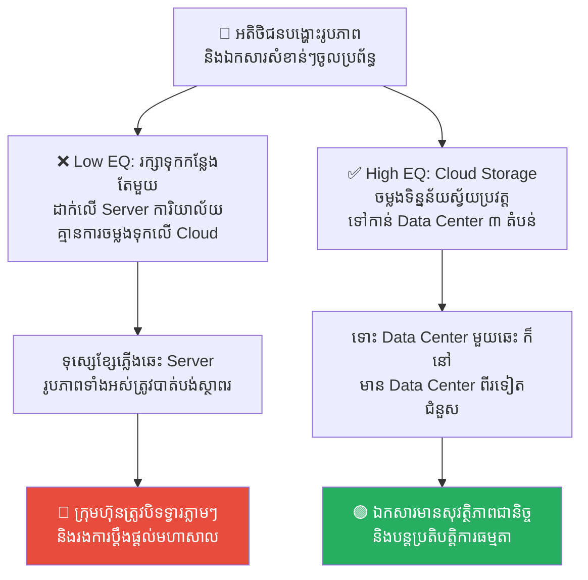
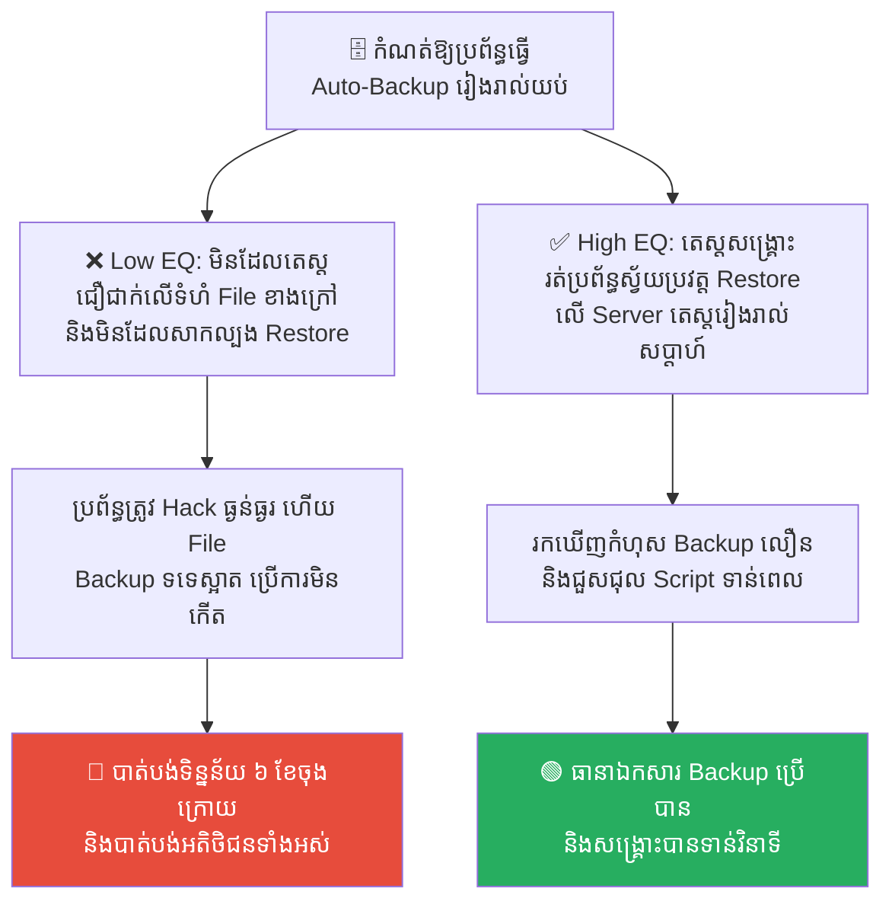
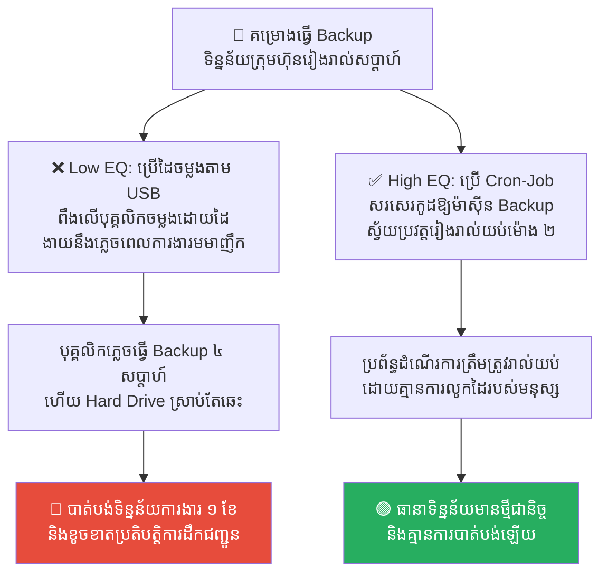
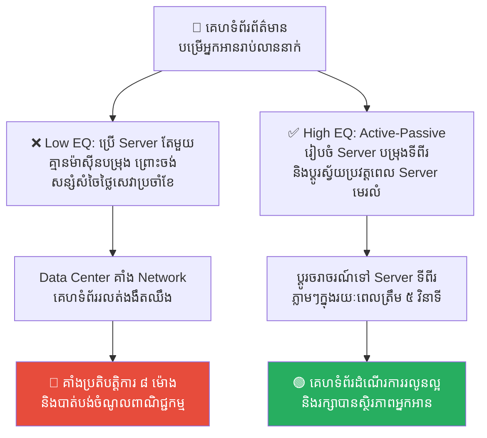
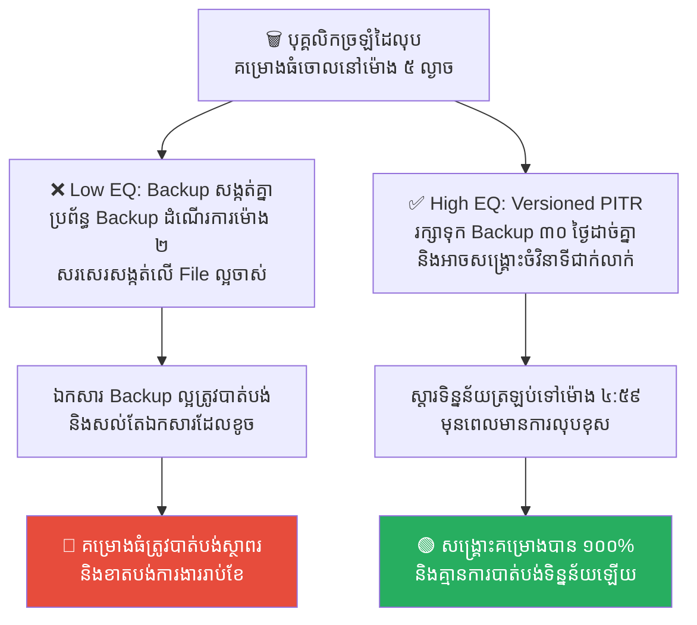

# The Library of Alexandria: Data Redundancy and Disaster Recovery (បណ្ណាល័យអាឡិចសាន់ឌ្រី៖ ការថតចម្លងទិន្នន័យ និងការសង្គ្រោះបន្ទាន់)

**Author:** ichamrong  
**Date:** 2026-05-17  
**Tags:** #disaster-recovery #data-redundancy #backups #single-point-of-failure #alexandria  
**Category:** Concepts  
**Read Time:** ~15 min  

---

## 📌 មាតិកា (Table of Contents)
- [លំនាំបញ្ហា (The Pattern)](#លំនាំបញ្ហា-the-pattern)
- [១. បញ្ហា៖ ហេតុអ្វីបានជាកំពែងការពារតែមួយមិនគ្រប់គ្រាន់? (The Issue: The Tragedy of a Single Point of Failure)](#១-បញ្ហា-ហេតុអ្វីបានជាកំពែងការពារតែមួយមិនគ្រប់គ្រាន់-the-issue-the-tragedy-of-a-single-point-of-failure)
- [២. ឧទាហរណ៍ជាក់ស្តែងក្នុងពិភពពិត (Real World Examples)](#២-ឧទាហរណ៍ជាក់ស្តែងក្នុងពិភពពិត)
  - [ឧទាហរណ៍ទី ១ — ការរក្សាទុកឯកសារលើ Server តែមួយគត់ (Single-Server Data Storage vs. Multi-Region Replication)](#ឧទាហរណ៍ទី-១-ការរក្សាទុកឯកសារលើ-server-តែមួយគត់-single-server-data-storage-vs-multi-region-replication)
  - [ឧទាហរណ៍ទី ២ — ការធ្វើ Backup តែមិនដែលសាកល្បងសង្គ្រោះ (Untested Backups vs. Automated Recovery Audits)](#ឧទាហរណ៍ទី-២-ការធ្វើ-backup-តែមិនដែលសាកល្បងសង្គ្រោះ-untested-backups-vs-automated-recovery-audits)
  - [ឧទាហរណ៍ទី ៣ — ការធ្វើ Backup ដោយដៃតាម USB (Manual USB Backups vs. Automated Cron-Job Backups)](#ឧទាហរណ៍ទី-៣-ការធ្វើ-backup-ដោយដៃតាម-usb-manual-usb-backups-vs-automated-cron-job-backups)
  - [ឧទាហរណ៍ទី ៤ — កង្វះម៉ាស៊ីនបម្រុងពេលជួបគ្រោះថ្នាក់ (No Hot Standby vs. Active-Passive Failover)](#ឧទាហរណ៍ទី-៤-កង្វះម៉ាស៊ីនបម្រុងពេលជួបគ្រោះថ្នាក់-no-hot-standby-vs-active-passive-failover)
  - [ឧទាហរណ៍ទី ៥ — ការសរសេរកូដសង្កត់លើ Backup ចាស់ (Overwriting Yesterday's Backups vs. Point-in-Time Recovery)](#ឧទាហរណ៍ទី-៥-ការសរសេរកូដសង្កត់លើ-backup-ចាស់-overwriting-yesterdays-backups-vs-point-in-time-recovery)
- [៣. កត្តាជម្រុញ៖ គំនិតសន្សំសំចៃមិនត្រឹមត្រូវ និងភាពខ្ជិល (The Aggravator: Short-Sighted Cost-Cutting & Procrastination)](#៣-កត្តាជម្រុញ-គំនិតសន្សំសំចៃមិនត្រឹមត្រូវ-និងភាពខ្ជិល-the-aggravator-short-sighted-cost-cutting-procrastination)
- [៤. ដំណោះស្រាយទូទៅ៖ របៀបសាងសង់បណ្ណាល័យដែលមិនអាចឆេះបាន (The General Solution: Implementing Reliable Redundancy)](#៤-ដំណោះស្រាយទូទៅ-របៀបសាងសង់បណ្ណាល័យដែលមិនអាចឆេះបាន-the-general-solution-implementing-reliable-redundancy)
- [សេចក្តីសន្និដ្ឋាន (Conclusion)](#សេចក្តីសន្និដ្ឋាន-conclusion)
- [Related Posts](#related-posts)

---

## លំនាំបញ្ហា (The Pattern)

នៅក្នុងប្រវត្តិសាស្ត្រមនុស្សជាតិ **បណ្ណាល័យអាឡិចសាន់ឌ្រី (The Library of Alexandria)** នៅក្នុងប្រទេសអេហ្ស៊ីប គឺជាអច្ឆរិយៈដ៏អស្ចារ្យបំផុតនៃការប្រមូលផ្តុំចំណេះដឹង។ វាផ្ទុកទៅដោយរមូរឯកសារ សៀវភៅ និងស្នាដៃអក្សរសិល្ប៍វិទ្យាសាស្ត្រ និងទស្សនវិជ្ជាជាង ៧ សែនរមូរ ដែលជាខួរក្បាល និងប្រាជ្ញារបស់មនុស្សជាតិរាប់ពាន់ឆ្នាំ។

ប៉ុន្តែ មហន្តរាយដ៏ធំបំផុតបានកើតឡើងនៅឆ្នាំ ៤៨ មុនគស។ នៅពេលដែលសង្រ្គាមបានផ្ទុះឡើង ភ្លើងបានឆាបឆេះយ៉ាងសន្ធោសន្ធៅ និងរាលដាលមកបំផ្លាញបណ្ណាល័យអាឡិចសាន់ឌ្រីទាំងស្រុង។ ចំណេះដឹង វិទ្យាសាស្ត្រ និងទស្សនវិជ្ជាជាច្រើនសតវត្ស ត្រូវបានប្រែក្លាយទៅជាផេះផង់ត្រឹមមួយយប់ និងបាត់បង់ពីពិភពលោកជារៀងរហូត ព្រោះតែ **«រមូរឯកសារទាំងនោះ គឺមានតែមួយច្បាប់គត់នៅលើលោក និងត្រូវបានរក្សាទុកក្នុងអគារតែមួយគត់»**។

នៅក្នុងវិស័យបច្ចេកវិទ្យា និងការគ្រប់គ្រងទិន្នន័យ (Data Management) ព្រឹត្តិការណ៍នេះបង្រៀនយើងពីគ្រោះមហន្តរាយដ៏ធំបំផុត ដែលហៅថា **Single Point of Failure (ចំណុចងាយរងគ្រោះតែមួយគត់)**។ 

ប្រសិនបើក្រុមហ៊ុនរបស់អ្នកលាក់ទុកទិន្នន័យស្នូលទាំងអស់នៅកន្លែងតែមួយ ដោយគ្មានការថតចម្លងបម្រុងទុកឱ្យបានត្រឹមត្រូវទេ នោះក្រុមហ៊ុនរបស់អ្នកកំពុងរស់នៅក្បែរភ្លើងដែលត្រៀមនឹងឆេះបណ្ណាល័យអាឡិចសាន់ឌ្រីជានិច្ច។

---

## ១. បញ្ហា៖ ហេតុអ្វីបានជាកំពែងការពារតែមួយមិនគ្រប់គ្រាន់? (The Issue: The Tragedy of a Single Point of Failure)

នៅក្នុងពិភពឌីជីថល ទិន្នន័យ (Data) គឺជាទ្រព្យសម្បត្តិដ៏មានតម្លៃបំផុតរបស់ក្រុមហ៊ុន។ ម៉ាស៊ីន Server អាចទិញថ្មីបាន កូដអាចសរសេរឡើងវិញបាន ប៉ុន្តែ **«ទិន្នន័យអតិថិជន និងគណនីហិរញ្ញវត្ថុដែលបាត់បង់ គឺបាត់បង់ជាស្ថាពរជារៀងរហូត»**។

ក្រុមហ៊ុនជាច្រើនបិទភ្នែកមិនមើលហានិភ័យ ដោយការសន្សំសំចៃលើប្រព័ន្ធផ្ទុកទិន្នន័យ ឬការបដិសេធមិនព្រមថតចម្លងទិន្នន័យទុកជាច្រើនកន្លែង (**Data Redundancy** & **Multi-Region Backups**)។ ពួកគេគិតថាប្រព័ន្ធការពារ Firewalls របស់ពួកគេរឹងមាំហើយ។ 

ប៉ុន្តែ គ្រោះមហន្តរាយមិនមែនកើតឡើងតែពី Hacker នោះទេ វាក៏អាចកើតឡើងពី គ្រោះធម្មជាតិ (ទឹកជំនន់, អគ្គិភ័យ), កំហុសបច្ចេកទេស Hard Drive ឆេះ ឬកំហុសរបស់មនុស្សដែលលុបទិន្នន័យខុស។ ប្រសិនបើគ្មានប្រព័ន្ធ **Disaster Recovery (ផែនការសង្គ្រោះបន្ទាន់)** ច្បាស់លាស់ទេ អាជីវកម្មទាំងមូលនឹងត្រូវរលាយសាបសូន្យក្នុងរយៈពេលប៉ុន្មាននាទី។

---

## ២. ឧទាហរណ៍ជាក់ស្តែងក្នុងពិភពពិត

សូមពិនិត្យមើល **ឧទាហរណ៍ជាក់ស្តែងចំនួន ៥** បង្ហាញពីរបៀបដែលកង្វះការចម្លងទិន្នន័យបំផ្លាញអាជីវកម្ម និងវិធីសាស្ត្រដោះស្រាយ៖

---

### ឧទាហរណ៍ទី ១ — ការរក្សាទុកឯកសារលើ Server តែមួយគត់ (Single-Server Data Storage vs. Multi-Region Replication)

**ស្ថានភាព៖** ក្រុមហ៊ុន Startup មួយ បានរក្សាទុកឯកសារសំខាន់ៗ និងរូបភាពផលិតផលទាំងអស់របស់អតិថិជននៅលើម៉ាស៊ីន Server តែមួយគត់នៅក្នុងការិយាល័យរបស់ខ្លួន។

*   **សកម្មភាពអសកម្ម / Low EQ / កំហុសឆ្គង (ច្បាប់តែមួយ)៖** ក្រុមហ៊ុនសន្និដ្ឋានថា Server នេះដំណើរការល្អណាស់ និងមិនខ្ជះខ្ជាយថវិកាទិញ Cloud Storage ឡើយ។ ថ្ងៃមួយ មានបញ្ហាទុស្សេខ្សែភ្លើង បណ្តាលឱ្យឆេះបន្ទប់ Server ទាំងស្រុង បំផ្លាញម៉ាស៊ីន Server នោះជាផេះផង់។ រាល់រូបភាព និងឯកសាររបស់អតិថិជនទាំងអស់ត្រូវបាត់បង់ជារៀងរហូត ធ្វើឱ្យក្រុមហ៊ុនត្រូវរងការប្តឹងផ្តល់ និងបិទទ្វារ។
*   **សកម្មភាពស្ថាបនា / High EQ / ដំណោះស្រាយ (ចម្លងច្រើនច្បាប់)៖** អនុវត្ត **Multi-Region Cloud Storage (ដូចជា AWS S3 with Replication)**។ រាល់ឯកសារដែលអតិថិជនបង្ហោះ ត្រូវតែរក្សាទុកនៅលើ Cloud និងមានការចម្លងទុកដោយស្វ័យប្រវត្តិទៅកាន់ Data Centers ផ្សេងគ្នាចំនួន ៣ ក្នុងតំបន់ផ្សេងគ្នា (Multi-Region Replication)។
*   **លទ្ធផល៖** ការទុករបស់កន្លែងតែមួយនាំឱ្យអាជីវកម្មរលាយទាំងស្រុងក្រោយគ្រោះថ្នាក់។ ការចម្លងទុកច្រើនតំបន់ជួយធានាសុវត្ថិភាពឯកសារ ១០០% ទោះបីជាមានការឆេះ Data Center មួយក៏ដោយ។

---

### ឧទាហរណ៍ទី ២ — ការធ្វើ Backup តែមិនដែលសាកល្បងសង្គ្រោះ (Untested Backups vs. Automated Recovery Audits)

**ស្ថានភាព៖** ក្រុមហ៊ុនសរសេរកម្មវិធី SaaS មួយ បានកំណត់ប្រព័ន្ធឱ្យធ្វើការចម្លង Database ទុក (Auto-Backup) ជារៀងរាល់យប់យ៉ាងទៀងទាត់។

*   **សកម្មភាពអសកម្ម / Low EQ / កំហុសឆ្គង (ច្បាប់តែមួយ)៖** ថ្នាក់ដឹកនាំមានភាពស្ងប់ចិត្តខ្លាំង ព្រោះឃើញឯកសារ Backup លោតឡើងរាល់ថ្ងៃ។ ប៉ុន្តែ ពួកគេធ្វេសប្រហែសមិនដែលសាកល្បងយកឯកសារ Backup នោះមកដំណើរការតេស្តសង្គ្រោះឡើងវិញ (Restore Test) ឡើយ។ ថ្ងៃមួយ ប្រព័ន្ធពិតត្រូវរងការ Hack ធ្ងន់ធ្ងរ។ ពេលក្រុមការងារយកឯកសារ Backup មកសង្គ្រោះ ទើបដឹងថា ឯកសារ Backup នោះមានទំហំ 0 KB (ទទេស្អាត) រយៈពេល ៦ ខែមកហើយ ដោយសារកូដសរសេរខុស Script ធ្វើឱ្យក្រុមហ៊ុនមិនអាចសង្គ្រោះទិន្នន័យបានឡើយ។
*   **សកម្មភាពស្ថាបនា / High EQ / ដំណោះស្រាយ (ចម្លងច្រើនច្បាប់)៖** អនុវត្ត **Automated Restore Audits (ការហាត់សមសង្គ្រោះស្វ័យប្រវត្ត)**។ រាល់សប្តាហ៍ ត្រូវមានប្រព័ន្ធស្វ័យប្រវត្តទាញយកឯកសារ Backup មកដំណើរការសាកល្បងនៅលើ Server តេស្ត (Staging Server) ដើម្បីផ្ទៀងផ្ទាត់ថាឯកសារនោះមានគុណភាពពិត និងអាចសង្គ្រោះបាន ១០០%។
*   **លទ្ធផល៖** ការធ្វើ Backup ដោយខ្វះការផ្ទៀងផ្ទាត់ នាំឱ្យកើតមាន «ជំនឿចិត្តខុសឆ្គង» ដែលបំផ្លាញប្រព័ន្ធពេលមានអាសន្ន។ ការហាត់សមសង្គ្រោះស្វ័យប្រវត្តជួយធានាថា រាល់ឯកសារ Backup ទាំងអស់គឺអាចប្រើការបានជានិច្ច។

---

### ឧទាហរណ៍ទី ៣ — ការធ្វើ Backup ដោយដៃតាម USB (Manual USB Backups vs. Automated Cron-Job Backups)

**ស្ថានភាព៖** ក្រុមហ៊ុនគ្រប់គ្រងទិន្នន័យដឹកជញ្ជូនមួយ ពឹងផ្អែកលើវិស្វករជាន់ខ្ពស់ម្នាក់ឱ្យធ្វើការចម្លងទិន្នន័យ Backup ដាក់ក្នុង External Hard Drive ជារៀងរាល់ថ្ងៃសុក្រ។

*   **សកម្មភាពអសកម្ម / Low EQ / កំហុសឆ្គង (ច្បាប់តែមួយ)៖** វិស្វកររវល់ការងារខ្លាំង ឬភ្លេចខ្លួន ក៏បានរំលងការធ្វើ Backup រយៈពេល ៤ សប្តាហ៍ជាប់ៗគ្នា ដោយគិតថា៖ *«ចាំថ្ងៃចន្ទចាំធ្វើក៏បាន ប្រព័ន្ធមិនងាយខូចទេ!»*។ ស្រាប់តែថ្ងៃសៅរ៍ សប្តាហ៍ទីបួន ម៉ាស៊ីន Server ជួបបញ្ហាឆេះ Hard Drive ធ្វើឱ្យក្រុមហ៊ុនត្រូវបាត់បង់ទិន្នន័យដឹកជញ្ជូន និងប្រាក់កម្រៃទាំងអស់ក្នុងរយៈពេល ១ ខែចុងក្រោយ ព្រោះឯកសារ Backup ចុងក្រោយគឺមានតាំងពីខែមុន។
*   **សកម្មភាពស្ថាបនា / High EQ / ដំណោះស្រាយ (ចម្លងច្រើនច្បាប់)៖** អនុវត្ត **Automated Cron-Job Backups**។ ហាមដាច់ខាតការទុកចិត្តលើសកម្មភាពដោយដៃរបស់មនុស្ស (Manual Processes)។ ត្រូវសរសេរកូដបញ្ជាស្វ័យប្រវត្ត (Cron-Job Script) ឱ្យធ្វើការ Backup និងបញ្ជូនទៅកាន់ Cloud Storage រៀងរាល់យប់នៅម៉ោង ២ រំលងអធ្រាត្រដោយស្វ័យប្រវត្តិ។
*   **លទ្ធផល៖** ការពឹងផ្អែកលើមនុស្សចម្លងកូដដោយដៃនាំឱ្យកើតមានកំហុសធ្វេសប្រហែស និងខាតបង់ទិន្នន័យធំ។ ការប្រើប្រាស់ប្រព័ន្ធស្វ័យប្រវត្តជួយឱ្យការចម្លងទិន្នន័យមានភាពទៀងទាត់ និងគ្មានការធ្វេសប្រហែស។

---

### ឧទាហរណ៍ទី ៤ — កង្វះម៉ាស៊ីនបម្រុងពេលជួបគ្រោះថ្នាក់ (No Hot Standby vs. Active-Passive Failover)

**ស្ថានភាព៖** គេហទំព័រព័ត៌មានល្បីមួយ ដំណើរការលើ Server កណ្តាលតែមួយគត់ ដើម្បីបម្រើអ្នកអានរាប់លាននាក់។

*   **សកម្មភាពអសកម្ម / Low EQ / កំហុសឆ្គង (ច្បាប់តែមួយ)៖** ក្រុមហ៊ុនគ្មានម៉ាស៊ីន Server បម្រុង (Standby Server) ឡើយ ព្រោះ៖ *«ម៉ាស៊ីននេះដើរលឿនណាស់ មិនបាច់ជួល Server ទីពីរឱ្យអស់លុយប្រចាំខែឡើយ!»*។ ថ្ងៃមួយ Data Center នោះជួបបញ្ហាគាំង Network ធំ។ គេហទំព័រត្រូវគាំងងងឹតសូន្យឈឹងរយៈពេល ៨ ម៉ោង ខណៈក្រុមការងារត្រូវប្រញាប់ប្រញាល់ទៅជួល Server ថ្មី និង Setup កូដពីចំណុចសូន្យទាំងស្ត្រេសបំផុត។
*   **សកម្មភាពស្ថាបនា / High EQ / ដំណោះស្រាយ (ចម្លងច្រើនច្បាប់)៖** អនុវត្ត **Active-Passive Failover (Hot Standby)**។ ត្រូវជួល Server ទីពីរនៅ Data Center ផ្សេងគ្នា (Passive Standby) ដែលមានកូដ និងទិន្នន័យចម្លងដូចម៉ាស៊ីនមេ (Active) ជានិច្ច។ កំណត់ប្រព័ន្ធឱ្យប្តូរចរាចរណ៍ (Failover) ទៅកាន់ម៉ាស៊ីនបម្រុងដោយស្វ័យប្រវត្តិក្នុងរយៈពេល ៥ វិនាទី ប្រសិនបើម៉ាស៊ីនមេដួលរលំ។
*   **លទ្ធផល៖** ការសន្សំសំចៃលើ Server ទីពីរនាំឱ្យបាត់បង់អ្នកអាន និងចំណូលពាណិជ្ជកម្មមហាសាល។ ការរៀបចំប្រព័ន្ធ Failover ជួយឱ្យគេហទំព័រដំណើរការជាធម្មតា ទោះបីជាមានការគាំង Data Center ធំក៏ដោយ។

---

### ឧទាហរណ៍ទី ៥ — ការសរសេរកូដសង្កត់លើ Backup ចាស់ (Overwriting Yesterday's Backups vs. Point-in-Time Recovery)

**ស្ថានភាព៖** ក្រុមហ៊ុនប្រើប្រាស់ប្រព័ន្ធ Backup ដែលធ្វើការចម្លងទិន្នន័យទៅសង្កត់ (Overwrite) លើឯកសារ Backup របស់ថ្ងៃម្សិលមិញជារៀងរាល់យប់ ដើម្បីសន្សំសំចៃទំហំផ្ទុកទិន្នន័យ (Storage Space)។

*   **សកម្មភាពអសកម្ម / Low EQ / កំហុសឆ្គង (ច្បាប់តែមួយ)៖** ថ្ងៃមួយ បុគ្គលិកម្នាក់បានច្រឡំដៃលុបទិន្នន័យគម្រោងធំមួយចោលនៅម៉ោង ៥ ល្ងាច។ ក្រុមការងារមិនបានដឹងខ្លួនភ្លាមៗឡើយ។ នៅម៉ោង ២ យប់ ប្រព័ន្ធ Auto-Backup បានដំណើរការលួចចម្លង Database ដែលខូចខាតនោះ ទៅសរសេរសង្កត់លើឯកសារ Backup ល្អរបស់ថ្ងៃម្សិលមិញទាំងស្រុង។ នៅព្រឹកបន្ទាប់ ពួកគេបាត់បង់ទិន្នន័យល្អទាំងស្រុង ព្រោះឯកសារ Backup ចុងក្រោយគឺមានតែទិន្នន័យដែលខូចរួចទៅហើយ។
*   **សកម្មភាពស្ថាបនា / High EQ / ដំណោះស្រាយ (ចម្លងច្រើនច្បាប់)៖** អនុវត្ត **Point-in-Time Recovery (PITR) & Versioned Backups**។ រក្សាទុកឯកសារ Backup នីមួយៗជាកញ្ចប់ដាច់ដោយឡែកពីគ្នា ដោយមានការកត់ត្រាពេលវេលាច្បាស់លាស់ (ដូចជា ការរក្សាទុក Backup ៣០ ថ្ងៃថយក្រោយ) ដើម្បីឱ្យយើងអាចស្តារប្រព័ន្ធឡើងវិញចំវិនាទីណាមួយជាក់លាក់ មុនពេលមានកំហុសលុបកើតឡើង។
*   **លទ្ធផល៖** ការសរសេរសង្កត់លើ Backup ចាស់ដើម្បីសន្សំពាក្យផ្ទុក នាំឱ្យបាត់បង់ខែលការពារចុងក្រោយ។ ការប្រើប្រាស់ប្រព័ន្ធ PITR ជួយឱ្យយើងមាន «ម៉ាស៊ីនពេលវេលា (Time Machine)» ដែលអាចធ្វើដំណើរថយក្រោយទៅសង្គ្រោះប្រព័ន្ធបានគ្រប់វិនាទី។

---

## ៣. កត្តាជម្រុញ៖ គំនិតសន្សំសំចៃមិនត្រឹមត្រូវ និងភាពខ្ជិល (The Aggravator: Short-Sighted Cost-Cutting & Procrastination)

ហេតុអ្វីបានជាយើងងាយនឹងធ្វេសប្រហែស និងមិនព្រមចម្លងទិន្នន័យទុកជាច្រើនច្បាប់ខ្លាំងម្ល៉េះ? កត្តាជម្រុញរួមមាន៖

1.  **ការកាត់បន្ថយការចំណាយរយៈពេលខ្លី (Short-Sighted Cost-Cutting)៖** ការចំណាយលើ Server ទីពីរ ប្រព័ន្ធ Cloud Storage ឬឧបករណ៍ Backup ស្វ័យប្រវត្ត ត្រូវការថវិកាប្រចាំខែ។ ថ្នាក់ដឹកនាំដែលគិតតែពីប្រាក់ចំណេញរយៈពេលខ្លី ច្រើនតែមើលឃើញថាវាជាការចំណាយឥតប្រយោជន៍ ព្រោះប្រព័ន្ធមិនទាន់ធ្លាប់ខូច។
2.  **ការគិតថា «រឿងនេះមិនងាយកើតឡើងលើខ្ញុំទេ» (Optimism Bias)៖** មនុស្សយើងតែងតែជឿជាក់លើសន្តិភាពបច្ចុប្បន្ន និងសន្និដ្ឋានថា ទឹកជំនន់ ភ្លើងឆេះ ឬការគាំង Data Center ជារឿងឆ្ងាយខ្លួនខ្លាំងណាស់ ទើបយើងមិនបារម្ភ និងរុញផែនការ Disaster Recovery ទៅចោលមួយកន្លែង។
3.  **ភាពខ្ជិលក្នុងការហាត់សម (Drill Procrastination)៖** ការធ្វើតេស្តសាកល្បងសង្គ្រោះប្រព័ន្ធ (Disaster Drills) ត្រូវការពេលវេលា និងកម្លាំងពលកម្មរបស់ក្រុមការងារ។ ភាពខ្ជិលច្រអូសធ្វើឱ្យយើងនិយាយថា៖ *«ចាំខែក្រោយចាំតេស្ត!»* រហូតដល់ថ្ងៃដែលប្រព័ន្ធរលំទើបដឹងខ្លួន។

---

## ៤. ដំណោះស្រាយទូទៅ៖ របៀបសាងសង់បណ្ណាល័យដែលមិនអាចឆេះបាន (The General Solution: Implementing Reliable Redundancy)

ដើម្បីការពារទិន្នន័យរបស់អ្នកកុំឱ្យរងវាសនាដូចបណ្ណាល័យអាឡិចសាន់ឌ្រី ចូរអនុវត្តគោលការណ៍ **3-2-1 Backup Rule**៖

1.  **ចម្លងទុក ៣ ច្បាប់ (3 Copies of Data)៖** ត្រូវមានទិន្នន័យ ១ ច្បាប់ពិតប្រាកដ និងយ៉ាងហោចណាស់មានឯកសារ Backup ចំនួន ២ ច្បាប់ផ្សេងទៀត។
2.  **រក្សាទុកលើ ២ ឧបករណ៍ខុសគ្នា (2 Different Media Types)៖** រក្សាទុកឯកសារ Backup លើឧបករណ៍បច្ចេកវិទ្យាពីរខុសគ្នា (ដូចជា ម៉ាស៊ីន Server ផ្ទាល់ខ្លួន និង Cloud Storage) ដើម្បីការពារករណីឧបករណ៍ណាមួយខូច។
3.  **រក្សាទុក ១ ច្បាប់នៅក្រៅការិយាល័យ (1 Backup Offsite/Cloud)៖** ត្រូវតែមានយ៉ាងហោចណាស់ឯកសារ Backup ១ ច្បាប់ រក្សាទុកនៅទីតាំងភូមិសាស្ត្រផ្សេងគ្នាទាំងស្រុង ឬនៅលើ Cloud ដើម្បីធានាសុវត្ថិភាពទោះបីជាការិយាល័យកណ្តាលត្រូវរងគ្រោះអគ្គិភ័យ ឬទឹកជំនន់ក៏ដោយ។

---

## សេចក្តីសន្និដ្ឋាន (Conclusion)

**បណ្ណាល័យអាឡិចសាន់ឌ្រី និងការចម្លងទិន្នន័យ (Data Redundancy)** បង្រៀនយើងថា នៅក្នុងពិភពបច្ចេកវិទ្យា ការមិនរៀបចំប្រព័ន្ធចម្លងទិន្នន័យ គឺជាការលេងល្បែងប្រថុយប្រថានដ៏គ្រោះថ្នាក់បំផុតជាមួយវាសនារបស់ក្រុមហ៊ុន។ ស្ថិរភាពអាជីវកម្មពិតប្រាកដ កើតឡើងចេញពី **«ការត្រៀមខ្លួនជានិច្ចចំពោះគ្រោះមហន្តរាយ និងការកសាងប្រព័ន្ធការងារដែលធានាថា ទោះបីជាមានកំពែង ឬអគារណាមួយត្រូវឆេះបំផ្លាញ ក៏ចំណេះដឹង និងទិន្នន័យស្នូលរបស់ក្រុមហ៊ុននៅតែត្រូវបានការពារ និងរស់រានមានជីវិតជានិច្ច»**។

ចូរចងចាំថា៖ **«ចូរចម្លងរមូរឯកសាររបស់អ្នកទុកជាច្រើនច្បាប់ មុនពេលភ្លើងឆេះបណ្ណាល័យមកដល់។»**

---

## Related Posts

*   **[25 The Sword of Damocles: The Hidden Burden of Leadership](./25-the-sword-of-damocles-and-risk-management.md)** — ហានិភ័យលាក់កំបាំងនៃការមិនធ្វើ Backup ទិន្នន័យ និងបន្ទុករបស់អ្នកដឹកនាំ។
*   **[19 The Domino Effect and Systemic Failures](./19-the-domino-effect-and-systemic-failures.md)** — របៀបដែលការធ្វេសប្រហែសមួយចំណុច អាចបង្កជាការដួលរលំប្រព័ន្ធការងារទាំងស្រុងជាសង្វាក់។

---

*Last updated: 2026-05-26*
